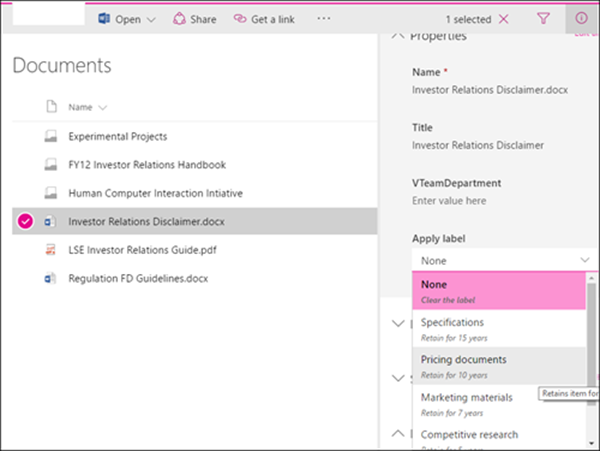
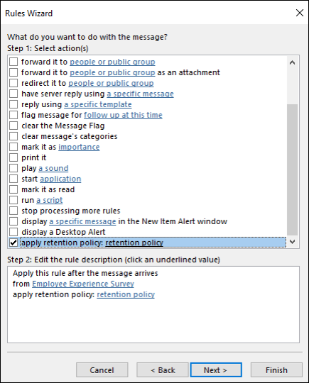

# <a name="create-retention-labels-and-apply-them-in-apps"></a><span data-ttu-id="61e7d-103">Creare etichette di conservazione e applicarle nelle app</span><span class="sxs-lookup"><span data-stu-id="61e7d-103">Create retention labels and apply them in apps</span></span>

><span data-ttu-id="61e7d-104">*[Indicazioni per l'assegnazione di licenze di Microsoft 365 per sicurezza e conformità](https://aka.ms/ComplianceSD).*</span><span class="sxs-lookup"><span data-stu-id="61e7d-104">*[Microsoft 365 licensing guidance for security & compliance](https://aka.ms/ComplianceSD).*</span></span>

> [!NOTE]
> <span data-ttu-id="61e7d-105">Questo scenario è supportato per tutte le configurazioni delle etichette di conservazione, inclusi i [record normativi](records-management.md#records).</span><span class="sxs-lookup"><span data-stu-id="61e7d-105">This scenario is supported for all retention label configurations, including [regulatory records](records-management.md#records).</span></span>

<span data-ttu-id="61e7d-106">Usare le informazioni seguenti per creare e pubblicare [etichette di conservazione](retention.md), e applicarle quindi a documenti e messaggi di posta elettronica.</span><span class="sxs-lookup"><span data-stu-id="61e7d-106">Use the following information to help you create and publish [retention labels](retention.md), and then apply them to documents and emails.</span></span>

<span data-ttu-id="61e7d-107">Le etichette di conservazione aiutano a conservare tutto ciò che serve ed eliminare ciò che non serve al livello dell'elemento (documento o messaggio di posta elettronica).</span><span class="sxs-lookup"><span data-stu-id="61e7d-107">Retention labels help you retain what you need and delete what you don't at the item level (document or email).</span></span> <span data-ttu-id="61e7d-108">Vengono anche usate anche per dichiarare un elemento come record nell'ambito di una soluzione di [gestione dei record](records-management.md) per i dati di Microsoft 365.</span><span class="sxs-lookup"><span data-stu-id="61e7d-108">They are also used to declare an item as a record as part of a [records management](records-management.md) solution for your Microsoft 365 data.</span></span>

<span data-ttu-id="61e7d-109">Rendere disponibili le etichette di conservazione per gli utenti dell'organizzazione in modo che possano classificare il contenuto è un processo in due passaggi:</span><span class="sxs-lookup"><span data-stu-id="61e7d-109">Making retention labels available to people in your organization so that they can classify content is a two-step process:</span></span> 

1. <span data-ttu-id="61e7d-110">Creare le etichette di conservazione.</span><span class="sxs-lookup"><span data-stu-id="61e7d-110">Create the retention labels.</span></span>

2. <span data-ttu-id="61e7d-111">Pubblicare le etichette di conservazione usando un criterio di etichetta di conservazione.</span><span class="sxs-lookup"><span data-stu-id="61e7d-111">Publish the retention labels by using a retention label policy.</span></span>
  


<span data-ttu-id="61e7d-113">Usare le istruzioni seguenti per i due passaggi per l'amministratore.</span><span class="sxs-lookup"><span data-stu-id="61e7d-113">Use the following instructions for the two admin steps.</span></span>

## <a name="before-you-begin"></a><span data-ttu-id="61e7d-114">Informazioni preliminari</span><span class="sxs-lookup"><span data-stu-id="61e7d-114">Before you begin</span></span>

<span data-ttu-id="61e7d-115">L'amministratore globale dell'organizzazione dispone delle autorizzazioni complete per creare e modificare le etichette conservazione e i relativi criteri.</span><span class="sxs-lookup"><span data-stu-id="61e7d-115">The global admin for your organization has full permissions to create and edit retention labels and their policies.</span></span> <span data-ttu-id="61e7d-116">Se non si esegue l'accesso come amministratore globale, vedere le [autorizzazioni necessarie per creare e gestire criteri di conservazione ed etichette di conservazione](get-started-with-retention.md#permissions-required-to-create-and-manage-retention-policies-and-retention-labels).</span><span class="sxs-lookup"><span data-stu-id="61e7d-116">If you aren't signing in as a global admin, see [Permissions required to create and manage retention policies and retention labels](get-started-with-retention.md#permissions-required-to-create-and-manage-retention-policies-and-retention-labels).</span></span>

## <a name="how-to-create-and-publish-retention-labels"></a><span data-ttu-id="61e7d-117">Procedura di creazione e pubblicazione delle etichette di conservazione</span><span class="sxs-lookup"><span data-stu-id="61e7d-117">How to create and publish retention labels</span></span>

<span data-ttu-id="61e7d-118">Creare prima di tutto l'etichetta di conservazione.</span><span class="sxs-lookup"><span data-stu-id="61e7d-118">First, create your retention labels.</span></span> <span data-ttu-id="61e7d-119">Creare quindi un criterio per l'etichetta per rendere le etichette disponibili per l'applicazione nelle app.</span><span class="sxs-lookup"><span data-stu-id="61e7d-119">Then create a label policy to make the labels available to apply in apps.</span></span>

<span data-ttu-id="61e7d-120">La posizione in cui si creano e si configurano le etichette di conservazione varia a seconda che si usi o meno la gestione dei record.</span><span class="sxs-lookup"><span data-stu-id="61e7d-120">Where you create and configure your retention labels depend on whether you're using records management or not.</span></span> <span data-ttu-id="61e7d-121">Sono disponibili istruzioni per entrambi gli scenari.</span><span class="sxs-lookup"><span data-stu-id="61e7d-121">Instructions are provided for both scenarios.</span></span>

### <a name="step-1-create-retention-labels"></a><span data-ttu-id="61e7d-122">Passaggio 1: Creare etichette di conservazione.</span><span class="sxs-lookup"><span data-stu-id="61e7d-122">Step 1: Create retention labels</span></span>

1. <span data-ttu-id="61e7d-123">Nel [Centro conformità Microsoft 365](https://compliance.microsoft.com/) passare a una delle posizioni seguenti:</span><span class="sxs-lookup"><span data-stu-id="61e7d-123">In the [Microsoft 365 compliance center](https://compliance.microsoft.com/), navigate to one of the following locations:</span></span>
    
    - <span data-ttu-id="61e7d-124">Se si usa la gestione dei record:</span><span class="sxs-lookup"><span data-stu-id="61e7d-124">If you are using records management:</span></span>
        - <span data-ttu-id="61e7d-125">**Soluzioni** > **Records management** > scheda **Piano di archiviazione** > **+ Crea un'etichetta** > **Etichetta di conservazione**</span><span class="sxs-lookup"><span data-stu-id="61e7d-125">**Solutions** > **Records management** > **File plan** tab > **+ Create a label** > **Retention label**</span></span>
        
    - <span data-ttu-id="61e7d-126">Se non si usa la gestione dei record:</span><span class="sxs-lookup"><span data-stu-id="61e7d-126">If you are not using records management:</span></span>
       - <span data-ttu-id="61e7d-127">**Soluzioni** > **Governance delle informazioni** > scheda **Etichette** > + **Crea un'etichetta**</span><span class="sxs-lookup"><span data-stu-id="61e7d-127">**Solutions** > **Information governance** > **Labels** tab > + **Create a label**</span></span>
    
    <span data-ttu-id="61e7d-128">L'opzione non è immediatamente visibile?</span><span class="sxs-lookup"><span data-stu-id="61e7d-128">Don't immediately see your option?</span></span> <span data-ttu-id="61e7d-129">Selezionare per prima cosa **Mostra tutto**.</span><span class="sxs-lookup"><span data-stu-id="61e7d-129">First select **Show all**.</span></span> 

2. <span data-ttu-id="61e7d-130">Seguire le istruzioni della procedura guidata.</span><span class="sxs-lookup"><span data-stu-id="61e7d-130">Follow the prompts in the wizard.</span></span> <span data-ttu-id="61e7d-131">Se si usa la gestione dei record:</span><span class="sxs-lookup"><span data-stu-id="61e7d-131">If you are using records management:</span></span>
    
    - <span data-ttu-id="61e7d-132">Per informazioni sui descrittori del piano di archiviazione, vedere [Usare il piano di archiviazione per gestire le etichette di conservazione](file-plan-manager.md).</span><span class="sxs-lookup"><span data-stu-id="61e7d-132">For information about the file plan descriptors, see [Use file plan to manage retention labels](file-plan-manager.md)</span></span>
    
    - <span data-ttu-id="61e7d-133">Per usare le etichette di conservazione per dichiarare i record, selezionare **Contrassegna elementi come record** o **Contrassegna elementi come record normativi**.</span><span class="sxs-lookup"><span data-stu-id="61e7d-133">To use the retention label to declare records, select **Mark items as records**, or **Mark items as regulatory records**.</span></span> <span data-ttu-id="61e7d-134">Per altre informazioni, vedere [Configurare le etichette di conservazione per dichiarare i record](declare-records.md#configuring-retention-labels-to-declare-records).</span><span class="sxs-lookup"><span data-stu-id="61e7d-134">For more information, see [Configuring retention labels to declare records](declare-records.md#configuring-retention-labels-to-declare-records).</span></span>

3. <span data-ttu-id="61e7d-135">Dopo aver creato l’etichetta, quando compare l'opzione per pubblicarla, applicare automaticamente l’etichetta oppure salvarla: selezionare **Salva etichetta per ora** e quindi fare clic su **Fatto**.</span><span class="sxs-lookup"><span data-stu-id="61e7d-135">After you have created the label and you see the options to publish the label, auto-apply the label, or just save the label: Select **Just save the label for now**, and then select **Done**.</span></span>

4. <span data-ttu-id="61e7d-136">Ripetere questi passaggi per creare altre etichette.</span><span class="sxs-lookup"><span data-stu-id="61e7d-136">Repeat these steps to create more labels.</span></span>

<span data-ttu-id="61e7d-137">Per modificare un'etichetta esistente, selezionarla e quindi selezionare l'opzione **Modifica etichetta** per avviare la procedura guidata di modifica che consente di modificare le descrizioni dell'etichetta e qualsiasi [impostazione idonea](#updating-retention-labels-and-their-policies) del passaggio 2.</span><span class="sxs-lookup"><span data-stu-id="61e7d-137">To edit an existing label, select it, and then select the **Edit label** option to start the Edit retention wizard that lets you change the label descriptions and any [eligible settings](#updating-retention-labels-and-their-policies) from step 2.</span></span>

### <a name="step-2-publish-retention-labels"></a><span data-ttu-id="61e7d-138">Passaggio 2: Pubblicare le etichette di conservazione</span><span class="sxs-lookup"><span data-stu-id="61e7d-138">Step 2: Publish retention labels</span></span>

<span data-ttu-id="61e7d-139">Pubblicare le etichette di conservazione in modo che possano essere applicate dagli utenti nelle app, come SharePoint e Outlook.</span><span class="sxs-lookup"><span data-stu-id="61e7d-139">Publish retention labels so that they can be applied by users in apps, such as SharePoint and Outlook.</span></span>

1. <span data-ttu-id="61e7d-140">Nel [Centro conformità Microsoft 365](https://compliance.microsoft.com/) passare a una delle posizioni seguenti:</span><span class="sxs-lookup"><span data-stu-id="61e7d-140">In the [Microsoft 365 compliance center](https://compliance.microsoft.com/), navigate to one of the following locations:</span></span>
    
    - <span data-ttu-id="61e7d-141">Se si usa la gestione dei record:</span><span class="sxs-lookup"><span data-stu-id="61e7d-141">If you are using records management:</span></span>
        - <span data-ttu-id="61e7d-142">**Soluzioni** > **Gestione dei record** scheda > **Criteri delle etichette** > **Pubblica etichette**</span><span class="sxs-lookup"><span data-stu-id="61e7d-142">**Solutions** > **Records management** > > **Label policies** tab > **Publish labels**</span></span>
    
    - <span data-ttu-id="61e7d-143">Se non si usa la gestione dei record:</span><span class="sxs-lookup"><span data-stu-id="61e7d-143">If you are not using records management:</span></span>
        - <span data-ttu-id="61e7d-144">**Soluzioni** > **Governance delle informazioni** > scheda **Criteri delle etichette** > **Pubblica etichette**</span><span class="sxs-lookup"><span data-stu-id="61e7d-144">**Solutions** > **Information governance** > **Label policies** tab > **Publish labels**</span></span>
    
    <span data-ttu-id="61e7d-145">L'opzione non è immediatamente visibile?</span><span class="sxs-lookup"><span data-stu-id="61e7d-145">Don't immediately see your option?</span></span> <span data-ttu-id="61e7d-146">Selezionare per prima cosa **Mostra tutto**.</span><span class="sxs-lookup"><span data-stu-id="61e7d-146">First select **Show all**.</span></span> 

2. <span data-ttu-id="61e7d-147">Seguire le istruzioni della procedura guidata.</span><span class="sxs-lookup"><span data-stu-id="61e7d-147">Follow the prompts in the wizard.</span></span>
    
    <span data-ttu-id="61e7d-148">Per informazioni sulle posizioni supportate dalle etichette di conservazione, vedere la sezione [Etichette di conservazione e posizioni](retention.md#retention-label-policies-and-locations).</span><span class="sxs-lookup"><span data-stu-id="61e7d-148">For information about the locations supported by retention labels, see the [Retention labels and locations](retention.md#retention-label-policies-and-locations) section.</span></span> 

<span data-ttu-id="61e7d-149">Per modificare un criterio esistente delle etichette di conservazione (il tipo di criterio è **Pubblica**), selezionare il criterio e quindi selezionare l’opzione **Modifica** per avviare Modifica criterio di conservazione.</span><span class="sxs-lookup"><span data-stu-id="61e7d-149">To edit an existing retention label policy (the policy type is **Publish**), select it, and then select the **Edit** option to start the Edit retention policy.</span></span> <span data-ttu-id="61e7d-150">Questa procedura guidata consente di modificare la descrizione del criterio e qualsiasi [impostazione idonea](#updating-retention-labels-and-their-policies) del passaggio 2.</span><span class="sxs-lookup"><span data-stu-id="61e7d-150">This wizard lets you change the policy description and any [eligible settings](#updating-retention-labels-and-their-policies) from step 2.</span></span>


## <a name="when-retention-labels-become-available-to-apply"></a><span data-ttu-id="61e7d-151">Tempo necessario prima che le etichette diventino visibili</span><span class="sxs-lookup"><span data-stu-id="61e7d-151">When retention labels become available to apply</span></span>

<span data-ttu-id="61e7d-152">Quando le etichette di conservazione sono pubblicate su SharePoint o OneDrive, di solito sono visibili dagli utenti finali entro un giorno.</span><span class="sxs-lookup"><span data-stu-id="61e7d-152">If you publish retention labels to SharePoint or OneDrive, those labels  typically appear for end users to select within one day.</span></span> <span data-ttu-id="61e7d-153">Tuttavia, considerare un periodo di sette giorni.</span><span class="sxs-lookup"><span data-stu-id="61e7d-153">However, allow up to seven days.</span></span> 

<span data-ttu-id="61e7d-154">Se le etichette sono pubblicate in Exchange, possono essere necessari fino a 10 giorni prima che siano visibili dagli utenti finali, inoltre la cassetta postale deve contenere almeno 10 MB di dati.</span><span class="sxs-lookup"><span data-stu-id="61e7d-154">If you publish retention labels to Exchange, it can take up to seven days for those retention labels to appear for end users, and the mailbox must contain at least 10 MB of data.</span></span>

<span data-ttu-id="61e7d-155">Ad esempio:</span><span class="sxs-lookup"><span data-stu-id="61e7d-155">For example:</span></span>
  

  

<span data-ttu-id="61e7d-157">Se le etichette non compaiono dopo sette giorni, verificare lo **stato** del criterio dell’etichetta selezionandola dalla pagina **Criteri etichetta** nel centro conformità.</span><span class="sxs-lookup"><span data-stu-id="61e7d-157">If the labels don't appear after seven days, check the **Status** of the label policy by selecting it from the **Label policies** page in the compliance center.</span></span> <span data-ttu-id="61e7d-158">Se viene visualizzato lo stato **Disattivato (errore)** e nei dettagli per i percorsi viene visualizzato un messaggio che richiede più tempo del previsto per la distribuzione del criterio (per SharePoint) o per provare a ridistribuire i criteri (per OneDrive), provare a eseguire il comando di PowerShell [Set-RetentionCompliancePolicy](https://docs.microsoft.com/powershell/module/exchange/set-retentioncompliancepolicy) per riprovare la distribuzione dei criteri:</span><span class="sxs-lookup"><span data-stu-id="61e7d-158">If you see the status of **Off (Error)** and in the details for the locations see a message that it's taking longer than expected to deploy the policy (for SharePoint) or to try redeploying the policy (for OneDrive), try running the [Set-RetentionCompliancePolicy](https://docs.microsoft.com/powershell/module/exchange/set-retentioncompliancepolicy) PowerShell command to retry the policy distribution:</span></span>

1. [<span data-ttu-id="61e7d-159">Connettersi a PowerShell in Centro sicurezza e conformità</span><span class="sxs-lookup"><span data-stu-id="61e7d-159">Connect to Security & Compliance Center PowerShell</span></span>](https://docs.microsoft.com/powershell/exchange/connect-to-scc-powershell)

2. <span data-ttu-id="61e7d-160">Eseguire il comando seguente:</span><span class="sxs-lookup"><span data-stu-id="61e7d-160">Run the following command:</span></span>
    
    ``` PowerShell
    Set-RetentionCompliancePolicy -Identity <policy name> -RetryDistribution
   ```

### <a name="how-to-check-on-the-status-of-retention-labels-published-to-exchange"></a><span data-ttu-id="61e7d-161">Come verificare lo stato delle etichette di conservazione pubblicate in Exchange</span><span class="sxs-lookup"><span data-stu-id="61e7d-161">How to check on the status of retention labels published to Exchange</span></span>

<span data-ttu-id="61e7d-162">In Exchange Online le etichette di conservazione vengono rese disponibili agli utenti finali mediante un processo eseguito ogni sette giorni.</span><span class="sxs-lookup"><span data-stu-id="61e7d-162">In Exchange Online, retention labels are made available to end users by a process that runs every seven days.</span></span> <span data-ttu-id="61e7d-163">Usando Powershell è possibile vedere quando è stato eseguito per l'ultima volta questo processo e quindi identificare quando verrà eseguito nuovamente.</span><span class="sxs-lookup"><span data-stu-id="61e7d-163">By using PowerShell, you can see when this process last ran and therefore identify when it will run again.</span></span>
  
1. <span data-ttu-id="61e7d-164">[Connettersi a PowerShell per Exchange Online](https://go.microsoft.com/fwlink/?linkid=799773).</span><span class="sxs-lookup"><span data-stu-id="61e7d-164">[Connect to Exchange Online PowerShell](https://go.microsoft.com/fwlink/?linkid=799773).</span></span>
    
2. <span data-ttu-id="61e7d-165">Eseguire questi comandi.</span><span class="sxs-lookup"><span data-stu-id="61e7d-165">Run these commands.</span></span>
    
   ```powershell
   $logProps = Export-MailboxDiagnosticLogs <user> -ExtendedProperties
   ```

   ```powershell
   $xmlprops = [xml]($logProps.MailboxLog)
   ```

   ```powershell
   $xmlprops.Properties.MailboxTable.Property | ? {$_.Name -like "ELC*"}

In the results, the `ELCLastSuccessTimeStamp` (UTC) property shows when the system last processed your mailbox. If it has not happened since the time you created the policy, the labels are not going to appear. To force processing, run  `Start-ManagedFolderAssistant -Identity <user>`.
    
If labels aren't appearing in Outlook on the web and you think they should be, make sure to clear the cache in your browser (CTRL+F5).
    

## How to apply published retention labels

Use the following sections to learn how published retention labels can be applied in apps:

- [Manually apply retention labels](#manually-apply-retention-labels)

- [Applying a default retention label to all content in a SharePoint library, folder, or document set](#applying-a-default-retention-label-to-all-content-in-a-sharepoint-library-folder-or-document-set)

- [Automatically applying a retention label to email by using rules](#automatically-applying-a-retention-label-to-email-by-using-rules)

In addition, when you use [SharePoint Syntex](../contentunderstanding/index.md) and publish retention labels to SharePoint locations, you can [apply a retention label to a document understanding model](../contentunderstanding/apply-a-retention-label-to-a-model.md) so that identified documents are automatically labeled.

### Manually apply retention labels 

End users, as well as administrators, can manually apply retention labels from the following locations:  

- Outlook and Outlook on the web
    
- OneDrive
    
- SharePoint
    
- Microsoft 365 groups (both the group site and group mailbox in Outlook on the web)
    
Use the following sections to understand how to apply retention labels. 

#### Applying retention labels in Outlook

To label an item in the Outlook desktop client, select the item. On the **Home** tab on the ribbon, click **Assign Policy**, and then choose the retention label. 
  

  
You can also right-click an item, click **Assign Policy** in the context menu, and then choose the retention label. 

After the retention label is applied, you can view that retention label and what action it takes at the top of the item. If an email has a retention label applied that has an associated retention period, you can see at a glance when the email expires.
  
You can also apply retention labels to folders, in which case:
  
- All items in the folder automatically get the same retention label, **except** for items that have had a retention label applied explicitly to them. Explicitly labeled items keep their existing retention label. For more information, see [The principles of retention, or what takes precedence?](retention.md#the-principles-of-retention-or-what-takes-precedence) section on this page. 
    
- If you change or remove the default retention label for a folder, the retention label's also changed or removed for all items in the folder, **except** items with explicitly assigned retention labels. 
    
- If you move an item with a default retention label from one folder to another folder with a different default retention label, the item gets the new default retention label.
    
- If you move an item with a default retention label from one folder to another folder with no default retention label, the old default retention label is removed.

#### Applying retention labels in Outlook on the web

To label an item in Outlook on the web, right-click the item \> **Assign policy** \> choose the retention label. 
  

  
After the retention label is applied, you can view that retention label and what action it takes at the top of the item. If an email is classified and has an associated retention period, you can know at a glance when the email will expire.
  

  
As with Outlook on the web, you can also apply retention labels to folders. 

#### Applying retention labels in OneDrive and SharePoint

To label a document (including OneNote files) in OneDrive or SharePoint, select the item \> in the upper-right corner, choose **Open the details pane** \> **Apply retention label** \> choose the retention label. 
  
You can also apply a retention label to a folder or document set, and you can set a [default retention label for a document library](#applying-a-default-retention-label-to-all-content-in-a-sharepoint-library-folder-or-document-set).
  

  
After a retention label is applied to an item, you can view it in the details pane when that item's selected.
  

  
For SharePoint, but not OneDrive, you can create a view of the library that contains the **Labels** column or **Item is a Record** column. This view lets you see at a glance the retention labels assigned to all items and which items are records. Note, however, that you can't filter the view by the **Item is a Record** column. For instructions how to add columns, see [Show or hide columns in a list or library](https://support.microsoft.com/en-us/office/show-or-hide-columns-in-a-list-or-library-b820db0d-9e3e-4ff9-8b8b-0b2dbefa87e2).


#### Applying retention labels in Microsoft 365 groups

When you publish retention labels to Microsoft 365 groups ([formerly Office 365 groups](https://techcommunity.microsoft.com/t5/microsoft-365-blog/office-365-groups-will-become-microsoft-365-groups/ba-p/1303601)), the retention labels appear in both the group site and group mailbox in Outlook on the web. The experience of applying a retention label to content is identical to that for email and documents.

To retain content for a Microsoft 365 group, use the **Microsoft 365 Groups** location. Even though a Microsoft 365 group has an Exchange mailbox, a retention policy that includes the entire Exchange location won't include content in Microsoft 365 group mailboxes.

In addition, it's not possible to use the Exchange location to include or exclude a specific group mailbox. Although the Exchange location initially allows a group mailbox to be selected, when you try to save the retention policy, you receive an error that "RemoteGroupMailbox" is not a valid selection for the Exchange location.
  
First, create and configure the sensitivity labels that you want to make available for apps and other services. For example, the labels you want users to see and apply from Office apps. 

Then, create one or more label policies that contain the labels and policy settings that you configure. It's the label policy that publishes the labels and settings for your chosen users and locations.

### Applying a default retention label to all content in a SharePoint library, folder, or document set

This method requires retention labels to be published to a retention label policy.

In addition to enabling people to apply a retention label to individual documents, you can also apply a default retention label to a SharePoint library, folder, or document set, so that all documents in that location inherit the default retention label. Although the same label is applied, each document will be retained and deleted separately, according to the start of the retention period setting in the label. 
  
For a document library, the default label configuration is done on the **Library settings** page for a document library. When you choose the default retention label, you can also choose to apply it to existing items in the library. 
  
For example, if you have a retention label for marketing materials, and you know a specific document library contains only that type of content, you can make the **Marketing Materials** retention label the default label for all documents in that library.
  

  
If you apply a default retention label to existing items in the library, folder, or document set:
  
- All items in the library, folder, or document set automatically get the same retention label, **except** for items that already have a retention label applied to them.
    
- If you change or remove the default retention label for a library, folder, or document set, the retention label is also changed or removed for all items in the library, folder, or document set, **except** items that were manually labeled.
    
- If you move an item with a default retention label from one site collection, library, folder, or document set to another site collection, library, folder, or document set that has a different label, the item keeps its existing default retention label, even if the new location has a different default retention label. If the item does not have a label before moving, it will take on the default retention label of the new location.

**Records:** If you apply a default record label to a library, folder, or document set, then a record label is applied to all the individual items within those locations. When you move a new item into a location with a record label, that item is labeled a record. However, if you change the default retention label to a label that doesn't declare content as a record, that action does not remove the record label from the individual items; those items retain their record label. Only a site collection admin can explicitly remove or change the retention label of record items.

For more information about retention labels that declare content as a record, see [Records](records-management.md#records).

### Automatically applying a retention label to email by using rules

In Outlook, you can create rules to apply a retention label.
  
For example, you can create a rule that applies a specific retention label to all messages sent to or from a specific distribution group.
  
To create a rule, right-click an item \> **Rules** \> **Create Rule** \> **Advanced Options** \> **Rules Wizard** \> **apply retention policy**.
  


Although the UI refers to retention policies, it's your retention labels that display here and can be selected, not your retention policies.

## Updating retention labels and their policies

When you edit a retention label or retention label policy, and the retention label or policy is already applied to content, your updated settings will automatically be applied to this content in addition to content that's newly identified.

Some settings can't be changed after the label or policy is created and saved, which include:
- The retention label and policy name, and the retention settings except the retention period. However, you can't change the retention period when the retention period is based on when items were labeled.
- The option to mark items as a record.

## Locking the policy to prevent changes

If you need to ensure that that no one can turn off the policy, delete the policy, or make it less restrictive, see [Use Preservation Lock to restrict changes to retention policies and retention label policies](retention-preservation-lock.md).

## Next steps

Event-based retention is another supported scenario for retention labels. For more information, see the following articles:

- [Start retention when an event occurs](event-driven-retention.md)
- [Automate event-based retention](automate-event-driven-retention.md)
- [Use retention labels to manage the lifecycle of documents stored in SharePoint](auto-apply-retention-labels-scenario.md)
