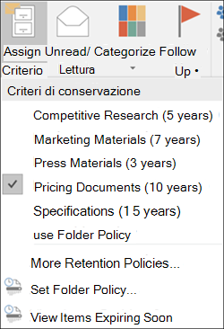

# <a name="create-retention-labels-and-apply-them-in-apps"></a>Creare etichette di conservazione e applicarle nelle app

>*[Indicazioni per l'assegnazione di licenze di Microsoft 365 per sicurezza e conformità](https://aka.ms/ComplianceSD).*

> [!NOTE]
> Questo scenario è supportato per tutte le configurazioni delle etichette di conservazione, inclusi i [record normativi](records-management.md#records).

Usare le informazioni seguenti per creare e pubblicare [etichette di conservazione](retention.md), e applicarle quindi a documenti e messaggi di posta elettronica.

Le etichette di conservazione aiutano a conservare tutto ciò che serve ed eliminare ciò che non serve al livello dell'elemento (documento o messaggio di posta elettronica). Vengono anche usate anche per dichiarare un elemento come record nell'ambito di una soluzione di [gestione dei record](records-management.md) per i dati di Microsoft 365.

Rendere disponibili le etichette di conservazione per gli utenti dell'organizzazione in modo che possano classificare il contenuto è un processo in due passaggi: 

1. Creare le etichette di conservazione.

2. Pubblicare le etichette di conservazione usando un criterio di etichetta di conservazione.
  


Usare le istruzioni seguenti per i due passaggi per l'amministratore.

## <a name="before-you-begin"></a>Informazioni preliminari

L'amministratore globale dell'organizzazione dispone delle autorizzazioni complete per creare e modificare le etichette conservazione e i relativi criteri. Se non si esegue l'accesso come amministratore globale, vedere le [autorizzazioni necessarie per creare e gestire criteri di conservazione ed etichette di conservazione](get-started-with-retention.md#permissions-required-to-create-and-manage-retention-policies-and-retention-labels).

## <a name="how-to-create-and-publish-retention-labels"></a>Procedura di creazione e pubblicazione delle etichette di conservazione

Creare prima di tutto l'etichetta di conservazione. Creare quindi un criterio per l'etichetta per rendere le etichette disponibili per l'applicazione nelle app.

La posizione in cui si creano e si configurano le etichette di conservazione varia a seconda che si usi o meno la gestione dei record. Sono disponibili istruzioni per entrambi gli scenari.

### <a name="step-1-create-retention-labels"></a>Passaggio 1: Creare etichette di conservazione.

1. Nel [Centro conformità Microsoft 365](https://compliance.microsoft.com/) passare a una delle posizioni seguenti:
    
    - Se si usa la gestione dei record:
        - **Soluzioni** > **Records management** > scheda **Piano di archiviazione** > **+ Crea un'etichetta** > **Etichetta di conservazione**
        
    - Se non si usa la gestione dei record:
       - **Soluzioni** > **Governance delle informazioni** > scheda **Etichette** > + **Crea un'etichetta**
    
    L'opzione non è immediatamente visibile? Selezionare per prima cosa **Mostra tutto**. 

2. Seguire le istruzioni della procedura guidata. Se si usa la gestione dei record:
    
    - Per informazioni sui descrittori del piano di archiviazione, vedere [Usare il piano di archiviazione per gestire le etichette di conservazione](file-plan-manager.md).
    
    - Per usare le etichette di conservazione per dichiarare i record, selezionare **Contrassegna elementi come record** o **Contrassegna elementi come record normativi**. Per altre informazioni, vedere [Configurare le etichette di conservazione per dichiarare i record](declare-records.md#configuring-retention-labels-to-declare-records).

3. Dopo aver creato l’etichetta, quando compare l'opzione per pubblicarla, applicare automaticamente l’etichetta oppure salvarla: selezionare **Salva etichetta per ora** e quindi fare clic su **Fatto**.

4. Ripetere questi passaggi per creare altre etichette.

Per modificare un'etichetta esistente, selezionarla e quindi selezionare l'opzione **Modifica etichetta** per avviare la procedura guidata di modifica che consente di modificare le descrizioni dell'etichetta e qualsiasi [impostazione idonea](#updating-retention-labels-and-their-policies) del passaggio 2.

### <a name="step-2-publish-retention-labels"></a>Passaggio 2: Pubblicare le etichette di conservazione

Pubblicare le etichette di conservazione in modo che possano essere applicate dagli utenti nelle app, come SharePoint e Outlook.

1. Nel [Centro conformità Microsoft 365](https://compliance.microsoft.com/) passare a una delle posizioni seguenti:
    
    - Se si usa la gestione dei record:
        - **Soluzioni** > **Gestione dei record** scheda > **Criteri delle etichette** > **Pubblica etichette**
    
    - Se non si usa la gestione dei record:
        - **Soluzioni** > **Governance delle informazioni** > scheda **Criteri delle etichette** > **Pubblica etichette**
    
    L'opzione non è immediatamente visibile? Selezionare per prima cosa **Mostra tutto**. 

2. Seguire le istruzioni della procedura guidata.
    
    Per informazioni sulle posizioni supportate dalle etichette di conservazione, vedere [Etichette di conservazione e posizioni](retention.md#retention-label-policies-and-locations). 

Per modificare un criterio esistente delle etichette di conservazione (il tipo di criterio è **Pubblica**), selezionare il criterio e quindi selezionare l’opzione **Modifica** per avviare Modifica criterio di conservazione. Questa procedura guidata consente di modificare la descrizione del criterio e qualsiasi [impostazione idonea](#updating-retention-labels-and-their-policies) del passaggio 2.


## <a name="when-retention-labels-become-available-to-apply"></a>Tempo necessario prima che le etichette diventino visibili

Quando le etichette di conservazione sono pubblicate su SharePoint o OneDrive, di solito sono visibili dagli utenti finali entro un giorno. Tuttavia, considerare un periodo di sette giorni. 

Se le etichette sono pubblicate in Exchange, possono essere necessari fino a 10 giorni prima che siano visibili dagli utenti finali, inoltre la cassetta postale deve contenere almeno 10 MB di dati.

Ad esempio:
  

  

Se le etichette non compaiono dopo sette giorni, verificare lo **stato** del criterio dell’etichetta selezionandola dalla pagina **Criteri etichetta** nel centro conformità. Se viene visualizzato lo stato **Disattivato (errore)** e nei dettagli per le posizioni viene visualizzato il messaggio che la distribuzione del criterio (per SharePoint) o il tentativo di ridistribuzione dei criteri (per OneDrive) richiede più tempo del previsto, provare a eseguire il comando di PowerShell [Set-RetentionCompliancePolicy](https://docs.microsoft.com/powershell/module/exchange/set-retentioncompliancepolicy) per riprovare la distribuzione dei criteri:

1. [Connettersi a PowerShell in Centro sicurezza e conformità](https://docs.microsoft.com/powershell/exchange/connect-to-scc-powershell)

2. Eseguire il comando seguente:
    
    ``` PowerShell
    Set-RetentionCompliancePolicy -Identity <policy name> -RetryDistribution
   ```

### <a name="how-to-check-on-the-status-of-retention-labels-published-to-exchange"></a>Come verificare lo stato delle etichette di conservazione pubblicate in Exchange

In Exchange Online le etichette di conservazione vengono rese disponibili agli utenti finali mediante un processo eseguito ogni sette giorni. Usando Powershell è possibile vedere quando è stato eseguito per l'ultima volta questo processo e quindi identificare quando verrà eseguito nuovamente.
  
1. [Connettersi a PowerShell per Exchange Online](https://go.microsoft.com/fwlink/?linkid=799773).
    
2. Eseguire questi comandi.
    
   ```powershell
   $logProps = Export-MailboxDiagnosticLogs <user> -ExtendedProperties
   ```

   ```powershell
   $xmlprops = [xml]($logProps.MailboxLog)
   ```

   ```powershell
   $xmlprops.Properties.MailboxTable.Property | ? {$_.Name -like "ELC*"}

In the results, the `ELCLastSuccessTimeStamp` (UTC) property shows when the system last processed your mailbox. If it has not happened since the time you created the policy, the labels are not going to appear. To force processing, run  `Start-ManagedFolderAssistant -Identity <user>`.
    
If labels aren't appearing in Outlook on the web and you think they should be, make sure to clear the cache in your browser (CTRL+F5).
    

## How to apply published retention labels

Use the following sections to learn how published retention labels can be applied in apps:

- [Manually apply retention labels](#manually-apply-retention-labels)

- [Applying a default retention label to all content in a SharePoint library, folder, or document set](#applying-a-default-retention-label-to-all-content-in-a-sharepoint-library-folder-or-document-set)

- [Automatically applying a retention label to email by using rules](#automatically-applying-a-retention-label-to-email-by-using-rules)

In addition, when you use [SharePoint Syntex](../contentunderstanding/index.md) and publish retention labels to SharePoint locations, you can [apply a retention label to a document understanding model](../contentunderstanding/apply-a-retention-label-to-a-model.md) so that identified documents are automatically labeled.

After content is labeled, see the following information to understand when the applied label can be removed or changed: [Only one retention label at a time](retention.md#only-one-retention-label-at-a-time).

### Manually apply retention labels 

End users, as well as administrators, can manually apply retention labels from the following locations:  

- Outlook and Outlook on the web
    
- OneDrive
    
- SharePoint
    
- Microsoft 365 groups (both the group site and group mailbox in Outlook on the web)
    
Use the following sections to understand how to apply retention labels. 

#### Applying retention labels in Outlook

To label an item in the Outlook desktop client, select the item. On the **Home** tab on the ribbon, click **Assign Policy**, and then choose the retention label. 
  

  
You can also right-click an item, click **Assign Policy** in the context menu, and then choose the retention label. 

After the retention label is applied, you can view that retention label and what action it takes at the top of the item. If an email has a retention label applied that has an associated retention period, you can see at a glance when the email expires.

##### Applying a default retention label to an Outlook folder

You can apply retention labels to Outlook folders as a default label that can be inherited by messages in that folder. Right-click the folder, select **Properties**, the **Policy** tab, and select the retention label you want to use as that folder's default retention label.

When you use a a standard retention label as your default label for an Outlook folder:
  
- All unlabeled items in the folder have this retention label applied.

- The inheritance flows to any child folders and items inherit the label from their nearest folder.

- Items that are already labeled retain their retention label, unless it was applied by a different default label.

- If you change or remove the default retention label for the folder: Existing retention labels applied to items in that folder are also changed or removed only if those labels were applied by a default label.

- If you move an item with a default retention label from one folder to another folder with a different default retention label: The item gets the new default retention label.

- If you move an item with a default retention label from one folder to another folder with no default retention label: The old default retention label is removed.

When labels are applied that aren't standard retention labels but mark items as [records (or regulatory records)](records-management.md#records), these labels can only be manually changed or removed.

#### Applying retention labels in Outlook on the web

To label an item in Outlook on the web, right-click the item \> **Assign policy** \> choose the retention label. 
  

  
After the retention label is applied, you can view that retention label and what action it takes at the top of the item. If an email is classified and has an associated retention period, you can know at a glance when the email will expire.
  

  
As with the desktop version of Outlook on the web, you can also apply retention labels to folders. Right-click the folder, select **Assign policy**, and change **Use parent folder policy** to the retention label you want to use as that folder's default retention label.

#### Applying retention labels in OneDrive and SharePoint

To label a document (including OneNote files) in OneDrive or SharePoint, select the item \> in the upper-right corner, choose **Open the details pane** \> **Apply retention label** \> choose the retention label. 
  
You can also apply a retention label to a folder or document set, and you can set a [default retention label for a document library](#applying-a-default-retention-label-to-all-content-in-a-sharepoint-library-folder-or-document-set).
  

  
After a retention label is applied to an item, you can view it in the details pane when that item's selected.
  

  
For SharePoint, but not OneDrive, you can create a view of the library that contains the **Labels** column or **Item is a Record** column. This view lets you see at a glance the retention labels assigned to all items and which items are records. Note, however, that you can't filter the view by the **Item is a Record** column. For instructions how to add columns, see [Show or hide columns in a list or library](https://support.microsoft.com/en-us/office/show-or-hide-columns-in-a-list-or-library-b820db0d-9e3e-4ff9-8b8b-0b2dbefa87e2).


#### Applying retention labels in Microsoft 365 groups

When you publish retention labels to Microsoft 365 groups ([formerly Office 365 groups](https://techcommunity.microsoft.com/t5/microsoft-365-blog/office-365-groups-will-become-microsoft-365-groups/ba-p/1303601)), the retention labels appear in both the group site and group mailbox in Outlook on the web. The experience of applying a retention label to content is identical to that for email and documents.

To retain content for a Microsoft 365 group, use the **Microsoft 365 Groups** location. Even though a Microsoft 365 group has an Exchange mailbox, a retention policy that includes the entire Exchange location won't include content in Microsoft 365 group mailboxes.

In addition, it's not possible to use the Exchange location to include or exclude a specific group mailbox. Although the Exchange location initially allows a group mailbox to be selected, when you try to save the retention policy, you receive an error that "RemoteGroupMailbox" is not a valid selection for the Exchange location.
  
First, create and configure the sensitivity labels that you want to make available for apps and other services. For example, the labels you want users to see and apply from Office apps. 

Then, create one or more label policies that contain the labels and policy settings that you configure. It's the label policy that publishes the labels and settings for your chosen users and locations.

### Applying a default retention label to all content in a SharePoint library, folder, or document set

This method requires retention labels to be published to a retention label policy.

In addition to letting people apply a retention label to individual documents, you can also apply a default retention label to a SharePoint library, folder, or document set. In this scenario, documents in that location can inherit your selected default retention label. Although the same label is applied, each document will be retained and deleted separately, according to the start of the retention period setting in the label. 
  
For a document library, the default label configuration is done on the **Library settings** page for a document library. When you choose the default retention label, you can also choose to apply it to existing items in the library.
  
For example, if you have a retention label for marketing materials, and you know a specific document library contains only that type of content, you can make the **Marketing Materials** retention label the default label for all documents in that library.
  


#### Label behavior when you use a default label for SharePoint

For standard retention labels that you apply as a default retention label to a library, folder, or document set:

- All new, unlabeled items in the container will have this retention label applied.

- For folders, the inheritance flows to any child folders and items inherit the label from their nearest folder.

- If you selected the option to apply the default label to existing items: Items that are already labeled retain their retention label, unless it was applied by a different default label.
    
- If you change the default retention label for the container: Existing retention labels applied to items in that container are changed only if you selected the option to apply the default label to existing items and those labels were applied by a default label.

- If you remove the default retention label for the container: Items retain their labels.
    
- If you move an item with a default retention label applied from one container to another container: The item keeps its existing default retention label, even if the new location has a different default retention label. Only if you then change the default label for this new location can the moved item inherit the default label from its current location.

When labels are applied that aren't standard retention labels but mark items as [records (or regulatory records)](records-management.md#records), these labels can only be manually changed or removed.

### Automatically applying a retention label to email by using rules

In Outlook, you can create rules to apply a retention label.
  
For example, you can create a rule that applies a specific retention label to all messages sent to or from a specific distribution group.
  
To create a rule, right-click an item \> **Rules** \> **Create Rule** \> **Advanced Options** \> **Rules Wizard** \> **apply retention policy**.
  


Although the UI refers to retention policies, it's your retention labels that display here and can be selected, not your retention policies.

## Updating retention labels and their policies

When you edit a retention label or retention label policy, and the retention label or policy is already applied to content, your updated settings will automatically be applied to this content in addition to content that's newly identified.

Some settings can't be changed after the label or policy is created and saved, which include:
- The retention label and policy name, and the retention settings except the retention period. However, you can't change the retention period when the retention period is based on when items were labeled.
- The option to mark items as a record.

### Deleting retention labels

You can delete retention labels that aren't currently included in any retention label policies, that aren't configured for event-based retention, or mark items as regulatory records. The ability to delete retention labels that mark items as records is currently rolling out in preview.

For retention labels that you can delete, if they have been applied to items, the deletion fails and you see a link to content explorer to identify the labeled items.

However, it can take up to two days for content explorer to show the items that are labeled. In this scenario, the retention label might be deleted without showing you the link to content explorer.

## Locking the policy to prevent changes

If you need to ensure that no one can turn off the policy, delete the policy, or make it less restrictive, see [Use Preservation Lock to restrict changes to retention policies and retention label policies](retention-preservation-lock.md).

## Next steps

Event-based retention is another supported scenario for retention labels. For more information, see the following articles:

- [Start retention when an event occurs](event-driven-retention.md)
- [Automate event-based retention](automate-event-driven-retention.md)
- [Use retention labels to manage the lifecycle of documents stored in SharePoint](auto-apply-retention-labels-scenario.md)
