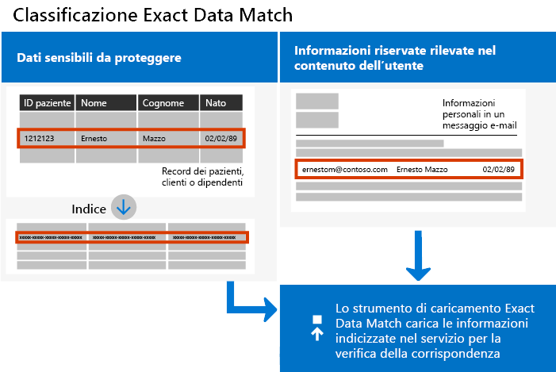

# <a name="create-custom-sensitive-information-types-with-exact-data-match-based-classification"></a>Creare tipi di informazioni sensibili personalizzati con classificazione esatta basata su Exact Data Match

I[ tipi di informazioni riservate personalizzati](sensitive-information-type-learn-about.md)vengono usate per identificare gli elementi sensibili in modo che sia possibile impedire la condivisione inavvertita o inappropriata. È possibile definire un tipo di informazioni sensibile personalizzato basato su:

- criteri
- evidenza di parole chiave, ad esempio *dipendente*,*badge*, o *ID*
- vicinanza del carattere all'evidenza in un modello specifico
- livello di probabilità

 Questi tipi di informazioni sensibili personalizzati soddisfano le esigenze aziendali di molte organizzazioni.

Ma cosa succede se si vuole un tipo di informazioni sensibili personalizzato che usi valori di dati esatti, anziché uno che trova le corrispondenze in base a criteri generici ? Con la classificazione basata su Exact Data Match (EDM) è possibile creare un tipo di informazioni sensibili personalizzato che sia progettato per:

- essere dinamico e facilmente aggiornabile
- offrire maggiore scalabilità
- produrre meno falsi positivi
- usare dati sensibili strutturati
- gestire le informazioni sensibili in modo più sicuro
- essere usato con più servizi cloud Microsoft



La classificazione basata su EDM consente di creare tipi di informazioni sensibili personalizzati che fanno riferimento a valori esatti in un database di informazioni sensibili. Il database può essere aggiornato giornalmente e può contenere un massimo di 100 milioni di righe di dati. I dipendenti, i pazienti o i clienti vanno e vengono e i record cambiano, i tipi di informazioni sensibili personalizzati rimangono aggiornati e disponibili. È anche possibile usare una classificazione basata su EDM con criteri, ad esempio i [criteri di prevenzione della perdita dei dati](data-loss-prevention-policies.md) (DLP) o i [criteri dei file di Microsoft Cloud App Security](https://docs.microsoft.com/cloud-app-security/data-protection-policies).

> [!NOTE]
> Microsoft 365 Information Protection supporta in anteprima i set di caratteri a due byte per le lingue seguenti:
> - Cinese (semplificato)
> - Cinese (tradizionale)
> - Coreano
> - Giapponese
> 
> Il supporto è disponibile per i tipi di informazioni sensibili. Per altre informazioni, vedere [Note sulla versione del supporto della protezione delle informazioni per i set di caratteri a due byte (anteprima)](mip-dbcs-relnotes.md).

## <a name="required-licenses-and-permissions"></a>Licenze e autorizzazioni obbligatorie

È necessario essere un amministratore globale, di conformità o di Exchange Online per eseguire le attività descritte in questo articolo. Per ulteriori informazioni sulle autorizzazioni DLP, vedere [Autorizzazioni](data-loss-prevention-policies.md#permissions).

La classificazione basata su EDM è inclusa negli abbonamenti

- Office 365 E5
- Microsoft 365 E5
- Conformità Microsoft 365 E5
- Microsoft E5/A5 Information Protection and Governance

## <a name="portal-links-for-your-subscription"></a>Collegamenti a portali per l'abbonamento


|Portale  |Tutto il mondo/GCC  |GCC-High  |DOD  |
|---------|---------|---------|---------|
|Office SCC     |  protection.office.com       |scc.office365.us         |scc.protection.apps.mil |
|Centro sicurezza Microsoft 365     |security.microsoft.com         |security.microsoft.us         |security.apps.mil|
|Centro conformità Microsoft 365     |compliance.microsoft.com         |compliance.microsoft.us         |compliance.apps.mil|


## <a name="the-work-flow-at-a-glance"></a>Flusso di lavoro in breve

|Fase  |Cosa serve  |
|---------|---------|
|[Parte 1: impostazione della classificazione basata su EDM](#part-1-set-up-edm-based-classification)<br/><br/>(In base alle esigenze)<br/>- [Modificare lo schema del database](#editing-the-schema-for-edm-based-classification) <br/>- [Rimuovere lo schema](#removing-the-schema-for-edm-based-classification) |- Accesso in lettura ai dati sensibili<br/>- Schema del database nel formato .xml (esempio fornito)<br/>- Pacchetto di regole nel formato .xml (esempio fornito)<br/>- Autorizzazioni di amministratore al Centro sicurezza e conformità (utilizzando PowerShell) |
|[Parte 2: Hash e caricare i dati sensibili](#part-2-hash-and-upload-the-sensitive-data)<br/><br/>(In base alle esigenze)<br/>[Aggiornare i dati](#refreshing-your-sensitive-information-database) |- Gruppo di sicurezza personalizzato e account utente<br/>- Accesso come amministratore locale al computer con l’Agente di caricamento di EDM<br/>- Accesso in lettura ai dati sensibili<br/>- Procedura e programmazione per l'aggiornamento dei dati|
|[Parte 3: usare la classificazione basata su EDM con i servizi Microsoft Cloud](#part-3-use-edm-based-classification-with-your-microsoft-cloud-services) |- Abbonamento a Microsoft 365 con DLP<br/>- Funzionalità della classificazione basata su EDM abilitata |

### <a name="part-1-set-up-edm-based-classification"></a>Parte 1: impostazione della classificazione basata su EDM

L’impostazione e la configurazione di una classificazione basata su EDM implica:

1. [Salvare dei dati sensibili in formato .csv](#save-sensitive-data-in-csv-format)
2. [Definire lo schema del database delle informazioni sensibili](#define-the-schema-for-your-database-of-sensitive-information)
3. [Creare un pacchetto di regole](#set-up-a-rule-package)


#### <a name="save-sensitive-data-in-csv-format"></a>Salvare dei dati sensibili in formato .csv

1. Identificare le informazioni sensibili da usare. Esportare i dati in un'app, come Microsoft Excel e salvare il file in formato .csv. Il file di dati può includere al massimo:
      - Fino a 100 milioni di righe di dati sensibili
      - Fino a 32 colonne (campi) per origine dati
      - Fino a 5 colonne (campi) contrassegnate come ricercabile

2. Strutturare i dati sensibili nel file .csv in modo che la prima riga includa i nomi dei campi usati per la classificazione basata su EDM. Nel file .csv potrebbero essere presenti nomi di campo, come "ssn", "birthdate", "firstname", "lastname". I nomi delle intestazioni di colonna non possono includere spazi o caratteri di sottolineatura. Ad esempio, il file .cvs di esempio usato in questo articolo è denominato *PatientRecords. csv* e le relative colonne includono *PatientID*, *MRN*, *LastName*, *FirstName*, *SSN* e così via.

3. Prestare attenzione al formato dei campi di dati sensibili. In particolare, durante l'analisi con lo strumento EDM, i campi che possono contenere virgole (ad esempio un indirizzo contenente il valore "Seattle,WA") sarebbero analizzati come due campi separati. Per evitare il problema, bisogna assicurare che tali campi siano racchiusi da virgolette singole o doppie nella tabella dei dati sensibili. Se i campi con virgole possono contenere anche spazi, è necessario creare un tipo di informazioni sensibili personalizzato associato al formato corrispondente, ad esempio una stringa con più parole contenente virgole e spazi, per assicurare che la stringa sia abbinata correttamente quando il documento viene analizzato.

#### <a name="define-the-schema-for-your-database-of-sensitive-information"></a>Definire lo schema per il database delle informazioni sensibili

Se, per motivi aziendali o tecnici, si preferisse non usare PowerShell o la riga di comando per creare il proprio schema e un modello per le informazioni sensibili di tipo EDM (pacchetto di regole), sarebbe possibile usare [lo schema Exact Data Match e la procedura guidata per il tipo di informazioni sensibili](sit-edm-wizard.md) per crearli. Una volta completata la creazione dello schema e il modello per le informazioni sensibili di tipo EDM, completare tutti i passaggi necessari per rendere le informazioni sensibili basate sul tipo EDM disponibili per l'utilizzo.

> [!NOTE]
> Lo schema Exact Data Match e la procedura guidata per il tipo di informazioni sensibili sono disponibili unicamente per i cloud World Wide e GCC.

1. Definire lo schema per il database delle informazioni sensibili nel formato .xml (come riportato nell'esempio seguente). Assegnare al file dello schema il nome **edm.xml** e configurarlo in modo che per ogni colonna del database sia presente una riga che usi la sintassi: 

      `\<Field name="" searchable=""/\>`.

      - Usare i nomi delle colonne per i valori dei *nomi dei campi*.
      - Usare *searchable="true"* per un massimo di 5 campi che si desidera cercare. Almeno un campo deve essere disponibile per la ricerca.

      Ad esempio, il seguente file XML definisce lo schema per un database dei record dei pazienti, con cinque campi specificati come ricercabili: *IDPaziente*, *MRN*, *CF*, *Telefono* e *Data nasc.*.

      (È possibile copiare, modificare e usare l'esempio.)

      ```xml
      <EdmSchema xmlns="http://schemas.microsoft.com/office/2018/edm">
            <DataStore name="PatientRecords" description="Schema for patient records" version="1">
                  <Field name="PatientID" searchable="true" caseInsensitive="true" ignoredDelimiters="-,/,*,#,^" />
                  <Field name="MRN" searchable="true" />
                  <Field name="FirstName" />
                  <Field name="LastName" />
                  <Field name="SSN" searchable="true" />
                  <Field name="Phone" searchable="true" />
                  <Field name="DOB" searchable="true" />
                  <Field name="Gender" />
                  <Field name="Address" />
            </DataStore>
      </EdmSchema>
      ```

##### <a name="configurable-match-using-the-caseinsensitive-and-ignoreddelimiters-fields"></a>Corrispondenza configurabile con i campi caseInsensitive e ignoredDelimiters

L'esempio XML riportato in precedenza usa i campi `caseInsensitive` e `ignoredDelimiters`. 

Se si include il campo ***caseInsensitive** _ impostato sul valore `true` nella definizione dello schema, EDM non escluderà un elemento in base alle differenze tra maiuscole e minuscole per il campo `PatientID`. EDM identificherà `PatientID` _ *FOO-1234** e **fOo-1234** come identici.

Quando si include il campo ***ignoredDelimiters** _ con caratteri supportati, EDM ignorerà tali caratteri in `PatientID`. Pertanto, EDM considererà `PatientID` _ *FOO-1234** e `PatientID` **FOO#1234** identici. Il contrassegno `ignoredDelimiters` supporta qualsiasi carattere non alfanumerico. Ecco alcuni esempi:
- \.
- \-
- \/
- \_
- \*
- \^
- \#
- \!
- \?
- \[
- \]
- \{
- \}
- \\
- \~
- \; 

- Il contrassegno `ignoredDelimiters` non supporta:
- Caratteri 0-9
- A-Z
- a-z
- \"
- \,

In questo esempio in cui vengono usati `caseInsensitive` e `ignoredDelimiters`, EDM identifica **FOO-1234** e **fOo # 1234** come identici e classifica l'elemento come un tipo di informazioni sensibili del record del paziente. 

4. Connettersi al Centro sicurezza e conformità seguendo le procedure in [Connettersi a PowerShell per Centro sicurezza e conformità](https://docs.microsoft.com/powershell/exchange/connect-to-scc-powershell).

5. Per caricare lo schema di database, eseguire i cmdlet seguenti, uno alla volta:

      ```powershell
      $edmSchemaXml=Get-Content .\\edm.xml -Encoding Byte -ReadCount 0
      New-DlpEdmSchema -FileData $edmSchemaXml -Confirm:$true
      ```

      Verrà richiesto di confermare, come illustrato di seguito:

      > Conferma
      >
      > Eseguire questa azione?
      >
      > Viene importato il nuovo schema EDM per l'archivio dati 'patientrecords'.
      >
      > \[Y\] Sì \[A\] Sì, tutti \[N\] No \[L\] No, tutti \[?\] Guida (l'impostazione predefinita è "Y"):

> [!TIP]
> Se si vuole che le modifiche vengano eseguite senza conferma, al passaggio 5, usare questo cmdlet: New-DlpEdmSchema -FileData $edmSchemaXml

> [!NOTE]
> L'aggiornamento dello schema EDM impiega tra i 10 e i 60 minuti con aggiunte. Completare l'aggiornamento prima di eseguire i passaggi che usano le aggiunte.

#### <a name="set-up-a-rule-package"></a>Configurare un pacchetto di regole

1. Creare un pacchetto di regole nel formato .xml (con codifica Unicode), come illustrato nell'esempio seguente. (È possibile copiare, modificare e usare l'esempio.)

      Quando si configura il pacchetto di regole, assicurarsi di fare riferimento correttamente al file .csv e al file **edm.xml**. È possibile copiare, modificare e usare l'esempio. In questo XML di esempio è necessario personalizzare i campi seguenti per creare un tipo di informazioni sensibili di EDM:

      - **RulePack id & ExactMatch id**: usare [New-GUID](https://docs.microsoft.com/powershell/module/microsoft.powershell.utility/new-guid?view=powershell-6) per generare un GUID.

      - **Datastore**: questo campo specifica l'archivio dati di ricerca EDM da usare. È possibile specificare il nome di un'origine dati di uno schema EDM configurato.

      - **idMatch**: questo campo punta all'elemento primario per EDM.
        - Matches: specifica il campo da usare nella ricerca esatta. È possibile specificare il nome campo ricercabile nello schema EDM per DataStore.
        - Classification: questo campo specifica la corrispondenza del tipo di informazioni sensibili che attiva la ricerca EDM. È possibile specificare il nome o il GUID di un tipo di informazioni sensibili predefinito o personalizzato esistente. Tenere presente che qualsiasi stringa che corrisponde al tipo di informazioni sensibili specificato verrà sottoposta ad hashing e confrontata con ogni voce nella tabella delle informazioni sensibili. Per evitare di causare problemi di prestazioni, se in EDM si usa un tipo di informazioni sensibili personalizzato come elemento Classification, evitare di usarne uno che corrisponda a una percentuale elevata di contenuto, ad esempio "qualsiasi numero" o "qualsiasi parola di cinque lettere". A questo scopo, aggiungere parole chiave di supporto o includere la formattazione nella definizione del tipo di informazioni sensibili per la classificazione personalizzata. 

      - **Match:** questo campo indica altre evidenze disponibili in prossimità di idMatch.
        - Matches: è possibile specificare qualsiasi nome campo nello schema EDM per DataStore.
      - **Resource:** questa sezione specifica il nome e la descrizione per il tipo di informazioni sensibili in più impostazioni locali.
        - idRef: è possibile specificare il GUID per l'ID ExactMatch.
        - Name e descriptions: personalizzare in base alle esigenze.

      ```xml
      <RulePackage xmlns="http://schemas.microsoft.com/office/2018/edm">
        <RulePack id="fd098e03-1796-41a5-8ab6-198c93c62b11">
          <Version build="0" major="2" minor="0" revision="0" />
          <Publisher id="eb553734-8306-44b4-9ad5-c388ad970528" />
          <Details defaultLangCode="en-us">
            <LocalizedDetails langcode="en-us">
              <PublisherName>IP DLP</PublisherName>
              <Name>Health Care EDM Rulepack</Name>
              <Description>This rule package contains the EDM sensitive type for health care sensitive types.</Description>
            </LocalizedDetails>
          </Details>
        </RulePack>
        <Rules>
          <ExactMatch id = "E1CC861E-3FE9-4A58-82DF-4BD259EAB371" patternsProximity = "300" dataStore ="PatientRecords" recommendedConfidence = "65" >
            <Pattern confidenceLevel="65">
              <idMatch matches = "SSN" classification = "U.S. Social Security Number (SSN)" />
            </Pattern>
            <Pattern confidenceLevel="75">
              <idMatch matches = "SSN" classification = "U.S. Social Security Number (SSN)" />
              <Any minMatches ="3" maxMatches ="6">
                <match matches="PatientID" />
                <match matches="MRN"/>
                <match matches="FirstName"/>
                <match matches="LastName"/>
                <match matches="Phone"/>
                <match matches="DOB"/>
              </Any>
            </Pattern>
          </ExactMatch>
          <LocalizedStrings>
            <Resource idRef="E1CC861E-3FE9-4A58-82DF-4BD259EAB371">
              <Name default="true" langcode="en-us">Patient SSN Exact Match.</Name>
              <Description default="true" langcode="en-us">EDM Sensitive type for detecting Patient SSN.</Description>
            </Resource>
          </LocalizedStrings>
        </Rules>
      </RulePackage>
      ```

2. Per caricare il pacchetto di regole, eseguire i seguenti cmdlet di PowerShell, uno alla volta:

      ```powershell
      $rulepack=Get-Content .\\rulepack.xml -Encoding Byte -ReadCount 0
      New-DlpSensitiveInformationTypeRulePackage -FileData $rulepack
      ```

A questo punto è stata configurata la classificazione basata su EDM. Il passaggio successivo consiste nell'eseguire l’hashing dei i dati sensibili e poi di caricare gli hash per indicizzarli.

Ricordarsi della procedura precedente in cui lo schema di PatientRecords definisce cinque campi come ricercabili: *PatientID*, *MRN*, *SSN*, *Telefono* e *DOB*. Il pacchetto di regole di esempio include questi campi e fa riferimento al file schema di database (**edm.xml**), con un unico elemento *ExactMatch* per ogni campo ricercabile. Considerare l'elemento ExactMatch seguente:

```xml
<ExactMatch id = "E1CC861E-3FE9-4A58-82DF-4BD259EAB371" patternsProximity = "300" dataStore ="PatientRecords" recommendedConfidence = "65" >
      <Pattern confidenceLevel="65">
        <idMatch matches = "SSN" classification = "U.S. Social Security Number (SSN)" />
      </Pattern>
      <Pattern confidenceLevel="75">
        <idMatch matches = "SSN" classification = "U.S. Social Security Number (SSN)" />
        <Any minMatches ="3" maxMatches ="100">
          <match matches="PatientID" />
          <match matches="MRN"/>
          <match matches="FirstName"/>
          <match matches="LastName"/>
          <match matches="Phone"/>
          <match matches="DOB"/>
        </Any>
      </Pattern>
    </ExactMatch>
```

Utilizzando l'esempio proposto, osservare:

- Il nome del dataStore fa riferimento al file .csv creato in precedenza: **dataStore = "PatientRecords"**.

- Il valore idMatch fa riferimento a un campo ricercabile elencato nel file di schema del database: **idMatch matches = "SSN"**.

- Il valore di classificazione fa riferimento a un tipo di informazioni riservate esistente o personalizzato: **classificazione = "Stati Uniti - Numero di previdenza sociale (SSN)”**. In questo caso, viene usato il tipo di informazioni sensibili esistente del Numero di previdenza sociale degli Stati Uniti.

> [!NOTE]
> L'aggiornamento dello schema EDM impiega tra i 10 e i 60 minuti con aggiunte. Completare l'aggiornamento prima di eseguire i passaggi che usano le aggiunte.

#### <a name="editing-the-schema-for-edm-based-classification"></a>Modificare lo schema per la classificazione basata su EDM

Se si vogliono apportare modifiche al file **edm.xml**, ad esempio modificare i campi usati per la classificazione basata su EDM, procedere come segue:

> [!TIP]
> È possibile modificare lo schema EDM e il file di dati per sfruttare la **corrispondenza configurabile**. Se configurato, EDM ignora le differenze tra maiuscole e minuscole e alcuni delimitatori nella valutazione di un elemento. Ciò consente di definire più facilmente gli schemi XML e i file di dati sensibili. Per altre informazioni, vedere [Modificare lo schema Exact Data Match per usare la corrispondenza configurabile](sit-modify-edm-schema-configurable-match.md).

1. Modificare il file **edm.xml** (il file descritto nella sezione [Definisci lo schema](#define-the-schema-for-your-database-of-sensitive-information) di questo articolo).

2. Connettersi al Centro sicurezza e conformità seguendo le procedure in [Connettersi a PowerShell per Centro sicurezza e conformità](https://docs.microsoft.com/powershell/exchange/connect-to-scc-powershell).

3. Per aggiornare lo schema di database, eseguire i cmdlet seguenti, uno alla volta:

      ```powershell
      $edmSchemaXml=Get-Content .\\edm.xml -Encoding Byte -ReadCount 0
      Set-DlpEdmSchema -FileData $edmSchemaXml -Confirm:$true
      ```

      Verrà richiesto di confermare, come illustrato di seguito:

      > Conferma
      >
      > Eseguire questa azione?
      >
      > Viene aggiornato lo schema EDM per l'archivio dati 'patientrecords'.
      >
      > \[Y\] Sì \[A\] Sì, tutti \[N\] No \[L\] No, tutti \[?\] Guida (l'impostazione predefinita è "Y"):

      > [!TIP]
      > Se si vuole che le modifiche vengano eseguite senza conferma, al passaggio 3, usare questo cmdlet: Set-DlpEdmSchema -FileData $edmSchemaXml

      > [!NOTE]
      > L'aggiornamento dello schema EDM impiega tra i 10 e i 60 minuti con aggiunte. Completare l'aggiornamento prima di eseguire i passaggi che usano le aggiunte.

#### <a name="removing-the-schema-for-edm-based-classification"></a>Rimuovere lo schema per la classificazione basata su EDM

(Se necessario) Se si vuole rimuovere lo schema usato per la classificazione basata su EDM, procedere come segue:

1. Connettersi al Centro sicurezza e conformità seguendo le procedure in [Connettersi a PowerShell per Centro sicurezza e conformità](https://docs.microsoft.com/powershell/exchange/connect-to-scc-powershell).

2. Eseguire i cmdlet di PowerShell seguenti, sostituendo il nome dell'archivio dati di "patient records" con quello che si vuole rimuovere:

      ```powershell
      Remove-DlpEdmSchema -Identity patientrecords
      ```

      Verrà richiesto di confermare:

      > Conferma
      >
      > Eseguire questa azione?
      >
      > Viene rimosso lo schema EDM per l'archivio dati 'patientrecords'.
      >
      > \[Y\] Sì \[A\] Sì, tutti \[N\] No \[L\] No, tutti \[?\] Guida (l'impostazione predefinita è "Y"):

      > [!TIP]
      >  Se si vuole che le modifiche vengano eseguite senza conferma, al passaggio 2, usare questo cmdlet: Remove-DlpEdmSchema -Identity patientrecords -Confirm:$false

### <a name="part-2-hash-and-upload-the-sensitive-data"></a>Parte 2: eseguire hashing e caricare i dati sensibili

In questa fase è possibile impostare un gruppo di sicurezza personalizzato e un account utente e configurare lo strumento Agente di caricamento di EDM. Successivamente, è possibile usare lo strumento per eseguire l’hashing con i valori salt dei dati sensibili, e poi caricarli.

L’hashing e il caricamento può essere eseguito con un computer oppure è possibile separare la procedura di hashing da quello di caricamento per una maggiore sicurezza.

Se si vuole eseguire l'hashing e il caricamento da un computer, è necessario farlo da uno che può connettersi direttamente al tenant di Microsoft 365. È necessario che i file dati di testo sensibili non crittografati siano presenti sul computer per l'hashing.

Se non si vuole esporre file dati di testo sensibili non crittografati, è possibile inserirlo in un computer in un percorso sicuro e quindi copiare il file hash e il file salt in un computer che può connettersi direttamente al tenant di Microsoft 365 per il caricamento. In questo scenario sarà necessario l’EDMUploadAgent su entrambi i computer.

> [!IMPORTANT]
> Se si usa lo schema Exact Data Match e la procedura guidata per il tipo di informazioni sensibili per creare il proprio schema e i file modello, è ***necessario** scaricare lo schema per questa procedura.

#### <a name="prerequisites"></a>Prerequisiti

- un account aziendale o dell'Istituto di istruzione per Microsoft 365, che verrà aggiunto al gruppo di sicurezza **EDM\_datauploaders**
- un computer Windows 10 o Windows Server 2016 con versione .NET 4.6.2 per l'esecuzione di EDMUploadAgent
- una directory nel computer di caricamento per:
    -  EDMUploadAgent
    - il file di elemento sensibile in formato CSV **PatientRecords. csv** negli esempi
    -  e i file di output hash e salt
    - il nome del datastore dal file **edm.xml**, for quest’esempio `PatientRecords`
- Se si usano [lo schema Exact Data Match e la procedura guidata per il tipo di informazioni sensibili](sit-edm-wizard.md) è ***necessario*** scaricarli

#### <a name="set-up-the-security-group-and-user-account"></a>Impostare il gruppo di sicurezza e l'account utente

1. Come amministratore globale, passare all'interfaccia di amministrazione usando il [collegamento appropriato per l'abbonamento in uso](#portal-links-for-your-subscription) e [creare un gruppo di sicurezza](https://docs.microsoft.com/office365/admin/email/create-edit-or-delete-a-security-group?view=o365-worldwide) denominato **EDM\_ DataUploaders**.

2. Aggiungere uno o più utenti al gruppo di sicurezza **EDM\_DataUploaders**. (Questi utenti gestiranno il database delle informazioni sensibili.)

#### <a name="hash-and-upload-from-one-computer"></a>Hashing e caricamento da un computer

Il computer deve avere accesso diretto al tenant di Microsoft 365.

>[!NOTE]
> Prima di iniziare questa procedura, verificare di essere un membro del gruppo di sicurezza **EDM\_DataUploaders**.

> [!TIP]
> In alternativa, è possibile eseguire una convalida nel file CSV prima di caricarlo tramite l’esecuzione di:
>
>`EdmUploadAgent.exe /ValidateData /DataFile [data file] /Schema [schema file]`
>
>Per altre informazioni sui parametri supportati da EdmUploadAgent.exe>, eseguire
>
> `EdmUploadAgent.exe /?`


#### <a name="links-to-edm-upload-agent-by-subscription-type"></a>Collegamenti all'agente di caricamento EDM per tipo di abbonamento

- [Commerciale + GCC](https://go.microsoft.com/fwlink/?linkid=2088639): consigliato per la maggior parte dei clienti commerciali
- [GCC-High](https://go.microsoft.com/fwlink/?linkid=2137521): specifico per gli abbonati al cloud di enti pubblici con sicurezza elevata
- [DoD](https://go.microsoft.com/fwlink/?linkid=2137807): specifico per i clienti del cloud del Dipartimento della difesa degli Stati Uniti

1. Creare una directory di lavoro per EDMUploadAgent. Ad esempio, **C:\EDM\Data**. Posizionare il **file PatientRecords.csv** lì.

2. Scaricare e installare l'[agente di caricamento EDM](#links-to-edm-upload-agent-by-subscription-type) appropriato per l'abbonamento nella directory creata nel passaggio 1.

   > [!NOTE]
   > L’EDMUploadAgent nei collegamenti precedenti è stato aggiornato in modo da aggiungere automaticamente un valore salt ai dati hash. In alternativa, è possibile specificare un valore salt personalizzato. Dopo aver usato questa versione, non sarà possibile usare la versione precedente di EDMUploadAgent.
   >
   > È possibile caricare i dati con EDMUploadAgent in qualsiasi archivio dati solo due volte al giorno.

   > [!TIP]
   > Per ottenere un elenco dei parametri di comando supportati, eseguire l'agente senza argomenti, ad esempio "EdmUploadAgent.exe".

2. Autorizzare l'agente di caricamento EDM, aprire il prompt dei comandi di Windows (come amministratore), passare alla directory **C:\EDM\Data** ed eseguire il comando seguente:

   `EdmUploadAgent.exe /Authorize`

3. Accedere con l'account aziendale o dell'istituto di istruzione per Microsoft 365 aggiunto al gruppo di sicurezza EDM_DataUploaders. Le informazioni del tenant vengono estratte dall'account utente per creare la connessione.

   FACOLTATIVO: se si usa lo schema Exact Data Match e la procedura guidata per il tipo di informazioni sensibili per creare il proprio schema e i file modello, eseguire il seguente comando in una finestra del prompt dei comandi:

   `EdmUploadAgent.exe /SaveSchema /DataStoreName <schema name> /OutputDir <path to output folder>`

4. Per eseguire l’hashing e caricare i dati sensibili, eseguire il seguente comando nella finestra dei prompt dei comandi:

   `EdmUploadAgent.exe /UploadData /DataStoreName [DS Name] /DataFile [data file] /HashLocation [hash file location] /Schema [Schema file]`

   Esempio: **EdmUploadAgent.exe /UploadData /DataStoreName PatientRecords /DataFile C:\Edm\Hash\PatientRecords.csv /HashLocation C:\Edm\Hash /Schema edm.xml**

   Verrà automaticamente aggiunto un valore salt generato casualmente all'hash per una maggiore sicurezza. Facoltativamente, se si vuole usare il proprio valore salt, aggiungere il **/Salt <saltvalue>** al comando. Questo valore deve avere una lunghezza 64 caratteri e può contenere solo caratteri a-z e i caratteri 0-9.

5. Per controllare lo stato di caricamento, eseguire il comando seguente:

   `EdmUploadAgent.exe /GetSession /DataStoreName \<DataStoreName\>`

   Esempio: **EdmUploadAgent. exe/GetSession/DataStoreName PatientRecords**

   Cercare lo stato in **ProcessingInProgress**. Controllare di nuovo, ogni due minuti, finché lo stato non cambia in **Completato**. Una volta che lo stato è completato, i dati EDM sono pronti per l'uso.

#### <a name="separate-hash-and-upload"></a>Separare hashing e caricamento

Eseguire l’hashing in un computer in un ambiente protetto.

FACOLTATIVO: se si usa lo schema Exact Data Match e la procedura guidata per il tipo di informazioni sensibili per creare il proprio schema e i file modello, eseguire il seguente comando in una finestra del prompt dei comandi:

`EdmUploadAgent.exe /SaveSchema /DataStoreName <schema name> /OutputDir <path to output folder>`

1. Eseguire il comando seguente nel prompt dei comandi di Windows:

   `EdmUploadAgent.exe /CreateHash /DataFile [data file] /HashLocation [hash file location] /Schema [Schema file] >`

   Ad esempio:

   > **EdmUploadAgent.exe /CreateHash /DataFile C:\Edm\Data\PatientRecords.csv /HashLocation C:\Edm\Hash /Schema edm.xml**

   Verrà generato un file hash e un file salt con queste estensioni se non è stata specificata l'opzione **/Salt <saltvalue>**:
   - .EdmHash
   - .EdmSalt

2. Copiare i file in modo sicuro nel computer che si userà per caricare il file CSV degli elementi sensibili (PatientRecords) nel tenant.

   Per caricare i dati su cui è stato eseguito l’hashing, eseguire il seguente comando nel prompt dei comandi di Windows:

   `EdmUploadAgent.exe /UploadHash /DataStoreName \<DataStoreName\> /HashFile \<HashedSourceFilePath\>`

   Ad esempio:

   > **EdmUploadAgent.exe /UploadHash /DataStoreName PatientRecords /HashFile C:\\Edm\\Hash\\PatientRecords.EdmHash**


   Per verificare che i dati sensibili siano stati caricati, eseguire il comando seguente nella finestra del prompt dei comandi:

   `EdmUploadAgent.exe /GetDataStore`

   Viene visualizzato un elenco degli archivi dati e la data dell'ultimo aggiornamento.

   Per visualizzare tutti i caricamenti di dati in un determinato archivio, eseguire il comando seguente in un prompt dei comandi di Windows:

   `EdmUploadAgent.exe /GetSession /DataStoreName <DataStoreName>`

   Procedere alla configurazione della procedura e della programmazione per [Aggiornamento del database delle informazioni sensibili](#refreshing-your-sensitive-information-database).

A questo punto si è pronti a usare la classificazione basata su EDM con i servizi cloud Microsoft. Ad esempio, è possibile [impostare un criterio di DLP con la classificazione basata su EDM](#to-create-a-dlp-policy-with-edm).

#### <a name="refreshing-your-sensitive-information-database"></a>Aggiornare il database delle informazioni sensibili

È possibile aggiornare il database delle informazioni sensibili giornalmente e lo strumento di caricamento di EDM può reindicizzare i dati sensibili e quindi ricaricarli.

1. Determinare la procedura e la frequenza (giornaliera o settimanale) dell’aggiornamento del database delle informazioni sensibili.

2. Esportare di nuovo i dati sensibili in un'app, come Microsoft Excel e salvare il file in formato CSV. Mantenere il nome e il percorso del file usati dopo aver seguito la procedura descritta in [Eseguire hashing e caricare i dati sensibili](#part-2-hash-and-upload-the-sensitive-data).

      > [!NOTE]
      > Se non sono state apportate modifiche alla struttura (nomi dei campi) del file CSV, non è necessario apportare modifiche al file dello schema del database quando si aggiornano i dati. Tuttavia, se è necessario apportare modifiche, accertarsi di modificare di conseguenza lo schema del database e il pacchetto delle regole.

3. Usare [l'Utilità di pianificazione](https://docs.microsoft.com/windows/desktop/TaskSchd/task-scheduler-start-page) per automatizzare i passaggi 2 e 3 nella procedura [Eseguire hashing e caricare i dati sensibili](#part-2-hash-and-upload-the-sensitive-data). È possibile pianificare le attività in diversi modi:

      | Metodo             | Soluzione |
      | ---------------------- | ---------------- |
      | Windows PowerShell     | Consultare la documentazione dell’[Utilità di pianificazione](https://docs.microsoft.com/powershell/module/scheduledtasks/?view=win10-ps) e [gli script di PowerShell di esempio](#example-powershell-script-for-task-scheduler) illustrati in questo articolo |
      | API dell’Utilità di pianificazione     | Consultare la documentazione dell’[Utilità di pianificazione](https://docs.microsoft.com/windows/desktop/TaskSchd/using-the-task-scheduler)                                                                                                                                                                                                                                                                                |
      | Interfaccia utente Windows | In Windows, fare clic su **Start** e digitare Utilità di pianificazione. Quindi, nell'elenco dei risultati, fare clic con il pulsante destro del mouse sull’**Utilità di pianificazione** e scegliere **Esegui come amministratore**.                                                                                                                                                                                                                                                                           |

#### <a name="example-powershell-script-for-task-scheduler"></a>Esempio di script di PowerShell per Utilità di pianificazione

Questa sezione include uno script di PowerShell di esempio che è possibile usare per pianificare le attività di hashing dei dati e il caricamento dei dati sui quali è stato eseguito l’hashing:

##### <a name="to-schedule-hashing-and-upload-in-a-combined-step"></a>Per pianificare l’hashing e il caricamento in un passaggio combinato

```powershell
param(\[string\]$dataStoreName,\[string\]$fileLocation)
\# Assuming current user is also the user context to run the task
$user = "$env:USERDOMAIN\\$env:USERNAME"
$edminstallpath = 'C:\\Program Files\\Microsoft\\EdmUploadAgent\\'
$edmuploader = $edminstallpath + 'EdmUploadAgent.exe'
$csvext = '.csv'
$schemaext = '.xml'
\# Assuming CSV file name is same as data store name
$dataFile = "$fileLocation\\$dataStoreName$csvext"
\# Assuming location to store hash file is same as the location of csv file
$hashLocation = $fileLocation
\# Assuming Schema file name is same as data store name
$schemaFile = "$fileLocation\\$dataStoreName$schemaext"
$uploadDataArgs = '/UploadData /DataStoreName ' + $dataStoreName + ' /DataFile ' + $dataFile + ' /HashLocation' + $hashLocation + ' /Schema ' + $schemaFile
\# Set up actions associated with the task
$actions = @()
$actions += New-ScheduledTaskAction -Execute $edmuploader -Argument $uploadDataArgs -WorkingDirectory $edminstallpath
\# Set up trigger for the task
$trigger = New-ScheduledTaskTrigger -Weekly -DaysOfWeek Sunday -At 2am
\# Set up task settings
$principal = New-ScheduledTaskPrincipal -UserId $user -LogonType S4U -RunLevel Highest
$settings = New-ScheduledTaskSettingsSet -RunOnlyIfNetworkAvailable -StartWhenAvailable -WakeToRun
\# Create the scheduled task
$scheduledTask = New-ScheduledTask -Action $actions -Principal $principal -Trigger $trigger -Settings $settings
\# Get credentials to run the task
$creds = Get-Credential -UserName $user -Message "Enter credentials to run the task"
$password=\[Runtime.InteropServices.Marshal\]::PtrToStringAuto(\[Runtime.InteropServices.Marshal\]::SecureStringToBSTR($creds.Password))
\# Register the scheduled task
$taskName = 'EDMUpload\_' + $dataStoreName
Register-ScheduledTask -TaskName $taskName -InputObject $scheduledTask -User $user -Password $password
```

#### <a name="to-schedule-hashing-and-upload-as-separate-steps"></a>Per pianificare l'hashing e il caricamento in passaggi separati

```powershell
param(\[string\]$dataStoreName,\[string\]$fileLocation)
\# Assuming current user is also the user context to run the task
$user = "$env:USERDOMAIN\\$env:USERNAME"
$edminstallpath = 'C:\\Program Files\\Microsoft\\EdmUploadAgent\\'
$edmuploader = $edminstallpath + 'EdmUploadAgent.exe'
$csvext = '.csv'
$edmext = '.EdmHash'
$schemaext = '.xml'
\# Assuming CSV file name is same as data store name
$dataFile = "$fileLocation\\$dataStoreName$csvext"
$hashFile = "$fileLocation\\$dataStoreName$edmext"
\# Assuming Schema file name is same as data store name
$schemaFile = "$fileLocation\\$dataStoreName$schemaext "

\# Assuming location to store hash file is same as the location of csv file
$hashLocation = $fileLocation
$createHashArgs = '/CreateHash' + ' /DataFile ' + $dataFile + ' /HashLocation ' + $hashLocation + ' /Schema ' + $schemaFile
$uploadHashArgs = '/UploadHash /DataStoreName ' + $dataStoreName + ' /HashFile ' + $hashFile
\# Set up actions associated with the task
$actions = @()
$actions += New-ScheduledTaskAction -Execute $edmuploader -Argument $createHashArgs -WorkingDirectory $edminstallpath
$actions += New-ScheduledTaskAction -Execute $edmuploader -Argument $uploadHashArgs -WorkingDirectory $edminstallpath
\# Set up trigger for the task
$trigger = New-ScheduledTaskTrigger -Weekly -DaysOfWeek Sunday -At 2am
\# Set up task settings
$principal = New-ScheduledTaskPrincipal -UserId $user -LogonType S4U -RunLevel Highest
$settings = New-ScheduledTaskSettingsSet -RunOnlyIfNetworkAvailable -StartWhenAvailable -WakeToRun
\# Create the scheduled task
$scheduledTask = New-ScheduledTask -Action $actions -Principal $principal -Trigger $trigger -Settings $settings
\# Get credentials to run the task
$creds = Get-Credential -UserName $user -Message "Enter credentials to run the task"
$password=\[Runtime.InteropServices.Marshal\]::PtrToStringAuto(\[Runtime.InteropServices.Marshal\]::SecureStringToBSTR($creds.Password))
\# Register the scheduled task
$taskName = 'EDMUpload\_' + $dataStoreName
Register-ScheduledTask -TaskName $taskName -InputObject $scheduledTask -User $user -Password $password

```

### <a name="part-3-use-edm-based-classification-with-your-microsoft-cloud-services"></a>Parte 3: usare la classificazione basata su EDM con i servizi cloud Microsoft

Questi percorsi sono supportati dai tipi di informazioni riservate EDM:

- DPL per Exchange Online (posta elettronica)
- OneDrive for Business (file)
- Microsoft Teams (conversazioni)
- DLP per SharePoint (file)
- Criteri DPL di Microsoft Cloud App Security

I tipi di informazioni sensibili EDM per gli scenari seguenti sono in fase di sviluppo e non sono ancora disponibili:

- Classificazione automatica di etichette di riservatezza ed etichette di conservazione

#### <a name="to-create-a-dlp-policy-with-edm"></a>Creazione di un criterio DLP con EDM

1. Passare al Centro sicurezza e conformità usando il [collegamento appropriato per l'abbonamento](#portal-links-for-your-subscription).

2. Scegliere **Prevenzione della perdita dei dati**\>**Criteri**.

3. Scegliere **Creare un criterio** \> **Personalizzato** \> **Avanti**.

4. Nella scheda **Nome criterio**, specificare un nome e una descrizione, quindi scegliere **Avanti**.

5. Nella scheda **Scegli posizioni**, selezionare **Consenti di scegliere posizioni specifiche** e poi **Avanti**.

6. Nella colonna **Stato** selezionare **Posta elettronica di Exchange, Account di OneDrive, Chat di Team e Messaggio del canale** e quindi scegliere **Avanti**.

7. Nella scheda **Impostazioni criterio**, scegliere **Usa impostazioni avanzate** e poi **Avanti**.

8. Scegliere **+ Nuova regola**.

9. Nella sezione **Nome**, specificare un nome e una descrizione per la regola. 

10. Nella sezione **Condizioni**, nell'elenco **+ Aggiungi una condizione**, scegliere **Il contenuto include il tipo di informazioni sensibili**.

      

11. Cercare il tipo di informazioni sensibili creato quando si configura il pacchetto delle regole e quindi scegliere **+ Aggiungi.**  
    Poi scegliere **Fatto**.

12. Infine selezionare le opzioni per la regola, come **Notifiche utente**, **Personalizzazioni utente**, **Report degli eventi** e così via, quindi scegliere **Salva**.

13. Nella scheda **Impostazioni criterio**, esaminare le regole e quindi scegliere **Avanti**.

14. Specificare se attivare subito il criterio, testarlo o mantenerlo disattivato. Quindi scegliere **Avanti**.

15. Nella scheda **Esamina le impostazioni**, controlla il criterio. Apportare le modifiche necessarie. Al termine, scegliere **Crea**.

> [!NOTE]
> Il nuovo criterio DLP sarà attivo nel centro dati dopo circa un'ora.

## <a name="related-articles"></a>Articoli correlati

- [Definizioni delle entità tipo di informazioni riservate](sensitive-information-type-entity-definitions.md)
- [Ulteriori informazioni sui tipi di informazioni riservate](sensitive-information-type-learn-about.md)
- [Panoramica sui criteri di DLP](data-loss-prevention-policies.md)
- [Microsoft Cloud App Security](https://docs.microsoft.com/cloud-app-security)
- [New-DlpEdmSchema](https://docs.microsoft.com/powershell/module/exchange/new-dlpedmschema)
- [Modificare lo schema Exact Data Match per usare la corrispondenza configurabile](sit-modify-edm-schema-configurable-match.md)
