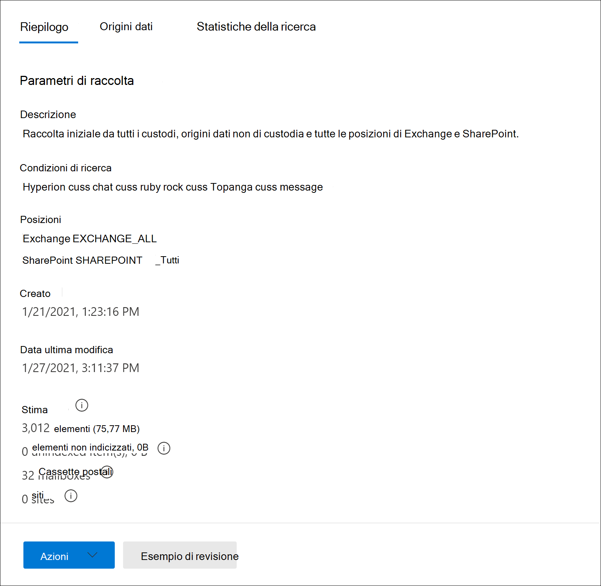
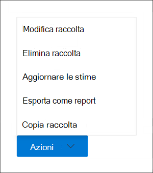

# Creare una bozza di raccolta in Advanced eDiscoveryCreate a draft collection in Advanced eDiscovery

Dopo aver identificato i custodi e qualsiasi origine dati non depositario per il caso, sei pronto per identificare e individuare un set di documenti rilevanti.After you've identified custodians and any non-custodian data sources for the case, you're ready to identify and locate a set of documents that are relevant. A tale scopo, utilizzare lo strumento Raccolte per cercare contenuto pertinente nelle origini dati.You do this by using the Collections tool to search data sources for relevant content. A tale scopo, creare una raccolta che esegue la ricerca di contenuto corrispondente ai criteri di ricerca specificati nelle origini dati specificate.You do this by creating a collection that searches specified data sources for content that matches your search criteria. È possibile creare una bozza di *raccolta,* che è una stima degli elementi trovati oppure è possibile creare una raccolta che aggiunge automaticamente gli elementi a un insieme di recensioni.You have the option to create a *draft collection*, which is an estimate of the items are found or you can create a collection that automatically adds the items to a review set. Quando si crea una bozza di raccolta, è possibile visualizzare informazioni sui risultati stimati corrispondenti alla query di ricerca, ad esempio il numero totale e le dimensioni degli elementi trovati, le diverse origini dati in cui sono stati trovati e le statistiche relative alla query di ricerca.When you create a draft collection, you can views information about the estimated results that matched the search query, such as the total number and size of items found, the different data sources where they were found, and statistics about the search query. È inoltre possibile visualizzare in anteprima un esempio di elementi restituiti dall'insieme.You can also preview a sample of items that were returned by the collection. Utilizzando queste statistiche, è possibile modificare la query di ricerca ed eseguire di nuovo la bozza di raccolta per limitare i risultati.Using these statistics, you can change the search query and rerun the draft collection to narrow your results. Dopo aver soddisfatto i risultati della raccolta, puoi confermare la raccolta in un set di revisione.Once you're satisfied with the collection results, you can commit the collection to a review set. Quando si esegue il commit di una bozza di raccolta, gli elementi restituiti dalla raccolta vengono aggiunti a un insieme di revisione per la revisione, l'analisi e l'esportazione.When you commit a draft collection, the items returned by the collection are added to a review set for review, analysis, and export.

## Prima di creare una raccolta bozzeBefore you create a draft collection

- Aggiungere i custodi e le origini dati non depositario al caso prima di creare una bozza di raccolta.Add custodians and non-custodial data sources to the case before you create a draft collection. Questa operazione è necessaria per poter selezionare le origini dati quando si crea una raccolta di bozze.This is required so that you can select the data sources when you create a draft collection. Per altre informazioni, vedere:For more information, see:

  - [Aggiungere responsabili a un casoAdd custodians to a case](add-custodians-to-case.md)

  - [Aggiungere origini dati non correlate ai responsabili a un casoAdd non-custodial data sources to a case](non-custodial-data-sources.md)

- È possibile cercare in una raccolta di bozze altre origini dati(quelle che non sono state aggiunte al caso come posizioni di custodia o non depositario) per trovare contenuti che potrebbero essere rilevanti per il caso.You can search additional data sources (ones that haven't been added to the case as custodial or non-custodial locations) in a draft collection for content that may be relevant to the case. Queste origini dati possono includere cassette postali, siti di SharePoint e Teams.These data sources might include mailboxes, SharePoint sites, and Teams. Se questa situazione è applicabile al caso, compilare un elenco di queste origini dati in modo da poterle aggiungere alla raccolta.If this situation is applicable to your case, compile a list of these data sources so you can add them to the collection.

## Creare una raccolta di bozzeCreate a draft collection

1. Nel Centro conformità Microsoft 365 aprire il caso Advanced eDiscovery e quindi selezionare la **scheda** Raccolte.In the Microsoft 365 compliance center, open the Advanced eDiscovery case, and then select the **Collections** tab.

2. Nella pagina **Raccolte** selezionare **Nuovo insieme**  >  **Standard.**On the **Collections** page, select **New collection** > **Standard collection**.

3. Digitare un nome (obbligatorio) e una descrizione (facoltativo) per la raccolta.Type a name (required) and description (optional) for the collection. Dopo aver creato la raccolta, non è possibile modificare il nome, ma è possibile modificare la descrizione.After the collection is created, you can't change the name, but you can modify the description.

4. Nella pagina **Origini dati di** custodia eseguire una delle operazioni seguenti per identificare le origini dati di custodia da cui raccogliere il contenuto:On the **Custodial data sources** page, do one of the following things to identify the custodial data sources to collect content from:

   - Fare **clic su Seleziona i** custodi per cercare i custodi specifici che sono stati aggiunti al caso.Click **Select custodians** to search specific custodians that were added to the case. Se si utilizza questa opzione, viene visualizzato un elenco dei custodi del caso.If you use this option, a list of the case custodians is displayed. Selezionare uno o più custodi.Select one or more custodians. Dopo aver selezionato e aggiunto i custodi, è anche possibile selezionare le origini dati specifiche per cercare ogni responsabile.After you select and add the custodians, you can also select the specific data sources to search for each custodian. Queste origini dati visualizzate sono state specificate quando il responsabile è stato aggiunto al caso.These data sources that are displayed were specified when the custodian was added to the case.

   - Fare clic **sull'interruttore** Seleziona tutto per cercare tutti i custodi aggiunti al caso.Click the **Select all** toggle to search all custodians that were added to the case. Quando si seleziona questa opzione, vengono cercate tutte le origini dati per tutti i custodi.When you select this option, all data sources for all custodians are searched.

5. Nella pagina **Origini** dati non di custodia eseguire una delle operazioni seguenti per identificare le origini dati non di tipo non depositario da cui raccogliere il contenuto:On the **Non-custodial data sources** page, do one of the following things to identify the non-custodial data sources to collect content from:

   - Fare **clic su Seleziona** origini dati non di custodia per selezionare origini dati non di custodia specifiche aggiunte al caso.Click **Select non-custodial data sources** to select specific non-custodial data sources that were added to the case. Se si utilizza questa opzione, verrà visualizzato un elenco di origini dati.If you use this option, a list of data sources displayed. Selezionare una o più di queste origini dati.Select one or more of these data sources.

   - Fare clic **sull'interruttore** Seleziona tutto per selezionare tutte le origini dati non di custodia aggiunte al caso.Click the **Select all** toggle to select all non-custodial data sources that were added to the case.

6. Nella pagina **Origini dati aggiuntive** è possibile selezionare altre cassette postali e siti in cui eseguire la ricerca nell'ambito della raccolta.On the **Additional data sources** page, you can select other mailboxes and sites to search as part of the collection. Questi tipi di origini dati non sono stati aggiunti come posizioni di dati depositario o non depositario nel caso.These types of data sources weren't added as custodial or non-custodial data locations in the case. Sono inoltre disponibili due opzioni per la ricerca di origini dati aggiuntive:You also have two options when searching additional data sources:

   - Per cercare in tutti i percorsi di contenuto un servizio specifico (cassette postali di Exchange, siti di SharePoint e OneDrive o cartelle pubbliche di Exchange), fare clic sull'interruttore **Seleziona** tutto corrispondente nella **colonna** Stato.To search all content locations for a specific service (Exchange mailboxes, SharePoint and OneDrive sites, or Exchange public folders), click the corresponding **Select all** toggle in the **Status** column. Questa opzione consente di cercare tutti i percorsi di contenuto nel servizio selezionato.This option will search all content locations in the selected service.

   - Per cercare un percorso di contenuto  specifico per un  servizio, fare clic sull'interruttore Seleziona tutto  corrispondente nella colonna Stato e quindi fare clic su **Utenti,** gruppi o team (per le cassette postali di Exchange) o Scegli siti per (siti di SharePoint e OneDrive) per cercare percorsi di contenuto specifici.To search specific content location for a service, click the corresponding **Select all** toggle in the **Status** column, and then click **Users, groups or teams** (for Exchange mailboxes) or **Choose sites** for (SharePoint and OneDrive sites) to search specific content locations.

7. Nella pagina **Condizioni** è possibile creare la query di ricerca utilizzata per raccogliere gli elementi dalle origini dati identificate nelle pagine precedenti della procedura guidata.On the **Conditions** page, you can create the search query that is used to collect items from the data sources that you've identified in the previous wizard pages. Puoi cercare parole chiave, coppie property:value o usare un elenco di parole chiave.You can search for keywords, property:value pairs, or use a keyword list. È inoltre possibile aggiungere diverse condizioni di ricerca per restringere l'ambito della raccolta.You can also add various search conditions to narrow the scope of the collection. Per ulteriori informazioni, vedere [Creare query di ricerca per raccolte.](building-search-queries.md)For more information, see [Build search queries for collections](building-search-queries.md).

8. Nella pagina **Salva come bozza o aggiungi a revisione set** selezionare Salva raccolta come **bozza.**On the **Save as draft or add to review set** page, select **Save collection as draft**.

   > [!NOTE]
   > L'altra opzione in questa pagina ti consente di raccogliere elementi e aggiungerli direttamente a un set di recensioni.The other option on this page lets you collect items and add them direct to a review set. Invece di creare una bozza di raccolta per cui è possibile esaminare le statistiche e visualizzare in anteprima un campione dei risultati della raccolta, questa opzione ignora tale processo e aggiunge automaticamente la raccolta a un set di recensioni.Instead of creating a draft collection that you can review statistics for and preview a sample of the collection results, this option skips that process and automatically adds the collection to a review set. Se si seleziona la seconda opzione per aggiungere la raccolta a un set di revisione, sono disponibili ulteriori impostazioni da configurare, ad esempio la raccolta di interi thread di conversazione di chat in Microsoft Teams e Yammer e la raccolta di allegati cloud (denominati anche allegati *moderni).*If you select the second option to add the collection to a review set, you have additional settings to configure, such as collecting entire chat conversation threads in Microsoft Teams and Yammer and collecting cloud attachments (also called *modern attachments*). Per ulteriori informazioni su queste impostazioni, vedere [Commit a draft collection to a review set](commit-draft-collection.md).For more information about these settings, see [Commit a draft collection to a review set](commit-draft-collection.md).

9. Nella pagina **Rivedi raccolta** è possibile esaminare e aggiornare le impostazioni di raccolta configurate nelle pagine precedenti.On the **Review your collection** page, you can review and update the collection settings that you configured on the previous pages.

   - **Scheda** Riepilogo: esaminare e modificare il nome e la descrizione della raccolta, i criteri di ricerca della raccolta, i percorsi di dati aggiuntivi e il tipo di raccolta.**Summary** tab:  Review and modify the name and description of the collection, the collection search criteria, additional data locations, and the collection type.

   - **Scheda** Origini: esaminare e modificare le origini dati di custodia e non di custodia per la raccolta.**Sources** tab: Review and modify the custodial and non-custodial data sources for the collection.

10. Fare **clic su** Invia per creare la raccolta bozze.Click **Submit** to create the draft collection. Viene visualizzata una pagina che conferma la creazione della raccolta.A page is displayed confirming that the collection was created.

## Cosa succede dopo aver creato una raccolta di bozzeWhat happens after you create a draft collection

Dopo aver creato una raccolta di  bozze, questa viene elencata nella pagina Raccolte nel caso e lo stato indica che è in corso.After you create a draft collection, it listed on the **Collections** page in the case and the status shows that it's in progress. Un processo denominato **Preparazione dell'anteprima della** ricerca e delle stime viene inoltre creato e visualizzato nella **pagina** Processi nel caso.A job named **Preparing search preview and estimates** is also created and displayed on the **Jobs** page in the case.

Durante il processo di raccolta delle bozze, Advanced eDiscovery esegue una stima della ricerca utilizzando i criteri di ricerca e le origini dati specificati nella raccolta.During the draft collection process, Advanced eDiscovery performs a search estimate using the search criteria and data sources that you specified in the collection. Advanced eDiscovery prepara anche un campionamento di elementi che è possibile visualizzare in anteprima.Advanced eDiscovery also prepares a sampling of items that you can preview. Al termine dell'insieme, vengono aggiornate le colonne seguenti e i valori corrispondenti nella **pagina** Raccolta:When the collection is complete, the following columns and corresponding values on the **Collection** page are updated:

- **Status**: indica lo stato e il tipo di raccolta.**Status**: Indicates the status and type of collection. Il valore **Stimato indica** che una bozza di raccolta è stata completata.A value of **Estimated** indicates that a draft collection is complete. Questo stesso valore indica anche che la raccolta è una raccolta di bozze e che non è stata aggiunta a un insieme di recensioni.This same value also indicates that the collection is a draft collection, and that it hasn't been added to a review set. Il valore **Committed** nella **colonna Status** indica che la raccolta è stata aggiunta a un set di revisioni.A value of **Committed** in the **Status** column indicates that the collection has been added to a review set.

- **Stato stima:** indica lo stato dei risultati della ricerca stimati e indica se le stime e le statistiche della ricerca sono pronte per la revisione.**Estimate status**: Indicates the status of the estimated search results and whether or not the search estimates and statistics are ready for review. Il valore **Successful** indica che i risultati della bozza di raccolta sono pronti per la revisione.A value of **Successful** indicates the results of the draft collection are ready for review. Dopo aver inviato per la prima volta una bozza di raccolta, viene visualizzato il valore **In** corso per indicare che la raccolta è ancora in esecuzioneAfter you first submit a draft collection, a value of **In progress** is displayed to indicate the collection is still running

- **Stato anteprima**: Indica lo stato degli elementi di esempio che è possibile visualizzare in anteprima.**Preview status**: Indicates the status of the sample items that you can preview. Il valore **Successful indica** che gli elementi sono pronti per l'anteprima.A value of **Successful** indicates the items are ready for preview. Dopo aver inviato per la prima volta una bozza di raccolta, viene visualizzato il valore **In** corso per indicare che la raccolta è ancora in esecuzione.After you first submit a draft collection, a value of **In progress** is displayed to indicate that the collection is still running.

## Passaggi successivi al completamento di una raccolta di bozzeNext steps after a draft collection is complete

Al termine della raccolta delle bozze, è possibile eseguire diverse attività.After the draft collection is successfully completed, you can perform various tasks. Per eseguire la maggior parte di queste attività, è sufficiente passare alla **scheda Raccolte** e fare clic sul nome della raccolta bozze per visualizzare la pagina a comparsa.To perform most of these tasks, just go the **Collections** tab and click the name of the draft collection to display the flyout page.

Ecco un elenco di operazioni che puoi eseguire dalla pagina del riquadro a comparsa della raccolta:Here's a list of things you can do from the collection flyout page:

- Selezionare la **scheda Riepilogo** per visualizzare le informazioni di riepilogo sulla raccolta e i risultati di ricerca stimati restituiti dalla raccolta.Select the **Summary** tab to view summary information about the collection and the estimated search results returned by the collection. Ciò include il numero totale di elementi e le dimensioni dei risultati di ricerca stimati, il numero di cassette postali e siti che contenevano risultati di ricerca e le condizioni di ricerca (se utilizzate) utilizzate per l'ambito della raccolta.This includes that total number of items and size of the estimated search results, the number of mailboxes and sites contained search results, and the search conditions (if used) used to scope the collection.

- Selezionare la **scheda Origini** dati per visualizzare un elenco dei custodi e delle origini dati non depositario) che sono stati cercati nella raccolta.Select the **Data sources** tab to view a list of custodians and non-custodial data sources) that were searched in the collection. Eventuali percorsi di contenuto aggiuntivi in cui è stata ricercata sono elencati in **Percorsi** nella **scheda** Riepilogo.Any additional content locations that were search are listed under **Locations** on the **Summary** tab.

- Selezionare la **scheda Statistiche di** ricerca per visualizzare le statistiche sulla raccolta.Select the **Search statistics** tab to view statistics about the collection. Sono inclusi il numero totale e le dimensioni degli elementi trovati in ogni servizio (ad esempio, cassette postali di Exchange o siti di SharePoint) e un report di condizione che visualizza le statistiche sul numero di elementi restituiti dai diversi componenti della query di ricerca utilizzata dalla raccolta.This includes the total number and size of items found in each service (for example, Exchange mailboxes or SharePoint sites) and a condition report that displays statistics about the number of items returned by different components of the search query used by the collection. Per ulteriori informazioni, vedere [Statistiche e report di raccolta.](collection-statistics-reports.md)For more information, see [Collection statistics and reports](collection-statistics-reports.md).

- Fai **clic su** Rivedi esempio nella parte inferiore della pagina a comparsa per visualizzare un'anteprima di un esempio degli elementi restituiti dalla raccolta.Click **Review sample** (located at the bottom of the flyout page) to preview a sample of the items returned by the collection.

- Eseguire il commit della raccolta bozze in un set di revisione (facendo clic **su**  >  **Azioni Modifica raccolta).**Commit the draft collection to a review set (by clicking **Actions** > **Edit collection**). Ciò significa che esegui di nuovo la raccolta (usando le impostazioni correnti) e aggiungi gli elementi restituiti dalla raccolta a un set di revisione.This means that you rerun the collection (using the current settings) and add the items returned by the collection to a review set. Come spiegato in precedenza, puoi anche configurare impostazioni aggiuntive (ad esempio il threading delle conversazioni e gli allegati basati sul cloud) quando aggiungi la raccolta a un set di recensioni.As previously explained, you can also configure additional settings (such as conversation threading and cloud-based attachments) when you add the collection to a review set. Per ulteriori informazioni e istruzioni dettagliate, vedere [Commit a draft collection to a review set](commit-draft-collection.md).For more information and step-by-step instructions, see [Commit a draft collection to a review set](commit-draft-collection.md).

## Gestire una raccolta di bozzeManage a draft collection

È possibile utilizzare le opzioni del menu **Azioni** nella pagina a comparsa di una bozza di raccolta per eseguire diverse attività di gestione.You can use the options in the **Actions** menu on the flyout page of a draft collection to perform various management tasks.

Ecco le descrizioni delle opzioni di gestione.Here's are descriptions of the management options.

- **Modifica raccolta:** modificare le impostazioni della raccolta bozze.**Edit collection**: Change the settings of the draft collection. Dopo aver apportato le modifiche, è possibile rieseguire la raccolta e aggiornare le stime e le statistiche della ricerca.After you make changes, you can rerun the collection and update the search estimates and statistics. Come spiegato in precedenza, questa opzione viene utilizzata per confermare una bozza di raccolta in un set di revisione.As previously explained, you use this option to commit a draft collection to a review set.  

- **Elimina raccolta:** elimina una raccolta di bozze.**Delete collection**: Delete a draft collection. Si noti che dopo il commit di una raccolta di bozze in un set di revisioni, non può essere eliminata.Note that after a draft collection is committed to a review set, it can't be deleted.

- **Stime di aggiornamento:** eseguire di nuovo la query (rispetto alle origini dati) specificata nella raccolta bozza per aggiornare le stime e le statistiche della ricerca.**Refresh estimates**: Rerun the query (against the data sources) specified in the draft collection to update the search estimates and statistics.

- **Esporta come report**: esporta le informazioni sulla raccolta di bozze in un file CSV che è possibile scaricare nel computer locale.**Export as report**: Exports information about the draft collection to a CSV file that you can download to your local computer. Il report di esportazione contiene le informazioni seguenti:The export report contains the following information:

  - Identità di ogni percorso di contenuto contenente elementi che corrispondono alla query di ricerca nella raccolta bozze.The identity of each content location that contains items that match the search query in the draft collection. Questi percorsi sono in genere cassette postali o siti.These locations are typically mailboxes or sites.
  
  - Numero totale di elementi in ogni percorso di contenuto.The total number of items in each content location.
  
  - Dimensione totale, in byte, degli elementi in ogni percorso di contenuto.The total size (in bytes) of the items in each content location.

  - Servizio (ad esempio Exchange o SharePoint) in cui si trova il percorso del contenuto.The service (such as Exchange or SharePoint) in which the content location is located.

- **Copia raccolta:** crea una nuova raccolta di bozze copiando le impostazioni da una raccolta esistente.**Copy collection**: Create a new draft collection by copying the settings from an existing collection. È necessario utilizzare un nome diverso per la nuova raccolta.You have to use a different name for the new collection. È inoltre possibile modificare le impostazioni prima di inviare la nuova raccolta.You also have the option to modify the settings before you submit the new collection. Dopo l'invio, viene eseguita la query di ricerca e vengono generate nuove stime e statistiche.After you submit it, the search query is run and new estimates and statistics are generated. È un buon modo per creare rapidamente ulteriori bozze di raccolta e quindi modificare le impostazioni selezionate in base alle esigenze conservando comunque le informazioni nella raccolta originale.The is a good way to quickly create additional draft collection and then modify selected settings as necessary while still preserving information in the original collection. In questo modo puoi anche confrontare facilmente i risultati di due raccolte simili.This also lets you easily compare the results of two similar collections.

> [!NOTE]
> Dopo il commit di una bozza di raccolta in un set di revisione, è possibile copiare solo la raccolta ed esportare un report.After a draft collection is committed to a review set, you can only copy the collection and export a report.
