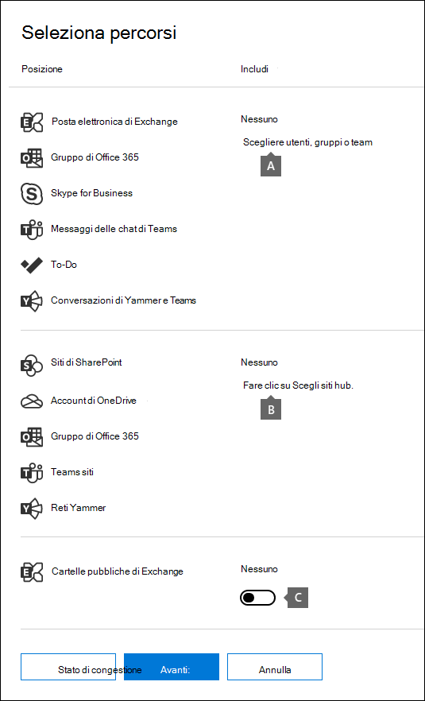
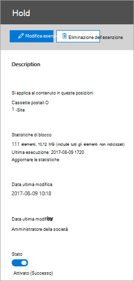
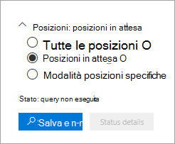

# <a name="create-an-ediscovery-hold"></a>Creare un blocco di eDiscovery

È possibile utilizzare un caso di eDiscovery di base per creare le esenzioni per conservare il contenuto che potrebbe essere pertinente per il caso. È possibile applicare un blocco alle cassette postali di Exchange e agli account di OneDrive for business degli utenti di cui si sta indagando il caso. È inoltre possibile applicare un blocco alle cassette postali e ai siti associati a Microsoft teams, ai gruppi di Office 365 e ai gruppi di Yammer. Quando si posizionano i percorsi di contenuto in attesa, il contenuto viene mantenuto fino a quando non viene rimosso il blocco dal percorso del contenuto o fino a quando non viene eliminato il blocco.

Dopo aver creato un blocco eDiscovery, potrebbero essere necessarie fino a 24 ore per rendere effettive le esenzioni. 

Quando si crea un'esenzione, sono disponibili le opzioni seguenti per l'ambito del contenuto conservato nei percorsi di contenuto specificati:
  
- È possibile creare un'esenzione infinita in cui tutto il contenuto nei percorsi specificati è messo in attesa. In alternativa, è possibile creare un blocco basato su query in cui viene memorizzato solo il contenuto nei percorsi specificati che corrispondono a una query di ricerca.

- È possibile specificare un intervallo di date che consenta di conservare solo il contenuto che è stato inviato, ricevuto o creato all'interno di tale intervallo di date. In alternativa, è possibile conservare tutto il contenuto in percorsi specificati indipendentemente dal momento in cui è stato inviato, ricevuto o creato.
  
## <a name="how-to-create-an-ediscovery-hold"></a>Come creare un'esenzione di eDiscovery

Per creare un blocco di eDiscovery associato a un caso di eDiscovery di base:
  
1. Passare a [https://compliance.microsoft.com](https://compliance.microsoft.com) e accedere con le credenziali per l'account utente a cui sono state assegnate le autorizzazioni di eDiscovery appropriate.

2. Nel riquadro di spostamento a sinistra del centro conformità di Microsoft 365 fare clic su **Mostra tutto**e quindi su **eDiscovery > Core**.

3. Nella pagina **Core eDiscovery** selezionare il caso in cui si desidera creare l'esenzione e quindi fare clic su **Apri caso**.

4. Nella **Home** page del caso, fare clic sulla scheda **esenzioni** .
  
5. Nella pagina **esenzioni** fare clic su **Crea**.

6. Nella pagina **Name Your Hold** Wizard, assegnare un nome al blocco e aggiungere una descrizione facoltativa, quindi fare clic su **Avanti**. Il nome del blocco deve essere univoco nell'organizzazione.

7. Nella pagina **percorsi contenuto** scegliere i percorsi di contenuto che si desidera inserire in attesa. È possibile inserire le cassette postali, i siti e le cartelle pubbliche in attesa.

    
  
   a. **Posizioni delle cassette postali** -fare clic su **Scegli utenti, gruppi o team** e quindi fare di nuovo clic su **Scegli utenti, gruppi o team** per specificare le cassette postali da inserire in attesa. Utilizzare la casella di ricerca per trovare le cassette postali degli utenti e i gruppi di distribuzione (per inserire un'esenzione nelle cassette postali dei membri del gruppo) per effettuare il blocco. È inoltre possibile inserire un blocco sulla cassetta postale associata per un gruppo di Microsoft, un gruppo di Office 365 o Yammer. Selezionare la casella di controllo utente, gruppo, team, fare clic su **Scegli**e quindi su **fine**.

   b. **Posizioni del sito** -fare clic su **Scegli siti** , quindi fare di nuovo clic su **Choose sites** per specificare gli account di SharePoint e OneDrive da inserire in attesa. Digitare l'URL per ogni sito che si desidera conservare. È inoltre possibile aggiungere l'URL per il sito di SharePoint per un gruppo di Microsoft Team, Office 365 o un gruppo di Yammer. Fare clic su **Scegli**e quindi su **fine**.
  
   c. **Cartelle pubbliche di Exchange.** Spostare il controllo Toggle toggle switch nella  posizione **All** per inserire in attesa tutte le cartelle pubbliche nell'organizzazione di Exchange Online. Non è possibile scegliere cartelle pubbliche specifiche da mantenere in attesa. Lasciare l'opzione toggle impostata su **None** se non si desidera inserire un blocco nelle cartelle pubbliche.

   > [!NOTE]
   > È necessario aggiungere almeno un percorso di contenuto all'esenzione. In caso contrario, l'eDiscovery Hold statics mostrerà che non sono presenti elementi in attesa.

8. Dopo aver aggiunto i percorsi di contenuto all'esenzione, fare clic su **Avanti**.

9. Per creare un blocco basato su query con condizioni, completare quanto segue. In caso contrario, per mantenere tutto il contenuto nelle posizioni di contenuto specificate, fare clic su **Avanti**.

    
  
    a. Nella casella **parole chiave**Digitare una query di ricerca in modo che venga conservato solo il contenuto che soddisfa i criteri di ricerca. È possibile specificare le parole chiave, le proprietà del messaggio di posta elettronica o le proprietà del documento, ad esempio i nomi di file. È inoltre possibile utilizzare query più complesse che utilizzano un operatore booleano, ad esempio **e**, **o**o **meno**.

    b. Fare clic su **Aggiungi condizioni** per aggiungere una o più condizioni per limitare la query di ricerca per il blocco. Ogni condizione aggiunge una clausola alla query di ricerca di KQL che viene creata e eseguita quando si crea il blocco. Ad esempio, è possibile specificare un intervallo di date in modo che i documenti di posta elettronica o di sito creati entro la data di intervallo siano stati inseriti in attesa. Una condizione è connessa logicamente alla query con parole chiave (specificata nella casella **Keywords** ) dall'operatore **and** . Questo significa che gli elementi devono soddisfare sia la query di parole chiave che la condizione da mantenere.

    Per ulteriori informazioni sulla creazione di una query di ricerca e sull'utilizzo di condizioni, vedere [keyword queries and Search Conditions for content search](keyword-queries-and-search-conditions.md).

10. Dopo aver configurato un blocco basato su query, fare clic su **Avanti**.

11. Esaminare le impostazioni (e modificarle se necessario), quindi fare clic su **Crea blocco**.

## <a name="query-based-holds-placed-on-site-documents"></a>Esenzioni basate su query inserite nei documenti del sito

Tenere presente quanto segue quando si attiva un blocco di eDiscovery basato su query sui documenti situati in siti di SharePoint:

- Un blocco basato su query inizialmente conserva tutti i documenti in un sito per un breve periodo di tempo dopo l'eliminazione. Questo significa che quando un documento viene eliminato, verrà spostato nella raccolta conservazione, anche se non corrisponde ai criteri del blocco basato su query. Tuttavia, i documenti eliminati che non corrispondono a un blocco basato su query verranno rimossi da un processo timer che elabora la raccolta conservazione. Il processo timer viene eseguito periodicamente e confronta tutti i documenti nella raccolta conservazione per le esenzioni di eDiscovery basate su query (e altri tipi di esenzioni e criteri di conservazione). Il processo timer Elimina i documenti che non corrispondono a un blocco basato su query e conserva i documenti.

- Le esenzioni basate su query non devono essere utilizzate per eseguire una conservazione mirata, ad esempio per conservare i documenti in una cartella o un sito specifico oppure utilizzando altri criteri di archiviazione basati sul percorso. In questo modo, potrebbero verificarsi risultati indesiderati. È consigliabile utilizzare criteri di conservazione non basati sul percorso, ad esempio parole chiave, intervalli di date o altre proprietà del documento per conservare i documenti del sito.

## <a name="ediscovery-hold-statistics"></a>Statistiche di eDiscovery Hold

Dopo aver creato un blocco eDiscovery, le informazioni relative al nuovo blocco vengono visualizzate nella pagina del riquadro a comparsa per il blocco selezionato. Queste informazioni includono il numero di cassette postali e i siti in attesa e le statistiche sul contenuto che è stato messo in attesa, ad esempio il numero totale e le dimensioni degli elementi che sono stati messi in attesa e l'ultima volta che sono state calcolate le statistiche di blocco. Queste statistiche di blocco consentono di identificare la quantità di contenuto correlata al caso.
  

  
Tenere presenti le considerazioni seguenti sulle statistiche di eDiscovery Hold:
  
- Il numero totale di elementi in attesa indica il numero di elementi provenienti da tutte le origini di contenuto che vengono bloccate. Se è stata creata una conservazione basata su query, questa statistica indica il numero di elementi che corrispondono alla query.

- Il numero di elementi in attesa include anche gli elementi non indicizzati trovati nei percorsi di contenuto. Se si crea un blocco basato su query, tutti gli elementi non indicizzati nei percorsi di contenuto vengono inseriti in attesa. Sono inclusi gli elementi non indicizzati che non corrispondono ai criteri di ricerca di un blocco basato su query e di elementi non indicizzati che potrebbero non essere compresi in una condizione dell'intervallo di date. Questo è diverso da quello che succede quando si esegue una ricerca, in cui gli elementi non indicizzati che non corrispondono alla query di ricerca o sono esclusi da una condizione dell'intervallo di date non sono inclusi nei risultati della ricerca. Per ulteriori informazioni sugli elementi non indicizzati, vedere [elementi parzialmente indicizzati](partially-indexed-items-in-content-search.md).

- È possibile ottenere le statistiche di archiviazione più recenti facendo clic su **Aggiorna statistiche** per rieseguire una stima di ricerca che calcola il numero corrente di elementi in attesa.

- È normale che il numero di elementi in attesa aumenti nel tempo, in quanto gli utenti la cui cassetta postale o sito è in attesa vengono in genere inviati o ricevuti da un nuovo messaggio di posta elettronica e dalla creazione di nuovi documenti in SharePoint e OneDrive.

- Se una cassetta postale di Exchange, un sito di SharePoint o un account OneDrive viene spostato in un'altra area geografica in un ambiente multi-geografico, le statistiche per il sito non verranno incluse nelle statistiche di esenzione. Tuttavia, il contenuto di tali posizioni continuerà a essere mantenuto. Inoltre, se una cassetta postale o un sito viene spostato in un'altra area, l'indirizzo o l'URL SMTP visualizzato nel blocco non verrà aggiornato automaticamente. È necessario modificare il blocco e aggiornare l'URL o l'indirizzo SMTP in modo che i percorsi di contenuto vengano di nuovo inclusi nelle statistiche di blocco

## <a name="search-locations-on-ediscovery-hold"></a>Posizioni di ricerca in eDiscovery Hold

Quando si esegue una [ricerca di contenuto](search-for-content-in-core-ediscovery.md) in un caso di eDiscovery di base, è possibile configurare rapidamente la ricerca in modo da cercare solo i percorsi di contenuto che sono stati inseriti in un'esenzione associata al caso.



Selezionare l'opzione **posizioni in attesa** per eseguire la ricerca in tutti i percorsi di contenuto che sono stati inseriti in attesa. Se il caso contiene più eDiscovery, verranno cercate le posizioni di contenuto di tutte le esenzioni quando si seleziona questa opzione. Inoltre, se il percorso del contenuto è stato posizionato in un blocco basato su query, quando si esegue la ricerca verranno ricercati solo gli elementi che corrispondono alla query di archiviazione. In altre parole, viene restituito solo il contenuto che corrisponde ai criteri di blocco e ai criteri di ricerca. Ad esempio, se un utente è stato inserito nel caso di archiviazione basata su query che conserva gli elementi inviati o creati prima di una data specifica, verranno ricercati solo gli elementi. Questa operazione viene eseguita collegando la query di blocco del caso e la query di ricerca da un operatore **and** .

Di seguito sono riportate alcune altre informazioni da tenere presenti quando si esegue la ricerca in posizioni su eDiscovery Hold:

- Se una posizione di contenuto fa parte di più riserve nello stesso caso, le query di blocco vengono combinate da **o** operatori quando si esegue una ricerca nel percorso del contenuto utilizzando l'opzione tutti i contenuti di caso. Analogamente, se una posizione di contenuto fa parte di due diverse esenzioni, in cui una è basata su query e l'altra è una conservazione infinita (in cui tutto il contenuto viene messo in attesa), tutto il contenuto è una ricerca a causa del blocco infinito.

- Se una ricerca viene configurata per la ricerca di percorsi in attesa e quindi si modifica un blocco di eDiscovery nel caso (aggiungendo o rimuovendo una posizione o modificando una query di blocco), la configurazione di ricerca viene aggiornata con tali modifiche. Tuttavia, è necessario eseguire nuovamente la ricerca dopo che il blocco è stato modificato per aggiornare i risultati della ricerca.

- Se più eDiscovery contiene sono posizionate in una singola posizione in un caso di eDiscovery e si seleziona per eseguire la ricerca di percorsi in attesa, il numero massimo di parole chiave per la query di ricerca è 500. Ciò è dovuto al fatto che la ricerca combina tutte le esenzioni basate su query utilizzando l'operatore **or** . Se sono presenti più di 500 parole chiave nelle query di archiviazione combinata e nella query di ricerca, viene cercato tutto il contenuto della cassetta postale, non solo il contenuto che corrisponde al caso basato su query.

- Se un blocco di eDiscovery ha lo stato di **attivazione**, è comunque possibile cercare le posizioni in attesa mentre il blocco è attivo.

## <a name="preserve-content-in-microsoft-teams"></a>Preservare il contenuto in Microsoft Teams

Le conversazioni che fanno parte di un canale Microsoft teams vengono memorizzate nella cassetta postale associata al team di Microsoft. Allo stesso modo, i file che i membri del team condividono in un canale vengono archiviati nel sito di SharePoint del team. Pertanto, è necessario inserire la cassetta postale del team e il sito di SharePoint in eDiscovery Hold per conservare le conversazioni e i file in un canale.

In alternativa, le conversazioni che fanno parte dell'elenco chat in teams (denominate *1:1 chat* o *1: N Group Chat*) sono archiviate nelle cassette postali degli utenti che partecipano alla chat. E i file che gli utenti condividono nelle conversazioni chat sono archiviati nell'account OneDrive dell'utente che condivide il file. Pertanto, è necessario aggiungere le singole cassette postali degli utenti e gli account di OneDrive a un blocco eDiscovery per conservare le conversazioni e i file nell'elenco chat. È consigliabile applicare un blocco alle cassette postali dei membri di un team Microsoft oltre a mettere in attesa la cassetta postale e il sito del team.

A partire dal febbraio 2020, è stata attivata la possibilità di conservare il contenuto nei canali privati. Poiché le chat del canale privato sono memorizzate nelle cassette postali dei partecipanti alla chat, l'inserimento di una cassetta postale utente su eDiscovery Hold conserverà le chat del canale privato. Inoltre, se una cassetta postale utente è stata inserita in un blocco di eDiscovery prima del 2020 febbraio, il blocco verrà applicato automaticamente ai messaggi del canale privato archiviati nella cassetta postale. È supportata anche la conservazione dei file condivisi nei canali privati.

Per ulteriori informazioni sulla conservazione dei contenuti del team, vedere [collocare un utente o un team di Microsoft teams in blocco legale](https://docs.microsoft.com/MicrosoftTeams/legal-hold).
    
> [!IMPORTANT]
> In un'organizzazione basata sul cloud, gli utenti che partecipano a conversazioni che fanno parte dell'elenco chat nei team devono disporre di una cassetta postale di Exchange Online per mantenere le conversazioni chat quando la cassetta postale viene inserita in un blocco eDiscovery. Questo perché le conversazioni che fanno parte dell'elenco chat sono memorizzate nelle cassette postali basate sul cloud dei partecipanti alla chat. Se un partecipante alla chat non dispone di una cassetta postale di Exchange Online, non sarà possibile preservare tali conversazioni. Ad esempio, in una distribuzione ibrida di Exchange, gli utenti che dispongono di una cassetta postale locale potrebbero essere in grado di partecipare a conversazioni che fanno parte dell'elenco chat in teams. In questo caso, tuttavia, non è possibile preservare il contenuto di queste conversazioni perché questi utenti non dispongono di una cassetta postale basata sul cloud che può essere bloccata.
  
Ogni canale team o team contiene anche un wiki per la collaborazione e l'adozione di note. Il contenuto Wiki viene salvato automaticamente in un file con formato MHT. Il file è archiviato nella raccolta documenti di dati Wiki di Teams nel sito di SharePoint del team. È possibile preservare il contenuto del wiki aggiungendo il sito di SharePoint del team a un'esenzione di eDiscovery.

> [!NOTE]
> La possibilità di conservare il contenuto wiki per un team o un canale del team (quando si posiziona il sito di SharePoint del team in attesa) è stata rilasciata il 22 giugno 2017. Se un sito del team è in attesa, il contenuto del wiki verrà mantenuto a partire da tale data. Tuttavia, se un sito del team è in attesa e il contenuto del wiki è stato eliminato entro il 22 giugno 2017, il contenuto del wiki non è stato conservato.

### <a name="office-365-groups"></a>Gruppi di Office 365

I team sono basati su gruppi di Office 365. Pertanto, l'inserimento di gruppi di Office 365 su eDiscovery è simile al blocco del contenuto di teams.

Tenere presente quanto segue quando si inseriscono i gruppi di team e di Office 365 su un'esenzione di eDiscovery:

- Come spiegato in precedenza, per inserire il contenuto in teams e i gruppi di Office 365 in attesa, è necessario specificare la cassetta postale e il sito di SharePoint associato a un gruppo o a un team.

- Eseguire il cmdlet **Get-UnifiedGroup** in [Exchange Online PowerShell](https://docs.microsoft.com/powershell/exchange/exchange-online/connect-to-exchange-online-powershell/connect-to-exchange-online-powershell) per visualizzare le proprietà di teams e gruppi di Office 365. Si tratta di un modo efficace per ottenere l'URL del sito associato a un gruppo di team o di Office 365. Ad esempio, il comando seguente consente di visualizzare le proprietà selezionate per un gruppo di Office 365 denominato Senior Leadership Team:

    ```text
    Get-UnifiedGroup "Senior Leadership Team" | FL DisplayName,Alias,PrimarySmtpAddress,SharePointSiteUrl

    DisplayName            : Senior Leadership Team
    Alias                  : seniorleadershipteam
    PrimarySmtpAddress     : seniorleadershipteam@contoso.onmicrosoft.com
    SharePointSiteUrl      : https://contoso.sharepoint.com/sites/seniorleadershipteam
    ```

    > [!NOTE]
    > Per eseguire il cmdlet **Get-UnifiedGroup**, è necessario avere il ruolo Destinatari di sola lettura in Exchange Online o essere membri di un gruppo di ruoli assegnato al ruolo Destinatari di sola lettura. 
  
- Quando viene eseguita la ricerca della cassetta postale di un utente, qualsiasi team o gruppo di Office 365 di cui l'utente è membro non verrà cercato. Analogamente, quando si inserisce un team o un gruppo di Office 365 in eDiscovery Hold, solo la cassetta postale di gruppo e il sito del gruppo vengono inseriti in attesa. Le cassette postali e i siti di OneDrive for business dei membri del gruppo non vengono conservati a meno che non vengano aggiunti in modo esplicito all'esenzione di eDiscovery. Pertanto, se è necessario disporre di un team o di un gruppo di Office 365 in attesa per un motivo legale, è consigliabile aggiungere le cassette postali e gli account di OneDrive dei membri del team o del gruppo nello stesso blocco.

- Per ottenere un elenco dei membri di un team o di un gruppo di Office 365, è possibile visualizzare le proprietà nella pagina **gruppi** nell'interfaccia di amministrazione di Microsoft 365. In alternativa, è possibile eseguire il comando seguente in PowerShell di Exchange Online:

    ```powershell
    Get-UnifiedGroupLinks <group or team name> -LinkType Members | FL DisplayName,PrimarySmtpAddress
    ```

    > [!NOTE]
    > Per eseguire il cmdlet **Get-UnifiedGroupLinks**, è necessario avere il ruolo Destinatari di sola lettura in Exchange Online o essere membri di un gruppo di ruoli assegnato al ruolo Destinatari di sola lettura.

## <a name="onedrive-accounts"></a>Account di OneDrive

Per raccogliere un elenco degli URL per i siti di OneDrive for business nell'organizzazione, in modo da poterli aggiungere a un'esenzione o a una ricerca associata a un caso di eDiscovery, vedere [creare un elenco di tutte le posizioni di OneDrive nell'organizzazione](https://docs.microsoft.com/onedrive/list-onedrive-urls). Lo script in questo articolo consente di creare un file di testo contenente un elenco di tutti i siti di OneDrive nell'organizzazione. Per eseguire questo script, è necessario installare e usare SharePoint Online Management Shell. Assicurarsi di aggiungere l'URL del dominio MySite dell'organizzazione a ogni sito OneDrive che si desidera includere nella ricerca. Si tratta del dominio che contiene tutti i siti di OneDrive, ad esempio, `https://contoso-my.sharepoint.com`. Di seguito viene riportato un esempio di sito OneDrive di un utente: `https://contoso-my.sharepoint.com/personal/sarad_contoso_onmicrosoft.com`.

> [!IMPORTANT]
> L'URL dell'account OneDrive di un utente include il relativo nome dell'entità utente (UPN) (ad esempio, `https://alpinehouse-my.sharepoint.com/personal/sarad_alpinehouse_onmicrosoft_com` ). Nel caso raro che l'UPN di una persona sia cambiato, anche il relativo URL di OneDrive verrà modificato per incorporare il nuovo UPN. Se l'account OneDrive di un utente fa parte di un blocco eDiscovery, il vecchio e il relativo UPN sono cambiati, è necessario aggiornare il blocco e sarà necessario aggiornare il blocco e aggiungere il nuovo URL di OneDrive dell'utente e rimuovere quello precedente. Per altre informazioni, vedere [Come le modifiche UPN influiscono sull'URL di OneDrive](https://docs.microsoft.com/onedrive/upn-changes).

## <a name="removing-content-locations-from-an-ediscovery-hold"></a>Rimozione di percorsi di contenuto da un'esenzione di eDiscovery

Dopo la rimozione di una cassetta postale, un sito di SharePoint o un account OneDrive da un'esenzione di eDiscovery, viene applicato un *blocco di ritardo* . Questo significa che la rimozione effettiva del blocco viene posticipata di 30 giorni per impedire che i dati vengano eliminati definitivamente (eliminati) da una posizione di contenuto. In questo modo gli amministratori avranno la possibilità di cercare o recuperare contenuti che verranno eliminati dopo la rimozione di un blocco di eDiscovery. I dettagli sulla modalità di funzionamento del blocco di ritardo per le cassette postali e i siti sono diversi.

- **Cassette postali:** Un blocco di ritardo viene inserito in una cassetta postale alla successiva elaborazione della cassetta postale da parte dell'Assistente cartelle gestite e viene rilevato che un blocco di eDiscovery è stato rimosso. In particolare, un blocco di ritardo viene applicato a una cassetta postale quando l'Assistente cartelle gestite imposta una delle seguenti proprietà della cassetta postale su **true**:

   - **DelayHoldApplied:** Questa proprietà si applica al contenuto relativo alla posta elettronica (generato da utenti che utilizzano Outlook e Outlook sul Web) archiviato nella cassetta postale di un utente.

   - **DelayReleaseHoldApplied:** Questa proprietà si applica ai contenuti basati sul cloud (generati da app non Outlook, ad esempio Microsoft teams, Microsoft Forms e Microsoft Yammer) archiviati nella cassetta postale di un utente. I dati del cloud generati da un'app Microsoft vengono in genere archiviati in una cartella nascosta della cassetta postale di un utente.

   Quando una conservazione di ritardo viene posizionata sulla cassetta postale (quando una delle proprietà precedenti è impostata su **true**), la cassetta postale è ancora considerata in attesa per una durata di conservazione illimitata, come se la cassetta postale fosse in conservazione per controversia legale. Dopo 30 giorni, scade il ritardo e Microsoft 365 tenterà automaticamente di rimuovere il blocco di ritardo (impostando la proprietà DelayHoldApplied o DelayReleaseHoldApplied su **false**) in modo che il blocco venga rimosso. Dopo che entrambe le proprietà sono state impostate su **false**, gli elementi corrispondenti contrassegnati per la rimozione vengono eliminati alla successiva elaborazione della cassetta postale da parte dell'Assistente cartelle gestite.

   Per altre informazioni, vedere [Gestione della permanenza nelle cassette postali ](identify-a-hold-on-an-exchange-online-mailbox.md#managing-mailboxes-on-delay-hold).

- **Siti di SharePoint e OneDrive:** Qualsiasi contenuto di SharePoint o OneDrive che viene conservato nella raccolta di conservazione non viene eliminato durante il periodo di attesa di 30 giorni dopo la rimozione di un sito da un blocco eDiscovery. Questo è simile a quello che succede quando un sito viene rilasciato da un criterio di conservazione. Inoltre, non è possibile eliminare manualmente il contenuto nella raccolta conservazione per il periodo di attesa di 30 giorni. 

   Per ulteriori informazioni, vedere [rilasciando un criterio di conservazione](retention.md#releasing-a-retention-policy).

Un blocco di ritardo viene applicato anche ai percorsi di contenuto in attesa quando si chiude un caso di eDiscovery di base perché le esenzioni sono disattivate quando si chiude un caso. Per ulteriori informazioni sulla chiusura di un caso, vedere [chiudere, riaprire ed eliminare un caso di eDiscovery di base](close-reopen-delete-core-ediscovery-cases.md).

## <a name="ediscovery-hold-limits"></a>limiti di blocco di eDiscovery

Nella tabella seguente sono elencati i limiti per i casi di eDiscovery e le esenzioni del caso.

  |**Descrizione del limite**|**Tipo di limite**|
  |:-----|:-----|
  |Numero massimo di casi per un'organizzazione  <br/> |Nessun limite  <br/> |
  |Numero massimo di eDiscovery per un'organizzazione  <br/> |10.000  <br/> |
  |Numero massimo di cassette postali in un singolo blocco di eDiscovery  <br/> |1.000  <br/> |
  |Numero massimo di siti di SharePoint e OneDrive for business in un unico blocco di eDiscovery  <br/> |100  <br/> |
  |Numero massimo di casi visualizzati nella Home page di eDiscovery e il numero massimo di elementi visualizzati nelle schede esenzioni, ricerche ed esportazione all'interno di un caso. <sup>1</sup> |1.000|
  |||

   > [!NOTE]
   > <sup>1</sup> per visualizzare un elenco di più di 1.000 casi, esenzioni, ricerche o esportazioni, è possibile utilizzare il cmdlet di PowerShell per la sicurezza & conformità corrispondente di Office 365:<br/> [Get-ComplianceCase](https://docs.microsoft.com/powershell/module/exchange/get-compliancecase) <br/> [Get-CaseHoldPolicy](https://docs.microsoft.com/powershell/module/exchange/get-caseholdpolicy)<br/> [Get-ComplianceSearch](https://docs.microsoft.com/powershell/module/exchange/get-compliancesearch)<br/> [Get-ComplianceSearchAction](https://docs.microsoft.com/powershell/module/exchange/get-compliancesearchaction)
