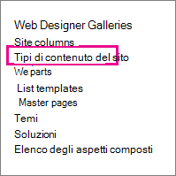
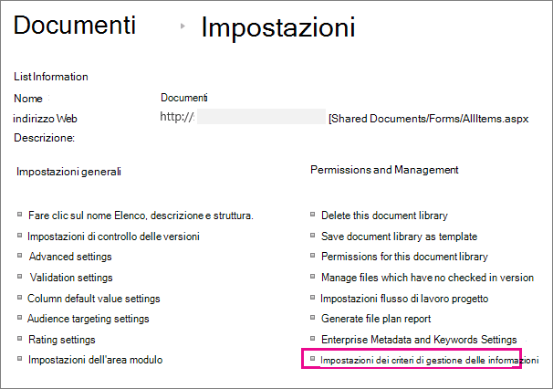

# Creare e applicare criteri di gestione delle informazioni

I criteri di gestione delle informazioni consentono all'organizzazione di controllare per quanto tempo conservare il contenuto, di controllare le operazioni degli utenti con il contenuto e di aggiungere codici a barre o etichette ai documenti. I criteri consentono di applicare la conformità alle normative legali e governative o ai processi aziendali interni. Gli amministratori possono configurare un criterio per controllare come tenere traccia dei documenti e per quanto tempo conservare i documenti.

È possibile creare un criterio di gestione delle informazioni in tre posizioni diverse nella gerarchia dei siti, dal più ampio al più stretto:

- Creare criteri da utilizzare in più tipi di contenuto all'interno di una raccolta siti.
- Creare un criterio per un tipo di contenuto del sito.
- Creare un criterio per un elenco o una raccolta.

Per ulteriori informazioni, vedere [Introduzione ai criteri di gestione delle informazioni.](intro-to-info-mgmt-policies.md)

## Creare criteri per più tipi di contenuto all'interno di una raccolta siti

Per assicurarsi che un criterio informazioni sia applicato a tutti i documenti di un determinato tipo all'interno di una raccolta siti, è consigliabile creare il criterio a livello di raccolta siti e quindi applicarlo successivamente ai tipi di contenuto. Questi criteri vengono definiti criteri raccolta siti.

1. Nella home page della raccolta siti Impostazioni SharePoint pulsante Impostazioni \>   \> **Impostazioni sito**.

    In un SharePoint connesso a un gruppo fare clic su **Impostazioni,** su Contenuto sito **e** quindi **su** Impostazioni .

2. Nella pagina Impostazioni sito, in **Modelli di** criteri tipo di contenuto Amministrazione raccolta \> **siti**.

   

3. Nella pagina Criteri creare \> .

4. Immettere un nome e una descrizione per il criterio e quindi scrivere una breve informativa sul criterio che spieghi agli utenti a cosa si sta per fare il criterio.

5. Vedere la sezione successiva sulla creazione di criteri per un tipo di contenuto del sito per informazioni su come configurare le caratteristiche che si desidera associare al criterio.

6. Scegliere **OK**.

## Creare un criterio per un tipo di contenuto del sito

L'aggiunta di criteri di gestione delle informazioni a un tipo di contenuto semplifica l'associazione delle funzionalità dei criteri a più elenchi o raccolte. È possibile scegliere di aggiungere un criterio di gestione delle informazioni esistente a un tipo di contenuto o di creare un criterio univoco specifico per un singolo tipo di contenuto.

 È inoltre possibile aggiungere un criterio di gestione delle informazioni a un tipo di contenuto specifico per gli elenchi. Ciò ha l'effetto di applicare il criterio solo agli elementi dell'elenco che utilizzano il tipo di contenuto.

1. Nella home page della raccolta siti Impostazioni SharePoint pulsante Impostazioni \>   \> **Impostazioni sito**.

    In un SharePoint connesso a un gruppo fare clic su **Impostazioni,** su Contenuto sito **e** quindi **su** Impostazioni .

2. Nella pagina Impostazioni sito, in **Raccolte designer Web Tipi** di contenuto \> **sito**.

   

3. Nella pagina Tipo di contenuto Impostazioni sito selezionare il tipo di contenuto a cui si desidera aggiungere un criterio.

4. Nella pagina Tipo di contenuto del sito, in **Impostazioni** \> **criteri di gestione delle informazioni**.

5. Nella pagina Modifica criterio immettere un nome e una descrizione per il criterio e quindi scrivere una breve descrizione che spieghi agli utenti a cosa si sta per fare il criterio.

6. Nelle sezioni successive selezionare le singole funzionalità dei criteri che si desidera aggiungere ai criteri di gestione delle informazioni.

   

7. Per specificare un periodo di conservazione per i documenti e gli elementi soggetti a questo criterio, scegliere **Abilita** conservazione e quindi specificare il periodo di conservazione e le azioni che si desidera eseguire alla scadenza degli elementi.

   Per specificare un periodo di conservazione:

   1. Scegliere **Aggiungi una fase di conservazione per i record**.

   2. Selezionare un'opzione per il periodo di conservazione per specificare quando i documenti o gli elementi sono impostati per la scadenza. Esegui uno dei seguenti passaggi:
      - Per impostare la data di scadenza  in base a una proprietà data, in Evento Questa fase si basa su una proprietà data dell'elemento e quindi selezionare l'azione del documento o dell'elemento (ad esempio, Creato o Modificato) e l'incremento di tempo dopo questa azione (ad esempio, il numero di giorni, mesi o anni) quando si desidera che l'elemento \> scada.
      - Per utilizzare una formula di conservazione personalizzata per determinare la scadenza, scegliere Imposta in base **a una formula di conservazione personalizzata installata nel server.**

        > [!NOTE]
        > Questa opzione è disponibile solo se l'amministratore ha configurato una formula personalizzata.

   3. **L'opzione Avvia flusso** di lavoro è disponibile solo se si definisce un criterio per un elenco, una raccolta o un tipo di contenuto a cui è già associato un flusso di lavoro. Sarà quindi possibile scegliere tra i flussi di lavoro.

   4. Nella sezione **Ricorrenza** selezionare Ripeti **l'azione di questa fase...** e immettere la frequenza con cui si desidera che l'azione si ripeta.

      > [!NOTE]
      >  Questa opzione è disponibile solo se l'azione selezionata può essere ripetuta. Ad esempio, non è possibile impostare la ricorrenza per l'azione **Elimina definitivamente**.

   5. Scegliere **OK**.

8. Per abilitare il controllo per i documenti e gli elementi soggetti a questo criterio, scegliere **Abilita** controllo e quindi specificare gli eventi che si desidera controllare.

   Per abilitare il controllo:

   1. Nella pagina Modifica criterio in **Controllo** **selezionare** Abilita controllo e quindi selezionare le caselle di controllo accanto agli eventi per cui si desidera mantenere un audit trail.

   2. Per richiedere agli utenti di inserire questi codici a barre nei documenti, scegliere Chiedi conferma agli utenti per inserire un codice a barre **prima di salvare o stampare**.

   3. Scegliere **OK** per applicare la funzionalità di controllo al criterio.

   La funzionalità Criteri di controllo consente alle organizzazioni di creare e analizzare gli audit trail per i documenti e di elencare elementi quali elenchi di attività, elenchi di problemi, gruppi di discussione e calendari. Questa caratteristica dei criteri garantisce un registro di controllo in cui vengono registrati gli eventi, ad esempio il momento di visualizzazione, modifica o eliminazione del contenuto.

   Quando il controllo è abilitato nell'ambito di un criterio di gestione delle informazioni, gli amministratori possono visualizzare i dati di controllo nei report di utilizzo dei criteri basati su Microsoft Excel e che riepilogano l'utilizzo corrente. Gli amministratori possono utilizzare questi report per determinare come vengono utilizzate le informazioni all'interno dell'organizzazione. Questi report possono anche aiutare le organizzazioni a verificare e documentare la conformità alle normative o ad analizzare potenziali problemi.

   Nel registro di controllo vengono registrate le informazioni seguenti: nome dell'evento, data e ora dell'evento e nome di sistema dell'utente che ha eseguito l'azione.

9. Quando i codici a barre sono abilitati come parte di un criterio, vengono aggiunti alle proprietà del documento e visualizzati nell'area di intestazione del documento a cui viene applicato il codice a barre. Analogamente alle etichette, anche i codici a barre possono essere rimossi manualmente da un documento. È possibile specificare se agli utenti deve essere richiesto di includere il codice a barre  durante la stampa o il salvataggio di un elemento o se il codice a barre deve essere inserito manualmente utilizzando la scheda Inserisci nei programmi di rilascio Office 2010.

   Per abilitare i codici a barre:

   1. Nella pagina **Modifica criterio** in Codici **a barre** selezionare Abilita codici **a barre.**

   2. Per richiedere agli utenti di inserire questi codici a barre nei documenti, scegliere Chiedi conferma agli utenti per inserire un codice a barre **prima di salvare o stampare**.

   3. Scegliere **OK** per applicare la funzionalità di codice a barre al criterio.

   Il criterio codice a barre genera codici a barre standard Code 39. Ogni immagine del codice a barre include testo sotto il simbolo del codice a barre che rappresenta il valore del codice a barre. In questo modo è possibile utilizzare i dati del codice a barre anche quando l'hardware di analisi non è disponibile. Gli utenti possono digitare manualmente il numero di codice a barre nella casella di ricerca per individuare l'elemento in un sito.    |

10. Per richiedere che i documenti soggetti a questo criterio siano etichettati, scegliere **Abilita** etichette e quindi specificare le impostazioni desiderate per le etichette.

    Per abilitare le etichette:

    1. Per richiedere agli utenti di aggiungere un'etichetta a un documento, scegliere Chiedi conferma agli utenti per **inserire un'etichetta prima di salvare o stampare**.

       > [!NOTE]
       > Se si desidera che le etichette siano facoltative, non selezionare questa casella di controllo. 

    2. Per bloccare un'etichetta in modo che non possa essere modificata dopo l'inserimento, scegliere Impedisci modifiche alle etichette **dopo l'aggiunta.**

       Questa impostazione impedisce l'aggiornamento del testo dell'etichetta dopo l'inserimento dell'etichetta in un elemento all'interno di un'applicazione client, ad esempio Word, Excel o PowerPoint. Se si desidera che l'etichetta venga aggiornata in caso di aggiornamento delle proprietà del documento o dell'elemento, non selezionare questa casella di controllo.

    3. Nella casella Formato etichetta immettere il testo dell'etichetta che si desidera visualizzare. Le etichette possono contenere fino a 10 riferimenti di colonna, ognuno dei quali può contenere fino a 255 caratteri. Per creare il formato per l'etichetta, eseguire la procedura seguente:
       - Digitare i nomi delle colonne che si desidera includere nell'etichetta nell'ordine in cui si desidera che vengano visualizzate. Racchiudere i nomi delle colonne tra parentesi graffe ( ), come illustrato {} nell'esempio nella pagina Modifica criterio.
       - Digitare le parole per identificare le colonne al di fuori delle parentesi quadre, come illustrato nell'esempio nella pagina Modifica criterio.

    4. Per aggiungere un'interruzione di riga, **\n** il punto in cui si desidera inserire l'interruzione di riga.

    5. Selezionare le dimensioni e lo stile del tipo di carattere desiderati e specificare se l'etichetta deve essere posizionata a sinistra, al centro o a destra all'interno del documento.

       Selezionare un tipo di carattere e uno stile disponibili nei computer degli utenti. Dalla dimensione del tipo di carattere dipende la quantità di testo visualizzabile sull'etichetta.

    6. Immettere l'altezza e la larghezza dell'etichetta. L'altezza e la larghezza dell'etichetta possono essere comprese tra 0,5 cm e 50 cm. Il testo dell'etichetta viene sempre centrato verticalmente all'interno dell'immagine dell'etichetta.

    7. Scegliere **Aggiorna per** visualizzare in anteprima il contenuto dell'etichetta.

11. Scegliere **OK**.

## Creare un criterio per un elenco, una raccolta o cartella (criteri di conservazione basati sulla posizione)

È possibile definire criteri di conservazione che si applicano solo a un elenco, una raccolta o una cartella specifici. Tuttavia, se si crea un criterio di conservazione in questo modo, non è possibile riutilizzarlo in altri elenchi, raccolte, cartelle o siti e non è possibile applicare un criterio raccolta siti a un criterio basato sulla posizione.

Se si desidera applicare un singolo criterio di conservazione a tutti i tipi di contenuto in un'unica posizione, è molto probabile che si desideri utilizzare la conservazione basata sulla posizione. Nella maggior parte degli altri casi, è necessario verificare che sia specificato un criterio di conservazione per tutti i tipi di contenuto.

Ogni sottocartella eredita i criteri di conservazione dell'elemento padre, a meno che non si scempi l'ereditarietà e non si definirà un nuovo criterio di conservazione a livello figlio.

Se si desidera definire un criterio di gestione delle informazioni diverso dalla conservazione in un elenco o una raccolta, è necessario definire un criterio di gestione delle informazioni per ogni singolo tipo di contenuto elenco associato a tale elenco o raccolta.

Se in qualsiasi momento si decide di passare dal tipo di contenuto ai criteri basati sulla posizione per un elenco o una raccolta, come criterio basato sulla posizione verrà utilizzato solo il criterio di conservazione. Tutti gli altri criteri di gestione (controlli, codici a barre e codici a barre) verranno ereditati dai tipi di contenuto associati.

I criteri basati sulla posizione possono essere disabilitati per una raccolta siti disattivando la caratteristica Conservazione basata su raccolta e cartelle. In questo modo gli amministratori delle raccolte siti possono assicurarsi che i criteri relativi ai tipi di contenuto non vengano sostituiti dai criteri basati sulla posizione di un amministratore di elenco.

È necessaria almeno l'autorizzazione Gestione elenchi per modificare le impostazioni dei criteri di gestione delle informazioni per un elenco o una raccolta.

1. Passare all'elenco o alla raccolta per cui si desidera specificare un criterio di gestione delle informazioni.

2. Sulla barra multifunzione scegliere  raccolta o **scheda** Elenco Impostazioni o Elenco \>  **Impostazioni**.

   In SharePoint Online, fare clic su **Impostazioni** e quindi su **Impostazioni elenco** o **Impostazioni raccolta.**

3. In **Autorizzazioni e impostazioni dei criteri di** gestione delle informazioni di \> **gestione**.

   

4. Nella pagina Criteri di gestione delle Impostazioni assicurarsi che l'origine di conservazione per l'elenco o la raccolta sia impostata su Raccolta e cartelle.

   Se **tipo di contenuto** viene visualizzato come origine, fare clic su Cambia **origine** e quindi su Raccolta **e cartelle.** Viene visualizzato un avviso che i criteri di conservazione del tipo di contenuto verranno ignorati. Scegliere **OK**.

5. Nella pagina Modifica criterio, in **Pianificazione conservazione** basata su raccolta, immettere una breve descrizione per il criterio che si sta creando.

6. Scegliere **Aggiungi fase di conservazione...**

   Si noti che in Record è possibile scegliere di definire criteri di conservazione diversi per i record selezionando l'opzione Definisci fasi di conservazione diverse per i record.

7. Nella finestra di dialogo Proprietà passaggio selezionare un'opzione per il periodo di conservazione per specificare quando i documenti o gli elementi sono impostati per la scadenza. Eseguire una delle operazioni seguenti:

   - Per impostare la data di scadenza  in base a una proprietà data, in Evento Questa fase si basa su una proprietà data dell'elemento e quindi selezionare l'azione del documento o dell'elemento (ad esempio, Creato o Modificato) e l'incremento di tempo dopo questa azione (ad esempio, il numero di giorni, mesi o anni) quando si desidera che l'elemento \> scada.

   - Per utilizzare una formula di conservazione personalizzata per determinare la scadenza, scegliere Imposta in base **a una formula di conservazione personalizzata installata nel server.**

     > [!NOTE]
     >  Questa opzione è disponibile solo se l'amministratore ha configurato una formula personalizzata.

   - In **Azione** specificare l'operazione che si desidera eseguire alla scadenza del documento o dell'elemento. Per consentire l'applicazione di un'azione specifica al documento o all'elemento, ad esempio l'eliminazione, selezionare un'azione nell'elenco.

8. **L'opzione Avvia flusso** di lavoro è disponibile solo se si definisce un criterio per un elenco, una raccolta o un tipo di contenuto a cui è già associato un flusso di lavoro. Sarà quindi possibile scegliere tra i flussi di lavoro.

9. In **Ricorrenza scegliere** **Ripeti l'azione di questa fase.** e immettere la frequenza con cui si desidera che l'azione si ripeta.

   > [!NOTE]
   >  Questa opzione è disponibile solo se l'azione selezionata può essere ripetuta. Ad esempio, non è possibile impostare la ricorrenza per l'azione **Elimina definitivamente**.

10. Scegliere **OK**.

## Applicare un criterio raccolta siti a un tipo di contenuto

Se i criteri di gestione delle informazioni sono già stati creati per il sito come criteri raccolta siti, è possibile applicare uno dei criteri a un tipo di contenuto. In questo modo, è possibile applicare lo stesso criterio a più tipi di contenuto in una raccolta siti che non condividono lo stesso tipo di contenuto padre.

 Se si desidera applicare criteri a più tipi di contenuto in una raccolta siti e si dispone di un servizio metadati gestiti configurato, è possibile utilizzare Pubblicazione tipi di contenuto per pubblicare i criteri di gestione delle informazioni in più raccolte siti. Per ulteriori [informazioni,](#apply-a-policy-across-site-collections) vedere la sezione Applicare un criterio tra raccolte siti.

1. Passare all'elenco o alla raccolta contenente il tipo di contenuto a cui si desidera applicare un criterio.

2. Sulla barra multifunzione scegliere  raccolta o **scheda** Elenco Impostazioni o Elenco \>  **Impostazioni**.

   In SharePoint Online, fare clic su **Impostazioni** e quindi su **Impostazioni elenco** o **Impostazioni raccolta.**

3. In **Autorizzazioni e impostazioni dei criteri di** gestione delle informazioni di \> **gestione**.

   

4. Verificare che l'origine dei criteri sia impostata su **Tipi** di contenuto e in Criteri **tipo** di contenuto selezionare il tipo di contenuto a cui si desidera applicare il criterio.

5. In **Specificare i criteri** Utilizzare un criterio raccolta siti selezionare nell'elenco il criterio che si desidera \> applicare.

   > [!NOTE]
   >  Se **l'opzione Utilizza criteri raccolta** siti non è disponibile, non è stato definito alcun criterio per la raccolta siti.

6. Scegliere **OK**.

   Se l'elenco o la raccolta in uso supporta la  gestione di più tipi di contenuto, in Tipi di contenuto è possibile scegliere il tipo di contenuto per cui si desidera specificare un criterio di gestione delle informazioni. Questo ti porta direttamente al passaggio 5 precedente.

## Applicare un criterio tra raccolte siti

Condividere tipi di contenuto tra raccolte siti utilizzando un'applicazione del servizio metadati gestiti per configurare la pubblicazione dei tipi di contenuto. La pubblicazione dei tipi di contenuto consente di gestire il contenuto e i metadati in modo coerente nei siti, perché i tipi di contenuto possono essere creati e aggiornati centralmente e gli aggiornamenti possono essere pubblicati in più raccolte siti o applicazioni Web di sottoscrizione.

## Creare un modello da un criterio esistente da utilizzare tra raccolte siti

È possibile definire un criterio di gestione delle informazioni e quindi creare un modello da utilizzare in base alle esigenze in più raccolte siti. Questo metodo può essere utilizzato se si desidera disporre di un backup dei criteri informazioni oppure come metodo alternativo all'utilizzo della pubblicazione dei tipi di contenuto per l'applicazione di un criterio tra le raccolte siti. Per creare un modello o un backup del criterio, esportare il criterio da una raccolta siti e quindi importarlo in un percorso salvato o in un'altra raccolta siti.

> [!IMPORTANT]
> Se si utilizza la funzionalità di esportazione/importazione per creare un set di modelli di criteri, tenere presente che nel file di criteri è presente .xml un identificatore univoco. Per questo, non è possibile importare il criterio in un sito più di una volta senza modificare questo identificatore univoco.

### Esportare un criterio

1. Nella home page della raccolta siti scegliere Impostazioni piccola Impostazioni che ha preso il posto di  \> **Impostazioni**.

   In un SharePoint connesso a un gruppo fare clic su **Impostazioni,** su Contenuto sito **e** quindi **su** Impostazioni .

2. Nella pagina Impostazioni sito, in **Modelli di** criteri tipo di contenuto Amministrazione raccolta \> **siti**.

   

3. Scegliere il criterio che si desidera esportare \> scorrere fino alla parte inferiore \> **Esporta.**

4. Alla richiesta di salvare o aprire il file, scegliere **Salva** e quindi selezionare un percorso in cui salvare il file. Assicurarsi di selezionare un percorso disponibile per le raccolte siti che importano i criteri.

5. Quando viene visualizzata la finestra di dialogo Download completato, scegliere **Chiudi**.

### Importare un criterio in una raccolta siti diversa

L'importazione di un criterio di gestione delle informazioni consente di applicarlo a più tipi di contenuto a livello di sito o di elenco all'interno di una determinata raccolta siti. I vantaggi di questa operazione sono due: non è necessario ridefinire e applicare il criterio a ogni tipo di contenuto ed è possibile gestire più facilmente le modifiche ai criteri apportando modifiche al criterio in un'unica posizione.

1. Nella home page della raccolta siti a cui si desidera applicare il criterio scegliere Impostazioni Piccola Impostazioni ingranaggio che ha preso il posto di  \> **Impostazioni**.

   In un SharePoint connesso a un gruppo fare clic su **Impostazioni,** su Contenuto sito **e** quindi **su** Impostazioni .

2. Nella pagina Impostazioni sito, in **Modelli di** criteri tipo di contenuto Amministrazione raccolta \> **siti**.

3. Nella pagina Criteri importa \>  \> **Sfoglia per** trovare il file XML per il criterio.

4. Selezionare il file XML in cui è stato salvato il criterio \> **Apri**.

5. Nella pagina Importa criteri raccolta siti \> **importare** per aggiungere il criterio alla raccolta siti.

I criteri importati possono ora essere applicati a uno o più tipi di contenuto a livello di sito o elenco.

I criteri di gestione delle informazioni consentono all'organizzazione di controllare per quanto tempo conservare il contenuto, di controllare le operazioni degli utenti con il contenuto e di aggiungere codici a barre o etichette ai documenti. I criteri consentono di applicare la conformità alle normative legali e governative o ai processi aziendali interni. Gli amministratori possono configurare un criterio per controllare come tenere traccia dei documenti e per quanto tempo conservare i documenti.

È possibile creare un criterio di gestione delle informazioni in tre posizioni diverse nella gerarchia dei siti, dal più ampio al più stretto:

- Creare criteri da utilizzare in più tipi di contenuto all'interno di una raccolta siti.
- Creare un criterio per un tipo di contenuto del sito.
- Creare un criterio per un elenco o una raccolta.

Per ulteriori informazioni, vedere [Introduzione ai criteri di gestione delle informazioni.](intro-to-info-mgmt-policies.md)
