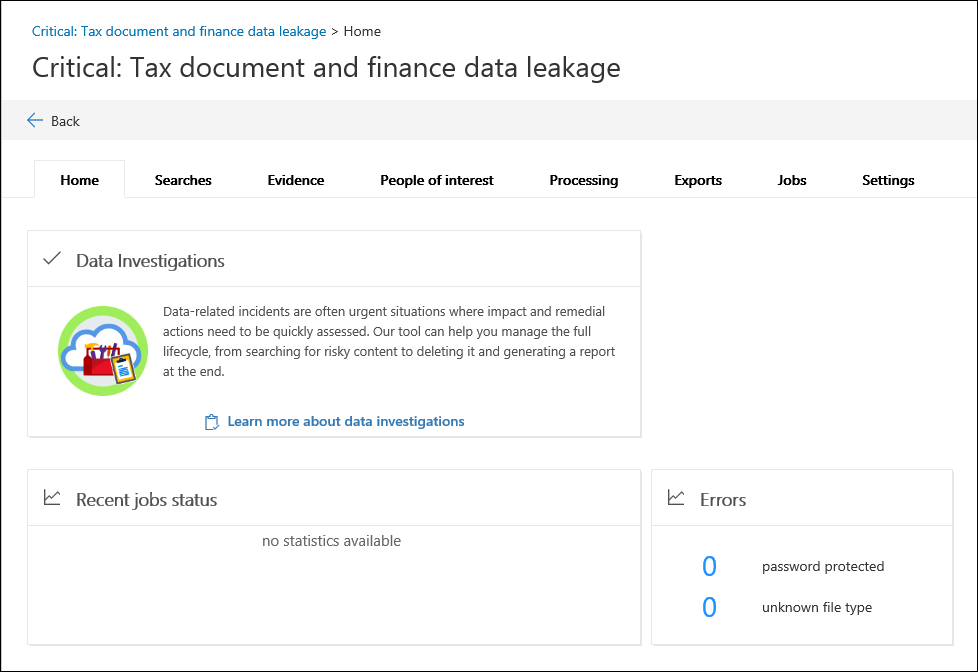

# Creare una nuova indagine in indagini sui dati (anteprima)

1. Passare a [https://compliance.microsoft.com](https://compliance.microsoft.com).
    
2. Accedere usando l'account di lavoro o della scuola.
    
3. Nel centro conformità fare clic su **indagini sui dati**.
 
4. Nella pagina **indagini dati (anteprima)** fare clic su **Crea nuova indagine**.
    
5. Nella pagina nuovo riquadro a comparsa **dei dati** , assegnare un nome all'indagine (obbligatorio) e quindi digitare un numero di ricerca facoltativo e una descrizione. Si noti che il nome dell'indagine deve essere univoco nell'organizzazione.

6. In **se si desidera configurare altre impostazioni dopo aver creato l'indagine**, eseguire una delle operazioni seguenti:

    - Fare clic su **Sì** per creare l'analisi e visualizzare la pagina **Impostazioni** nella nuova indagine. In questo modo è possibile aggiungere membri all'indagine.
    
    - Fare clic su **No** per creare solo l'analisi e visualizzarla nell'elenco delle indagini sulla pagina **indagini dati (anteprima)** . Se si sceglie questa opzione, verrà aggiunto come unico membro dell'indagine e verranno utilizzate le impostazioni di ricerca e analisi predefinite. È possibile aggiungere membri o modificare le impostazioni in qualsiasi momento dopo la creazione dell'indagine.

7. Fare clic su **Salva** per creare l'indagine.

    La nuova analisi viene visualizzata nell'elenco delle indagini sulla pagina **indagini dati (Preview)** . 

8. Per aprire un'indagine, fare clic sul nome dell'indagine. 

    Viene visualizzata la scheda **Home** per l'indagine. Ad esempio, di seguito è riportato un nuovo studio denominato *Critical: Tax Document e Finance Data dispersione*.

    
