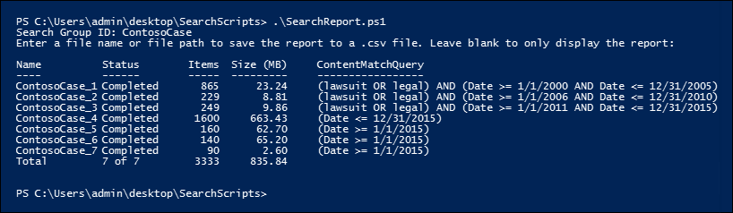
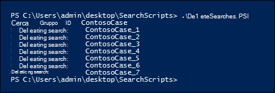

# <a name="create-report-on-and-delete-multiple-content-searches"></a>Creare, analizzare ed eliminare più ricerche di contenuto

 La creazione rapida di ricerche di individuazione e la creazione di report è spesso un passaggio importante in eDiscovery e nelle indagini quando si prova a conoscere i dati sottostanti e la qualità e la qualità delle ricerche. A tale scopo, PowerShell per Centro sicurezza & conformità offre una serie di cmdlet per automatizzare le attività di Ricerca contenuto che richiedono molto tempo. Questi script forniscono un modo semplice e rapido per creare una serie di ricerche e quindi eseguire report dei risultati di ricerca stimati che consentono di determinare la quantità di dati in questione. È inoltre possibile utilizzare gli script per creare versioni diverse delle ricerche per confrontare i risultati prodotti da ognuno di essi. Questi script consentono di identificare e rimuovere i dati in modo rapido ed efficiente.

## <a name="before-you-create-a-content-search"></a>Prima di creare una ricerca di contenuto

- Per eseguire gli script descritti in questo argomento, è necessario essere membri del gruppo di ruoli Gestore di eDiscovery nel Centro sicurezza & conformità.

- Per raccogliere un elenco degli URL per i siti di OneDrive for Business nell'organizzazione che è possibile aggiungere al file CSV nel passaggio 1, vedere Creare un elenco di tutti i percorsi di [OneDrive nell'organizzazione.](https://docs.microsoft.com/onedrive/list-onedrive-urls)

- Assicurarsi di salvare tutti i file creati in questo argomento nella stessa cartella. In questo modo sarà più semplice eseguire gli script.

- Gli script includono una gestione degli errori minima. Il loro scopo principale è creare rapidamente, creare report ed eliminare più ricerche di contenuto.

- Gli script di esempio forniti in questo articolo non sono supportati da alcun programma o servizio standard di supporto Microsoft. Gli script di esempio sono forniti così come sono senza alcun tipo di garanzia. Inoltre Microsoft declina ogni responsabilità su garanzie implicite, senza alcuna limitazione, incluse le garanzie implicite di commerciabilità e/o adeguatezza per uno scopo specifico. Qualsiasi rischio eventuale pervenga, durante l'utilizzo degli script di esempio e della documentazione, si intende a carico dell'utente. In nessun caso Microsoft, i suoi autori o chiunque altro coinvolto nella creazione, produzione o consegna degli script è da ritenersi responsabile per qualsiasi danno eventuale (inclusi, senza limitazione alcuna, danni riguardanti profitti aziendali, interruzione di attività, perdita di informazioni aziendali o altra perdita pecuniaria) derivanti dall'utilizzo o dall'incapacità di utilizzo degli script di esempio e della documentazione, anche nel caso in cui Microsoft sia stata avvisata della possibilità di tali danni.

## <a name="step-1-create-a-csv-file-that-contains-information-about-the-searches-you-want-to-run"></a>Passaggio 1: Creare un file CSV contenente informazioni sulle ricerche che si desidera eseguire

Il file con valori delimitati da virgole (CSV) creato in questo passaggio contiene una riga per ogni utente che desidera eseguire la ricerca. È possibile eseguire ricerche nella cassetta postale di Exchange Online dell'utente (che include la cassetta postale di archiviazione, se abilitata) e nel sito di OneDrive for Business. Oppure è possibile eseguire una ricerca solo nella cassetta postale o nel sito di OneDrive for Business. È inoltre possibile eseguire ricerche in qualsiasi sito dell'organizzazione di SharePoint Online. Lo script eseguito nel passaggio 3 creerà una ricerca separata per ogni riga nel file CSV.

1. Copia e incolla il testo seguente in un file txt usando NotePad. Salvare il file in una cartella nel computer locale. Anche gli altri script verranno salvate in questa cartella.

   ```text
   ExchangeLocation,SharePointLocation,ContentMatchQuery,StartDate,EndDate
   sarad@contoso.onmicrosoft.com,https://contoso-my.sharepoint.com/personal/sarad_contoso_onmicrosoft_com,(lawsuit OR legal),1/1/2000,12/31/2005
   sarad@contoso.onmicrosoft.com,https://contoso-my.sharepoint.com/personal/sarad_contoso_onmicrosoft_com,(lawsuit OR legal),1/1/2006,12/31/2010
   sarad@contoso.onmicrosoft.com,https://contoso-my.sharepoint.com/personal/sarad_contoso_onmicrosoft_com,(lawsuit OR legal),1/1/2011,3/21/2016
   ,https://contoso.sharepoint.com/sites/contoso,,,3/21/2016
   ,https://contoso-my.sharepoint.com/personal/davidl_contoso_onmicrosoft_com,,1/1/2015,
   ,https://contoso-my.sharepoint.com/personal/janets_contoso_onmicrosoft_com,,1/1/2015,
   ```

   Nella prima riga, o riga di intestazione, del file sono elencati i parametri che verranno utilizzati dal cmdlet **New-ComplianceSearch** (nello script nel passaggio 3) per creare una nuova ricerca di contenuto. Ogni nome di parametro è separato da una virgola. Assicurati che non siano presenti spazi nella riga di intestazione. Ogni riga sotto la riga di intestazione rappresenta i valori dei parametri per ogni ricerca. Assicurarsi di sostituire i dati segnaposto nel file CSV con i dati effettivi.

2. Aprire il file txt in Excel e quindi utilizzare le informazioni nella tabella seguente per modificare il file con le informazioni per ogni ricerca.

   ****

   |Parametro|Descrizione|
   |---|---|
   |`ExchangeLocation`|Indirizzo SMTP della cassetta postale dell'utente.|
   |`SharePointLocation`|L'URL del sito di OneDrive for Business dell'utente o l'URL di qualsiasi sito dell'organizzazione. Per l'URL dei siti di OneDrive for Business, utilizzare questo formato: ` https://<your organization>-my.sharepoint.com/personal/<user alias>_<your organization>_onmicrosoft_com ` . Ad esempio,  `https://contoso-my.sharepoint.com/personal/sarad_contoso_onmicrosoft_com`.|
   |`ContentMatchQuery`|Query di ricerca per la ricerca. Per ulteriori informazioni sulla creazione di una query di ricerca, vedere Query con parole [chiave e condizioni di ricerca per Ricerca contenuto.](keyword-queries-and-search-conditions.md)|
   |`StartDate`|Per la posta elettronica, la data in cui un messaggio è stato ricevuto da un destinatario o inviato dal mittente. Per i documenti nei siti di SharePoint o OneDrive for Business, la data in cui un documento è stato modificato per l'ultima volta o dopo l'ultima modifica.|
   |`EndDate`|Per la posta elettronica, la data in cui un messaggio è stato inviato dall'utente o prima di quello precedente. Per i documenti nei siti di SharePoint o OneDrive for Business, la data dell'ultima modifica di un documento o prima di quella precedente.|
   |

3. Salvare il file di Excel come file CSV in una cartella nel computer locale. Lo script creato nel passaggio 3 utilizzerà le informazioni in questo file CSV per creare le ricerche.

## <a name="step-2-connect-to-security--compliance-center-powershell"></a>Passaggio 2: Connettersi a PowerShell in Centro sicurezza e conformità

Il passaggio successivo consiste nel connettersi a PowerShell in Centro sicurezza e conformità per l'organizzazione. Per ottenere istruzioni dettagliate, vedere [Connettersi a PowerShell in Centro sicurezza e conformità](https://docs.microsoft.com/powershell/exchange/connect-to-scc-powershell).

## <a name="step-3-run-the-script-to-create-and-start-the-searches"></a>Passaggio 3: Eseguire lo script per creare e avviare le ricerche

Lo script di questo passaggio creerà una ricerca contenuto separata per ogni riga del file CSV creato nel passaggio 1. Quando si esegue questo script, verrà richiesto di immettere due valori:

- **ID gruppo di** ricerca: questo nome consente di organizzare in modo semplice le ricerche create dal file CSV. Ogni ricerca creata viene denominata con l'ID del gruppo di ricerca e quindi viene aggiunto un numero al nome della ricerca. Ad esempio, se si immette **ContosoCase** come ID gruppo di ricerca, le ricerche vengono denominate **ContosoCase_1,** **ContosoCase_2,** **ContosoCase_3** e così via. Si noti che per il nome digitato viene distinzione tra maiuscole e minuscole. Quando si utilizza l'ID gruppo di ricerca nei passaggi 4 e 5, è necessario utilizzare lo stesso caso utilizzato al momento della creazione.

- **File CSV** - Nome del file CSV creato nel passaggio 1. Assicurarsi di includere il nome di file completo, includere l'estensione del file CSV. ad esempio  `ContosoCase.csv` .

Per eseguire lo script:

1. Salvare il testo seguente in un file Windows PowerShell script utilizzando il suffisso del nome file ps1. ad esempio `CreateSearches.ps1` . Salvare il file nella stessa cartella in cui sono stati salvati gli altri file.

   ```Powershell
   # Get the Search Group ID and the location of the CSV input file
   $searchGroup = Read-Host 'Search Group ID'
   $csvFile = Read-Host 'Source CSV file'

   # Do a quick check to make sure our group name will not collide with other searches
   $searchCounter = 1
   import-csv $csvFile |
     ForEach-Object{

     $searchName = $searchGroup +'_' + $searchCounter
     $search = Get-ComplianceSearch $searchName -EA SilentlyContinue
     if ($search)
     {
        Write-Error "The Search Group ID conflicts with existing searches.  Please choose a search group name and restart the script."
        return
     }
     $searchCounter++
   }

   $searchCounter = 1
   import-csv $csvFile |
     ForEach-Object{

     # Create the query
     $query = $_.ContentMatchQuery
     if(($_.StartDate -or $_.EndDate))
     {
          # Add the appropriate date restrictions.  NOTE: Using the Date condition property here because it works across Exchange, SharePoint, and OneDrive for Business.
          # For Exchange, the Date condition property maps to the Sent and Received dates; for SharePoint and OneDrive for Business, it maps to Created and Modified dates.
          if($query)
          {
              $query += " AND"
          }
          $query += " ("
          if($_.StartDate)
          {
              $query += "Date >= " + $_.StartDate
          }
          if($_.EndDate)
          {
              if($_.StartDate)
              {
                  $query += " AND "
              }
              $query += "Date <= " + $_.EndDate
          }
          $query += ")"
     }

     # -ExchangeLocation can't be set to an empty string, set to null if there's no location.
     $exchangeLocation = $null
     if ( $_.ExchangeLocation)
     {
           $exchangeLocation = $_.ExchangeLocation
     }

     # Create and run the search
     $searchName = $searchGroup +'_' + $searchCounter
     Write-Host "Creating and running search: " $searchName -NoNewline
     $search = New-ComplianceSearch -Name $searchName -ExchangeLocation $exchangeLocation -SharePointLocation $_.SharePointLocation -ContentMatchQuery $query

     # Start and wait for each search to complete
     Start-ComplianceSearch $search.Name
     while ((Get-ComplianceSearch $search.Name).Status -ne "Completed")
     {
        Write-Host " ." -NoNewline
        Start-Sleep -s 3
     }
     Write-Host ""

     $searchCounter++
   }
   ```

2. In Windows PowerShell, passare alla cartella in cui è stato salvato lo script nel passaggio precedente ed eseguire lo script; Per esempio:

   ```Powershell
   .\CreateSearches.ps1
   ```

3. Al prompt **ID gruppo** di ricerca digitare il nome di un gruppo di ricerca e quindi premere **INVIO.** ad esempio  `ContosoCase` . Ricorda che questo nome fa distinzione tra maiuscole e minuscole, quindi dovrai digitarlo allo stesso modo nei passaggi successivi.

4. Al prompt **dei file CSV di** origine digitare il nome del file CSV, inclusa l'estensione del file CSV. ad esempio  `ContosoCase.csv` .

5. Premere **INVIO** per continuare a eseguire lo script.

   Lo script visualizza lo stato di avanzamento della creazione e dell'esecuzione delle ricerche. Una volta completato, lo script torna al prompt.

   

## <a name="step-4-run-the-script-to-report-the-search-estimates"></a>Passaggio 4: Eseguire lo script per segnalare le stime della ricerca

Dopo aver creato le ricerche, il passaggio successivo consiste nell'eseguire uno script che visualizza un semplice report del numero di risultati della ricerca per ogni ricerca creata nel passaggio 3. Il report include anche le dimensioni dei risultati per ogni ricerca e il numero totale di riscontri e le dimensioni totali di tutte le ricerche. Quando si esegue lo script di creazione dei report, verranno chieti l'ID del gruppo di ricerca e un nome file CSV se si desidera salvare il report in un file CSV.

1. Salvare il testo seguente in un file Windows PowerShell script utilizzando il suffisso del nome file ps1. ad esempio `SearchReport.ps1` . Salvare il file nella stessa cartella in cui sono stati salvati gli altri file.

   ```Powershell
   $searchGroup = Read-Host 'Search Group ID'
   $outputFile = Read-Host 'Enter a file name or file path to save the report to a .csv file. Leave blank to only display the report'
   $searches = Get-ComplianceSearch | ?{$_.Name -clike $searchGroup + "_*"}
   $allSearchStats = @()
   foreach ($partialObj in $searches)
   {
      $search = Get-ComplianceSearch $partialObj.Name
      $sizeMB = [System.Math]::Round($search.Size / 1MB, 2)
      $searchStatus = $search.Status
      if($search.Errors)
      {
          $searchStatus = "Failed"
      }elseif($search.NumFailedSources -gt 0)
      {
          $searchStatus = "Failed Sources"
      }
      $searchStats = New-Object PSObject
      Add-Member -InputObject $searchStats -MemberType NoteProperty -Name Name -Value $search.Name
      Add-Member -InputObject $searchStats -MemberType NoteProperty -Name ContentMatchQuery -Value $search.ContentMatchQuery
      Add-Member -InputObject $searchStats -MemberType NoteProperty -Name Status -Value $searchStatus
      Add-Member -InputObject $searchStats -MemberType NoteProperty -Name Items -Value $search.Items
      Add-Member -InputObject $searchStats -MemberType NoteProperty -Name "Size" -Value $search.Size
      Add-Member -InputObject $searchStats -MemberType NoteProperty -Name "Size(MB)" -Value $sizeMB
      $allSearchStats += $searchStats
   }
   # Calculate the totals
   $allItems = ($allSearchStats | Measure-Object Items -Sum).Sum
   # Convert the total size to MB and round to the nearst 100th
   $allSize = ($allSearchStats | Measure-Object 'Size' -Sum).Sum
   $allSizeMB = [System.Math]::Round($allSize  / 1MB, 2)
   # Get the total successful searches and total of all searches
   $allSuccessCount = ($allSearchStats |?{$_.Status -eq "Completed"}).Count
   $allCount = $allSearchStats.Count
   $allStatus = [string]$allSuccessCount + " of " + [string]$allCount
   # Totals Row
   $totalSearchStats = New-Object PSObject
   Add-Member -InputObject $totalSearchStats -MemberType NoteProperty -Name Name -Value "Total"
   Add-Member -InputObject $totalSearchStats -MemberType NoteProperty -Name Status -Value $allStatus
   Add-Member -InputObject $totalSearchStats -MemberType NoteProperty -Name Items -Value $allItems
   Add-Member -InputObject $totalSearchStats -MemberType NoteProperty -Name "Size(MB)" -Value $allSizeMB
   $allSearchStats += $totalSearchStats
   # Just get the columns we're interested in showing
   $allSearchStatsPrime = $allSearchStats | Select-Object Name, Status, Items, "Size(MB)", ContentMatchQuery
   # Print the results to the screen
   $allSearchStatsPrime |ft -AutoSize -Wrap
   # Save the results to a CSV file
   if ($outputFile)
   {
      $allSearchStatsPrime | Export-Csv -Path $outputFile -NoTypeInformation
   }
   ```

2. In Windows PowerShell, passare alla cartella in cui è stato salvato lo script nel passaggio precedente ed eseguire lo script; Per esempio:

   ```Powershell
   .\SearchReport.ps1
   ```

3. Al prompt **ID gruppo** di ricerca digitare il nome di un gruppo di ricerca e quindi premere **INVIO.** ad esempio  `ContosoCase` . Ricorda che questo nome fa distinzione tra maiuscole e minuscole, quindi dovrai digitarlo nello stesso modo in cui hai eseguito lo script nel passaggio 3.

4. At the **File path to save the report to a CSV file (leave blank to just display the report) prompt,** type a file name of complete filename path (including the .csv file extension) if you want to save the report to a CSV file. nome del file CSV, inclusa l'estensione del file CSV. Ad esempio, è possibile digitare per salvarlo nella directory corrente oppure digitare per  `ContosoCaseReport.csv`  `C:\Users\admin\OneDrive for Business\ContosoCase\ContosoCaseReport.csv` salvarlo in un'altra cartella. È inoltre possibile lasciare vuoto il prompt per visualizzare il report ma non salvarlo in un file.

5. Premere **INVIO**.

   Lo script visualizza lo stato di avanzamento della creazione e dell'esecuzione delle ricerche. Al termine dello script, viene visualizzato il report.

   

> [!NOTE]
> Se la stessa cassetta postale o sito viene specificata come posizione del contenuto in più ricerche in un gruppo di ricerca, la stima totale dei risultati nel rapporto (sia per il numero di elementi che per le dimensioni totali) potrebbe includere i risultati per gli stessi elementi. Questo perché lo stesso messaggio o documento di posta elettronica verrà conteggiato più volte se corrisponde alla query per ricerche diverse nel gruppo di ricerca.

## <a name="step-5-run-the-script-to-delete-the-searches"></a>Passaggio 5: Eseguire lo script per eliminare le ricerche

Poiché è possibile che si creino molte ricerche, questo ultimo script semplifica semplicemente l'eliminazione rapida delle ricerche create nel passaggio 3. Come gli altri script, anche questo richiede l'ID del gruppo di ricerca. Tutte le ricerche con l'ID del gruppo di ricerca nel nome della ricerca verranno eliminate quando si esegue questo script.

1. Salvare il testo seguente in un file Windows PowerShell script utilizzando il suffisso del nome file ps1. ad esempio `DeleteSearches.ps1` . Salvare il file nella stessa cartella in cui sono stati salvati gli altri file.

   ```Powershell
   # Delete all searches in a search group
   $searchGroup = Read-Host 'Search Group ID'
   Get-ComplianceSearch |
      ForEach-Object{
      # If the name matches the search group name pattern (case sensitive), delete the search
      if ($_.Name -cmatch $searchGroup + "_\d+")
      {
          Write-Host "Deleting search: " $_.Name
          Remove-ComplianceSearch $_.Name -Confirm:$false
      }
   }
   ```

2. In Windows PowerShell, passare alla cartella in cui è stato salvato lo script nel passaggio precedente ed eseguire lo script; Per esempio:

   ```Powershell
   .\DeleteSearches.ps1
   ```

3. Al prompt **ID gruppo** di ricerca digitare il nome di un gruppo di ricerca per le ricerche che si desidera eliminare e quindi premere **INVIO.** ad esempio  `ContosoCase` . Ricorda che questo nome fa distinzione tra maiuscole e minuscole, quindi dovrai digitarlo nello stesso modo in cui hai eseguito lo script nel passaggio 3.

   Lo script visualizza il nome di ogni ricerca eliminata.

   
