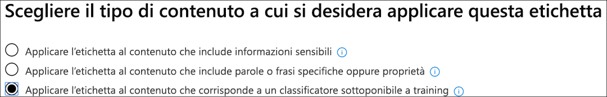
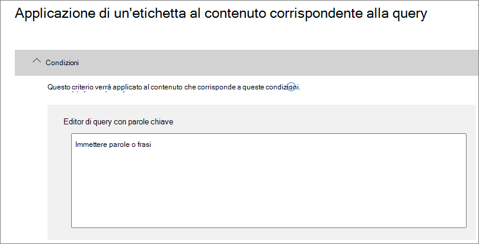

# <a name="create-publish-and-auto-apply-retention-labels"></a><span data-ttu-id="af51d-103">Creare, pubblicare e applicare automaticamente etichette di conservazione</span><span class="sxs-lookup"><span data-stu-id="af51d-103">Create, publish, and auto-apply retention labels</span></span>

><span data-ttu-id="af51d-104">*[Indicazioni per l'assegnazione di licenze di Microsoft 365 per sicurezza e conformità](https://aka.ms/ComplianceSD).*</span><span class="sxs-lookup"><span data-stu-id="af51d-104">*[Microsoft 365 licensing guidance for security & compliance](https://aka.ms/ComplianceSD).*</span></span>

<span data-ttu-id="af51d-105">Usare le informazioni seguenti per creare [etichette di conservazione](labels.md) e quindi applicarle automaticamente a documenti e messaggi di posta elettronica, oppure pubblicarle in modo che gli utenti possano applicarle manualmente.</span><span class="sxs-lookup"><span data-stu-id="af51d-105">Use the following information to help you create [retention labels](labels.md), and then automatically apply them to documents and emails, or publish them so that users can manually apply them.</span></span>

<span data-ttu-id="af51d-106">Le etichette di conservazione aiutano a conservare tutto ciò che serve ed eliminare ciò che non serve.</span><span class="sxs-lookup"><span data-stu-id="af51d-106">Retention labels help you retain what you need and delete what you don't.</span></span> <span data-ttu-id="af51d-107">Vengono anche usate anche per dichiarare un elemento come record nell'ambito di una soluzione di [gestione dei record](records-management.md) per i dati di Microsoft 365.</span><span class="sxs-lookup"><span data-stu-id="af51d-107">They are also used to declare an item as a record as part of a [records management](records-management.md) solution for your Microsoft 365 data.</span></span>

<span data-ttu-id="af51d-108">La posizione in cui si creano e si configurano le etichette di conservazione varia a seconda che si usi o meno la gestione dei record.</span><span class="sxs-lookup"><span data-stu-id="af51d-108">Where you create and configure your retention labels depend on whether you're using records management or not.</span></span> <span data-ttu-id="af51d-109">Sono disponibili istruzioni per entrambi gli scenari.</span><span class="sxs-lookup"><span data-stu-id="af51d-109">Instructions are provided for both scenarios.</span></span>

## <a name="before-you-begin"></a><span data-ttu-id="af51d-110">Prima di iniziare</span><span class="sxs-lookup"><span data-stu-id="af51d-110">Before you begin</span></span>

<span data-ttu-id="af51d-111">Ai membri del team di conformità che creeranno etichette di conservazione è necessario assegnare autorizzazioni per il Centro sicurezza &amp; conformità.</span><span class="sxs-lookup"><span data-stu-id="af51d-111">Members of your compliance team who will create retention labels need permissions to the Security &amp; Compliance Center.</span></span> <span data-ttu-id="af51d-112">Per impostazione predefinita, l'amministratore del tenant ha accesso a questa posizione e può fornire ai responsabili della conformità e ad altre persone l'accesso al Centro sicurezza &amp; conformità, senza concedere tutte le autorizzazioni di un amministratore del tenant. A questo scopo, è consigliabile accedere alla pagina **Autorizzazioni** del Centro sicurezza &amp; conformità, modificare il gruppo di ruoli **Amministratore conformità** e aggiungere membri a tale gruppo di ruoli.</span><span class="sxs-lookup"><span data-stu-id="af51d-112">By default, your tenant admin has access to this location and can give compliance officers and other people access to the Security &amp; Compliance Center, without giving them all of the permissions of a tenant admin. To do this, we recommend that you go to the **Permissions** page of the Security &amp; Compliance Center, edit the **Compliance Administrator** role group, and add members to that role group.</span></span> 
  
<span data-ttu-id="af51d-113">Per ulteriori informazioni, vedere [Concedere agli utenti l'accesso al Centro sicurezza e conformità di Office 365](../security/office-365-security/grant-access-to-the-security-and-compliance-center.md).</span><span class="sxs-lookup"><span data-stu-id="af51d-113">For more information, see [Give users access to the Office 365 Security &amp; Compliance Center](../security/office-365-security/grant-access-to-the-security-and-compliance-center.md).</span></span>
  
<span data-ttu-id="af51d-p104">Queste autorizzazioni sono necessarie solo per creare e applicare etichette di conservazione e criteri di etichetta. L'applicazione dei criteri non richiede l'accesso al contenuto.</span><span class="sxs-lookup"><span data-stu-id="af51d-p104">These permissions are required only to create and apply retention labels and a label policy. Policy enforcement does not require access to the content.</span></span>

## <a name="create-and-configure-retention-labels"></a><span data-ttu-id="af51d-116">Creare e configurare etichette di conservazione</span><span class="sxs-lookup"><span data-stu-id="af51d-116">Create and configure retention labels</span></span>

1. <span data-ttu-id="af51d-117">Nel [Centro conformità Microsoft 365](https://compliance.microsoft.com/) passare a una delle posizioni seguenti:</span><span class="sxs-lookup"><span data-stu-id="af51d-117">In the [Microsoft 365 compliance center](https://compliance.microsoft.com/), navigate to one of the following locations:</span></span>
    
    - <span data-ttu-id="af51d-118">Se si usa la gestione dei record:</span><span class="sxs-lookup"><span data-stu-id="af51d-118">If you are using records management:</span></span>
        - <span data-ttu-id="af51d-119">**Soluzioni** > **Records management** > scheda **Piano di archiviazione** > **+ Crea un'etichetta** > **Etichetta di conservazione**</span><span class="sxs-lookup"><span data-stu-id="af51d-119">**Solutions** > **Records management** > **File plan** tab > **+ Create a label** > **Retention label**</span></span>
        
    - <span data-ttu-id="af51d-120">Se non si usa la gestione dei record:</span><span class="sxs-lookup"><span data-stu-id="af51d-120">If you are not using records management:</span></span>
       - <span data-ttu-id="af51d-121">**Soluzioni** > **Governance delle informazioni** > scheda **Etichette** > + **Crea un'etichetta**</span><span class="sxs-lookup"><span data-stu-id="af51d-121">**Solutions** > **Information governance** > **Labels** tab > + **Create a label**</span></span>
    
    <span data-ttu-id="af51d-122">L'opzione non è immediatamente visibile?</span><span class="sxs-lookup"><span data-stu-id="af51d-122">Don't immediately see your option?</span></span> <span data-ttu-id="af51d-123">Selezionare per prima cosa **Mostra tutto**.</span><span class="sxs-lookup"><span data-stu-id="af51d-123">First select **Show all**.</span></span> 

2. <span data-ttu-id="af51d-124">Seguire le istruzioni della procedura guidata.</span><span class="sxs-lookup"><span data-stu-id="af51d-124">Follow the prompts in the wizard.</span></span> <span data-ttu-id="af51d-125">Se si usa la gestione dei record:</span><span class="sxs-lookup"><span data-stu-id="af51d-125">If you are using records management:</span></span>
    
    - <span data-ttu-id="af51d-126">Per informazioni sui descrittori del piano di archiviazione, vedere [Panoramica della gestione del piano di archiviazione](file-plan-manager.md)</span><span class="sxs-lookup"><span data-stu-id="af51d-126">For information about the file plan descriptors, see [Overview of file plan manager](file-plan-manager.md)</span></span>
    
    - <span data-ttu-id="af51d-127">Per usare l'etichetta di conservazione per dichiarare il contenuto come record, attivare la casella di controllo **Usa l'etichetta per classificare il contenuto come "Record"**.</span><span class="sxs-lookup"><span data-stu-id="af51d-127">To use the retention label to declare content as a record, enable the checkbox **Use label to classify content as a "Record"**.</span></span>

3. <span data-ttu-id="af51d-128">Ripetere questi passaggi per creare altre etichette.</span><span class="sxs-lookup"><span data-stu-id="af51d-128">Repeat these steps to create more labels.</span></span>

<span data-ttu-id="af51d-129">Per modificare un'etichetta esistente, selezionarla e quindi scegliere **Modifica etichetta**.</span><span class="sxs-lookup"><span data-stu-id="af51d-129">To edit an existing label, select it, and then select **Edit label**.</span></span> <span data-ttu-id="af51d-130">Verrà avviata la stessa procedura guidata, che consente di modificare le descrizioni e le impostazioni delle etichette nel passaggio 2.</span><span class="sxs-lookup"><span data-stu-id="af51d-130">This starts the same wizard, which lets you change the label descriptions and settings in step 2.</span></span>

## <a name="publish-retention-labels-by-creating-a-retention-label-policy"></a><span data-ttu-id="af51d-131">Pubblicare etichette di conservazione creando un criterio di etichetta di conservazione</span><span class="sxs-lookup"><span data-stu-id="af51d-131">Publish retention labels by creating a retention label policy</span></span>

<span data-ttu-id="af51d-132">Pubblicare le etichette di conservazione in modo che possano essere applicate manualmente dagli utenti.</span><span class="sxs-lookup"><span data-stu-id="af51d-132">Publish retention labels so that they can be manually applied by users.</span></span>

1. <span data-ttu-id="af51d-133">Nel [Centro conformità Microsoft 365](https://compliance.microsoft.com/) passare a una delle posizioni seguenti:</span><span class="sxs-lookup"><span data-stu-id="af51d-133">In the [Microsoft 365 compliance center](https://compliance.microsoft.com/), navigate to one of the following locations:</span></span>
    
    - <span data-ttu-id="af51d-134">Se si usa la gestione dei record:</span><span class="sxs-lookup"><span data-stu-id="af51d-134">If you are using records management:</span></span>
        - <span data-ttu-id="af51d-135">**Soluzioni** > **Gestione dei record** scheda > **Criteri delle etichette** > **Pubblica etichette**</span><span class="sxs-lookup"><span data-stu-id="af51d-135">**Solutions** > **Records management** > > **Label policies** tab > **Publish labels**</span></span>
    
    - <span data-ttu-id="af51d-136">Se non si usa la gestione dei record:</span><span class="sxs-lookup"><span data-stu-id="af51d-136">If you are not using records management:</span></span>
        - <span data-ttu-id="af51d-137">**Soluzioni** > **Governance delle informazioni** > scheda **Criteri delle etichette** > **Pubblica etichette**</span><span class="sxs-lookup"><span data-stu-id="af51d-137">**Solutions** > **Information governance** > **Label policies** tab > **Publish labels**</span></span>
    
    <span data-ttu-id="af51d-138">L'opzione non è immediatamente visibile?</span><span class="sxs-lookup"><span data-stu-id="af51d-138">Don't immediately see your option?</span></span> <span data-ttu-id="af51d-139">Selezionare per prima cosa **Mostra tutto**.</span><span class="sxs-lookup"><span data-stu-id="af51d-139">First select **Show all**.</span></span> 

2. <span data-ttu-id="af51d-140">Seguire le istruzioni della procedura guidata.</span><span class="sxs-lookup"><span data-stu-id="af51d-140">Follow the prompts in the wizard.</span></span>
    
    <span data-ttu-id="af51d-141">Per informazioni sulla configurazione delle posizioni, vedere la sezione [Etichette di conservazione e posizioni](#retention-labels-and-locations) in questa pagina.</span><span class="sxs-lookup"><span data-stu-id="af51d-141">For information about configuring the locations, see the [Retention labels and locations](#retention-labels-and-locations) section on this page.</span></span> 

## <a name="auto-apply-a-retention-label"></a><span data-ttu-id="af51d-142">Applicare automaticamente un'etichetta di conservazione</span><span class="sxs-lookup"><span data-stu-id="af51d-142">Auto-apply a retention label</span></span>

<span data-ttu-id="af51d-143">Applicare automaticamente un'etichetta di conservazione in base alle condizioni specificate.</span><span class="sxs-lookup"><span data-stu-id="af51d-143">Auto-apply a retention label, based on the conditions that you specify.</span></span>

1. <span data-ttu-id="af51d-144">Nel [Centro conformità Microsoft 365](https://compliance.microsoft.com/) passare a una delle posizioni seguenti:</span><span class="sxs-lookup"><span data-stu-id="af51d-144">In the [Microsoft 365 compliance center](https://compliance.microsoft.com/), navigate to one of the following locations:</span></span>
    
    - <span data-ttu-id="af51d-145">Se si usa la gestione dei record: **Governance delle informazioni**:</span><span class="sxs-lookup"><span data-stu-id="af51d-145">If you are using records management: **Information governance**:</span></span>
        - <span data-ttu-id="af51d-146">**Soluzioni** > **Gestione dei record** > scheda **Criteri delle etichette** > **Applica automaticamente le etichette**</span><span class="sxs-lookup"><span data-stu-id="af51d-146">**Solutions** > **Records management** > **Label policies** tab > **Auto-apply label**</span></span>
    
    - <span data-ttu-id="af51d-147">Se non si usa la gestione dei record:</span><span class="sxs-lookup"><span data-stu-id="af51d-147">If you are not using records management:</span></span>
        - <span data-ttu-id="af51d-148">**Soluzioni** > **Governance delle informazioni** > scheda **Criteri delle etichette** > **Applica automaticamente le etichette**</span><span class="sxs-lookup"><span data-stu-id="af51d-148">**Solutions** > **Information governance** > **Label policies** tab > **Auto-apply label**</span></span>
    
    <span data-ttu-id="af51d-149">L'opzione non è immediatamente visibile?</span><span class="sxs-lookup"><span data-stu-id="af51d-149">Don't immediately see your option?</span></span> <span data-ttu-id="af51d-150">Selezionare per prima cosa **Mostra tutto**.</span><span class="sxs-lookup"><span data-stu-id="af51d-150">First select **Show all**.</span></span> 

2. <span data-ttu-id="af51d-151">Seguire le istruzioni della procedura guidata.</span><span class="sxs-lookup"><span data-stu-id="af51d-151">Follow the prompts in the wizard.</span></span>
    
    <span data-ttu-id="af51d-152">Per informazioni su come configurare le condizioni per l'applicazione automatica dell'etichetta di conservazione, vedere la sezione [Configurare le condizioni per l'applicazione automatica delle etichette di conservazione](#configuring-conditions-for-auto-apply-retention-labels) in questa pagina.</span><span class="sxs-lookup"><span data-stu-id="af51d-152">For information about configuring the conditions that automatically apply the retention label, see the [Configuring conditions for auto-apply retention labels](#configuring-conditions-for-auto-apply-retention-labels) section on this page.</span></span>
    
    <span data-ttu-id="af51d-153">Per informazioni sulla configurazione delle posizioni, vedere la prossima sezione in questa pagina, [Etichette di conservazione e posizioni](#retention-labels-and-locations).</span><span class="sxs-lookup"><span data-stu-id="af51d-153">For information about configuring the locations, see the next section on this page, [Retention labels and locations](#retention-labels-and-locations).</span></span>

## <a name="retention-labels-and-locations"></a><span data-ttu-id="af51d-154">Etichette di conservazione e posizioni</span><span class="sxs-lookup"><span data-stu-id="af51d-154">Retention labels and locations</span></span>

<span data-ttu-id="af51d-155">È possibile pubblicare tipi di etichette di conservazione differenti in posizioni diverse, a seconda dell'azione eseguita dall'etichetta di conservazione.</span><span class="sxs-lookup"><span data-stu-id="af51d-155">Different types of retention labels can be published to different locations, depending on what the retention label does.</span></span>
  
|<span data-ttu-id="af51d-156">**Se l'etichetta di conservazione è...**</span><span class="sxs-lookup"><span data-stu-id="af51d-156">**If the retention label is…**</span></span>|<span data-ttu-id="af51d-157">**Il criterio di etichetta può essere applicato a…**</span><span class="sxs-lookup"><span data-stu-id="af51d-157">**Then the label policy can be applied to…**</span></span>|
|:-----|:-----|
|<span data-ttu-id="af51d-158">Pubblicata agli utenti finali</span><span class="sxs-lookup"><span data-stu-id="af51d-158">Published to end users</span></span>  <br/> |<span data-ttu-id="af51d-159">Exchange, SharePoint, OneDrive, gruppi di Office 365</span><span class="sxs-lookup"><span data-stu-id="af51d-159">Exchange, SharePoint, OneDrive, Office 365 groups</span></span>  <br/> |
|<span data-ttu-id="af51d-160">Applicata automaticamente in base ai tipi di informazioni riservate</span><span class="sxs-lookup"><span data-stu-id="af51d-160">Auto-applied based on sensitive information types</span></span>  <br/> |<span data-ttu-id="af51d-161">Exchange (solo a tutte le cassette postali), SharePoint, OneDrive</span><span class="sxs-lookup"><span data-stu-id="af51d-161">Exchange (all mailboxes only), SharePoint, OneDrive</span></span>  <br/> |
|<span data-ttu-id="af51d-162">Applicata automaticamente in base a una query</span><span class="sxs-lookup"><span data-stu-id="af51d-162">Auto-applied based on a query</span></span>  <br/> |<span data-ttu-id="af51d-163">Exchange, SharePoint, OneDrive, gruppi di Office 365</span><span class="sxs-lookup"><span data-stu-id="af51d-163">Exchange, SharePoint, OneDrive, Office 365 groups</span></span>  <br/> |
   
<span data-ttu-id="af51d-164">Le etichette di conservazione applicate automaticamente in Exchange (sia per le query che per i tipi di informazioni riservate) vengono applicate solo ai messaggi appena inviati (dati in transito), non a tutti gli elementi attualmente nella cassetta postale (dati archiviati).</span><span class="sxs-lookup"><span data-stu-id="af51d-164">In Exchange, auto-apply retention labels (for both queries and sensitive information types) are applied only to messages newly sent (data in transit), not to all items currently in the mailbox (data at rest).</span></span> <span data-ttu-id="af51d-165">Inoltre, le etichette di conservazione applicate automaticamente per i tipi di informazioni riservate possono essere applicate solo a tutte le cassette postali, non a cassette postali specifiche.</span><span class="sxs-lookup"><span data-stu-id="af51d-165">Also, auto-apply retention labels for sensitive information types can apply only to all mailboxes; you can't select the specific mailboxes.</span></span>
  
<span data-ttu-id="af51d-166">Le cartelle pubbliche di Exchange e Skype non supportano le etichette di conservazione.</span><span class="sxs-lookup"><span data-stu-id="af51d-166">Exchange public folders and Skype do not support retention labels.</span></span>


## <a name="configuring-conditions-for-auto-apply-retention-labels"></a><span data-ttu-id="af51d-167">Configurare le condizioni per l'applicazione automatica delle etichette di conservazione</span><span class="sxs-lookup"><span data-stu-id="af51d-167">Configuring conditions for auto-apply retention labels</span></span>

<span data-ttu-id="af51d-168">È possibile applicare automaticamente etichette di conservazione al contenuto quando questo contiene:</span><span class="sxs-lookup"><span data-stu-id="af51d-168">You can apply retention labels to content automatically when that content contains:</span></span>
  
- [<span data-ttu-id="af51d-169">Tipi specifici di informazioni riservate.</span><span class="sxs-lookup"><span data-stu-id="af51d-169">Specific types of sensitive information</span></span>](#auto-apply-labels-to-content-with-specific-types-of-sensitive-information)
    
- [<span data-ttu-id="af51d-170">Parole chiave specifiche che corrispondono a una query creata.</span><span class="sxs-lookup"><span data-stu-id="af51d-170">Specific keywords that match a query you create</span></span>](#auto-apply-labels-to-content-with-keywords-or-searchable-properties)

- [<span data-ttu-id="af51d-171">Una corrispondenza per classificatori sottoponibili a training</span><span class="sxs-lookup"><span data-stu-id="af51d-171">A match for trainable classifiers</span></span>](#auto-apply-labels-to-content-by-using-trainable-classifiers)
    


<span data-ttu-id="af51d-173">Possono essere necessari fino a sette giorni per applicare le etichette di conservazione ad applicazione automatica a tutto il contenuto che soddisfa le condizioni configurate.</span><span class="sxs-lookup"><span data-stu-id="af51d-173">It can take up to seven days for auto-apply retention labels to be applied to all content that matches the conditions you've configured.</span></span>

### <a name="auto-apply-labels-to-content-with-specific-types-of-sensitive-information"></a><span data-ttu-id="af51d-174">Applicare automaticamente etichette al contenuto con tipi specifici di informazioni sensibili</span><span class="sxs-lookup"><span data-stu-id="af51d-174">Auto-apply labels to content with specific types of sensitive information</span></span>

<span data-ttu-id="af51d-175">Quando si creano etichette di conservazione ad applicazione automatica per le informazioni riservate, viene visualizzato lo stesso elenco di modelli di criteri mostrato quando si creano criteri di prevenzione della perdita dei dati (DLP).</span><span class="sxs-lookup"><span data-stu-id="af51d-175">When you create auto-apply retention labels for sensitive information, you see the same list of policy templates as when you create a data loss prevention (DLP) policy.</span></span> <span data-ttu-id="af51d-176">Ogni modello di criteri è preconfigurato in modo da cercare specifici tipi di informazioni riservate.</span><span class="sxs-lookup"><span data-stu-id="af51d-176">Each policy template is preconfigured to look for specific types of sensitive information.</span></span> <span data-ttu-id="af51d-177">Ad esempio, il modello illustrato di seguito cerca codici identificativi del singolo contribuente (ITIN), codici di previdenza sociale (SSN) e numeri di passaporto statunitensi.</span><span class="sxs-lookup"><span data-stu-id="af51d-177">For example, the template shown here looks for U.S. ITIN, SSN, and passport numbers.</span></span> <span data-ttu-id="af51d-178">Per altre informazioni sui criteri DLP, vedere [Panoramica dei criteri di prevenzione della perdita dei dati](data-loss-prevention-policies.md).</span><span class="sxs-lookup"><span data-stu-id="af51d-178">To learn more about DLP, see [Overview of data loss prevention policies](data-loss-prevention-policies.md).</span></span>
  

  
<span data-ttu-id="af51d-p112">Dopo aver selezionato un modello di criteri, è possibile aggiungere o rimuovere qualunque tipo di informazioni riservate e modificare il numero di istanze e l'accuratezza della corrispondenza. Nell'esempio mostrato di seguito, verrà applicata automaticamente un'etichetta di conservazione solo quando:</span><span class="sxs-lookup"><span data-stu-id="af51d-p112">After you select a policy template, you can add or remove any types of sensitive information, and you can change the instance count and match accuracy. In the example shown here, a retention label will be auto-applied only when:</span></span>
  
- <span data-ttu-id="af51d-p113">Il contenuto include tra 1 e 9 istanze di qualsiasi di tipo di informazioni riservate. È possibile eliminare il valore **max** in modo che diventi **qualsiasi**.</span><span class="sxs-lookup"><span data-stu-id="af51d-p113">The content contains between 1 and 9 instances of any of these three sensitive information types. You can delete the **max** value so that it changes to **any**.</span></span>
    
- <span data-ttu-id="af51d-p114">Il tipo di informazioni riservate rilevate ha un'accuratezza della corrispondenza (o livello di attendibilità) di almeno 75. Molti tipi di informazioni riservate sono definiti con più criteri. I criteri con un livello di accuratezza della corrispondenza superiore richiedono l'individuazione di ulteriori elementi di prova (ad esempio parole chiave, date o indirizzi), mentre i criteri con un livello di accuratezza della corrispondenza inferiore richiedono meno elementi di prova. In parole povere, più basso è il valore di accuratezza della corrispondenza **min**, più facile sarà che il contenuto soddisfi la condizione.</span><span class="sxs-lookup"><span data-stu-id="af51d-p114">The type of sensitive information that's detected has a match accuracy (or confidence level) of at least 75. Many sensitive information types are defined with multiple patterns, where a pattern with a higher match accuracy requires more evidence to be found (such as keywords, dates, or addresses), while a pattern with a lower match accuracy requires less evidence. Simply put, the lower the **min** match accuracy, the easier it is for content to match the condition.</span></span> 
    
<span data-ttu-id="af51d-187">Per altre informazioni su queste opzioni, vedere [Tuning rules to make them easier or harder to match](data-loss-prevention-policies.md#tuning-rules-to-make-them-easier-or-harder-to-match) (Ottimizzazione delle regole per rendere più facile o difficile la corrispondenza).</span><span class="sxs-lookup"><span data-stu-id="af51d-187">For more information on these options, see [Tuning rules to make them easier or harder to match](data-loss-prevention-policies.md#tuning-rules-to-make-them-easier-or-harder-to-match).</span></span>
    

  
### <a name="auto-apply-labels-to-content-with-keywords-or-searchable-properties"></a><span data-ttu-id="af51d-189">Applicare automaticamente etichette al contenuto con parole chiave o con proprietà disponibili per le ricerche</span><span class="sxs-lookup"><span data-stu-id="af51d-189">Auto-apply labels to content with keywords or searchable properties</span></span>

<span data-ttu-id="af51d-p115">È possibile applicare automaticamente etichette al contenuto che soddisfa determinate condizioni. Le condizioni disponibili ora supportano l'applicazione di un'etichetta al contenuto che include parole, frasi, valori o proprietà disponibili per le ricerche specifiche. È possibile perfezionare la query usando operatori di ricerca come AND, OR e NOT.</span><span class="sxs-lookup"><span data-stu-id="af51d-p115">You can auto-apply labels to content that satisfies certain conditions. The conditions now available support applying a label to content that contains specific words, phrases, or values of searchable properties. You can refine your query by using search operators like AND, OR, and NOT.</span></span>

<span data-ttu-id="af51d-193">Per altre informazioni sulla sintassi della query, vedere:</span><span class="sxs-lookup"><span data-stu-id="af51d-193">For more information on query syntax, see:</span></span>

- [<span data-ttu-id="af51d-194">Riferimenti per la sintassi di Keyword Query Language (KQL)</span><span class="sxs-lookup"><span data-stu-id="af51d-194">Keyword Query Language (KQL) syntax reference</span></span>](https://docs.microsoft.com/sharepoint/dev/general-development/keyword-query-language-kql-syntax-reference)

<span data-ttu-id="af51d-p116">Le etichette basate su query usano l’indice di ricerca per identificare il contenuto. Per altre informazioni sulle proprietà disponibili per la ricerca valide, vedere:</span><span class="sxs-lookup"><span data-stu-id="af51d-p116">Query-based labels use the search index to identify content. For more information on valid searchable properties, see:</span></span>

- [<span data-ttu-id="af51d-197">Query con parole chiave e condizioni di ricerca per la Ricerca contenuto</span><span class="sxs-lookup"><span data-stu-id="af51d-197">Keyword queries and search conditions for Content Search</span></span>](keyword-queries-and-search-conditions.md)
- [<span data-ttu-id="af51d-198">Panoramica delle proprietà gestite e sottoposte a ricerca per indicizzazione in SharePoint Server</span><span class="sxs-lookup"><span data-stu-id="af51d-198">Overview of crawled and managed properties in SharePoint Server</span></span>](https://docs.microsoft.com/SharePoint/technical-reference/crawled-and-managed-properties-overview)

<span data-ttu-id="af51d-199">Esempi di query:</span><span class="sxs-lookup"><span data-stu-id="af51d-199">Examples queries:</span></span>

- <span data-ttu-id="af51d-200">Exchange</span><span class="sxs-lookup"><span data-stu-id="af51d-200">Exchange</span></span>
    - <span data-ttu-id="af51d-201">subject:"Quarterly Financials"</span><span class="sxs-lookup"><span data-stu-id="af51d-201">subject:"Quarterly Financials"</span></span>
    - <span data-ttu-id="af51d-202">recipients:garthf</span><span class="sxs-lookup"><span data-stu-id="af51d-202">recipients:garthf</span></span><!--nolink--><span data-ttu-id="af51d-203">@contoso.com</span><span class="sxs-lookup"><span data-stu-id="af51d-203">@contoso.com</span></span>
- <span data-ttu-id="af51d-204">SharePoint e OneDrive</span><span class="sxs-lookup"><span data-stu-id="af51d-204">SharePoint and OneDrive</span></span>
    - <span data-ttu-id="af51d-205">contenttype:contract</span><span class="sxs-lookup"><span data-stu-id="af51d-205">contenttype:contract</span></span>
    - <span data-ttu-id="af51d-206">site:https</span><span class="sxs-lookup"><span data-stu-id="af51d-206">site:https</span></span><!--nolink--><span data-ttu-id="af51d-207">://contoso.sharepoint.com/sites/teams/procurement AND contenttype:contract</span><span class="sxs-lookup"><span data-stu-id="af51d-207">://contoso.sharepoint.com/sites/teams/procurement AND contenttype:contract</span></span>




### <a name="auto-apply-labels-to-content-by-using-trainable-classifiers"></a><span data-ttu-id="af51d-209">Etichette applicate automaticamente al contenuto con classificatori sottoponibili a training</span><span class="sxs-lookup"><span data-stu-id="af51d-209">Auto-apply labels to content by using trainable classifiers</span></span>

<span data-ttu-id="af51d-210">Se si sceglie l'opzione del classificatore sottoponibile a training, è possibile selezionare un classificatore predefinito oppure personalizzato.</span><span class="sxs-lookup"><span data-stu-id="af51d-210">When you choose the option for a trainable classifier, you can select one of the built-in classifiers, or a custom classifier.</span></span> <span data-ttu-id="af51d-211">I classificatori predefiniti includono i **curriculum**, il **codice sorgente**, le **molestie mirate**, i **contenuti volgari** e le **minacce**:</span><span class="sxs-lookup"><span data-stu-id="af51d-211">The built-in classifiers include **Resumes**, **SourceCode**, **Targeted Harassment**, **Profanity**, and **Threat**:</span></span>


<span data-ttu-id="af51d-213">Per applicare automaticamente un'etichetta utilizzando questa opzione, i siti e le cassette postali di SharePoint Online devono avere almeno 10 MB di dati.</span><span class="sxs-lookup"><span data-stu-id="af51d-213">To automatically apply a label by using this option, SharePoint Online sites and mailboxes must have at least 10 MB of data.</span></span>

<span data-ttu-id="af51d-214">Per altre informazioni sui classificatori sottoponibili a training, vedere [Introduzione ai classificatori sottoponibili a training (anteprima)](classifier-getting-started-with.md).</span><span class="sxs-lookup"><span data-stu-id="af51d-214">For more information about trainable classifiers, see [Getting started with trainable classifiers (preview)](classifier-getting-started-with.md).</span></span>

<span data-ttu-id="af51d-215">Per avere un esempio di configurazione, vedere [Come preparare e usare un classificatore integrato](classifier-using-a-ready-to-use-classifier.md#how-to-verify-that-a-built-in-classifier-will-meet-your-needs).</span><span class="sxs-lookup"><span data-stu-id="af51d-215">For an example configuration, see [How to prepare for and use a built-in classifier](classifier-using-a-ready-to-use-classifier.md#how-to-verify-that-a-built-in-classifier-will-meet-your-needs).</span></span>

## <a name="how-long-it-takes-for-retention-labels-to-take-effect"></a><span data-ttu-id="af51d-216">Tempo necessario per l'applicazione delle etichette di conservazione</span><span class="sxs-lookup"><span data-stu-id="af51d-216">How long it takes for retention labels to take effect</span></span>

<span data-ttu-id="af51d-217">Quando si pubblicano o si applicano automaticamente le etichette di conservazione, queste non hanno effetto immediato:</span><span class="sxs-lookup"><span data-stu-id="af51d-217">When you publish or auto-apply retention labels, they don't take effect immediately:</span></span>
  
1. <span data-ttu-id="af51d-218">Per prima cosa i criteri di etichetta devono essere sincronizzati dall'interfaccia di amministrazione alle posizioni indicate nei criteri.</span><span class="sxs-lookup"><span data-stu-id="af51d-218">First the label policy needs to be synced from the admin center to the locations in the policy.</span></span>
    
2. <span data-ttu-id="af51d-219">Quindi, la posizione potrebbe richiedere del tempo per rendere disponibili le etichette di conservazione pubblicate agli utenti finali o per applicare automaticamente etichette al contenuto.</span><span class="sxs-lookup"><span data-stu-id="af51d-219">Then the location might require time to make published retention labels available to end users or time to auto-apply labels to content.</span></span> <span data-ttu-id="af51d-220">Il tempo necessario dipende dalla posizione e dal tipo di etichetta di conservazione.</span><span class="sxs-lookup"><span data-stu-id="af51d-220">How long this takes depends on the location and type of retention label.</span></span>
    
### <a name="published-retention-labels"></a><span data-ttu-id="af51d-221">Etichette di conservazione pubblicate</span><span class="sxs-lookup"><span data-stu-id="af51d-221">Published retention labels</span></span>

<span data-ttu-id="af51d-p119">Se si pubblicano etichette di conservazione in SharePoint o OneDrive, può essere necessario un giorno perché le etichette di conservazione siano visibili agli utenti finali. Se si pubblicano etichette di conservazione in Exchange, possono essere necessari 7 giorni perché le etichette di conservazione siano visibili agli utenti finali, inoltre la cassetta postale deve contenere almeno 10 MB di dati.</span><span class="sxs-lookup"><span data-stu-id="af51d-p119">If you publish retention labels to SharePoint or OneDrive, it can take one day for those retention labels to appear for end users. In addition, if you publish retention labels to Exchange, it can take 7 days for those retention labels to appear for end users, and the mailbox needs to contain at least 10 MB of data.</span></span>
  

  
### <a name="auto-apply-retention-labels"></a><span data-ttu-id="af51d-225">Applicare automaticamente etichette di conservazione</span><span class="sxs-lookup"><span data-stu-id="af51d-225">Auto-apply retention labels</span></span>

<span data-ttu-id="af51d-226">In caso di applicazione automatica di etichette di conservazione ai contenuti che soddisfano condizioni specifiche, possono essere necessari 7 giorni prima che le etichette di conservazione vengano applicate a tutto il contenuto esistente che soddisfa le condizioni.</span><span class="sxs-lookup"><span data-stu-id="af51d-226">If you auto-apply retention labels to content matching specific conditions, it can take seven days for the retention labels to be applied to all existing content that matches the conditions.</span></span>
  

  
### <a name="how-to-check-on-the-status-of-retention-labels-published-to-exchange"></a><span data-ttu-id="af51d-228">Come verificare lo stato delle etichette di conservazione pubblicate in Exchange</span><span class="sxs-lookup"><span data-stu-id="af51d-228">How to check on the status of retention labels published to Exchange</span></span>

<span data-ttu-id="af51d-p120">In Exchange Online le etichette di conservazione vengono rese disponibili agli utenti finali mediante un processo eseguito ogni sette giorni. Usando Powershell è possibile vedere quando è stato eseguito per l'ultima volta questo processo e quindi stabilire quando verrà eseguito nuovamente.</span><span class="sxs-lookup"><span data-stu-id="af51d-p120">In Exchange Online, retention labels are made available to end users by a process that runs every seven days. By using Powershell, you can see when this process last ran and thus determine when it will run again.</span></span>
  
1. <span data-ttu-id="af51d-231">[Connettersi a Exchange Online PowerShell](https://go.microsoft.com/fwlink/?linkid=799773).</span><span class="sxs-lookup"><span data-stu-id="af51d-231">[Connect to Exchange Online PowerShell](https://go.microsoft.com/fwlink/?linkid=799773).</span></span>
    
2. <span data-ttu-id="af51d-232">Eseguire questi comandi.</span><span class="sxs-lookup"><span data-stu-id="af51d-232">Run these commands.</span></span>
    
   ```powershell
   $logProps = Export-MailboxDiagnosticLogs <user> -ExtendedProperties
   ```

   ```powershell
   $xmlprops = [xml]($logProps.MailboxLog)
   ```

   ```powershell
   $xmlprops.Properties.MailboxTable.Property | ? {$_.Name -like "ELC*"}
   ```

<span data-ttu-id="af51d-233">Nei risultati, la proprietà `ELCLastSuccessTimeStamp` (UTC) mostra quando il sistema ha elaborato la casetta postale per l'ultima volta.</span><span class="sxs-lookup"><span data-stu-id="af51d-233">In the results, the `ELCLastSuccessTimeStamp` (UTC) property shows when the system last processed your mailbox.</span></span> <span data-ttu-id="af51d-234">Se questa operazione non è stata eseguita da quando è stato creato il criterio, le etichette non verranno visualizzate.</span><span class="sxs-lookup"><span data-stu-id="af51d-234">If it has not happened since the time you created the policy, the labels are not going to appear.</span></span> <span data-ttu-id="af51d-235">Per forzare l'elaborazione, eseguire `Start-ManagedFolderAssistant -Identity <user>`.</span><span class="sxs-lookup"><span data-stu-id="af51d-235">To force processing, run  `Start-ManagedFolderAssistant -Identity <user>`.</span></span>
    
<span data-ttu-id="af51d-236">Se le etichette non compaiono in Outlook sul web e si ritiene che invece debbano comparire, svuotare la cache del browser (CTRL+F5).</span><span class="sxs-lookup"><span data-stu-id="af51d-236">If labels aren't appearing in Outlook on the web and you think they should be, make sure to clear the cache in your browser (CTRL+F5).</span></span>
    

## <a name="updating-retention-labels-and-their-policies"></a><span data-ttu-id="af51d-237">Aggiornare le etichette di conservazione e i criteri</span><span class="sxs-lookup"><span data-stu-id="af51d-237">Updating retention labels and their policies</span></span>

<span data-ttu-id="af51d-238">Se si modifica un'etichetta di conservazione, un criterio di etichetta di conservazione o un criterio di applicazione automatica e l'etichetta di conservazione è già applicata al contenuto, le impostazioni aggiornate verranno applicate automaticamente a tale contenuto oltre che a quello a cui verranno applicate etichette per la prima volta.</span><span class="sxs-lookup"><span data-stu-id="af51d-238">If you edit a retention label, retention label policy, or auto-apply policy and the retention label is already applied to content, your updated settings will automatically be applied to this content in addition to content that's newly labeled.</span></span>

## <a name="find-the-powershell-cmdlets-for-retention-labels"></a><span data-ttu-id="af51d-239">Trovare i cmdlet di PowerShell per le etichette di conservazione</span><span class="sxs-lookup"><span data-stu-id="af51d-239">Find the PowerShell cmdlets for retention labels</span></span>

<span data-ttu-id="af51d-240">Per usare i cmdlet per le etichette di conservazione:</span><span class="sxs-lookup"><span data-stu-id="af51d-240">To use the retention label cmdlets:</span></span>
  
1. [<span data-ttu-id="af51d-241">Connettersi a PowerShell in Centro sicurezza e conformità di Office 365</span><span class="sxs-lookup"><span data-stu-id="af51d-241">Connect to the Office 365 Security & Compliance Center Powershell</span></span>](https://docs.microsoft.com/powershell/exchange/office-365-scc/connect-to-scc-powershell/connect-to-scc-powershell)
    
2. <span data-ttu-id="af51d-242">Usare questi cmdlet del Centro sicurezza e conformità di Office 365:</span><span class="sxs-lookup"><span data-stu-id="af51d-242">Use these Office 365 Security & Compliance Center cmdlets:</span></span>
    
    - [<span data-ttu-id="af51d-243">Get-ComplianceTag</span><span class="sxs-lookup"><span data-stu-id="af51d-243">Get-ComplianceTag</span></span>](https://docs.microsoft.com/powershell/module/exchange/get-compliancetag)
    
    - [<span data-ttu-id="af51d-244">New-ComplianceTag</span><span class="sxs-lookup"><span data-stu-id="af51d-244">New-ComplianceTag</span></span>](https://docs.microsoft.com/powershell/module/exchange/new-compliancetag)
    
    - [<span data-ttu-id="af51d-245">Remove-ComplianceTag</span><span class="sxs-lookup"><span data-stu-id="af51d-245">Remove-ComplianceTag</span></span>](https://docs.microsoft.com/powershell/module/exchange/remove-compliancetag)
    
    - [<span data-ttu-id="af51d-246">Set-ComplianceTag</span><span class="sxs-lookup"><span data-stu-id="af51d-246">Set-ComplianceTag</span></span>](https://docs.microsoft.com/powershell/module/exchange/set-compliancetag)
    
    - [<span data-ttu-id="af51d-247">Enable-ComplianceTagStorage</span><span class="sxs-lookup"><span data-stu-id="af51d-247">Enable-ComplianceTagStorage</span></span>](https://docs.microsoft.com/powershell/module/exchange/enable-compliancetagstorage)
    
    - [<span data-ttu-id="af51d-248">Get-ComplianceTagStorage</span><span class="sxs-lookup"><span data-stu-id="af51d-248">Get-ComplianceTagStorage</span></span>](https://docs.microsoft.com/powershell/module/exchange/get-compliancetagstorage)
    
    - [<span data-ttu-id="af51d-249">Get-RetentionCompliancePolicy</span><span class="sxs-lookup"><span data-stu-id="af51d-249">Get-RetentionCompliancePolicy</span></span>](https://docs.microsoft.com/powershell/module/exchange/get-retentioncompliancepolicy)
    
    - [<span data-ttu-id="af51d-250">New-RetentionCompliancePolicy</span><span class="sxs-lookup"><span data-stu-id="af51d-250">New-RetentionCompliancePolicy</span></span>](https://docs.microsoft.com/powershell/module/exchange/new-retentioncompliancepolicy)
    
    - [<span data-ttu-id="af51d-251">Remove-RetentionCompliancePolicy</span><span class="sxs-lookup"><span data-stu-id="af51d-251">Remove-RetentionCompliancePolicy</span></span>](https://docs.microsoft.com/powershell/module/exchange/remove-retentioncompliancepolicy)
    
    - [<span data-ttu-id="af51d-252">Set-RetentionCompliancePolicy</span><span class="sxs-lookup"><span data-stu-id="af51d-252">Set-RetentionCompliancePolicy</span></span>](https://docs.microsoft.com/powershell/module/exchange/set-retentioncompliancepolicy)
    
    - [<span data-ttu-id="af51d-253">Get-RetentionComplianceRule</span><span class="sxs-lookup"><span data-stu-id="af51d-253">Get-RetentionComplianceRule</span></span>](https://docs.microsoft.com/powershell/module/exchange/get-retentioncompliancerule)
    
    - [<span data-ttu-id="af51d-254">New-RetentionComplianceRule</span><span class="sxs-lookup"><span data-stu-id="af51d-254">New-RetentionComplianceRule</span></span>](https://docs.microsoft.com/powershell/module/exchange/new-retentioncompliancerule)
    
    - [<span data-ttu-id="af51d-255">Remove-RetentionComplianceRule</span><span class="sxs-lookup"><span data-stu-id="af51d-255">Remove-RetentionComplianceRule</span></span>](https://docs.microsoft.com/powershell/module/exchange/remove-retentioncompliancerule)
    
    - [<span data-ttu-id="af51d-256">Set-RetentionComplianceRule</span><span class="sxs-lookup"><span data-stu-id="af51d-256">Set-RetentionComplianceRule</span></span>](https://docs.microsoft.com/powershell/module/exchange/set-retentioncompliancerule)
