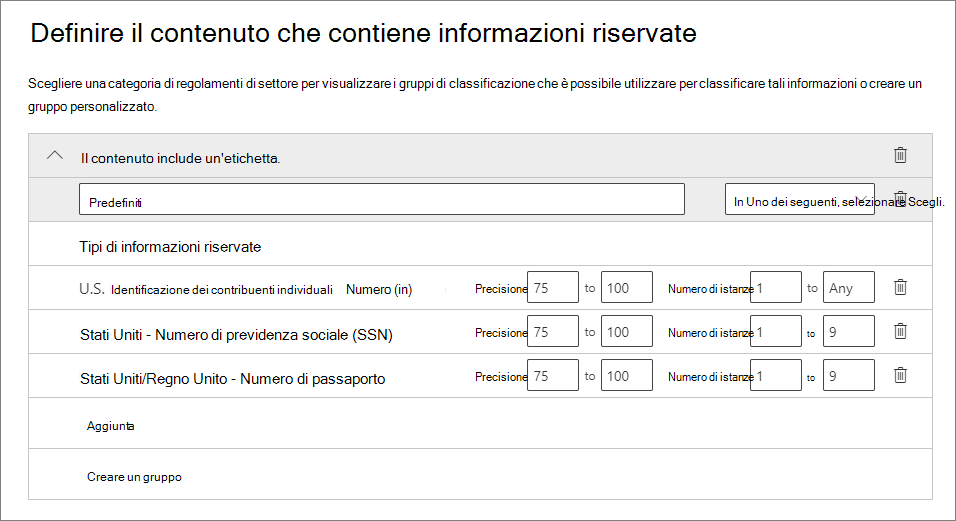

# <a name="create-publish-and-auto-apply-retention-labels"></a>Creare, pubblicare e applicare automaticamente etichette di conservazione

>*[Indicazioni per l'assegnazione di licenze di Microsoft 365 per sicurezza e conformità](https://aka.ms/ComplianceSD).*

Usare le informazioni seguenti per creare [etichette di conservazione](labels.md) e quindi applicarle automaticamente a documenti e messaggi di posta elettronica, oppure pubblicarle in modo che gli utenti possano applicarle manualmente.

Le etichette di conservazione aiutano a conservare tutto ciò che serve ed eliminare ciò che non serve. Vengono anche usate anche per dichiarare un elemento come record nell'ambito di una soluzione di [gestione dei record](records-management.md) per i dati di Microsoft 365.

La posizione in cui si creano e si configurano le etichette di conservazione varia a seconda che si usi o meno la gestione dei record. Sono disponibili istruzioni per entrambi gli scenari.

## <a name="before-you-begin"></a>Prima di iniziare

Ai membri del team di conformità che creeranno etichette di conservazione è necessario assegnare autorizzazioni per il Centro sicurezza &amp; conformità. Per impostazione predefinita, l'amministratore del tenant ha accesso a questa posizione e può fornire ai responsabili della conformità e ad altre persone l'accesso al Centro sicurezza &amp; conformità, senza concedere tutte le autorizzazioni di un amministratore del tenant. A questo scopo, è consigliabile accedere alla pagina **Autorizzazioni** del Centro sicurezza &amp; conformità, modificare il gruppo di ruoli **Amministratore conformità** e aggiungere membri a tale gruppo di ruoli. 
  
Per ulteriori informazioni, vedere [Concedere agli utenti l'accesso al Centro sicurezza e conformità di Office 365](../security/office-365-security/grant-access-to-the-security-and-compliance-center.md).
  
Queste autorizzazioni sono necessarie solo per creare e applicare etichette di conservazione e criteri di etichetta. L'applicazione dei criteri non richiede l'accesso al contenuto.

## <a name="create-and-configure-retention-labels"></a>Creare e configurare etichette di conservazione

1. Nel [Centro conformità Microsoft 365](https://compliance.microsoft.com/) passare a una delle posizioni seguenti:
    
    - Se si usa la gestione dei record:
        - **Soluzioni** > **Records management** > scheda **Piano di archiviazione** > **+ Crea un'etichetta** > **Etichetta di conservazione**
        
    - Se non si usa la gestione dei record:
       - **Soluzioni** > **Governance delle informazioni** > scheda **Etichette** > + **Crea un'etichetta**
    
    L'opzione non è immediatamente visibile? Selezionare per prima cosa **Mostra tutto**. 

2. Seguire le istruzioni della procedura guidata. Se si usa la gestione dei record:
    
    - Per informazioni sui descrittori del piano di archiviazione, vedere [Panoramica della gestione del piano di archiviazione](file-plan-manager.md)
    
    - Per usare l'etichetta di conservazione per dichiarare il contenuto come record, attivare la casella di controllo **Usa l'etichetta per classificare il contenuto come "Record"**.

3. Ripetere questi passaggi per creare altre etichette.

Per modificare un'etichetta esistente, selezionarla e quindi scegliere **Modifica etichetta**. Verrà avviata la stessa procedura guidata, che consente di modificare le descrizioni e le impostazioni delle etichette nel passaggio 2.

## <a name="publish-retention-labels-by-creating-a-retention-label-policy"></a>Pubblicare etichette di conservazione creando un criterio di etichetta di conservazione

Pubblicare le etichette di conservazione in modo che possano essere applicate manualmente dagli utenti.

1. Nel [Centro conformità Microsoft 365](https://compliance.microsoft.com/) passare a una delle posizioni seguenti:
    
    - Se si usa la gestione dei record:
        - **Soluzioni** > **Gestione dei record** scheda > **Criteri delle etichette** > **Pubblica etichette**
    
    - Se non si usa la gestione dei record:
        - **Soluzioni** > **Governance delle informazioni** > scheda **Criteri delle etichette** > **Pubblica etichette**
    
    L'opzione non è immediatamente visibile? Selezionare per prima cosa **Mostra tutto**. 

2. Seguire le istruzioni della procedura guidata.
    
    Per informazioni sulla configurazione delle posizioni, vedere la sezione [Etichette di conservazione e posizioni](#retention-labels-and-locations) in questa pagina. 

## <a name="auto-apply-a-retention-label"></a>Applicare automaticamente un'etichetta di conservazione

Applicare automaticamente un'etichetta di conservazione in base alle condizioni specificate.

1. Nel [Centro conformità Microsoft 365](https://compliance.microsoft.com/) passare a una delle posizioni seguenti:
    
    - Se si usa la gestione dei record: **Governance delle informazioni**:
        - **Soluzioni** > **Gestione dei record** > scheda **Criteri delle etichette** > **Applica automaticamente le etichette**
    
    - Se non si usa la gestione dei record:
        - **Soluzioni** > **Governance delle informazioni** > scheda **Criteri delle etichette** > **Applica automaticamente le etichette**
    
    L'opzione non è immediatamente visibile? Selezionare per prima cosa **Mostra tutto**. 

2. Seguire le istruzioni della procedura guidata.
    
    Per informazioni su come configurare le condizioni per l'applicazione automatica dell'etichetta di conservazione, vedere la sezione [Configurare le condizioni per l'applicazione automatica delle etichette di conservazione](#configuring-conditions-for-auto-apply-retention-labels) in questa pagina.
    
    Per informazioni sulla configurazione delle posizioni, vedere la prossima sezione in questa pagina, [Etichette di conservazione e posizioni](#retention-labels-and-locations).

## <a name="retention-labels-and-locations"></a>Etichette di conservazione e posizioni

È possibile pubblicare tipi di etichette di conservazione differenti in posizioni diverse, a seconda dell'azione eseguita dall'etichetta di conservazione.
  
|**Se l'etichetta di conservazione è...**|**Il criterio di etichetta può essere applicato a…**|
|:-----|:-----|
|Pubblicata agli utenti finali  <br/> |Exchange, SharePoint, OneDrive, gruppi di Office 365  <br/> |
|Applicata automaticamente in base ai tipi di informazioni riservate  <br/> |Exchange (solo a tutte le cassette postali), SharePoint, OneDrive  <br/> |
|Applicata automaticamente in base a una query  <br/> |Exchange, SharePoint, OneDrive, gruppi di Office 365  <br/> |
   
Le etichette di conservazione applicate automaticamente in Exchange (sia per le query che per i tipi di informazioni riservate) vengono applicate solo ai messaggi appena inviati (dati in transito), non a tutti gli elementi attualmente nella cassetta postale (dati archiviati). Inoltre, le etichette di conservazione applicate automaticamente per i tipi di informazioni riservate possono essere applicate solo a tutte le cassette postali, non a cassette postali specifiche.
  
Le cartelle pubbliche di Exchange e Skype non supportano le etichette di conservazione.


## <a name="configuring-conditions-for-auto-apply-retention-labels"></a>Configurare le condizioni per l'applicazione automatica delle etichette di conservazione

È possibile applicare automaticamente etichette di conservazione al contenuto quando questo contiene:
  
- [Tipi specifici di informazioni riservate.](#auto-apply-labels-to-content-with-specific-types-of-sensitive-information)
    
- [Parole chiave specifiche che corrispondono a una query creata.](#auto-apply-labels-to-content-with-keywords-or-searchable-properties)

- [Una corrispondenza per classificatori sottoponibili a training](#auto-apply-labels-to-content-by-using-trainable-classifiers)
    


Possono essere necessari fino a sette giorni per applicare le etichette di conservazione ad applicazione automatica a tutto il contenuto che soddisfa le condizioni configurate.

### <a name="auto-apply-labels-to-content-with-specific-types-of-sensitive-information"></a>Applicare automaticamente etichette al contenuto con tipi specifici di informazioni sensibili

Quando si creano etichette di conservazione ad applicazione automatica per le informazioni riservate, viene visualizzato lo stesso elenco di modelli di criteri mostrato quando si creano criteri di prevenzione della perdita dei dati (DLP). Ogni modello di criteri è preconfigurato in modo da cercare specifici tipi di informazioni riservate. Ad esempio, il modello illustrato di seguito cerca codici identificativi del singolo contribuente (ITIN), codici di previdenza sociale (SSN) e numeri di passaporto statunitensi. Per altre informazioni sui criteri DLP, vedere [Panoramica dei criteri di prevenzione della perdita dei dati](data-loss-prevention-policies.md).
  

  
Dopo aver selezionato un modello di criteri, è possibile aggiungere o rimuovere qualunque tipo di informazioni riservate e modificare il numero di istanze e l'accuratezza della corrispondenza. Nell'esempio mostrato di seguito, verrà applicata automaticamente un'etichetta di conservazione solo quando:
  
- Il contenuto include tra 1 e 9 istanze di qualsiasi di tipo di informazioni riservate. È possibile eliminare il valore **max** in modo che diventi **qualsiasi**.
    
- Il tipo di informazioni riservate rilevate ha un'accuratezza della corrispondenza (o livello di attendibilità) di almeno 75. Molti tipi di informazioni riservate sono definiti con più criteri. I criteri con un livello di accuratezza della corrispondenza superiore richiedono l'individuazione di ulteriori elementi di prova (ad esempio parole chiave, date o indirizzi), mentre i criteri con un livello di accuratezza della corrispondenza inferiore richiedono meno elementi di prova. In parole povere, più basso è il valore di accuratezza della corrispondenza **min**, più facile sarà che il contenuto soddisfi la condizione. 
    
Per altre informazioni su queste opzioni, vedere [Tuning rules to make them easier or harder to match](data-loss-prevention-policies.md#tuning-rules-to-make-them-easier-or-harder-to-match) (Ottimizzazione delle regole per rendere più facile o difficile la corrispondenza).
    

  
### <a name="auto-apply-labels-to-content-with-keywords-or-searchable-properties"></a>Applicare automaticamente etichette al contenuto con parole chiave o con proprietà disponibili per le ricerche

È possibile applicare automaticamente etichette al contenuto che soddisfa determinate condizioni. Le condizioni disponibili ora supportano l'applicazione di un'etichetta al contenuto che include parole, frasi, valori o proprietà disponibili per le ricerche specifiche. È possibile perfezionare la query usando operatori di ricerca come AND, OR e NOT.

Per altre informazioni sulla sintassi della query, vedere:

- [Riferimenti per la sintassi di Keyword Query Language (KQL)](https://docs.microsoft.com/sharepoint/dev/general-development/keyword-query-language-kql-syntax-reference)

Le etichette basate su query usano l’indice di ricerca per identificare il contenuto. Per altre informazioni sulle proprietà disponibili per la ricerca valide, vedere:

- [Query con parole chiave e condizioni di ricerca per la Ricerca contenuto](keyword-queries-and-search-conditions.md)
- [Panoramica delle proprietà gestite e sottoposte a ricerca per indicizzazione in SharePoint Server](https://docs.microsoft.com/SharePoint/technical-reference/crawled-and-managed-properties-overview)

Esempi di query:

- Exchange
    - subject:"Quarterly Financials"
    - recipients:garthf<!--nolink-->@contoso.com
- SharePoint e OneDrive
    - contenttype:contract
    - site:https<!--nolink-->://contoso.sharepoint.com/sites/teams/procurement AND contenttype:contract


### <a name="auto-apply-labels-to-content-by-using-trainable-classifiers"></a>Etichette applicate automaticamente al contenuto con classificatori sottoponibili a training

Se si sceglie l'opzione del classificatore sottoponibile a training, è possibile selezionare un classificatore predefinito oppure personalizzato. I classificatori predefiniti includono i **curriculum**, il **codice sorgente**, le **molestie mirate**, i **contenuti volgari** e le **minacce**:


Per applicare automaticamente un'etichetta utilizzando questa opzione, i siti e le cassette postali di SharePoint Online devono avere almeno 10 MB di dati.

Per altre informazioni sui classificatori sottoponibili a training, vedere [Introduzione ai classificatori sottoponibili a training (anteprima)](classifier-getting-started-with.md).

Per avere un esempio di configurazione, vedere [Come preparare e usare un classificatore integrato](classifier-using-a-ready-to-use-classifier.md#how-to-verify-that-a-built-in-classifier-will-meet-your-needs).

## <a name="how-long-it-takes-for-retention-labels-to-take-effect"></a>Tempo necessario per l'applicazione delle etichette di conservazione

Quando si pubblicano o si applicano automaticamente le etichette di conservazione, queste non hanno effetto immediato:
  
1. Per prima cosa i criteri di etichetta devono essere sincronizzati dall'interfaccia di amministrazione alle posizioni indicate nei criteri.
    
2. Quindi, la posizione potrebbe richiedere del tempo per rendere disponibili le etichette di conservazione pubblicate agli utenti finali o per applicare automaticamente etichette al contenuto. Il tempo necessario dipende dalla posizione e dal tipo di etichetta di conservazione.
    
### <a name="published-retention-labels"></a>Etichette di conservazione pubblicate

Se si pubblicano etichette di conservazione in SharePoint o OneDrive, può essere necessario un giorno perché le etichette di conservazione siano visibili agli utenti finali. Se si pubblicano etichette di conservazione in Exchange, possono essere necessari 7 giorni perché le etichette di conservazione siano visibili agli utenti finali, inoltre la cassetta postale deve contenere almeno 10 MB di dati.
  

  
### <a name="auto-apply-retention-labels"></a>Applicare automaticamente etichette di conservazione

In caso di applicazione automatica di etichette di conservazione ai contenuti che soddisfano condizioni specifiche, possono essere necessari 7 giorni prima che le etichette di conservazione vengano applicate a tutto il contenuto esistente che soddisfa le condizioni.
  

  
### <a name="how-to-check-on-the-status-of-retention-labels-published-to-exchange"></a>Come verificare lo stato delle etichette di conservazione pubblicate in Exchange

In Exchange Online le etichette di conservazione vengono rese disponibili agli utenti finali mediante un processo eseguito ogni sette giorni. Usando Powershell è possibile vedere quando è stato eseguito per l'ultima volta questo processo e quindi stabilire quando verrà eseguito nuovamente.
  
1. [Connettersi a Exchange Online PowerShell](https://go.microsoft.com/fwlink/?linkid=799773).
    
2. Eseguire questi comandi.
    
   ```powershell
   $logProps = Export-MailboxDiagnosticLogs <user> -ExtendedProperties
   ```

   ```powershell
   $xmlprops = [xml]($logProps.MailboxLog)
   ```

   ```powershell
   $xmlprops.Properties.MailboxTable.Property | ? {$_.Name -like "ELC*"}
   ```

Nei risultati, la proprietà `ELCLastSuccessTimeStamp` (UTC) mostra quando il sistema ha elaborato la casetta postale per l'ultima volta. Se questa operazione non è stata eseguita da quando è stato creato il criterio, le etichette non verranno visualizzate. Per forzare l'elaborazione, eseguire `Start-ManagedFolderAssistant -Identity <user>`.
    
Se le etichette non compaiono in Outlook sul web e si ritiene che invece debbano comparire, svuotare la cache del browser (CTRL+F5).
    

## <a name="updating-retention-labels-and-their-policies"></a>Aggiornare le etichette di conservazione e i criteri

Se si modifica un'etichetta di conservazione, un criterio di etichetta di conservazione o un criterio di applicazione automatica e l'etichetta di conservazione è già applicata al contenuto, le impostazioni aggiornate verranno applicate automaticamente a tale contenuto oltre che a quello a cui verranno applicate etichette per la prima volta.

## <a name="find-the-powershell-cmdlets-for-retention-labels"></a>Trovare i cmdlet di PowerShell per le etichette di conservazione

Per usare i cmdlet per le etichette di conservazione:
  
1. [Connettersi a PowerShell in Centro sicurezza e conformità di Office 365](https://docs.microsoft.com/powershell/exchange/office-365-scc/connect-to-scc-powershell/connect-to-scc-powershell)
    
2. Usare questi cmdlet del Centro sicurezza e conformità di Office 365:
    
    - [Get-ComplianceTag](https://docs.microsoft.com/powershell/module/exchange/policy-and-compliance-retention/get-compliancetag)
    
    - [New-ComplianceTag](https://docs.microsoft.com/powershell/module/exchange/policy-and-compliance-retention/new-compliancetag)
    
    - [Remove-ComplianceTag](https://docs.microsoft.com/powershell/module/exchange/policy-and-compliance-retention/remove-compliancetag)
    
    - [Set-ComplianceTag](https://docs.microsoft.com/powershell/module/exchange/policy-and-compliance-retention/set-compliancetag)
    
    - [Enable-ComplianceTagStorage](https://docs.microsoft.com/powershell/module/exchange/policy-and-compliance-retention/enable-compliancetagstorage)
    
    - [Get-ComplianceTagStorage](https://docs.microsoft.com/powershell/module/exchange/policy-and-compliance-retention/get-compliancetagstorage)
    
    - [Get-RetentionCompliancePolicy](https://docs.microsoft.com/powershell/module/exchange/policy-and-compliance-retention/get-retentioncompliancepolicy)
    
    - [New-RetentionCompliancePolicy](https://docs.microsoft.com/powershell/module/exchange/policy-and-compliance-retention/new-retentioncompliancepolicy)
    
    - [Remove-RetentionCompliancePolicy](https://docs.microsoft.com/powershell/module/exchange/policy-and-compliance-retention/remove-retentioncompliancepolicy)
    
    - [Set-RetentionCompliancePolicy](https://docs.microsoft.com/powershell/module/exchange/policy-and-compliance-retention/set-retentioncompliancepolicy)
    
    - [Get-RetentionComplianceRule](https://docs.microsoft.com/powershell/module/exchange/policy-and-compliance-retention/get-retentioncompliancerule)
    
    - [New-RetentionComplianceRule](https://docs.microsoft.com/powershell/module/exchange/policy-and-compliance-retention/new-retentioncompliancerule)
    
    - [Remove-RetentionComplianceRule](https://docs.microsoft.com/powershell/module/exchange/policy-and-compliance-retention/remove-retentioncompliancerule)
    
    - [Set-RetentionComplianceRule](https://docs.microsoft.com/powershell/module/exchange/policy-and-compliance-retention/set-retentioncompliancerule)
