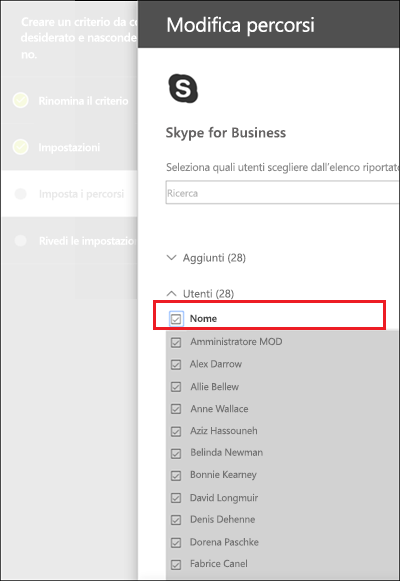
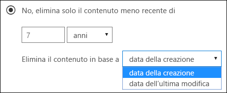
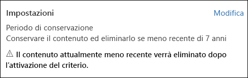
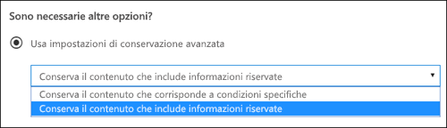
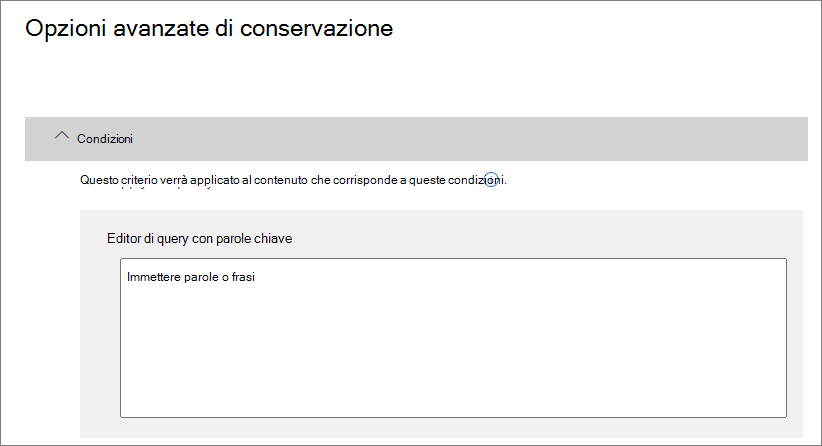
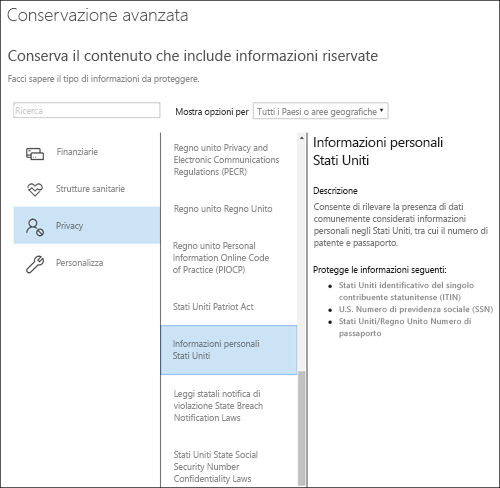

# Creare e configurare criteri di conservazioneCreate and configure retention policies

>*[Indicazioni per l'assegnazione di licenze di Microsoft 365 per sicurezza e conformità](https://aka.ms/ComplianceSD).**[Microsoft 365 licensing guidance for security & compliance](https://aka.ms/ComplianceSD).*

Usare un criterio di conservazione per decidere proattivamente se conservare il contenuto, eliminarlo o entrambe le cose, ovvero conservarlo ed eliminarlo successivamente.Use a retention policy to decide proactively whether to retain content, delete content, or both - retain and then delete the content. 

Per informazioni sul funzionamento dei criteri di conservazione, vedere [Informazioni sui criteri di conservazione](retention-policies.md).For information about how retention policies work, see [Learn about retention policies](retention-policies.md).

## Prima di iniziareBefore you begin

Ai membri del team di conformità che creeranno e gestiranno i criteri di conservazione è necessario assegnare autorizzazioni per il [Centro conformità Microsoft 365](https://compliance.microsoft.com/).Members of your compliance team who will create and manage retention policies need permissions to the [Microsoft 365 Compliance Center](https://compliance.microsoft.com/). Per impostazione predefinita, l'amministratore del tenant ha accesso a questa posizione e può fornire l'accesso ai responsabili della conformità e ad altre persone senza concedere tutte le autorizzazioni di un amministratore del tenant. A questo scopo, è consigliabile accedere alla pagina **Autorizzazioni** del [Centro conformità Microsoft 365](https://compliance.microsoft.com/), modificare il ruolo **Amministratore conformità** e aggiungere membri a tale gruppo di ruoli.By default, your tenant admin has access to this location and can give compliance officers and other people access without giving them all the permissions of a tenant admin. To do this, we recommend that you go to the **Permissions** page of the [Microsoft 365 Compliance Center](https://compliance.microsoft.com/), edit the **Compliance administrator** admin role, and add members to that role group. 

Queste autorizzazioni sono necessarie solo per creare e applicare criteri di conservazione.These permissions are required only to create and apply a retention policy. La persona che configura i criteri di conservazione non ha bisogno di accedere al contenuto.The person configuring the retention policy doesn't require access to the content.

## Creare e configurare un criterio di conservazioneCreate and configure a retention policy

1. Nel [Centro conformità Microsoft 365](https://compliance.microsoft.com/) selezionare **Criteri** > **Conservazione**.From the [Microsoft 365 compliance center](https://compliance.microsoft.com/), select **Policies** > **Retention**.

2. Selezionare **Nuovo criterio di conservazione** o modificare un criterio esistente.Select **New retention policy** or edit an exiting retention policy.

3. Per **Impostazioni** specificare prima di tutto le opzioni di configurazione per la conservazione e l'eliminazione del contenuto.For **Settings**, first specify the configuration options for retaining and deleting content. È possibile creare un criterio che si limita a conservare il contenuto senza eliminarlo, lo conserva e quindi lo elimina dopo un periodo di tempo specificato oppure semplicemente elimina il contenuto dopo un periodo di tempo specificato.You can create a retention policy that just retains content without deleting, retains and then deletes after a specified period of time, or just deletes content after a specified period of time. Per altre informazioni, vedere [Impostazioni per la conservazione e l'eliminazione del contenuto](#settings-for-retaining-and-deleting-content) in questa pagina:For more information, see [Settings for retaining and deleting content](#settings-for-retaining-and-deleting-content) on this page:
    
    Quindi, decidere se il criterio di conservazione va applicato a tutto il contenuto o al contenuto che soddisfa determinate condizioni.Then, decide whether the retention policy should apply to all content, or content that meets specific conditions. Per altre informazioni su queste impostazioni avanzate di conservazione, vedere [Impostazioni avanzate per identificare il contenuto che soddisfa condizioni specifiche](#advanced-settings-to-identify-content-that-meets-specific-conditions) in questa pagina.For more information about these advanced retention settings, see [Advanced settings to identify content that meets specific conditions](#advanced-settings-to-identify-content-that-meets-specific-conditions) on this page. 

4. Per la pagina **Seleziona posizioni**, selezionare se il criterio di conservazione va applicato a tutte le posizioni supportate nell'organizzazione o se si vogliono specificare.For the **Choose locations** page, select whether the retention policy should apply to all supported locations across your organization, or you want to specify the locations. Se si scelgono posizioni specifiche, è anche possibile specificare cosa includere o escludere.If you choose specific locations, you can also specify includes and excludes. 
    
    Per Microsoft Teams:For Microsoft Teams: 
    - È necessario selezionare l'opzione per scegliere posizioni specifiche se si vogliono eliminare o conservare i messaggi dei canali di Teams o le chat di Teams.You must select the option to choose specific locations if you want to delete or retain Teams channel messages or Team chats. Selezionando una di queste opzioni, le altre posizioni vengono escluse automaticamente perché un criterio di conservazione che include questi dati di Teams non può includere altre posizioni.When you select either of these options as locations, the other locations are automatically excluded because a retention policy that includes this Teams data can't include other locations. 
    - Si noti che per **Messaggi del canale di Teams** sono inclusi i messaggi provenienti da canali standard ma non dai [canali privati](https://docs.microsoft.com/microsoftteams/private-channels).Note that for **Teams channel messages**, message from standard channels but not [private channels](https://docs.microsoft.com/microsoftteams/private-channels) are included. I messaggi dei canali privati vengono inclusi per gli utenti come chat di gruppo selezionando la posizione **Chat di Teams**.Messages from private channels are included for users as group chats when you select the **Teams chats** location.
    
    Per altre informazioni sulla scelta tra criteri di conservazione per l'organizzazione o per posizioni specifiche, vedere [Applicazione di criteri di conservazione a un'intera organizzazione o a posizioni specifiche](#applying-a-retention-policy-to-an-entire-organization-or-specific-locations) in questa pagina.For more information about choosing between a retention policy for the organization or for specific locations, see [Applying a retention policy to an entire organization or specific locations](#applying-a-retention-policy-to-an-entire-organization-or-specific-locations) on this page.
    
    Per informazioni specifiche su **gruppi di Office 365** e **Skype for Business**, vedere le successive sezioni [Informazioni di configurazione per i gruppi di Microsoft 365](#configuration-information-for-microsoft-365-groups) e [Informazioni di configurazione per Skype for Business](#configuration-information-for-skype-for-business).For information specific to **Office 365 groups** and **Skype for Business**, see the following sections, [Configuration information for Microsoft 365 groups](#configuration-information-for-microsoft-365-groups) and [Configuration information for Skype for Business](#configuration-information-for-skype-for-business).

5. Completare la procedura guidata per salvare le impostazioni.Complete the wizard to save your settings.

Se sono presenti più criteri di conservazione, vedere [Principi di conservazione: cosa ha la precedenza?](retention-policies.md#the-principles-of-retention-or-what-takes-precedence)When you have more than one retention policy, see [The principles of retention, or what takes precedence?](retention-policies.md#the-principles-of-retention-or-what-takes-precedence)

### Informazioni di configurazione per i gruppi di Microsoft 365Configuration information for Microsoft 365 groups

Per conservare o eliminare il contenuto di un gruppo di Microsoft 365 (in precedenza gruppo di Office 365), selezionare **Gruppi di Office 365** quando si scelgono le posizioni per il criterio di conservazione.To retain or delete content for a Microsoft 365 group (formerly Office 365 group), select the **Office 365 groups** location when you choose locations for your retention policy. Anche se un gruppo di Microsoft 365 ha una cassetta postale di Exchange, un criterio di conservazione che include l'intero percorso **Posta elettronica di Exchange** non includerà il contenuto nelle cassette postali del gruppo di Microsoft 365.Even though a Microsoft 365 group has an Exchange mailbox, a retention policy that includes the entire **Exchange email** location won't include content in Microsoft 365 group mailboxes. Inoltre, anche se il percorso **Posta elettronica di Exchange** consente inizialmente di selezionare una cassetta postale del gruppo da includere o escludere, provando a salvare il criterio di conservazione si riceverà un messaggio di errore che segnala che "RemoteGroupMailbox" non è una selezione valida per il percorso di Exchange.In addition, although the **Exchange email** location initially allows you to specify a group mailbox to be included or excluded, when you try to save the retention policy, you receive an error that "RemoteGroupMailbox" is not a valid selection for the Exchange location.

I criteri di conservazione applicati a un gruppo di Microsoft 365 includono sia la cassetta postale del gruppo che il sito.A retention policy applied to an Microsoft 365 group includes both the group mailbox and site. Un criterio di conservazione applicato a un gruppo di Microsoft 365 protegge le risorse create da un gruppo di Microsoft 365, che include Microsoft Teams.A retention policy applied to a Microsoft 365 group protects the resources created by a Microsoft 365 group, which includes Microsoft Teams.

### Informazioni di configurazione per Skype for BusinessConfiguration information for Skype for Business

A differenza della posta elettronica di Exchange, non è possibile attivare lo stato della posizione Skype per includere tutti gli utenti ma quando si attiva la posizione, sarà possibile scegliere manualmente gli utenti di cui si desidera conservare le conversazioni:Unlike Exchange email, you can't toggle the status of the Skype location on to include all users, but when you turn on that location, you then manually choose the users whose conversations you want to retain:

  
Quando si seleziona \*\*Scegli utenti \*\*, è possibile includere rapidamente tutti gli utenti selezionando la casella \*\*Nome \*\* nell'intestazione di colonna.When you select **Choose users**, you can quickly include all users by selecting the **Name** box in the column header. È necessario considerare, però, che ciascun utente viene conteggiato come specifica inclusione nei criteri.However, it's important to understand that each user counts as a specific inclusion in the policy. Di conseguenza, se si includono più di 1.000 utenti, si applicano i limiti indicati nella sezione precedente.Therefore, if you include over 1,000 users, the limits noted in the previous section apply. La selezione di tutti gli utenti di Skype da questa posizione non coincide con la procedura che prevede l'inclusione predefinita di tutti gli utenti di Skype con i criteri a livello di organizzazione.Selecting all Skype users here is not the same as if an org-wide policy were able to include all Skype users by default. 
  

  
Si noti che**Cronologia conversazioni**, una cartella di Outlook, è una funzionalità che non ha nulla a che fare con l'archiviazione di Skype. **Cronologia conversazioni** può essere disattivata dall'utente finale, mentre l'archiviazione per Skype avviene memorizzando una copia delle conversazioni di Skype in una cartella nascosta che è inaccessibile all'utente, ma disponibile per eDiscovery.Note that **Conversation History**, a folder in Outlook, is a feature that has nothing to do with Skype archiving. **Conversation History** can be turned off by the end user, but archiving for Skype is done by storing a copy of Skype conversations in a hidden folder that is inaccessible to the user but available to eDiscovery.

## Impostazioni per la conservazione e l'eliminazione del contenutoSettings for retaining and deleting content

Scegliendo le impostazioni per la conservazione e l'eliminazione del contenuto, il criterio di conservazione avrà una delle configurazioni seguenti per un periodo di tempo specificato:By choosing the settings for retaining and deleting content in your retention policy, your retention policy will have one of the following configurations for a specified period of time:

- Conserva soloRetain-only
- Conserva ed eliminaRetain and then delete
- Elimina soloDelete-only

### Conservazione del contenuto per un periodo di tempo specificoRetaining content for a specific period of time

Quando si configura un criterio di conservazione, si sceglie di conservare il contenuto per un periodo di tempo indefinito o per un numero specifico di giorni, mesi o anni.When you configure a retention policy, you choose to retain content indefinitely or for a specific number of days, months, or years. Il calcolo relativo al periodo di conservazione del contenuto è basato sulla data di modifica del contenuto e non sulla data di applicazione dei criteri di conservazione.The duration for how long content is retained is calculated from the age of the content, not from when the retention policy is applied. È possibile scegliere se calcolare questo periodo a partire dalla creazione del contenuto o, per OneDrive e SharePoint, dalla data dell'ultima modifica.You can choose whether the age is based on when the content was created or (for OneDrive and SharePoint) when it was last modified.

Esempi:Examples:
  
- SharePoint: se si vuole conservare il contenuto di una raccolta siti per sette anni dopo l'ultima modifica e un documento presente nella raccolta siti non è stato modificato per sei anni, il documento verrà conservato solo per un altro anno se non viene modificato.SharePoint: If you want to retain content in a site collection for seven years since it was last modified, and a document in that site collection hasn't been modified in six years, the document will be retained for only another year if it's not modified. Se il documento viene nuovamente modificato, la durata viene ricalcolata in base alla nuova data di modifica e il documento verrà conservato per altri sette anni.If the document is edited again, the age of the document is calculated from the new last modified date, and it will be retained for another seven years.
  
- Exchange: se si vuole conservare il contenuto di una cassetta postale per sette anni e un messaggio è stato inviato sei anni fa, il messaggio verrà conservato solo per un altro anno.Exchange: If you want to retain content in a mailbox for seven years, and a message was sent six years ago, the message will be retained for only one year. Per il contenuto di Exchange, l'età dipende dalla data di ricezione per la posta in arrivo o dalla data di invio per la posta in uscita.For Exchange content, the age is based on the date received for incoming email, or the date sent for outgoing email. La conservazione del contenuto in base all'ultima modifica si applica solo al contenuto del sito di OneDrive e SharePoint.Retaining content based on when it was last modified applies only to site content in OneDrive and SharePoint.
  
Al termine del periodo di conservazione, si sceglie se si vuole eliminare definitivamente il contenuto:At the end of the retention period, you choose whether you want the content to be permanently deleted:
  

  
### Eliminazione di contenuto antecedente a una data specificaDeleting content that's older than a specific age

I criteri di conservazione possono conservare e quindi eliminare il contenuto successivamente o eliminare il contenuto obsoleto senza conservarlo.A retention policy can both retain and then delete content, or delete old content without retaining it.
  
Se i criteri di conservazione eliminano il contenuto, è importante tenere presente che il periodo di tempo specificato per i criteri di conservazione viene calcolato dal momento in cui il contenuto è stato creato o modificato, non dal momento dell'assegnazione dei criteri.If your retention policy deletes content, it's important to understand that the time period specified for a retention policy is calculated from the time when the content was created or modified, not the time since the policy was assigned.
  

  
Ad esempio, si supponga di creare criteri di conservazione che eliminano il contenuto dopo tre anni e quindi di assegnarli a tutti gli account di OneDrive, che includono grandi quantità di contenuti creati quattro o cinque anni fa.For example, suppose that you create a retention policy that deletes content after three years, and then assign that policy to all OneDrive accounts, which contain a lot of content that was created four or five years ago. In questo caso, molti contenuti verranno eliminati subito dopo la prima assegnazione dei criteri di conservazione.In this case, a lot of content will be deleted soon after assigning the retention policy for the first time. Per questo motivo, è importante comprendere che i criteri di conservazione che eliminano il contenuto possono avere un impatto notevole.For this reason, it's important to understand that a retention policy that deletes content can have a considerable impact on your content. 
  
Prima di assegnare criteri di conservazione a una raccolta siti per la prima volta, è quindi consigliabile considerare il tempo trascorso dalla creazione del contenuto esistente e l'impatto dei criteri sul contenuto. È anche opportuno comunicare l'introduzione dei nuovi criteri agli utenti prima di assegnarli, in modo che possano valutarne l'impatto. Questo avviso viene visualizzato quando si esaminano le impostazioni per i criteri di conservazione prima di crearli.Therefore, before you assign a retention policy to a site collection for the first time, you should first consider the age of the existing content and how the policy may impact that content. You may also want to communicate the new policy to your users before assigning it, to give them time to assess the possible impact. Note this warning that appears when you review the settings for your retention policy just before creating it.
  

  
## Impostazioni avanzate per identificare il contenuto che soddisfa condizioni specificheAdvanced settings to identify content that meets specific conditions

I criteri di conservazione possono essere applicati a tutto il contenuto nelle posizioni incluse oppure solo al contenuto che contiene parole chiave specifiche o [tipi specifici di informazioni riservate](what-the-sensitive-information-types-look-for.md).A retention policy can apply to all content in the locations that it includes, or you can choose to apply a retention policy only to content that contains specific keywords or [specific types of sensitive information](what-the-sensitive-information-types-look-for.md).
  

  
### Identificare il contenuto che include parole chiave specificheIdentify content that contains specific keywords

È possibile applicare i criteri di conservazione solo al contenuto che soddisfa specifiche condizioni e quindi eseguire azioni di conservazione solo su tale contenuto.You can apply a retention policy only to content that meets specific conditions, and then take retention actions on just that content. Le condizioni disponibili supportano l'applicazione di criteri di conservazione al contenuto che include parole o frasi specifiche.The conditions available support applying a retention policy to content that contains specific words or phrases. È possibile perfezionare la query usando operatori di ricerca come AND, OR e NOT.You can refine your query by using search operators like AND, OR, and NOT. Per altre informazioni sugli operatori, vedere [Query con parola chiave e condizioni di ricerca per la ricerca di contenuto](keyword-queries-and-search-conditions.md).For more information on these operators, see [Keyword queries and search conditions for Content Search](keyword-queries-and-search-conditions.md).
  
Il supporto delle proprietà disponibili per le ricerche (ad esempio, **subject:**) sarà disponibile a breve.Support for adding searchable properties (for example, **subject:**) is coming soon.
  
I criteri di conservazione basati su query usano l'indice di ricerca per identificare il contenuto.Query-based retention uses the search index to identify content.
  

  
### Identificare il contenuto che include informazioni riservateIdentify content that contains sensitive information

È possibile applicare i criteri di conservazione anche solo al contenuto che contiene [tipi specifici di informazioni riservate](what-the-sensitive-information-types-look-for.md). Ad esempio, è possibile scegliere di applicare requisiti di conservazione univoci solo al contenuto che contiene informazioni personali come codici identificativi dei singoli contribuenti, codici di previdenza sociale o numeri di passaporto.You can also apply a retention policy only to content that contains [specific types of sensitive information](what-the-sensitive-information-types-look-for.md). For example, you can choose to apply unique retention requirements only to content that contains personally identifiable information (PII) such as taxpayer identification numbers, social security numbers, or passport numbers.
  

  
Note:Notes:
  
- I criteri di conservazione avanzati per le informazioni riservate non si applicano alle cartelle pubbliche di Exchange o a Skype for Business perché queste posizioni non supportano i tipi di informazioni riservate.Advanced retention for sensitive information doesn't apply to Exchange public folders or Skype for Business because those locations don't support sensitive information types.
    
- Exchange Online usa regole del flusso di posta, note anche come regole di trasporto, per identificare le informazioni riservate, quindi funziona solo per i messaggi in transito, non per tutti gli elementi già archiviati in una cassetta postale.Exchange Online uses mail flow rules (also known as transport rules) to identify sensitive information, so this works only on messages in transit — not on all items already stored in a mailbox. Per Exchange Online, questo significa che i criteri di conservazione possono identificare le informazioni riservate e possono eseguire azioni di conservazione solo nei messaggi ricevuti **dopo** l'applicazione dei criteri alla cassetta postale.For Exchange Online, this means that a retention policy can identify sensitive information and take retention actions only on messages that are received **after** the policy is applied to the mailbox. I criteri di conservazione basati su query descritti nella sezione precedente non hanno questa limitazione perché usano l'indice di ricerca per identificare il contenuto.Query-based retention described in the previous section doesn't have this limitation because it uses the search index to identify content. 
    
## Applicazione di criteri di conservazione a un'intera organizzazione o a posizioni specificheApplying a retention policy to an entire organization or specific locations

È possibile applicare facilmente i criteri di conservazione a un'intera organizzazione, a intere posizioni oppure a posizioni o utenti specifici.You can easily apply a retention policy to an entire organization, entire locations, or only to specific locations or users.
  
### Criteri a livello di organizzazioneOrg-wide policy

Una delle caratteristiche più efficaci dei criteri di conservazione riguarda la possibilità di applicare i criteri alle posizioni in Microsoft 365, tra cui:One of the most powerful features of a retention policy is that it can apply to locations across Microsoft 365, including:
  
- Posta elettronica di ExchangeExchange email
    
- Raccolte siti di SharePointSharePoint site collections
    
- Account di OneDriveOneDrive accounts
    
- Gruppi di Microsoft 365 (si applica al contenuto della cassetta postale del gruppo e del sito di SharePoint associato).Microsoft 365 groups (applies to content in the group's mailbox and associated SharePoint site.)
    
- Cartelle pubbliche di ExchangeExchange public folders
    

Altre caratteristiche importanti di un criterio di conservazione a livello di organizzazione includono:Other important features of an org-wide retention policy include:
  
- Non sono previsti limiti al numero di cassette postali o di siti inclusi nel criterio.There is no limit to the number of mailboxes or sites the policy can include.
    
- Per Exchange, le nuove cassette postali create dopo l'applicazione del criterio ereditano automaticamente il criterio.For Exchange, any new mailbox created after the policy is applied will automatically inherit the policy.
  
### Criteri validi per intere posizioniA policy that applies to entire locations

Quando si scelgono le posizioni, è possibile includere o escludere facilmente un'intera posizione, ad esempio la posta elettronica di Exchange o gli account di OneDrive.When you choose locations, you can easily include or exclude an entire location, such as Exchange email or OneDrive accounts. A questo scopo, attivare o disattivare lo **Stato** di tale posizione.To do so, toggle the **Status** of that location on or off. 
  
Come per i criteri a livello di organizzazione, un criterio applicabile a una qualsiasi combinazione di posizioni complete può includere un numero illimitato di cassette postali o siti.Like an org-wide policy, if a policy applies to any combination of entire locations, there is no limit to the number of mailboxes or sites the policy can include. 

Ad esempio, se un criterio include tutta la posta elettronica di Exchange e tutti i siti di SharePoint, verranno inclusi tutti i siti e tutte le cassette postali, indipendentemente dal numero.For example, if a policy includes all Exchange email and all SharePoint sites, all sites and mailboxes will be included, no matter how many. Per Exchange, le nuove cassette postali create dopo l'applicazione del criterio ereditano automaticamente il criterio.And for Exchange, any new mailbox created after the policy is applied will automatically inherit the policy.

### Criteri con specifiche inclusioni o esclusioniA policy with specific inclusions or exclusions

È anche possibile applicare un criterio di conservazione a specifici utenti, gruppi di Microsoft 365 o siti.You can also apply a retention policy to specific users, specific Microsoft 365 groups, or specific sites. A questo scopo, attivare lo **Stato** di tale posizione e quindi usare i collegamenti per includere o escludere determinati utenti, gruppi di Microsoft 365 o siti.To do so, toggle the **Status** of that location on, and then use the links to include or exclude specific users, Microsoft 365 groups, or sites. 
  
Questa configurazione, tuttavia, prevede dei limiti se i criteri di conservazione includono o escludono più di 1.000 posizioni specifiche:However, using this configuration, there are some limits when your retention policy includes or excludes over 1,000 specific locations:
  
- Valori massimi per i criteri di conservazione:Maximum numbers for the retention policy:
    - 1.000 cassette postali1,000 mailboxes
    - 1.000 gruppi di Microsoft 3651,000 Microsoft 365 groups
    - 1.000 utenti per le chat private di Teams1,000 users for Teams private chats
    - 100 siti (OneDrive o SharePoint)100 sites (OneDrive or SharePoint)

Il un numero massimo di criteri supportati per un tenant è di 10.000.There is a maximum number of policies that are supported for a tenant: 10,000. Questi elementi includono criteri di conservazione, criteri per le etichette di conservazione e criteri di conservazione applicati automaticamente.These items include retention policies, retention label policies, and auto-apply retention policies.

Se è probabile che i propri criteri di conservazione siano soggetti a queste limitazioni, scegliere le opzioni di configurazione che prevedono l'applicazione a intere posizioni oppure usare un criterio a livello di organizzazione.If your retention policies are likely to be subject to these limitations, choose the configuration options that apply to entire locations, or use an org-wide policy.

## Aggiornamento dei criteri di conservazioneUpdating retention policies

Se si modifica un criterio di conservazione ed esiste già contenuto soggetto alle impostazioni originali del criterio, le impostazioni aggiornate verranno applicate automaticamente al tale contenuto oltre che ai nuovi contenuti identificati.If you edit a retention policy and content is already subject to the original settings in your retention policy, your updated settings will be automatically applied to this content in addition to content that's newly identified.

In genere l'aggiornamento è piuttosto rapido, ma può richiedere alcuni giorni.Usually this update is fairly quick but can take several days. Una volta completata la replica del criterio nelle diverse posizioni di Microsoft 365, il suo stato nel Centro conformità Microsoft 365 passerà da **Attivato (in sospeso)** ad **Attivato (operazione riuscita)**.When the policy replication across your Microsoft 365 locations is complete, you'll see the status of the retention policy in the Microsoft 365 compliance center change from **On (Pending)** to **On (Success)**.

## Trovare i cmdlet di PowerShell per i criteri di conservazioneFind the PowerShell cmdlets for retention policies

Per usare i cmdlet dei criteri di conservazione:To use the retention policies cmdlets:
  
1. [Connettersi a PowerShell in Centro sicurezza e conformità di Office 365Connect to the Office 365 Security & Compliance Center Powershell](https://docs.microsoft.com/powershell/exchange/office-365-scc/connect-to-scc-powershell/connect-to-scc-powershell)
    
2. Usare questi cmdlet del Centro sicurezza e conformità di Office 365:Use these Office 365 Security & Compliance Center cmdlets:
    
    - [Get-RetentionCompliancePolicyGet-RetentionCompliancePolicy](https://docs.microsoft.com/powershell/module/exchange/policy-and-compliance-retention/get-retentioncompliancepolicy)
    
    - [New-RetentionCompliancePolicyNew-RetentionCompliancePolicy](https://docs.microsoft.com/powershell/module/exchange/policy-and-compliance-retention/new-retentioncompliancepolicy)
    
    - [Remove-RetentionCompliancePolicyRemove-RetentionCompliancePolicy](https://docs.microsoft.com/powershell/module/exchange/policy-and-compliance-retention/remove-retentioncompliancepolicy)
    
    - [Set-RetentionCompliancePolicySet-RetentionCompliancePolicy](https://docs.microsoft.com/powershell/module/exchange/policy-and-compliance-retention/set-retentioncompliancepolicy)
    
    - [Get-RetentionComplianceRuleGet-RetentionComplianceRule](https://docs.microsoft.com/powershell/module/exchange/policy-and-compliance-retention/get-retentioncompliancerule)
    
    - [New-RetentionComplianceRuleNew-RetentionComplianceRule](https://docs.microsoft.com/powershell/module/exchange/policy-and-compliance-retention/new-retentioncompliancerule)
    
    - [Remove-RetentionComplianceRuleRemove-RetentionComplianceRule](https://docs.microsoft.com/powershell/module/exchange/policy-and-compliance-retention/remove-retentioncompliancerule)
    
    - [Set-RetentionComplianceRuleSet-RetentionComplianceRule](https://docs.microsoft.com/powershell/module/exchange/policy-and-compliance-retention/set-retentioncompliancerule)

## Bloccare i criteri di conservazione con PowerShellLock a retention policy by using PowerShell

Se è necessario usare la [protezione dell'archiviazione](retention-policies.md#use-preservation-lock-to-comply-with-regulatory-requirements) per soddisfare i requisiti normativi, occorre usare PowerShell.You must use PowerShell if you need to need to use [Preservation Lock](retention-policies.md#use-preservation-lock-to-comply-with-regulatory-requirements) to comply with regulatory requirements.

1. [Connettersi a PowerShell per Centro sicurezza e conformità di Office 365](https://docs.microsoft.com/powershell/exchange/office-365-scc/connect-to-scc-powershell/connect-to-scc-powershell?view=exchange-ps).[Connect to Office 365 Security & Compliance Center PowerShell](https://docs.microsoft.com/powershell/exchange/office-365-scc/connect-to-scc-powershell/connect-to-scc-powershell?view=exchange-ps).

2. Visualizzare un elenco dei criteri di conservazione e trovare il nome del criterio da bloccare eseguendo `Get-RetentionCompliancePolicy`.List your retention policies and find the name of the policy that you want to lock by running `Get-RetentionCompliancePolicy`.
    
    
    
3. Per applicare la protezione dell'archiviazione su un criterio di conservazione, eseguire `Set-RetentionCompliancePolicy` con il parametro `RestrictiveRetention` impostato su true.To place a Preservation Lock on a retention policy, run `Set-RetentionCompliancePolicy` with the `RestrictiveRetention` parameter set to true. Ad esempio:For example:
    
        Set-RetentionCompliancePolicy -Identity "<Name of Policy>" – RestrictiveRetention $true
    
    
    
    Dopo aver eseguito il cmdlet, scegliere **Sì a tutti**:After you run that cmdlet, choose **Yes to All**:
    
    

La protezione dell'archiviazione è ora inserita nei criteri di conservazione.A Preservation Lock is now placed on the retention policy. Se si esegue `Get-RetentionCompliancePolicy`, il parametro `RestrictiveRetention` viene impostato su true.If you run `Get-RetentionCompliancePolicy`, the `RestrictiveRetention` parameter is set to true. Ad esempio:For example:

`Get-RetentionCompliancePolicy -Identity "<Name of Policy>" |Fl`

  

