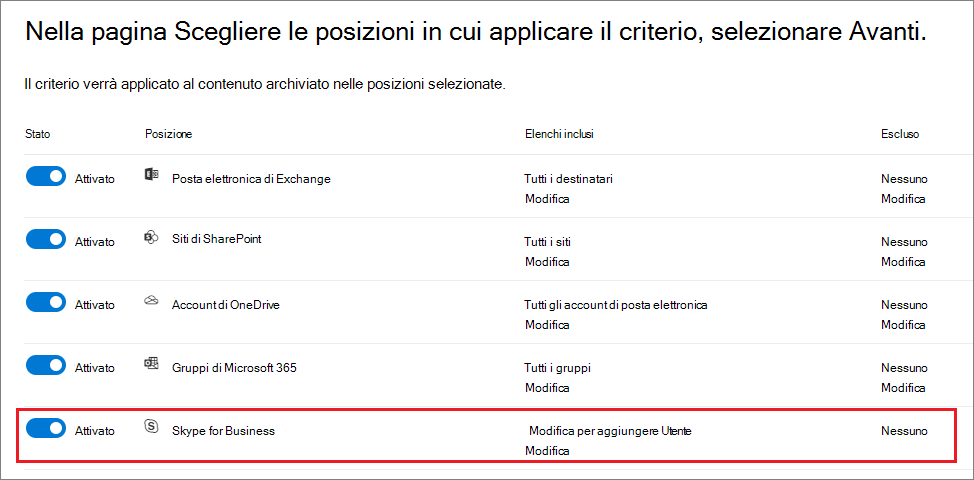
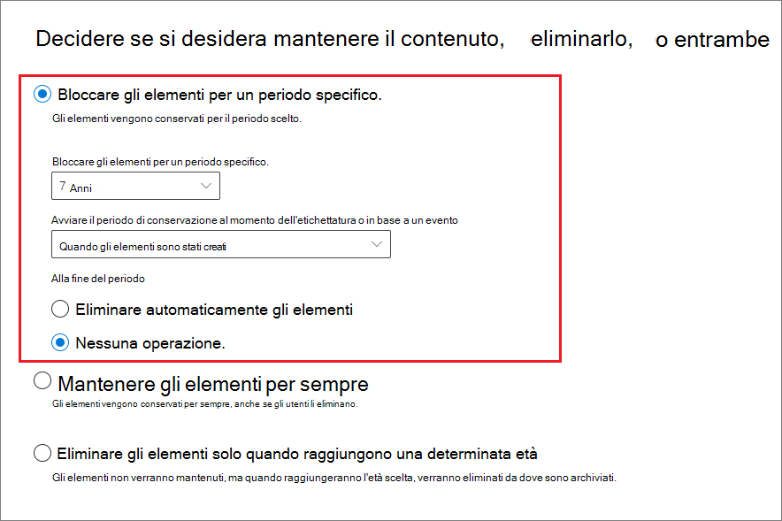

# Creare e configurare criteri di conservazioneCreate and configure retention policies

>*[Indicazioni per l'assegnazione di licenze di Microsoft 365 per sicurezza e conformità](https://aka.ms/ComplianceSD).**[Microsoft 365 licensing guidance for security & compliance](https://aka.ms/ComplianceSD).*

Usare un criterio di conservazione per decidere proattivamente se conservare il contenuto, eliminarlo o entrambe le cose, ovvero conservarlo ed eliminarlo successivamente.Use a retention policy to decide proactively whether to retain content, delete content, or both - retain and then delete the content.

I criteri di conservazione permettono di farlo in modo molto efficiente, assegnando le stesse impostazioni di conservazione per il contenuto in base alla posizione, a livello di sito o di cassetta postale.A retention policy lets you do this very efficiently by assigning the same retention settings for content by location, at a site or mailbox level. Se non si sa se occorre usare un criterio di conservazione o un'etichetta di conservazione, vedere [Criteri di conservazione ed etichette di conservazione](retention.md#retention-policies-and-retention-labels).If you're not sure whether to use a retention policy or a retention label, see [Retention policies and retention labels](retention.md#retention-policies-and-retention-labels).

Per saperne di più sul funzionamento della conservazione e sui criteri di conservazione, vedere [Informazioni sui criteri e le etichette di conservazione](retention.md).For more information about retention policies and how retention works, see [Learn about retention policies and retention labels](retention.md).

## Prima di iniziareBefore you begin

L'amministratore globale dell'organizzazione dispone delle autorizzazioni complete per creare e modificare le etichette conservazione.The global admin for your organization has full permissions to create and edit retention policies. Se non si esegue l'accesso come amministratore globale, vedere le [autorizzazioni necessarie per creare e gestire criteri di conservazione ed etichette di conservazione](get-started-with-retention.md#permissions-required-to-create-and-manage-retention-policies-and-retention-labels).If you aren't signing in as a global admin, see [Permissions required to create and manage retention policies and retention labels](get-started-with-retention.md#permissions-required-to-create-and-manage-retention-policies-and-retention-labels).

## Creare e configurare un criterio di conservazioneCreate and configure a retention policy

Anche se un criterio di conservazione può supportare più posizioni, non è possibile creare un singolo criterio di conservazione che includa tutte le posizioni supportate:Although a retention policy can support multiple locations, you can't create a single retention policy that includes all the supported locations:

- Posta elettronica di ExchangeExchange email
- Sito di SharePointSharePoint site
- Account di OneDriveOneDrive accounts
- Gruppi di Microsoft 365Microsoft 365 groups
- Skype for BusinessSkype for Business
- Cartelle pubbliche di ExchangeExchange public folders
- Messaggi del canale di TeamsTeams channel messages
- Chat di TeamsTeams chats
- Messaggi della community di YammerYammer community messages
- Messaggi privati di YammerYammer private messages

Se si selezionano le posizioni di Teams o Yammer quando si crea un criterio di conservazione, le altre posizioni vengono automaticamente escluse.If you select the Teams or Yammer locations when you create a retention policy, the other locations are automatically excluded. Di conseguenza, le istruzioni da seguire variano in base alla necessità o meno di includere le posizioni di Teams o Yammer:Therefore, which instructions to follow depends on whether you need to include the Teams or Yammer locations:

- [Istruzioni per un criterio di conservazione per posizioni di TeamsInstructions for a retention policy for Teams locations](#retention-policy-for-teams-locations)
- [Istruzioni per un criterio di conservazione per posizioni di YammerInstructions for a retention policy for Yammer locations](#retention-policy-for-yammer-locations)
- [Istruzioni per un criterio di conservazione per posizioni diverse da Teams e YammerInstructions for a retention policy for locations other than Teams and Yammer](#retention-policy-for-locations-other-than-teams-and-yammer)

Se sono presenti più criteri di conservazione e quando si usano anche etichette di conservazione, vedere [Precedenza nei principi di conservazione](retention.md#the-principles-of-retention-or-what-takes-precedence) per comprendere cosa accade quando più impostazioni di conservazione si applicano allo stesso contenuto.When you have more than one retention policy, and when you also use retention labels, see [The principles of retention, or what takes precedence?](retention.md#the-principles-of-retention-or-what-takes-precedence) to understand the outcome when multiple retention settings apply to the same content.

### Criterio di conservazione per posizioni di TeamsRetention policy for Teams locations

1. Nel [Centro conformità Microsoft 365](https://compliance.microsoft.com/) selezionare **Criteri** > **Conservazione**.From the [Microsoft 365 compliance center](https://compliance.microsoft.com/), select **Policies** > **Retention**.

2. Selezionare **Nuovo criterio di conservazione** per avviare la procedura guidata Crea etichetta di conservazione, e assegnare un nome al nuovo criterio di conservazione.Select **New retention policy** to start the Create retention policy wizard, and name your new retention policy.

3. Nella pagina **Scegli posizioni a cui applicare il criterio** , selezionare una o entrambe le posizioni di Teams: **Messaggi del canale di Teams** e **Chat di Teams**.For the **Choose locations to apply the policy** page, select one or both of the locations for Teams: **Teams channel message** and **Teams chats**.

   Per **Messaggi del canale di Teams** sono inclusi i messaggi provenienti da canali standard ma non dai [canali privati](https://docs.microsoft.com/microsoftteams/private-channels).For **Teams channel messages** , message from standard channels but not [private channels](https://docs.microsoft.com/microsoftteams/private-channels) are included. I canali privati non sono al momento supportati dai criteri di conservazione.Currently, private channels aren't supported by retention policies.

   Per impostazione predefinita, [tutti i team e gli utenti sono selezionati](#a-policy-that-applies-to-entire-locations), ma si può raffinare la ricerca selezionando le opzioni [**Scegli** ed **Escludi**](#a-policy-with-specific-inclusions-or-exclusions).By default, [all teams and all users are selected](#a-policy-that-applies-to-entire-locations), but you can refine this by selecting the [**Choose** and **Exclude** options](#a-policy-with-specific-inclusions-or-exclusions).

4. Nella pagina **Decidere se si vuole conservare il contenuto, eliminarlo e entrambi** della procedura guidata specificare le opzioni di configurazione per la conservazione e l'eliminazione del contenuto.For **Decide if you want to retain content, delete it, or both** page of the wizard, specify the configuration options for retaining and deleting content.

   È possibile creare un criterio che si limita a conservare il contenuto senza eliminarlo, lo conserva e quindi lo elimina dopo un periodo di tempo specificato oppure semplicemente elimina il contenuto dopo un periodo di tempo specificato.You can create a retention policy that just retains content without deleting, retains and then deletes after a specified period of time, or just deletes content after a specified period of time. Per altre informazioni, vedere [Impostazioni per la conservazione e l'eliminazione del contenuto](#settings-for-retaining-and-deleting-content) in questa pagina.For more information, see [Settings for retaining and deleting content](#settings-for-retaining-and-deleting-content) on this page.

5. Completare la procedura guidata per salvare le impostazioni.Complete the wizard to save your settings.

Per altre informazioni sui criteri di conservazione per Teams, vedere [Criteri di conservazione in Microsoft Teams](https://docs.microsoft.com/microsoftteams/retention-policies) nella documentazione di Teams.For more information about retention policies for Teams, see [Retention policies in Microsoft Teams](https://docs.microsoft.com/microsoftteams/retention-policies) from the Teams documentation.

#### Un altro criterio di conservazione necessario per supportare TeamsAdditional retention policy needed to support Teams

Teams non offre solo chat e messaggi del canale.Teams is more than just chats and channel messages. Se sono presenti team creati da un gruppo di Microsoft 365 (in precedenza gruppo di Office 365), è consigliabile configurare anche un criterio di conservazione che includa tale gruppo di Microsoft 365 usando il percorso **Gruppi di Microsoft 365**.If you have teams that were created from a Microsoft 365 group (formerly Office 365 group), you should additionally configure a retention policy that includes that Microsoft 365 group by using the **Microsoft 365 Groups** location. Questo criterio di conservazione si applica al contenuto della cassetta postale, dei siti e dei file del gruppo.This retention policy applies to content in the group's mailbox, site, and files.

Se si hanno siti del team non connessi a un gruppo di Microsoft 365, è necessario un criterio di conservazione che includa i percorsi dei **siti di SharePoint** o degli **account di OneDrive** per conservare ed eliminare file in Teams:If you have team sites that aren't connected to a Microsoft 365 group, you need a retention policy that includes the **SharePoint sites** or **OneDrive accounts** locations to retain and delete files in Teams:

- i file condivisi in chat vengono archiviati nell'account di OneDrive dell'utente che ha condiviso il file.Files that are shared in chat are stored in the OneDrive account of the user who shared the file.

- I file caricati nei canali vengono archiviati nel sito di SharePoint del team.Files that are uploaded to channels are stored in the SharePoint site for the team.

> [!TIP]
> È possibile applicare un criterio di conservazione ai file di un solo team che non è connesso a un gruppo di Microsoft 365 selezionando il sito di SharePoint per il team e gli account di OneDrive per gli utenti del team.You can apply a retention policy to the files of just a specific team when it's not connected to a Microsoft 365 group by selecting the SharePoint site for the team, and the OneDrive accounts of users in the Team.

È possibile che i criteri di conservazione applicati ai gruppi di Microsoft 365, ai siti di SharePoint o agli account OneDrive eliminino un file a cui viene fatto riferimento nel messaggio di una chat o di un canale di Teams prima che tali messaggi vengano eliminati.It's possible that a retention policy that's applied to Microsoft 365 groups, SharePoint sites, or OneDrive accounts could delete a file that's referenced in a Teams chat or channel message before those messages get deleted. In questo scenario, il file viene comunque visualizzato nel messaggio di Teams, ma se gli utenti selezionano il file visualizzeranno l'errore "File non trovato".In this scenario, the file still displays in the Teams message, but when users select the file, they get a "File not found" error. Questo comportamento non è specifico dei criteri di conservazione e può verificarsi anche se un utente elimina manualmente un file da SharePoint o da OneDrive.This behavior isn't specific to retention policies and could also happen if a user manually deletes a file from SharePoint or OneDrive.

### Criterio di conservazione per posizioni di YammerRetention policy for Yammer locations

> [!NOTE]
> I criteri di conservazione per Yammer vengono distribuiti in anteprima.Retention policies for Yammer are rolling out in preview. Se i nuovi percorsi di Yammer non sono ancora visualizzati, riprovare tra qualche giorno.If you don't yet see the new locations for Yammer, try again in a few days.
>
> Per usare questa funzionalità, la rete Yammer deve essere in [Modalità nativa](https://docs.microsoft.com/yammer/configure-your-yammer-network/overview-native-mode), non nella Modalità ibrida.To use this feature, your Yammer network must be [Native Mode](https://docs.microsoft.com/yammer/configure-your-yammer-network/overview-native-mode), not Hybrid Mode.

1. Nel [Centro conformità Microsoft 365](https://compliance.microsoft.com/) selezionare **Criteri** > **Conservazione**.From the [Microsoft 365 compliance center](https://compliance.microsoft.com/), select **Policies** > **Retention**.

2. Selezionare **Nuovo criterio di conservazione** per creare un nuovo criterio.Select **New retention policy** to create a new retention policy.

3. Nella pagina **Decidere se si vuole conservare il contenuto, eliminarlo e entrambi** della procedura guidata specificare le opzioni di configurazione per la conservazione e l'eliminazione del contenuto.For **Decide if you want to retain content, delete it, or both** page of the wizard, specify the configuration options for retaining and deleting content. 
    
    È possibile creare un criterio che si limita a conservare il contenuto senza eliminarlo, lo conserva e quindi lo elimina dopo un periodo di tempo specificato oppure semplicemente elimina il contenuto dopo un periodo di tempo specificato.You can create a retention policy that just retains content without deleting, retains and then deletes after a specified period of time, or just deletes content after a specified period of time. Per altre informazioni, vedere [Impostazioni per la conservazione e l'eliminazione del contenuto](#settings-for-retaining-and-deleting-content) in questa pagina.For more information, see [Settings for retaining and deleting content](#settings-for-retaining-and-deleting-content) on this page.
    
    Non selezionare **Usa le impostazioni di conservazione avanzate** , perché questa opzione non è supportata per le posizioni di Yammer.Do not select **Use advanced retention settings** because this option isn't supported for Yammer locations. 

4. Nella pagina **Scegli posizioni** selezionare **Consenti la scelta di posizioni specifiche**.For the **Choose locations** page, select **Let me choose specific locations**. Quindi, attivare una o entrambe le posizioni di Yammer: **Messaggi della community di Yammer** e **Messaggi privati di Yammer**.Then toggle on one or both of the locations for Yammer: **Yammer community message** and **Yammer private messages**.
    
    Per impostazione predefinita, vengono selezionate tutte le community e tutti gli utenti, ma si può modificare la selezione specificando community e utenti da includere o escludere.By default, all communities and users are selected, but you can refine this by specifying communities and users to be included or excluded.
    
    Per i messaggi privati di Yammer:For Yammer private messages: 
    - Se si lascia il valore predefinito, **Tutti** , i guest di Azure B2B non sono inclusi.If you leave the default at **All** , Azure B2B guest users are not included. 
    - Se si seleziona **Scegli utente** , si può applicare un criterio di conservazione agli utenti esterni, se il loro account è noto.If you select **Choose user** , you can apply a retention policy to external users if you know their account.

5. Completare la procedura guidata per salvare le impostazioni.Complete the wizard to save your settings.

Per altre informazioni sul funzionamento dei criteri di Yammer, vedere [Informazioni sulla conservazione dei dati di Yammer](retention-policies-yammer.md).For more information about how retention policies work for Yammer, see [Learn about retention for Yammer](retention-policies-yammer.md).

#### Altri criteri di conservazione necessari per supportare YammerAdditional retention policies needed to support Yammer

Yammer non è solo messaggi della community e messaggi privati.Yammer is more than just community messages and private messages. Per conservare e cancellare i messaggi di posta elettronica della rete Yammer, configurare un altro criterio di conservazione che includa tutti i gruppi di Microsoft 365 usati per Yammer usando la posizione **Gruppi di Microsoft 365**.To retain and delete email messages for your Yammer network, configure an additional retention policy that includes any Microsoft 365 groups that are used for Yammer, by using the **Microsoft 365 Groups** location. 

Per conservare ed eliminare file che sono memorizzati in Yammer, è necessario un criteri di conservazione che includa le posizioni dei **siti di SharePoint** o degli **account di OneDrive** :To retain and delete files that are stored in Yammer, you need a retention policy that includes the **SharePoint sites** or **OneDrive accounts** locations:

- I file condivisi in messaggi privati vengono archiviati nell'account di OneDrive dell'utente che ha condiviso il file.Files that are shared in private messages are stored in the OneDrive account of the user who shared the file. 

- I file caricati nelle community vengono archiviati nel sito di SharePoint della community di Yammer.Files that are uploaded to communities are stored in the SharePoint site for the Yammer community.

È possibile che un criterio di conservazione applicato ai siti di SharePoint o agli account di OneDrive possa eliminare un file a cui viene fatto riferimento in un messaggio di Yammer prima che tale messaggio sia eliminato.It's possible that a retention policy that's applied to SharePoint sites or OneDrive accounts could delete a file that's referenced in a Yammer message before those messages get deleted. In questo scenario, il file viene comunque visualizzato nel messaggio di Yammer, ma se gli utenti selezionano il file visualizzeranno l'errore "File non trovato".In this scenario, the file still displays in the Yammer message, but when users select the file, they get a "File not found" error. Questo comportamento non è specifico dei criteri di conservazione, e può verificarsi anche se un utente elimina manualmente un file da SharePoint o da OneDrive.This behavior isn't specific to retention policies and could also happen if a user manually deletes a file from SharePoint or OneDrive.

### Criterio di conservazione per posizioni diverse da Teams e YammerRetention policy for locations other than Teams and Yammer

Usare le istruzioni seguenti per i criteri di conservazione che si applicano a uno qualsiasi di questi servizi:Use the following instructions for retention policies that apply to any of these services:

- Exchange: posta elettronica e cartelle pubblicheExchange: Email and public folders
- SharePoint: sitiSharePoint: Sites
- OneDrive: accountOneDrive: Accounts
- Gruppi di Microsoft 365Microsoft 365 groups
- Skype for BusinessSkype for Business

1. Nel [Centro conformità Microsoft 365](https://compliance.microsoft.com/) selezionare **Criteri** > **Conservazione**.From the [Microsoft 365 compliance center](https://compliance.microsoft.com/), select **Policies** > **Retention**.

2. Selezionare **Nuovo criterio di conservazione** per avviare la procedura guidata Crea etichetta di conservazione, e assegnare un nome al nuovo criterio di conservazione.Select **New retention policy** to start the Create retention policy wizard, and name your new retention policy.

3. Nella pagina **Scegli posizioni** , attivare o disattivare le posizioni desiderate, tranne quelle di Teams.For the **Choose locations** page, toggle on or off any of the locations except the locations for Teams. Per ogni posizione, è possibile lasciare la configurazione predefinita [applica il criterio all'intera posizione](#a-policy-that-applies-to-entire-locations), o [specifica cosa includere ed escludere](#a-policy-with-specific-inclusions-or-exclusions).For each location, you can leave it at the default to [apply the policy to the entire location](#a-policy-that-applies-to-entire-locations), or [specify includes and excludes](#a-policy-with-specific-inclusions-or-exclusions).

    Informazioni specifiche per le posizioni:Information specific to locations:
    - [Posta elettronica di Exchange e cartelle pubbliche di ExchangeExchange email and Exchange public folders](#configuration-information-for-exchange-email-and-exchange-public-folders)
    - [Siti di SharePoint e account di OneDriveSharePoint sites and OneDrive accounts](#configuration-information-for-sharepoint-sites-and-onedrive-accounts)
    - [Gruppi di Microsoft 365Microsoft 365 Groups](#configuration-information-for-microsoft-365-groups)
    - [Skype for BusinessSkype for Business](#configuration-information-for-skype-for-business)

4. Nella pagina **Decidere se si vuole conservare il contenuto, eliminarlo e entrambi** della procedura guidata specificare le opzioni di configurazione per la conservazione e l'eliminazione del contenuto.For **Decide if you want to retain content, delete it, or both** page of the wizard, specify the configuration options for retaining and deleting content.

    È possibile creare un criterio che si limita a conservare il contenuto senza eliminarlo, lo conserva e quindi lo elimina dopo un periodo di tempo specificato oppure semplicemente elimina il contenuto dopo un periodo di tempo specificato.You can create a retention policy that just retains content without deleting, retains and then deletes after a specified period of time, or just deletes content after a specified period of time. Per altre informazioni, vedere [Impostazioni per la conservazione e l'eliminazione del contenuto](#settings-for-retaining-and-deleting-content) in questa pagina.For more information, see [Settings for retaining and deleting content](#settings-for-retaining-and-deleting-content) on this page.

5. Completare la procedura guidata per salvare le impostazioni.Complete the wizard to save your settings.

#### Informazioni di configurazione per la posta elettronica di Exchange e le cartelle pubbliche di ExchangeConfiguration information for Exchange email and Exchange public folders

La posizione **Posta elettronica di Exchange** supporta la conservazione per i messaggi di posta elettronica, il calendario e altri elementi delle cassette postali degli utenti applicando le impostazioni di conservazione a livello di cassetta postale.The **Exchange email** location supports retention for users' email, calendar, and other mailbox items, by applying retention settings at the level of a mailbox.

Per informazioni dettagliate sugli elementi inclusi ed esclusi quando si configurano le impostazioni di conservazione per Exchange, vedere [Cosa è incluso per la conservazione e l'eliminazione](retention-policies-exchange.md#whats-included-for-retention-and-deletion)For detailed information about which items are included and excluded when you configure retention settings for Exchange, see [What's included for retention and deletion](retention-policies-exchange.md#whats-included-for-retention-and-deletion)

Si noti che anche se un gruppo di Microsoft 365 ha una cassetta postale di Exchange, un criterio di conservazione che include l'intero percorso **Posta elettronica di Exchange** non includerà il contenuto nelle cassette postali del gruppo di Microsoft 365.Note that even though a Microsoft 365 group has an Exchange mailbox, a retention policy that includes the entire **Exchange email** location won't include content in Microsoft 365 group mailboxes. Per conservare il contenuto delle cassette postali, selezionare la posizione **Gruppi di Microsoft 365**.To retain content in these mailboxes, select the **Microsoft 365 Groups** location.

La posizione **Cartelle pubbliche di Exchange** applica le impostazioni di conservazione a tutte le cartelle pubbliche e non può essere applicata a livello di cartella o cassetta postale.The **Exchange public folders** location applies retention settings to all public folders and can't be applied at the folder or mailbox level.

#### Informazioni di configurazione per siti di SharePoint e account di OneDriveConfiguration information for SharePoint sites and OneDrive accounts

Selezionando la posizione **Siti di SharePoint** , il criterio di conservazione può conservare ed eliminare documenti all'interno di siti di comunicazione di SharePoint, siti del team non collegati a gruppi di Microsoft 365 e siti classici.When you choose the **SharePoint sites** location, the retention policy can retain and delete documents in SharePoint communication sites, team sites that aren't connected by Microsoft 365 groups, and classic sites. I siti del team collegati a gruppi di Microsoft 365 non sono supportati con questa opzione. In alternativa, usare la posizione **Gruppi di Microsoft 365** che si applica al contenuto dei file, del sito e della cassetta postale del gruppo.Team sites connected by Microsoft 365 groups aren't supported with this option and instead, use the **Microsoft 365 Groups** location that applies to content in the group's mailbox, site, and files.

Anche se il criterio di conservazione è applicato a livello di sito, le impostazioni di conservazione sono applicate solo ai documenti.Although the retention policy is applied at the site level, only documents have retention settings applied to them. Per informazioni dettagliate cosa è incluso ed escluso quando si configurano le impostazioni di conservazione per SharePoint and OneDrive, vedere [Cosa è incluso per la conservazione e l'eliminazione](retention-policies-sharepoint.md#whats-included-for-retention-and-deletion).For detailed information about what's included and excluded when you configure retention settings for SharePoint and OneDrive, see [What's included for retention and deletion](retention-policies-sharepoint.md#whats-included-for-retention-and-deletion). 

Quando si specificano le posizioni dei siti di SharePoint o gli account di OneDrive, non è necessario disporre delle autorizzazioni per accedere ai siti e non viene eseguita alcuna convalida quando si specifica l'URL nella pagina **Modificare le posizioni**.When you specify your locations for SharePoint sites or OneDrive accounts, you don't need permissions to access the sites and no validation is done at the time you specify the URL on the **Edit locations** page. Tuttavia, viene verificata l’esistenza dei siti di SharePoint specificati al termine della procedura guidata.However, the SharePoint sites that you specify are checked that they exist at the end of the wizard. Se la verifica dell'URL immesso fallisce, verrà visualizzato un messaggio di errore e la procedura guidata non creerà il criterio di conservazione fino al successo della verifica.If this check fails, you see a message that validation failed for the URL you entered, and the wizard won't create the retention policy until the validation check passes. Se si visualizza il messaggio di errore, tornare alla procedura guidata per cambiare l'URL o rimuovere il sito dal criterio di conservazione.If you see this message, go back in the wizard to change the URL or remove the site from the retention policy.

Per specificare singoli account di OneDrive da includere o escludere, l'URL ha il formato seguente: `https://<tenant name>-my.sharepoint.com/personal/<user_name>_<tenant name>_com`To specify individual OneDrive accounts to include or exclude, the URL has the following format: `https://<tenant name>-my.sharepoint.com/personal/<user_name>_<tenant name>_com`

Ad esempio, per un utente nel tenant Contoso con il nome utente "rsimone": `https://contoso-my.sharepoint.com/personal/rsimone_contoso_onmicrosoft_com`For example, for a user in the contoso tenant that has a user name of "rsimone": `https://contoso-my.sharepoint.com/personal/rsimone_contoso_onmicrosoft_com`

Per verificare la sintassi del tenant e identificare gli URL per gli utenti, vedere [Ottenere un elenco di tutti gli URL di OneDrive dell'utente nell'organizzazione](https://docs.microsoft.com/onedrive/list-onedrive-urls).To verify the syntax for your tenant and identify URLs for users, see [Get a list of all user OneDrive URLs in your organization](https://docs.microsoft.com/onedrive/list-onedrive-urls).

### Informazioni di configurazione per i gruppi di Microsoft 365Configuration information for Microsoft 365 Groups

Per conservare o eliminare il contenuto di un gruppo di Microsoft 365 (in precedenza gruppo di Office365), è necessario usare la posizione **Gruppi di Microsoft 365**.To retain or delete content for a Microsoft 365 group (formerly Office 365 group), use the **Microsoft 365 Groups** location. Anche se un gruppo di Microsoft 365 ha una cassetta postale di Exchange, un criterio di conservazione che include l'intero percorso **Posta elettronica di Exchange** non includerà il contenuto nelle cassette postali del gruppo di Microsoft 365.Even though a Microsoft 365 group has an Exchange mailbox, a retention policy that includes the entire **Exchange email** location won't include content in Microsoft 365 group mailboxes. Inoltre, anche se il percorso **Posta elettronica di Exchange** consente inizialmente di selezionare una cassetta postale del gruppo da includere o escludere, provando a salvare il criterio di conservazione si riceverà un messaggio di errore che segnala che "RemoteGroupMailbox" non è una selezione valida per il percorso di Exchange.In addition, although the **Exchange email** location initially allows you to specify a group mailbox to be included or excluded, when you try to save the retention policy, you receive an error that "RemoteGroupMailbox" is not a valid selection for the Exchange location.

I criteri di conservazione applicati a un gruppo di Microsoft 365 includono la cassetta postale del gruppo e il sito di Teams, se è stato selezionato un sito di Teams al momento della creazione del gruppo o aggiunto un secondo momento.A retention policy applied to a Microsoft 365 group includes the group mailbox and teams site, if a teams site was selected at the time the group was created or later added to the group. I file archiviati nel sito di Teams sono coperti con questa posizione, ma non le chat di Teams oppure i messaggi del canale di Teams che hanno i propri percorsi dei criteri di conservazione.Files stored in the teams site are covered with this location, but not Teams chats or Teams channel messages that have their own retention policy locations.

### Informazioni di configurazione per Skype for BusinessConfiguration information for Skype for Business

A differenza della posta elettronica di Exchange, non è possibile attivare lo stato della posizione Skype per includere automaticamente tutti gli utenti ma quando si attiva la posizione, sarà necessario scegliere manualmente gli utenti di cui si desidera conservare le conversazioni:Unlike Exchange email, you can't toggle the status of the Skype location on to automatically include all users, but when you turn on that location, you must then manually choose the users whose conversations you want to retain:

Quando si seleziona **Scegli utente** , si possono includere rapidamente tutti gli utenti selezionando la casella **Seleziona tutto**.When you select **Choose user** , you can quickly include all users by selecting the **Select all** box. È necessario considerare, però, che ciascun utente viene conteggiato come specifica inclusione nei criteri.However, it's important to understand that each user counts as a specific inclusion in the policy. Quindi, se si includono 1.000 utenti selezionando la casella **Seleziona tutto** , ciò corrisponde all'inclusione manuale di 1.000 utenti, ossia il numero massimo di utenti supportato da Skype for Business.  So if you include 1,000 users by selecting the **Select all** box, it's the same as if you manually selected 1,000 users to include, which is the maximum supported for Skype for Business.

Si noti che **Cronologia conversazioni** , una cartella di Outlook, è una caratteristica che non ha nulla a che fare con l'archiviazione di Skype.Be aware that **Conversation History** , a folder in Outlook, is a feature that has nothing to do with Skype archiving. **Cronologia conversazioni** può essere disattivata dall'utente finale, mentre l'archiviazione per Skype avviene memorizzando una copia delle conversazioni di Skype in una cartella nascosta che è inaccessibile all'utente ma disponibile per eDiscovery.**Conversation History** can be turned off by the end user, but archiving for Skype is done by storing a copy of Skype conversations in a hidden folder that is inaccessible to the user but available to eDiscovery.

## Impostazioni per la conservazione e l'eliminazione del contenutoSettings for retaining and deleting content

Scegliendo le impostazioni per la conservazione e l'eliminazione del contenuto, il criterio di conservazione avrà una delle configurazioni seguenti per un periodo di tempo specificato:By choosing the settings for retaining and deleting content in your retention policy, your retention policy will have one of the following configurations for a specified period of time:

- Conserva soloRetain-only

    Per questa configurazione, scegliere **Conserva elementi per un periodo specifico** e **Al termine del periodo di conservazione: non fare nulla**.For this configuration, choose **Retain items for a specific period** and **At end of the retention period: Do nothing**. Oppure selezionare **Conserva gli elementi per sempre**.Or, select **Retain items forever**.

- Conserva ed eliminaRetain and then delete

    Per questa configurazione, scegliere **Scegli elementi per un periodo specifico** e **Al termine del periodo di conservazione: elimina automaticamente gli elementi**.For this configuration, choose **Retain items for a specific period** and **At end of the retention period: Delete items automatically**.

- Elimina soloDelete-only

    Per questa configurazione, scegliere **Elimina gli elementi solo quando raggiungono una certa età**.For this configuration, choose **Only delete items when they reach a certain age**.

### Conservazione del contenuto per un periodo di tempo specificoRetaining content for a specific period of time

Quando si configura un criterio di conservazione, si sceglie di conservare gli elementi per un numero specifico di giorni, mesi o anni.When you configure a retention policy, you choose to retain items for a specific number of days, months, or years. In alternativa, conservare gli elementi per sempre.Or alternatively, retain the items forever.

Quando si configura un criterio di conservazione, si può scegliere di conservare il contenuto per un periodo di tempo indefinito o per un numero specifico di giorni, mesi o anni.When you configure a retention policy, you can choose to retain content indefinitely or for a specific number of days, months, or years. Il calcolo relativo al periodo di conservazione del contenuto è basato sulla data di modifica del contenuto e non sulla data di applicazione dei criteri di conservazione.The retention period is calculated from the age of the content, not from when the retention policy is applied.

Per l'inizio del periodo di conservazione, è anche possibile scegliere quando il contenuto è stato creato oppure, solo per i file e le posizioni di SharePoint, OneDrive e Office 365, quando è stato modificato per l'ultima volta.For the start of the retention period, you can also choose when the content was created or, supported only for files and the SharePoint, OneDrive, and Office 365 locations, when the content was last modified.

Esempi:Examples:

- SharePoint: se si vuole conservare gli elementi di una raccolta siti per sette anni dopo l'ultima modifica del contenuto e un documento presente nella raccolta siti non è stato modificato per sei anni, il documento verrà conservato solo per un altro anno se non viene modificato.SharePoint: If you want to retain items in a site collection for seven years after this content is last modified, and a document in that site collection hasn't been modified in six years, the document will be retained for only another year if it's not modified. Se il documento viene nuovamente modificato, la durata viene ricalcolata in base alla nuova data di modifica e il documento verrà conservato per altri sette anni.If the document is edited again, the age of the document is calculated from the new last modified date, and it will be retained for another seven years.

- Exchange: se si vuole conservare gli elementi di una cassetta postale per sette anni e un messaggio è stato inviato sei anni fa, il messaggio verrà conservato solo per un altro anno.Exchange: If you want to retain items in a mailbox for seven years, and a message was sent six years ago, the message will be retained for only one year. Per gli elementi di Exchange, l'età dipende dalla data di ricezione per la posta in arrivo o dalla data di invio per la posta in uscita.For Exchange items, the age is based on the date received for incoming email, or the date sent for outgoing email. La conservazione degli elementi in base all'ultima modifica si applica solo ai contenuti dei siti di OneDrive e SharePoint.Retaining items based on when it was last modified applies only to site content in OneDrive and SharePoint.

Al termine del periodo di conservazione, si sceglie se si vuole eliminare definitivamente il contenuto:At the end of the retention period, you choose whether you want the content to be permanently deleted:

### Eliminazione di contenuto antecedente a una data specificaDeleting content that's older than a specific age

I criteri di conservazione possono conservare e quindi eliminare gli elementi successivamente, o eliminare gli elementi obsoleti senza conservarli.A retention policy can both retain and then delete items, or delete old items without retaining them.

In entrambi i casi, se i criteri di conservazione eliminano gli elementi, è importante tenere presente che il periodo di tempo specificato per i criteri di conservazione viene calcolato dal momento in cui l'elemento è stato creato o modificato, non dal momento dell'assegnazione dei criteri.In both cases, if your retention policy deletes items, it's important to understand that the time period specified for a retention policy is calculated from the time when the item was created or modified, and not the time since the policy was assigned.

Perciò, prima di assegnare un criterio di conservazione per la prima volta, e specialmente quando il criterio elimina degli elementi, bisogna per prima cosa considerare l'età del contenuto e il modo in cui il criterio potrebbe condizionarlo. So before you assign a retention policy for the first time, and especially when that policy deletes items, first consider the age of the existing content and how the policy may impact that content. Potrebbe inoltre essere necessario comunicare il nuovo criterio agli utenti prima di assegnarlo, per dargli il tempo di valutare il possibile impatto.You might also want to communicate the new policy to your users before assigning it, to give them time to assess the possible impact.

### Criteri validi per intere posizioniA policy that applies to entire locations

Se si scelgono le posizioni, a eccezione di Skype for Business, l'impostazione predefinita è **Tutte** quando lo stato della posizione è **Attivato**.When you choose locations, with the exception of Skype for Business, the default setting is **All** when the status of the location is **On**.

Quando un criterio di conservazione si applica a qualsiasi combinazione di posizioni complete, non sono previsti limiti per il numero di destinatari, siti, account, gruppi, ecc. che possono essere inclusi nel criterio.When a retention policy applies to any combination of entire locations, there is no limit to the number of recipients, sites, accounts, groups, etc., that the policy can include.

Ad esempio, se un criterio include tutta la posta elettronica di Exchange e tutti i siti di SharePoint, verranno inclusi tutti i siti e i destinatari, indipendentemente dal numero.For example, if a policy includes all Exchange email and all SharePoint sites, all sites and recipients will be included, no matter how many. Per Exchange, le nuove cassette postali create dopo l'applicazione del criterio ereditano automaticamente il criterio.And for Exchange, any new mailbox created after the policy is applied will automatically inherit the policy.

### Criteri con specifiche inclusioni o esclusioniA policy with specific inclusions or exclusions

Solo se si utilizza la configurazione facoltativa per definire l'ambito delle impostazioni di conservazione a utenti specifici, gruppi di Microsoft 365 specifici o siti specifici, esistono alcuni limiti di cui tenere conto:Only if you use the optional configuration to scope your retention settings to specific users, specific Microsoft 365 groups, or specific sites, there are some limits to be aware of: 

- Valori massimi per criteri di conservazione:Maximum numbers for a retention policy:
  - 1.000 cassette postali1,000 mailboxes
  - 1.000 gruppi di Microsoft 3651,000 Microsoft 365 groups
  - 1.000 utenti per le chat private di Teams1,000 users for Teams private chats
  - 100 siti (OneDrive o SharePoint)100 sites (OneDrive or SharePoint)

Inoltre il un numero massimo di criteri supportati per un tenant è di 10.000.There is also a maximum number of policies that are supported for a tenant: 10,000. Questi elementi includono criteri di conservazione, criteri per le etichette di conservazione e criteri di conservazione applicati automaticamente.These items include retention policies, retention label policies, and auto-apply retention policies.

Se c’è la possibilità che i criteri di conservazione siano soggetti a queste limitazioni, usare la configurazione predefinita che si applica all'intero percorso perché questi criteri non hanno limitazioni.If your retention policies are likely to be subject to these limitations, use the default configuration that applies to the entire location because these policies don't have any limitations.

Per usare la configurazione facoltativa per definire l'ambito delle impostazioni di conservazione, assicurarsi che lo **Stato** di tale posizione sia **Attivato** , quindi usare i collegamenti per includere o escludere determinati utenti, gruppi di Microsoft 365 o siti.To use the optional configuration to scope your retention settings, make sure the **Status** of that location is **On** , and then use the links to include or exclude specific users, Microsoft 365 groups, or sites.

> [!WARNING]
> Se si configurano inclusioni e poi si rimuove l'ultima di esse, verrà ripristinata la configurazione **Tutti** per la posizione.If you configure includes and then remove the last one, the configuration reverts to **All** for the location.  Verificare che la configurazione sia quella desiderata prima di salvare il criterio.Make sure this is the configuration that you intend before you save the policy.
>
> Ad esempio, se si specifica un sito di SharePoint da includere nei criteri di conservazione configurato per l'eliminazione dei dati e poi si rimuove quell’unico sito, per impostazione predefinita i criteri di conservazione che eliminano definitivamente i dati verranno applicati a tutti i siti di SharePoint.For example, if you specify one SharePoint site to include in your retention policy that's configured to delete data, and then remove the single site, by default all SharePoint sites will then be subject to the retention policy that permanently deletes data. Lo stesso vale per inclusioni come destinatari di Exchange, account OneDrive, utenti della chat di Teams e così via.The same applies to includes for Exchange recipients, OneDrive accounts, Teams chat users etc.
>
> In questo scenario, disabilitare la posizione se non si vuole che l’impostazione **Tutti** per tale posizione sia soggetta ai criteri di conservazione.In this scenario, toggle the location off if you don't want the **All** setting for the location to be subject to the retention policy. In alternativa, specificare esclusioni da esonerare dall’applicazione del criterio.Alternatively, specify excludes to be exempt from the policy.

## Aggiornamento dei criteri di conservazioneUpdating retention policies

Se si modifica un criterio di conservazione ed esistono già elementi soggetti alle impostazioni originali del criterio, le impostazioni aggiornate verranno applicate automaticamente a tali elementi oltre che ai nuovi elementi identificati.If you edit a retention policy and items are already subject to the original settings in your retention policy, your updated settings will be automatically applied to these items in addition to items that are newly identified.

In genere l'aggiornamento è piuttosto rapido, ma può richiedere alcuni giorni.Usually this update is fairly quick but can take several days. Una volta completata la replica del criterio nelle diverse posizioni di Microsoft 365, il suo stato nel Centro conformità Microsoft 365 passerà da **Attivato (in sospeso)** ad **Attivato (operazione riuscita)**.When the policy replication across your Microsoft 365 locations is complete, you'll see the status of the retention policy in the Microsoft 365 compliance center change from **On (Pending)** to **On (Success)**.

## Blocco dei criteri per evitare le modificheLocking the policy to prevent changes

Se occorre fare in modo che nessuno possa disattivare o eliminarle i criteri o renderli meno restrittivi, vedere [Usare la protezione dell'archiviazione per limitare le modifiche ai criteri di conservazione e ai criteri per le etichette di conservazione](retention-preservation-lock.md).If you need to ensure that no one can turn off the policy, delete the policy, or make it less restrictive, see [Use Preservation Lock to restrict changes to retention policies and retention label policies](retention-preservation-lock.md).
