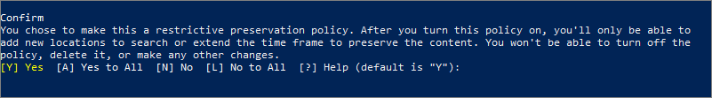

# <a name="create-and-configure-retention-policies"></a>Creare e configurare criteri di conservazione

>*[Indicazioni per l'assegnazione di licenze di Microsoft 365 per sicurezza e conformità](https://aka.ms/ComplianceSD).*

Usare un criterio di conservazione per decidere proattivamente se conservare il contenuto, eliminarlo o entrambe le cose, ovvero conservarlo ed eliminarlo successivamente. 

I criteri di conservazione permettono di farlo in modo molto efficiente, assegnando le stesse impostazioni di conservazione per il contenuto in base alla posizione, a livello di sito o di cassetta postale. Se non si sa se occorre usare un criterio di conservazione o un'etichetta di conservazione, vedere [Criteri di conservazione ed etichette di conservazione](retention.md#retention-policies-and-retention-labels).

Per saperne di più sul funzionamento della conservazione e sui criteri di conservazione, vedere [Informazioni sui criteri di conservazione](retention.md).

## <a name="before-you-begin"></a>Prima di iniziare

L'amministratore globale dell'organizzazione dispone delle autorizzazioni complete per creare e modificare le etichette conservazione. Se non si esegue l'accesso come amministratore globale, vedere le [autorizzazioni necessarie per creare e gestire criteri di conservazione ed etichette di conservazione](get-started-with-retention.md#permissions-required-to-create-and-manage-retention-policies-and-retention-labels).

## <a name="create-and-configure-a-retention-policy"></a>Creare e configurare un criterio di conservazione

Anche se un criterio di conservazione può supportare più posizioni, non è possibile creare un singolo criterio di conservazione che includa tutte le posizioni supportate:
- Posta elettronica di Exchange
- Sito di SharePoint
- Account di OneDrive
- Gruppi di Microsoft 365
- Skype for Business
- Cartelle pubbliche di Exchange
- Messaggi del canale di Teams
- Chat di Teams

Se si seleziona una delle posizioni di Teams quando si crea un criterio di conservazione, le altre posizioni vengono automaticamente escluse. Di conseguenza, le istruzioni da seguire variano in base alla necessità o meno di includere le posizioni di Teams:

- [Istruzioni per un criterio di conservazione per posizioni di Teams](#retention-policy-for-teams-locations)
- [Istruzioni per un criterio di conservazione per posizioni diverse da Teams](#retention-policy-for-locations-other-than-teams)

Se sono presenti più criteri di conservazione e quando si usano anche etichette di conservazione, vedere [Precedenza nei principi di conservazione](retention.md#the-principles-of-retention-or-what-takes-precedence) per comprendere cosa accade quando più impostazioni di conservazione si applicano allo stesso contenuto.

### <a name="retention-policy-for-teams-locations"></a>Criterio di conservazione per posizioni di Teams

1. Nel [Centro conformità Microsoft 365](https://compliance.microsoft.com/) selezionare **Criteri** > **Conservazione**.

2. Selezionare **Nuovo criterio di conservazione** per creare un nuovo criterio.

3. Nella pagina **Decidere se si vuole conservare il contenuto, eliminarlo e entrambi** della procedura guidata specificare le opzioni di configurazione per la conservazione e l'eliminazione del contenuto. 
    
    È possibile creare un criterio che si limita a conservare il contenuto senza eliminarlo, lo conserva e quindi lo elimina dopo un periodo di tempo specificato oppure semplicemente elimina il contenuto dopo un periodo di tempo specificato. Per altre informazioni, vedere [Impostazioni per la conservazione e l'eliminazione del contenuto](#settings-for-retaining-and-deleting-content) in questa pagina.
    
    Non selezionare **Usa le impostazioni di conservazione avanzate**, perché questa opzione non è supportata per le posizioni di Teams. 

4. Nella pagina **Scegli posizioni** selezionare **Consenti la scelta di posizioni specifiche**. Quindi, attivare una o entrambe le posizioni per Teams: **Messaggi del canale di Teams ** e **Chat di Teams**.
     
    Per **Messaggi del canale di Teams** sono inclusi i messaggi provenienti da canali standard ma non dai [canali privati](https://docs.microsoft.com/microsoftteams/private-channels). I canali privati non sono al momento supportati dai criteri di conservazione.
    
    Per impostazione predefinita sono selezionati tutti i team, ma è possibile specificare i team da includere o escludere.

5. Completare la procedura guidata per salvare le impostazioni.

Per altre informazioni sui criteri di conservazione per Teams, vedere [Criteri di conservazione in Microsoft Teams](https://docs.microsoft.com/microsoftteams/retention-policies) nella documentazione di Teams.

#### <a name="additional-retention-policy-needed-to-support-teams"></a>Un altro criterio di conservazione necessario per supportare Teams

Teams non offre solo chat e messaggi del canale. Se sono presenti team creati da un gruppo di Microsoft 365 (in precedenza gruppo di Office 365), è consigliabile configurare anche i criteri di conservazione che includono tale gruppo di Microsoft 365 usando il percorso **Gruppi di Office 365**. Questo criterio di conservazione si applica al contenuto della cassetta postale, dei siti e dei file del gruppo.

Se si hanno siti del team non connessi a un gruppo di Microsoft 365, è necessario un criterio di conservazione che includa i percorsi dei **siti di SharePoint** o degli **account di OneDrive** per conservare ed eliminare file in Teams:

- i file condivisi in chat vengono archiviati nell'account di OneDrive dell'utente che ha condiviso il file. 

- I file caricati nei canali vengono archiviati nel sito di SharePoint del team.

> [!TIP]
> È possibile applicare un criterio di conservazione ai file di un solo team che non è connesso a un gruppo di Microsoft 365 selezionando il sito di SharePoint per il team e gli account di OneDrive per gli utenti del team.

È possibile che i criteri di conservazione applicati ai gruppi di Microsoft 365, ai siti di SharePoint o agli account OneDrive eliminino un file a cui viene fatto riferimento nel messaggio di una chat o di un canale di Teams prima che tali messaggi vengano eliminati. In questo scenario, il file viene comunque visualizzato nel messaggio di Teams, ma se gli utenti selezionano il file visualizzeranno l'errore "File non trovato". Questo comportamento non è specifico dei criteri di conservazione e può verificarsi anche se un utente elimina manualmente un file da SharePoint o da OneDrive.


### <a name="retention-policy-for-locations-other-than-teams"></a>Criterio di conservazione per posizioni diverse da Teams

1. Nel [Centro conformità Microsoft 365](https://compliance.microsoft.com/) selezionare **Criteri** > **Conservazione**.

2. Selezionare **Nuovo criterio di conservazione** per creare un nuovo criterio.

3. Nella pagina **Decidere se si vuole conservare il contenuto, eliminarlo e entrambi** della procedura guidata specificare le opzioni di configurazione per la conservazione e l'eliminazione del contenuto. 
    
    È possibile creare un criterio che si limita a conservare il contenuto senza eliminarlo, lo conserva e quindi lo elimina dopo un periodo di tempo specificato oppure semplicemente elimina il contenuto dopo un periodo di tempo specificato. Per altre informazioni, vedere [Impostazioni per la conservazione e l'eliminazione del contenuto](#settings-for-retaining-and-deleting-content) in questa pagina.
    
    Quindi, decidere se il criterio di conservazione va applicato a tutto il contenuto o al contenuto che soddisfa determinate condizioni. Per altre informazioni su queste impostazioni avanzate di conservazione, vedere [Impostazioni avanzate per identificare il contenuto che soddisfa condizioni specifiche](#advanced-settings-to-identify-content-that-meets-specific-conditions) in questa pagina. 

4. Per la pagina **Seleziona posizioni**, selezionare se il criterio di conservazione va applicato a tutte le posizioni supportate nell'organizzazione o se si vogliono specificare. Se si scelgono posizioni specifiche, è anche possibile specificare cosa includere o escludere. 
    
    Per altre informazioni sulla scelta tra criteri di conservazione per l'organizzazione o per posizioni specifiche, vedere [Applicazione di criteri di conservazione a un'intera organizzazione o a posizioni specifiche](#applying-a-retention-policy-to-an-entire-organization-or-specific-locations) in questa pagina.
    
    Informazioni specifiche per le posizioni:
    - [Posta elettronica di Exchange e cartelle pubbliche di Exchange](#configuration-information-for-exchange-email-and-exchange-public-folders)
    - [Siti di SharePoint e account di OneDrive](#configuration-information-for-sharepoint-sites-and-onedrive-accounts)
    - [Gruppi di Office 365](#configuration-information-for-microsoft-365-groups)
    - [Skype for Business](#configuration-information-for-skype-for-business)

5. Completare la procedura guidata per salvare le impostazioni.


#### <a name="configuration-information-for-exchange-email-and-exchange-public-folders"></a>Informazioni di configurazione per la posta elettronica di Exchange e le cartelle pubbliche di Exchange

La posizione **Posta elettronica di Exchange** supporta la conservazione per i messaggi di posta elettronica, il calendario e altri elementi delle cassette postali degli utenti applicando le impostazioni di conservazione a livello di cassetta postale.

Sono inclusi gli elementi di posta elettronica seguenti: i messaggi di posta elettronica con allegati, incluse le bozze, le attività, gli elementi del calendario quando hanno una data di fine e le note. I contatti, le attività e gli elementi del calendario che non hanno una data di fine sono esclusi. Altri elementi archiviati in una cassetta postale, ad esempio i messaggi salvati di Skype e di Teams, non sono inclusi con questa posizione. Questi elementi hanno posizioni di conservazione personalizzate.

Anche se un gruppo di Microsoft 365 ha una cassetta postale di Exchange, un criterio di conservazione che include l'intero percorso **Posta elettronica di Exchange** non includerà il contenuto nelle cassette postali del gruppo di Microsoft 365. Per conservare i contenuti delle cassette postali, selezionare la posizione dei **Gruppi di Office 365**.

La posizione **Cartelle pubbliche di Exchange** applica le impostazioni di conservazione a tutte le cartelle pubbliche e non può essere applicata a livello di cartella o cassetta postale.

#### <a name="configuration-information-for-sharepoint-sites-and-onedrive-accounts"></a>Informazioni di configurazione per siti di SharePoint e account di OneDrive

Selezionando la posizione **Siti di SharePoint**, il criterio di conservazione può conservare ed eliminare documenti all'interno di siti di comunicazione di SharePoint, siti del team non collegati a gruppi di Office 365 e siti classici. I siti del team collegati a gruppi di Office 365 non sono supportati con questa opzione. In alternativa, usa la posizione dei **gruppi di Office 365** che si applicano ai contenuti della casella di posta, del sito e dei file del gruppo.

Anche se il criterio di conservazione è applicato a livello di sito, le impostazioni di conservazione sono applicate solo ai documenti. Le impostazioni di conservazione non si applicano alle strutture di organizzazione che includono raccolte, elenchi e cartelle all'interno del sito. 

Quando si specificano le posizioni dei siti di SharePoint o gli account di OneDrive, non è necessario disporre delle autorizzazioni per accedere ai siti e non viene eseguita alcuna convalida quando si specifica l'URL nella pagina **Modificare le posizioni**. Tuttavia, i siti di SharePoint devono essere indicizzati e al termine della procedura guidata viene verificata l'esistenza dei siti specificati.

Se la verifica dell'URL immesso fallisce, verrà visualizzato un messaggio di errore e la procedura guidata non creerà il criterio di conservazione fino al successo della verifica. Se si visualizza il messaggio di errore, tornare alla procedura guidata per cambiare l'URL o rimuovere il sito dal criterio di conservazione.

Per specificare singoli account di OneDrive da includere o escludere, l'URL ha il formato seguente: `https://<tenant name>-my.sharepoint.com/personal/<user_name>_<tenant name>_com`

Ad esempio, per un utente nel tenant Contoso con il nome utente "rsimone": `https://contoso-my.sharepoint.com/personal/rsimone_contoso_onmicrosoft_com`

Per verificare la sintassi del tenant e identificare gli URL per gli utenti, vedere [Ottenere un elenco di tutti gli URL di OneDrive dell'utente nell'organizzazione](https://docs.microsoft.com/onedrive/list-onedrive-urls).

### <a name="configuration-information-for-microsoft-365-groups"></a>Informazioni di configurazione per i gruppi di Microsoft 365

Per conservare o eliminare il contenuto di un gruppo di Microsoft 365 (in precedenza gruppo di Office365), è necessario usare la posizione **Gruppi di Office 365**. Anche se un gruppo di Microsoft 365 ha una cassetta postale di Exchange, un criterio di conservazione che include l'intero percorso **Posta elettronica di Exchange** non includerà il contenuto nelle cassette postali del gruppo di Microsoft 365. Inoltre, anche se il percorso **Posta elettronica di Exchange** consente inizialmente di selezionare una cassetta postale del gruppo da includere o escludere, provando a salvare il criterio di conservazione si riceverà un messaggio di errore che segnala che "RemoteGroupMailbox" non è una selezione valida per il percorso di Exchange.

I criteri di conservazione applicati a un gruppo di Microsoft 365 includono la cassetta postale del gruppo e il sito di Teams, se è stato selezionato un sito di Teams al momento della creazione del gruppo o aggiunto un secondo momento. I file archiviati nel sito di Teams sono coperti con questa posizione, ma non le chat di Teams oppure i messaggi del canale di Teams che hanno i propri percorsi dei criteri di conservazione.

### <a name="configuration-information-for-skype-for-business"></a>Informazioni di configurazione per Skype for Business

A differenza della posta elettronica di Exchange, non è possibile attivare lo stato della posizione Skype per includere tutti gli utenti ma quando si attiva la posizione, sarà possibile scegliere manualmente gli utenti di cui si desidera conservare le conversazioni:


  
Quando si seleziona **Scegli utenti **, è possibile includere rapidamente tutti gli utenti selezionando la casella **Nome ** nell'intestazione di colonna. È necessario considerare, però, che ciascun utente viene conteggiato come specifica inclusione nei criteri. Di conseguenza, se si includono più di 1.000 utenti, si applicano i limiti indicati nella sezione precedente. La selezione di tutti gli utenti di Skype da questa posizione non coincide con la procedura che prevede l'inclusione predefinita di tutti gli utenti di Skype con i criteri a livello di organizzazione. 
  

  
Si noti che**Cronologia conversazioni**, una cartella di Outlook, è una funzionalità che non ha nulla a che fare con l'archiviazione di Skype. **Cronologia conversazioni** può essere disattivata dall'utente finale, mentre l'archiviazione per Skype avviene memorizzando una copia delle conversazioni di Skype in una cartella nascosta che è inaccessibile all'utente, ma disponibile per eDiscovery.


## <a name="settings-for-retaining-and-deleting-content"></a>Impostazioni per la conservazione e l'eliminazione del contenuto

Scegliendo le impostazioni per la conservazione e l'eliminazione del contenuto, il criterio di conservazione avrà una delle configurazioni seguenti per un periodo di tempo specificato:

- Conserva solo
- Conserva ed elimina
- Elimina solo

### <a name="retaining-content-for-a-specific-period-of-time"></a>Conservazione del contenuto per un periodo di tempo specifico

Quando si configura un criterio di conservazione, si sceglie di conservare il contenuto per un periodo di tempo indefinito o per un numero specifico di giorni, mesi o anni. Il calcolo relativo al periodo di conservazione del contenuto è basato sulla data di modifica del contenuto e non sulla data di applicazione dei criteri di conservazione. È possibile scegliere se calcolare questo periodo a partire dalla creazione del contenuto o, per OneDrive e SharePoint, dalla data dell'ultima modifica.

Esempi:
  
- SharePoint: se si vuole conservare il contenuto di una raccolta siti per sette anni dopo l'ultima modifica e un documento presente nella raccolta siti non è stato modificato per sei anni, il documento verrà conservato solo per un altro anno se non viene modificato. Se il documento viene nuovamente modificato, la durata viene ricalcolata in base alla nuova data di modifica e il documento verrà conservato per altri sette anni.
  
- Exchange: se si vuole conservare il contenuto di una cassetta postale per sette anni e un messaggio è stato inviato sei anni fa, il messaggio verrà conservato solo per un altro anno. Per il contenuto di Exchange, l'età dipende dalla data di ricezione per la posta in arrivo o dalla data di invio per la posta in uscita. La conservazione del contenuto in base all'ultima modifica si applica solo al contenuto del sito di OneDrive e SharePoint.
  
Al termine del periodo di conservazione, si sceglie se si vuole eliminare definitivamente il contenuto:
  

  
### <a name="deleting-content-thats-older-than-a-specific-age"></a>Eliminazione di contenuto antecedente a una data specifica

I criteri di conservazione possono conservare e quindi eliminare il contenuto successivamente o eliminare il contenuto obsoleto senza conservarlo.
  
Se i criteri di conservazione eliminano il contenuto, è importante tenere presente che il periodo di tempo specificato per i criteri di conservazione viene calcolato dal momento in cui il contenuto è stato creato o modificato, non dal momento dell'assegnazione dei criteri.
  

  
Ad esempio, si supponga di creare criteri di conservazione che eliminano il contenuto dopo tre anni e quindi di assegnarli a tutti gli account di OneDrive, che includono grandi quantità di contenuti creati quattro o cinque anni fa. In questo caso, molti contenuti verranno eliminati subito dopo la prima assegnazione dei criteri di conservazione. Per questo motivo, è importante comprendere che i criteri di conservazione che eliminano il contenuto possono avere un impatto notevole. 
  
Prima di assegnare criteri di conservazione a una raccolta siti per la prima volta, è quindi consigliabile considerare il tempo trascorso dalla creazione del contenuto esistente e l'impatto dei criteri sul contenuto. È anche opportuno comunicare l'introduzione dei nuovi criteri agli utenti prima di assegnarli, in modo che possano valutarne l'impatto. Questo avviso viene visualizzato quando si esaminano le impostazioni per i criteri di conservazione prima di crearli.
  

  
## <a name="advanced-settings-to-identify-content-that-meets-specific-conditions"></a>Impostazioni avanzate per identificare il contenuto che soddisfa condizioni specifiche

I criteri di conservazione possono essere applicati a tutto il contenuto nelle posizioni incluse oppure solo al contenuto che contiene parole chiave specifiche o [tipi specifici di informazioni riservate](what-the-sensitive-information-types-look-for.md).
  

  
### <a name="identify-content-that-contains-specific-keywords"></a>Identificare il contenuto che include parole chiave specifiche

È possibile applicare i criteri di conservazione solo al contenuto che soddisfa specifiche condizioni e quindi eseguire azioni di conservazione solo su tale contenuto. Le condizioni disponibili supportano l'applicazione di criteri di conservazione al contenuto che include parole o frasi specifiche. È possibile perfezionare la query usando operatori di ricerca come AND, OR e NOT. Per altre informazioni sugli operatori, vedere [Query con parola chiave e condizioni di ricerca per la ricerca di contenuto](keyword-queries-and-search-conditions.md).

I criteri di conservazione basati su query usano l'indice di ricerca per identificare il contenuto.
  

  
### <a name="identify-content-that-contains-sensitive-information"></a>Identificare il contenuto che include informazioni riservate

È possibile applicare i criteri di conservazione anche solo al contenuto che include[tipi specifici di informazioni sensibili](what-the-sensitive-information-types-look-for.md). Ad esempio, è possibile scegliere di applicare criteri di conservazione univoci solo al contenuto che include informazioni personali come i codici identificativi del contribuente, codici di previdenza sociale o numeri di passaporto.
  

  
Note:
  
- I criteri di conservazione avanzati per le informazioni riservate non si applicano alle cartelle pubbliche di Exchange o a Skype for Business perché queste posizioni non supportano i tipi di informazioni riservate.
    
- Exchange Online usa regole del flusso di posta, note anche come regole di trasporto, per identificare le informazioni riservate, quindi funziona solo per i messaggi in transito, non per tutti gli elementi già archiviati in una cassetta postale. Per Exchange Online, questo significa che i criteri di conservazione possono identificare le informazioni riservate e possono eseguire azioni di conservazione solo nei messaggi ricevuti **dopo** l'applicazione dei criteri alla cassetta postale. I criteri di conservazione basati su query descritti nella sezione precedente non hanno questa limitazione perché usano l'indice di ricerca per identificare il contenuto. 
    
## <a name="applying-a-retention-policy-to-an-entire-organization-or-specific-locations"></a>Applicazione di criteri di conservazione a un'intera organizzazione o a posizioni specifiche

È possibile applicare facilmente i criteri di conservazione a un'intera organizzazione, a intere posizioni oppure a posizioni o utenti specifici.
  
### <a name="org-wide-policy"></a>Criteri a livello di organizzazione

Una delle caratteristiche più efficaci dei criteri di conservazione riguarda la possibilità di applicare i criteri alle posizioni in Microsoft 365, tra cui:
  
- Posta elettronica di Exchange
    
- Raccolte siti di SharePoint
    
- Account di OneDrive
    
- Gruppi di Microsoft 365
    
- Cartelle pubbliche di Exchange
    


Altre caratteristiche importanti di un criterio di conservazione a livello di organizzazione includono:
  
- Non sono previsti limiti al numero di cassette postali o di siti inclusi nel criterio.
    
- Per Exchange, le nuove cassette postali create dopo l'applicazione del criterio ereditano automaticamente il criterio.
  
### <a name="a-policy-that-applies-to-entire-locations"></a>Criteri validi per intere posizioni

Quando si scelgono le posizioni, è possibile includere o escludere facilmente un'intera posizione, ad esempio la posta elettronica di Exchange o gli account di OneDrive. A questo scopo, attivare o disattivare lo **Stato** di tale posizione. 
  
Come per i criteri a livello di organizzazione, un criterio applicabile a una qualsiasi combinazione di posizioni complete può includere un numero illimitato di cassette postali o siti. 

Ad esempio, se un criterio include tutta la posta elettronica di Exchange e tutti i siti di SharePoint, verranno inclusi tutti i siti e tutte le cassette postali, indipendentemente dal numero. Per Exchange, le nuove cassette postali create dopo l'applicazione del criterio ereditano automaticamente il criterio.

### <a name="a-policy-with-specific-inclusions-or-exclusions"></a>Criteri con specifiche inclusioni o esclusioni

È anche possibile applicare un criterio di conservazione a specifici utenti, gruppi di Microsoft 365 o siti. A questo scopo, attivare lo **Stato** di tale posizione e quindi usare i collegamenti per includere o escludere determinati utenti, gruppi di Microsoft 365 o siti. 
  
Questa configurazione, tuttavia, prevede dei limiti se i criteri di conservazione includono o escludono più di 1.000 posizioni specifiche:
  
- Valori massimi per i criteri di conservazione:
    - 1.000 cassette postali
    - 1.000 gruppi di Microsoft 365
    - 1.000 utenti per le chat private di Teams
    - 100 siti (OneDrive o SharePoint)

Il un numero massimo di criteri supportati per un tenant è di 10.000. Questi elementi includono criteri di conservazione, criteri per le etichette di conservazione e criteri di conservazione applicati automaticamente.

Se è probabile che i propri criteri di conservazione siano soggetti a queste limitazioni, scegliere le opzioni di configurazione che prevedono l'applicazione a intere posizioni oppure usare un criterio a livello di organizzazione.

> [!WARNING]
> Se si configurano inclusioni e poi si rimuove l'ultima di esse, verrà ripristinata la configurazione **Tutti** per la posizione.  Verificare che la configurazione sia quella desiderata prima di salvare il criterio.
> 
> Ad esempio, se si specifica un sito di SharePoint da includere nei criteri di conservazione configurato per l'eliminazione dei dati e poi si rimuove quell’unico sito, per impostazione predefinita i criteri di conservazione che eliminano definitivamente i dati verranno applicati a tutti i siti di SharePoint. Lo stesso vale per inclusioni come destinatari di Exchange, account OneDrive, utenti della chat di Teams e così via.
> 
> In questo scenario, disabilitare la posizione se non si vuole che l’impostazione **Tutti** per tale posizione sia soggetta ai criteri di conservazione. In alternativa, specificare esclusioni da esonerare dall’applicazione del criterio.

## <a name="updating-retention-policies"></a>Aggiornamento dei criteri di conservazione

Se si modifica un criterio di conservazione ed esiste già contenuto soggetto alle impostazioni originali del criterio, le impostazioni aggiornate verranno applicate automaticamente al tale contenuto oltre che ai nuovi contenuti identificati.

In genere l'aggiornamento è piuttosto rapido, ma può richiedere alcuni giorni. Una volta completata la replica del criterio nelle diverse posizioni di Microsoft 365, il suo stato nel Centro conformità Microsoft 365 passerà da **Attivato (in sospeso)** ad **Attivato (operazione riuscita)**.

## <a name="lock-a-retention-policy-by-using-powershell"></a>Bloccare i criteri di conservazione con PowerShell

Se è necessario usare la [protezione dell'archiviazione](retention.md#use-preservation-lock-to-comply-with-regulatory-requirements) per soddisfare i requisiti normativi, occorre usare PowerShell. Poiché gli amministratori non possono disabilitare o eliminare i criteri di conservazione dopo l'applicazione della protezione dell’archiviazione, l'abilitazione di questa caratteristica non è disponibile nell'UI per proteggerla dalla configurazione accidentale.

Tutti i criteri di conservazione con qualsiasi protezione dell’archiviazione del supporto di configurazione. Tuttavia, quando si usano i comandi di PowerShell seguenti, si noterà che il parametro **Carico di lavoro** visualizza sempre **Exchange, SharePoint, OneDriveForBusines, Skype, ModernGroup** invece di riflettere i carichi di lavoro effettivi configurati nel criterio. Si tratta solo di un problema di visualizzazione.

1. [Connettersi a PowerShell in Centro sicurezza e conformità](https://docs.microsoft.com/powershell/exchange/office-365-scc/connect-to-scc-powershell/connect-to-scc-powershell).

2. Visualizzare un elenco dei criteri di conservazione e trovare il nome del criterio da bloccare eseguendo [Get-RetentionCompliancePolicy](https://powershell/module/exchange/get-retentioncompliancepolicy). Ad esempio:
    
   
    
3. Per applicare la protezione dell’archiviazione per il criterio di conservazione, eseguire il cmdlet [Set-RetentionCompliancePolicy]( ) con il nome del criterio di conservazione e il parametro *RestrictiveRetention* impostato su true:
    
    ```powershell
    Set-RetentionCompliancePolicy -Identity "<Name of Policy>" –RestrictiveRetention $true
    ```
    
    Ad esempio:
    
    
    
     Quando viene richiesto, leggere e accettare le restrizioni disponibili in questa configurazione immettendo **Y**:
    
   

La protezione dell'archiviazione è ora inserita nei criteri di conservazione. Per confermare, eseguire di nuovo `Get-RetentionCompliancePolicy`, ma specificare il nome del criterio di conservazione e visualizzare i parametri dei criteri:

```powershell
Get-RetentionCompliancePolicy -Identity "<Name of Policy>" |Fl
```

Dovrebbe essere visualizzato **RestrictiveRetention** è impostato su **True**. Ad esempio:


  

