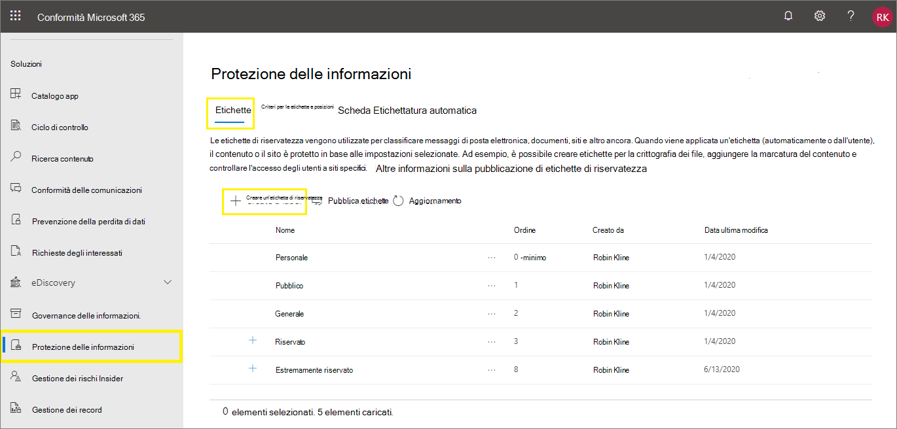

# <a name="create-and-configure-sensitivity-labels-and-their-policies"></a><span data-ttu-id="d72b6-103">Creare e configurare etichette di riservatezza e i relativi criteri</span><span class="sxs-lookup"><span data-stu-id="d72b6-103">Create and configure sensitivity labels and their policies</span></span>

><span data-ttu-id="d72b6-104">*[Indicazioni per l'assegnazione di licenze di Microsoft 365 per sicurezza e conformità](https://aka.ms/ComplianceSD).*</span><span class="sxs-lookup"><span data-stu-id="d72b6-104">*[Microsoft 365 licensing guidance for security & compliance](https://aka.ms/ComplianceSD).*</span></span>

<span data-ttu-id="d72b6-105">Tutte le soluzioni di Microsoft Information Protection (MIP) sono implementate utilizzando le [etichette di riservatezza](sensitivity-labels.md).</span><span class="sxs-lookup"><span data-stu-id="d72b6-105">All Microsoft Information Protection solutions (sometimes abbreviated to MIP) are implemented by using [sensitivity labels](sensitivity-labels.md).</span></span> <span data-ttu-id="d72b6-106">Per creare e pubblicare le etichette, passare all'interfaccia di amministrazione per l’applicazione di etichette, come il [Centro conformità Microsoft 365](https://compliance.microsoft.com/).</span><span class="sxs-lookup"><span data-stu-id="d72b6-106">To create and publish these labels, go to your labeling admin center, such as the [Microsoft 365 compliance center](https://compliance.microsoft.com/).</span></span> <span data-ttu-id="d72b6-107">È anche possibile utilizzare il Centro sicurezza Microsoft 365 o il Centro sicurezza e conformità.</span><span class="sxs-lookup"><span data-stu-id="d72b6-107">You can also use the Microsoft 365 security center, or the Security & Compliance Center.</span></span>

<span data-ttu-id="d72b6-108">Prima di tutto, creare e configurare le etichette di riservatezza che si vogliono rendere disponibili per le app e gli altri servizi.</span><span class="sxs-lookup"><span data-stu-id="d72b6-108">First, create and configure the sensitivity labels that you want to make available for apps and other services.</span></span> <span data-ttu-id="d72b6-109">Ad esempio, le etichette che gli utenti possono vedere e applicare dalle app di Office.</span><span class="sxs-lookup"><span data-stu-id="d72b6-109">For example, the labels you want users to see and apply from Office apps.</span></span> 

<span data-ttu-id="d72b6-110">Quindi, creare uno o più criteri di etichetta contenenti le etichette e le impostazioni dei criteri configurate.</span><span class="sxs-lookup"><span data-stu-id="d72b6-110">Then, create one or more label policies that contain the labels and policy settings that you configure.</span></span> <span data-ttu-id="d72b6-111">È il criterio di etichetta che pubblica le etichette e le impostazioni per gli utenti e i percorsi scelti.</span><span class="sxs-lookup"><span data-stu-id="d72b6-111">It's the label policy that publishes the labels and settings for your chosen users and locations.</span></span>

## <a name="before-you-begin"></a><span data-ttu-id="d72b6-112">Prima di iniziare</span><span class="sxs-lookup"><span data-stu-id="d72b6-112">Before you begin</span></span>

<span data-ttu-id="d72b6-113">L'amministratore globale dell'organizzazione dispone delle autorizzazioni complete per creare e gestire tutti gli aspetti delle etichette di riservatezza.</span><span class="sxs-lookup"><span data-stu-id="d72b6-113">The global admin for your organization has full permissions to create and manage all aspects of sensitivity labels.</span></span> <span data-ttu-id="d72b6-114">Se non si esegue l'accesso come amministratore globale, vedere le [autorizzazioni necessarie per creare e gestire etichette di riservatezza](get-started-with-sensitivity-labels.md#permissions-required-to-create-and-manage-sensitivity-labels).</span><span class="sxs-lookup"><span data-stu-id="d72b6-114">If you aren't signing in as a global admin, see [Permissions required to create and manage sensitivity labels](get-started-with-sensitivity-labels.md#permissions-required-to-create-and-manage-sensitivity-labels).</span></span>

## <a name="create-and-configure-sensitivity-labels"></a><span data-ttu-id="d72b6-115">Creare e configurare etichette di riservatezza</span><span class="sxs-lookup"><span data-stu-id="d72b6-115">Create and configure sensitivity labels</span></span>

1. <span data-ttu-id="d72b6-116">Nell'interfaccia di amministrazione per l’applicazione di etichette passare alle etichette di riservatezza:</span><span class="sxs-lookup"><span data-stu-id="d72b6-116">In your labeling admin center, navigate to sensitivity labels:</span></span>
    
    - <span data-ttu-id="d72b6-117">Centro conformità Microsoft 365:</span><span class="sxs-lookup"><span data-stu-id="d72b6-117">Microsoft 365 compliance center:</span></span> 
        - <span data-ttu-id="d72b6-118">**Soluzioni** > **Information Protection)**</span><span class="sxs-lookup"><span data-stu-id="d72b6-118">**Solutions** > **Information protection**</span></span>
        
        <span data-ttu-id="d72b6-119">Se questa opzione non è immediatamente visibile, selezionare prima **Mostra tutto**.</span><span class="sxs-lookup"><span data-stu-id="d72b6-119">If you don't immediately see this option, first select **Show all**.</span></span> 
    
    - <span data-ttu-id="d72b6-120">Centro sicurezza Microsoft 365:</span><span class="sxs-lookup"><span data-stu-id="d72b6-120">Microsoft 365 security center:</span></span> 
        - <span data-ttu-id="d72b6-121">**Classificazione** > **Etichette di riservatezza**</span><span class="sxs-lookup"><span data-stu-id="d72b6-121">**Classification** > **Sensitivity labels**</span></span>
    
    - <span data-ttu-id="d72b6-122">Centro sicurezza e conformità:</span><span class="sxs-lookup"><span data-stu-id="d72b6-122">Security & Compliance Center:</span></span>
        - <span data-ttu-id="d72b6-123">**Classificazione** > **Etichette di riservatezza**</span><span class="sxs-lookup"><span data-stu-id="d72b6-123">**Classification** > **Sensitivity labels**</span></span>

2. <span data-ttu-id="d72b6-124">Nella pagina **Etichette** selezionare **+ Crea un'etichetta** per avviare la procedura guidata Nuova etichetta di riservatezza.</span><span class="sxs-lookup"><span data-stu-id="d72b6-124">On the **Labels** page, select **+ Create a label** to start the New sensitivity label wizard.</span></span> 
    
    <span data-ttu-id="d72b6-125">Ad esempio, dal Centro conformità Microsoft 365:</span><span class="sxs-lookup"><span data-stu-id="d72b6-125">For example, from the Microsoft 365 compliance center:</span></span>
    
    
    
    > [!NOTE]
    > <span data-ttu-id="d72b6-127">Per impostazione predefinita, i tenant non hanno etichette ed è necessario crearle.</span><span class="sxs-lookup"><span data-stu-id="d72b6-127">By default, tenants don't have any labels and you must create them.</span></span> <span data-ttu-id="d72b6-128">Le etichette nell'immagine di esempio sono quelle predefinite di cui è stata eseguita la [migrazione da Azure Information Protection](https://docs.microsoft.com/azure/information-protection/configure-policy-migrate-labels).</span><span class="sxs-lookup"><span data-stu-id="d72b6-128">The labels in the example picture show default labels that were [migrated from Azure Information Protection](https://docs.microsoft.com/azure/information-protection/configure-policy-migrate-labels).</span></span>

3. <span data-ttu-id="d72b6-129">Nella pagina **Definire l'ambito per questa etichetta**, le opzioni selezionate determinano l'ambito dell'etichetta per le impostazioni che è possibile configurare e dove saranno visibili quando vengono pubblicate:</span><span class="sxs-lookup"><span data-stu-id="d72b6-129">On the **Define the scope for this label** page, the options selected determine the label's scope for the settings that you can configure and where they will be visible when they are published:</span></span>
    
    
    
    - <span data-ttu-id="d72b6-131">Se viene selezionato **File e messaggi di posta elettronica**, è possibile configurare le impostazioni in questa procedura guidata che si applicano alle app che supportano le etichette di riservatezza, come Office Word e Outlook.</span><span class="sxs-lookup"><span data-stu-id="d72b6-131">If **Files & emails** is selected, you can configure settings in this wizard that apply to apps that support sensitivity labels, such as Office Word and Outlook.</span></span> <span data-ttu-id="d72b6-132">Se questa opzione non è selezionata, la procedura guidata mostra la prima pagina delle impostazioni, ma non è possibile configurarle e le etichette non potranno essere selezionate dagli utenti in queste app.</span><span class="sxs-lookup"><span data-stu-id="d72b6-132">If this option isn't selected, the wizard displays the first page of these settings but you can't configure them and the labels won't be available for users to select in these apps.</span></span>
    
    - <span data-ttu-id="d72b6-133">Se è selezionata l'opzione **Gruppi e siti**, è possibile configurare le impostazioni della procedura guidata che si applicano ai gruppi di Microsoft 365 e ai siti di Teams e di SharePoint.</span><span class="sxs-lookup"><span data-stu-id="d72b6-133">If **Groups & sites** is selected, you can configure settings in this wizard that apply to Microsoft 365 groups, and sites for Teams and SharePoint.</span></span> <span data-ttu-id="d72b6-134">Se questa opzione non è selezionata, la procedura guidata mostra la prima pagina delle impostazioni ma non è possibile configurarle, e le etichette non potranno essere selezionate dagli utenti per gruppi e siti.</span><span class="sxs-lookup"><span data-stu-id="d72b6-134">If this option isn't selected, the wizard displays the first page of these settings but you can't configure them and the labels won't be available for users to select for groups and site.</span></span>
    
    <span data-ttu-id="d72b6-135">Per informazioni sull'ambito degli **asset di Azure Purview (anteprima)**, vedere [Etichettare automaticamente i contenuti in Azure Purview](https://docs.microsoft.com/azure/purview/create-sensitivity-label).</span><span class="sxs-lookup"><span data-stu-id="d72b6-135">For information about the **Azure Purview assets (preview)** scope, see [Automatically label your content in Azure Purview](https://docs.microsoft.com/azure/purview/create-sensitivity-label).</span></span>

4. <span data-ttu-id="d72b6-136">Seguire le istruzioni della procedura guidata per le impostazioni dell'etichetta.</span><span class="sxs-lookup"><span data-stu-id="d72b6-136">Follow the prompts in the wizard for the label settings.</span></span>
    
    <span data-ttu-id="d72b6-137">Per altre informazioni sulle impostazioni delle etichette, vedere [Operazioni eseguibili dalle etichette di riservatezza](sensitivity-labels.md#what-sensitivity-labels-can-do) nelle informazioni di panoramica e usare le indicazioni nella procedura guidata per le singole impostazioni.</span><span class="sxs-lookup"><span data-stu-id="d72b6-137">For more information about the label settings, see [What sensitivity labels can do](sensitivity-labels.md#what-sensitivity-labels-can-do) from the overview information and use the help in the wizard for individual settings.</span></span>

5. <span data-ttu-id="d72b6-138">Ripetere questi passaggi per creare altre etichette.</span><span class="sxs-lookup"><span data-stu-id="d72b6-138">Repeat these steps to create more labels.</span></span> <span data-ttu-id="d72b6-139">Se invece si vuole creare un'etichetta secondaria, selezionare prima di tutto l'etichetta padre, poi **...** per **Altre azioni**, quindi selezionare **Aggiungi etichetta secondaria**.</span><span class="sxs-lookup"><span data-stu-id="d72b6-139">However, if you want to create a sublabel, first select the parent label and select **...** for **More actions**, and then select **Add sub label**.</span></span>

6. <span data-ttu-id="d72b6-140">Una volta create tutte le etichette desiderate, rivedere l'ordine e, se necessario, spostarle verso l'alto o verso il basso.</span><span class="sxs-lookup"><span data-stu-id="d72b6-140">When you have created all the labels you need, review their order and if necessary, move them up or down.</span></span> <span data-ttu-id="d72b6-141">Per modificare l'ordine di un'etichetta selezionare **...** per **Altre azioni**, quindi selezionare **Sposta su** o **Sposta giù**.</span><span class="sxs-lookup"><span data-stu-id="d72b6-141">To change the order of a label, select **...** for **More actions**, and then select **Move up** or **Move down**.</span></span> <span data-ttu-id="d72b6-142">Per altre informazioni, vedere [Priorità dell'etichetta (l'ordine è importante)](sensitivity-labels.md#label-priority-order-matters) nelle informazioni di panoramica.</span><span class="sxs-lookup"><span data-stu-id="d72b6-142">For more information, see [Label priority (order matters)](sensitivity-labels.md#label-priority-order-matters) from the overview information.</span></span>

<span data-ttu-id="d72b6-143">Per modificare un'etichetta esistente, selezionarla e quindi selezionare il pulsante **Modifica etichetta**:</span><span class="sxs-lookup"><span data-stu-id="d72b6-143">To edit an existing label, select it, and then select the **Edit label** button:</span></span>


<span data-ttu-id="d72b6-145">Verrà avviata la procedura guidata **Modifica etichetta di riservatezza**, che consente di modificare tutte le impostazioni dell'etichetta descritte al passaggio 4.</span><span class="sxs-lookup"><span data-stu-id="d72b6-145">This button starts the **Edit sensitivity label** wizard, which lets you change all the label settings in step 4.</span></span>

<span data-ttu-id="d72b6-146">Non eliminare un'etichetta se non se ne comprende l'impatto sugli utenti.</span><span class="sxs-lookup"><span data-stu-id="d72b6-146">Don't delete a label unless you understand the impact for users.</span></span> <span data-ttu-id="d72b6-147">Per altre informazioni, vedere [Rimozione ed eliminazione di etichette](#removing-and-deleting-labels).</span><span class="sxs-lookup"><span data-stu-id="d72b6-147">For more information, see the [Removing and deleting labels](#removing-and-deleting-labels) section.</span></span> 

> [!NOTE]
> <span data-ttu-id="d72b6-148">Se si modifica un'etichetta che è stata già pubblicata usando un criterio di etichetta, non saranno necessari ulteriori passaggi al completamento della procedura guidata.</span><span class="sxs-lookup"><span data-stu-id="d72b6-148">If you edit a label that's already published by using a label policy, no extra steps are needed when you finish the wizard.</span></span> <span data-ttu-id="d72b6-149">Ad esempio, non è necessario aggiungerla a un nuovo criterio di etichetta in modo che le modifiche vengano rese disponibili agli stessi utenti.</span><span class="sxs-lookup"><span data-stu-id="d72b6-149">For example, you don't need to add it to a new label policy for the changes to become available to the same users.</span></span> <span data-ttu-id="d72b6-150">Tuttavia, saranno necessarie fino a 24 ore affinché le modifiche vengano replicate in tutte le app e i servizi.</span><span class="sxs-lookup"><span data-stu-id="d72b6-150">However, allow up to 24 hours for the changes to replicate to all apps and services.</span></span>

<span data-ttu-id="d72b6-151">Finché non verranno pubblicate, le etichette non saranno disponibili per la selezione nelle app o per i servizi.</span><span class="sxs-lookup"><span data-stu-id="d72b6-151">Until you publish your labels, they won't be available to select in apps or for services.</span></span> <span data-ttu-id="d72b6-152">Per pubblicare le etichette è necessario [aggiungerle a un criterio di etichetta](#publish-sensitivity-labels-by-creating-a-label-policy).</span><span class="sxs-lookup"><span data-stu-id="d72b6-152">To publish the labels, they must be [added to a label policy](#publish-sensitivity-labels-by-creating-a-label-policy).</span></span>

> [!IMPORTANT]
> <span data-ttu-id="d72b6-153">In questa scheda **Etichette** non selezionare la scheda **Pubblica etichette** o il pulsante **Pubblica etichetta** quando si modifica un'etichetta, a meno che non sia necessario creare un nuovo criterio di etichetta.</span><span class="sxs-lookup"><span data-stu-id="d72b6-153">On this **Labels** tab, do not select the **Publish labels** tab (or the **Publish label** button when you edit a label) unless you need to create a new label policy.</span></span> <span data-ttu-id="d72b6-154">Sono necessari più criteri di etichetta solo se gli utenti hanno bisogno di etichette diverse o impostazioni di criteri diverse.</span><span class="sxs-lookup"><span data-stu-id="d72b6-154">You need multiple label policies only if users need different labels or different policy settings.</span></span> <span data-ttu-id="d72b6-155">L'obiettivo è avere il minor numero possibile di criteri di etichetta, non è raro averne uno solo per organizzazione.</span><span class="sxs-lookup"><span data-stu-id="d72b6-155">Aim to have as few label policies as possible—it's not uncommon to have just one label policy for the organization.</span></span>

### <a name="additional-label-settings-with-security--compliance-center-powershell"></a><span data-ttu-id="d72b6-156">Impostazioni aggiuntive per le etichette con PowerShell per Centro sicurezza e conformità</span><span class="sxs-lookup"><span data-stu-id="d72b6-156">Additional label settings with Security & Compliance Center PowerShell</span></span>

<span data-ttu-id="d72b6-157">Con il cmdlet [Set-Label](https://docs.microsoft.com/powershell/module/exchange/set-label) di [PowerShell per Centro sicurezza e conformità](https://docs.microsoft.com/powershell/exchange/scc-powershell) sono disponibili altre impostazioni delle etichette.</span><span class="sxs-lookup"><span data-stu-id="d72b6-157">Additional label settings are available with the [Set-Label](https://docs.microsoft.com/powershell/module/exchange/set-label) cmdlet from [Security & Compliance Center PowerShell](https://docs.microsoft.com/powershell/exchange/scc-powershell).</span></span>

<span data-ttu-id="d72b6-158">Ad esempio:</span><span class="sxs-lookup"><span data-stu-id="d72b6-158">For example:</span></span>

- <span data-ttu-id="d72b6-159">Usare il parametro *LocaleSettings* per le distribuzioni multinazionali, in modo che gli utenti possano visualizzare il nome e la descrizione comando dell'etichetta nella lingua locale.</span><span class="sxs-lookup"><span data-stu-id="d72b6-159">Use the *LocaleSettings* parameter for multinational deployments so that users see the label name and tooltip in their local language.</span></span> <span data-ttu-id="d72b6-160">La [sezione seguente](#example-configuration-to-configure-a-sensitivity-label-for-different-languages) include una configurazione di esempio che specifica il nome dell'etichetta e il testo della descrizione comando per la lingua francese, italiana e tedesca.</span><span class="sxs-lookup"><span data-stu-id="d72b6-160">The [following section](#example-configuration-to-configure-a-sensitivity-label-for-different-languages) has an example configuration that specifies the label name and tooltip text for French, Italian, and German.</span></span>

- <span data-ttu-id="d72b6-161">Solo per il client di etichettatura unificata di Azure Information Protection, specificare [impostazioni avanzate](https://docs.microsoft.com/azure/information-protection/rms-client/clientv2-admin-guide-customizations) che includano l'impostazione di un colore di etichetta, e applicare una proprietà personalizzata quando viene applicata un'etichetta.</span><span class="sxs-lookup"><span data-stu-id="d72b6-161">For the Azure Information Protection unified labeling client only, specify [advanced settings](https://docs.microsoft.com/azure/information-protection/rms-client/clientv2-admin-guide-customizations) that include setting a label color, and applying a custom property when a label is applied.</span></span> <span data-ttu-id="d72b6-162">Per l'elenco completo, vedere [Impostazioni avanzate disponibili per le etichette](https://docs.microsoft.com/azure/information-protection/rms-client/clientv2-admin-guide-customizations#available-advanced-settings-for-labels) in questa guida per gli amministratori del client.</span><span class="sxs-lookup"><span data-stu-id="d72b6-162">For the full list, see [Available advanced settings for labels](https://docs.microsoft.com/azure/information-protection/rms-client/clientv2-admin-guide-customizations#available-advanced-settings-for-labels) from this client's admin guide.</span></span>

#### <a name="example-configuration-to-configure-a-sensitivity-label-for-different-languages"></a><span data-ttu-id="d72b6-163">Esempio di configurazione per configurare un'etichetta di riservatezza per lingue diverse</span><span class="sxs-lookup"><span data-stu-id="d72b6-163">Example configuration to configure a sensitivity label for different languages</span></span>

<span data-ttu-id="d72b6-164">L'esempio seguente mostra la configurazione di PowerShell per un'etichetta denominata "Public" con testo segnaposto per la descrizione comando.</span><span class="sxs-lookup"><span data-stu-id="d72b6-164">The following example shows the PowerShell configuration for a label named "Public" with placeholder text for the tooltip.</span></span> <span data-ttu-id="d72b6-165">In questo esempio il nome e il testo della descrizione comando dell'etichetta sono configurati per le lingue francese, italiana e tedesca.</span><span class="sxs-lookup"><span data-stu-id="d72b6-165">In this example, the label name and tooltip text are configured for French, Italian, and German.</span></span>

<span data-ttu-id="d72b6-166">Grazie a questa configurazione, gli utenti di app di Office che usano tali lingue visualizzano i nomi e le descrizioni comando delle etichette nella stessa lingua.</span><span class="sxs-lookup"><span data-stu-id="d72b6-166">As a result of this configuration, users who have Office apps that use those display languages see their label names and tooltips in the same language.</span></span> <span data-ttu-id="d72b6-167">Analogamente, se è installato il client di etichettatura unificata di Azure Information Protection per etichettare i file da Esplora file, gli utenti che eseguono tali versioni di Windows visualizzeranno i nomi e le descrizioni comando delle etichette nella propria lingua locale quando accedono alle azioni per l'etichettatura facendo clic con il pulsante destro del mouse.</span><span class="sxs-lookup"><span data-stu-id="d72b6-167">Similarly, if you have the Azure Information Protection unified labeling client installed to label files from File Explorer, users who have those language versions of Windows see their label names and tooltips in their local language when they use the right-click actions for labeling.</span></span>

<span data-ttu-id="d72b6-168">Per le lingue che è necessario supportare, usare gli [identificatori di lingua](https://docs.microsoft.com/deployoffice/office2016/language-identifiers-and-optionstate-id-values-in-office-2016#language-identifiers) di Office, noti anche come tag lingua, e specificare una traduzione personalizzata per il nome e la descrizione comando dell'etichetta.</span><span class="sxs-lookup"><span data-stu-id="d72b6-168">For the languages that you need to support, use the Office [language identifiers](https://docs.microsoft.com/deployoffice/office2016/language-identifiers-and-optionstate-id-values-in-office-2016#language-identifiers) (also known as language tags), and specify your own translation for the label name and tooltip.</span></span>

<span data-ttu-id="d72b6-169">Per poter eseguire i comandi di PowerShell, è prima necessario [connettersi a PowerShell per Centro sicurezza e conformità](https://docs.microsoft.com/powershell/exchange/connect-to-scc-powershell).</span><span class="sxs-lookup"><span data-stu-id="d72b6-169">Before you run the commands in PowerShell, you must first [connect to Security & Compliance Center PowerShell](https://docs.microsoft.com/powershell/exchange/connect-to-scc-powershell).</span></span>


```powershell
$Languages = @("fr-fr","it-it","de-de")
$DisplayNames=@("Publique","Publico","Oeffentlich")
$Tooltips = @("Texte Français","Testo italiano","Deutscher text")
$label = "Public"
$DisplayNameLocaleSettings = [PSCustomObject]@{LocaleKey='DisplayName';
Settings=@(
@{key=$Languages[0];Value=$DisplayNames[0];}
@{key=$Languages[1];Value=$DisplayNames[1];}
@{key=$Languages[2];Value=$DisplayNames[2];})}
$TooltipLocaleSettings = [PSCustomObject]@{LocaleKey='Tooltip';
Settings=@(
@{key=$Languages[0];Value=$Tooltips[0];}
@{key=$Languages[1];Value=$Tooltips[1];}
@{key=$Languages[2];Value=$Tooltips[2];})}
Set-Label -Identity $Label -LocaleSettings (ConvertTo-Json $DisplayNameLocaleSettings -Depth 3 -Compress),(ConvertTo-Json $TooltipLocaleSettings -Depth 3 -Compress)
```

## <a name="publish-sensitivity-labels-by-creating-a-label-policy"></a><span data-ttu-id="d72b6-170">Pubblicare etichette di riservatezza creando un criterio di etichetta</span><span class="sxs-lookup"><span data-stu-id="d72b6-170">Publish sensitivity labels by creating a label policy</span></span>

1. <span data-ttu-id="d72b6-171">Nell'interfaccia di amministrazione per l’applicazione di etichette passare alle etichette di riservatezza:</span><span class="sxs-lookup"><span data-stu-id="d72b6-171">In your labeling admin center, navigate to sensitivity labels:</span></span>
    
    - <span data-ttu-id="d72b6-172">Centro conformità Microsoft 365:</span><span class="sxs-lookup"><span data-stu-id="d72b6-172">Microsoft 365 compliance center:</span></span> 
        - <span data-ttu-id="d72b6-173">**Soluzioni** > **Information Protection)**</span><span class="sxs-lookup"><span data-stu-id="d72b6-173">**Solutions** > **Information protection**</span></span>
        
        <span data-ttu-id="d72b6-174">Se questa opzione non è immediatamente visibile, selezionare prima **Mostra tutto**.</span><span class="sxs-lookup"><span data-stu-id="d72b6-174">If you don't immediately see this option, first select **Show all**.</span></span> 
    
    - <span data-ttu-id="d72b6-175">Centro sicurezza Microsoft 365:</span><span class="sxs-lookup"><span data-stu-id="d72b6-175">Microsoft 365 security center:</span></span> 
        - <span data-ttu-id="d72b6-176">**Classificazione** > **Etichette di riservatezza**</span><span class="sxs-lookup"><span data-stu-id="d72b6-176">**Classification** > **Sensitivity labels**</span></span>
    
    - <span data-ttu-id="d72b6-177">Centro sicurezza e conformità:</span><span class="sxs-lookup"><span data-stu-id="d72b6-177">Security & Compliance Center:</span></span>
        - <span data-ttu-id="d72b6-178">**Classificazione** > **Etichette di riservatezza**</span><span class="sxs-lookup"><span data-stu-id="d72b6-178">**Classification** > **Sensitivity labels**</span></span>

2. <span data-ttu-id="d72b6-179">Selezionare la scheda **Criteri etichetta** e quindi **Pubblica etichette** per avviare la creazione guidata criterio:</span><span class="sxs-lookup"><span data-stu-id="d72b6-179">Select the **Label policies** tab, and then **Publish labels** to start the Create policy wizard:</span></span>
    
    <span data-ttu-id="d72b6-180">Ad esempio, dal Centro conformità Microsoft 365:</span><span class="sxs-lookup"><span data-stu-id="d72b6-180">For example, from the Microsoft 365 compliance center:</span></span>
        
    
    
    > [!NOTE]
    > <span data-ttu-id="d72b6-182">Per impostazione predefinita, i tenant non hanno criteri di etichetta ed è necessario crearli.</span><span class="sxs-lookup"><span data-stu-id="d72b6-182">By default, tenants don't have any label policies and you must create them.</span></span> 

3. <span data-ttu-id="d72b6-183">Nella procedura guidata selezionare **Scegliere le etichette di riservatezza da pubblicare**.</span><span class="sxs-lookup"><span data-stu-id="d72b6-183">In the wizard, select **Choose sensitivity labels to publish**.</span></span> <span data-ttu-id="d72b6-184">Selezionare le etichette che si vogliono rendere disponibili nelle app e per i servizi e quindi selezionare **Aggiungi**.</span><span class="sxs-lookup"><span data-stu-id="d72b6-184">Select the labels that you want to make available in apps and to services, and then select **Add**.</span></span>
    
    > [!IMPORTANT]
    > <span data-ttu-id="d72b6-185">Se si seleziona una etichetta secondaria, accertarsi di selezionare anche l'etichetta padre.</span><span class="sxs-lookup"><span data-stu-id="d72b6-185">If you select a sublabel, make sure you also select its parent label.</span></span>
    
4. <span data-ttu-id="d72b6-186">Rivedere le etichette selezionate e selezionare **Modifica** se si vogliono apportare modifiche.</span><span class="sxs-lookup"><span data-stu-id="d72b6-186">Review the selected labels and to make any changes, select **Edit**.</span></span> <span data-ttu-id="d72b6-187">Altrimenti selezionare **Avanti**.</span><span class="sxs-lookup"><span data-stu-id="d72b6-187">Otherwise, select **Next**.</span></span>

5. <span data-ttu-id="d72b6-188">Seguire le istruzioni visualizzate per configurare le impostazioni del criterio.</span><span class="sxs-lookup"><span data-stu-id="d72b6-188">Follow the prompts to configure the policy settings.</span></span>
    
    <span data-ttu-id="d72b6-189">Le impostazioni del criterio che viene visualizzato corrispondono all'ambito delle etichette selezionate.</span><span class="sxs-lookup"><span data-stu-id="d72b6-189">The policy settings that you see match the scope of the labels that you selected.</span></span> <span data-ttu-id="d72b6-190">Ad esempio, se sono state selezionate etichette che dispongono unicamente dell'ambito **File e messaggi di posta elettronica**, non vengono visualizzate le impostazioni di criteri **Applica questa etichetta per impostazione predefinita a gruppi e siti** e **Richiedi agli utenti di applicare un'etichetta a gruppi e siti**.</span><span class="sxs-lookup"><span data-stu-id="d72b6-190">For example, if you selected labels that have just the **Files & emails** scope, you don't see the policy settings **Apply this label by default to groups and sites** and **Require users to apply a label to their groups and sites**.</span></span>
    
    <span data-ttu-id="d72b6-191">Per altre informazioni su queste impostazioni, vedere [Operazioni eseguibili dai criteri di etichetta](sensitivity-labels.md#what-label-policies-can-do) nelle informazioni di panoramica e usare le indicazioni nella procedura guidata per le singole impostazioni.</span><span class="sxs-lookup"><span data-stu-id="d72b6-191">For more information about these settings, see [What label policies can do](sensitivity-labels.md#what-label-policies-can-do) from the overview information and use the help in the wizard for individual settings.</span></span>
    
    <span data-ttu-id="d72b6-192">Per le etichette configurate per gli **asset di Azure Purview (anteprima)**: queste etichette non sono associate ad alcuna impostazione di criteri.</span><span class="sxs-lookup"><span data-stu-id="d72b6-192">For labels configured for **Azure Purview assets (preview)**: These labels don't have any associated policy settings.</span></span>

7. <span data-ttu-id="d72b6-193">Ripetere questi passaggi se sono necessarie impostazioni del criterio diverse per utenti o ambiti differenti.</span><span class="sxs-lookup"><span data-stu-id="d72b6-193">Repeat these steps if you need different policy settings for different users or scopes.</span></span> <span data-ttu-id="d72b6-194">Ad esempio, possono essere necessarie altre etichette per un gruppo di utenti oppure un'etichetta predefinita diversa per un sottoinsieme di utenti.</span><span class="sxs-lookup"><span data-stu-id="d72b6-194">For example, you want additional labels for a group of users, or a different default label for a subset of users.</span></span> <span data-ttu-id="d72b6-195">In alternativa, se sono state configurate etichette con diversi ambiti.</span><span class="sxs-lookup"><span data-stu-id="d72b6-195">Or, if you have configured labels to have different scopes.</span></span>

8. <span data-ttu-id="d72b6-196">Se si creano più criteri di etichetta che potrebbero comportare un conflitto per un utente, rivedere l'ordine dei criteri e, se necessario, spostarli verso l'alto o verso il basso.</span><span class="sxs-lookup"><span data-stu-id="d72b6-196">If you create more than one label policy that might result in a conflict for a user, review the policy order and if necessary, move them up or down.</span></span> <span data-ttu-id="d72b6-197">Per modificare l'ordine di un criterio di etichetta selezionare **...** per **Altre azioni**, quindi selezionare **Sposta su** o **Sposta giù**.</span><span class="sxs-lookup"><span data-stu-id="d72b6-197">To change the order of a label policy, select **...** for **More actions**, and then select **Move up** or **Move down**.</span></span> <span data-ttu-id="d72b6-198">Per altre informazioni, vedere [Priorità dei criteri di etichetta (l'ordine è importante)](sensitivity-labels.md#label-policy-priority-order-matters) nelle informazioni generali.</span><span class="sxs-lookup"><span data-stu-id="d72b6-198">For more information, see [Label policy priority (order matters)](sensitivity-labels.md#label-policy-priority-order-matters) from the overview information.</span></span>

<span data-ttu-id="d72b6-199">Completando la procedura guidata, il criterio di etichetta viene pubblicato automaticamente.</span><span class="sxs-lookup"><span data-stu-id="d72b6-199">Completing the wizard automatically publishes the label policy.</span></span> <span data-ttu-id="d72b6-200">Per apportare modifiche a un criterio pubblicato, basta modificarlo.</span><span class="sxs-lookup"><span data-stu-id="d72b6-200">To make changes to a published policy, simply edit it.</span></span> <span data-ttu-id="d72b6-201">Non è necessario selezionare una specifica azione di pubblicazione o ripubblicazione.</span><span class="sxs-lookup"><span data-stu-id="d72b6-201">There is no specific publish or republish action for you to select.</span></span>

<span data-ttu-id="d72b6-202">Per modificare un criterio di etichetta esistente, selezionarlo e quindi scegliere il pulsante **Modifica criterio**:</span><span class="sxs-lookup"><span data-stu-id="d72b6-202">To edit an existing label policy, select it, and then select the **Edit Policy** button:</span></span> 


<span data-ttu-id="d72b6-204">Verrà avviata la procedura guidata **Crea criterio**, che consente di modificare le etichette incluse e le impostazioni dell'etichetta.</span><span class="sxs-lookup"><span data-stu-id="d72b6-204">This button starts the **Create policy** wizard, which lets you edit which labels are included and the label settings.</span></span> <span data-ttu-id="d72b6-205">Una volta completata la procedura guidata, le modifiche vengono replicate automaticamente agli utenti e ai servizi selezionati.</span><span class="sxs-lookup"><span data-stu-id="d72b6-205">When you complete the wizard, any changes are automatically replicated to the selected users and services.</span></span>

<span data-ttu-id="d72b6-206">Quando si utilizza l’assegnazione di etichette predefinita in Windows, macOS, iOS e Android, gli utenti visualizzano le nuove etichette nelle app di Office entro quattro ore e in Office sul web entro un’ora.</span><span class="sxs-lookup"><span data-stu-id="d72b6-206">When you use built-in labeling for Windows, macOS, iOS and Android, users see new labels in their Office apps within four hours, and within one hour for Office on the web.</span></span> <span data-ttu-id="d72b6-207">Tuttavia, saranno necessarie fino a 24 ore affinché le modifiche vengano replicate in tutte le app e i servizi.</span><span class="sxs-lookup"><span data-stu-id="d72b6-207">However, allow up to 24 hours for changes to replicate to all apps and services.</span></span>

### <a name="additional-label-policy-settings-with-security--compliance-center-powershell"></a><span data-ttu-id="d72b6-208">Impostazioni aggiuntive per i criteri delle etichette con PowerShell per Centro sicurezza e conformità</span><span class="sxs-lookup"><span data-stu-id="d72b6-208">Additional label policy settings with Security & Compliance Center PowerShell</span></span>

<span data-ttu-id="d72b6-209">Con il cmdlet [Set-LabelPolicy](https://docs.microsoft.com/powershell/module/exchange/set-labelpolicy) di [PowerShell per Centro sicurezza e conformità](https://docs.microsoft.com/powershell/exchange/scc-powershell) sono disponibili altre impostazioni per i criteri delle etichette.</span><span class="sxs-lookup"><span data-stu-id="d72b6-209">Additional label policy settings are available with the [Set-LabelPolicy](https://docs.microsoft.com/powershell/module/exchange/set-labelpolicy) cmdlet from [Security & Compliance Center PowerShell](https://docs.microsoft.com/powershell/exchange/scc-powershell).</span></span>

<span data-ttu-id="d72b6-210">Solo per il client di etichettatura unificata di Azure Information Protection, è possibile specificare [impostazioni avanzate](https://docs.microsoft.com/azure/information-protection/rms-client/clientv2-admin-guide-customizations) che includono l'impostazione di un'etichetta predefinita diversa per Outlook e l'implementazione di messaggi popup in Outlook che segnalano, giustificano o bloccano l'invio di messaggi di posta elettronica.</span><span class="sxs-lookup"><span data-stu-id="d72b6-210">For the Azure Information Protection unified labeling client only, you can specify [advanced settings](https://docs.microsoft.com/azure/information-protection/rms-client/clientv2-admin-guide-customizations) that include setting a different default label for Outlook, and implement pop-up messages in Outlook that warn, justify, or block emails being sent.</span></span> <span data-ttu-id="d72b6-211">Per l'elenco completo, vedere [Impostazioni avanzate disponibili per i criteri delle etichette](https://docs.microsoft.com/azure/information-protection/rms-client/clientv2-admin-guide-customizations#available-advanced-settings-for-label-policies) in questa guida per gli amministratori del client.</span><span class="sxs-lookup"><span data-stu-id="d72b6-211">For the full list, see [Available advanced settings for label policies](https://docs.microsoft.com/azure/information-protection/rms-client/clientv2-admin-guide-customizations#available-advanced-settings-for-label-policies) from this client's admin guide.</span></span>

## <a name="use-powershell-for-sensitivity-labels-and-their-policies"></a><span data-ttu-id="d72b6-212">Usare PowerShell per le etichette di riservatezza e i relativi criteri</span><span class="sxs-lookup"><span data-stu-id="d72b6-212">Use PowerShell for sensitivity labels and their policies</span></span>

<span data-ttu-id="d72b6-213">È ora possibile usare [PowerShell per Centro sicurezza e conformità](https://docs.microsoft.com/powershell/exchange/scc-powershell) per creare e configurare tutte le impostazioni visualizzate nell'interfaccia di amministrazione per l'etichettatura.</span><span class="sxs-lookup"><span data-stu-id="d72b6-213">You can now use [Security & Compliance Center PowerShell](https://docs.microsoft.com/powershell/exchange/scc-powershell) to create and configure all the settings you see in your labeling admin center.</span></span> <span data-ttu-id="d72b6-214">Questo significa che, oltre a usare PowerShell per le impostazioni che non sono disponibili nelle interfacce di amministrazione per l'etichettatura, ora è possibile gestire completamente tramite la creazione e la manutenzione di etichette di riservatezza e criteri per le etichette di riservatezza.</span><span class="sxs-lookup"><span data-stu-id="d72b6-214">This means that in addition to using PowerShell for settings that aren't available in the labeling admin centers, you can now fully script the creation and maintenance of sensitivity labels and sensitivity label policies.</span></span> 

<span data-ttu-id="d72b6-215">Per i parametri e i valori supportati, vedere la documentazione seguente:</span><span class="sxs-lookup"><span data-stu-id="d72b6-215">See the following documentation for supported parameters and values:</span></span>

- [<span data-ttu-id="d72b6-216">New-Label</span><span class="sxs-lookup"><span data-stu-id="d72b6-216">New-Label</span></span>](https://docs.microsoft.com/powershell/module/exchange/new-label)
- [<span data-ttu-id="d72b6-217">New-LabelPolicy</span><span class="sxs-lookup"><span data-stu-id="d72b6-217">New-LabelPolicy</span></span>](https://docs.microsoft.com/powershell/module/exchange/new-labelpolicy)
- [<span data-ttu-id="d72b6-218">Set-Label</span><span class="sxs-lookup"><span data-stu-id="d72b6-218">Set-Label</span></span>](https://docs.microsoft.com/powershell/module/exchange/set-label)
- [<span data-ttu-id="d72b6-219">Set-LabelPolicy</span><span class="sxs-lookup"><span data-stu-id="d72b6-219">Set-LabelPolicy</span></span>](https://docs.microsoft.com/powershell/module/exchange/set-labelpolicy)

<span data-ttu-id="d72b6-220">È anche possibile usare [Remove-Label](https://docs.microsoft.com/powershell/module/exchange/remove-label) e [Remove-LabelPolicy](https://docs.microsoft.com/powershell/module/exchange/remove-labelpolicy) se è necessario creare script per l'eliminazione di etichette di riservatezza o criteri per le etichette di riservatezza.</span><span class="sxs-lookup"><span data-stu-id="d72b6-220">You can also use [Remove-Label](https://docs.microsoft.com/powershell/module/exchange/remove-label) and [Remove-LabelPolicy](https://docs.microsoft.com/powershell/module/exchange/remove-labelpolicy) if you need to script the deletion of sensitivity labels or sensitivity label policies.</span></span> <span data-ttu-id="d72b6-221">Tuttavia, prima di eliminare le etichette di riservatezza, assicurarsi di leggere la sezione seguente.</span><span class="sxs-lookup"><span data-stu-id="d72b6-221">However, before you delete sensitivity labels, make sure you read the following section.</span></span>

## <a name="removing-and-deleting-labels"></a><span data-ttu-id="d72b6-222">Rimozione ed eliminazione di etichette</span><span class="sxs-lookup"><span data-stu-id="d72b6-222">Removing and deleting labels</span></span>

<span data-ttu-id="d72b6-223">In un ambiente di produzione è improbabile che sia necessario rimuovere le etichette di riservatezza dai criteri di etichetta o eliminare le etichette di riservatezza.</span><span class="sxs-lookup"><span data-stu-id="d72b6-223">In a production environment, it's unlikely that you will need to remove sensitivity labels from a label policy, or delete sensitivity labels.</span></span> <span data-ttu-id="d72b6-224">È più probabile che sia necessario eseguire una di queste azioni nel corso di una fase di test iniziale.</span><span class="sxs-lookup"><span data-stu-id="d72b6-224">It's more likely that you might need to do one or either of these actions during an initial testing phase.</span></span> <span data-ttu-id="d72b6-225">Assicurarsi di comprendere le conseguenze di una di queste azioni.</span><span class="sxs-lookup"><span data-stu-id="d72b6-225">Make sure you understand what happens when you do either of these actions.</span></span>

<span data-ttu-id="d72b6-226">La rimozione di un'etichetta da un criterio di etichetta è meno rischiosa dell'eliminazione e, se necessario, è sempre possibile riaggiungere l'etichetta a un criterio di etichetta in un secondo momento:</span><span class="sxs-lookup"><span data-stu-id="d72b6-226">Removing a label from a label policy is less risky than deleting it, and you can always add it back to a label policy later if needed:</span></span>

- <span data-ttu-id="d72b6-227">Quando si rimuove un'etichetta da un criterio di etichetta in modo che l'etichetta non venga più pubblicata per gli utenti specificati in origine, la volta successiva che i criteri di etichetta vengono aggiornati, gli utenti non vedranno più tale etichetta e non potranno selezionarla nell'app di Office.</span><span class="sxs-lookup"><span data-stu-id="d72b6-227">When you remove a label from a label policy so that the label is no longer published to the originally specified users, the next time the label policy is refreshed, users no longer see that label to select in their Office app.</span></span> <span data-ttu-id="d72b6-228">Se, tuttavia, l'etichetta è stata applicata a documenti o messaggi di posta elettronica, non verrà rimossa da tale contenuto.</span><span class="sxs-lookup"><span data-stu-id="d72b6-228">However, if the label has been applied to documents or emails, the label isn't removed from that content.</span></span> <span data-ttu-id="d72b6-229">L'eventuale crittografia applicata dall'etichetta rimane invariata e il modello di protezione sottostanti continua a essere pubblicato.</span><span class="sxs-lookup"><span data-stu-id="d72b6-229">Any encryption that was applied by the label remains and the underlying protection template remains published.</span></span> 

- <span data-ttu-id="d72b6-230">Per le etichette rimosse ma che in precedenza sono state applicate al contenuto, gli utenti che usano l'etichettatura predefinita per Word, Excel e PowerPoint, continueranno a vedere il nome dell'etichetta applicata sulla barra di stato.</span><span class="sxs-lookup"><span data-stu-id="d72b6-230">For labels that are removed but have previously been applied to content, users who are using built-in labeling for Word, Excel, and PowerPoint, still see the applied label name on the status bar.</span></span> <span data-ttu-id="d72b6-231">Allo stesso modo, i nomi delle etichette rimosse che sono state applicate a siti di SharePoint continueranno a essere visualizzati nella colonna **Riservatezza**.</span><span class="sxs-lookup"><span data-stu-id="d72b6-231">Similarly, labels that are removed that were applied to SharePoint sites still display the label name in the **Sensitivity** column.</span></span>

<span data-ttu-id="d72b6-232">Quando invece si elimina un'etichetta:</span><span class="sxs-lookup"><span data-stu-id="d72b6-232">In comparison, when you delete a label:</span></span>

- <span data-ttu-id="d72b6-233">Se l'etichetta ha comportato l'applicazione della crittografia, il modello di protezione sottostante viene archiviato in modo che sia ancora possibile aprire il contenuto protetto in precedenza.</span><span class="sxs-lookup"><span data-stu-id="d72b6-233">If the label applied encryption, the underlying protection template is archived so that previously protected content can still be opened.</span></span> <span data-ttu-id="d72b6-234">A causa di questo modello di protezione archiviato, non sarà possibile creare una nuova etichetta con lo stesso nome.</span><span class="sxs-lookup"><span data-stu-id="d72b6-234">Because of this archived protection template, you won't be able to create a new label with the same name.</span></span> <span data-ttu-id="d72b6-235">Anche se è possibile eliminare un modello di protezione con [PowerShell](https://docs.microsoft.com/powershell/module/aipservice/remove-aipservicetemplate), non farlo, a meno che non si sia certi che non sia necessario aprire contenuto crittografato con il modello archiviato.</span><span class="sxs-lookup"><span data-stu-id="d72b6-235">Although it's possible to delete a protection template by using [PowerShell](https://docs.microsoft.com/powershell/module/aipservice/remove-aipservicetemplate), don't do this unless you're sure you don't need to open content that was encrypted with the archived template.</span></span>

- <span data-ttu-id="d72b6-236">Per le app desktop: le informazioni sull'etichetta presenti nei metadati non vengono eliminate, ma poiché il mapping tra ID etichetta e nome non è più possibile, gli utenti non potranno più visualizzare il nome dell'etichetta applicata, ad esempio sulla barra di stato, di conseguenza presupporranno che il contenuto non sia etichettato.</span><span class="sxs-lookup"><span data-stu-id="d72b6-236">For desktop apps: The label information in the metadata remains, but because a label ID to name mapping is no longer possible, users don't see the applied label name displayed (for example, on the status bar) so users will assume the content isn't labeled.</span></span> <span data-ttu-id="d72b6-237">Se l'etichetta ha comportato l'applicazione della crittografia, la crittografia non viene rimossa e all'apertura del contenuto gli utenti potranno ancora visualizzare il nome e la descrizione del modello di protezione ora archiviato.</span><span class="sxs-lookup"><span data-stu-id="d72b6-237">If the label applied encryption, the encryption remains and when the content is opened, uses still see the name and description of the now archived protection template.</span></span>

- <span data-ttu-id="d72b6-238">Per Office sul Web: gli utenti non possono visualizzare il nome dell'etichetta sulla barra di stato o nella colonna **Riservatezza**.</span><span class="sxs-lookup"><span data-stu-id="d72b6-238">For Office on the web: Users don't see the label name on status bar or in the **Sensitivity** column.</span></span> <span data-ttu-id="d72b6-239">Le informazioni sull'etichetta presenti nei metadati rimangono valide solo se l'etichetta non comportato l'applicazione della crittografia.</span><span class="sxs-lookup"><span data-stu-id="d72b6-239">The label information in the metadata remains only if the label didn't apply encryption.</span></span> <span data-ttu-id="d72b6-240">Se l'etichetta ha comportato l'applicazione della crittografia e sono state abilitate [etichette di riservatezza per SharePoint e OneDrive](sensitivity-labels-sharepoint-onedrive-files.md), le informazioni sull'etichetta presenti nei metadati vengono rimosse, così come la crittografia.</span><span class="sxs-lookup"><span data-stu-id="d72b6-240">If the label applied encryption, and you've enabled [sensitivity labels for SharePoint and OneDrive](sensitivity-labels-sharepoint-onedrive-files.md), the label information in the metadata is removed and the encryption is removed.</span></span> 

<span data-ttu-id="d72b6-241">Quando si rimuove un'etichetta di riservatezza da un criterio di etichetta o si elimina un'etichetta di riservatezza, la replica di queste modifiche a tutti gli utenti e i servizi può richiedere fino a un'ora.</span><span class="sxs-lookup"><span data-stu-id="d72b6-241">When you remove a sensitivity label from a label policy, or delete a sensitivity label, these changes can take up to one hour to replicate to all users and services.</span></span>

## <a name="next-steps"></a><span data-ttu-id="d72b6-242">Passaggi successivi</span><span class="sxs-lookup"><span data-stu-id="d72b6-242">Next steps</span></span>

<span data-ttu-id="d72b6-243">Per configurare e usare le etichette di riservatezza per scenari specifici, vedere gli articoli seguenti:</span><span class="sxs-lookup"><span data-stu-id="d72b6-243">To configure and use your sensitivity labels for specific scenarios, use the following articles:</span></span>

- [<span data-ttu-id="d72b6-244">Limitare l'accesso al contenuto utilizzando la crittografia nelle etichette di riservatezza</span><span class="sxs-lookup"><span data-stu-id="d72b6-244">Restrict access to content by using encryption in sensitivity labels</span></span>](encryption-sensitivity-labels.md)

- [<span data-ttu-id="d72b6-245">Applicare automaticamente un'etichetta di riservatezza al contenuto</span><span class="sxs-lookup"><span data-stu-id="d72b6-245">Apply a sensitivity label to content automatically</span></span>](apply-sensitivity-label-automatically.md)

- [<span data-ttu-id="d72b6-246">Usare etichette di riservatezza con team, gruppi e siti</span><span class="sxs-lookup"><span data-stu-id="d72b6-246">Use sensitivity labels with teams, groups, and sites</span></span>](sensitivity-labels-teams-groups-sites.md)

- [<span data-ttu-id="d72b6-247">Abilitare le etichette di riservatezza per i file di Office in SharePoint e OneDrive</span><span class="sxs-lookup"><span data-stu-id="d72b6-247">Enable sensitivity labels for Office files in SharePoint and OneDrive</span></span>](sensitivity-labels-sharepoint-onedrive-files.md)

<span data-ttu-id="d72b6-248">Per monitorare l'utilizzo delle etichette, vedere [Introduzione alla classificazione dei dati](data-classification-overview.md).</span><span class="sxs-lookup"><span data-stu-id="d72b6-248">To monitor how your labels are being used, see [Get started with data classification](data-classification-overview.md).</span></span>
