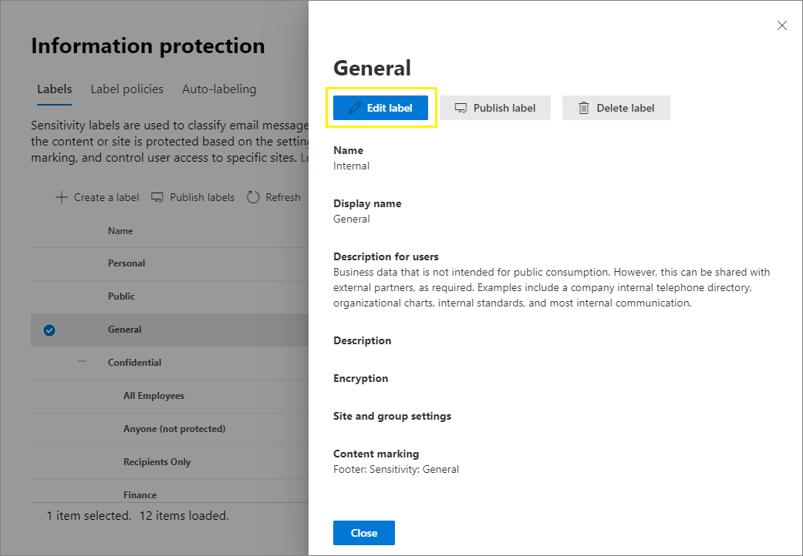

# <a name="create-and-configure-sensitivity-labels-and-their-policies"></a>Creare e configurare etichette di riservatezza e i relativi criteri

>*[Indicazioni per l'assegnazione di licenze di Microsoft 365 per sicurezza e conformità](https://aka.ms/ComplianceSD).*

Tutte le soluzioni di Microsoft Information Protection (MIP) sono implementate utilizzando le [etichette di riservatezza](sensitivity-labels.md). Per creare e pubblicare le etichette, passare all'interfaccia di amministrazione per l’applicazione di etichette, come il [Centro conformità Microsoft 365](https://compliance.microsoft.com/). È anche possibile utilizzare il Centro sicurezza Microsoft 365 o il Centro sicurezza e conformità.

Prima di tutto, creare e configurare le etichette di riservatezza che si vogliono rendere disponibili per le app e gli altri servizi. Ad esempio, le etichette che gli utenti possono vedere e applicare dalle app di Office. 

Quindi, creare uno o più criteri di etichetta contenenti le etichette e le impostazioni dei criteri configurate. È il criterio di etichetta che pubblica le etichette e le impostazioni per gli utenti e i percorsi scelti.

## <a name="before-you-begin"></a>Prima di iniziare

L'amministratore globale dell'organizzazione dispone delle autorizzazioni complete per creare e gestire tutti gli aspetti delle etichette di riservatezza. Se non si esegue l'accesso come amministratore globale, vedere le [autorizzazioni necessarie per creare e gestire etichette di riservatezza](get-started-with-sensitivity-labels.md#permissions-required-to-create-and-manage-sensitivity-labels).

## <a name="create-and-configure-sensitivity-labels"></a>Creare e configurare etichette di riservatezza

1. Nell'interfaccia di amministrazione per l’applicazione di etichette passare alle etichette di riservatezza:
    
    - Centro conformità Microsoft 365: 
        - **Soluzioni** > **Information Protection)**
        
        Se questa opzione non è immediatamente visibile, selezionare prima **Mostra tutto**. 
    
    - Centro sicurezza Microsoft 365: 
        - **Classificazione** > **Etichette di riservatezza**
    
    - Centro sicurezza e conformità:
        - **Classificazione** > **Etichette di riservatezza**

2. Nella pagina **Etichette** selezionare **+ Crea un'etichetta** per avviare la procedura guidata Nuova etichetta di riservatezza. 
    
    Ad esempio, dal Centro conformità Microsoft 365:
    
    
    
    Nota: per impostazione predefinita, i tenant non hanno etichette ed è necessario crearle. Le etichette nell'immagine di esempio sono quelle predefinite di cui è stata eseguita la [migrazione da Azure Information Protection](https://docs.microsoft.com/azure/information-protection/configure-policy-migrate-labels).

3. Nella pagina **Definire l'ambito per questa etichetta**, le opzioni selezionate determinano l'ambito dell'etichetta per le impostazioni che è possibile configurare e dove saranno visibili quando vengono pubblicate:
    
    
    
    - Se viene selezionato **File e messaggi di posta elettronica**, è possibile configurare le impostazioni in questa procedura guidata che si applicano alle app che supportano le etichette di riservatezza, come Office Word e Outlook. Se questa opzione non è selezionata, la procedura guidata mostra la prima pagina delle impostazioni, ma non è possibile configurarle e le etichette non potranno essere selezionate dagli utenti in queste app.
    
    - Se è selezionata l'opzione **Gruppi e siti**, è possibile configurare le impostazioni della procedura guidata che si applicano ai gruppi di Microsoft 365 e ai siti di Teams e di SharePoint. Se questa opzione non è selezionata, la procedura guidata mostra la prima pagina delle impostazioni, ma non è possibile configurarle e le etichette non potranno essere selezionate dagli utenti per gruppi e siti.

4. Seguire le istruzioni della procedura guidata per le impostazioni dell'etichetta.
    
    Per altre informazioni sulle impostazioni delle etichette, vedere [Operazioni eseguibili dalle etichette di riservatezza](sensitivity-labels.md#what-sensitivity-labels-can-do) nelle informazioni di panoramica e usare le indicazioni nella procedura guidata per le singole impostazioni.

5. Ripetere questi passaggi per creare altre etichette. Se invece si vuole creare un'etichetta secondaria, selezionare prima di tutto l'etichetta padre, poi **...** per **Altre azioni**, quindi selezionare **Aggiungi etichetta secondaria**.

6. Una volta create tutte le etichette desiderate, rivedere l'ordine e, se necessario, spostarle verso l'alto o verso il basso. Per modificare l'ordine di un'etichetta selezionare **...** per **Altre azioni**, quindi selezionare **Sposta su** o **Sposta giù**. Per altre informazioni, vedere [Priorità dell'etichetta (l'ordine è importante)](sensitivity-labels.md#label-priority-order-matters) nelle informazioni di panoramica.

Per modificare un'etichetta esistente, selezionarla e quindi selezionare il pulsante **Modifica etichetta**:



Verrà avviata la procedura guidata **Modifica etichetta di riservatezza**, che consente di modificare tutte le impostazioni dell'etichetta descritte al passaggio 4.

Non eliminare un'etichetta se non se ne comprende l'impatto sugli utenti. Per altre informazioni, vedere [Rimozione ed eliminazione di etichette](#removing-and-deleting-labels). 

> [!NOTE]
> Se si modifica un'etichetta che è stata già pubblicata usando un criterio di etichetta, non saranno necessari ulteriori passaggi al completamento della procedura guidata. Ad esempio, non è necessario aggiungerla a un nuovo criterio di etichetta in modo che le modifiche vengano rese disponibili agli stessi utenti. Tuttavia, saranno necessarie fino a 24 ore affinché le modifiche vengano replicate a utenti e servizi.

Finché non verranno pubblicate, le etichette non saranno disponibili per la selezione nelle app o per i servizi. Per pubblicare le etichette è necessario [aggiungerle a un criterio di etichetta](#publish-sensitivity-labels-by-creating-a-label-policy).

> [!IMPORTANT]
> In questa scheda **Etichette** non selezionare la scheda **Pubblica etichette** o il pulsante **Pubblica etichetta** quando si modifica un'etichetta, a meno che non sia necessario creare un nuovo criterio di etichetta. Sono necessari più criteri di etichetta solo se gli utenti hanno bisogno di etichette diverse o impostazioni di criteri diverse. L'obiettivo è avere il minor numero possibile di criteri di etichetta, non è raro averne uno solo per organizzazione.

### <a name="additional-label-settings-with-security--compliance-center-powershell"></a>Impostazioni aggiuntive per le etichette con PowerShell per Centro sicurezza e conformità

Con il cmdlet [Set-Label](https://docs.microsoft.com/powershell/module/exchange/set-label) di [PowerShell per Centro sicurezza e conformità](https://docs.microsoft.com/powershell/exchange/scc-powershell) sono disponibili altre impostazioni delle etichette.

Ad esempio:

- Usare il parametro *LocaleSettings* per le distribuzioni multinazionali, in modo che gli utenti possano visualizzare il nome e la descrizione comando dell'etichetta nella lingua locale. La [sezione seguente](#example-configuration-to-configure-a-sensitivity-label-for-different-languages) include una configurazione di esempio che specifica il nome dell'etichetta e il testo della descrizione comando per le lingue francese, italiano e tedesco.

- Usare il parametro *ApplyContentMarkingFooterFontName* per indicare la scelta del tipo di carattere per il piè di pagina specificato. Calibri è il tipo di carattere predefinito per le intestazioni, i piè di pagina e il testo della filigrana. Se il nome del tipo di carattere alternativo non è disponibile per il servizio o il dispositivo in cui sono visualizzate le etichette, il tipo di carattere torna a essere Calibri.

- Usare il parametro *ApplyContentMarkingHeaderFontColor* per indicare la scelta di colori personalizzata per l'intestazione specificata, usando un codice esadecimale a tre cifre per i componenti rosso, verde e blu (RGB). Ad esempio, #40e0d0 è il valore esadecimale RGB per il turchese. Questi codici sono disponibili in molte applicazioni che consentono di modificare le immagini. Ad esempio, in Microsoft Paint si può scegliere un colore personalizzato da una tavolozza; i valori RGB vengono visualizzati automaticamente ed è possibile copiarli.

Solo per il client di etichettatura unificata di Azure Information Protection, è anche possibile specificare [impostazioni avanzate](https://docs.microsoft.com/azure/information-protection/rms-client/clientv2-admin-guide-customizations), che includono l'impostazione di un colore di etichetta e l'applicazione di una proprietà personalizzata quando viene applicata un'etichetta. Per l'elenco completo, vedere [Impostazioni avanzate disponibili per le etichette](https://docs.microsoft.com/azure/information-protection/rms-client/clientv2-admin-guide-customizations#available-advanced-settings-for-labels) in questa guida per gli amministratori del client.

#### <a name="example-configuration-to-configure-a-sensitivity-label-for-different-languages"></a>Esempio di configurazione per configurare un'etichetta di riservatezza per lingue diverse

L'esempio seguente mostra la configurazione di PowerShell per un'etichetta denominata "Public" con testo segnaposto per la descrizione comando. In questo esempio il nome e il testo della descrizione comando dell'etichetta sono configurati per le lingue francese, italiana e tedesca.

Grazie a questa configurazione, gli utenti di app di Office che usano tali lingue visualizzano i nomi e le descrizioni comando delle etichette nella stessa lingua. Analogamente, se è installato il client di etichettatura unificata di Azure Information Protection per etichettare i file da Esplora file, gli utenti che eseguono tali versioni di Windows visualizzeranno i nomi e le descrizioni comando delle etichette nella propria lingua locale quando accedono alle azioni per l'etichettatura facendo clic con il pulsante destro del mouse.

Per le lingue che è necessario supportare, usare gli [identificatori di lingua](https://docs.microsoft.com/deployoffice/office2016/language-identifiers-and-optionstate-id-values-in-office-2016#language-identifiers) di Office, noti anche come tag lingua, e specificare una traduzione personalizzata per il nome e la descrizione comando dell'etichetta.

Per poter eseguire i comandi di PowerShell, è prima necessario [connettersi a PowerShell per Centro sicurezza e conformità](https://docs.microsoft.com/powershell/exchange/connect-to-scc-powershell).


```powershell
$Languages = @("fr-fr","it-it","de-de")
$DisplayNames=@("Publique","Publico","Oeffentlich")
$Tooltips = @("Texte Français","Testo italiano","Deutscher text")
$label = "Public"
$DisplayNameLocaleSettings = [PSCustomObject]@{LocaleKey='DisplayName';
Settings=@(
@{key=$Languages[0];Value=$DisplayNames[0];}
@{key=$Languages[1];Value=$DisplayNames[1];}
@{key=$Languages[2];Value=$DisplayNames[2];})}
$TooltipLocaleSettings = [PSCustomObject]@{LocaleKey='Tooltip';
Settings=@(
@{key=$Languages[0];Value=$Tooltips[0];}
@{key=$Languages[1];Value=$Tooltips[1];}
@{key=$Languages[2];Value=$Tooltips[2];})}
Set-Label -Identity $Label -LocaleSettings (ConvertTo-Json $DisplayNameLocaleSettings -Depth 3 -Compress),(ConvertTo-Json $TooltipLocaleSettings -Depth 3 -Compress)
```

## <a name="publish-sensitivity-labels-by-creating-a-label-policy"></a>Pubblicare etichette di riservatezza creando un criterio di etichetta

1. Nell'interfaccia di amministrazione per l’applicazione di etichette passare alle etichette di riservatezza:
    
    - Centro conformità Microsoft 365: 
        - **Soluzioni** > **Information Protection)**
        
        Se questa opzione non è immediatamente visibile, selezionare prima **Mostra tutto**. 
    
    - Centro sicurezza Microsoft 365: 
        - **Classificazione** > **Etichette di riservatezza**
    
    - Centro sicurezza e conformità:
        - **Classificazione** > **Etichette di riservatezza**

2. Selezionare la scheda **Criteri etichetta** e quindi **Pubblica etichette** per avviare la creazione guidata criterio:
    
    Ad esempio, dal Centro conformità Microsoft 365:
        
    
    
    Nota: per impostazione predefinita, i tenant non hanno criteri di etichetta ed è necessario crearli. 

3. Nella procedura guidata selezionare **Scegliere le etichette di riservatezza da pubblicare**. Selezionare le etichette che si vogliono rendere disponibili nelle app e per i servizi e quindi selezionare **Aggiungi**.
    
    > [!IMPORTANT]
    > Se si seleziona una etichetta secondaria, accertarsi di selezionare anche l'etichetta padre.
    
4. Rivedere le etichette selezionate e selezionare **Modifica** se si vogliono apportare modifiche. Altrimenti selezionare **Avanti**.

5. Seguire le istruzioni visualizzate per configurare le impostazioni del criterio.
    
    Le impostazioni del criterio che viene visualizzato corrispondono all'ambito delle etichette selezionate. Ad esempio, se sono state selezionate etichette che dispongono unicamente dell'ambito **File e messaggi di posta elettronica**, non vengono visualizzate le impostazioni di criteri **Applica questa etichetta per impostazione predefinita a gruppi e siti** e **Richiedi agli utenti di applicare un'etichetta a gruppi e siti**.
    
    Per altre informazioni su queste impostazioni, vedere [Operazioni eseguibili dai criteri di etichetta](sensitivity-labels.md#what-label-policies-can-do) nelle informazioni di panoramica e usare le indicazioni nella procedura guidata per le singole impostazioni.

7. Ripetere questi passaggi se sono necessarie impostazioni del criterio diverse per utenti o ambiti diversi. Ad esempio, possono essere necessarie altre etichette per un gruppo di utenti oppure un'etichetta predefinita diversa per un sottoinsieme di utenti. In alternativa, se sono state configurate etichette con diversi ambiti.

8. Se si creano più criteri di etichetta che potrebbero comportare un conflitto per un utente, rivedere l'ordine dei criteri e, se necessario, spostarli verso l'alto o verso il basso. Per modificare l'ordine di un criterio di etichetta selezionare **...** per **Altre azioni**, quindi selezionare **Sposta su** o **Sposta giù**. Per altre informazioni, vedere [Priorità dei criteri di etichetta (l'ordine è importante)](sensitivity-labels.md#label-policy-priority-order-matters) nelle informazioni generali.

Completando la procedura guidata, il criterio di etichetta viene pubblicato automaticamente. Per apportare modifiche a un criterio pubblicato, basta modificarlo. Non è necessario selezionare una specifica azione di pubblicazione o ripubblicazione.

Per modificare un criterio di etichetta esistente, selezionarlo e quindi scegliere il pulsante **Modifica criterio**: 


Verrà avviata la procedura guidata **Crea criterio**, che consente di modificare le etichette incluse e le impostazioni dell'etichetta. Una volta completata la procedura guidata, le modifiche vengono replicate automaticamente agli utenti e ai servizi selezionati.

Gli utenti vedono le nuove etichette nelle app di Office entro un'ora. Tuttavia, saranno necessarie fino a 24 ore affinché le modifiche alle etichette esistenti vengano replicate a tutti gli utenti e servizi.

### <a name="additional-label-policy-settings-with-security--compliance-center-powershell"></a>Impostazioni aggiuntive per i criteri delle etichette con PowerShell per Centro sicurezza e conformità

Con il cmdlet [Set-LabelPolicy](https://docs.microsoft.com/powershell/module/exchange/set-labelpolicy) di [PowerShell per Centro sicurezza e conformità](https://docs.microsoft.com/powershell/exchange/scc-powershell) sono disponibili altre impostazioni per i criteri delle etichette.

Solo per il client di etichettatura unificata di Azure Information Protection, è possibile specificare [impostazioni avanzate](https://docs.microsoft.com/azure/information-protection/rms-client/clientv2-admin-guide-customizations) che includono l'impostazione di un'etichetta predefinita diversa per Outlook e l'implementazione di messaggi popup in Outlook che segnalano, giustificano o bloccano l'invio di messaggi di posta elettronica. Per l'elenco completo, vedere [Impostazioni avanzate disponibili per i criteri delle etichette](https://docs.microsoft.com/azure/information-protection/rms-client/clientv2-admin-guide-customizations#available-advanced-settings-for-label-policies) in questa guida per gli amministratori del client.

## <a name="use-powershell-for-sensitivity-labels-and-their-policies"></a>Usare PowerShell per le etichette di riservatezza e i relativi criteri

È ora possibile usare [PowerShell per Centro sicurezza e conformità](https://docs.microsoft.com/powershell/exchange/scc-powershell) per creare e configurare tutte le impostazioni visualizzate nell'interfaccia di amministrazione per l'etichettatura. Questo significa che, oltre a usare PowerShell per le impostazioni che non sono disponibili nelle interfacce di amministrazione per l'etichettatura, ora è possibile gestire completamente tramite la creazione e la manutenzione di etichette di riservatezza e criteri per le etichette di riservatezza. 

Per i parametri e i valori supportati, vedere la documentazione seguente:

- [New-Label](https://docs.microsoft.com/powershell/module/exchange/new-label)
- [New-LabelPolicy](https://docs.microsoft.com/powershell/module/exchange/new-labelpolicy)
- [Set-Label](https://docs.microsoft.com/powershell/module/exchange/set-label)
- [Set-LabelPolicy](https://docs.microsoft.com/powershell/module/exchange/set-labelpolicy)

È anche possibile usare [Remove-Label](https://docs.microsoft.com/powershell/module/exchange/remove-label) e [Remove-LabelPolicy](https://docs.microsoft.com/powershell/module/exchange/remove-labelpolicy) se è necessario creare script per l'eliminazione di etichette di riservatezza o criteri per le etichette di riservatezza. Tuttavia, prima di eliminare le etichette di riservatezza, assicurarsi di leggere la sezione seguente.

## <a name="removing-and-deleting-labels"></a>Rimozione ed eliminazione di etichette

In un ambiente di produzione è improbabile che sia necessario rimuovere le etichette di riservatezza dai criteri di etichetta o eliminare le etichette di riservatezza. È più probabile che sia necessario eseguire una di queste azioni nel corso di una fase di test iniziale. Assicurarsi di comprendere le conseguenze di una di queste azioni.

La rimozione di un'etichetta da un criterio di etichetta è meno rischiosa dell'eliminazione e, se necessario, è sempre possibile riaggiungere l'etichetta a un criterio di etichetta in un secondo momento:

- Quando si rimuove un'etichetta da un criterio di etichetta in modo che l'etichetta non venga più pubblicata per gli utenti specificati in origine, la volta successiva che i criteri di etichetta vengono aggiornati, gli utenti non vedranno più tale etichetta e non potranno selezionarla nell'app di Office. Se, tuttavia, l'etichetta è stata applicata a documenti o messaggi di posta elettronica, non verrà rimossa da tale contenuto. L'eventuale crittografia applicata dall'etichetta rimane invariata e il modello di protezione sottostanti continua a essere pubblicato. 

- Per le etichette rimosse ma che in precedenza sono state applicate al contenuto, gli utenti che usano l'etichettatura predefinita per Word, Excel e PowerPoint, continueranno a vedere il nome dell'etichetta applicata sulla barra di stato. Allo stesso modo, i nomi delle etichette rimosse che sono state applicate a siti di SharePoint continueranno a essere visualizzati nella colonna **Riservatezza**.

Quando invece si elimina un'etichetta:

- Se l'etichetta ha comportato l'applicazione della crittografia, il modello di protezione sottostante viene archiviato in modo che sia ancora possibile aprire il contenuto protetto in precedenza. A causa di questo modello di protezione archiviato, non sarà possibile creare una nuova etichetta con lo stesso nome. Anche se è possibile eliminare un modello di protezione con [PowerShell](https://docs.microsoft.com/powershell/module/aipservice/remove-aipservicetemplate), non farlo, a meno che non si sia certi che non sia necessario aprire contenuto crittografato con il modello archiviato.

- Per le app desktop: le informazioni sull'etichetta presenti nei metadati non vengono eliminate, ma poiché il mapping tra ID etichetta e nome non è più possibile, gli utenti non potranno più visualizzare il nome dell'etichetta applicata, ad esempio sulla barra di stato, di conseguenza presupporranno che il contenuto non sia etichettato. Se l'etichetta ha comportato l'applicazione della crittografia, la crittografia non viene rimossa e all'apertura del contenuto gli utenti potranno ancora visualizzare il nome e la descrizione del modello di protezione ora archiviato.

- Per Office sul Web: gli utenti non possono visualizzare il nome dell'etichetta sulla barra di stato o nella colonna **Riservatezza**. Le informazioni sull'etichetta presenti nei metadati rimangono valide solo se l'etichetta non comportato l'applicazione della crittografia. Se l'etichetta ha comportato l'applicazione della crittografia e sono state abilitate [etichette di riservatezza per SharePoint e OneDrive](sensitivity-labels-sharepoint-onedrive-files.md), le informazioni sull'etichetta presenti nei metadati vengono rimosse, così come la crittografia. 

Quando si rimuove un'etichetta di riservatezza da un criterio di etichetta o si elimina un'etichetta di riservatezza, la replica di queste modifiche a tutti gli utenti e i servizi può richiedere fino a un'ora.

## <a name="next-steps"></a>Passaggi successivi

Per configurare e usare le etichette di riservatezza per scenari specifici, vedere gli articoli seguenti:

- [Limitare l'accesso al contenuto utilizzando la crittografia nelle etichette di riservatezza](encryption-sensitivity-labels.md)

- [Applicare automaticamente un'etichetta di riservatezza al contenuto](apply-sensitivity-label-automatically.md)

- [Usare etichette di riservatezza con team, gruppi e siti](sensitivity-labels-teams-groups-sites.md)

- [Abilitare le etichette di riservatezza per i file di Office in SharePoint e OneDrive](sensitivity-labels-sharepoint-onedrive-files.md)

Per monitorare il modo in cui vengono usate le etichette, vedere [Visualizzare l'utilizzo delle etichette con Analisi delle etichette](label-analytics.md).
