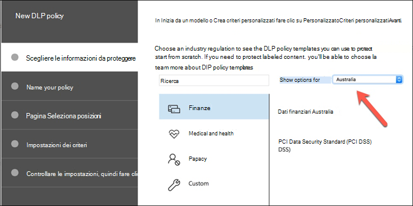
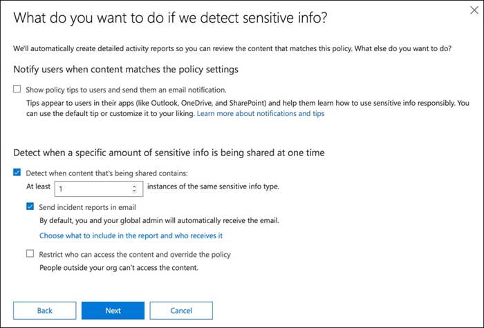
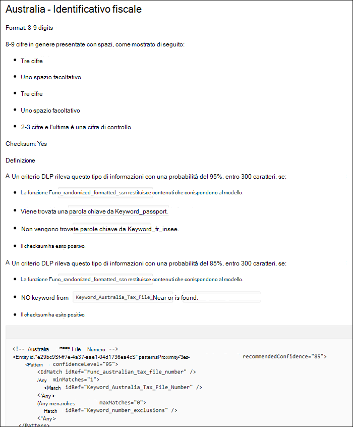
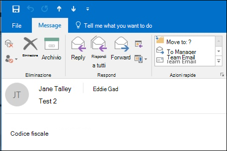
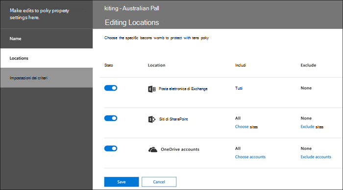
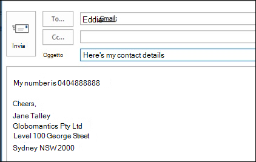
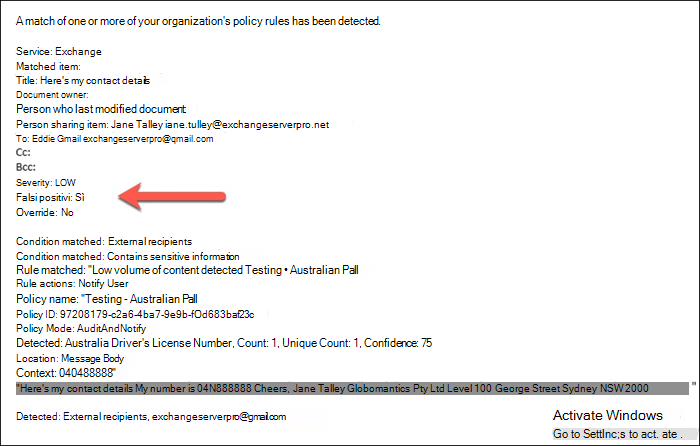
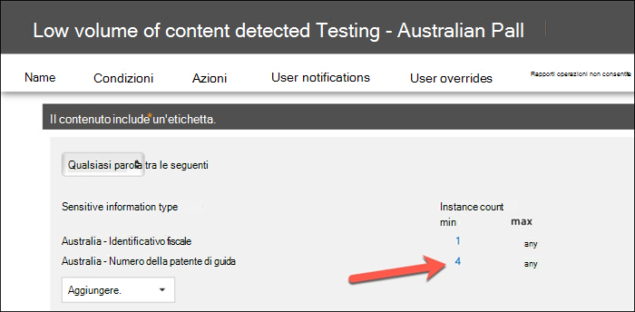
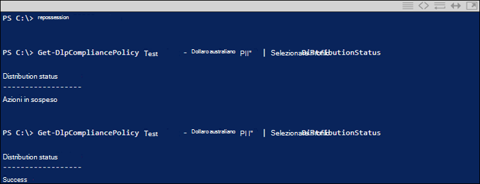

# Creare, testare e ottimizzare i criteri di prevenzione della perdita dei dati

La prevenzione della perdita dei dati (DLP) consente di impedire la condivisione involontaria o accidentale di informazioni riservate.

DLP esamina i messaggi di posta elettronica e i file per le informazioni riservate, ad esempio un numero di carta di credito. Utilizzando DLP è possibile rilevare informazioni riservate ed eseguire azioni quali:

- Registrare l'evento a scopo di controllo
- Visualizzare un avviso all'utente finale che invia il messaggio di posta elettronica o condivide il file
- Bloccare attivamente la condivisione di file o di posta elettronica

## Autorizzazioni

I membri del team conformità addetti alla creazione dei criteri DLP necessitano delle autorizzazioni per accedere al Centro conformità. Per impostazione predefinita, l'amministratore tenant potrà concedere l'accesso ai responsabili della conformità e ad altre persone. Eseguire la procedura seguente:
  
1. Creare un gruppo in Microsoft 365 e aggiungervi i responsabili della conformità.
    
2. Creare un gruppo di ruoli nella pagina **Autorizzazioni** del Centro sicurezza e conformità. 

3. Durante la creazione del gruppo di ruoli, utilizzare la **sezione Choose Roles** per aggiungere il ruolo seguente al gruppo di ruoli: DLP Compliance **Management**.
    
4. Usare la sezione **Scegli membri** per aggiungere il gruppo di Microsoft 365 creato in precedenza al gruppo di ruoli.

Utilizzare il **ruolo Gestione conformità DLP** di sola visualizzazione per creare un gruppo di ruoli con privilegi di sola visualizzazione per i criteri DLP e i report DLP.

Per altre informazioni, vedere [Concedere agli utenti l'accesso al Centro conformità di Office 365](../security/office-365-security/grant-access-to-the-security-and-compliance-center.md).
  
Queste autorizzazioni sono necessarie per creare e applicare un criterio DLP per non applicare i criteri.

## Come vengono rilevate le informazioni riservate dalla prevenzione della perdita dei dati

DLP trova le informazioni riservate in base alla corrispondenza dei criteri di espressione regolare (RegEx), in combinazione con altri indicatori, ad esempio la prossimità di determinate parole chiave ai modelli di corrispondenza. Ad esempio, un numero di carta di credito VISA ha 16 cifre. Tuttavia, tali cifre possono essere scritte in modi diversi, ad esempio 1111-1111-1111-1111, 1111 1111 1111 1111 o 111111111111111111111111111.

Qualsiasi stringa di 16 cifre non è necessariamente un numero di carta di credito, può essere un numero di ticket di un sistema help desk o un numero seriale di un componente hardware. Per distinguere la differenza tra un numero di carta di credito e una stringa di 16 cifre innocua, viene eseguito un calcolo (checksum) per verificare che i numeri corrispondano a uno schema noto delle varie marche di carte di credito.

Se DLP trova parole chiave come "VISA" o "AMEX", vicino ai valori di data che potrebbero essere la data di scadenza della carta di credito, DLP utilizza anche tali dati per decidere se la stringa è un numero di carta di credito o meno.

In altre parole, DLP è abbastanza intelligente da riconoscere la differenza tra queste due stringhe di testo in un messaggio di posta elettronica:

- "Puoi ordinarmi un nuovo portatile. Usa il mio numero visa 1111-1111-1111-1111, scade il 22/11 e inviami la data di consegna stimata quando lo hai."
- "Il numero di serie del portatile è 2222-2222-2222-2222 ed è stato acquistato l'11/11/2010. A proposito, il mio visto di viaggio è ancora approvato?"

Vedere [Definizioni di entità del tipo di](sensitive-information-type-entity-definitions.md) informazioni riservate che spiegano come viene rilevato ogni tipo di informazioni.

## Da dove iniziare con la prevenzione della perdita di dati

Quando i rischi di perdita dei dati non sono del tutto ovvi, è difficile capire da dove iniziare esattamente con l'implementazione della prevenzione della perdita dei dati. Fortunatamente, i criteri DLP possono essere eseguiti in "modalità di test", consentendo di valutarne l'efficacia e l'accuratezza prima di attivarli.

I criteri DLP per Exchange Online possono essere gestiti tramite l'interfaccia di amministrazione di Exchange. Tuttavia, è possibile configurare i criteri DLP per tutti i carichi di lavoro tramite il Centro sicurezza & conformità, quindi questo è ciò che verrà utilizzato per le dimostrazioni in questo articolo. Nel Centro sicurezza & conformità, i criteri DLP sono presenti in Criteri di prevenzione **della perdita dei**  >  **dati**. Scegliere **Crea un criterio** da avviare.

Microsoft 365 offre un'ampia gamma di [modelli di](what-the-dlp-policy-templates-include.md) criteri DLP che è possibile utilizzare per creare criteri. Supponiamo che tu sia un'azienda australiana. Puoi filtrare i modelli in Australia e scegliere Financial, Medical and Health e Privacy.

Per questa dimostrazione sceglierò Dati personali australiani, che includono i tipi di informazioni del codice fiscale australiano (TFN) e del numero di patente di guida.

Assegnare un nome al nuovo criterio DLP. Il nome predefinito corrisponderà al modello di criteri DLP, ma è consigliabile scegliere un nome più descrittivo, perché è possibile creare più criteri dallo stesso modello.

Scegliere le posizioni a cui verrà applicato il criterio. I criteri DLP possono essere applicati a Exchange Online, SharePoint Online e OneDrive for Business. Lascerò questo criterio configurato per l'applicazione a tutte le posizioni.

Al primo passaggio **Impostazioni criteri,** accetta solo le impostazioni predefinite per il momento. È possibile personalizzare i criteri DLP, ma le impostazioni predefinite sono un ottimo punto di partenza.

Dopo aver fatto clic su Avanti,** verrà visualizzata una **pagina** impostazioni dei criteri aggiuntiva con altre opzioni di personalizzazione. Per un criterio che si sta solo testando, ecco dove è possibile iniziare a apportare alcune modifiche.

- I've turned off policy tips for now, which is a reasonable step to take if you're just testing things out and don't want to display anything to users yet. I suggerimenti per i criteri visualizzano avvisi agli utenti che stanno per violare un criterio DLP. Ad esempio, un utente di Outlook visualizza un avviso che indica che il file allegato contiene numeri di carta di credito e causerà il rifiuto della posta elettronica. L'obiettivo dei suggerimenti per i criteri è arrestare il comportamento non conforme prima che si verifica.
- Ho anche ridotto il numero di istanze da 10 a 1, in modo che questo criterio rilevi qualsiasi condivisione dei dati delle informazioni personali australiane, non solo la condivisione in blocco dei dati.
- Ho anche aggiunto un altro destinatario all'e-mail di segnalazione degli eventi imprevisti.

Infine, ho configurato questo criterio per l'esecuzione in modalità test inizialmente. Si noti che è disponibile anche un'opzione per disabilitare i suggerimenti per i criteri in modalità test. In questo modo puoi avere la flessibilità di avere i suggerimenti per i criteri abilitati nel criterio, ma decidi se mostrarli o sopprimerli durante il test.

Nella schermata di revisione finale fai clic **su Crea** per completare la creazione del criterio.

## Testare un criterio DLP

Il nuovo criterio DLP inizierà a essere attivo entro circa 1 ora. Puoi sederti e attendere che sia attivato da una normale attività dell'utente oppure puoi provare a attivarlo da solo. In precedenza ho collegato [alle definizioni di](sensitive-information-type-entity-definitions.md)entità del tipo di informazioni riservate , che fornisce informazioni su come attivare le corrispondenze DLP.

Ad esempio, il criterio DLP creato per questo articolo rileverà i numeri di file fiscali australiani (TFN). In base alla documentazione, la corrispondenza si basa sui criteri seguenti.

 
Per dimostrare il rilevamento TFN in modo piuttosto smussato, un messaggio di posta elettronica con le parole "Tax file number" e una stringa di 9 cifre in prossimità verrà inviato senza problemi. Il motivo per cui non attiva il criterio DLP è che la stringa a 9 cifre deve superare il checksum che indica che è un valore TFN valido e non solo una stringa innocua di numeri.

In confronto, un messaggio di posta elettronica con le parole "Tax file number" e un valore TFN valido che supera il checksum attiverà il criterio. Per il record qui, il TFN in uso è stato preso da un sito Web che genera TFN validi, ma non originali. Tali siti sono molto utili perché uno degli errori più comuni durante il test di un criterio DLP è l'utilizzo di un numero falso non valido e non supererà il checksum (e pertanto non attiverà il criterio).

Il messaggio di posta elettronica del rapporto operazioni non consentite include il tipo di informazioni riservate rilevate, il numero di istanze rilevate e il livello di probabilità del rilevamento.

Se si lascia il criterio DLP in modalità di test e si analizzano i messaggi di posta elettronica del rapporto operazioni non consentite, è possibile iniziare a capire l'accuratezza del criterio DLP e la sua efficacia quando viene applicato. Oltre ai report operazioni non consentite, è possibile utilizzare i report [DLP](view-the-dlp-reports.md) per visualizzare una visualizzazione aggregata delle corrispondenze dei criteri nel tenant.

## Ottimizzare un criterio DLP

Durante l'analisi dei risultati dei criteri, potrebbe essere necessario apportare alcune modifiche al comportamento dei criteri. Come esempio semplice, è possibile determinare che un TFN nella posta elettronica non è un problema (lo è ancora, ma passiamo con esso per motivi di dimostrazione), ma due o più istanze sono un problema. Più istanze potrebbero essere uno scenario rischioso, ad esempio un dipendente che invia tramite posta elettronica un'esportazione CSV dal database delle risorse umane a una parte esterna, ad esempio un servizio contabile esterno. Sicuramente qualcosa che preferisci rilevare e bloccare.

Nel Centro sicurezza & conformità è possibile modificare un criterio esistente per modificare il comportamento.

 
È possibile modificare le impostazioni della posizione in modo che il criterio sia applicato solo a carichi di lavoro specifici o a siti e account specifici.

È inoltre possibile modificare le impostazioni dei criteri e modificare le regole in base alle proprie esigenze.

Quando si modifica una regola all'interno di un criterio DLP, è possibile modificare:

- Condizioni, inclusi il tipo e il numero di istanze di dati sensibili che attiveranno la regola.
- Azioni intraprese, ad esempio la limitazione dell'accesso al contenuto.
- Notifiche utente, ovvero suggerimenti per i criteri visualizzati all'utente nel client di posta elettronica o nel Web browser.
- Sostituzioni utente, che determina se gli utenti possono scegliere di procedere comunque con la posta elettronica o la condivisione di file.
- Report operazioni non consentite, per informare gli amministratori.

Per questa dimostrazione ho aggiunto le notifiche degli utenti al criterio (fare attenzione a farlo senza una formazione adeguata sulla sensibilizzazione degli utenti) e ho consentito agli utenti di ignorare il criterio con una giustificazione aziendale o contrassegnarlo come falso positivo. Si noti che è anche possibile personalizzare il testo del suggerimento per la posta elettronica e il criterio se si desidera includere ulteriori informazioni sui criteri dell'organizzazione o chiedere agli utenti di contattare il supporto in caso di domande.

Il criterio contiene due regole per la gestione del volume elevato e del volume basso, quindi assicurati di modificarle entrambe con le azioni desiderate. Questa è un'opportunità per trattare i casi in modo diverso a seconda delle loro caratteristiche. Ad esempio, potresti consentire sostituzioni per violazioni di volume basso, ma non consentire sostituzioni per violazioni di volume elevato.

Inoltre, se si desidera bloccare o limitare effettivamente l'accesso al contenuto che viola i criteri, è necessario configurare un'azione per la regola a tale scopo.

Dopo aver salvato le modifiche alle impostazioni dei criteri, è inoltre necessario tornare alla pagina delle impostazioni principale per il criterio e abilitare l'opzione per visualizzare i suggerimenti per i criteri per gli utenti mentre il criterio è in modalità test. Si tratta di un modo efficace per introdurre i criteri DLP agli utenti finali e per formare la sensibilizzazione degli utenti, senza rischiare troppi falsi positivi che influiscono sulla produttività.

Sul lato server (o sul lato cloud, se si preferisce), la modifica potrebbe non essere immediatamente effettiva a causa di vari intervalli di elaborazione. Se si sta apportando una modifica ai criteri DLP che visualizza nuovi suggerimenti per i criteri a un utente, è possibile che l'utente non veda immediatamente le modifiche nel client Outlook, verificando la presenza di modifiche dei criteri ogni 24 ore. Se si desidera velocizzare i test, è possibile utilizzare questa correzione del Registro di sistema per cancellare l'indicatore dell'ora dell'ultimo [download dalla chiave PolicyNudges](https://support.microsoft.com/en-au/help/2823261/changes-to-a-data-loss-prevention-policy-don-t-take-effect-in-outlook?__hstc=18650278.46377037dc0a82baa8a30f0ef07a7b2f.1538687978676.1538693509953.1540315763430.3&__hssc=18650278.1.1540315763430&__hsfp=3446956451). Outlook scariderà le informazioni più recenti sui criteri al successivo riavvio e inizierà a comporre un messaggio di posta elettronica.

Se sono abilitati suggerimenti per i criteri, l'utente inizierà a visualizzare i suggerimenti in Outlook e potrà segnalare falsi positivi quando si verificano.

## Analizzare i falsi positivi

I modelli di criteri DLP non sono perfetti. È probabile che si verifichino alcuni falsi positivi nell'ambiente, motivo per cui è così importante semplificare la distribuzione dlp, prendendo il tempo necessario per testare e ottimizzare adeguatamente i criteri.

Ecco un esempio di falso positivo. Questo messaggio di posta elettronica è abbastanza innocuo. L'utente fornisce il proprio numero di cellulare a un utente e include la firma di posta elettronica.

 
Ma l'utente vede un suggerimento per i criteri che avvisa che il messaggio di posta elettronica contiene informazioni riservate, in particolare un numero di patente di guida australiana.

L'utente può segnalare il falso positivo e l'amministratore può esaminare il motivo per cui si è verificato. Nel messaggio di posta elettronica del rapporto operazioni non consentite il messaggio viene contrassegnato come falso positivo.

Questo caso di patente di guida è un buon esempio da vedere. Il motivo per cui si è verificato questo falso positivo è che il tipo "Australian Driver's License" verrà attivato da qualsiasi stringa di 9 cifre (anche una che fa parte di una stringa di 10 cifre), entro 300 caratteri in prossimità delle parole chiave "sydney nsw" (senza distinzione tra maiuscole e minuscole). Quindi viene attivato dal numero di telefono e dalla firma di posta elettronica, solo perché l'utente si verifica a Sydney.

Un'opzione è quella di rimuovere il tipo di informazioni sulla patente di guida australiana dal criterio. È presente perché fa parte del modello di criteri DLP, ma non è forzato a usarlo. Se sei interessato solo ai numeri di file fiscali e non alle licenze di guida, puoi semplicemente rimuoverlo. Ad esempio, è possibile rimuoverlo dalla regola di volume basso nel criterio, ma lasciarlo nella regola di volume elevato in modo che gli elenchi di licenze di più driver siano ancora rilevati.

 
Un'altra opzione è semplicemente aumentare il numero di istanze, in modo che un volume basso di licenze del driver viene rilevato solo quando sono presenti più istanze.

Oltre a modificare il numero di istanze, puoi anche modificare l'accuratezza della corrispondenza (o il livello di confidenza). Se il tipo di informazioni riservate include più modelli, è possibile modificare l'accuratezza della corrispondenza nella regola, in modo che la regola corrisponda solo a modelli specifici. Ad esempio, per ridurre i falsi positivi, puoi impostare l'accuratezza della corrispondenza della regola in modo che corrisponda solo al modello con il livello di probabilità più alto. Comprendere come viene calcolato il livello di confidenza è un po' complicato (e oltre l'ambito di questo post), ma ecco una buona spiegazione di come usare il livello di confidenza per ottimizzare [le regole.](data-loss-prevention-policies.md#match-accuracy)

Infine, se si desidera ottenere anche un po' più avanzato, è possibile personalizzare qualsiasi tipo di informazione sensibile, ad esempio è possibile rimuovere "Sydney NSW" [dall'elenco](sensitive-information-type-entity-definitions.md#australia-drivers-license-number)delle parole chiave per il numero di patente di guida australiana, per eliminare il falso positivo attivato in precedenza. Per informazioni su come eseguire questa operazione utilizzando XML e PowerShell, vedere personalizzazione di un tipo di informazioni [riservate predefinito.](customize-a-built-in-sensitive-information-type.md)

## Attivare un criterio DLP

Quando si è soddisfatti che il criterio DLP rilevi in modo accurato ed efficace i tipi di informazioni riservate e che gli utenti finali siano pronti a gestire i criteri in essere, è possibile abilitare il criterio.

 
Se si è in attesa di vedere quando il criterio avrà effetto, connettersi & Centro sicurezza e conformità [PowerShell](/powershell/exchange/connect-to-scc-powershell) ed eseguire il [cmdlet Get-DlpCompliancePolicy](/powershell/module/exchange/get-dlpcompliancepolicy) per visualizzare DistributionStatus.

Dopo aver attivato il criterio DLP, è consigliabile eseguire alcuni test finali per assicurarsi che si verifichino le azioni previste per i criteri. Se si sta tentando di testare elementi come i dati della carta di credito, sono disponibili siti Web online con informazioni su come generare una carta di credito di esempio o altre informazioni personali che supereranno i checksum e attiveranno i criteri.

I criteri che consentono le sostituzioni utente presenteranno tale opzione all'utente come parte del suggerimento per i criteri.

I criteri che limitano il contenuto presenteranno l'avviso all'utente come parte del suggerimento per i criteri e impediranno loro di inviare il messaggio di posta elettronica.

## Riepilogo

I criteri di prevenzione della perdita dei dati sono utili per organizzazioni di tutti i tipi. Il test di alcuni criteri DLP è un esercizio a basso rischio a causa del controllo che si ha su elementi come suggerimenti per i criteri, sostituzioni degli utenti finali e report operazioni non consentite. È possibile testare in modo silenzioso alcuni criteri DLP per vedere il tipo di violazioni già in corso nell'organizzazione e quindi creare criteri con bassi tassi di falsi positivi, informare gli utenti su ciò che è consentito e non consentito e quindi implementare i criteri DLP all'organizzazione.