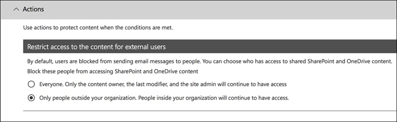

# Creare, testare e ottimizzare i criteri di prevenzione della perdita dei datiCreate, test, and tune a DLP policy

La prevenzione della perdita di dati (DLP) consente di prevenire la condivisione involontaria o accidentale di informazioni riservate.Data loss prevention (DLP) helps you prevent the unintentional or accidental sharing of sensitive information.

DLP esamina i messaggi di posta elettronica e i file alla ricerca di informazioni riservate, ad esempio un numero di carta di credito.DLP examines email messages and files for sensitive information, like a credit card number. Utilizzando DLP è possibile rilevare informazioni riservate e intraprendere azioni quali:Using DLP you can detect sensitive information, and take action such as:

- Registrare l'evento a scopo di controlloLog the event for auditing purposes
- Visualizzare un avviso all'utente finale che invia l'e-mail o condivide il fileDisplay a warning to the end user who is sending the email or sharing the file
- Bloccare attivamente l'invio di e-mail o condivisione fileActively block the email or file sharing from taking place

## AutorizzazioniPermissions

I membri del team conformità addetti alla creazione dei criteri DLP necessitano delle autorizzazioni per accedere al Centro conformità.Members of your compliance team who will create DLP policies need permissions to the Compliance Center. Per impostazione predefinita, l'amministratore del tenant avrà accesso può concedere ai responsabili della conformità e ad altre persone l'accesso.By default, your tenant admin will have access can give compliance officers and other people access. Eseguire la procedura seguente:Follow these steps:
  
1. Creare un gruppo in Microsoft 365 e aggiungervi i responsabili della conformità.Create a group in Microsoft 365 and add compliance officers to it.
    
2. Creare un gruppo di ruoli nella pagina **Autorizzazioni** del Centro sicurezza e conformità.Create a role group on the **Permissions** page of the Security &amp; Compliance Center. 

3. Durante la creazione del gruppo di ruoli, utilizzare **la sezione** Scegli ruoli per aggiungere il ruolo seguente al gruppo di ruoli: Gestione **conformità DLP**.While creating the role group, use the **Choose Roles** section to add the following role to the role group: **DLP Compliance Management**.
    
4. Usare la sezione **Scegli membri** per aggiungere il gruppo di Microsoft 365 creato in precedenza al gruppo di ruoli.Use the **Choose Members** section to add the Microsoft 365 group you created before to the role group.

Utilizzare il **ruolo Gestione conformità DLP solo visualizzazione** per creare un gruppo di ruoli con privilegi di sola visualizzazione per i criteri DLP e i report DLP.Use the **View-Only DLP Compliance Management** role to create role group with view-only privileges to the DLP policies and DLP reports.

Per altre informazioni, vedere [Concedere agli utenti l'accesso al Centro conformità di Office 365](../security/office-365-security/grant-access-to-the-security-and-compliance-center.md).For more information, see [Give users access to the Office 365 Compliance Center](../security/office-365-security/grant-access-to-the-security-and-compliance-center.md).
  
Queste autorizzazioni sono necessarie per creare e applicare un criterio DLP per non applicare i criteri.These permissions are required to create and apply a DLP policy not to enforce policies.

## Come vengono rilevate le informazioni riservate da DLPHow sensitive information is detected by DLP

DLP trova informazioni riservate in base alla corrispondenza dei modelli regex (Regular Expression), in combinazione con altri indicatori, ad esempio la vicinanza di determinate parole chiave ai modelli corrispondenti.DLP finds sensitive information by regular expression (RegEx) pattern matching, in combination with other indicators such as the proximity of certain keywords to the matching patterns. Ad esempio, un numero di carta di credito VISA ha 16 cifre.For example, a VISA credit card number has 16 digits. Tuttavia, queste cifre possono essere scritte in modi diversi, come 1111-1111-1111-1111, 1111 1111 1111 1111 o 1111111111111111111111.But, those digits can be written in different ways, such as 1111-1111-1111-1111, 1111 1111 1111 1111, or 1111111111111111.

Qualsiasi stringa di 16 cifre non è necessariamente un numero di carta di credito, potrebbe essere un numero di biglietto da un sistema di help desk o un numero di serie di un pezzo di hardware.Any 16-digit string is not necessarily a credit card number, it could be a ticket number from a help desk system, or a serial number of a piece of hardware. Per distinguere tra un numero di carta di credito e una stringa innocua di 16 cifre, viene eseguito un calcolo (checksum) per confermare che i numeri corrispondono a un modello noto dei vari marchi di carte di credito.To tell the difference between a credit card number and a harmless 16-digit string, a calculation is performed (checksum) to confirm that the numbers match a known pattern from the various credit card brands.

Se DLP trova parole chiave come "VISA" o "AMEX", valori di data vicina che potrebbero essere la data di scadenza della carta di credito, DLP utilizza anche tali dati per aiutarlo a decidere se la stringa è un numero di carta di credito o meno.If DLP finds keywords such as "VISA" or "AMEX", near date values that might be the credit card expiry date, DLP also uses that data to help it decide whether the string is a credit card number or not.

In altre parole, DLP è abbastanza intelligente da riconoscere la differenza tra queste due stringhe di testo in un'e-mail:In other words, DLP is smart enough to recognize the difference between these two strings of text in an email:

- "Puoi ordinarmi un nuovo laptop."Can you order me a new laptop. Usa il mio numero VISA 1111-1111-1111-1111, scadenza 11/22, e inviami la data di consegna stimata quando lo hai."Use my VISA number 1111-1111-1111-1111, expiry 11/22, and send me the estimated delivery date when you have it."
- "Il mio numero di serie del laptop è 2222-2222-2222-2222 ed è stato acquistato l'11/2010."My laptop serial number is 2222-2222-2222-2222 and it was purchased on 11/2010. A proposito, il mio visto di viaggio è ancora approvato?By the way, is my travel visa approved yet?"

Vedere [Definizioni di entità del tipo di informazioni](sensitive-information-type-entity-definitions.md) riservate che spiegano come viene rilevato ogni tipo di informazione.See [Sensitive information type entity definitions](sensitive-information-type-entity-definitions.md) that explains how each information type is detected.

## Da dove iniziare con la prevenzione della perdita di datiWhere to start with data loss prevention

Quando i rischi di perdita di dati non sono del tutto evidenti, è difficile capire da dove esattamente dovresti iniziare con l'implementazione di DLP.When the risks of data leakage aren't entirely obvious, it's difficult to work out where exactly you should start with implementing DLP. Fortunatamente, i criteri DLP possono essere eseguiti in "modalità test", consentendo di valutarne l'efficacia e l'accuratezza prima di accenderli.Fortunately, DLP policies can be run in "test mode", allowing you to gauge their effectiveness and accuracy before you turn them on.

I criteri DLP per Exchange Online possono essere gestiti tramite l'interfaccia Exchange'interfaccia di amministrazione.DLP policies for Exchange Online can be managed through the Exchange admin center. Tuttavia, è possibile configurare i criteri DLP per tutti i carichi di lavoro tramite il Centro conformità & sicurezza, in modo che sia quello che userò per le dimostrazioni in questo articolo.But you can configure DLP policies for all workloads through the Security & Compliance Center, so that's what I'll use for demonstrations in this article. Nel Centro conformità & sicurezza sono disponibili i criteri DLP in Criteri di **prevenzione della perdita di**  >  **dati**.In the Security & Compliance Center, you'll find the DLP policies under **Data loss prevention** > **Policy**. Scegliere **Crea criteri per** iniziare.Choose **Create a policy** to start.

Microsoft 365 fornisce una gamma di modelli [di criteri DLP](what-the-dlp-policy-templates-include.md) che è possibile utilizzare per creare criteri.Microsoft 365 provides a range of [DLP policy templates](what-the-dlp-policy-templates-include.md) you can use to create policies. Diciamo che sei un'azienda australiana.Let's say that you're an Australian business. È possibile filtrare i modelli in Australia e scegliere Finanziario, Medico e Salute e Privacy.You can filter the templates on Australia, and choose Financial, Medical and Health, and Privacy.

Per questa dimostrazione sceglierò i dati PII (Australian PersonalLy Identifiable Information), che includono i tipi di informazioni del numero di file fiscale australiano (TFN) e del numero di patente di guida.For this demonstration I'll choose Australian Personally Identifiable Information (PII) Data, which includes the information types of Australian Tax File Number (TFN) and Driver's License Number.

Assegnare un nome al nuovo criterio DLP.Give your new DLP policy a name. Il nome predefinito corrisponderà al modello di criteri DLP, ma è necessario scegliere un nome più descrittivo, perché è possibile creare più criteri dallo stesso modello.The default name will match the DLP policy template, but you should choose a more descriptive name of your own, because multiple policies can be created from the same template.

Scegliere i percorsi a cui verrà applicato il criterio.Choose the locations that the policy will apply to. I criteri DLP possono essere applicati a Exchange Online, SharePoint Online e OneDrive for Business.DLP policies can apply to Exchange Online, SharePoint Online, and OneDrive for Business. Lascerò questo criterio configurato per l'applicazione a tutte le posizioni.I am going to leave this policy configured to apply to all locations.

Al primo passaggio **del Impostazioni,** per il momento, accettare le impostazioni predefinite.At the first **Policy Settings** step, just accept the defaults for now. È possibile personalizzare i criteri DLP, ma le impostazioni predefinite sono un ottimo punto di partenza.You can customize DLP policies, but the defaults are a fine place to start.

Dopo aver fatto clic su Avanti,\*\* verrà presentata una pagina di **ricerca Impostazioni** con altre opzioni di personalizzazione.After clicking Next,\*\* you'll be presented with an more **Policy Settings** page with more customization options. Per un criterio che stai solo testando, ecco dove puoi iniziare ad apportare alcune modifiche.For a policy that you are just testing, here's where you can start to make some adjustments.

- Ho disattivato i suggerimenti sui criteri per ora, il che è un passo ragionevole da fare se stai solo testando le cose e non vuoi ancora mostrare nulla agli utenti.I've turned off policy tips for now, which is a reasonable step to take if you're just testing things out and don't want to display anything to users yet. I suggerimenti per i criteri visualizzano avvisi agli utenti che stanno per violare un criterio DLP.Policy tips display warnings to users that they're about to violate a DLP policy. Ad esempio, un utente Outlook vedrà un avviso che il file che ha allegato contiene numeri di carta di credito e causerà il rifiuto della posta elettronica.For example, an Outlook user will see a warning that the file they've attached contains credit card numbers and will cause their email to be rejected. L'obiettivo dei suggerimenti per i criteri è arrestare il comportamento non conforme prima che si verifica.The goal of policy tips is to stop the non-compliant behavior before it happens.
- Ho anche ridotto il numero di istanze da 10 a 1, in modo che questa politica rilevi qualsiasi condivisione dei dati PII australiani, non solo la condivisione in blocco dei dati.I've also decreased the number of instances from 10 to 1, so that this policy will detect any sharing of Australian PII data, not just bulk sharing of the data.
- Ho anche aggiunto un altro destinatario all'e-mail del rapporto sugli incidenti.I've also added another recipient to the incident report email.

Infine, inizialmente ho configurato questo criterio per l'esecuzione in modalità test.Finally, I've configured this policy to run in test mode initially. Si noti che c'è anche un'opzione qui per disabilitare i suggerimenti sui criteri mentre si è in modalità di test.Notice there's also an option here to disable policy tips while in test mode. In questo modo è possibile ottenere la flessibilità necessaria per abilitare i suggerimenti sui criteri nei criteri, ma quindi decidere se mostrarli o sopprimerli durante il test.This gives you the flexibility to have policy tips enabled in the policy, but then decide whether to show or suppress them during your testing.

Nella schermata di revisione finale fare clic su **Crea per** completare la creazione del criterio.On the final review screen, click **Create** to finish creating the policy.

## Testare un criterio DLPTest a DLP policy

Il nuovo criterio DLP inizierà ad avere effetto entro circa 1 ora.Your new DLP policy will begin to take effect within about 1 hour. Puoi sederti e aspettare che venga attivato dalla normale attività dell'utente, oppure puoi provare a attivarlo da solo.You can sit and wait for it to be triggered by normal user activity, or you can try to trigger it yourself. In precedenza ho collegato [alle definizioni di entità del tipo](sensitive-information-type-entity-definitions.md)di informazioni riservate , che fornisce informazioni su come attivare le corrispondenze DLP.Earlier I linked to [Sensitive information type entity definitions](sensitive-information-type-entity-definitions.md), which provides you with information about how to trigger DLP matches.

Ad esempio, il criterio DLP creato per questo articolo rileverà i numeri di file fiscali australiani (TFN).As an example, the DLP policy I created for this article will detect Australian tax file numbers (TFN). Secondo la documentazione, la corrispondenza si basa sui seguenti criteri.According to the documentation, the match is based on the following criteria.

 
Per dimostrare il rilevamento TFN in modo piuttosto smussato, un'e-mail con le parole "Numero di file fiscale" e una stringa di nove cifre nelle immediate vicinanze navigherà senza problemi.To demonstrate TFN detection in a rather blunt manner, an email with the words "Tax file number" and a nine digit string in close proximity will sail through without any issues. Il motivo per cui non attiva il criterio DLP è che la stringa a nove cifre deve passare il checksum che indica che si tratta di un TFN valido e non solo di una stringa innocua di numeri.The reason it does not trigger the DLP policy is that the nine digit string must pass the checksum that indicates it is a valid TFN and not just a harmless string of numbers.

In confronto, un'e-mail con le parole "Tax file number" e un TFN valido che supera il checksum attiverà il criterio.In comparison, an email with the words "Tax file number" and a valid TFN that passes the checksum will trigger the policy. Per la registrazione qui, il TFN che sto usando è stato preso da un sito Web che genera TFN validi, ma non autentici.For the record here, the TFN I'm using was taken from a website that generates valid, but not genuine, TFNs. Tali siti sono utili perché uno degli errori più comuni durante il test di un criterio DLP è l'utilizzo di un numero falso che non è valido e non supererà il checksum (e quindi non attiverà il criterio).Such sites are useful because one of the most common mistakes when testing a DLP policy is using a fake number that's not valid and won't pass the checksum (and therefore won't trigger the policy).

Il messaggio di posta elettronica del report sugli incidenti include il tipo di informazioni riservate rilevate, il numero di istanze rilevate e il livello di confidenza del rilevamento.The incident report email includes the type of sensitive information that was detected, how many instances were detected, and the confidence level of the detection.

Se si lascia il criterio DLP in modalità test e si analizzano i messaggi di posta elettronica del rapporto sugli incidenti, è possibile iniziare a avere un'attenzione per l'accuratezza dei criteri DLP e per quanto sarà efficace quando verrà applicato.If you leave your DLP policy in test mode and analyze the incident report emails, you can start to get a feel for the accuracy of the DLP policy and how effective it will be when it is enforced. Oltre ai rapporti sugli incidenti, è possibile utilizzare [i report DLP per](view-the-dlp-reports.md) visualizzare una visualizzazione aggregata delle corrispondenze dei criteri nel tenant.In addition to the incident reports, you can [use the DLP reports](view-the-dlp-reports.md) to see an aggregated view of policy matches across your tenant.

## Ottimizzare un criterio DLPTune a DLP policy

Quando si analizzano i risultati dei criteri, è possibile apportare alcune modifiche al comportamento dei criteri.As you analyze your policy hits, you might want to make some adjustments to how the policies behave. Come semplice esempio, potresti determinare che un TFN in un'e-mail non è un problema (penso che lo sia ancora, ma andiamo con esso per motivi di dimostrazione), ma due o più istanze sono un problema.As a simple example, you might determine that one TFN in an email is not a problem (I think it still is, but let's go with it for the sake of demonstration), but two or more instances are a problem. Più istanze potrebbero essere uno scenario rischioso, ad esempio un dipendente che invia un'esportazione CSV dal database delle risorse umane a una parte esterna, ad esempio un servizio di contabilità esterno.Multiple instances could be a risky scenario such as an employee emailing a CSV export from the HR database to an external party, for example an external accounting service. Sicuramente qualcosa che preferiresti rilevare e bloccare.Definitely something you would prefer to detect and block.

Nel Centro conformità è possibile modificare un criterio esistente per modificare il comportamento.In the Compliance Center you can edit an existing policy to adjust the behavior.

 
È possibile modificare le impostazioni di posizione in modo che il criterio sia applicato solo a carichi di lavoro specifici o a siti e account specifici.You can adjust the location settings so that the policy is applied only to specific workloads, or to specific sites and accounts.

È inoltre possibile modificare le impostazioni dei criteri e le regole in base alle proprie esigenze.You can also adjust the policy settings and edit the rules to better suit your needs.

Quando si modifica una regola all'interno di un criterio DLP, è possibile modificare:When editing a rule within a DLP policy, you can change:

- Condizioni, inclusi il tipo e il numero di istanze di dati sensibili che attiveranno la regola.The conditions, including the type and number of instances of sensitive data that will trigger the rule.
- Azioni intraprese, ad esempio la limitazione dell'accesso al contenuto.The actions that are taken, such as restricting access to the content.
- Notifiche degli utenti, o che sono suggerimenti per i criteri visualizzati all'utente nel client di posta elettronica o nel web browser.User notifications, which are policy tips that are displayed to the user in their email client or web browser.
- Le sostituzioni degli utenti determinano se gli utenti possono comunque scegliere di procedere con la posta elettronica o la condivisione di file.User overrides determines whether users can choose to proceed with their email or file sharing anyway.
- Rapporti sugli incidenti, per avvisare gli amministratori.Incident reports, to notify administrators.

Per questa dimostrazione ho aggiunto notifiche utente ai criteri (fai attenzione a farlo senza un'adeguata formazione sulla consapevolezza degli utenti) e ho permesso agli utenti di ignorare il criterio con una giustificazione aziendale o segnalarlo come falso positivo.For this demonstration I've added user notifications to the policy (be careful of doing this without adequate user awareness training), and allowed users to override the policy with a business justification or by flagging it as a false positive. È inoltre possibile personalizzare il testo del suggerimento per la posta elettronica e i criteri se si desidera includere ulteriori informazioni sui criteri dell'organizzazione o richiedere agli utenti di contattare il supporto in caso di domande.You can also customize the email and policy tip text if you want to include any additional information about your organization's policies, or prompt users to contact support if they have questions.

Il criterio contiene due regole per la gestione di volumi elevati e volumi bassi, quindi assicurati di modificarli entrambi con le azioni desiderate.The policy contains two rules for handling of high volume and low volume, so be sure to edit both with the actions that you want. Questa è un'opportunità per trattare i casi in modo diverso a seconda delle loro caratteristiche.This is an opportunity to treat cases differently depending on their characteristics. Ad esempio, è possibile consentire sostituzioni per violazioni di volume basso, ma non consentire sostituzioni per violazioni di volume elevato.For example, you might allow overrides for low volume violations, but not allow overrides for high volume violations.

Inoltre, se si desidera bloccare o limitare effettivamente l'accesso al contenuto che viola i criteri, è necessario configurare un'azione sulla regola per farlo.Also, if you want to actually block or restrict access to content that is in violation of policy, you need to configure an action on the rule to do so.

Dopo aver salvato tali modifiche alle impostazioni dei criteri, è anche necessario tornare alla pagina delle impostazioni principali per il criterio e abilitare l'opzione per mostrare suggerimenti sui criteri agli utenti mentre il criterio è in modalità di test.After saving those changes to the policy settings, I also need to return to the main settings page for the policy and enable the option to show policy tips to users while the policy is in test mode. Questo è un modo efficace per introdurre criteri DLP agli utenti finali e fare formazione sulla consapevolezza degli utenti, senza rischiare troppi falsi positivi che hanno un impatto sulla loro produttività.This is an effective way to introduce DLP policies to your end users, and do user awareness training, without risking too many false positives that impact their productivity.

Sul lato server (o sul lato cloud, se si preferisce), la modifica potrebbe non avere effetto immediato, a causa di vari intervalli di elaborazione.On the server side (or cloud side if you prefer), the change may not take effect immediately, due to various processing intervals. Se si apporta una modifica ai criteri DLP che visualizza nuovi suggerimenti per i criteri per un utente, è possibile che le modifiche non siano immediatamente disponibili nel client Outlook, che verifica la presenza di modifiche ai criteri ogni 24 ore.If you're making a DLP policy change that will display new policy tips to a user, the user may not see the changes take effect immediately in their Outlook client, which checks for policy changes every 24 hours. Se si desidera velocizzare i test, è possibile utilizzare questa correzione del Registro di sistema per [cancellare l'ultimo timestamp di download dalla chiave PolicyNudges](https://support.microsoft.com/en-au/help/2823261/changes-to-a-data-loss-prevention-policy-don-t-take-effect-in-outlook?__hstc=18650278.46377037dc0a82baa8a30f0ef07a7b2f.1538687978676.1538693509953.1540315763430.3&__hssc=18650278.1.1540315763430&__hsfp=3446956451).If you want to speed things up for testing, you can use this registry fix to [clear the last download time stamp from the PolicyNudges key](https://support.microsoft.com/en-au/help/2823261/changes-to-a-data-loss-prevention-policy-don-t-take-effect-in-outlook?__hstc=18650278.46377037dc0a82baa8a30f0ef07a7b2f.1538687978676.1538693509953.1540315763430.3&__hssc=18650278.1.1540315763430&__hsfp=3446956451). Outlook le informazioni sui criteri più recenti al successivo riavvio e inizierà a comporre un messaggio di posta elettronica.Outlook will download the latest policy information the next time you restart it and begin composing an email message.

Se sono abilitati i suggerimenti per i criteri, l'utente inizierà a visualizzare i suggerimenti in Outlook e può segnalare falsi positivi quando si verificano.If you have policy tips enabled, the user will begin to see the tips in Outlook, and can report false positives to you when they occur.

## Indagare su falsi positiviInvestigate false positives

I modelli di criteri DLP non sono perfetti immediatamente.DLP policy templates are not perfect straight out of the box. È probabile che nell'ambiente si verifichino alcuni falsi positivi, motivo per cui è così importante facilitare la propria attività in una distribuzione DLP, prendendosi il tempo necessario per testare e ottimizzare adeguatamente i criteri.It's likely that you'll find some false positives occurring in your environment, which is why it's so important to ease your way into a DLP deployment, taking the time to adequately test and tune your policies.

Ecco un esempio di falso positivo.Here's an example of a false positive. Questa e-mail è abbastanza innocua.This email is quite harmless. L'utente sta fornendo il proprio numero di cellulare a qualcuno e includendo la propria firma e-mail.The user is providing their mobile phone number to someone, and including their email signature.

 
Ma l'utente vede un suggerimento per i criteri che li avverte che l'e-mail contiene informazioni riservate, in particolare un numero di patente di guida australiano.But the user sees a policy tip warning them that the email contains sensitive information, specifically, an Australian driver's license number.

L'utente può segnalare il falso positivo e l'amministratore può esaminare il motivo per cui si è verificato.The user can report the false positive, and the administrator can look into why it has occurred. Nell'e-mail del rapporto sugli incidenti, l'e-mail viene contrassegnata come falsa positiva.In the incident report email, the email is flagged as a false positive.

Questo caso di patente di guida è un buon esempio da scavare.This driver's license case is a good example to dig into. Il motivo per cui questo falso positivo si è verificato è che il tipo "Australian Driver's License" verrà attivato da qualsiasi stringa di 9 cifre (anche una che fa parte di una stringa di 10 cifre), entro 300 caratteri di prossimità alle parole chiave "Sydney nsw" (senza fare alcuna eccezione).The reason this false positive has occurred is that the "Australian Driver's License" type will be triggered by any 9-digit string (even one that is part of a 10-digit string), within 300 characters proximity to the keywords "Sydney nsw" (not case sensitive). Quindi viene attivato dal numero di telefono e dalla firma e-mail, solo perché l'utente si trova a Sydney.So it's triggered by the phone number and email signature, only because the user happens to be in Sydney.

Un'opzione è quella di rimuovere il tipo di informazioni sulla patente di guida australiana dal criterio.One option is to remove the Australian driver's license information type from the policy. È lì dentro perché fa parte del modello di criteri DLP, ma non siamo costretti a usarlo.It's in there because it's part of the DLP policy template, but we're not forced to use it. Se sei interessato solo ai numeri di file fiscali e non alle patenti di guida, puoi semplicemente rimuoverlo.If you're only interested in Tax File Numbers and not driver's licenses, you can just remove it. Ad esempio, è possibile rimuoverlo dalla regola del volume basso nel criterio, ma lasciarlo nella regola del volume elevato in modo che gli elenchi di più patenti di guida siano ancora rilevati.For example, you can remove it from the low volume rule in the policy, but leave it in the high volume rule so that lists of multiple drivers licenses are still detected.
 
Un'altra opzione è aumentare il numero di istanze, in modo che un basso volume di patenti di guida viene rilevato solo quando sono disponibili più istanze.Another option is to increase the instance count, so that a low volume of driver's licenses is only detected when there are multiple instances.

Oltre a modificare il conteggio delle istanze, potete anche regolare la precisione della corrispondenza (o il livello di confidenza).In addition to changing the instance count, you can also adjust the match accuracy (or confidence level). Se il tipo di informazioni riservate dispone di più modelli, è possibile regolare l'accuratezza della corrispondenza nella regola, in modo che la regola corrisponda solo a modelli specifici.If your sensitive information type has multiple patterns, you can adjust the match accuracy in your rule, so that your rule matches only specific patterns. Ad esempio, per ridurre i falsi positivi, è possibile impostare l'accuratezza della corrispondenza della regola in modo che corrisponda solo al modello con il livello di confidenza più alto.For example, to help reduce false positives, you can set the match accuracy of your rule so that it matches only the pattern with the highest confidence level. Per ulteriori informazioni sui livelli di confidenza, [vedere Come utilizzare il livello di confidenza per ottimizzare le regole](data-loss-prevention-policies.md#match-accuracy).For more information on confidence levels, see [How to use confidence level to tune your rules](data-loss-prevention-policies.md#match-accuracy).

Infine, se si desidera ottenere anche un po 'più avanzato, è possibile personalizzare qualsiasi tipo di informazioni riservate - ad esempio, è possibile rimuovere "Sydney NSW" [dall'elenco](sensitive-information-type-entity-definitions.md#australia-drivers-license-number)delle parole chiave per il numero di patente di guida australiano , per eliminare il falso positivo attivato sopra.Finally, if you want to get even a bit more advanced, you can customize any sensitive information type -- for example, you can remove "Sydney NSW" from the list of keywords for [Australia driver's license number](sensitive-information-type-entity-definitions.md#australia-drivers-license-number), to eliminate the false positive triggered above. Per informazioni su come eseguire questa procedura utilizzando XML e PowerShell, vedere [personalizzazione di un tipo di informazioni riservate incorporato](customize-a-built-in-sensitive-information-type.md).To learn how to do this by using XML and PowerShell, see [customizing a built-in sensitive information type](customize-a-built-in-sensitive-information-type.md).

## Attivare un criterio DLPTurn on a DLP policy

Quando si è soddisfatti che i criteri DLP rilevino in modo accurato ed efficace i tipi di informazioni riservate e che gli utenti finali siano pronti a gestire i criteri in vigore, è possibile abilitare il criterio.When you're happy that your DLP policy is accurately and effectively detecting sensitive information types, and that your end users are ready to deal with the policies being in place, then you can enable the policy.

 
Se si è in attesa di vedere quando il criterio avrà effetto, [Connessione in Security & Compliance Center PowerShell](/powershell/exchange/connect-to-scc-powershell) ed eseguire il cmdlet [Get-DlpCompliancePolicy per](/powershell/module/exchange/get-dlpcompliancepolicy) visualizzare DistributionStatus.If you're waiting to see when the policy will take effect, [Connect to Security & Compliance Center PowerShell](/powershell/exchange/connect-to-scc-powershell) and run the [Get-DlpCompliancePolicy cmdlet](/powershell/module/exchange/get-dlpcompliancepolicy) to see the DistributionStatus.

Dopo aver attivato il criterio DLP, è necessario eseguire alcuni test finali per assicurarsi che si verifichino le azioni dei criteri previste.After turning on the DLP policy, you should run some final tests of your own to make sure that the expected policy actions are occurring. Se stai cercando di testare cose come i dati della carta di credito, ci sono siti Web online con informazioni su come generare carta di credito di esempio o altre informazioni personali che supereranno i checksum e attiveranno le tue politiche.If you're trying to test things like credit card data, there are websites online with information on how to generate sample credit card or other personal information that will pass checksums and trigger your policies.

I criteri che consentono le sostituzioni utente presenteranno tale opzione all'utente come parte del suggerimento per i criteri.Policies that allow user overrides will present that option to the user as part of the policy tip.

I criteri che limitano il contenuto presenteranno l'avviso all'utente come parte del suggerimento per i criteri e impediranno loro di inviare il messaggio di posta elettronica.Policies that restrict content will present the warning to the user as part of the policy tip, and prevent them from sending the email.

## RiepilogoSummary

I criteri di prevenzione della perdita di dati sono utili per organizzazioni di tutti i tipi.Data loss prevention policies are useful for organizations of all types. Il test di alcuni criteri DLP è un esercizio a basso rischio a causa del controllo che si ha su elementi come suggerimenti sui criteri, sostituzioni dell'utente finale e rapporti sugli incidenti.Testing some DLP policies is a low risk exercise due to the control you have over things like policy tips, end-user overrides, and incident reports. È possibile testare tranquillamente alcuni criteri DLP per verificare il tipo di violazioni già presenti nell'organizzazione, quindi creare criteri con bassi tassi di falsi positivi, educare gli utenti su ciò che è consentito e non consentito e quindi implementare i criteri DLP nell'organizzazione.You can quietly test some DLP policies to see what type of violations are already occurring in your organization, and then craft policies with low false positive rates, educate your users on what is allowed and not allowed, and then roll out your DLP policies to the organization.