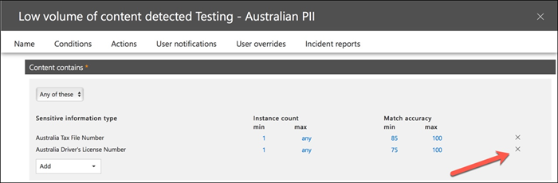

# Creare, testare e ottimizzare i criteri di prevenzione della perdita dei datiCreate, test, and tune a DLP policy

La prevenzione della perdita dei dati (DLP) consente di impedire la condivisione involontaria o accidentale di informazioni riservate.Data loss prevention (DLP) helps you prevent the unintentional or accidental sharing of sensitive information.

DLP esamina i messaggi di posta elettronica e i file per le informazioni riservate, ad esempio un numero di carta di credito.DLP examines email messages and files for sensitive information, like a credit card number. Utilizzando DLP è possibile rilevare informazioni riservate ed eseguire azioni quali:Using DLP you can detect sensitive information, and take action such as:

- Registrare l'evento a scopo di controlloLog the event for auditing purposes
- Visualizzare un avviso all'utente finale che invia il messaggio di posta elettronica o condivide il fileDisplay a warning to the end user who is sending the email or sharing the file
- Bloccare attivamente la condivisione di file o di posta elettronicaActively block the email or file sharing from taking place

## AutorizzazioniPermissions

I membri del team conformità addetti alla creazione dei criteri DLP necessitano delle autorizzazioni per accedere al Centro conformità.Members of your compliance team who will create DLP policies need permissions to the Compliance Center. Per impostazione predefinita, l'amministratore tenant potrà concedere l'accesso ai responsabili della conformità e ad altre persone.By default, your tenant admin will have access can give compliance officers and other people access. Eseguire la procedura seguente:Follow these steps:
  
1. Creare un gruppo in Microsoft 365 e aggiungervi i responsabili della conformità.Create a group in Microsoft 365 and add compliance officers to it.
    
2. Creare un gruppo di ruoli nella pagina **Autorizzazioni** del Centro sicurezza e conformità.Create a role group on the **Permissions** page of the Security &amp; Compliance Center. 

3. Durante la creazione del gruppo di ruoli, utilizzare la **sezione Choose Roles** per aggiungere il ruolo seguente al gruppo di ruoli: DLP Compliance **Management**.While creating the role group, use the **Choose Roles** section to add the following role to the role group: **DLP Compliance Management**.
    
4. Usare la sezione **Scegli membri** per aggiungere il gruppo di Microsoft 365 creato in precedenza al gruppo di ruoli.Use the **Choose Members** section to add the Microsoft 365 group you created before to the role group.

Utilizzare il **ruolo Gestione conformità DLP** di sola visualizzazione per creare un gruppo di ruoli con privilegi di sola visualizzazione per i criteri DLP e i report DLP.Use the **View-Only DLP Compliance Management** role to create role group with view-only privileges to the DLP policies and DLP reports.

Per altre informazioni, vedere [Concedere agli utenti l'accesso al Centro conformità di Office 365](../security/office-365-security/grant-access-to-the-security-and-compliance-center.md).For more information, see [Give users access to the Office 365 Compliance Center](../security/office-365-security/grant-access-to-the-security-and-compliance-center.md).
  
Queste autorizzazioni sono necessarie per creare e applicare un criterio DLP per non applicare i criteri.These permissions are required to create and apply a DLP policy not to enforce policies.

## Come vengono rilevate le informazioni riservate dalla prevenzione della perdita dei datiHow sensitive information is detected by DLP

DLP trova le informazioni riservate in base alla corrispondenza dei criteri di espressione regolare (RegEx), in combinazione con altri indicatori, ad esempio la prossimità di determinate parole chiave ai modelli di corrispondenza.DLP finds sensitive information by regular expression (RegEx) pattern matching, in combination with other indicators such as the proximity of certain keywords to the matching patterns. Ad esempio, un numero di carta di credito VISA ha 16 cifre.For example, a VISA credit card number has 16 digits. Tuttavia, tali cifre possono essere scritte in modi diversi, ad esempio 1111-1111-1111-1111, 1111 1111 1111 1111 o 111111111111111111111111111.But, those digits can be written in different ways, such as 1111-1111-1111-1111, 1111 1111 1111 1111, or 1111111111111111.

Qualsiasi stringa di 16 cifre non è necessariamente un numero di carta di credito, può essere un numero di ticket di un sistema help desk o un numero seriale di un componente hardware.Any 16-digit string is not necessarily a credit card number, it could be a ticket number from a help desk system, or a serial number of a piece of hardware. Per distinguere la differenza tra un numero di carta di credito e una stringa di 16 cifre innocua, viene eseguito un calcolo (checksum) per verificare che i numeri corrispondano a uno schema noto delle varie marche di carte di credito.To tell the difference between a credit card number and a harmless 16-digit string, a calculation is performed (checksum) to confirm that the numbers match a known pattern from the various credit card brands.

Se DLP trova parole chiave come "VISA" o "AMEX", vicino ai valori di data che potrebbero essere la data di scadenza della carta di credito, DLP utilizza anche tali dati per decidere se la stringa è un numero di carta di credito o meno.If DLP finds keywords such as "VISA" or "AMEX", near date values that might be the credit card expiry date, DLP also uses that data to help it decide whether the string is a credit card number or not.

In altre parole, DLP è abbastanza intelligente da riconoscere la differenza tra queste due stringhe di testo in un messaggio di posta elettronica:In other words, DLP is smart enough to recognize the difference between these two strings of text in an email:

- "Puoi ordinarmi un nuovo portatile."Can you order me a new laptop. Usa il mio numero visa 1111-1111-1111-1111, scade il 22/11 e inviami la data di consegna stimata quando lo hai."Use my VISA number 1111-1111-1111-1111, expiry 11/22, and send me the estimated delivery date when you have it."
- "Il numero di serie del portatile è 2222-2222-2222-2222 ed è stato acquistato l'11/11/2010."My laptop serial number is 2222-2222-2222-2222 and it was purchased on 11/2010. A proposito, il mio visto di viaggio è ancora approvato?"By the way, is my travel visa approved yet?"

Vedere [Definizioni di entità del tipo di](sensitive-information-type-entity-definitions.md) informazioni riservate che spiegano come viene rilevato ogni tipo di informazioni.See [Sensitive information type entity definitions](sensitive-information-type-entity-definitions.md) that explains how each information type is detected.

## Da dove iniziare con la prevenzione della perdita di datiWhere to start with data loss prevention

Quando i rischi di perdita dei dati non sono del tutto ovvi, è difficile capire da dove iniziare esattamente con l'implementazione della prevenzione della perdita dei dati.When the risks of data leakage aren't entirely obvious, it's difficult to work out where exactly you should start with implementing DLP. Fortunatamente, i criteri DLP possono essere eseguiti in "modalità di test", consentendo di valutarne l'efficacia e l'accuratezza prima di attivarli.Fortunately, DLP policies can be run in "test mode", allowing you to gauge their effectiveness and accuracy before you turn them on.

I criteri DLP per Exchange Online possono essere gestiti tramite l'interfaccia di amministrazione di Exchange.DLP policies for Exchange Online can be managed through the Exchange admin center. Tuttavia, è possibile configurare i criteri DLP per tutti i carichi di lavoro tramite il Centro sicurezza & conformità, quindi questo è ciò che verrà utilizzato per le dimostrazioni in questo articolo.But you can configure DLP policies for all workloads through the Security & Compliance Center, so that's what I'll use for demonstrations in this article. Nel Centro sicurezza & conformità, i criteri DLP sono presenti in Criteri di prevenzione **della perdita dei**  >  **dati**.In the Security & Compliance Center, you'll find the DLP policies under **Data loss prevention** > **Policy**. Scegliere **Crea un criterio** da avviare.Choose **Create a policy** to start.

Microsoft 365 offre un'ampia gamma di [modelli di](what-the-dlp-policy-templates-include.md) criteri DLP che è possibile utilizzare per creare criteri.Microsoft 365 provides a range of [DLP policy templates](what-the-dlp-policy-templates-include.md) you can use to create policies. Supponiamo che tu sia un'azienda australiana.Let's say that you're an Australian business. Puoi filtrare i modelli in Australia e scegliere Financial, Medical and Health e Privacy.You can filter the templates on Australia, and choose Financial, Medical and Health, and Privacy.

Per questa dimostrazione sceglierò Dati personali australiani, che includono i tipi di informazioni del codice fiscale australiano (TFN) e del numero di patente di guida.For this demonstration I'll choose Australian Personally Identifiable Information (PII) Data, which includes the information types of Australian Tax File Number (TFN) and Driver's License Number.

Assegnare un nome al nuovo criterio DLP.Give your new DLP policy a name. Il nome predefinito corrisponderà al modello di criteri DLP, ma è consigliabile scegliere un nome più descrittivo, perché è possibile creare più criteri dallo stesso modello.The default name will match the DLP policy template, but you should choose a more descriptive name of your own, because multiple policies can be created from the same template.

Scegliere le posizioni a cui verrà applicato il criterio.Choose the locations that the policy will apply to. I criteri DLP possono essere applicati a Exchange Online, SharePoint Online e OneDrive for Business.DLP policies can apply to Exchange Online, SharePoint Online, and OneDrive for Business. Lascerò questo criterio configurato per l'applicazione a tutte le posizioni.I am going to leave this policy configured to apply to all locations.

Al primo passaggio **Impostazioni criteri,** accetta solo le impostazioni predefinite per il momento.At the first **Policy Settings** step, just accept the defaults for now. È possibile personalizzare i criteri DLP, ma le impostazioni predefinite sono un ottimo punto di partenza.You can customize DLP policies, but the defaults are a fine place to start.

Dopo aver fatto clic su Avanti,\*\* verrà visualizzata una **pagina** impostazioni dei criteri aggiuntiva con altre opzioni di personalizzazione.After clicking Next,\*\* you'll be presented with an additional **Policy Settings** page with more customization options. Per un criterio che si sta solo testando, ecco dove è possibile iniziare a apportare alcune modifiche.For a policy that you are just testing, here's where you can start to make some adjustments.

- I've turned off policy tips for now, which is a reasonable step to take if you're just testing things out and don't want to display anything to users yet.I've turned off policy tips for now, which is a reasonable step to take if you're just testing things out and don't want to display anything to users yet. I suggerimenti per i criteri visualizzano avvisi agli utenti che stanno per violare un criterio DLP.Policy tips display warnings to users that they're about to violate a DLP policy. Ad esempio, un utente di Outlook visualizza un avviso che indica che il file allegato contiene numeri di carta di credito e causerà il rifiuto della posta elettronica.For example, an Outlook user will see a warning that the file they've attached contains credit card numbers and will cause their email to be rejected. L'obiettivo dei suggerimenti per i criteri è arrestare il comportamento non conforme prima che si verifica.The goal of policy tips is to stop the non-compliant behaviour before it happens.
- Ho anche ridotto il numero di istanze da 10 a 1, in modo che questo criterio rilevi qualsiasi condivisione dei dati delle informazioni personali australiane, non solo la condivisione in blocco dei dati.I've also decreased the number of instances from 10 to 1, so that this policy will detect any sharing of Australian PII data, not just bulk sharing of the data.
- Ho anche aggiunto un altro destinatario all'e-mail di segnalazione degli eventi imprevisti.I've also added another recipient to the incident report email.

Infine, ho configurato questo criterio per l'esecuzione in modalità test inizialmente.Finally, I've configured this policy to run in test mode initially. Si noti che è disponibile anche un'opzione per disabilitare i suggerimenti per i criteri in modalità test.Notice there's also an option here to disable policy tips while in test mode. In questo modo puoi avere la flessibilità di avere i suggerimenti per i criteri abilitati nel criterio, ma decidi se mostrarli o sopprimerli durante il test.This gives you the flexibility to have policy tips enabled in the policy, but then decide whether to show or suppress them during your testing.

Nella schermata di revisione finale fai clic **su Crea** per completare la creazione del criterio.On the final review screen click **Create** to finish creating the policy.

## Testare un criterio DLPTest a DLP policy

Il nuovo criterio DLP inizierà a essere attivo entro circa 1 ora.Your new DLP policy will begin to take effect within about 1 hour. Puoi sederti e attendere che sia attivato da una normale attività dell'utente oppure puoi provare a attivarlo da solo.You can sit and wait for it to be triggered by normal user activity, or you can try to trigger it yourself. In precedenza ho collegato [alle definizioni di](sensitive-information-type-entity-definitions.md)entità del tipo di informazioni riservate , che fornisce informazioni su come attivare le corrispondenze DLP.Earlier I linked to [Sensitive information type entity definitions](sensitive-information-type-entity-definitions.md), which provides you with information about how to trigger DLP matches.

Ad esempio, il criterio DLP creato per questo articolo rileverà i numeri di file fiscali australiani (TFN).As an example, the DLP policy I created for this article will detect Australian tax file numbers (TFN). In base alla documentazione, la corrispondenza si basa sui criteri seguenti.According to the documentation, the match is based on the following criteria.

 
Per dimostrare il rilevamento TFN in modo piuttosto smussato, un messaggio di posta elettronica con le parole "Tax file number" e una stringa di 9 cifre in prossimità verrà inviato senza problemi.To demonstrate TFN detection in a rather blunt manner, an email with the words "Tax file number" and a 9 digit string in close proximity will sail through without any issues. Il motivo per cui non attiva il criterio DLP è che la stringa a 9 cifre deve superare il checksum che indica che è un valore TFN valido e non solo una stringa innocua di numeri.The reason it does not trigger the DLP policy is that the 9-digit string must pass the checksum that indicates it is a valid TFN and not just a harmless string of numbers.

In confronto, un messaggio di posta elettronica con le parole "Tax file number" e un valore TFN valido che supera il checksum attiverà il criterio.In comparison, an email with the words "Tax file number" and a valid TFN that passes the checksum will trigger the policy. Per il record qui, il TFN in uso è stato preso da un sito Web che genera TFN validi, ma non originali.For the record here, the TFN I'm using was taken from a website that generates valid, but not genuine, TFNs. Tali siti sono molto utili perché uno degli errori più comuni durante il test di un criterio DLP è l'utilizzo di un numero falso non valido e non supererà il checksum (e pertanto non attiverà il criterio).Such sites are very useful because one of the most common mistakes when testing a DLP policy is using a fake number that's not valid and won't pass the checksum (and therefore won't trigger the policy).

Il messaggio di posta elettronica del rapporto operazioni non consentite include il tipo di informazioni riservate rilevate, il numero di istanze rilevate e il livello di probabilità del rilevamento.The incident report email includes the type of sensitive information that was detected, how many instances were detected, and the confidence level of the detection.

Se si lascia il criterio DLP in modalità di test e si analizzano i messaggi di posta elettronica del rapporto operazioni non consentite, è possibile iniziare a capire l'accuratezza del criterio DLP e la sua efficacia quando viene applicato.If you leave your DLP policy in test mode and analyze the incident report emails, you can start to get a feel for the accuracy of the DLP policy and how effective it will be when it is enforced. Oltre ai report operazioni non consentite, è possibile utilizzare i report [DLP](view-the-dlp-reports.md) per visualizzare una visualizzazione aggregata delle corrispondenze dei criteri nel tenant.In addition to the incident reports, you can [use the DLP reports](view-the-dlp-reports.md) to see an aggregated view of policy matches across your tenant.

## Ottimizzare un criterio DLPTune a DLP policy

Durante l'analisi dei risultati dei criteri, potrebbe essere necessario apportare alcune modifiche al comportamento dei criteri.As you analyze your policy hits you might want to make some adjustments to how the policies behave. Come esempio semplice, è possibile determinare che un TFN nella posta elettronica non è un problema (lo è ancora, ma passiamo con esso per motivi di dimostrazione), ma due o più istanze sono un problema.As a simple example, you might determine that one TFN in email is not a problem (I think it still is, but let's go with it for the sake of demonstration), but two or more instances is a problem. Più istanze potrebbero essere uno scenario rischioso, ad esempio un dipendente che invia tramite posta elettronica un'esportazione CSV dal database delle risorse umane a una parte esterna, ad esempio un servizio contabile esterno.Multiple instances could be a risky scenario such as an employee emailing a CSV export from the HR database to an external party, for example an external accounting service. Sicuramente qualcosa che preferisci rilevare e bloccare.Definitely something you would prefer to detect and block.

Nel Centro sicurezza & conformità è possibile modificare un criterio esistente per modificare il comportamento.In the Security & Compliance Center you can edit an existing policy to adjust the behaviour.

 
È possibile modificare le impostazioni della posizione in modo che il criterio sia applicato solo a carichi di lavoro specifici o a siti e account specifici.You can adjust the location settings so that the policy is applied only to specific workloads, or to specific sites and accounts.

È inoltre possibile modificare le impostazioni dei criteri e modificare le regole in base alle proprie esigenze.You can also adjust the policy settings and edit the rules to better suit your needs.

Quando si modifica una regola all'interno di un criterio DLP, è possibile modificare:When editing a rule within a DLP policy you can change:

- Condizioni, inclusi il tipo e il numero di istanze di dati sensibili che attiveranno la regola.The conditions, including the type and number of instances of sensitive data that will trigger the rule.
- Azioni intraprese, ad esempio la limitazione dell'accesso al contenuto.The actions that are taken, such as restricting access to the content.
- Notifiche utente, ovvero suggerimenti per i criteri visualizzati all'utente nel client di posta elettronica o nel Web browser.User notifications, which are policy tips that are displayed to the user in their email client or web browser.
- Sostituzioni utente, che determina se gli utenti possono scegliere di procedere comunque con la posta elettronica o la condivisione di file.User overrides, which determines whether users can choose to proceed with their email or file sharing anyway.
- Report operazioni non consentite, per informare gli amministratori.Incident reports, to notify administrators.

Per questa dimostrazione ho aggiunto le notifiche degli utenti al criterio (fare attenzione a farlo senza una formazione adeguata sulla sensibilizzazione degli utenti) e ho consentito agli utenti di ignorare il criterio con una giustificazione aziendale o contrassegnarlo come falso positivo.For this demonstration I've added user notifications to the policy (be careful of doing this without adequate user awareness training), and allowed users to override the policy with a business justification or by flagging it as a false positive. Si noti che è anche possibile personalizzare il testo del suggerimento per la posta elettronica e il criterio se si desidera includere ulteriori informazioni sui criteri dell'organizzazione o chiedere agli utenti di contattare il supporto in caso di domande.Note that you can also customize the email and policy tip text if you want to include any additional information about your organization's policies, or prompt users to contact support if they have questions.

Il criterio contiene due regole per la gestione del volume elevato e del volume basso, quindi assicurati di modificarle entrambe con le azioni desiderate.The policy contains two rules for handling of high volume and low volume, so be sure to edit both with the actions that you want. Questa è un'opportunità per trattare i casi in modo diverso a seconda delle loro caratteristiche.This is an opportunity to treat cases differently depending on their characteristics. Ad esempio, potresti consentire sostituzioni per violazioni di volume basso, ma non consentire sostituzioni per violazioni di volume elevato.For example, you might allow overrides for low volume violations, but not allow overrides for high volume violations.

Inoltre, se si desidera bloccare o limitare effettivamente l'accesso al contenuto che viola i criteri, è necessario configurare un'azione per la regola a tale scopo.Also, if you want to actually block or restrict access to content that is in violation of policy, you need to configure an action on the rule to do so.

Dopo aver salvato le modifiche alle impostazioni dei criteri, è inoltre necessario tornare alla pagina delle impostazioni principale per il criterio e abilitare l'opzione per visualizzare i suggerimenti per i criteri per gli utenti mentre il criterio è in modalità test.After saving those changes to the policy settings, I also need to return to the main settings page for the policy and enable the option to show policy tips to users while the policy is in test mode. Si tratta di un modo efficace per introdurre i criteri DLP agli utenti finali e per formare la sensibilizzazione degli utenti, senza rischiare troppi falsi positivi che influiscono sulla produttività.This is an effective way to introduce DLP policies to your end users, and do user awareness training, without risking too many false positives that impact their productivity.

Sul lato server (o sul lato cloud, se si preferisce), la modifica potrebbe non essere immediatamente effettiva a causa di vari intervalli di elaborazione.On the server side (or cloud side if you prefer), the change may not take effect immediately, due to various processing intervals. Se si sta apportando una modifica ai criteri DLP che visualizza nuovi suggerimenti per i criteri a un utente, è possibile che l'utente non veda immediatamente le modifiche nel client Outlook, verificando la presenza di modifiche dei criteri ogni 24 ore.If you're making a DLP policy change that will display new policy tips to a user, the user may not see the changes take effect immediately in their Outlook client, which checks for policy changes every 24 hours. Se si desidera velocizzare i test, è possibile utilizzare questa correzione del Registro di sistema per cancellare l'indicatore dell'ora dell'ultimo [download dalla chiave PolicyNudges](https://support.microsoft.com/en-au/help/2823261/changes-to-a-data-loss-prevention-policy-don-t-take-effect-in-outlook?__hstc=18650278.46377037dc0a82baa8a30f0ef07a7b2f.1538687978676.1538693509953.1540315763430.3&__hssc=18650278.1.1540315763430&__hsfp=3446956451).If you want to speed things up for testing, you can use this registry fix to [clear the last download time stamp from the PolicyNudges key](https://support.microsoft.com/en-au/help/2823261/changes-to-a-data-loss-prevention-policy-don-t-take-effect-in-outlook?__hstc=18650278.46377037dc0a82baa8a30f0ef07a7b2f.1538687978676.1538693509953.1540315763430.3&__hssc=18650278.1.1540315763430&__hsfp=3446956451). Outlook scariderà le informazioni più recenti sui criteri al successivo riavvio e inizierà a comporre un messaggio di posta elettronica.Outlook will download the latest policy information the next time you restart it and begin composing an email message.

Se sono abilitati suggerimenti per i criteri, l'utente inizierà a visualizzare i suggerimenti in Outlook e potrà segnalare falsi positivi quando si verificano.If you have policy tips enabled, the user will begin to see the tips in Outlook, and can report false positives to you when they occur.

## Analizzare i falsi positiviInvestigate false positives

I modelli di criteri DLP non sono perfetti.DLP policy templates are not perfect straight out of the box. È probabile che si verifichino alcuni falsi positivi nell'ambiente, motivo per cui è così importante semplificare la distribuzione dlp, prendendo il tempo necessario per testare e ottimizzare adeguatamente i criteri.It's likely that you'll find some false positives occurring in your environment, which is why it's so important to ease your way into a DLP deployment, taking the time to adequately test and tune your policies.

Ecco un esempio di falso positivo.Here's an example of a false positive. Questo messaggio di posta elettronica è abbastanza innocuo.This email is quite harmless. L'utente fornisce il proprio numero di cellulare a un utente e include la firma di posta elettronica.The user is providing their mobile phone number to someone, and including their email signature.

 
Ma l'utente vede un suggerimento per i criteri che avvisa che il messaggio di posta elettronica contiene informazioni riservate, in particolare un numero di patente di guida australiana.But the user sees a policy tip warning them that the email contains sensitive information, specifically, an Australian driver's license number.

L'utente può segnalare il falso positivo e l'amministratore può esaminare il motivo per cui si è verificato.The user can report the false positive, and the administrator can look into why it has occurred. Nel messaggio di posta elettronica del rapporto operazioni non consentite il messaggio viene contrassegnato come falso positivo.In the incident report email, the email is flagged as a false positive.

Questo caso di patente di guida è un buon esempio da vedere.This driver's license case is a good example to dig into. Il motivo per cui si è verificato questo falso positivo è che il tipo "Australian Driver's License" verrà attivato da qualsiasi stringa di 9 cifre (anche una che fa parte di una stringa di 10 cifre), entro 300 caratteri in prossimità delle parole chiave "sydney nsw" (senza distinzione tra maiuscole e minuscole).The reason this false positive has occurred is that the "Australian Driver's License" type will be triggered by any 9-digit string (even one that is part of a 10-digit string), within 300 characters proximity to the keywords "sydney nsw" (not case sensitive). Quindi viene attivato dal numero di telefono e dalla firma di posta elettronica, solo perché l'utente si verifica a Sydney.So it's triggered by the phone number and email signature, only because the user happens to be in Sydney.

Un'opzione è quella di rimuovere il tipo di informazioni sulla patente di guida australiana dal criterio.One option is to remove the Australian driver's license information type from the policy. È presente perché fa parte del modello di criteri DLP, ma non è forzato a usarlo.It's in there because it's part of the DLP policy template, but we're not forced to use it. Se sei interessato solo ai numeri di file fiscali e non alle licenze di guida, puoi semplicemente rimuoverlo.If you're only interested in Tax File Numbers and not driver's licenses, you can just remove it. Ad esempio, è possibile rimuoverlo dalla regola di volume basso nel criterio, ma lasciarlo nella regola di volume elevato in modo che gli elenchi di licenze di più driver siano ancora rilevati.For example, you can remove it from the low volume rule in the policy, but leave it in the high volume rule so that lists of multiple drivers licenses are still detected.

 
Un'altra opzione è semplicemente aumentare il numero di istanze, in modo che un volume basso di licenze del driver viene rilevato solo quando sono presenti più istanze.Another option is to simply increase the instance count, so that a low volume of driver's licenses is only detected when there are multiple instances.

Oltre a modificare il numero di istanze, puoi anche modificare l'accuratezza della corrispondenza (o il livello di confidenza).In addition to changing the instance count, you can also adjust the match accuracy (or confidence level). Se il tipo di informazioni riservate include più modelli, è possibile modificare l'accuratezza della corrispondenza nella regola, in modo che la regola corrisponda solo a modelli specifici.If your sensitive information type has multiple patterns, you can adjust the match accuracy in your rule, so that your rule matches only specific patterns. Ad esempio, per ridurre i falsi positivi, puoi impostare l'accuratezza della corrispondenza della regola in modo che corrisponda solo al modello con il livello di probabilità più alto.For example, to help reduce false positives, you can set the match accuracy of your rule so that it matches only the pattern with the highest confidence level. Comprendere come viene calcolato il livello di confidenza è un po' complicato (e oltre l'ambito di questo post), ma ecco una buona spiegazione di come usare il livello di confidenza per ottimizzare [le regole.](data-loss-prevention-policies.md#match-accuracy)Understanding how confidence level is calculated is a bit tricky (and beyond the scope of this post), but here's a good explanation of [how to use confidence level to tune your rules](data-loss-prevention-policies.md#match-accuracy).

Infine, se si desidera ottenere anche un po' più avanzato, è possibile personalizzare qualsiasi tipo di informazione sensibile, ad esempio è possibile rimuovere "Sydney NSW" [dall'elenco](sensitive-information-type-entity-definitions.md#australia-drivers-license-number)delle parole chiave per il numero di patente di guida australiana, per eliminare il falso positivo attivato in precedenza.Finally, if you want to get even a bit more advanced, you can customize any sensitive information type -- for example, you can remove "Sydney NSW" from the list of keywords for [Australia driver's license number](sensitive-information-type-entity-definitions.md#australia-drivers-license-number), to eliminate the false positive triggered above. Per informazioni su come eseguire questa operazione utilizzando XML e PowerShell, vedere personalizzazione di un tipo di informazioni [riservate predefinito.](customize-a-built-in-sensitive-information-type.md)To learn how to do this by using XML and PowerShell, see [customizing a built-in sensitive information type](customize-a-built-in-sensitive-information-type.md).

## Attivare un criterio DLPTurn on a DLP policy

Quando si è soddisfatti che il criterio DLP rilevi in modo accurato ed efficace i tipi di informazioni riservate e che gli utenti finali siano pronti a gestire i criteri in essere, è possibile abilitare il criterio.When you're happy that your DLP policy is accurately and effectively detecting sensitive information types, and that your end users are ready to deal with the policies being in place, then you can enable the policy.

 
Se si è in attesa di vedere quando il criterio avrà effetto, connettersi & Centro sicurezza e conformità [PowerShell](/powershell/exchange/connect-to-scc-powershell) ed eseguire il [cmdlet Get-DlpCompliancePolicy](/powershell/module/exchange/get-dlpcompliancepolicy) per visualizzare DistributionStatus.If you're waiting to see when the policy will take effect, [Connect to Security & Compliance Center PowerShell](/powershell/exchange/connect-to-scc-powershell) and run the [Get-DlpCompliancePolicy cmdlet](/powershell/module/exchange/get-dlpcompliancepolicy) to see the DistributionStatus.

Dopo aver attivato il criterio DLP, è consigliabile eseguire alcuni test finali per assicurarsi che si verifichino le azioni previste per i criteri.After turning on the DLP policy, you should run some final tests of your own to make sure that the expected policy actions are occurring. Se si sta tentando di testare elementi come i dati della carta di credito, sono disponibili siti Web online con informazioni su come generare una carta di credito di esempio o altre informazioni personali che supereranno i checksum e attiveranno i criteri.If you're trying to test things like credit card data, there are websites online with information on how to generate sample credit card or other personal information that will pass checksums and trigger your policies.

I criteri che consentono le sostituzioni utente presenteranno tale opzione all'utente come parte del suggerimento per i criteri.Policies that allow user overrides will present that option to the user as part of the policy tip.

I criteri che limitano il contenuto presenteranno l'avviso all'utente come parte del suggerimento per i criteri e impediranno loro di inviare il messaggio di posta elettronica.Policies that restrict content will present the warning to the user as part of the policy tip, and prevent them from sending the email.

## RiepilogoSummary

I criteri di prevenzione della perdita dei dati sono utili per organizzazioni di tutti i tipi.Data loss prevention policies are useful for organizations of all types. Il test di alcuni criteri DLP è un esercizio a basso rischio a causa del controllo che si ha su elementi come suggerimenti per i criteri, sostituzioni degli utenti finali e report operazioni non consentite.Testing some DLP policies is a low risk exercise due to the control you have over things like policy tips, end user overrides, and incident reports. È possibile testare in modo silenzioso alcuni criteri DLP per vedere il tipo di violazioni già in corso nell'organizzazione e quindi creare criteri con bassi tassi di falsi positivi, informare gli utenti su ciò che è consentito e non consentito e quindi implementare i criteri DLP all'organizzazione.You can quietly test some DLP policies to see what type of violations are already occurring in your organization, and then craft policies with low false positive rates, educate your users on what is allowed and not allowed, and then roll out your DLP policies to the organization.