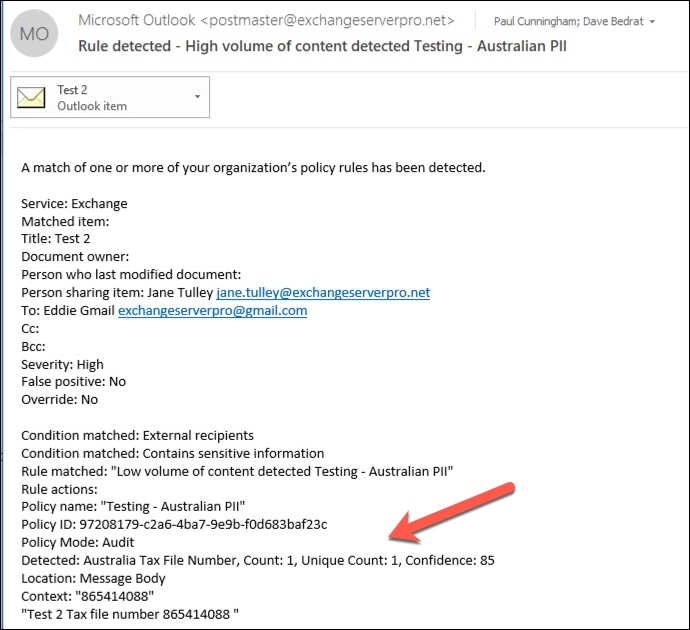

# Creare, testare e ottimizzare i criteri di prevenzione della perdita dei dati

La prevenzione della perdita di dati (DLP) consente di prevenire la condivisione involontaria o accidentale di informazioni riservate.

DLP esamina i messaggi di posta elettronica e i file alla ricerca di informazioni riservate, ad esempio un numero di carta di credito. Utilizzando DLP è possibile rilevare informazioni riservate e intraprendere azioni quali:

- Registrare l'evento a scopo di controllo
- Visualizzare un avviso all'utente finale che invia l'e-mail o condivide il file
- Bloccare attivamente l'invio di e-mail o condivisione file

## Autorizzazioni

I membri del team conformità addetti alla creazione dei criteri DLP necessitano delle autorizzazioni per accedere al Centro conformità. Per impostazione predefinita, l'amministratore del tenant avrà accesso può concedere ai responsabili della conformità e ad altre persone l'accesso. Eseguire la procedura seguente:
  
1. Creare un gruppo in Microsoft 365 e aggiungervi i responsabili della conformità.
    
2. Creare un gruppo di ruoli nella pagina **Autorizzazioni** del Centro sicurezza e conformità. 

3. Durante la creazione del gruppo di ruoli, utilizzare **la sezione** Scegli ruoli per aggiungere il ruolo seguente al gruppo di ruoli: Gestione **conformità DLP**.
    
4. Usare la sezione **Scegli membri** per aggiungere il gruppo di Microsoft 365 creato in precedenza al gruppo di ruoli.

Utilizzare il **ruolo Gestione conformità DLP solo visualizzazione** per creare un gruppo di ruoli con privilegi di sola visualizzazione per i criteri DLP e i report DLP.

Per altre informazioni, vedere [Concedere agli utenti l'accesso al Centro conformità di Office 365](../security/office-365-security/grant-access-to-the-security-and-compliance-center.md).
  
Queste autorizzazioni sono necessarie per creare e applicare un criterio DLP per non applicare i criteri.

## Come vengono rilevate le informazioni riservate da DLP

DLP trova informazioni riservate in base alla corrispondenza dei modelli regex (Regular Expression), in combinazione con altri indicatori, ad esempio la vicinanza di determinate parole chiave ai modelli corrispondenti. Ad esempio, un numero di carta di credito VISA ha 16 cifre. Tuttavia, queste cifre possono essere scritte in modi diversi, come 1111-1111-1111-1111, 1111 1111 1111 1111 o 1111111111111111111111.

Qualsiasi stringa di 16 cifre non è necessariamente un numero di carta di credito, potrebbe essere un numero di biglietto da un sistema di help desk o un numero di serie di un pezzo di hardware. Per distinguere tra un numero di carta di credito e una stringa innocua di 16 cifre, viene eseguito un calcolo (checksum) per confermare che i numeri corrispondono a un modello noto dei vari marchi di carte di credito.

Se DLP trova parole chiave come "VISA" o "AMEX", valori di data vicina che potrebbero essere la data di scadenza della carta di credito, DLP utilizza anche tali dati per aiutarlo a decidere se la stringa è un numero di carta di credito o meno.

In altre parole, DLP è abbastanza intelligente da riconoscere la differenza tra queste due stringhe di testo in un'e-mail:

- "Puoi ordinarmi un nuovo laptop. Usa il mio numero VISA 1111-1111-1111-1111, scadenza 11/22, e inviami la data di consegna stimata quando lo hai."
- "Il mio numero di serie del laptop è 2222-2222-2222-2222 ed è stato acquistato l'11/2010. A proposito, il mio visto di viaggio è ancora approvato?

Vedere [Definizioni di entità del tipo di informazioni](sensitive-information-type-entity-definitions.md) riservate che spiegano come viene rilevato ogni tipo di informazione.

## Da dove iniziare con la prevenzione della perdita di dati

Quando i rischi di perdita di dati non sono del tutto evidenti, è difficile capire da dove esattamente dovresti iniziare con l'implementazione di DLP. Fortunatamente, i criteri DLP possono essere eseguiti in "modalità test", consentendo di valutarne l'efficacia e l'accuratezza prima di accenderli.

I criteri DLP per Exchange Online possono essere gestiti tramite l'interfaccia Exchange'interfaccia di amministrazione. Tuttavia, è possibile configurare i criteri DLP per tutti i carichi di lavoro tramite il Centro conformità & sicurezza, in modo che sia quello che userò per le dimostrazioni in questo articolo. Nel Centro conformità & sicurezza sono disponibili i criteri DLP in Criteri di **prevenzione della perdita di**  >  **dati**. Scegliere **Crea criteri per** iniziare.

Microsoft 365 fornisce una gamma di modelli [di criteri DLP](what-the-dlp-policy-templates-include.md) che è possibile utilizzare per creare criteri. Diciamo che sei un'azienda australiana. È possibile filtrare i modelli in Australia e scegliere Finanziario, Medico e Salute e Privacy.

Per questa dimostrazione sceglierò i dati PII (Australian PersonalLy Identifiable Information), che includono i tipi di informazioni del numero di file fiscale australiano (TFN) e del numero di patente di guida.

Assegnare un nome al nuovo criterio DLP. Il nome predefinito corrisponderà al modello di criteri DLP, ma è necessario scegliere un nome più descrittivo, perché è possibile creare più criteri dallo stesso modello.

Scegliere i percorsi a cui verrà applicato il criterio. I criteri DLP possono essere applicati a Exchange Online, SharePoint Online e OneDrive for Business. Lascerò questo criterio configurato per l'applicazione a tutte le posizioni.

Al primo passaggio **del Impostazioni,** per il momento, accettare le impostazioni predefinite. È possibile personalizzare i criteri DLP, ma le impostazioni predefinite sono un ottimo punto di partenza.

Dopo aver fatto clic su Avanti,** verrà presentata una pagina di **ricerca Impostazioni** con altre opzioni di personalizzazione. Per un criterio che stai solo testando, ecco dove puoi iniziare ad apportare alcune modifiche.

- Ho disattivato i suggerimenti sui criteri per ora, il che è un passo ragionevole da fare se stai solo testando le cose e non vuoi ancora mostrare nulla agli utenti. I suggerimenti per i criteri visualizzano avvisi agli utenti che stanno per violare un criterio DLP. Ad esempio, un utente Outlook vedrà un avviso che il file che ha allegato contiene numeri di carta di credito e causerà il rifiuto della posta elettronica. L'obiettivo dei suggerimenti per i criteri è arrestare il comportamento non conforme prima che si verifica.
- Ho anche ridotto il numero di istanze da 10 a 1, in modo che questa politica rilevi qualsiasi condivisione dei dati PII australiani, non solo la condivisione in blocco dei dati.
- Ho anche aggiunto un altro destinatario all'e-mail del rapporto sugli incidenti.

Infine, inizialmente ho configurato questo criterio per l'esecuzione in modalità test. Si noti che c'è anche un'opzione qui per disabilitare i suggerimenti sui criteri mentre si è in modalità di test. In questo modo è possibile ottenere la flessibilità necessaria per abilitare i suggerimenti sui criteri nei criteri, ma quindi decidere se mostrarli o sopprimerli durante il test.

Nella schermata di revisione finale fare clic su **Crea per** completare la creazione del criterio.

## Testare un criterio DLP

Il nuovo criterio DLP inizierà ad avere effetto entro circa 1 ora. Puoi sederti e aspettare che venga attivato dalla normale attività dell'utente, oppure puoi provare a attivarlo da solo. In precedenza ho collegato [alle definizioni di entità del tipo](sensitive-information-type-entity-definitions.md)di informazioni riservate , che fornisce informazioni su come attivare le corrispondenze DLP.

Ad esempio, il criterio DLP creato per questo articolo rileverà i numeri di file fiscali australiani (TFN). Secondo la documentazione, la corrispondenza si basa sui seguenti criteri.

 
Per dimostrare il rilevamento TFN in modo piuttosto smussato, un'e-mail con le parole "Numero di file fiscale" e una stringa di nove cifre nelle immediate vicinanze navigherà senza problemi. Il motivo per cui non attiva il criterio DLP è che la stringa a nove cifre deve passare il checksum che indica che si tratta di un TFN valido e non solo di una stringa innocua di numeri.

In confronto, un'e-mail con le parole "Tax file number" e un TFN valido che supera il checksum attiverà il criterio. Per la registrazione qui, il TFN che sto usando è stato preso da un sito Web che genera TFN validi, ma non autentici. Tali siti sono utili perché uno degli errori più comuni durante il test di un criterio DLP è l'utilizzo di un numero falso che non è valido e non supererà il checksum (e quindi non attiverà il criterio).

Il messaggio di posta elettronica del report sugli incidenti include il tipo di informazioni riservate rilevate, il numero di istanze rilevate e il livello di confidenza del rilevamento.

Se si lascia il criterio DLP in modalità test e si analizzano i messaggi di posta elettronica del rapporto sugli incidenti, è possibile iniziare a avere un'attenzione per l'accuratezza dei criteri DLP e per quanto sarà efficace quando verrà applicato. Oltre ai rapporti sugli incidenti, è possibile utilizzare [i report DLP per](view-the-dlp-reports.md) visualizzare una visualizzazione aggregata delle corrispondenze dei criteri nel tenant.

## Ottimizzare un criterio DLP

Quando si analizzano i risultati dei criteri, è possibile apportare alcune modifiche al comportamento dei criteri. Come semplice esempio, potresti determinare che un TFN in un'e-mail non è un problema (penso che lo sia ancora, ma andiamo con esso per motivi di dimostrazione), ma due o più istanze sono un problema. Più istanze potrebbero essere uno scenario rischioso, ad esempio un dipendente che invia un'esportazione CSV dal database delle risorse umane a una parte esterna, ad esempio un servizio di contabilità esterno. Sicuramente qualcosa che preferiresti rilevare e bloccare.

Nel Centro conformità è possibile modificare un criterio esistente per modificare il comportamento.

 
È possibile modificare le impostazioni di posizione in modo che il criterio sia applicato solo a carichi di lavoro specifici o a siti e account specifici.

È inoltre possibile modificare le impostazioni dei criteri e le regole in base alle proprie esigenze.

Quando si modifica una regola all'interno di un criterio DLP, è possibile modificare:

- Condizioni, inclusi il tipo e il numero di istanze di dati sensibili che attiveranno la regola.
- Azioni intraprese, ad esempio la limitazione dell'accesso al contenuto.
- Notifiche degli utenti, o che sono suggerimenti per i criteri visualizzati all'utente nel client di posta elettronica o nel web browser.
- Le sostituzioni degli utenti determinano se gli utenti possono comunque scegliere di procedere con la posta elettronica o la condivisione di file.
- Rapporti sugli incidenti, per avvisare gli amministratori.

Per questa dimostrazione ho aggiunto notifiche utente ai criteri (fai attenzione a farlo senza un'adeguata formazione sulla consapevolezza degli utenti) e ho permesso agli utenti di ignorare il criterio con una giustificazione aziendale o segnalarlo come falso positivo. È inoltre possibile personalizzare il testo del suggerimento per la posta elettronica e i criteri se si desidera includere ulteriori informazioni sui criteri dell'organizzazione o richiedere agli utenti di contattare il supporto in caso di domande.

Il criterio contiene due regole per la gestione di volumi elevati e volumi bassi, quindi assicurati di modificarli entrambi con le azioni desiderate. Questa è un'opportunità per trattare i casi in modo diverso a seconda delle loro caratteristiche. Ad esempio, è possibile consentire sostituzioni per violazioni di volume basso, ma non consentire sostituzioni per violazioni di volume elevato.

Inoltre, se si desidera bloccare o limitare effettivamente l'accesso al contenuto che viola i criteri, è necessario configurare un'azione sulla regola per farlo.

Dopo aver salvato tali modifiche alle impostazioni dei criteri, è anche necessario tornare alla pagina delle impostazioni principali per il criterio e abilitare l'opzione per mostrare suggerimenti sui criteri agli utenti mentre il criterio è in modalità di test. Questo è un modo efficace per introdurre criteri DLP agli utenti finali e fare formazione sulla consapevolezza degli utenti, senza rischiare troppi falsi positivi che hanno un impatto sulla loro produttività.

Sul lato server (o sul lato cloud, se si preferisce), la modifica potrebbe non avere effetto immediato, a causa di vari intervalli di elaborazione. Se si apporta una modifica ai criteri DLP che visualizza nuovi suggerimenti per i criteri per un utente, è possibile che le modifiche non siano immediatamente disponibili nel client Outlook, che verifica la presenza di modifiche ai criteri ogni 24 ore. Se si desidera velocizzare i test, è possibile utilizzare questa correzione del Registro di sistema per [cancellare l'ultimo timestamp di download dalla chiave PolicyNudges](https://support.microsoft.com/en-au/help/2823261/changes-to-a-data-loss-prevention-policy-don-t-take-effect-in-outlook?__hstc=18650278.46377037dc0a82baa8a30f0ef07a7b2f.1538687978676.1538693509953.1540315763430.3&__hssc=18650278.1.1540315763430&__hsfp=3446956451). Outlook le informazioni sui criteri più recenti al successivo riavvio e inizierà a comporre un messaggio di posta elettronica.

Se sono abilitati i suggerimenti per i criteri, l'utente inizierà a visualizzare i suggerimenti in Outlook e può segnalare falsi positivi quando si verificano.

## Indagare su falsi positivi

I modelli di criteri DLP non sono perfetti immediatamente. È probabile che nell'ambiente si verifichino alcuni falsi positivi, motivo per cui è così importante facilitare la propria attività in una distribuzione DLP, prendendosi il tempo necessario per testare e ottimizzare adeguatamente i criteri.

Ecco un esempio di falso positivo. Questa e-mail è abbastanza innocua. L'utente sta fornendo il proprio numero di cellulare a qualcuno e includendo la propria firma e-mail.

 
Ma l'utente vede un suggerimento per i criteri che li avverte che l'e-mail contiene informazioni riservate, in particolare un numero di patente di guida australiano.

L'utente può segnalare il falso positivo e l'amministratore può esaminare il motivo per cui si è verificato. Nell'e-mail del rapporto sugli incidenti, l'e-mail viene contrassegnata come falsa positiva.

Questo caso di patente di guida è un buon esempio da scavare. Il motivo per cui questo falso positivo si è verificato è che il tipo "Australian Driver's License" verrà attivato da qualsiasi stringa di 9 cifre (anche una che fa parte di una stringa di 10 cifre), entro 300 caratteri di prossimità alle parole chiave "Sydney nsw" (senza fare alcuna eccezione). Quindi viene attivato dal numero di telefono e dalla firma e-mail, solo perché l'utente si trova a Sydney.

Un'opzione è quella di rimuovere il tipo di informazioni sulla patente di guida australiana dal criterio. È lì dentro perché fa parte del modello di criteri DLP, ma non siamo costretti a usarlo. Se sei interessato solo ai numeri di file fiscali e non alle patenti di guida, puoi semplicemente rimuoverlo. Ad esempio, è possibile rimuoverlo dalla regola del volume basso nel criterio, ma lasciarlo nella regola del volume elevato in modo che gli elenchi di più patenti di guida siano ancora rilevati.
 
Un'altra opzione è aumentare il numero di istanze, in modo che un basso volume di patenti di guida viene rilevato solo quando sono disponibili più istanze.

Oltre a modificare il conteggio delle istanze, potete anche regolare la precisione della corrispondenza (o il livello di confidenza). Se il tipo di informazioni riservate dispone di più modelli, è possibile regolare l'accuratezza della corrispondenza nella regola, in modo che la regola corrisponda solo a modelli specifici. Ad esempio, per ridurre i falsi positivi, è possibile impostare l'accuratezza della corrispondenza della regola in modo che corrisponda solo al modello con il livello di confidenza più alto. Per ulteriori informazioni sui livelli di confidenza, [vedere Come utilizzare il livello di confidenza per ottimizzare le regole](data-loss-prevention-policies.md#match-accuracy).

Infine, se si desidera ottenere anche un po 'più avanzato, è possibile personalizzare qualsiasi tipo di informazioni riservate - ad esempio, è possibile rimuovere "Sydney NSW" [dall'elenco](sensitive-information-type-entity-definitions.md#australia-drivers-license-number)delle parole chiave per il numero di patente di guida australiano , per eliminare il falso positivo attivato sopra. Per informazioni su come eseguire questa procedura utilizzando XML e PowerShell, vedere [personalizzazione di un tipo di informazioni riservate incorporato](customize-a-built-in-sensitive-information-type.md).

## Attivare un criterio DLP

Quando si è soddisfatti che i criteri DLP rilevino in modo accurato ed efficace i tipi di informazioni riservate e che gli utenti finali siano pronti a gestire i criteri in vigore, è possibile abilitare il criterio.

 
Se si è in attesa di vedere quando il criterio avrà effetto, [Connessione in Security & Compliance Center PowerShell](/powershell/exchange/connect-to-scc-powershell) ed eseguire il cmdlet [Get-DlpCompliancePolicy per](/powershell/module/exchange/get-dlpcompliancepolicy) visualizzare DistributionStatus.

Dopo aver attivato il criterio DLP, è necessario eseguire alcuni test finali per assicurarsi che si verifichino le azioni dei criteri previste. Se stai cercando di testare cose come i dati della carta di credito, ci sono siti Web online con informazioni su come generare carta di credito di esempio o altre informazioni personali che supereranno i checksum e attiveranno le tue politiche.

I criteri che consentono le sostituzioni utente presenteranno tale opzione all'utente come parte del suggerimento per i criteri.

I criteri che limitano il contenuto presenteranno l'avviso all'utente come parte del suggerimento per i criteri e impediranno loro di inviare il messaggio di posta elettronica.

## Riepilogo

I criteri di prevenzione della perdita di dati sono utili per organizzazioni di tutti i tipi. Il test di alcuni criteri DLP è un esercizio a basso rischio a causa del controllo che si ha su elementi come suggerimenti sui criteri, sostituzioni dell'utente finale e rapporti sugli incidenti. È possibile testare tranquillamente alcuni criteri DLP per verificare il tipo di violazioni già presenti nell'organizzazione, quindi creare criteri con bassi tassi di falsi positivi, educare gli utenti su ciò che è consentito e non consentito e quindi implementare i criteri DLP nell'organizzazione.