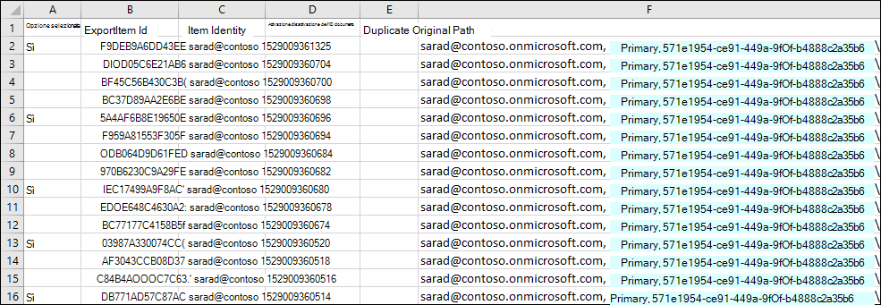
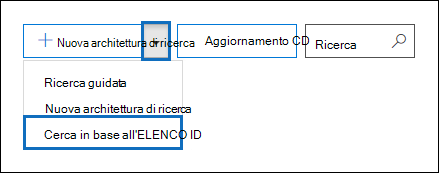
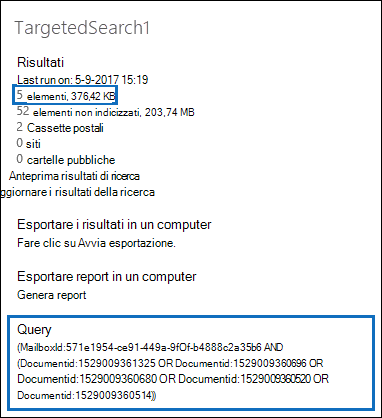

# Preparare un file CSV per un elenco ID di Ricerca contenuto

È possibile cercare specifici messaggi di posta elettronica della cassetta postale e altri elementi della cassetta postale utilizzando un elenco di ID di Exchange. Per creare una ricerca nell'elenco id (formalmente denominata ricerca mirata), è necessario inviare un file con valori delimitati da virgole (CSV) che identifica gli elementi specifici della cassetta postale da cercare. Per questo file CSV si utilizza il file **Results.csv** o il file **Items.csv** non indicizzato che vengono inclusi quando si esportano i risultati di Ricerca contenuto o si esporta un report ricerca contenuto da ricerca contenuto e ricerca contenuto esistente. Modificare quindi uno di questi file per indicare gli elementi specifici da cercare, quindi creare una nuova ricerca nell'elenco di ID e inviare il file CSV.

Ecco una rapida panoramica del processo di creazione di una ricerca nell'elenco di ID.

1. Creare ed eseguire una ricerca di contenuto nuova o guidata nel Centro sicurezza & conformità.

2. Esportare i risultati della ricerca di contenuto o esportare il report di ricerca contenuto. Per altre informazioni, vedere:

    - [Esportare i risultati della Ricerca contenuto](export-search-results.md)

    - [Esportare il rapporto della Ricerca contenuto](export-a-content-search-report.md)

3. Modificare il file **Results.csv** o il Items.csvnon **indicizzato e** identificare gli elementi specifici della cassetta postale che si desidera includere nella ricerca dell'elenco di ID. Vedere le [istruzioni per](#prepare-the-csv-file-for-an-id-list-search) la preparazione di un file CSV per la ricerca di un elenco di ID.

4. Creare una nuova ricerca nell'elenco di ID (vedere le [istruzioni](#create-an-id-list-search)) e inviare il file CSV preparato. La query di ricerca creata consente di cercare solo gli elementi selezionati nel file CSV.

> [!NOTE]
> Le ricerche nell'elenco di ID sono supportate solo per gli elementi della cassetta postale. Non è possibile cercare i documenti di SharePoint e OneDrive in una ricerca elenco ID.

 **Perché creare una ricerca nell'elenco id?** Se non è possibile determinare se un elemento risponde a una richiesta di eDiscovery in base ai metadati nei file **Results.csv** o **Items.csvnon** indicizzati, è possibile utilizzare una ricerca nell'elenco id per trovare, visualizzare in anteprima ed esportare tale elemento per determinare se è reattivo al caso in cui si sta esaminando. Le ricerche nell'elenco id vengono in genere utilizzate per cercare e restituire un set specifico di elementi non indicizzati.

## Preparare il file CSV per la ricerca di un elenco di ID

Dopo aver esportato i risultati della ricerca o il report per una ricerca di contenuto, è possibile eseguire la procedura seguente per preparare il file CSV per una ricerca nell'elenco di ID. Questo file CSV identificherà ogni elemento nella ricerca dell'elenco di ID.

Si noti che è possibile utilizzare un file CSV da una ricerca che  includeva siti di SharePoint e account di OneDrive, ma è possibile selezionare solo gli elementi della cassetta postale per una ricerca nell'elenco id. Se si seleziona un documento in SharePoint o OneDrive, il file CSV avrà esito negativo durante la creazione di una ricerca nell'elenco di ID.

1. Aprire il **Results.csv** **o il** file di Items.csvnon indicizzato in Excel.

2. Nella colonna **Selezionato** digitare **Sì** nella cella corrispondente all'elemento che si desidera cercare. Ripetere questo passaggio per ogni elemento che si desidera cercare.

    > [!IMPORTANT]
    > Quando si apre il file CSV in Excel, il formato dei dati per la colonna **ID** documento viene modificato in **Generale.** In questo modo viene visualizzato l'ID documento di un elemento in notazione scientifica. Ad esempio, l'ID documento "481037338205" viene visualizzato come "4.81037E+11" È necessario eseguire i passaggi successivi per modificare il formato dei dati della colonna **ID** documento in **Numero** per ripristinare il formato corretto per l'ID documento. In caso contrario, la ricerca nell'elenco di ID che usa il file CSV avrà esito negativo.

3. Fare clic con il pulsante destro **del mouse sull'intera colonna ID** documento e scegliere Formato **celle.**

4. Nella casella **Categoria** fare clic su **Numero.**

5. Modificare il numero di posizioni decimali su **0** e quindi fare clic su **OK** per salvare le modifiche. Si noti che i valori nella colonna ID documento vengono modificati in numeri.

    Ecco un esempio di file CSV pronto per l'invio per una ricerca di contenuto di un elenco di ID.

    

6. Salvare il file CSV o usare **Salva con nome** per salvare il file con un nome file diverso. In entrambi i casi, assicurarsi di salvare il file in formato CSV.

## Creare una ricerca elenco ID

Il passaggio successivo consiste nel creare un nuovo elenco di ID ricerca contenuto e inviare il file CSV preparato nel passaggio precedente.

> [!IMPORTANT]
> È consigliabile creare una ricerca nell'elenco id non più di 2 giorni dopo l'esportazione dei risultati o del report da una ricerca di contenuto. Se i risultati della ricerca o il report sono stati esportati più di 2 giorni fa, è necessario esportare di nuovo i risultati della ricerca o il report per generare file CSV aggiornati. Puoi quindi preparare uno dei file CSV aggiornati e usarlo per creare una ricerca nell'elenco di ID.

1. Nel Centro sicurezza & conformità passare a **Ricerca** \> **contenuto.**

2. Nella pagina **Ricerca** fare clic sulla freccia accanto all'icona Aggiungi nuova ricerca e quindi fare clic   **ID.**

    

3. Nel riquadro **a comparsa** Elenco di ricerca per ID assegnare un  nome alla ricerca e facoltativamente descriverla, quindi fare clic su Sfoglia e selezionare il file CSV preparato nel passaggio precedente.

    Microsoft 365 tenta di convalidare il file CSV. Se la convalida non riesce, viene visualizzato un messaggio di errore che consente di risolvere gli errori di convalida. Il file CSV deve essere convalidato correttamente per creare una ricerca nell'elenco di ID.

4. Dopo aver convalidato correttamente il file CSV, fare clic **su Cerca** per creare la ricerca nell'elenco di ID.

    Ecco un esempio dei risultati della ricerca stimati e della query generata per una ricerca nell'elenco di ID.

    

    Si noti che il numero di elementi stimati visualizzati nelle statistiche per la ricerca id deve corrispondere al numero di elementi selezionati nel file CSV.

5. Visualizzare in anteprima o esportare gli elementi restituiti dalla ricerca nell'elenco id.

> [!NOTE]
> Se si sposta una cassetta postale dopo aver creato una ricerca nell'elenco di ID, la query per la ricerca non restituirà gli elementi specificati. Questo perché la proprietà **DocumentId** per gli elementi della cassetta postale viene modificata quando una cassetta postale viene spostata. Nella rara istanza in cui una cassetta postale viene spostata dopo aver creato una ricerca nell'elenco di ID, è necessario creare una nuova ricerca di contenuto (o aggiornare i risultati della ricerca di contenuto esistente) e quindi esportare i risultati della ricerca o il report per generare file CSV aggiornati che possono essere utilizzati per creare una nuova ricerca nell'elenco di ID.
