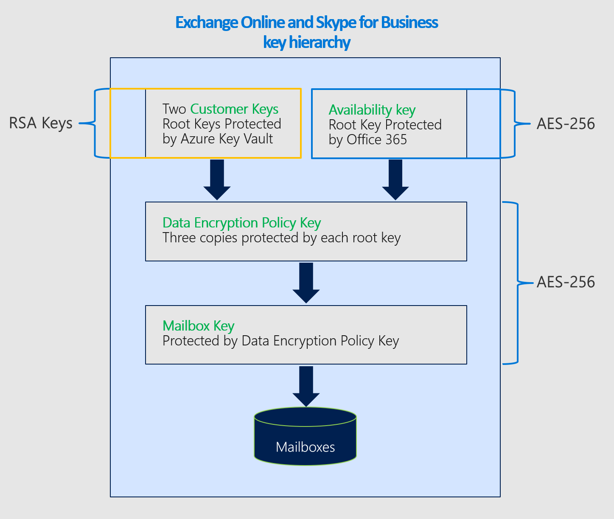

# Informazioni sulle chiavi di disponibilità per Customer Key

La chiave di disponibilità è una chiave radice generata ed eseguita automaticamente quando si crea un criterio di crittografia dei dati. Microsoft 365 archivia e protegge la chiave di disponibilità. La chiave di disponibilità è funzionalmente simile alle due chiavi radice fornite per la crittografia del servizio con customer key. La chiave di disponibilità esegue il wrapping delle chiavi di un livello inferiore nella gerarchia delle chiavi. A differenza delle chiavi fornite e gestite in Azure Key Vault, non è possibile accedere direttamente alla chiave di disponibilità. I servizi automatizzati di Microsoft 365 gestiscono la chiave di disponibilità a livello di programmazione. Questi servizi avviano operazioni automatizzate che non implicano mai l'accesso diretto alla chiave di disponibilità.

Lo scopo principale della chiave di disponibilità è fornire funzionalità di ripristino dalla perdita imprevista delle chiavi radice gestite. La perdita potrebbe essere il risultato di una gestione errata o di un'azione dannosa. Se si perde il controllo delle chiavi radice, contattare il supporto Tecnico Microsoft e Microsoft assisterà l'utente nel processo di ripristino utilizzando la chiave di disponibilità. Userai la chiave di disponibilità per eseguire la migrazione a un nuovo criterio di crittografia dei dati con nuove chiavi radice di cui esegui il provisioning.

L'archiviazione e il controllo della chiave di disponibilità sono deliberatamente diversi dalle chiavi di Azure Key Vault per tre motivi:

- La chiave di disponibilità offre una funzionalità di ripristino, "break-glass" se il controllo su entrambe le chiavi dell'insieme di credenziali delle chiavi di Azure viene perso.
- La separazione dei controlli logici e delle posizioni di archiviazione sicure garantisce una difesa approfondita e protegge dalla perdita di tutte le chiavi e dei dati da un singolo attacco o punto di errore.
- La chiave di disponibilità offre una funzionalità a disponibilità elevata se i servizi di Microsoft 365 non sono in grado di raggiungere le chiavi ospitate in Azure Key Vault a causa di errori temporanei. Questa regola si applica solo alla crittografia del servizio Exchange Online e Skype for Business. I file di SharePoint Online, OneDrive for Business e Teams non usano mai la chiave di disponibilità a meno che non si incarica esplicitamente Microsoft di avviare il processo di ripristino.

La condivisione della responsabilità di proteggere i dati, utilizzando un'ampia gamma di protezioni e processi per la gestione delle chiavi, riduce in ultima analisi il rischio che tutte le chiavi (e quindi i dati) andranno definitivamente perse o distrutte. Microsoft fornisce all'utente l'autorità esclusiva per la disabilitazione o la distruzione della chiave di disponibilità quando si esce dal servizio. Per impostazione predefinita, nessuno di Microsoft ha accesso alla chiave di disponibilità: è accessibile solo dal codice di servizio di Microsoft 365.

Per ulteriori informazioni su come proteggere le chiavi, vedere Il Centro protezione [Microsoft.](https://www.microsoft.com/trustcenter/Privacy/govt-requests-for-data)
  
## Utilizzi chiave disponibilità

La chiave di disponibilità offre funzionalità di ripristino per gli scenari in cui un malefattore esterno o un insider malintenzionato ruba il controllo dell'insieme di credenziali delle chiavi o quando una gestione errata accidentale comporta la perdita delle chiavi radice. Questa funzionalità di ripristino si applica a tutti i servizi di Microsoft 365 compatibili con customer key. I singoli servizi usano la chiave di disponibilità in modo diverso. Microsoft 365 usa solo la chiave di disponibilità nei modi descritti di seguito.

### Exchange Online e Skype for Business usa

Oltre alla funzionalità di ripristino, Exchange Online e Skype for Business usano la chiave di disponibilità per garantire la disponibilità dei dati durante problemi operativi temporanei o intermittenti relativi al servizio che accede alle chiavi radice. Quando il servizio non riesce a raggiungere una delle chiavi cliente in Azure Key Vault a causa di errori temporanei, il servizio usa automaticamente la chiave di disponibilità. Il servizio NON passa MAI direttamente alla chiave di disponibilità.

I sistemi automatizzati in Exchange Online e Skype for Business possono utilizzare la chiave di disponibilità durante gli errori temporanei per supportare servizi back-end automatizzati, ad esempio antivirus, individuazione elettronica, prevenzione della perdita dei dati, spostamenti delle cassette postali e indicizzazione dei dati.

### I file di SharePoint Online, OneDrive for Business e Teams vengono utilizzati

Per i file di SharePoint Online, OneDrive for Business e Teams, la chiave di disponibilità non viene mai utilizzata al di fuori della funzionalità di ripristino e i clienti devono indicare esplicitamente a Microsoft di avviare l'uso della chiave di disponibilità durante uno scenario di ripristino. Le operazioni di servizio automatizzate si basano esclusivamente sulle chiavi dei clienti nell'insieme di credenziali delle chiavi di Azure. Per informazioni approfondite sul funzionamento della gerarchia delle chiavi per questi servizi, vedere [How SharePoint Online, OneDrive for Business, and Teams files use the availability key.](#how-sharepoint-online-onedrive-for-business-and-teams-files-use-the-availability-key)

## Sicurezza della chiave di disponibilità

Microsoft condivide con l'utente la responsabilità della protezione dei dati creando un'istanza della chiave di disponibilità e adottando misure estese per proteggerla. Microsoft non espone ai clienti il controllo diretto della chiave di disponibilità. Ad esempio, è possibile ruotare solo le chiavi di cui si è proprietari in Azure Key Vault. Per ulteriori informazioni, vedere [Roll or rotate a customer key or an availability key](customer-key-availability-key-roll.md).

### Archivi segreti chiave disponibilità

Microsoft protegge le chiavi di disponibilità negli archivi segreti interni controllati dall'accesso, come azure Key Vault rivolto ai clienti. I controlli di accesso vengono implementati per impedire agli amministratori Microsoft di accedere direttamente ai segreti contenuti all'interno. Le operazioni dell'archivio segreto, tra cui la rotazione e l'eliminazione delle chiavi, si verificano tramite comandi automatizzati che non implicano mai l'accesso diretto alla chiave di disponibilità. Le operazioni di gestione dell'archivio segreto sono limitate a tecnici specifici e richiedono l'escalation dei privilegi tramite uno strumento interno, Lockbox. L'escalation dei privilegi richiede l'approvazione e la giustificazione del manager prima di essere concessa. Lockbox garantisce che l'accesso sia associato al tempo associato alla revoca automatica dell'accesso alla scadenza o alla disconnessione del tecnico.

**Le chiavi di disponibilità** di Exchange Online e Skype for Business sono archiviate in un archivio segreto di Active Directory di Exchange Online. Le chiavi di disponibilità vengono archiviate in modo sicuro all'interno di contenitori specifici del tenant all'interno del controller di dominio Active Directory. Questa posizione di archiviazione sicura è separata e isolata dall'archivio segreto dei file di SharePoint Online, OneDrive for Business e Teams.

Le chiavi di disponibilità dei file di **SharePoint Online, OneDrive for Business** e Teams vengono archiviate in un archivio segreto interno gestito dal team del servizio. Questo servizio di archiviazione segreti protetto dispone di server front-end con endpoint dell'applicazione e SQL database come back-end. Le chiavi di disponibilità vengono archiviate nel database di SQL e vengono incapsulate (crittografate) dalle chiavi di crittografia dell'archivio segreto che utilizzano una combinazione di AES-256 e HMAC per crittografare la chiave di disponibilità in pausa. Le chiavi di crittografia dell'archivio segreto vengono archiviate in un componente logicamente isolato dello stesso database di SQL e vengono ulteriormente crittografate con le chiavi RSA-2048 contenute nei certificati gestiti dall'autorità di certificazione (CA) Microsoft. Questi certificati vengono archiviati nei server front-end dell'archivio segreto che eseguono operazioni sul database.

### Difesa approfondita

Microsoft si avvale di una strategia di difesa approfondita per impedire a malintenzionati di influire sulla riservatezza, l'integrità o la disponibilità dei dati dei clienti archiviati nel cloud Microsoft. Vengono implementati controlli preventivi e detective specifici per proteggere l'archivio segreto e la chiave di disponibilità nell'ambito della strategia di sicurezza generale.

Microsoft 365 è stato creato per evitare un uso improprio della chiave di disponibilità. Il livello dell'applicazione è l'unico metodo tramite il quale le chiavi, inclusa la chiave di disponibilità, possono essere usate per crittografare e decrittografare i dati. Solo il codice del servizio Microsoft 365 può interpretare e attraversare la gerarchia delle chiavi per le attività di crittografia e decrittografia. L'isolamento logico esiste tra le posizioni di archiviazione delle chiavi dei clienti, le chiavi di disponibilità, altre chiavi gerarchiche e i dati dei clienti. Questo isolamento riduce il rischio di esposizione dei dati in caso di compromissione di una o più posizioni. Ogni livello della gerarchia include funzionalità di rilevamento delle intrusioni 24x7 per proteggere i dati e i segreti archiviati.

I controlli di accesso vengono implementati per impedire l'accesso non autorizzato ai sistemi interni, inclusi gli archivi segreti delle chiavi di disponibilità. I tecnici Microsoft non hanno accesso diretto agli archivi segreti delle chiavi di disponibilità. Per ulteriori dettagli sui controlli di accesso, vedere [Administrative Access Controls in Microsoft 365](/Office365/securitycompliance/office-365-administrative-access-controls-overview).

I controlli tecnici impediscono al personale Microsoft di accedere ad account di servizio con privilegi elevati, che potrebbero altrimenti essere utilizzati da utenti malintenzionati per rappresentare i servizi Microsoft. Ad esempio, questi controlli impediscono l'accesso interattivo.

I controlli di monitoraggio e registrazione della sicurezza sono un'altra protezione approfondita implementata per ridurre i rischi per i servizi Microsoft e i dati. I team dei servizi Microsoft hanno distribuito soluzioni di monitoraggio attive che generano avvisi e log di controllo. Tutti i team di servizio caricano i log in un archivio centrale in cui i log vengono aggregati ed elaborati. Gli strumenti interni esaminano automaticamente i record per verificare che i servizi funzionino in uno stato ottimale, resiliente e sicuro. L'attività insolita è contrassegnata per un'ulteriore revisione.

Qualsiasi evento di registro che indica una potenziale violazione dei criteri di sicurezza Microsoft viene immediatamente portato all'attenzione dei team di sicurezza Microsoft. La sicurezza di Microsoft 365 ha configurato avvisi per rilevare tentativi di accesso agli archivi segreti chiave di disponibilità. Gli avvisi vengono generati anche se il personale Microsoft tenta l'accesso interattivo agli account di servizio, che è proibito e protetto dai controlli di accesso. La sicurezza di Microsoft 365 rileva e avvisa anche le deviazioni del servizio Microsoft 365 dalle normali operazioni di base. I malfattori che tentano di utilizzare in modo improprio i servizi di Microsoft 365 attiverebbero avvisi che causano lo sfratto dell'autore del reato dall'ambiente cloud Microsoft.

## Usare la chiave di disponibilità per il ripristino da una perdita di chiave

Se si perde il controllo delle chiavi cliente, la chiave di disponibilità consente di recuperare e crittografare di nuovo i dati.

### Procedura di ripristino per Exchange Online e Skype for Business

Se si perde il controllo delle chiavi del cliente, la chiave di disponibilità offre la possibilità di recuperare i dati e riportare online le risorse di Microsoft 365. La chiave di disponibilità continua a proteggere i dati durante il ripristino. A livello elevato, per ripristinare completamente dalla perdita delle chiavi, è necessario creare una nuova protezione esecuzione programmi e spostare le risorse influenzate nel nuovo criterio.

Per crittografare i dati con le nuove chiavi del cliente, crea nuove chiavi in Azure Key Vault, crea una nuova protezione esecuzione programmi usando le nuove chiavi del cliente, quindi assegna la nuova protezione esecuzione programmi alle cassette postali attualmente crittografate con la precedente protezione esecuzione programmi per cui le chiavi sono state perse o compromesse.

Questo processo di crittografia può richiedere fino a 72 ore. Questa è la durata standard quando si modifica una protezione esecuzione programmi.
  
### Procedura di ripristino per i file di SharePoint Online, OneDrive for Business e Teams

Per i file di SharePoint Online, OneDrive for Business e Teams, la chiave di disponibilità non viene mai utilizzata al di fuori della funzionalità di ripristino. È necessario indicare esplicitamente a Microsoft di avviare l'uso della chiave di disponibilità durante uno scenario di ripristino. Per avviare il processo di ripristino, contattare Microsoft per attivare la chiave di disponibilità. Una volta attivata, la chiave di disponibilità viene utilizzata automaticamente per decrittografare i dati, consentendo di crittografare i dati con una protezione esecuzione programmi appena creata associata alle nuove chiavi del cliente.  

Questa operazione è proporzionale al numero di siti nell'organizzazione. Dopo aver chiamato Microsoft per usare la chiave di disponibilità, dovresti essere completamente online entro circa quattro ore.

## Come Exchange Online e Skype for Business usano la chiave di disponibilità

Quando si crea una protezione esecuzione programmi con la chiave del cliente, Microsoft 365 genera una chiave dei criteri di crittografia dei dati associata a tale protezione. Il servizio crittografa la chiave Protezione esecuzione programmi tre volte: una con ognuna delle chiavi del cliente e una con la chiave di disponibilità. Vengono archiviate solo le versioni crittografate della chiave Protezione esecuzione programmi e una chiave dep può essere decrittografata solo con le chiavi del cliente o con la chiave di disponibilità. La chiave DEP viene quindi utilizzata per crittografare le chiavi delle cassette postali, che crittografa singole cassette postali.
  
Microsoft 365 segue questo processo per decrittografare e fornire dati quando i clienti usano il servizio:
  
1. Decrittografare la chiave Protezione esecuzione programmi usando la chiave del cliente.

2. Utilizzare la chiave dep decrittografata per decrittografare una chiave della cassetta postale.

3. Utilizzare la chiave della cassetta postale decrittografata per decrittografare la cassetta postale stessa, consentendo di accedere ai dati all'interno della cassetta postale.

## Utilizzo della chiave di disponibilità per i file di SharePoint Online, OneDrive for Business e Teams

L'architettura e l'implementazione di SharePoint Online e OneDrive for Business per il codice "Customer Key" e la chiave di disponibilità sono diverse da Exchange Online e Skype for Business.
  
Quando un'organizzazione passa a chiavi gestite dal cliente, Microsoft 365 crea una chiave intermedia specifica dell'organizzazione (TIK). Microsoft 365 crittografa il CODICE TIK due volte, una con ognuna delle chiavi del cliente e archivia le due versioni crittografate del TIK. Vengono archiviate solo le versioni crittografate del TIK e un TIK può essere decrittografato solo con le chiavi del cliente. Il CODICE TIK viene quindi usato per crittografare le chiavi del sito, che vengono quindi usate per crittografare le chiavi BLOB (denominate anche chiavi di blocco file). A seconda delle dimensioni del file, il servizio può dividere un file in più blocchi di file ognuno con una chiave univoca. I BLOB (blocchi di file) vengono crittografati con le chiavi BLOB e archiviati nel servizio di archiviazione BLOB di Microsoft Azure.
  
Microsoft 365 segue questo processo per decrittografare e fornire i file dei clienti quando i clienti usano il servizio:

1. Decrittografare il CODICE TIK utilizzando il codice "Customer Key".

2. Utilizzare il codice TIK decrittografato per decrittografare una chiave del sito.

3. Usare la chiave del sito decrittografata per decrittografare una chiave BLOB.

4. Usare la chiave BLOB decrittografata per decrittografare il BLOB.

Microsoft 365 decrittografa un TIK emettendo due richieste di decrittografia a Azure Key Vault con un leggero offset. Il primo a terminare fornisce il risultato, annullando l'altra richiesta.
  
Nel caso in cui si perde l'accesso alle chiavi dei clienti, Microsoft 365 crittografa anche il CODICE TIK con una chiave di disponibilità e lo archivia insieme ai codici TIK crittografati con ogni chiave del cliente. Il CODICE TIK crittografato con la chiave di disponibilità viene utilizzato solo quando il cliente chiama Microsoft per integrare il percorso di ripristino quando ha perso l'accesso alle proprie chiavi, in modo dannoso o accidentale.
  
Per motivi di disponibilità e scalabilità, i TIK decrittografati vengono memorizzati nella cache di memoria limitata nel tempo. Due ore prima che una cache TIK scada, Microsoft 365 tenta di decrittografare ogni TIK. La decrittografia dei TIK estende la durata della cache. Se la decrittografia TIK non riesce per un periodo di tempo significativo, Microsoft 365 genera un avviso per notificare la progettazione prima della scadenza della cache. Solo se il cliente chiama Microsoft, Microsoft 365 avvierà l'operazione di ripristino, che prevede la decrittografia del TIK con la chiave di disponibilità archiviata nell'archivio segreto di Microsoft e l'onboarding del tenant di nuovo utilizzando il TIK decrittografato e un nuovo set di chiavi azure Vault fornite dal cliente.
  
Al giorno d'oggi, customer key è coinvolto nella catena di crittografia e decrittografia dei dati dei file di SharePoint Online archiviati nell'archivio BLOB di Azure, ma non elementi di elenchi o metadati di SharePoint Online archiviati nel database di SQL. Microsoft 365 non utilizza la chiave di disponibilità per i file di Exchange Online, Skype for Business, SharePoint Online, OneDrive for Business e Teams diversi dal caso descritto in precedenza, che viene avviato dal cliente. L'accesso umano ai dati dei clienti è protetto da Customer Lockbox.

## Trigger chiave di disponibilità

Microsoft 365 attiva la chiave di disponibilità solo in circostanze specifiche. Queste circostanze sono diverse in base al servizio.

### Trigger per Exchange Online e Skype for Business
  
1. Microsoft 365 legge la protezione esecuzione programmi a cui è assegnata la cassetta postale per determinare la posizione delle due chiavi cliente in Azure Key Vault.

2. Microsoft 365 sceglie in modo casuale una delle due chiavi del cliente dalla funzionalità Protezione esecuzione programmi e invia una richiesta a Azure Key Vault per annullare il wrapping della chiave dep usando il codice Cliente.

3. Se la richiesta di annullare il wrapping della chiave Dep usando il codice "Customer Key" ha esito negativo, Microsoft 365 invia una seconda richiesta ad Azure Key Vault, questa volta indicando l'uso del (secondo) codice Cliente alternativo.

4. Se la seconda richiesta di annullare il wrapping della chiave Protezione esecuzione programmi utilizzando il codice "Customer Key" ha esito negativo, Microsoft 365 esamina i risultati di entrambe le richieste.

    - Se l'esame determina che le richieste non sono riuscite a restituire un errore di sistema:

       - Microsoft 365 attiva la chiave di disponibilità per decrittografare la chiave Protezione esecuzione programmi.

       - Microsoft 365 utilizza quindi la chiave Protezione esecuzione programmi per decrittografare la chiave della cassetta postale e completare la richiesta dell'utente. 

       - In questo caso, Azure Key Vault non è in grado di rispondere o non è raggiungibile a causa di un errore temporaneo.

    - Se l'esame determina che le richieste non riuscite restituiscono ACCESS DENIED:

       - Ciò significa che sono state intraprese azioni intenzionali, involontarie o dannose per rendere non disponibili le chiavi del cliente (ad esempio, durante il processo di eliminazione dei dati come parte dell'uscita dal servizio).

       - In questo caso, la chiave di disponibilità verrà utilizzata solo per le azioni di sistema e non per le azioni dell'utente, la richiesta dell'utente avrà esito negativo e l'utente riceverà un messaggio di errore.

>[!IMPORTANT]
>Il codice del servizio Microsoft 365 ha sempre un token di accesso valido per il ragionamento sui dati dei clienti per fornire servizi cloud a valore aggiunto. Pertanto, fino a quando la chiave di disponibilità non è stata eliminata, può essere utilizzata come fallback per le azioni avviate da Exchange Online e Skype for Business, ad esempio la creazione dell'indice di ricerca o lo spostamento di cassette postali. Questo vale sia per gli errori temporanei che per le richieste ACCESS DENIED per Azure Key Vault.

### Trigger per i file di SharePoint Online, OneDrive for Business e Teams

Per i file di SharePoint Online, OneDrive for Business e Teams, la chiave di disponibilità non viene mai utilizzata al di fuori della funzionalità di ripristino e i clienti devono indicare esplicitamente a Microsoft di avviare l'uso della chiave di disponibilità durante uno scenario di ripristino.

## Log di controllo e chiave di disponibilità

I sistemi automatizzati in Microsoft 365 elaborano tutti i dati mentre attraversano il sistema per fornire servizi cloud, ad esempio anti-virus, e-discovery, prevenzione della perdita di dati e indicizzazione dei dati. Microsoft 365 non genera log visibili al cliente per questa attività. Inoltre, il personale Microsoft non accede ai dati come parte di queste normali operazioni di sistema.

### Registrazione delle chiavi di disponibilità di Exchange Online e Skype for Business

Quando Exchange Online e Skype for Business accedono alla chiave di disponibilità per fornire il servizio, Microsoft 365 pubblica i log visibili al cliente accessibili dal Centro sicurezza e conformità. Un record del registro di controllo per l'operazione della chiave di disponibilità viene generato ogni volta che il servizio utilizza la chiave di disponibilità. Un nuovo tipo di record denominato "Crittografia servizio chiave cliente" con tipo  di attività "Fallback alla chiave di disponibilità" consente agli amministratori di filtrare i risultati della ricerca nel log di controllo unificato per visualizzare i record delle chiavi di disponibilità.

I record di registro includono attributi quali data, ora, attività, ID organizzazione e ID criteri di crittografia dei dati. Il record è disponibile come parte dei log di controllo unificati ed è accessibile dalla scheda Ricerca log di controllo del Centro sicurezza & conformità.

I record delle chiavi di disponibilità di Exchange Online e Skype for Business usano lo [schema](/office/office-365-management-api/office-365-management-activity-api-schema#common-schema) comune dell'attività di gestione di Office 365 con parametri personalizzati aggiunti: ID criterio, ID versione chiave ambito e ID richiesta.

### Registrazione delle chiavi di disponibilità dei file di SharePoint Online, OneDrive for Business e Teams

La registrazione della chiave di disponibilità non è ancora disponibile per questi servizi. Per i file di SharePoint Online, OneDrive for Business e Teams, la chiave di disponibilità viene attivata solo da Microsoft, se richiesto dall'utente, a scopo di ripristino. Di conseguenza, si conosce già ogni evento in cui viene usata la chiave di disponibilità per questi servizi.

## Chiave disponibilità nella gerarchia customer key
  
Microsoft 365 usa la chiave di disponibilità per eseguire il wrapping del livello di chiavi più in basso nella gerarchia delle chiavi stabilita per la crittografia del servizio chiave cliente. Tra i servizi sono presenti gerarchie chiave diverse. Gli algoritmi delle chiavi differiscono anche tra le chiavi di disponibilità e altre chiavi nella gerarchia di ogni servizio applicabile. Gli algoritmi delle chiavi di disponibilità utilizzati dai diversi servizi sono i seguenti:

- Le chiavi di disponibilità di Exchange Online e Skype for Business usano AES-256.

- Le chiavi di disponibilità dei file di SharePoint Online, OneDrive for Business e Teams usano RSA-2048.

### Crittografia utilizzata per crittografare le chiavi per Exchange Online e Skype for Business

### Crittografia utilizzata per crittografare le chiavi per SharePoint Online e OneDrive for Business

## Articoli correlati

- [Crittografia del servizio con Customer Key](customer-key-overview.md)

- [Configurare il codice "Customer Key"](customer-key-set-up.md)

- [Gestire il codice Cliente](customer-key-manage.md)

- [Implementare o distribuire una Customer Key o una chiave di disponibilità](customer-key-availability-key-roll.md)