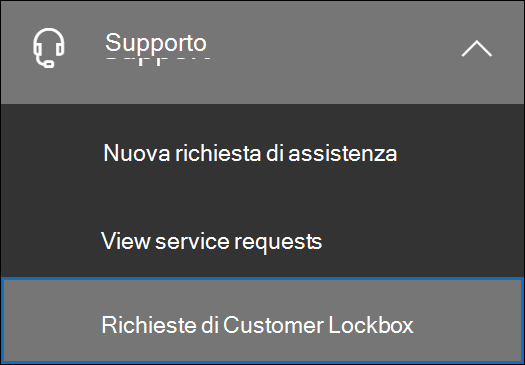
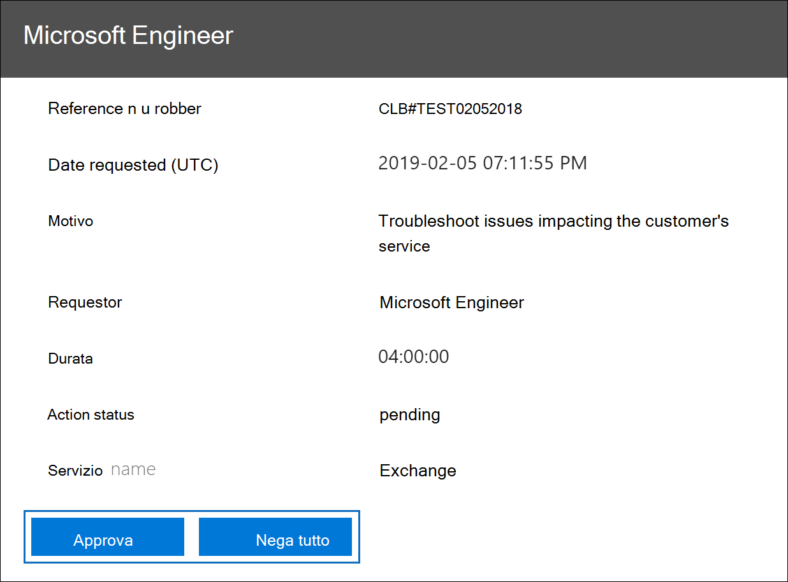
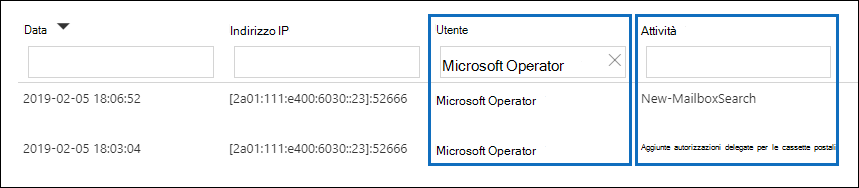
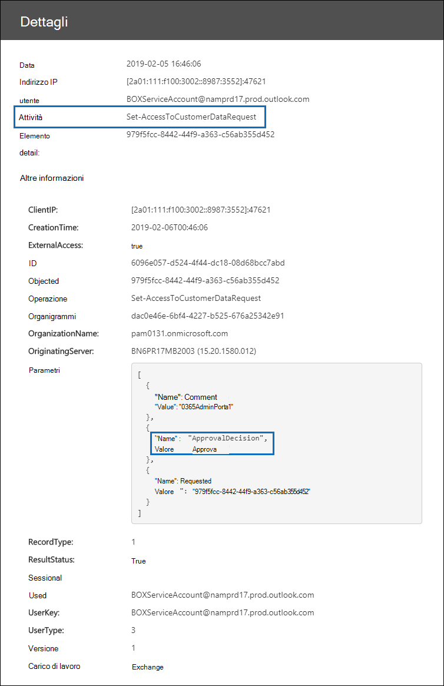

# Customer Lockbox in Office 365

In questo articolo vengono fornite indicazioni per la distribuzione e la configurazione di Customer Lockbox. Customer Lockbox supporta le richieste di accesso ai dati in Exchange Online, SharePoint Online e OneDrive for Business. Per consigliare il supporto per altri servizi, inviare una richiesta [all'indirizzo Office 365 UserVoice](https://office365.uservoice.com/).

Per visualizzare le opzioni per consentire agli utenti di usufruire delle offerte di conformità Microsoft 365, inclusa questa, a partire dal 1° aprile 2020, vedere le indicazioni sulle licenze [di Microsoft 365](/office365/servicedescriptions/microsoft-365-service-descriptions/microsoft-365-tenantlevel-services-licensing-guidance/microsoft-365-security-compliance-licensing-guidance)per la conformità & sicurezza.

Customer Lockbox garantisce che Microsoft non possa accedere al contenuto per eseguire un'operazione di servizio senza l'approvazione esplicita dell'utente. Customer Lockbox consente di accedere al flusso di lavoro di approvazione per le richieste di accesso ai contenuti.

A volte i tecnici Microsoft aiutano a risolvere i problemi segnalati dai clienti nel processo di supporto. In genere, i problemi vengono risolti con una vasta gamma di strumenti di telemetria e debug già disponibili per i servizi di Microsoft. Tuttavia, alcuni casi richiedono che un tecnico Microsoft acceda ai contenuti dei clienti per determinare la causa principale e risolvere il problema. Customer Lockbox richiede che il tecnico richieda l'accesso al cliente come fase finale del flusso di lavoro di approvazione. In questo modo le organizzazioni possono approvare o rifiutare queste richieste e fornire il controllo di accesso diretto al cliente.

### Video sulla panoramica di Customer Lockbox

> [!VIDEO https://www.microsoft.com/videoplayer/embed/8fecf10b-1f03-4849-8b67-76d3d2a43f26?autoplay=false]

## Flusso di lavoro di Customer Lockbox

I passaggi seguenti illustrano il tipico flusso di lavoro quando un tecnico Microsoft avvia una richiesta di Customer Lockbox:

1. Un utente di un'organizzazione ha un problema con la propria cassetta postale di Microsoft 365.

2. Dopo che l’utente ha tentato inutilmente di risolvere il problema, viene aperta una richiesta di servizio con il supporto Microsoft.

3. Un tecnico del supporto Microsoft esamina la richiesta di servizio e determina la necessità di accedere al tenant dell'organizzazione per risolvere il problema in Exchange Online.

4. Il tecnico del supporto Microsoft accede allo strumento di richiesta Customer Lockbox e crea una richiesta di accesso ai dati che include il nome del tenant dell'organizzazione, il numero di richiesta di servizio e il tempo stimato per cui il tecnico deve accedere ai dati.

5. Dopo che un responsabile del supporto Microsoft approva la richiesta, Customer Lockbox invia al responsabile approvazione designato dell'organizzazione una notifica tramite posta elettronica sulla richiesta di accesso in sospeso inviata da Microsoft.

    

   Chiunque sia assegnato al ruolo amministratore responsabile approvazione accesso [Customer Lockbox](/office365/admin/add-users/about-admin-roles) nell Microsoft 365'interfaccia di amministrazione può approvare le richieste di Customer Lockbox.

6. Il responsabile approvazione accede all'Microsoft 365 di amministrazione e approva la richiesta. Questo passaggio attiva la creazione di un record di controllo disponibile eseguendo una ricerca nel log di audit. Per ulteriori informazioni, vedere [Auditing Customer Lockbox requests](#auditing-customer-lockbox-requests).

   Se il cliente rifiuta la richiesta o non la approva entro 12 ore, la richiesta scade e non viene concesso alcun accesso al tecnico Microsoft.

   > [!IMPORTANT]
   > Microsoft non include collegamenti nelle notifiche di posta elettronica di Customer Lockbox che richiedono l'accesso a Office 365.

7. Dopo che il responsabile approvazione dell'organizzazione approva la richiesta, il tecnico Microsoft riceve il messaggio di approvazione, accede al tenant in Exchange Online e risolve il problema del cliente. I tecnici Microsoft mantengono l’accesso per il tempo definito nella richiesta per risolvere il problema, dopo il quale l'accesso viene automaticamente revocato.

> [!NOTE]
> Tutte le azioni eseguite da un tecnico Microsoft vengono registrate log di audit. È possibile cercare ed esaminare questi record di controllo.

## Attivare o disattivare le richieste di Customer Lockbox

È possibile attivare i controlli di Customer Lockbox nell'interfaccia di amministrazione di Microsoft 365. Quando si attiva Customer Lockbox, Microsoft deve ottenere l'approvazione dell'organizzazione prima di accedere a qualsiasi contenuto del tenant.

1. Utilizzando un account aziendale o dell'istituto di istruzione a cui è assegnato l'amministratore globale o il ruolo responsabile approvazione accesso Customer **Lockbox,** passare [https://admin.microsoft.com](https://admin.microsoft.com) a e accedere.

2. Scegliere **Impostazioni > org Impostazioni**.

3. Seleziona **Sicurezza & Privacy** Customer Lockbox Edit e quindi sposta l'interruttore su Attivato o Disattivato per attivare o  >    >  disattivare la funzionalità.  

    

## Approvare o rifiutare una richiesta di Customer Lockbox

1. Utilizzando un account aziendale o dell'istituto di istruzione a cui è assegnato l'amministratore globale o il ruolo responsabile approvazione accesso Customer **Lockbox,** passare [https://admin.microsoft.com](https://admin.microsoft.com) a e accedere.

2. Scegliere **Supporto > richieste Customer Lockbox**.

    

    Viene visualizzato un elenco di richieste Customer Lockbox.

    

3. Selezionare una richiesta Customer Lockbox, quindi scegliere **Approva** o **Nega.**

    

    Viene visualizzato un messaggio di conferma sull'approvazione della richiesta Customer Lockbox.

    

> [!NOTE]
> Usare il cmdlet Set-AccessToCustomerDataRequest per approvare, negare o eliminare le richieste di Customer Lockbox di Microsoft 365 che controllano l'accesso ai dati da parte dei tecnici del supporto Microsoft. Per ulteriori informazioni, vedere [Set-AccessToCustomerDataRequest](/powershell/module/exchange/set-accesstocustomerdatarequest).

## Controllare le richieste di Customer Lockbox

I record di controllo corrispondenti alle richieste di Customer Lockbox vengono registrati nel log di controllo. È possibile accedere a questi log utilizzando lo strumento di ricerca [dei log](search-the-audit-log-in-security-and-compliance.md) di controllo nel Centro sicurezza & conformità. Le azioni correlate all'accettazione o al rifiuto di una richiesta Customer Lockbox e le azioni eseguite dai tecnici Microsoft (quando le richieste di accesso vengono approvate) vengono registrate nel registro di controllo. È possibile cercare ed esaminare questi record di controllo.

### Cercare nel log di controllo le attività correlate alle richieste di Customer Lockbox

Prima di usare il log di audit per tenere traccia delle richieste per Customer Lockbox, è necessario eseguire alcuni passaggi per configurare la registrazione di audit. Per ulteriori informazioni, vedere [Search the audit log in the Security & Compliance Center.](/office365/securitycompliance/search-the-audit-log-in-security-and-compliance#before-you-begin) Dopo aver completato l'installazione, eseguire la procedura seguente per creare una query di ricerca del log di controllo per restituire i record di controllo correlati a Customer Lockbox:

1. Passare a [https://protection.office.com](https://protection.office.com).
  
2. Accedere usando l'account di lavoro o della scuola.

3. Nel riquadro sinistro del Centro sicurezza & conformità scegliere Ricerca & **ricerca log**  >  **di controllo**.

    Viene **visualizzata la pagina Ricerca log** di controllo.

    
  
4. Configurare i criteri di ricerca seguenti: 

    1. **Attività:** lasciare vuoto questo campo in modo che la ricerca restituisca record di controllo per tutte le attività. Ciò è necessario per restituire tutti i record di controllo relativi alle richieste di Customer Lockbox e alle attività corrispondenti eseguite dai tecnici Microsoft.

    1. **Data inizio** e **Data fine:** selezionare un intervallo di data e ora per visualizzare gli eventi che si sono verificati all'interno di tale periodo.

    1. **Utenti:** lasciare vuoto questo campo.

    1. **File, cartella o sito:** lasciare vuoto questo campo.

5. Fare clic su **Cerca** per eseguire la ricerca usando i criteri di ricerca.

    I risultati della ricerca vengono caricati e dopo alcuni istanti vengono visualizzati in **Risultati** nella pagina **Ricerca log di** controllo.

6. Fare **clic su** Filtra risultati nella pagina dei risultati di ricerca ed eseguire una delle operazioni seguenti:

   - Per visualizzare i record di controllo relativi a un responsabile approvazione nell'organizzazione che approva  o nega una richiesta Customer Lockbox: nella casella sotto la colonna Attività digitare **Set-AccessToCustomerDataRequest**.

   - Per visualizzare i record di controllo relativi a un tecnico Microsoft che esegue  azioni in risposta a una richiesta di Customer Lockbox approvata: nella casella sotto la colonna Utente digitare **Operatore Microsoft**. Nella **colonna Attività** viene visualizzata l'azione eseguita dal tecnico.

      

7. Nell'elenco dei risultati fare clic su un record di controllo per visualizzarlo.

### Record di controllo per una richiesta di accesso di Customer Lockbox

Quando una persona dell'organizzazione approva o nega una richiesta Customer Lockbox, un record di controllo viene registrato nel log di controllo. Il record contiene le informazioni seguenti:

| Proprietà del record di controllo| Descrizione|
|:---------- |:----------|
| Data       | La data e l'ora in cui la richiesta di Customer Lockbox è stata approvata o rifiutata.
| Indirizzo IP | L'indirizzo IP del computer utilizzato dal responsabile approvazione per approvare o rifiutare una richiesta. |
| Utente       | L'account di servizio \[ BOXServiceAccount@ customerforest \] .prod.outlook.com.            |
| Attività   | Set-AccessToCustomerDataRequest; si tratta dell'attività di controllo che viene registrata quando si approva o si rifiuta una richiesta di Customer Lockbox.                                |
| Elemento       | Guid della richiesta Customer Lockbox                             |

Lo screenshot seguente mostra un esempio di record del log di controllo che corrisponde a una richiesta Customer Lockbox approvata. Se una richiesta Customer Lockbox è stata rifiutata, il valore del **parametro ApprovalDecision** sarà **Deny**.

> [!TIP]
> Per visualizzare informazioni più dettagliate in un record di controllo, fare clic **su Altre informazioni.**

### Record di controllo per un'azione eseguita da un tecnico Microsoft

Le azioni eseguite da un tecnico Microsoft dopo l'approvazione di una richiesta di Customer Lockbox, che potrebbe comportare l'accesso ai contenuti del cliente, vengono registrate nel log di audit. Questi record contengono le informazioni seguenti.

| Proprietà del record di controllo| Descrizione|
|:---------- |:----------|
| Data       | Data e ora in cui è stata eseguita l'azione. Tenere presente che l'orario in cui è stata eseguita l'azione sarà entro 4 ore dall'approvazione della richiesta di Customer Lockbox.              |
| Indirizzo IP | L'indirizzo IP del tecnico Microsoft del computer utilizzato. |
| Utente       | Operatore Microsoft; questo valore indica che questo record è correlato a una richiesta di Customer Lockbox.                                  |
| Attività   | Nome dell'attività eseguita dal tecnico Microsoft.|
| Elemento       | \<empty\>                                             |

## Domande frequenti

#### A quali Microsoft 365 si applica Customer Lockbox?

Customer Lockbox è attualmente supportato in Exchange Online, SharePoint Online e OneDrive for Business.

#### Customer Lockbox è disponibile per tutti i clienti?

Customer Lockbox è incluso con le sottoscrizioni Microsoft 365 o Office 365 E5 e può essere aggiunto ad altri piani con un abbonamento a Information Protection and Compliance o a un componente aggiuntivo Advanced Compliance. Per altre [informazioni, vedi Piani e](https://products.office.com/business/office-365-enterprise-e5-business-software) prezzi.

#### Che cos'è il contenuto del cliente?

I contenuti dei clienti sono i dati creati dagli utenti Microsoft 365 servizi e applicazioni. Esempi di contenuto personalizzato includono:

- Corpo dei messaggi di posta elettronica o allegati di posta elettronica

- Contenuto del sito di SharePoint

- Informazioni nel corpo di un file di SharePoint

- Skype for Business del file di presentazione

- Messaggi istantanei o conversazioni vocali

- BLOB o dati di archiviazione strutturati generati dal cliente (ad esempio, contenitori SQL)

- Informazioni di sicurezza di proprietà del cliente (ad esempio, certificati, chiavi di crittografia e password)

- Inferenze e tutte le inferenze successive, se il contenuto del cliente rimane

Per ulteriori informazioni sul contenuto dei clienti in Office 365, vedere il Centro [protezione Office 365 clienti](https://products.office.com/business/office-365-trust-center-privacy/).

#### Who viene inviata una notifica quando viene richiesta l'accesso al contenuto?

Gli amministratori globali e tutti gli utenti a cui è stato assegnato il ruolo amministratore responsabile approvazione accesso Customer Lockbox vengono avvisati. Questi sono anche gli stessi utenti che possono approvare le richieste di Customer Lockbox.

#### Who approvare o rifiutare queste richieste nell'organizzazione?

Gli amministratori globali e tutti gli utenti a cui è stato assegnato il ruolo amministratore responsabile approvazione accesso Customer Lockbox possono approvare le richieste di Customer Lockbox. I clienti controllano queste assegnazioni di ruolo nelle loro organizzazioni.

#### Come posso acconsentire esplicitamente a Customer Lockbox?

Un amministratore globale può abilitare e configurare Customer Lockbox nell'Microsoft 365 o Microsoft 365 di amministrazione.

#### Se approvo una richiesta Customer Lockbox, cosa può fare il tecnico e come posso sapere cosa ha fatto il tecnico Microsoft?

Dopo aver approvato una richiesta Customer Lockbox, il tecnico Microsoft ha concesso questi privilegi necessari per accedere al contenuto del cliente utilizzando cmdlet pre-approvati. Le azioni intraprese dai tecnici Microsoft in risposta alle richieste di Customer Lockbox vengono registrate e accessibili nel log di controllo nel Centro sicurezza & conformità.

#### Come si fa a sapere che Microsoft segue il processo di approvazione?

È possibile fare riferimento incrociato alle notifiche di approvazione della posta elettronica inviate agli amministratori e ai responsabili approvazione dell'organizzazione con la cronologia delle richieste di Customer Lockbox nell'interfaccia di amministrazione Microsoft 365 clienti.

Customer Lockbox è incluso nell'ultimo report di controllo [di SOC 1 SSAE 16.](https://servicetrust.microsoft.com/ViewPage/MSComplianceGuide?command=Download&downloadType=Document&downloadId=91592749-e86a-43ac-801e-121382614681&docTab=4ce99610-c9c0-11e7-8c2c-f908a777fa4d_SOC%20%2F%20SSAE%2016%20Reports) Per ulteriori dettagli, è possibile trovare i report più recenti in [Microsoft Service Trust Portal.](https://servicetrust.microsoft.com/ViewPage/MSComplianceGuide?command=Download&downloadType=Document&downloadId=91592749-e86a-43ac-801e-121382614681&docTab=4ce99610-c9c0-11e7-8c2c-f908a777fa4d_SOC%20%2F%20SSAE%2016%20Reports)

#### Microsoft può modificare l'elenco dei responsabili approvazione per il tenant? In caso contrario, come viene impedito?

Solo un amministratore globale dell'organizzazione può specificare chi può approvare le richieste di Customer Lockbox. Ciò significa che solo i membri del gruppo di amministratori globali in Azure Active Directory possono specificare chi può approvare la richiesta. L'appartenenza al gruppo di amministratori globali in Azure Active Directory viene gestita solo dall'organizzazione.

#### Cosa succede se sono necessarie ulteriori informazioni su una richiesta di accesso al contenuto per approvarla?

Ogni richiesta Customer Lockbox contiene un numero Microsoft 365 richiesta di servizio. È possibile contattare il Supporto Tecnico Microsoft e fare riferimento a questo numero di servizio per ottenere ulteriori informazioni sulla richiesta.

#### Quando una richiesta customer lockbox viene approvata, per quanto tempo sono valide le autorizzazioni?

Attualmente la durata massima delle autorizzazioni di accesso concesse al tecnico Microsoft è di 4 ore. Il tecnico Microsoft può anche richiedere un periodo più breve.

#### Come posso ottenere una cronologia di tutte le richieste di Customer Lockbox?

Tutte le richieste di Customer Lockbox vengono visualizzate nell'Microsoft 365 di amministrazione.

#### Come è possibile correlare le richieste di accesso al contenuto ai log di controllo correlati?

Il feed attività del Centro conformità contiene le attività di log di Customer Lockbox. I clienti possono fare riferimento incrociato alle attività del registro Customer Lockbox dal feed attività rispetto alla richiesta di posta elettronica che ricevono.

#### Cosa succede quando un cliente non risponde a una richiesta di Customer Lockbox?

Le richieste di Customer Lockbox hanno una durata predefinita di 12 ore. Se non rispondi a una richiesta entro 12 ore, la richiesta scade.

#### Cosa fa Microsoft quando un cliente rifiuta una richiesta Customer Lockbox?

Se un cliente rifiuta una richiesta Customer Lockbox, non viene eseguito alcun accesso al contenuto del cliente. Se un utente dell'organizzazione continua a verificarsi un problema di servizio che richiede a Microsoft di accedere al contenuto del cliente per risolvere il problema, il problema del servizio potrebbe persistere e Microsoft informerà l'utente.

#### Customer Lockbox protegge dalle richieste di dati provenienti da forze dell'ordine o da terze parti?

No. Microsoft prende sul serio le richieste di terze parti per i dati dei clienti. In qualità di provider di servizi cloud, Microsoft si fa sempre garante della privacy dei dati dei clienti. Nel caso in cui riceviamo un mandato di comparizione, Microsoft tenta sempre di reindirizzare la terza parte al cliente per ottenere le informazioni. (Leggere il blog di Brad Smith: [Protezione dei dati dei clienti dallo snooping governativo](https://blogs.microsoft.com/blog/2013/12/04/protecting-customer-data-from-government-snooping/)). Microsoft pubblica [periodicamente informazioni dettagliate sulle](https://www.microsoft.com/corporate-responsibility/lerr) richieste delle forze dell'ordine ricevute da Microsoft.

Per ulteriori [informazioni, vedere](https://www.microsoft.com/trustcenter/default.aspx) il Centro protezione Microsoft relativo alle richieste  di dati di terze parti e la sezione "Divulgazione dei dati dei clienti" nelle Condizioni dei Servizi online.

#### In che modo Microsoft garantisce che un membro del personale non abbia accesso permanente ai contenuti dei clienti nelle Office 365 aziendali?

Microsoft implementa ampie misure preventive tramite sistemi di controllo dell'accesso e misure investigative per identificare e affrontare i tentativi di aggirare questi sistemi di controllo di accesso. Microsoft 365 funziona con i principi dei privilegi minimi e dell'accesso just-in-time. Pertanto, nessun personale Microsoft dispone dell'autorizzazione per accedere ai contenuti dei clienti in modo continuativo. Se l'autorizzazione viene concessa, ha una durata limitata. 

Microsoft 365 utilizza un sistema di controllo di accesso denominato *Lockbox* per elaborare le richieste di autorizzazioni che concedono la possibilità di eseguire funzioni operative e amministrative all'interno del servizio. Un operatore deve richiedere l'accesso al contenuto del cliente tramite Lockbox, che richiede quindi a una seconda persona di eseguire un'azione sulla richiesta (ad esempio approvarla) prima che venga concesso l'accesso. La seconda persona non può essere il richiedente e deve essere designata per approvare l'accesso al contenuto del cliente. Solo se la richiesta viene approvata, l'operatore acquisisce l'accesso temporaneo al contenuto del cliente. Dopo la scadenza del periodo di elevazione, Lockbox revoca l'accesso.

Per ulteriori informazioni [sulle](https://www.microsoft.com/licensing/product-licensing/products) procedure generali di sicurezza di Microsoft, fare riferimento alle Condizioni per i Servizi online.

#### In quali circostanze i tecnici Microsoft devono accedere ai miei contenuti?

Lo scenario più comune in cui i tecnici Microsoft devono accedere ai contenuti dei clienti è quando il cliente effettua una richiesta di supporto che richiede l'accesso per la risoluzione dei problemi. Un principio fondamentale di Microsoft 365 è che il servizio opera senza l'accesso microsoft al contenuto dei clienti. Quasi tutte le operazioni di servizio eseguite da Microsoft sono completamente automatizzate e il coinvolgimento umano è altamente controllato e astratto dal contenuto dei clienti. L'obiettivo Microsoft 365 è l'accesso al contenuto del cliente per supportare il servizio non è necessario finché il cliente non approva una richiesta specifica per Microsoft Access.

#### Ho già pensato che i miei dati erano sicuri con il cloud Microsoft, quindi perché ho bisogno di Customer Lockbox?

Customer Lockbox offre un ulteriore livello di controllo offrendo ai clienti la possibilità di concedere autorizzazioni di accesso esplicite per le operazioni di servizio. Dimostrando che sono in atto procedure per l'autorizzazione esplicita di accesso ai dati, Customer Lockbox aiuta anche i clienti a rispettare determinati obblighi di conformità come HIPAA e FEDRAMP.