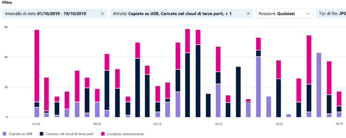

# Introduzione a Esplora attivitàGet started with activity explorer

Le schede Panoramica ed Esplora contenuto della classificazione dei dati consentono di ottenere informazioni sul contenuto individuato ed etichettato nonché di sapere dove si trova tale contenuto.The data classification overview and content explorer tabs give you visibility into what content has been discovered and labeled, and where that content is. Esplora attività estende questa famiglia di funzionalità, consentendo di monitorare le operazioni eseguite sul contenuto etichettato.Activity explorer rounds out this suite of functionality by allowing you to monitor what's being done with your labeled content. Le informazioni di Esplora attività sono visualizzate in ordine cronologico.Activity explorer provides a historical view.

Sono disponibili per l'uso oltre 30 filtri diversi, alcuni dei quali sono:There are over 30 different filters available for use, some are:

- intervallo di datedate range
- tipo di attivitàactivity type
- posizionelocation
- utenteuser
- etichetta di riservatezzasensitivity label
- etichetta di conservazioneretention label
- percorso filefile path
- Criteri DLPDLP policy

## PrerequisitiPrerequisites

A ogni account che accede e usa la classificazione dei dati deve essere assegnata una licenza da uno di questi abbonamenti:Every account that accesses and uses data classification must have a license assigned to it from one of these subscriptions:

- Microsoft 365 (E5)Microsoft 365 (E5)
- Office 365 (E5)Office 365 (E5)
- Componente aggiuntivo Advanced Compliance (E5)Advanced Compliance (E5) add-on
- Componente aggiuntivo Advanced Threat Intelligence (E5)Advanced Threat Intelligence (E5) add-on

### AutorizzazioniPermissions

 Per accedere alla scheda Esplora attività, è necessario che a un account sia assegnata l'appartenenza a uno di questi ruoli o gruppi di ruoli.In order to get access to the activity explorer tab, an account must be assigned membership in any one of these roles or role groups.

**Gruppi di ruoli di Microsoft 365****Microsoft 365 role groups**

- Amministratore globaleGlobal administrator
- Amministratore di conformitàCompliance administrator
- Amministratore della sicurezzaSecurity administrator
- Amministratore dati di conformitàCompliance data administrator

## Tipo di attivitàActivity type

Microsoft 365 monitora e crea report sui tipi di attività in SharePoint Online e OneDrive, ad esempio:Microsoft 365 monitors and reports on types of activities across SharePoint Online, and OneDrive like:

- Etichetta applicatalabel applied
- Etichetta modificata (sottoposta a upgrade o downgrade oppure rimossa)label changed (upgraded, downgraded, or removed)
- Simulazione di etichettatura automaticaauto-labeling simulation

Conoscere le azioni intraprese sul contenuto etichettato sensibile consente di verificare l'efficacia dei controlli già implementati, ad esempio i [criteri di prevenzione della perdita dei dati](data-loss-prevention-policies.md).The value of understanding what actions are being taken with your sensitive labeled content is that you can see if the controls that you have already put into place, such as [data loss prevention policies](data-loss-prevention-policies.md) are effective or not. Se non sono efficaci o se si individua un comportamento imprevisto, ad esempio un numero elevato di elementi etichettati come `highly confidential` declassato a `general`, è possibile gestire i vari criteri e intraprendere nuove azioni per limitare il comportamento indesiderato.If not, or if you discover something unexpected, such as a large number of items that are labeled `highly confidential` and are downgraded `general`, you can manage your various policies and take new actions to restrict the undesired behavior.

> [!NOTE]
> Esplora risorse non esegue il monitoraggio delle attività di conservazione per Exchange Online.Activity explorer doesn't currently monitor retention activities for Exchange Online.

## Vedere ancheSee also
- [Etichette di riservatezzaSensitivity labels](sensitivity-labels.md)
- [Etichette di conservazioneRetention labels](labels.md)
- [Definizioni delle entità tipo di informazioni sensibiliSensitive information type entity definitions](sensitive-information-type-entity-definitions.md)
- [Panoramica dei criteri di conservazioneOverview of retention policies](retention-policies.md)
