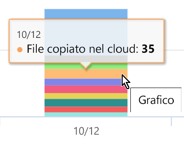

# Visualizzare le attività sul contenuto etichettato (anteprima)View activity on your labeled content (preview)

Le schede Panoramica ed Esplora contenuto della classificazione dei dati consentono di ottenere informazioni sul contenuto individuato ed etichettato nonché di sapere dove si trova tale contenuto.The data classification overview and content explorer tabs give you visibility into what content has been discovered and labeled, and where that content is. Esplora attività estende questa famiglia di funzionalità, consentendo di monitorare le operazioni eseguite sul contenuto etichettato.Activity explorer rounds out this suite of functionality by allowing you to monitor what's being done with your labeled content. Le informazioni di Esplora attività sono visualizzate in ordine cronologico.Activity explorer provides a historical view.

È possibile filtrare i dati in base a:You can filter the data by:

- intervallo di datedate range
- tipo di attivitàactivity type
- posizionelocation
- utenteuser
- etichetta di riservatezzasensitivity label
- etichetta di conservazioneretention label

È possibile visualizzare i dati sotto forma di elenco o grafico a barre.You can view the data either as a list or a bar graph.

## PrerequisitiPrerequisites

A ogni account che accede e usa Esplora attività deve essere assegnata una licenza da uno di questi abbonamenti:Every account that accesses and uses activity explorer must have a license assigned to it from one of these subscriptions:

- Microsoft 365 (E5)Microsoft 365 (E5)
- Office 365 (E5)Office 365 (E5)
- Componente aggiuntivo Advanced Compliance (E5)Advanced Compliance (E5) add-on
- Componente aggiuntivo Advanced Threat Intelligence (E5)Advanced Threat Intelligence (E5) add-on

## Tipo di attivitàActivity type

Microsoft 365 monitora e crea report relativi a 12 tipi di attività in SharePoint Online, OneDrive ed endpoint.Microsoft 365 monitors and reports on 12 types of activities across SharePoint Online, OneDrive and endpoints. Gli endpoint sono dispositivi utente che eseguono Windows 10.Endpoints are user devices running Windows 10.

- File creatoFile created
- File modificatoFile modified
- File rinominatoFile renamed
- File copiato nel cloudFile copied to cloud
- File utilizzato da un'app non consentitaFile accessed by unallowed app
- File stampatoFile printed
- File copiato su supporto rimovibileFile copied to removable media
- File copiato in una condivisione di reteFile copied to network share
- File lettoFile read
- File copiato negli Appuntifile copied to clipboard
- Etichetta applicataLabel applied
- Etichetta modificata (sottoposta a upgrade o downgrade oppure rimossa)Label changed (upgraded, downgraded, or removed)

Conoscere le azioni intraprese sul contenuto etichettato sensibile consente di verificare l'efficacia dei controlli già implementati, ad esempio i [criteri di prevenzione della perdita dei dati](data-loss-prevention-policies.md).The value of understanding what actions are being taken with your sensitive labeled content is that you can see if the controls that you have already put into place, such as [data loss prevention policies](data-loss-prevention-policies.md) are effective or not. Se non sono efficaci o se si individua un comportamento imprevisto, ad esempio un numero elevato di elementi etichettati come `highly confidential` declassato a `general`, è possibile gestire i vari criteri e intraprendere nuove azioni per limitare il comportamento indesiderato.If not, or if you discover something unexpected, such as a large number of items that are labeled `highly confidential` and are downgraded `general`, you can manage your various policies and take new actions to restrict the undesired behavior.

Dopo aver impostato i filtri, è possibile:Once your filters are set, you can:

- passare con il mouse su un segmento del grafico a barre per visualizzare il numero di elementi che rientrano in tale categoria hover over a segment of the bar chart to see the number of items that fall into that category 
- esportare i datiexport the data
- selezionare un determinato elemento nell'elenco e visualizzare i dettagli dell'azione nel riquadro a comparsaselect any given item from the list and view the details of the action in the fly-out

## Vedere ancheSee also
- [Etichette di riservatezzaSensitivity labels](sensitivity-labels.md)
- [Etichette di conservazioneRetention labels](labels.md)
- [Tipi di informazioni riservate disponibili da cercareWhat the sensitive information types look for](what-the-sensitive-information-types-look-for.md)
- [Panoramica dei criteri di conservazioneOverview of retention policies](retention-policies.md)
