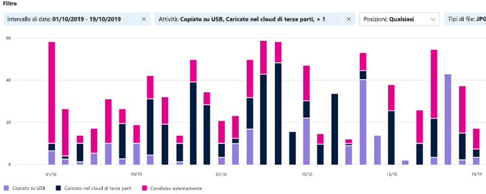
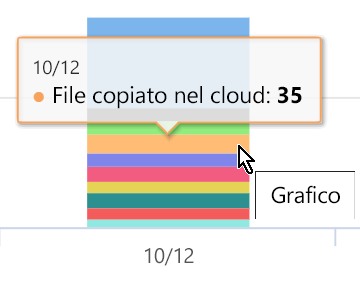

# Visualizzare le attività sul contenuto etichettato (anteprima)

Le schede Panoramica ed Esplora contenuto della classificazione dei dati consentono di ottenere informazioni sul contenuto individuato ed etichettato nonché di sapere dove si trova tale contenuto. Esplora attività estende questa famiglia di funzionalità, consentendo di monitorare le operazioni eseguite sul contenuto etichettato. Le informazioni di Esplora attività sono visualizzate in ordine cronologico.

È possibile filtrare i dati in base a:

- intervallo di date
- tipo di attività
- posizione
- utente
- etichetta di riservatezza
- etichetta di conservazione

È possibile visualizzare i dati sotto forma di elenco o grafico a barre.

## Prerequisiti

A ogni account che accede e usa Esplora attività deve essere assegnata una licenza da uno di questi abbonamenti:

- Microsoft 365 (E5)
- Office 365 (E5)
- Componente aggiuntivo Advanced Compliance (E5)
- Componente aggiuntivo Advanced Threat Intelligence (E5)

## Tipo di attività

Microsoft 365 monitora e crea report relativi a 12 tipi di attività in SharePoint Online, OneDrive ed endpoint. Gli endpoint sono dispositivi utente che eseguono Windows 10.

- File creato
- File modificato
- File rinominato
- File copiato nel cloud
- File utilizzato da un'app non consentita
- File stampato
- File copiato su supporto rimovibile
- File copiato in una condivisione di rete
- File letto
- File copiato negli Appunti
- Etichetta applicata
- Etichetta modificata (sottoposta a upgrade o downgrade oppure rimossa)

Conoscere le azioni intraprese sul contenuto etichettato sensibile consente di verificare l'efficacia dei controlli già implementati, ad esempio i [criteri di prevenzione della perdita dei dati](data-loss-prevention-policies.md). Se non sono efficaci o se si individua un comportamento imprevisto, ad esempio un numero elevato di elementi etichettati come `highly confidential` declassato a `general`, è possibile gestire i vari criteri e intraprendere nuove azioni per limitare il comportamento indesiderato.

Dopo aver impostato i filtri, è possibile:

- passare con il mouse su un segmento del grafico a barre per visualizzare il numero di elementi che rientrano in tale categoria 
- esportare i dati
- selezionare un determinato elemento nell'elenco e visualizzare i dettagli dell'azione nel riquadro a comparsa

## Vedere anche
- [Etichette di riservatezza](sensitivity-labels.md)
- [Etichette di conservazione](labels.md)
- [Tipi di informazioni riservate disponibili da cercare](what-the-sensitive-information-types-look-for.md)
- [Panoramica dei criteri di conservazione](retention-policies.md)
