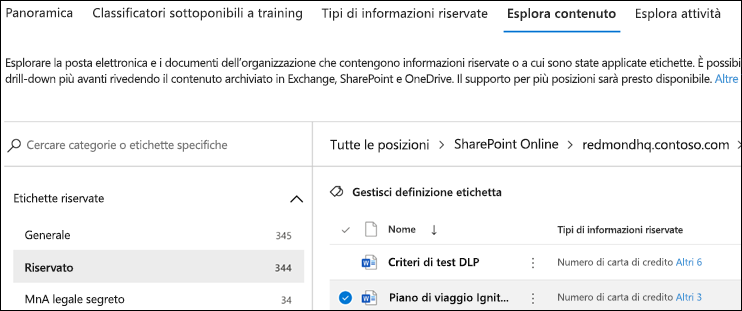

# Utilizzo di Esplora contenuto di classificazione dei dati (anteprima)Using data classification content explorer (preview)

Esplora contenuto di classificazione dei dati consente di visualizzare in modo nativo gli elementi che sono stati riepilogati nella pagina di panoramica.The data classification content explorer allows you to natively view the items that were summarized on the overview page.

## Esplora contenutoContent explorer

Esplora contenuto mostra uno snapshot corrente degli elementi che hanno un'etichetta di riservatezza, un'etichetta di conservazione o sono stati classificati come tipo di informazioni riservate nell'organizzazione.Content explorer is a current snapshot of the items that have a sensitivity label, a retention label or have been classified as a sensitive information type in your organization.

### Tipi di informazioni sensibiliSensitive information types

I [criteri di prevenzione della perdita dei dati](data-loss-prevention-policies.md) aiutano a proteggere le informazioni riservate definite come **tipo di informazioni sensibili**.A DLP policy can help protect sensitive information, which is defined as a **sensitive information type**. Microsoft 365 include le [definizioni per molti tipi di informazioni sensibili comuni](what-the-sensitive-information-types-look-for.md) in varie aree geografiche, pronte per l'uso.Office 365 includes definitions for many common sensitive information types across many different regions that are ready for you to use, such as a credit card number, bank account numbers, national ID numbers, and passport numbers. Ad esempio, un numero di carta di credito, numeri di conto corrente bancario, numeri di documento di identità e numeri di servizio Windows Live ID.For example, a credit card number, bank account numbers, national ID numbers, and Windows Live ID service numbers.

### Etichette di riservatezzaSensitivity labels

Un'[etichetta di sensibilità](sensitivity-labels.md) è semplicemente un contrassegno che indica il valore dell'elemento per l'organizzazione.A [sensitivity label](sensitivity-labels.md) is simply a tag that indicates the value of the item to your organization. Può essere applicata manualmente o automaticamente.It can be applied manually, or automatically. Una volta applicata, viene incorporata nel documento e lo seguirà ovunque.Once applied it gets embedded in the document and will follow it everywhere it goes. Un'etichetta di riservatezza abilita varie misure protettive, ad esempio la filigrana obbligatoria o la crittografia.the presence of the tag enables various protective behaviors, such as mandatory watermarking or encryption. Con la protezione dell'endpoint abilitata, è anche possibile impedire a un elemento di eludere il controllo dell'organizzazione.With end point protection enabled you can even prevent an item from leaving your organizational control.

### Etichette di conservazioneRetention labels

Un'[etichetta di conservazione](labels.md) consente di definire per quanto tempo viene conservato un elemento etichettato prima di essere eliminato.A [retention label](labels.md) allows you to define how long a labeled item is kept and the steps to be taken prior to deleting it. Vengono applicate manualmente o automaticamente tramite criteri.They are applied manually or automatically via policies. Possono essere utili per favorire la conformità dell'organizzazione ai requisiti di legge e normativi.They can play a role in helping your organization stay in compliance with legal and regulatory requirements.

### AutorizzazioniPermissions

Esistono due ruoli che consentono di accedere a Esplora contenuto:There are two roles that grant access to Content explorer:

- **Visualizzatore elenco di Esplora contenuto**: l'appartenenza a questo ruolo consente di visualizzare ogni elemento e la relativa posizione.**Content Explorer List viewer**: Membership in this role allows you to see each item and its location.

- **Visualizzatore contenuto di Esplora contenuto**: l'appartenenza a questo ruolo consente di visualizzare il contenuto di ogni elemento dell'elenco.**Content Explorer Content viewer**: Membership in this role allows you to view the contents of each item in the list.

L'account usato per accedere a Esplora contenuto deve essere in uno o entrambi i ruoli.The account you use to access Content explorer must be in one or both of the roles. Questi sono ruoli indipendenti e non cumulativi.These are independent roles and are not cumulative. Ad esempio, se si vuole concedere a un account la possibilità di visualizzare solo gli elementi e le relative posizioni, concedere i diritti di Visualizzatore elenco di Esplora contenuto.For example, if you want to grant an account the ability to view the items and their locations only, grant Content Explorer List viewer rights. Se si vuole che lo stesso account sia in grado di visualizzare anche il contenuto degli elementi dell'elenco, concedere anche i diritti di Visualizzatore contenuto di Esplora contenuto.If you want that same account to also be able to view the contents of the items in the list, grant Content Explorer Content viewer rights as well.

### Come usare Esplora contenutoHow to use content explorer

1. Aprire **Centro conformità Microsoft 365**  > **Classificazione dei dati** > **Esplora contenuto**.Open **Microsoft 365 compliance center**  > **Data classification** > **Content explorer**.
2. Se si conosce il nome dell'etichetta o il tipo di informazioni riservate, è possibile digitarlo nella casella di ricerca.If you know the name of the label, or the sensitive information type, you can type that into the search box.
3. In alternativa, è possibile cercare l'elemento espandendo il tipo di etichetta e selezionando l'etichetta dall'elenco. Di seguito viene mostrato un elemento della parte di etichetta di conservazione dell'elenco.Alternately, you can browse for the item by expanding the label type and selecting the label from the list, an item from the retention label portion of the list is show below.
4. Selezionare una posizione in **Tutte le posizioni** ed eseguire il drill-down nella struttura di cartelle fino all'elemento.Select a location under **All locations** and drill down the folder structure to the item.
5. Fare doppio clic per aprire l'elemento in modo nativo in Esplora contenuto.Double click to open the item natively in content explorer.

## Vedere ancheSee also

- [Etichette di riservatezzaSensitivity labels](sensitivity-labels.md)
- [Etichette di conservazioneRetention labels](labels.md)
- [Tipi di informazioni riservate disponibili da cercareWhat the sensitive information types look for](what-the-sensitive-information-types-look-for.md)
- [Panoramica dei criteri di conservazioneOverview of retention policies](retention-policies.md)
- [Panoramica della prevenzione della perdita dei datiOverview of data loss prevention](data-loss-prevention-policies.md)
