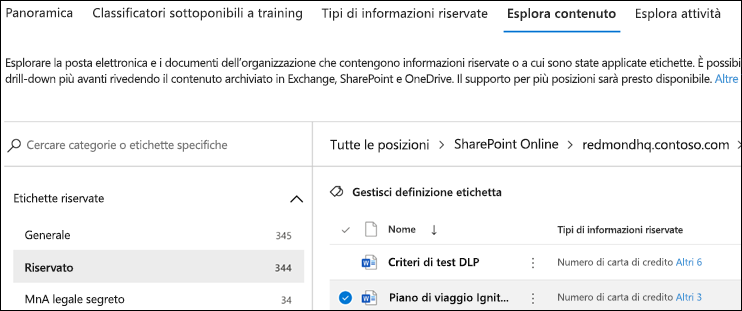
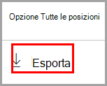
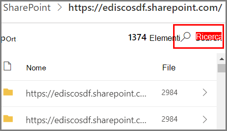

# Introduzione a Esplora contenutoGet started with content explorer

Esplora contenuto di classificazione dei dati consente di visualizzare in modo nativo gli elementi che sono stati riepilogati nella pagina di panoramica.The data classification content explorer allows you to natively view the items that were summarized on the overview page.

## PrerequisitiPrerequisites

A ogni account che accede e usa la classificazione dei dati deve essere assegnata una licenza da uno di questi abbonamenti:Every account that accesses and uses data classification must have a license assigned to it from one of these subscriptions:

- Microsoft 365 (E5)Microsoft 365 (E5)
- Office 365 (E5)Office 365 (E5)
- Componente aggiuntivo Advanced Compliance (E5)Advanced Compliance (E5) add-on
- Componente aggiuntivo Advanced Threat Intelligence (E5)Advanced Threat Intelligence (E5) add-on

### AutorizzazioniPermissions

Per accedere alla scheda Esplora contenuto, è necessario che a un account sia assegnata l'appartenenza a uno di questi ruoli o gruppi di ruoli.In order to get access to the content explorer tab, an account must be assigned membership in any one of these roles or role groups. 

I [criteri di prevenzione della perdita dei dati](data-loss-prevention-policies.md) aiutano a proteggere le informazioni riservate definite come **tipo di informazioni sensibili**.A [DLP policy](data-loss-prevention-policies.md) can help protect sensitive information, which is defined as a **sensitive information type**. Microsoft 365 include le [definizioni per molti tipi di informazioni sensibili comuni](sensitive-information-type-entity-definitions.md) in varie aree geografiche, pronte per l'uso.Microsoft 365 includes [definitions for many common sensitive information types](sensitive-information-type-entity-definitions.md) across many different regions that are ready for you to use. Ad esempio, un numero di carta di credito, numeri di conto corrente bancario, numeri di documento di identità e numeri di servizio Windows Live ID.For example, a credit card number, bank account numbers, national ID numbers, and Windows Live ID service numbers.

**Gruppi di ruoli di Microsoft 365****Microsoft 365 role groups**

- Amministratore globaleGlobal administrator
- Amministratore di conformitàCompliance administrator
- Amministratore della sicurezzaSecurity administrator
- Amministratore dati di conformitàCompliance data administrator

> [!IMPORTANT]
> L'appartenenza a questi gruppi di ruoli non consente di visualizzare l'elenco di elementi in Esplora contenuto o di visualizzare il contenuto degli elementi in Esplora contenuto.Membership in these role groups does not allow you to view the list of items in content explorer or to view the contents of the items in content explorer.

### Autorizzazioni necessarie per accedere agli elementi in Esplora contenutoRequired permissions to access items in content explorer

L'accesso a Esplora contenuto è estremamente limitato perché consente di leggere il contenuto dei file digitalizzati.Access to content explorer is highly restricted because it lets you read the contents of scanned files.

> [!IMPORTANT]
> Queste autorizzazioni sostituiscono le autorizzazioni assegnate in locale, che permettono di visualizzare il contenuto.These permissions supercede permissions that are locally assigned to the items, which allows viewing of the content. 

Sono due i ruoli che consentono di accedere a Esplora contenuto:There are two roles that grant access to content explorer:

- **Visualizzatore elenco di Esplora contenuto**: l'appartenenza a questo gruppo di ruoli consente di visualizzare ogni elemento e la relativa posizione nella visualizzazione elenco.**Content Explorer List viewer**: Membership in this role group allows you to see each item and its location in list view. Il ruolo `data classification list viewer` è stato preassegnato a questo gruppo di ruoli.The `data classification list viewer` role has been pre-assigned to this role group.

- **Visualizzatore contenuto di Esplora contenuto**: l'appartenenza a questo gruppo di ruolo consente di visualizzare il contenuto di ogni elemento dell'elenco.**Content Explorer Content viewer**: Membership in this role group allows you to view the contents of each item in the list. Il ruolo `data classification content viewer` è stato preassegnato a questo gruppo di ruoli.The `data classification content viewer` role has been pre-assigned to this role group.

L'account usato per accedere a Esplora contenuto deve essere presente in uno o entrambi i gruppi di ruoli.The account you use to access content explorer must be in one or both of the role groups. Si tratta di gruppi di ruoli indipendenti e non cumulativi.These are independent role groups and are not cumulative. Ad esempio, se si vuole concedere a un account la possibilità di visualizzare solo gli elementi e le relative posizioni, concedere i diritti di Visualizzatore elenco di Esplora contenuto.For example, if you want to grant an account the ability to view the items and their locations only, grant Content Explorer List viewer rights. Se si vuole che lo stesso account sia in grado di visualizzare anche il contenuto degli elementi dell'elenco, concedere anche i diritti di Visualizzatore contenuto di Esplora contenuto.If you want that same account to also be able to view the contents of the items in the list, grant Content Explorer Content viewer rights as well.

È anche possibile assegnare uno o entrambi i ruoli a un gruppo di ruoli personalizzato per personalizzare l'accesso a Esplora contenuto.You can also assign either or both of the roles to a custom role group to tailor access to content explorer.

Un amministratore globale, un amministratore di conformità o un amministratore dei dati può assegnare l'appartenenza ai gruppi di ruolo Visualizzatore elenco di Esplora contenuto e Visualizzatore contenuto di Esplora contenuto necessaria.A Global admin, Compliance admin, or Data admin can assign the necessary Content Explorer List Viewer, and Content Explorer Content Viewer role group membership.

## Esplora contenutoContent explorer

Esplora contenuto mostra uno snapshot corrente degli elementi che hanno un'etichetta di riservatezza, un'etichetta di conservazione o sono stati classificati come tipo di informazioni riservate nell'organizzazione.Content explorer shows a current snapshot of the items that have a sensitivity label, a retention label or have been classified as a sensitive information type in your organization.

### Tipi di informazioni sensibiliSensitive information types

I [criteri di prevenzione della perdita dei dati](data-loss-prevention-policies.md) aiutano a proteggere le informazioni riservate definite come **tipo di informazioni sensibili**.A [DLP policy](data-loss-prevention-policies.md) can help protect sensitive information, which is defined as a **sensitive information type**. Microsoft 365 include le [definizioni per molti tipi di informazioni sensibili comuni](sensitive-information-type-entity-definitions.md) di diverse aree geografiche, pronte per l'uso.Microsoft 365 includes [definitions for many common sensitive information types](sensitive-information-type-entity-definitions.md) from across many different regions that are ready for you to use. Ad esempio, un numero di carta di credito, numeri di conti corrente bancari, numeri di documenti di identità e numeri di servizio Windows Live ID.For example, a credit card number, bank account numbers, national ID numbers, and Windows Live ID service numbers.

> [!NOTE]
> Al momento Esplora contenuto non analizza i tipi di informazioni sensibili in Exchange Online.Content explorer doesn't currently scan for sensitive information types in Exchange Online.

### Etichette di riservatezzaSensitivity labels

Un'[etichetta di sensibilità](sensitivity-labels.md) è semplicemente un contrassegno che indica il valore dell'elemento per l'organizzazione.A [sensitivity label](sensitivity-labels.md) is simply a tag that indicates the value of the item to your organization. Può essere applicata manualmente o automaticamente.It can be applied manually, or automatically. Una volta applicata, viene incorporata nel documento e lo seguirà ovunque.Once applied it gets embedded in the document and will follow it everywhere it goes. Un'etichetta di riservatezza abilita varie misure protettive, ad esempio la filigrana obbligatoria o la crittografia.A sensitivity label enables various protective behaviors, such as mandatory watermarking or encryption.

Le etichetta di riservatezza devono essere abilitate per i file che si trovano in SharePoint e OneDrive affinché i dati corrispondenti vengano visualizzati nella pagina di classificazione dei dati.Sensitivity labels must be enabled for files that are in SharePoint and OneDrive in order for the corresponding data to surface in the data classification page. Per altre informazioni, vedere [Abilitare le etichette di riservatezza per i file di Office in SharePoint e OneDrive](sensitivity-labels-sharepoint-onedrive-files.md).For more information, see [Enable sensitivity labels for Office files in SharePoint and OneDrive](sensitivity-labels-sharepoint-onedrive-files.md).

### Etichette di conservazioneRetention labels

Un'[etichetta di conservazione](labels.md) consente di definire per quanto tempo viene conservato un elemento etichettato prima di essere eliminato.A [retention label](labels.md) allows you to define how long a labeled item is kept and the steps to be taken prior to deleting it. Vengono applicate manualmente o automaticamente tramite criteri.They are applied manually or automatically via policies. Possono essere utili per favorire la conformità dell'organizzazione ai requisiti di legge e normativi.They can play a role in helping your organization stay in compliance with legal and regulatory requirements.

### Come usare Esplora contenutoHow to use content explorer

1. Aprire **Centro conformità Microsoft 365**  > **Classificazione dei dati** > **Esplora contenuto**.Open **Microsoft 365 compliance center**  > **Data classification** > **Content explorer**.
2. Se si conosce il nome dell'etichetta o il tipo di informazioni sensibili, è possibile digitarlo nella casella filtro.If you know the name of the label, or the sensitive information type, you can type that into the filter box.
3. In alternativa, è possibile cercare l'elemento espandendo il tipo di etichetta e selezionando l'etichetta dall'elenco.Alternately, you can browse for the item by expanding the label type and selecting the label from the list.
4. Selezionare una posizione in **Tutte le posizioni** ed eseguire il drill-down nella struttura di cartelle fino all'elemento.Select a location under **All locations** and drill down the folder structure to the item.
5. Fare doppio clic per aprire l'elemento in modo nativo in Esplora contenuto.Double-click to open the item natively in content explorer.

### EsportaExport
Il controllo **Esporta** crea un file .csv che contiene un elenco di tutti gli elementi visualizzati nel riquadro **Tutte le posizioni**.The **export** control will create a .csv file that contains a listing of whatever is showing in the **All locations** pane.

### RicercaSearch

Quando viene eseguito il drill-down in una posizione, come una cartella di Exchange o un sito SharePoint o OneDrive, si apre lo strumento di **ricerca**.When you drill down into a location, such as an Exchange folder, or a SharePoint or OneDrive site, the **search** tool appears.

L'ambito dello strumento di ricerca è il contenuto del riquadro **Tutte le posizioni** e ciò che è possibile cercare varia in base alla posizione selezionata.The scope of the search tool is what is displaying in the **All locations** pane and what you can search on varies depending on the selected location. 

Quando la posizione selezionata è **Exchange**, è possibile effettuare la ricerca nell'intero indirizzo di posta elettronica della cassetta postale, ad esempio `user@domainname.com`.When **Exchange** is the selected location, you can search on the full email address of the mailbox, for example `user@domainname.com`.

Quando la posizione selezionata è **SharePoint** o **OneDrive**, lo strumento di ricerca si apre quando viene eseguito il drill-down dei nomi dei siti, delle cartelle e dei file.When either **SharePoint** or **OneDrive** are selected location, the search tool will appear when you drill down to site names, folders and files. 

> [!NOTE]
> **OneDrive** Durante il programma di anteprima, abbiamo ascoltato i preziosi feedback degli utenti sull'integrazione di OneDrive.**OneDrive** We have listened to your valuable feedback on OneDrive integration during our preview program. In base al feedback ricevuto, la funzionalità OneDrive rimarrà in anteprima finché non saranno disponibili tutte le correzioni.Based on that feedback, the OneDrive functionality will remain in preview till all fixes are in place. In base al tenant, alcuni clienti potrebbero non vedere OneDrive come posizione.Depending on your tenant, some customers may not see OneDrive as a location. Apprezziamo molto il continuo supporto degli utenti.We appreciate your continued support on this.

Ecco cosa è possibile cercare:You can search on:

|valorevalue|esempioexample  |
|---------|---------|
|nome completo del sitofull site name    |`https://contoso.onmicrosoft.com/sites/sitename`    |
|nome della cartella radice - ricerca tutte le sottocartelleroot folder name - gets all subfolders    | `/sites`        |
|nome del filefile name    |    `RES_Resume_1234.txt`     |
|testo all'inizio del nome del filetext at the beginning of file name| `RES`|
|testo dopo un trattino basso (_) nel nome del filetext after an underscore character ( _ ) in file name|`Resume` o `1234``Resume` or `1234`| 
|estensione del filefile extension|`txt`|

## Vedere ancheSee also

- [Etichette di riservatezzaSensitivity labels](sensitivity-labels.md)
- [Etichette di conservazioneRetention labels](labels.md)
- [Sensitive information type entity definitions.mdSensitive information type entity definitions.md](sensitive-information-type-entity-definitions.md)
- [Panoramica dei criteri di conservazioneOverview of retention policies](retention-policies.md)
- [Panoramica della prevenzione della perdita dei datiOverview of data loss prevention](data-loss-prevention-policies.md)
