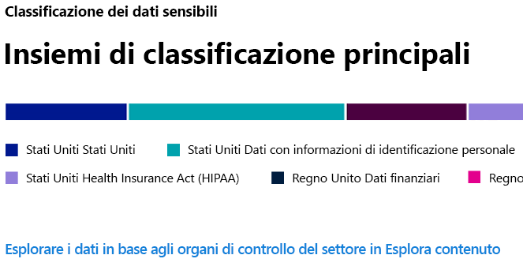
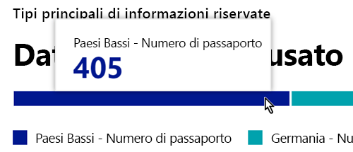
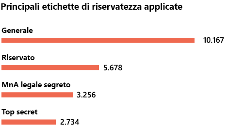
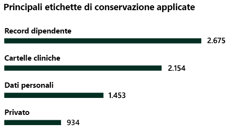

# Panoramica della classificazione dei dati (anteprima)

Gli amministratori di Microsoft 365 o gli amministratori di conformità possono valutare e poi contrassegnare i contenuti all'interno dell'organizzazione per controllarne gli spostamenti, per proteggerli indipendentemente dalla posizione e per garantire che vengano conservati ed eliminati in base alle esigenze dell'organizzazione. Queste operazioni possono essere eseguite mediante l'applicazione di [etichette di riservatezza](sensitivity-labels.md), di [etichette di conservazione](labels.md) e tramite la classificazione della tipologia delle informazioni riservate. Esistono vari modi per eseguire l'individuazione, la valutazione e l'aggiunta di tag, ma il risultato finale è che potrebbe essere presente un numero molto elevato di documenti e messaggi di posta elettronica contrassegnati e classificati con una o entrambe le etichette. Dopo aver applicato le etichette di conservazione e le etichette di riservatezza, è opportuno verificarne l'utilizzo nel tenant e le operazioni che vengono svolte con gli elementi. La pagina di classificazione dei dati consente di avere visibilità sui contenuti, in particolare:

- il numero degli elementi classificati come tipologie di informazioni riservate e quali sono le tipologie di classificazione
- le principali etichette di riservatezza applicate sia in Microsoft 365 che in Azure Information Protection
- le principali etichette di conservazione applicate
- il riepilogo delle attività che gli utenti svolgono sui contenuti riservati
- le posizioni dei dati riservati e conservati

La funzionalità Classificazione dei dati è disponibile nel **Centro conformità Microsoft 365**o nel **Centro sicurezza Microsoft 365** > **Classificazione** > **Classificazione dei dati**.

## Tipologie di informazioni riservate usate più di frequente nei contenuti

Microsoft 365 fornisce diverse definizioni delle tipologie di informazioni riservate, ad esempio un elemento che contiene un codice di previdenza sociale o un numero di carta di credito. Per altre informazioni sulle tipologie di informazioni riservate, vedere [Elementi cercati dai tipi di informazioni riservate](what-the-sensitive-information-types-look-for.md).

La scheda tipologie di informazioni riservate mostra le principali tipologie di informazioni riservate individuate ed etichettate all'interno dell'organizzazione.

Per determinare il numero di elementi in una determinata categoria di classificazione, passare il puntatore del mouse sulla barra della categoria.

> [!NOTE]
> Se la scheda mostra il messaggio "Nessun dato trovato per le informazioni riservate". Questo significa che non sono presenti elementi nell'organizzazione classificati come tipologia di informazioni riservate o sottoposti a ricerca per indicizzazione. Per iniziare a usare le etichette, vedere:
>- [Etichette di riservatezza](sensitivity-labels.md)
>- [Etichette di conservazione](labels.md)
>- [Elementi cercati dalle tipologie di informazioni sensibili](what-the-sensitive-information-types-look-for.md)

## Principali etichette di riservatezza applicate ai contenuti

Quando si applica un'etichetta di riservatezza a un elemento tramite Microsoft 365 o Azure Information Protection (AIP), si verificano le seguenti situazioni:

- il tag che indica il valore dell'elemento per l'organizzazione viene incorporato nel documento e lo seguirà ovunque
- la presenza del tag permette varie misure protettive, ad esempio la filigrana obbligatoria o la crittografia. Con la protezione dell'endpoint abilitata, è anche possibile impedire a un elemento di eludere il controllo dell'organizzazione.

Per ulteriori informazioni sulle etichette di riservatezza, vedere: [Panoramica delle etichette di riservatezza](sensitivity-labels.md)

Le etichetta di riservatezza devono essere abilitate per i file che si trovano in SharePoint e OneDrive affinché i dati corrispondenti vengano visualizzati nella pagina di classificazione dei dati. Per altre informazioni, vedere [Abilitare le etichette di riservatezza per i file di Office in SharePoint e OneDrive (anteprima pubblica)](sensitivity-labels-sharepoint-onedrive-files.md).

La scheda etichetta di riservatezza mostra il numero di elementi (e-mail o documenti) in base al livello di riservatezza.

> [!NOTE]
> Se non sono state create o pubblicate etichette di riservatezza o non è stata applicata alcuna etichetta di riservatezza ai contenuti, la scheda visualizzerà il messaggio "Non sono state rilevate etichette di riservatezza". Per iniziare a usare le etichette, vedere:
>- [etichette di riservatezza](sensitivity-labels.md) oppure per AIP [Configurare i criteri di protezione delle informazioni in Azure](https://docs.microsoft.com/azure/information-protection/configure-policy)

## Principali etichette di conservazione applicate ai contenuti

Le etichette di conservazione vengono usate per gestire l'eliminazione dei contenuti all'interno dell'organizzazione. Se applicate, possono essere usate per controllare il periodo di conservazione di un documento prima dell'eliminazione, se deve essere esaminato prima dell'eliminazione, quando scade il periodo di conservazione oppure se deve essere contrassegnato come record che non deve essere eliminato. Per ulteriori informazioni, vedere [Panoramica delle etichette di conservazione](labels.md).

Le scheda delle principali etichette di conservazione applicate mostra il numero di elementi con una determinata etichetta di conservazione.

> [!NOTE]
> Se la scheda mostra il messaggio "Non sono state rilevate etichette di conservazione" significa che non sono state create o pubblicate etichette di conservazione o non è stata applicata alcuna etichetta di conservazione ai contenuti. Per iniziare a usare le etichette di conservazione, vedere:
>- [Panoramica delle etichette di conservazione](labels.md)

## Attività principali rilevate

Questa scheda offre un breve riepilogo delle azioni più comuni eseguite dagli utenti con gli elementi con etichette di riservatezza. È possibile usare [Esplora attività](data-classification-activity-explorer.md) per eseguire il drill-down avanzato su otto diverse attività di cui Microsoft 365 tiene traccia sui contenuti etichettati e su contenuti presenti negli endpoint di Windows 10.

> [!NOTE]
> Se la scheda visualizza il messaggio "Non è stata rilevata alcuna attività", significa che non sono state rilevate attività sui file o che non è stato attivato il controllo da parte dell'utente e dell'amministratore. Per attivare i log di controllo, vedere:
>- [Eseguire una ricerca nel log di controllo nel Centro sicurezza e conformità](search-the-audit-log-in-security-and-compliance.md)

## Dati con etichette di riservatezza e conservazione in base alla posizione

Il motivo della classificazione dei dati consiste nel fornire visibilità sul numero di elementi etichettati e della relativa posizione. Queste schede consentono di conoscere il numero di elementi etichettati in Exchange, SharePoint, OneDrive e così via.

> [!NOTE]
> Se la scheda visualizza il messaggio "Non sono state rilevate posizioni" significa che non sono state create o pubblicate etichette di riservatezza o che non è stata applicata alcuna etichetta di conservazione ai contenuti. Per iniziare a usare le etichette di riservatezza vedere:
>- [Etichette di riservatezza](sensitivity-labels.md)

## Vedere anche

- [Visualizzazione delle attività con etichette (anteprima)](data-classification-activity-explorer.md)
- [Visualizzare il contenuto con etichetta (anteprima)](data-classification-content-explorer.md)
- [Etichette di riservatezza](sensitivity-labels.md)
- [Etichette di conservazione](labels.md)
- [Tipi di informazioni riservate disponibili da cercare](what-the-sensitive-information-types-look-for.md)
- [Panoramica dei criteri di conservazione](retention-policies.md)
