# Panoramica sulla prevenzione della perdita dei datiOverview of data loss prevention
<!-- this topic needs to be split into smaller, more coherent ones. It is confusing as it is. -->
> [!NOTE]
> Le funzionalità di prevenzione della perdita dei dati sono state aggiunte di recente ai messaggi di chat e canali di Microsoft Teams per gli utenti con licenza di Office 365 Advanced Compliance, che è disponibile come opzione indipendente e incluso in Office 365 E5 e Microsoft 365 E5 Compliance.Data loss prevention capabilities were recently added to Microsoft Teams chat and channel messages for users licensed for Office 365 Advanced Compliance, which is available as a standalone option and is included in Office 365 E5 and Microsoft 365 E5 Compliance. Per altre informazioni sui requisiti di licenza, vedere [Linee guida per le licenze dei servizi a livello di tenant di Microsoft 365](https://docs.microsoft.com/office365/servicedescriptions/microsoft-365-service-descriptions/microsoft-365-tenantlevel-services-licensing-guidance).To learn more about licensing requirements, see [Microsoft 365 Tenant-Level Services Licensing Guidance](https://docs.microsoft.com/office365/servicedescriptions/microsoft-365-service-descriptions/microsoft-365-tenantlevel-services-licensing-guidance).

Per ottenere la conformità agli standard aziendali e alle normative di settore, le organizzazioni devono proteggere le informazioni riservate e impedirne la divulgazione accidentale.To comply with business standards and industry regulations, organizations must protect sensitive information and prevent its inadvertent disclosure. Le informazioni riservate possono essere dati finanziari o informazioni di identificazione personale (PII) come numeri di carta di credito, codici fiscali o cartelle cliniche.Sensitive information can include financial data or personally identifiable information (PII) such as credit card numbers, social security numbers, or health records. I criteri di prevenzione della perdita dei dati del Centro sicurezza e conformità di Office 365 permettono di identificare, monitorare e proteggere automaticamente le informazioni riservate in tutto Office 365.With a data loss prevention (DLP) policy in the Office 365 Security &amp; Compliance Center, you can identify, monitor, and automatically protect sensitive information across Office 365.
  
Con i criteri di prevenzione della perdita dei dati è possibile:With a DLP policy, you can:
  
- **Identificare le informazioni riservate in numerose posizioni, ad esempio Exchange Online, SharePoint Online e OneDrive for Business e Microsoft Teams.****Identify sensitive information across many locations, such as Exchange Online, SharePoint Online, OneDrive for Business, and Microsoft Teams.**
    
    Ad esempio, è possibile identificare tutti i documenti che includono un numero di carta di credito archiviato in un sito OneDrive for Business; in alternativa, è possibile monitorare solo i siti OneDrive di utenti specifici.For example, you can identify any document containing a credit card number that's stored in any OneDrive for Business site, or you can monitor just the OneDrive sites of specific people.
    
- **Prevenire la condivisione accidentale di informazioni riservate**.**Prevent the accidental sharing of sensitive information**. 
    
    È ad esempio possibile identificare i documenti o i messaggi di posta elettronica contenenti dati sanitari condivisi con persone esterne all'organizzazione e quindi bloccarne l'accesso oppure bloccare l'invio del messaggio.For example, you can identify any document or email containing a health record that's shared with people outside your organization, and then automatically block access to that document or block the email from being sent.
    
- **Monitorare e proteggere le informazioni riservate nelle versioni desktop di Excel, PowerPoint e Word.****Monitor and protect sensitive information in the desktop versions of Excel, PowerPoint, and Word.**
    
    Analogamente a Exchange Online, SharePoint Online e OneDrive for Business, questi programmi desktop di Office dispongono delle stesse caratteristiche per identificare le informazioni riservate e applicare i criteri di prevenzione della perdita dei dati.Just like in Exchange Online, SharePoint Online, and OneDrive for Business, these Office desktop programs include the same capabilities to identify sensitive information and apply DLP policies. La prevenzione della perdita dei dati fornisce un monitoraggio continuo quando gli utenti condividono contenuti in questi programmi di Office.DLP provides continuous monitoring when people share content in these Office programs.
    
- **Informare gli utenti su come garantire la conformità senza interrompere il flusso di lavoro.****Help users learn how to stay compliant without interrupting their workflow.**
    
    È possibile informare gli utenti sui criteri di prevenzione della perdita dei dati e aiutarli a rimanere conformi senza comprometterne la produttività.You can educate your users about DLP policies and help them remain compliant without blocking their work. Se ad esempio un utente prova a condividere un documento contenente informazioni riservate, è possibile inviargli una notifica tramite posta elettronica e mostrargli un suggerimento per i criteri nel contesto della raccolta documenti, che gli consente di ignorare i criteri se giustificato da motivi aziendali.For example, if a user tries to share a document containing sensitive information, a DLP policy can both send them an email notification and show them a policy tip in the context of the document library that allows them to override the policy if they have a business justification. Gli stessi suggerimenti per i criteri vengono visualizzati anche in Outlook sul web, Outlook, Excel, PowerPoint e Word.The same policy tips also appear in Outlook on the web, Outlook, Excel, PowerPoint, and Word.
    
- **Visualizzare report che indicano i contenuti corrispondenti ai criteri di prevenzione della perdita dei dati dell'organizzazione.****View DLP reports showing content that matches your organization's DLP policies.**
    
    Per valutare se l'organizzazione è conforme ai criteri di prevenzione della perdita dei dati, è possibile contare il numero di corrispondenze con criteri e regole nel corso del tempo.To assess how your organization is complying with a DLP policy, you can see how many matches each policy and rule has over time. Se esistono criteri di prevenzione della perdita dei dati che consentono agli utenti di eseguire l'override di un suggerimento per i criteri e segnalare un falso positivo, si può anche visualizzare il contenuto della segnalazione.If a DLP policy allows users to override a policy tip and report a false positive, you can also view what users have reported.
    
È possibile creare e gestire i criteri di prevenzione della perdita dei dati nella pagina Prevenzione della perdita di dati nel Centro conformità e sicurezza di Office 365.You create and manage DLP policies on the Data loss prevention page in the Office 365 Security &amp; Compliance Center.
  
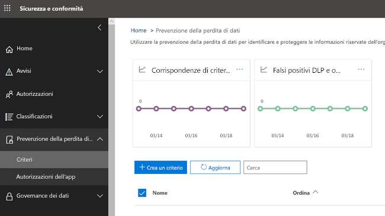
  
## Contenuto di un criterio DLPWhat a DLP policy contains

In un criterio DLP sono disponibili alcuni elementi di base:A DLP policy contains a few basic things:
  
- Dove proteggere il contenuto: **Posizioni** come ad esempio siti di Exchange Online, SharePoint Online e OneDrive for Business, ma anche messaggi di chat e canali di Microsoft Teams.Where to protect the content: **locations** such as Exchange Online, SharePoint Online, and OneDrive for Business sites, as well as Microsoft Teams chat and channel messages. 
    
- Quando e come proteggere il contenuto applicando **regole** costituite da:When and how to protect the content by enforcing **rules** comprised of: 
    
  - **Condizioni** che il contenuto deve soddifsfare prima che venga applicata la regola.**Conditions** the content must match before the rule is enforced. Ad esempio, una regola potrebbe essere configurata in modo da cercare solo contenuti che includono numeri di codice fiscale condivisi con persone esterne all'organizzazione.For example, a rule might be configured to look only for content containing Social Security numbers that's been shared with people outside your organization. 
    
  - **Azioni** che devono essere eseguite automaticamente dalla regola quando viene trovato il contenuto che soddisfa le condizioni.**Actions** that you want the rule to take automatically when content matching the conditions is found. Ad esempio, una regola potrebbe essere configurata in modo da bloccare l'accesso a un documento e inviare una notifica tramite posta elettronica sia all'utente che al responsabile della conformità.For example, a rule might be configured to block access to a document and send both the user and compliance officer an email notification. 
    
È possibile usare una regola per rispettare uno specifico requisito di protezione e quindi usare i criteri di prevenzione della perdita dei dati per raggruppare i requisiti comuni, ad esempio tutte le regole necessarie per la conformità a una specifica normativa.You can use a rule to meet a specific protection requirement, and then use a DLP policy to group together common protection requirements, such as all of the rules needed to comply with a specific regulation.
  
È possibile che si disponga di un criterio DLP che consente di rilevare la presenza di informazioni soggette ai moduli di conformità Health Insurance Portability and Accountability Act (HIPAA).For example, you might have a DLP policy that helps you detect the presence of information subject to the Health Insurance Portability and Accountability Act (HIPAA). Questo criterio di prevenzione della perdita dei dati consente di proteggere i dati HIPAA (il cosa) in tutti i siti di SharePoint Online e in tutti quelli di OneDrive for Business (il dove) rilevando i documenti che contengono informazioni riservate condivise con utenti esterni all'organizzazione (le condizioni), bloccando quindi l'accesso a tali documenti e inviando una notifica (le azioni).This DLP policy could help protect HIPAA data (the what) across all SharePoint Online sites and all OneDrive for Business sites (the where) by finding any document containing this sensitive information that's shared with people outside your organization (the conditions) and then blocking access to the document and sending a notification (the actions). Questi requisiti vengono archiviati come singole regole e raggruppati come criteri di prevenzione della perdita dei dati per semplificare la gestione e la creazione di report.These requirements are stored as individual rules and grouped together as a DLP policy to simplify management and reporting.
  
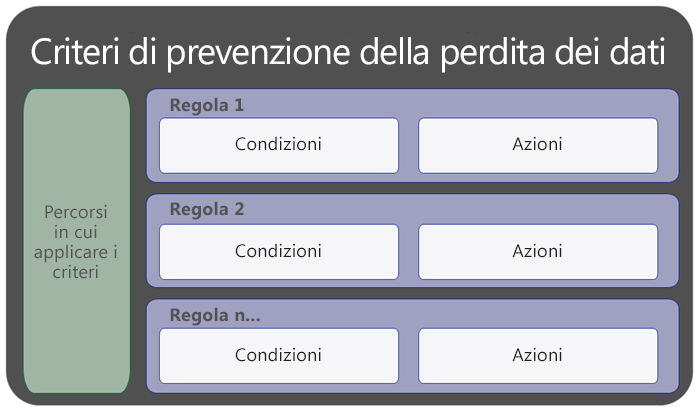
  
### PosizioniLocations

I criteri di prevenzione della perdita dei dati consentono di trovare e proteggere le informazioni riservate in tutto Office 365, indipendentemente dal fatto che si trovino in un sito di Exchange Online, SharePoint Online, OneDrive for Business o Microsoft Teams.A DLP policy can find and protect sensitive information across Office 365, whether that information is located in Exchange Online, SharePoint Online, OneDrive for Business, or Microsoft Teams. È possibile scegliere di proteggere il contenuto in un messaggio di posta elettronica di Exchange, nei messaggi delle chat e dei canali di Microsoft Teams e in tutte le raccolte di SharePoint o OneDrive o di selezionare percorsi specifici per i criteri.You can choose to protect content in Exchange email, Microsoft Teams chats and channel messages, and all SharePoint or OneDrive libraries, or select specific locations for a policy.
  
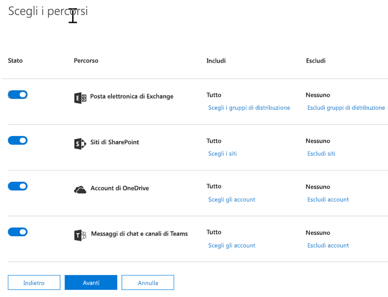

 Se si sceglie di includere gruppi di distribuzione specifici in Exchange, i criteri DLP verranno applicati solo ai membri di quel gruppo.If you choose to include specific distribution groups in Exchange, the DLP policy will be scoped only to the members of that group. Analogamente, escludendo un gruppo di distribuzione si escluderanno tutti i membri di quel gruppo di distribuzione dalla valutazione dei criteri.Similarly excluding a distribution group will exclude all the members of that distribution group from policy evaluation. È possibile scegliere di applicare un criterio ai membri delle liste di distribuzione, dei gruppi di distribuzione dinamici e dei gruppi di sicurezza.You can choose to scope a policy to the members of distribution lists, dynamic distribution groups, and security groups. Una politica DLP non può contenere più di 50 inclusioni ed esclusioni.A DLP policy can contain no more than 50 such inclusions and exclusions.

Se si sceglie di includere o escludere specifici siti di SharePoint o account di OneDrive, i criteri di prevenzione della perdita dei dati possono contenere non più di 100 inclusioni ed esclusioni di questo tipo.If you choose to include or exclude specific SharePoint sites or OneDrive accounts, a DLP policy can contain no more than 100 such inclusions and exclusions. Anche se questi limiti esistono, è importante sapere che possono essere superati applicando criteri a livello di organizzazione o validi per intere posizioni.Although this limit exists, you can exceed this limit by applying either an org-wide policy or a policy that applies to entire locations.
  
### RegoleRules

Le regole costituiscono gli elementi che consentono di applicare i requisiti aziendali al contenuto dell'organizzazione.Rules are what enforce your business requirements on your organization's content. Un criterio include una o più regole e ciascuna di queste è composta da condizioni e azioni.A policy contains one or more rules, and each rule consists of conditions and actions. Per ogni regola, le azioni vengono eseguite automaticamente, non appena vengono soddisfatte le condizioni.For each rule, when the conditions are met, the actions are taken automatically. Le regole vengono eseguite in modo sequenziale, iniziando con quella più prioritaria in ogni criterio.Rules are executed sequentially, starting with the highest-priority rule in each policy.
  
Una regola contiene anche opzioni per informare gli utenti (con suggerimenti per i criteri e notifiche tramite posta elettronica) e gli amministratori (con report sugli eventi tramite posta elettronica) che per il contenuto è stata individuata una corrispondenza alla regola.A rule also provides options to notify users (with policy tips and email notifications) and admins (with email incident reports) that content has matched the rule.
  
Ecco i componenti di una regola, spiegati di seguito.Here are the components of a rule, each explained below.
  
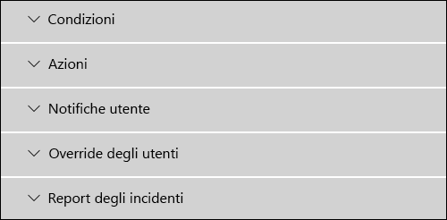
  
#### CondizioniConditions

Le condizioni sono importanti perché determinano i tipi di informazioni desiderati e il momento in cui eseguire un'azione.Conditions are important because they determine what types of information you're looking for, and when to take an action. Ad esempio, si può scegliere di ignorare i contenuti che includono numeri di passaporto, nel caso in cui il contenuto contenga oltre 10 di questi numeri e sia condiviso con utenti esterni all'organizzazione.For example, you might choose to ignore content containing passport numbers unless the content contains more than 10 such numbers and is shared with people outside your organization.
  
Le condizioni si focalizzano sul **contenuto**, come i tipi di informazioni riservate desiderati, e sul **contesto**, come l'utente con cui viene condiviso il documento.Conditions focus on the **content**, such as what types of sensitive information you're looking for, and also on the **context**, such as who the document is shared with. È possibile usare le condizioni per assegnare azioni diverse a livelli di rischio diversi.You can use conditions to assign different actions to different risk levels. Ad esempio, i contenuti riservati condivisi all'interno dell'organizzazione potrebbero essere caratterizzati da un livello di rischio inferiore rispetto ai contenuti riservati condivisi con utenti esterni all'organizzazione.For example, sensitive content shared internally might be lower risk and require fewer actions than sensitive content shared with people outside the organization. 
  
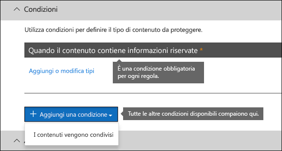
  
Le condizioni disponibili a questo punto consentono di determinare se:The conditions now available can determine if:
  
- Il contenuto include un tipo di informazioni riservate.Content contains a type of sensitive information.
    
- Il contenuto include un'etichetta.Content contains a label. Per altre informazioni, vedere la sezione seguente [Uso di un'etichetta come condizione nei criteri di prevenzione della perdita dei dati](#using-a-label-as-a-condition-in-a-dlp-policy).For more information, see the below section [Using a label as a condition in a DLP policy](#using-a-label-as-a-condition-in-a-dlp-policy).
    
- Il contenuto viene condiviso con utenti esterni o interni all'organizzazione.Content is shared with people outside or inside your organization.

> [!NOTE]
> Gli utenti che hanno account non guest nel tenant di Active Directory o di Azure Active Directory di un'organizzazione host sono considerati come utenti interni all'organizzazione.Users who have non-guest accounts in a host organization's Active Directory or Azure Active Directory tenant are considered as people inside the organization.
    
#### Tipi di informazioni riservateTypes of sensitive information

I criteri di prevenzione della perdita dei dati aiutano a proteggere le informazioni riservate definite come **tipo di informazioni riservate**.A DLP policy can help protect sensitive information, which is defined as a **sensitive information type**. Office 365 include le definizioni pronte per l'uso di molti tipi comuni di informazioni riservate in diverse aree geografiche, ad esempio numeri di carta di credito, di conto corrente bancario, di carta di identità e di passaporto.Office 365 includes definitions for many common sensitive information types across many different regions that are ready for you to use, such as a credit card number, bank account numbers, national ID numbers, and passport numbers. 
  
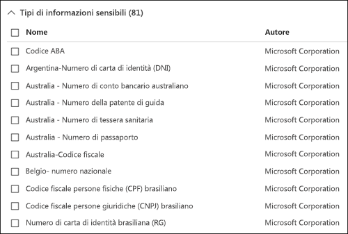
  
Quando un criterio di prevenzione della perdita dei dati cerca un tipo di informazione riservata (ad esempio un numero di carta di credito), non effettua soltanto la ricerca di un codice a 16 cifre.When a DLP policy looks for a sensitive information type such as a credit card number, it doesn't simply look for a 16-digit number. Ogni tipo di informazioni riservate viene definito e rilevato utilizzando una combinazione dei seguenti elementi:Each sensitive information type is defined and detected by using a combination of:
  
- Parole chiaveKeywords
    
- 	Funzioni interne per convalidare i chesksum o la composizioneInternal functions to validate checksums or composition
    
- Valutazione di espressioni regolari per trovare corrispondenze di schemiEvaluation of regular expressions to find pattern matches
    
- Valutazione di altri contenutiOther content examination
    
In questo modo, il rilevamento di prevenzione della perdita dei dati raggiunge un livello superiore di accuratezza riducendo il numero di falsi positivi che possono interrompere il lavoro degli utenti.This helps DLP detection achieve a high degree of accuracy while reducing the number of false positives that can interrupt peoples' work.
  
#### AzioniActions

Quando un contenuto corrisponde a una condizione di una regola, è possibile applicare le azioni per proteggere automaticamente il contenuto.When content matches a condition in a rule, you can apply actions to automatically protect the content.
  
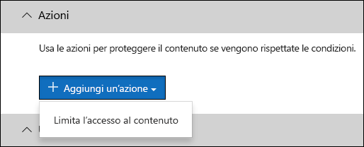
  
Con le azioni ora disponibili è possibile:With the actions now available, you can:
  
- **Limitare l'accesso al contenuto** Per i contenuti dei siti, ciò significa che le autorizzazioni per il documento sono limitate per tutti tranne che per l'amministratore della raccolta siti principale, il proprietario del documento e la persona che lo ha modificato per ultima.**Restrict access to the content** For site content, this means that permissions for the document are restricted for everyone except the primary site collection administrator, document owner, and person who last modified the document. Queste persone possono rimuovere le informazioni riservate dal documento o eseguire altri azioni correttive.These people can remove the sensitive information from the document or take other remedial action. Quando il documento è conforme, vengono automaticamente ripristinate le autorizzazioni originali.When the document is in compliance, the original permissions are automatically restored. Se l'accesso è bloccato, il documento viene visualizzato con una speciale icona di suggerimento per i criteri nella raccolta del sito.When access to a document is blocked, the document appears with a special policy tip icon in the library on the site. 
    
    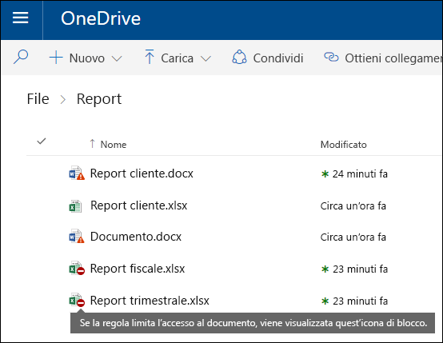
  
    Per il contenuto dei messaggi di posta elettronica, questa azione blocca l'invio del messaggio.For email content, this action blocks the message from being sent. In base alla configurazione della regola di prevenzione della perdita dei dati, il mittente vedrà un rapporto di mancato recapito oppure, se la regola usa una notifica, un suggerimento per i criteri e/o una notifica tramite posta elettronica.Depending on how the DLP rule is configured, the sender sees an NDR or (if the rule uses a notification) a policy tip and/or email notification.
    
    
  
#### Notifiche utente e criteri ignorati dall’utenteUser notifications and user overrides

Grazie alle notifiche e ai criteri ignorati è possibile informare gli utenti sui criteri di prevenzione della perdita dei dati e aiutarli a rimanere conformi senza compromettere la loro produttività.You can use notifications and overrides to educate your users about DLP policies and help them remain compliant without blocking their work. Se ad esempio un utente prova a condividere un documento contenente informazioni riservate, è possibile inviargli una notifica tramite posta elettronica e mostrargli un suggerimento per i criteri nel contesto della raccolta documenti, che gli consente di ignorare i criteri se giustificato da motivi aziendali.For example, if a user tries to share a document containing sensitive information, a DLP policy can both send them an email notification and show them a policy tip in the context of the document library that allows them to override the policy if they have a business justification.
  
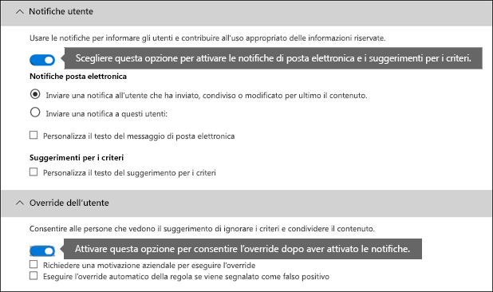
  
Il messaggio di posta elettronica può informare l'utente che ha inviato, condiviso o modificato per ultimo il contenuto e, per il contenuto dei siti, l'amministratore della raccolta siti principale e il proprietario del documento.The email can notify the person who sent, shared, or last modified the content and, for site content, the primary site collection administrator and document owner. Inoltre, è possibile aggiungere o rimuovere a piacimento persone a cui inviare la notifica tramite posta elettronica.In addition, you can add or remove whomever you choose from the email notification.
  
Oltre a inviare una notifica tramite posta elettronica, una notifica utente mostra un suggerimento per i criteri:In addition to sending an email notification, a user notification displays a policy tip:
  
- In Outlook e Outlook sul web.In Outlook and Outlook on the web.
    
- Per documenti in un sito di SharePoint Online o OneDrive for Business.For the document on a SharePoint Online or OneDrive for Business site.
    
- In Excel, PowerPoint e Word, se il documento è archiviato in un sito incluso nei criteri di prevenzione della perdita dei dati.In Excel, PowerPoint, and Word, when the document is stored on a site included in a DLP policy.
    
Nella notifica di posta elettronica e nel suggerimento per i criteri viene spiegata la causa del conflitto tra il contenuto e un criterio di prevenzione della perdita dei dati.The email notification and policy tip explain why content conflicts with a DLP policy. Si può anche scegliere di fare in modo che la notifica tramite posta elettronica e il suggerimento per i criteri consentano di ignorare la regola segnalando un falso positivo o fornendo una giustificazione aziendale.If you choose, the email notification and policy tip can allow users to override a rule by reporting a false positive or providing a business justification. In questo modo è possibile informare gli utenti sui criteri di prevenzione della perdita dei dati e applicarli senza comprometterne la produttività.This can help you educate users about your DLP policies and enforce them without preventing people from doing their work. Anche le informazioni sui criteri ignorati e sui falsi positivi vengono registrate per la creazione di report (vedere di seguito per informazioni sui report) e vengono incluse nei report degli eventi (sezione successiva) in modo che il responsabile della conformità possa esaminarle regolarmente.Information about overrides and false positives is also logged for reporting (see below about the DLP reports) and included in the incident reports (next section), so that the compliance officer can regularly review this information.
  
Ecco l'aspetto di un suggerimento per i criteri in un account di OneDrive for Business.Here's what a policy tip looks like in a OneDrive for Business account.
  
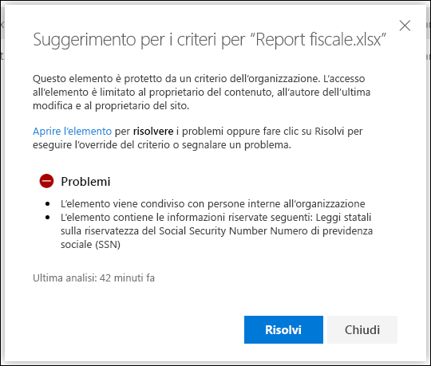

 Per ulteriori informazioni sulle notifiche all'utente e i suggerimenti per i criteri nei criteri DLP, vedere [Utilizzare notifiche e suggerimenti per i criteri](use-notifications-and-policy-tips.md).To learn more about user notifications and policy tips in DLP policies, see [Use notifications and policy tips](use-notifications-and-policy-tips.md).

#### Rapporti operazioni non consentiteIncident reports

Quando viene trovata una corrispondenza con una regola, è possibile inviare il report dell'evento al responsabile della conformità (o a chiunque si voglia) con i relativi dettagli.When a rule is matched, you can send an incident report to your compliance officer (or any people you choose) with details of the event. Il report include informazioni sull'elemento con cui è stata trovata una corrispondenza, sull'effettivo contenuto che ha soddisfatto la regola, oltre al nome dell'ultima persona che ha modificato il contenuto.This report includes information about the item that was matched, the actual content that matched the rule, and the name of the person who last modified the content. Per i messaggi di posta elettronica, il report include anche il messaggio originale che corrisponde ai criteri di prevenzione della perdita dei dati, sotto forma di allegato.For email messages, the report also includes as an attachment the original message that matches a DLP policy.
  
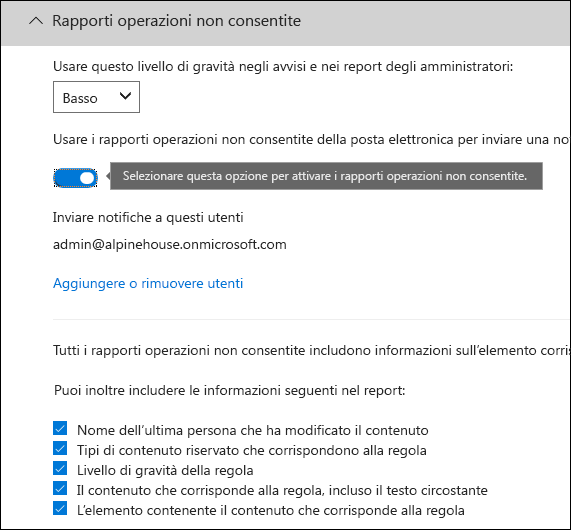
  
## Raggruppamento e operatori logiciGrouping and logical operators

Spesso i criteri di prevenzione della perdita dei dati includono un requisito semplice, ad esempio identificare tutti i contenuti che contengono un numero di codice fiscale.Often your DLP policy has a straightforward requirement, such as to identify all content that contains a U.S. Social Security Number. In altri casi, tuttavia, i criteri di prevenzione della perdita dei dati potrebbero dover identificare dati definiti in modo meno preciso.However, in other scenarios, your DLP policy might need to identify more loosely defined data.
  
Ad esempio, per identificare il contenuto soggetto all'Health Insurance Act (HIPAA), è necessario cercare:For example, to identify content subject to the U.S. Health Insurance Act (HIPAA), you need to look for:
  
- Contenuto che include tipi specifici di informazioni riservate, ad esempio un numero di previdenza sociale statunitense o un numero DEA (Drug Enforcement Agency).Content that contains specific types of sensitive information, such as a U.S. Social Security Number or Drug Enforcement Agency (DEA) Number.
    
    EAND
    
- Contenuto più difficile da identificare, ad esempio comunicazioni sul trattamento di un paziente o descrizioni dei servizi medicali forniti.Content that's more difficult to identify, such as communications about a patient's care or descriptions of medical services provided. L'identificazione di questo contenuto richiede la corrispondenza delle parole chiave rispetto a elenchi di parole chiave di dimensioni molto grandi, ad esempio l'elenco International Classification of Diseases (ICD-9-CM o ICD-10-CM).Identifying this content requires matching keywords from very large keyword lists, such as the International Classification of Diseases (ICD-9-CM or ICD-10-CM).
    
È possibile identificare facilmente questi dati definiti in modo meno preciso usando il raggruppamento e gli operatori logici (E, O).You can easily identify such loosely defined data by using grouping and logical operators (AND, OR). Quando si creano criteri di prevenzione della perdita dei dati, è possibile:When you create a DLP policy, you can:
  
- Raggruppare tipi di informazioni riservate.Group sensitive information types.
    
- Scegliere l'operatore logico tra i tipi di informazioni riservate all'interno di un gruppo e tra i gruppi.Choose the logical operator between the sensitive information types within a group and between the groups themselves.
    
### Scelta dell'operatore all'interno di un gruppoChoosing the operator within a group

All'interno di un gruppo è possibile scegliere se è necessario che sia soddisfatta una o tutte le condizioni del gruppo perché il contenuto corrisponda alla regola.Within a group, you can choose whether any or all of the conditions in that group must be satisfied for the content to match the rule.
  
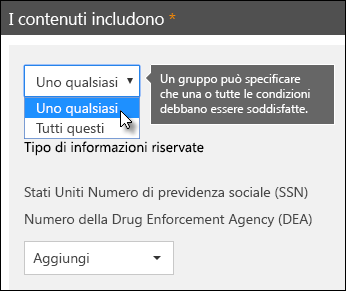
  
### Aggiunta di un gruppoAdding a group

È possibile aggiungere rapidamente un gruppo con proprie condizioni e un operatore all'interno.You can quickly add a group, which can have its own conditions and operator within that group.
  
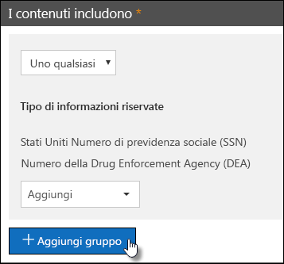
  
### Scelta dell'operatore tra i gruppiChoosing the operator between groups

Tra i gruppi è possibile scegliere se è necessario che siano soddisfatte le condizioni di un solo gruppo o di tutti perché il contenuto corrisponda alla regola.Between groups, you can choose whether the conditions in just one group or all of the groups must be satisfied for the content to match the rule.
  
Ad esempio, il criterio predefinito **Stati Uniti - HIPAA** ha una regola che usa un operatore **E** tra i gruppi per identificare il contenuto che include:For example, the built-in **U.S. HIPAA** policy has a rule that uses an **AND** operator between the groups so that it identifies content that contains: 
  
- dal gruppo **Identificatori di informazioni personali** (almeno un numero di previdenza sociale **O** un numero DEA)from the group **PII Identifiers** (at least one SSN number **OR** DEA number) 
    
    **E****AND**
    
- dal gruppo **Terminologia medica** (almeno una parola chiave ICD-9-CM **O** ICD-10-CM)from the group **Medical Terms** (at least one ICD-9-CM keyword **OR** ICD-10-CM keyword) 
    
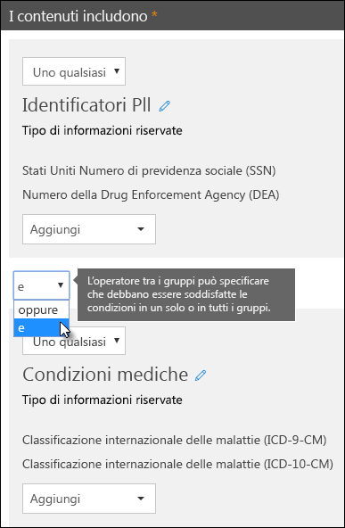
  
## Priorità in base alla quale vengono elaborate le regoleThe priority by which rules are processed

Quando si creano regole in un criterio, a ogni regola viene assegnata una priorità nell'ordine di creazione, ovvero la regola creata per prima avrà la priorità più alta, la regola creata per seconda avrà la seconda priorità e così via.When you create rules in a policy, each rule is assigned a priority in the order in which it's created — meaning, the rule created first has first priority, the rule created second has second priority, and so on. 
  
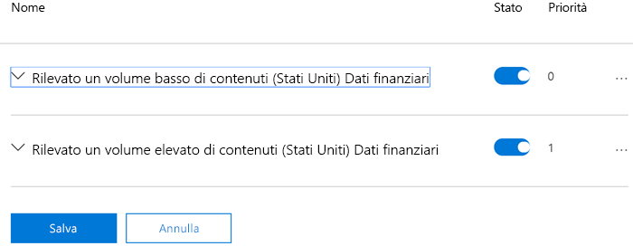
  
Dopo aver configurato più criteri di prevenzione della perdita dei dati, è possibile cambiare la priorità di uno o più criteri.After you have set up more than one DLP policy, you can change the priority of one or more policies. Per farlo, selezionare un criterio, scegliere **Modifica criterio**e usare l'elenco **priorità** per specificare la priorità.To do that, select a policy, choose **Edit policy**, and use the **Priority** list to specify its priority.

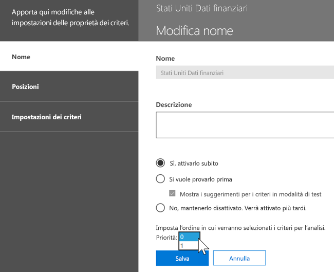

Quando il contenuto viene valutato a fronte delle regole, queste vengono elaborate in ordine di priorità.When content is evaluated against rules, the rules are processed in priority order. Se il contenuto corrisponde a più regole, le regole vengono elaborate in ordine di priorità e viene applicata l'azione più restrittiva.If content matches multiple rules, the rules are processed in priority order and the most restrictive action is enforced. Ad esempio, se il contenuto corrisponde a tutte le regole seguenti, viene applicata la regola 3 perché è quella più restrittiva con la priorità più alta:For example, if content matches all of the following rules, Rule 3 is enforced because it's the highest priority, most restrictive rule:
  
- Regola 1: solo notifica agli utentiRule 1: only notifies users
    
- Regola 2: notifica agli utenti, limita l'accesso e consente che gli utenti ignorino i criteriRule 2: notifies users, restricts access, and allows user overrides
    
- Regola 3: notifica agli utenti, limita l'accesso e non consente che gli utenti ignorino i criteriRule 3: notifies users, restricts access, and does not allow user overrides
    
- Regola 4: solo notifica agli utentiRule 4: only notifies users
    
- Regola 5: limita l'accessoRule 5: restricts access
    
- Regola 6: notifica agli utenti, limita l'accesso e non consente che gli utenti ignorino i criteriRule 6: notifies users, restricts access, and does not allow user overrides
    
In questo esempio, le corrispondenze per tutte le regole vengono registrate nei log di controllo e visualizzate nei report di prevenzione della perdita dei dati, anche se viene applicata solo la regola più restrittiva.In this example, note that matches for all of the rules are recorded in the audit logs and shown in the DLP reports, even though only the most restrictive rule is enforced.
  
Per informazioni sui suggerimenti per i criteri, tenere presente che:Regarding policy tips, note that:
  
- Viene visualizzato solo il suggerimento per i criteri della regola più restrittiva con la priorità più alta.Only the policy tip from the highest priority, most restrictive rule will be shown. Ad esempio, verrà visualizzato un suggerimento per i criteri di una regola che blocca l'accesso al contenuto rispetto a un suggerimento per i criteri di una regola che invia semplicemente una notifica.For example, a policy tip from a rule that blocks access to content will be shown over a policy tip from a rule that simply sends a notification. In questo modo, gli utenti evitano di dover leggere troppi suggerimenti per i criteri.This prevents people from seeing a cascade of policy tips.
    
- 	Se i suggerimenti per i criteri nella regola più restrittiva permettono agli utenti di eseguire l'override della regola, l'override di questa regola comporta anche l'override di qualsiasi altra regola corrispondente al contenuto. If the policy tips in the most restrictive rule allow people to override the rule, then overriding this rule also overrides any other rules that the content matched.
    
## Ottimizzazione delle regole affinché siano più facili o difficili da soddisfareTuning rules to make them easier or harder to match

Dopo la creazione e l'attivazione di specifici criteri di prevenzione della perdita dei dati, a volte si verificano questi problemi:After people create and turn on their DLP policies, they sometimes run into these issues:
  
- Il contenuto che **non è** costituito da informazioni riservate e che soddisfa la regola è eccessivo. In altri termini, si verificano troppi falsi positivi.Too much content that **is not** sensitive information matches the rules — in other words, too many false positives. 
    
- Troppo poco contenuto che **è** costituito da informazioni riservate corrisponde alle regole.Too little content that **is** sensitive information matches the rules. In altre parole, le azioni di protezione non vengono applicate alle informazioni riservate.In other words, the protective actions aren't being enforced on the sensitive information. 
    
Per risolvere questi problemi, è possibile ottimizzare le regole modificando il numero di istanze e l'accuratezza della corrispondenza per fare in modo che le regole siano più difficili o più facili da soddisfare.To address these issues, you can tune your rules by adjusting the instance count and match accuracy to make it harder or easier for content to match the rules. Ogni tipo di informazioni riservate usato in una regola include un numero di istanze e un'accuratezza di corrispondenza.Each sensitive information type used in a rule has both an instance count and match accuracy.
  
### Numero di istanzeInstance count

Il numero di istanze indica semplicemente quante occorrenze di un determinato tipo di informazioni riservate devono essere presenti perché il contenuto soddisfi la regola.Instance count means simply how many occurrences of a specific type of sensitive information must be present for content to match the rule. Ad esempio, il contenuto corrisponde alla regola riportata sotto se vengono identificati tra 1 e 9 numeri di passaportoFor example, content matches the rule shown below if between 1 and 9 unique U.S. or U.K. univoci del Regno Unito o degli Stati Uniti.passport numbers are identified.
  
Si noti che il conteggio delle istanze include solo le corrispondenze **univoche** per i tipi di informazioni riservate e parole chiave.Note that the instance count includes only **unique** matches for sensitive information types and keywords. Ad esempio, se un messaggio di posta elettronica contiene 10 occorrenze dello stesso numero di carta di credito, le 10 occorrenze vengono conteggiate come una singola istanza di un numero di carta di credito.For example, if an email contains 10 occurrences of the same credit card number, those 10 occurrences count as a single instance of a credit card number. 
  
Per usare il numero di istanze per ottimizzare le regole, le indicazioni sono semplici:To use instance count to tune rules, the guidance is straightforward:
  
- Per fare in modo che la regola sia più facile da soddisfare, ridurre il valore **min** e/o aumentare il valore **max**.To make the rule easier to match, decrease the **min** count and/or increase the **max** count. È anche possibile impostare **max** su **qualsiasi** eliminando il valore numerico.You can also set **max** to **any** by deleting the numerical value. 
    
- Per fare in modo che la regola sia più difficile da soddisfare, aumentare il valore **min**.To make the rule harder to match, increase the **min** count. 
    
In genere le azioni meno restrittive, come l'invio di notifiche all'utente, vengono usate in una regola con un numero di istanze inferiore, ad esempio 1-9.Typically, you use less restrictive actions, such as sending user notifications, in a rule with a lower instance count (for example, 1-9). Le azioni più restrittive, come la limitazione dell'accesso al contenuto, senza consentire agli utenti di ignorare i criteri, vengono invece usate in una regola con un numero di istanze maggiore, ad esempio 10-qualsiasi.And you use more restrictive actions, such as restricting access to content without allowing user overrides, in a rule with a higher instance count (for example, 10-any).
  
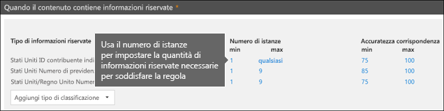
  
### Accuratezza della corrispondenzaMatch accuracy

Come illustrato in precedenza, ogni tipo di informazione riservata viene definito e rilevato usando una combinazione di tipi di prove.As described above, a sensitive information type is defined and detected by using a combination of different types of evidence. In genere, un tipo di informazioni riservate è definito da più combinazioni, dette criteri.Commonly, a sensitive information type is defined by multiple such combinations, called patterns. Uno schema che richiede meno prove ha un'accuratezza della corrispondenza (o livello di probabilità) inferiore, che è invece maggiore per uno schema che richiede più prove.A pattern that requires less evidence has a lower match accuracy (or confidence level), while a pattern that requires more evidence has a higher match accuracy (or confidence level). Per altre informazioni sugli schemi e sui livelli di probabilità usati da ogni tipo di informazioni riservate, vedere [Elementi cercati dai tipi di informazioni riservate](what-the-sensitive-information-types-look-for.md).To learn more about the actual patterns and confidence levels used by every sensitive information type, see [What the sensitive information types look for](what-the-sensitive-information-types-look-for.md).
  
Ad esempio, il tipo di informazioni riservate denominato Numero carta di credito è definito da due schemi:For example, the sensitive information type named Credit Card Number is defined by two patterns:
  
- Uno schema con il 65% di probabilità che richiede:A pattern with 65% confidence that requires:
    
  - Un numero nel formato di un numero di carta di credito.A number in the format of a credit card number.
    
  - Un numero che supera il checksum.A number that passes the checksum.
    
- Uno schema con l'85% di probabilità che richiede:A pattern with 85% confidence that requires:
    
  - Un numero nel formato di un numero di carta di credito.A number in the format of a credit card number.
    
  - Un numero che supera il checksum.A number that passes the checksum.
    
  - Una parola chiave o una data di scadenza nel formato appropriato.A keyword or an expiration date in the right format.
    
Questi livelli di probabilità (o accuratezza della corrispondenza) possono essere usati nelle regole.You can use these confidence levels (or match accuracy) in your rules. In genere le azioni meno restrittive, come l'invio di notifiche all'utente, vengono usate in una regola con un'accuratezza della corrispondenza inferiore.Typically, you use less restrictive actions, such as sending user notifications, in a rule with lower match accuracy. Le azioni più restrittive, come la limitazione dell'accesso al contenuto, senza consentire agli utenti di ignorare i criteri, vengono invece usate in una regola con un'accuratezza della corrispondenza maggiore.And you use more restrictive actions, such as restricting access to content without allowing user overrides, in a rule with higher match accuracy.
  
È importante tenere presente che, quando nel contenuto viene rilevato un tipo specifico di informazioni riservate, come un numero di carta di credito, viene restituito solo un livello di probabilità:It's important to understand that when a specific type of sensitive information, such as a credit card number, is identified in content, only a single confidence level is returned:
  
- Se tutte le corrispondenze sono riferite a un singolo schema, viene restituito il relativo livello di probabilità.If all of the matches are for a single pattern, the confidence level for that pattern is returned.
    
- Se sono presenti corrispondenze per più schemi (ad esempio se esistono corrispondenze con due livelli di probabilità diversi), viene restituito un livello di probabilità superiore rispetto ai singoli schemi.If there are matches for more than one pattern (that is, there are matches with two different confidence levels), a confidence level higher than any of the single patterns alone is returned. Questa è la parte più complessa.This is the tricky part. Ad esempio, nel caso di una carta di credito, se sono soddisfatti gli schemi del 65% e dell'85%, il livello di probabilità restituito per quel tipo di informazioni riservate è superiore al 90% perché la presenza di più prove comporta una maggiore probabilità.For example, for a credit card, if both the 65% and 85% patterns are matched, the confidence level returned for that sensitive information type is greater than 90% because more evidence means more confidence.
    
Quindi, se per le carte di credito si vogliono creare due regole che si escludono a vicenda, una per l'accuratezza della corrispondenza del 65% e una per l'accuratezza della corrispondenza dell'85%, gli intervalli di accuratezza della corrispondenza risultano come segue.So if you want to create two mutually exclusive rules for credit cards, one for the 65% match accuracy and one for the 85% match accuracy, the ranges for match accuracy would look like this. La prima regola rileva solo le corrispondenze dello schema del 65%.The first rule picks up only matches of the 65% pattern. La seconda regola rileva le corrispondenze con **almeno una** corrispondenza dell'85% e **potrebbe avere** altre corrispondenze con livello di probabilità inferiore.The second rule picks up matches with **at least one** 85% match and **can potentially have** other lower-confidence matches. 
  
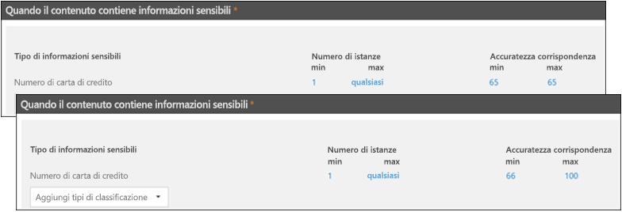
  
Per questi motivi, le indicazioni per la creazione di regole con diverse accuratezze di corrispondenza sono:For these reasons, the guidance for creating rules with different match accuracies is:
  
- Il livello di probabilità inferiore usa generalmente lo stesso valore per **min** e **max**, anziché un intervallo.The lowest confidence level typically uses the same value for **min** and **max** (not a range). 
    
- Il livello di probabilità superiore è costituito in genere da un intervallo che inizia appena al di sopra del livello di probabilità inferiore e arriva a 100.The highest confidence level is typically a range from just above the lower confidence level to 100.
    
- Tutti i livelli di probabilità intermedi iniziano generalmente appena al di sopra del livello di probabilità inferiore e arrivano appena sotto il livello di probabilità superiore.Any in-between confidence levels typically range from just above the lower confidence level to just below the higher confidence level.
    
## Uso di un'etichetta come condizione nei criteri di prevenzione della perdita dei datiUsing a label as a condition in a DLP policy

È possibile creare un'etichetta e quindi:You can create a label and then:
<!-- what kind of label? -->
  
- **Pubblicarla** in modo che gli utenti finali possano vedere e applicare manualmente l'etichetta al contenuto.**Publish** it, so that end users can see and manually apply the label to content. 
    
- **Applicarla automaticamente** al contenuto che soddisfa le condizioni specificate.**Auto-apply** it to content that matches the conditions that you choose. 
    
Per ulteriori informazioni sulle etichette, vedere [Panoramica delle etichette di conservazione](labels.md).For more information about labels, see [Overview of retention labels](labels.md).
  
Dopo aver creato un'etichetta, è possibile usarla come condizione nei criteri di prevenzione della perdita dei dati.After you create a label, you can then use that label as a condition in your DLP policies. 

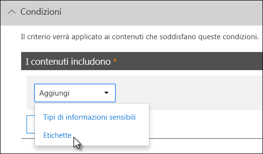

Ad esempio, questa operazione può essere utile perché:For example, you might want to do this because:
  
- È stata pubblicata un'etichetta denominata **Riservato** che consente alle persone nell'organizzazione di applicare manualmente l'etichetta ai messaggi di posta elettronica e ai documenti riservati.You published a label named **Confidential**, so that people in your organization can manually apply the label to confidential email and documents. Usando questa etichetta come condizione nei criteri di prevenzione della perdita dei dati è possibile impedire che il contenuto etichettato come **Riservato** venga condiviso con utenti esterni all'organizzazione.By using this label as a condition in your DLP policy, you can restrict content labeled **Confidential** from being shared with people outside your organization. 
    
- È stata creata un'etichetta denominata **Alpine House** per un progetto con questo nome, applicata poi automaticamente al contenuto che contiene le parole chiave "Alpine House".You created a label named **Alpine House** for a project of that name, and then applied that label automatically to content containing the keywords "Alpine House". Usando questa etichetta come condizione nei criteri di prevenzione della perdita dei dati è possibile mostrare agli utenti un suggerimento per i criteri quando stanno per condividere questo contenuto con utenti esterni all'organizzazione.By using this label as a condition in your DLP policy, you can show a policy tip to end users when they're about to share this content with someone outside your organization. 
    
- È stata pubblicata un'etichetta denominata **Registri fiscali** che consente al responsabile dei record di applicare manualmente l'etichetta al contenuto che deve essere classificato come record.You published a label named **Tax record**, so that your records manager can manually apply the label to content that needs to be classified as a record. Usando questa etichetta come condizione nei criteri di prevenzione della perdita dei dati è possibile cercare i contenuti con questa etichetta in combinazione con altri tipi di informazioni riservate, ad esempio codici identificativi del contribuente individuale o numeri di codice fiscale, applicare azioni di protezione al contenuto etichettato come **Registri fiscali** e ottenere report attività dettagliati sui criteri di prevenzione della perdita dei dati dai report relativi a questi criteri e dai dati del log di controllo.By using this label as a condition in your DLP policy, you can look for content with this label along with other types of sensitive information such as ITINs or SSNs; apply protection actions to content labeled **Tax record**; and get detailed activity reports about the DLP policy from the DLP reports and audit log data. 
    
- È stata pubblicata un'etichetta denominata **Team dirigenti - Riservato** nelle cassette postali di Exchange e negli account di OneDrive di un gruppo di dirigenti.You published a label named **Executive Leadership Team - Sensitive** to the Exchange mailboxes and OneDrive accounts of a group of executives. Usando questa etichetta come condizione nei criteri di prevenzione della perdita dei dati è possibile applicare azioni di conservazione e di protezione allo stesso sottoinsieme di contenuti e utenti.By using this label as a condition in your DLP policy, you can enforce both retention and protection actions on the same subset of content and users. 
    
Usando le etichette come condizioni nei criteri di prevenzione della perdita dei dati è possibile applicare in modo selettivo le azioni di protezione a uno specifico set di contenuti, posizioni o utenti.By using labels as a condition in your DLP rules, can you selectively enforce protection actions on a specific set of content, locations, or users. 

> [!NOTE]
> Se si specifica un'etichetta di conservazione come condizione in un criterio di prevenzione della perdita dei dati e si includono anche Exchange e/o Teams come posizione, si riceverà un messaggio di errore simile al seguente: "La protezione del contenuto con etichetta nei messaggi di posta elettronica e di Teams non è supportata.If you specify a retention label as a condition in a DLP policy and you also include Exchange and/or Teams as a location, you will receive the following error: "Protecting labeled content in email and teams messages isn't supported. Rimuovere l'etichetta seguente o disattivare Exchange e Teams come posizione".Either remove the label below or turn off Exchange and Teams as a location." Questo perché il trasporto di Exchange non valuta i metadati dell'etichetta durante l'invio e il recapito dei messaggi.This is because Exchange transport does not evaluate the label metadata during message submission and delivery. 

### Il supporto per le etichette di riservatezza sarà disponibile a breveSupport for sensitivity labels is coming

Attualmente è possibile usare solo un'etichetta di conservazione come condizione e non un’[etichetta di riservatezza](sensitivity-labels.md).You can currently use only a retention label as a condition, not a [sensitivity label](sensitivity-labels.md). Stiamo lavorando al supporto per l'uso di un'etichetta di riservatezza in questa condizione.We're currently working on support for using a sensitivity label in this condition.
  
### Correlazione tra questa funzionalità e le altreHow this feature relates to other features

Al contenuto che include informazioni riservate possono essere applicate diverse funzionalità:Several features can be applied to content containing sensitive information:
  
- Sia un'[etichetta di conservazione](labels.md#applying-a-retention-label-automatically-based-on-conditions) che un [criterio di conservazione](retention-policies.md) possono applicare azioni di **conservazione** a questo contenuto.A [retention label](labels.md#applying-a-retention-label-automatically-based-on-conditions) and a [retention policy](retention-policies.md) can both enforce **retention** actions on this content. 
    
- I criteri di prevenzione della perdita dei dati possono applicare azioni di **protezione** al contenuto.A DLP policy can enforce **protection** actions on this content. Inoltre, prima di applicare queste azioni, i criteri di prevenzione della perdita dei dati possono richiedere che siano soddisfatte altre condizioni oltre alla presenza di una specifica etichetta nel contenuto.And before enforcing these actions, a DLP policy can require other conditions to be met in addition to the content containing a label. 
    
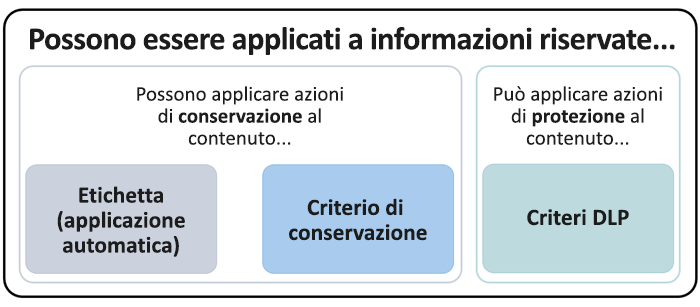
  
I criteri di prevenzione della perdita dei dati hanno capacità di rilevamento più complete rispetto a un'etichetta o ai criteri di conservazione applicati alle informazioni riservate.Note that a DLP policy has a richer detection capability than a label or retention policy applied to sensitive information. I criteri di prevenzione della perdita dei dati possono applicare azioni di protezione al contenuto con informazioni riservate. Se le informazioni riservate vengono rimosse, queste azioni di protezione vengono annullate alla successiva analisi del contenuto.A DLP policy can enforce protective actions on content containing sensitive information, and if the sensitive information is removed from the content, those protective actions are undone the next time the content's scanned. Se invece viene applicato un criterio di conservazione o un'etichetta a un contenuto con informazioni riservate, si tratta di un'azione unica che non può essere annullata, anche se le informazioni riservate vengono rimosse.But if a retention policy or label is applied to content containing sensitive information, that's a one-time action that won't be undone even if the sensitive information is removed.
  
Usando questa etichetta come condizione nei criteri di prevenzione della perdita dei dati è possibile applicare azioni di conservazione e di protezione al contenuto con l'etichetta specificata.By using a label as a condition in a DLP policy, you can enforce both retention and protection actions on content with that label. Un contenuto con un'etichetta viene gestito esattamente come un contenuto con informazioni riservate: un'etichetta e un tipo di informazioni riservate rappresentano proprietà usate per classificare il contenuto, quindi è possibile applicare azioni al contenuto specificato.You can think of content containing a label exactly like content containing sensitive information - both a label and a sensitive information type are properties used to classify content, so that you can enforce actions on that content.
  
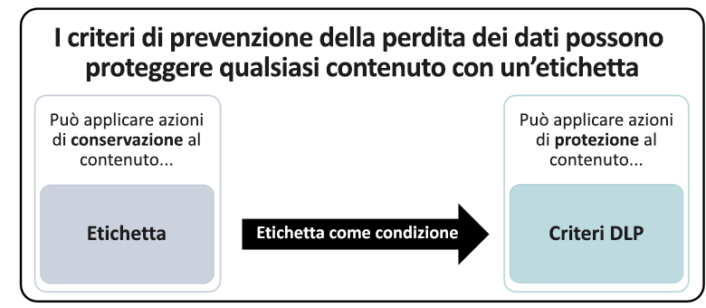
  
## Impostazioni semplici e avanzateSimple settings vs. advanced settings

Quando si creano criteri di prevenzione della perdita dei dati, si può scegliere tra impostazioni semplici o avanzate:When you create a DLP policy, you'll choose between simple or advanced settings:
  
- Le **Impostazioni semplici** consentono di creare facilmente il tipo più comune di criteri di prevenzione della perdita dei dati senza bisogno di usare l'editor per creare o modificare regole.**Simple settings** make it easy to create the most common type of DLP policy without using the rule editor to create or modify rules. 
    
- Le **Impostazioni avanzate** usano l'editor di regole per offrire il controllo completo su tutte le impostazioni dei criteri di prevenzione della perdita dei dati.**Advanced settings** use the rule editor to give you complete control over every setting for your DLP policy. 
    
In realtà le impostazioni semplici e avanzate funzionano esattamente allo stesso modo, ovvero applicando regole costituite da condizioni e azioni, solo che con le impostazioni semplici l'editor di regole non viene visualizzato.Don't worry, under the covers, simple settings and advanced settings work exactly the same, by enforcing rules comprised of conditions and actions -- only with simple settings, you don't see the rule editor. Si tratta di un modo rapido per creare criteri di prevenzione della perdita dei dati.It's a quick way to create a DLP policy.
  
### Impostazioni sempliciSimple settings

Lo scenario di gran lunga più comune consiste nel creare criteri di prevenzione della perdita dei dati che consentano di proteggere il contenuto che include informazioni riservate dalla condivisione con utenti esterni all'organizzazione e intraprendere azioni correttive automatiche, ad esempio limitare l'accesso al contenuto, inviare notifiche agli utenti finali o agli amministratori e controllare l'evento per un'indagine successiva.By far, the most common DLP scenario is creating a policy to help protect content containing sensitive information from being shared with people outside your organization, and taking an automatic remediating action such as restricting who can access the content, sending end-user or admin notifications, and auditing the event for later investigation. I criteri di prevenzione della perdita dei dati vengono usati per evitare la divulgazione accidentale di informazioni riservate.People use DLP to help prevent the inadvertent disclosure of sensitive information.
  
Per raggiungere facilmente questo scopo, quando si creano criteri di prevenzione della perdita dei dati è possibile scegliere **Usa le impostazioni semplici**.To simplify achieving this goal, when you create a DLP policy, you can choose **Use simple settings**. Queste impostazioni offrono tutto il necessario per implementare i criteri di prevenzione della perdita dei dati più comuni senza dover accedere all'editor di regole.These settings provide everything you need to implement the most common DLP policy, without having to go into the rule editor.
  
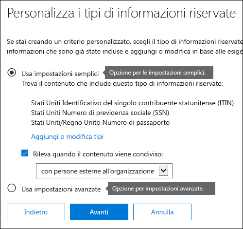
  
### Impostazioni avanzateAdvanced settings

Se è necessario creare criteri di prevenzione della perdita dei dati più personalizzati, scegliere **Usa le impostazioni avanzate**.If you need to create more customized DLP policies, you can choose **Use advanced settings**.
  
Le impostazioni avanzate presentano l'editor di regole, che offre il controllo completo su tutte le possibili opzioni, tra cui numero delle istanze e accuratezza della corrispondenza (livello di probabilità) per ogni regola.The advanced settings present you with the rule editor, where you have full control over every possible option, including the instance count and match accuracy (confidence level) for each rule.
  
Per passare rapidamente a una sezione, fare clic su un elemento nella barra di spostamento superiore dell'editor di regole per passare alla sezione seguente.To jump to a section quickly, click an item in the top navigation of the rule editor to go to that section below.
  
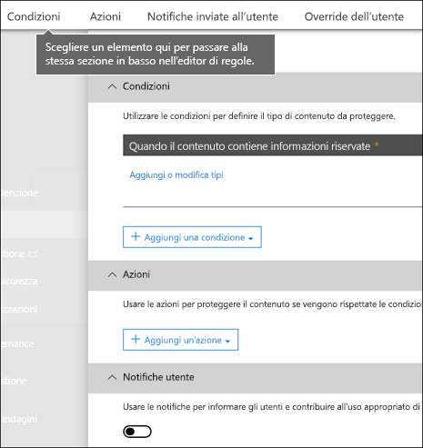
  
## Modelli dei criteri di prevenzione della perdita dei datiDLP policy templates

Il primo passaggio per la creazione dei criteri di prevenzione della perdita dei dati consiste nello scegliere le informazioni da proteggere.The first step in creating a DLP policy is choosing what information to protect. Iniziando con un modello di prevenzione della perdita dei dati, si evita lo sforzo di costruire un nuovo gruppo di regole da zero e di capire quali tipi di informazioni dovrebbero essere incluse per impostazione predefinita.By starting with a DLP template, you save the work of building a new set of rules from scratch, and figuring out which types of information should be included by default. È possibile aggiungere o modificare questi requisiti per ottimizzare la regola e rispondere ai requisiti specifici dell'organizzazione.You can then add to or modify these requirements to fine tune the rule to meet your organization's specific requirements.
  
Un modello di criterio di prevenzione della perdita dei dati preconfigurato consente di rilevare tipi specifici di informazioni riservate, ad esempio i dati HIPAA, PCI-DSS, quelli della norma Gramm-Leach-Biley Act o specifiche informazioni personali locali.A preconfigured DLP policy template can help you detect specific types of sensitive information, such as HIPAA data, PCI-DSS data, Gramm-Leach-Bliley Act data, or even locale-specific personally identifiable information (P.I.). Per semplificare la ricerca e la protezione dei tipi comuni di informazioni riservate, i modelli di criteri inclusi in Office 365 includono già i tipi più comuni necessari per iniziare.To make it easy for you to find and protect common types of sensitive information, the policy templates included in Office 365 already contain the most common sensitive information types necessary for you to get started.
  
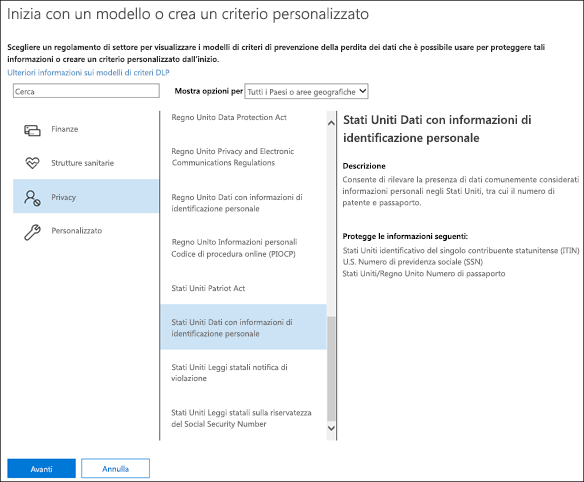
  
L'organizzazione può anche avere requisiti specifici personalizzati, nel qual caso è possibile creare criteri di prevenzione della perdita dei dati da zero scegliendo l'opzione **Criteri personalizzati**.Your organization may also have its own specific requirements, in which case you can create a DLP policy from scratch by choosing the **Custom policy** option. I criteri personalizzati sono vuoti e non contengono regole predefinite.A custom policy is empty and contains no premade rules. 
  
## Distribuzione graduale dei criteri DLP attraverso la modalità testRoll out DLP policies gradually with test mode

Quando si creano i criteri di prevenzione della perdita dei dati, considerare l'opportunità di implementarli gradualmente per valutarne l'impatto e testarne l'efficacia prima di applicarli.When you create your DLP policies, you should consider rolling them out gradually to assess their impact and test their effectiveness before fully enforcing them. Ad esempio, quando non si desidera che un nuovo criterio di prevenzione della perdita dei dati blocchi accidentalmente l'accesso a centinaia di documenti necessari alle attività lavorative degli utenti.For example, you don't want a new DLP policy to unintentionally block access to thousands of documents that people require access to in order to get their work done.
  
Se si creano criteri DLP con un forte impatto potenziale, si consiglia di attenersi alla sequenza riportata di seguito:If you're creating DLP policies with a large potential impact, we recommend following this sequence:
  
1. **Iniziare in modalità test senza suggerimenti per i criteri**, quindi utilizzare i report di prevenzione della perdita dei dati e i rapporti operazioni non consentite per valutare l'impatto.**Start in test mode without Policy Tips** and then use the DLP reports and any incident reports to assess the impact. È possibile usare i report di prevenzione della perdita dei dati per visualizzare il numero, la posizione, il tipo e la gravità delle corrispondenze ai criteri.You can use DLP reports to view the number, location, type, and severity of policy matches. In base ai risultati, è possibile ottimizzare le regole come necessario.Based on the results, you can fine tune the rules as needed. In modalità test, i criteri DLP non avranno effetto sulla produttività degli utenti dell'organizzazione.In test mode, DLP policies will not impact the productivity of people working in your organization. 
    
2. **Passare alla modalità test con notifiche e suggerimenti per i criteri** in modo da istruire gli utenti in merito ai criteri di conformità e prepararli all'applicazione delle regole. In questa fase, è inoltre possibile chiedere agli utenti di segnalare i falsi positivi per definire ulteriormente le regole.**Move to Test mode with notifications and Policy Tips** so that you can begin to teach users about your compliance policies and prepare them for the rules that are going to be applied. At this stage, you can also ask users to report false positives so that you can further refine the rules. 
    
3. **Avviare l'applicazione dei criteri** in modo che le azioni nelle regole siano applicate e i contenuti protetti.**Start full enforcement on the policies** so that the actions in the rules are applied and the content's protected. Continuare a eseguire il monitoraggio dei report di prevenzione della perdita dei dati e dei rapporti operazioni non consentite oppure delle notifiche per essere certi di ottenere i risultati desiderati.Continue to monitor the DLP reports and any incident reports or notifications to make sure that the results are what you intend. 
    
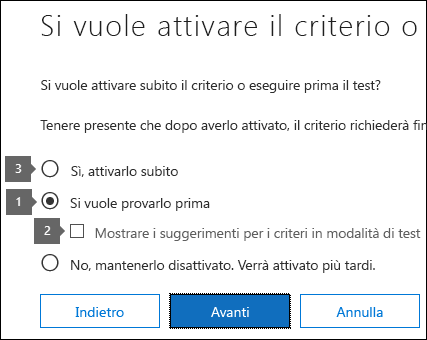
  
È possibile disattivare un criterio di prevenzione della perdita dei dati in qualsiasi momento, disabilitando anche tutte le regole al suo interno.You can turn off a DLP policy at any time, which affects all rules in the policy. Tuttavia, ogni regola può essere disattivata anche singolarmente, regolandone lo stato nell'editor di regole.However, each rule can also be turned off individually by toggling its status in the rule editor.
  
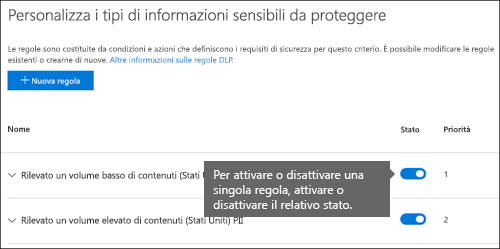

È anche possibile modificare la priorità di più regole in un criterio.You can also change the priority of multiple rules in a policy. Per farlo, aprire un criterio per modificarlo.To do that, open a policy for editing. In una riga per una regola, scegliere i puntini di sospensione (**...**), quindi scegliere un'opzione, ad esempio **Sposta giù** o **Porta su ultimo**.In a row for a rule, choose the ellipses (**...**), and then choose an option, such as **Move down** or **Bring to last**.

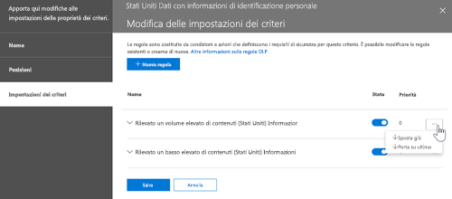
  
## Report di prevenzione della perdita dei datiDLP reports

Dopo aver creato e attivato i criteri di prevenzione della perdita dei dati, è consigliabile verificare che funzionino come previsto e consentano di mantenere la conformità.After you create and turn on your DLP policies, you'll want to verify that they're working as you intended and helping you stay compliant. Con i report dei criteri di prevenzione della perdita dei dati, è possibile visualizzare il numero di corrispondenze con i criteri e con le regole nel corso del tempo, oltre al numero dei falsi positivi e delle regole ignorate.With DLP reports, you can quickly view the number of DLP policy and rule matches over time, and the number of false positives and overrides. Per ogni report è possibile filtrare le corrispondenze per posizione, intervallo di tempo e anche restringere la ricerca a uno specifico criterio, regola o azione.For each report, you can filter those matches by location, time frame, and even narrow it down to a specific policy, rule, or action.
  
Con i report dei criteri di prevenzione della perdita dei dati, si ottengono informazioni aziendali ed è possibile:With the DLP reports, you can get business insights and:
  
- Concentrare l'attenzione su intervalli di tempo specifici e comprendere i motivi di eventuali impennate e tendenze.Focus on specific time periods and understand the reasons for spikes and trends.
    
- Individuare le procedure aziendali che violano i criteri di conformità dell'organizzazione.Discover business processes that violate your organization's compliance policies.
    
- Comprendere l'eventuale impatto aziendale dei criteri DLP.Understand any business impact of the DLP policies.
    
Inoltre, è possibile utilizzare i report DLP per ottimizzare i criteri DLP, quando vengono eseguiti.In addition, you can use the DLP reports to fine tune your DLP policies as you run them.
  
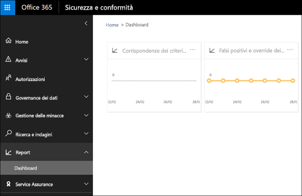
  
## Funzionamento dei criteri DLPHow DLP policies work

DLP permette di rilevare le informazioni riservate tramite un'analisi approfondita dei contenuti (non solo una semplice analisi del testo). Questa analisi approfondita utilizza corrispondenze delle parole chiave, del dizionario, la valutazione di espressioni regolari, funzioni interne e di altri metodi al fine di rilevare i contenuti corrispondenti ai criteri DLP. Viene considerata riservata potenzialmente solo una piccola percentuale dei dati. Un criterio DLP consente di identificare, monitorare e proteggere automaticamente solo tali dati, senza influire in alcun modo sul lavoro degli utenti con il resto del contenuto.DLP detects sensitive information by using deep content analysis (not just a simple text scan). This deep content analysis uses keyword matches, dictionary matches, the evaluation of regular expressions, internal functions, and other methods to detect content that matches your DLP policies. Potentially only a small percentage of your data is considered sensitive. A DLP policy can identify, monitor, and automatically protect just that data, without impeding or affecting people who work with the rest of your content.
  
### I criteri sono sincronizzatiPolicies are synced

Dopo aver creato un criterio di prevenzione della perdita dei dati nel Centro sicurezza e conformità, tale criterio viene salvato in un apposito archivio centrale e successivamente viene sincronizzato con le diverse origini di contenuti, tra cui:After you create a DLP policy in the Security &amp; Compliance Center, it's stored in a central policy store, and then synced to the various content sources, including:
  
- Exchange Online e da qui con Outlook sul web e OutlookExchange Online, and from there to Outlook on the web and Outlook
    
- Siti di OneDrive for BusinessOneDrive for Business sites
    
- Siti SharePoint OnlineSharePoint Online sites
    
- Applicazioni desktop di Office (Excel, PowerPoint e Word)Office desktop programs (Excel, PowerPoint, and Word)

- Messaggi di chat e canali di Microsoft TeamsMicrosoft Teams channels and chat messages
    
In seguito alla sincronizzazione del criterio con il percorso corretto, viene avviata la valutazione del contenuto e l'applicazione delle azioni.After the policy's synced to the right locations, it starts to evaluate content and enforce actions.
<!-- what is the time delay for first deployment of a policy and what is the sync schedule? -->
  
### Valutazione dei criteri nei siti OneDrive for Business e SharePoint OnlinePolicy evaluation in OneDrive for Business and SharePoint Online sites

In tutti i siti SharePoint Online e in tutti quelli di OneDrive for Business, i documenti vengono modificati costantemente: vengono creati, modificati, condivisi e così via.Across all of your SharePoint Online sites and OneDrive for Business sites, documents are constantly changing — they're continually being created, edited, shared, and so on. Questo implica che in qualsiasi momento possono entrare in conflitto o diventare conformi a un criterio di prevenzione della perdita dei dati.This means documents can conflict or become compliant with a DLP policy at any time. Ad esempio, una persona può caricare un documento che non contiene informazioni riservate nel proprio sito del team, ma in seguito un'altra persona può modificarlo e aggiungervi informazioni riservate.For example, a person can upload a document that contains no sensitive information to their team site, but later, a different person can edit the same document and add sensitive information to it.
  
Per questo motivo, i criteri di prevenzione della perdita dei dati controllano frequentemente in background la presenza di corrispondenze con i criteri,For this reason, DLP policies check documents for policy matches frequently in the background. in una sorta di valutazione asincrona.You can think of this as asynchronous policy evaluation.
<!-- what is the frequency? looks like it is tied to the search crawl schedule -->
  
#### FunzionamentoHow it works
 
Mentre vengono aggiunti o modificati documenti nei siti, il motore di ricerca esamina il contenuto in modo che possa essere cercato in seguito.As people add or change documents in their sites, the search engine scans the content, so that you can search for it later. Nel frattempo, il contenuto viene anche analizzato per rilevare informazioni riservate e verificare se vengono condivise.While this is happening, the content's also scanned for sensitive information and to check if it's shared. Tutte le informazioni riservate trovate vengono archiviate in sicurezza nell'indice di ricerca, a cui può accedere solo il team di conformità, e non utenti ordinari.Any sensitive information that's found is stored securely in the search index, so that only the compliance team can access it, but not typical users. Ogni criterio di prevenzione della perdita dei dati attivato viene eseguito in background (in modo asincrono), controllando frequentemente la ricerca di eventuali contenuti che corrispondono a un criterio e applicando le azioni per proteggerli da divulgazioni involontarie.Each DLP policy that you've turned on runs in the background (asynchronously), checking search frequently for any content that matches a policy, and applying actions to protect it from inadvertent leaks.
  
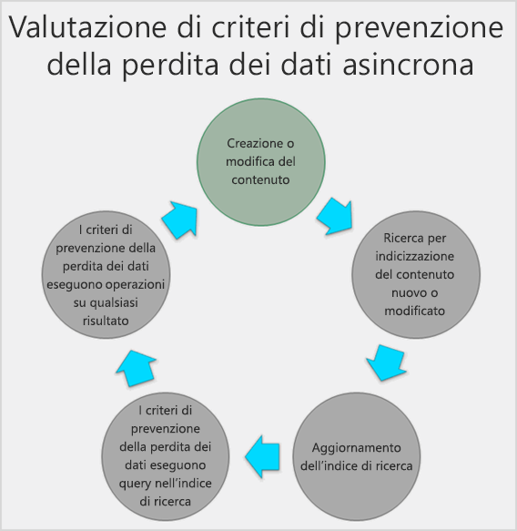
  
<!-- conflict with a DLP policy is bad wording --> Infine, i documenti possono essere in conflitto con un criterio DLP ma possono anche diventare conformi a tale criterio. Ad esempio, se una persona aggiunge numeri di carta di credito a un documento, è possibile che un criterio DLP blocchi l'accesso a tale documento automaticamente. Tuttavia, se in un secondo momento l'utente elimina le informazioni riservate, l'azione (in questo caso, di blocco) viene automaticamente annullata durante la successiva valutazione del documento rispetto al criterio. Finally, documents can conflict with a DLP policy, but they can also become compliant with a DLP policy. For example, if a person adds credit card numbers to a document, it might cause a DLP policy to block access to the document automatically. But if the person later removes the sensitive information, the action (in this case, blocking) is automatically undone the next time the document is evaluated against the policy.
  
I criteri di prevenzione della perdita dei dati valutano tutti i contenuti che possono essere indicizzati.DLP evaluates any content that can be indexed. Per altre informazioni sui tipi di file sottoposti per impostazione predefinita a ricerca per indicizzazione, vedere [Estensioni dei nomi di file sottoposti a ricerca per indicizzazione e tipi di file analizzati predefiniti in SharePoint Server](https://docs.microsoft.com/SharePoint/technical-reference/default-crawled-file-name-extensions-and-parsed-file-types).For more information on what file types are crawled by default, see [Default crawled file name extensions and parsed file types in SharePoint Server](https://docs.microsoft.com/SharePoint/technical-reference/default-crawled-file-name-extensions-and-parsed-file-types).
  
### Valutazione dei criteri in Exchange Online, Outlook e Outlook sul webPolicy evaluation in Exchange Online, Outlook, and Outlook on the web

Quando si creano criteri di prevenzione della perdita dei dati che includono Exchange Online come posizione, i criteri vengono sincronizzati dal Centro sicurezza e conformità di Office 365 con Exchange Online e quindi da Exchange Online con Outlook sul web e Outlook.When you create a DLP policy that includes Exchange Online as a location, the policy's synced from the Office 365 Security &amp; Compliance Center to Exchange Online, and then from Exchange Online to Outlook on the web and Outlook.
  
Quando un messaggio viene composto in Outlook, l'utente può visualizzare suggerimenti per i criteri man mano che il contenuto creato viene valutato rispetto ai criteri di prevenzione della perdita dei dati.When a message is being composed in Outlook, the user can see policy tips as the content being created is evaluated against DLP policies. Dopo l'invio, il messaggio viene valutato rispetto ai criteri di prevenzione della perdita dei dati nell'ambito delle normali operazioni del flusso di posta, oltre che rispetto alle regole del flusso di posta di Exchange (dette anche regole di trasporto) e ai criteri di prevenzione della perdita dei dati creati nell'interfaccia di amministrazione di Exchange.And after a message is sent, it's evaluated against DLP policies as a normal part of mail flow, along with Exchange mail flow rules (also known as transport rules) and DLP policies created in the Exchange admin center. I criteri di prevenzione della perdita dei dati analizzano sia il messaggio che gli allegati.DLP policies scan both the message and any attachments.
  
### Valutazione dei criteri nei programmi desktop di OfficePolicy evaluation in the Office desktop programs

<!-- same capability to identify sensitive information line conflates sensitive information types and such -->
Excel, PowerPoint e Word dispongono della stessa funzionalità di SharePoint Online e OneDrive for Business che consente di identificare le informazioni riservate e applicare i criteri di prevenzione della perdita dei dati.Excel, PowerPoint, and Word include the same capability to identify sensitive information and apply DLP policies as SharePoint Online and OneDrive for Business. Questi programmi di Office sincronizzano i propri criteri di prevenzione della perdita dei dati direttamente dall'archivio dei criteri centrale e quindi valutano continuamente i contenuti rispetto ai criteri di prevenzione della perdita dei dati quando gli utenti lavorano con documenti aperti da un sito incluso in un criterio.These Office programs sync their DLP policies directly from the central policy store, and then continuously evaluate the content against the DLP policies when people work with documents opened from a site that's included in a DLP policy.
  
La valutazione dei criteri di prevenzione della perdita dei dati in Office è progettata per non influire sulle prestazioni dei programmi o sulla produttività degli utenti.DLP policy evaluation in Office is designed not to affect the performance of the programs or the productivity of people working on content. Se questi ultimi sono impegnati su un documento di grandi dimensioni oppure il computer di un utente è occupato, potrebbe essere necessario attendere qualche secondo prima che venga visualizzato un suggerimento per i criteri.If they're working on a large document, or the user's computer is busy, it might take a few seconds for a policy tip to appear.

### Valutazione dei criteri in Microsoft TeamsPolicy evaluation in Microsoft Teams
 <!--what do you mean that it's synched to user accounts?  I thought DLP policies were applied to locations not users like sensitivity labels are  -->

Quando si creano criteri di prevenzione della perdita dei dati che includono Microsoft teams come posizione, i criteri vengono sincronizzati dal Centro sicurezza e conformità di Office 365 con gli account utente e i messaggi di chat e canali di Microsoft Teams.When you create a DLP policy that includes Microsoft Teams as a location, the policy's synced from the Office 365 Security &amp; Compliance Center to user accounts and Microsoft Teams channels and chat messages. A seconda di come vengono configurati i criteri di prevenzione della perdita dei dati, quando qualcuno tenta di condividere informazioni riservate in un messaggio di chat o canale di Microsoft Teams, è possibile bloccare o revocare il messaggio.Depending on how DLP policies are configured, when someone attempts to share sensitive information in a Microsoft Teams chat or channel message, the message can be blocked or revoked. Inoltre, i documenti che contengono informazioni riservate condivisi con utenti guest (utenti esterni), non potranno essere aperti da tali utenti.And, documents that contain sensitive information and that are shared with guests (external users) won't open for those users. Per ulteriori informazioni, vedere [Prevenzione della perdita dei dati e Microsoft Teams](dlp-microsoft-teams.md).To learn more, see [Data loss prevention and Microsoft Teams](dlp-microsoft-teams.md).
 
## AutorizzazioniPermissions

I membri del team conformità addetti alla creazione dei criteri di prevenzione della perdita dei dati necessitano delle autorizzazioni per accedere al Centro sicurezza e conformità.Members of your compliance team who will create DLP policies need permissions to the Security &amp; Compliance Center. Per impostazione predefinita, l'amministratore del tenant avrà accesso a questa posizione e potrà fornire ai responsabili della conformità e ad altre persone l'accesso al Centro sicurezza e conformità, senza concedere tutte le autorizzazioni di un amministratore del tenant. Per farlo, è consigliabile:By default, your tenant admin will have access to this location and can give compliance officers and other people access to the Security &amp; Compliance Center, without giving them all of the permissions of a tenant admin. To do this, we recommend that you:
  
1. Creare un gruppo in Office 365 e aggiungervi i responsabili della conformità.Create a group in Office 365 and add compliance officers to it.
    
2. Creare un gruppo di ruoli nella pagina **Autorizzazioni** del Centro sicurezza e conformità.Create a role group on the **Permissions** page of the Security &amp; Compliance Center. 
    
3. Aggiungere il gruppo di Office 365 al gruppo di ruoli.Add the Office 365 group to the role group.
    
Per altre informazioni, vedere [Concedere agli utenti l'accesso al Centro conformità di Office 365](../security/office-365-security/grant-access-to-the-security-and-compliance-center.md).For more information, see [Give users access to the Office 365 Compliance Center](../security/office-365-security/grant-access-to-the-security-and-compliance-center.md).
  
Queste autorizzazioni sono necessarie solo per creare e applicare criteri di prevenzione della perdita dei dati.These permissions are required only to create and apply a DLP policy. L'applicazione dei criteri non richiede l'accesso al contenuto.Policy enforcement does not require access to the content.
  
## Trovare i cmdlet di prevenzione della perdita dei datiFind the DLP cmdlets

Per usare la maggior parte dei cmdlet per il Centro sicurezza e conformità, è necessario:To use most of the cmdlets for the Security &amp; Compliance Center, you need to:
  
1. [Connettersi al Centro sicurezza e conformità di Office 365 utilizzando la sessione remota di PowerShell](https://docs.microsoft.com/powershell/exchange/office-365-scc/connect-to-scc-powershell/connect-to-scc-powershell?view=exchange-ps).[Connect to the Office 365 Security &amp; Compliance Center using remote PowerShell](https://docs.microsoft.com/powershell/exchange/office-365-scc/connect-to-scc-powershell/connect-to-scc-powershell?view=exchange-ps)
    
2. Usare uno di questi [cmdlet policy-and-compliance-dlp](https://docs.microsoft.com/powershell/module/exchange/policy-and-compliance-dlp/export-dlppolicycollection?view=exchange-ps)Use any of these [policy-and-compliance-dlp cmdlets](https://docs.microsoft.com/powershell/module/exchange/policy-and-compliance-dlp/export-dlppolicycollection?view=exchange-ps)
    
I report dei criteri di prevenzione della perdita dei dati devono tuttavia estrarre i dati da Office 365, incluso Exchange Online.However, DLP reports need pull data from across Office 365, including Exchange Online. Per questo motivo, **i cmdlet per questi report sono disponibili in PowerShell per Exchange Online e non in PowerShell per Centro sicurezza e conformità**.For this reason, **the cmdlets for the DLP reports are available in Exchange Online Powershell -- not in Security &amp; Compliance Center Powershell**. Per usare i cmdlet per i report dei criteri di prevenzione della perdita dei dati, è quindi necessario:Therefore, to use the cmdlets for the DLP reports, you need to:
  
1. [Connettersi a Exchange Online tramite la sessione remota di PowerShellConnect to Exchange Online using remote PowerShell](https://docs.microsoft.com/powershell/exchange/exchange-online/connect-to-exchange-online-powershell/connect-to-exchange-online-powershell?view=exchange-ps)
    
2. Usare uno di questi cmdlet per i report dei criteri di prevenzione della perdita dei dati:Use any of these cmdlets for the DLP reports:
    
  - [Get-DlpDetectionsReportGet-DlpDetectionsReport](https://docs.microsoft.com/powershell/module/exchange/policy-and-compliance-dlp/Get-DlpDetectionsReport?view=exchange-ps)
    
  - [Get-DlpDetailReportGet-DlpDetailReport](https://docs.microsoft.com/powershell/module/exchange/policy-and-compliance-dlp/Get-DlpDetailReport?view=exchange-ps)
    
## Ulteriori informazioniMore information

- [Creare un criterio di prevenzione della perdita dei dati da un modelloCreate a DLP policy from a template](create-a-dlp-policy-from-a-template.md)
    
- [Inviare notifiche e visualizzare i suggerimenti per i criteri di prevenzione della perdita dei datiSend notifications and show policy tips for DLP policies](use-notifications-and-policy-tips.md)
    
- [Creare criteri di prevenzione della perdita dei dati per proteggere i documenti con FCI o altre proprietàCreate a DLP policy to protect documents with FCI or other properties](protect-documents-that-have-fci-or-other-properties.md)
    
- [Elementi inclusi nei modelli dei criteri di prevenzione della perdita dei datiWhat the DLP policy templates include](what-the-dlp-policy-templates-include.md)
    
- [Elementi cercati dai tipi di informazioni riservateWhat the sensitive information types look for](what-the-sensitive-information-types-look-for.md)
    
- [Cosa individuano le funzioni di prevenzione della perdita dei datiWhat the DLP functions look for](what-the-dlp-functions-look-for.md)
    
- [Creare una tipologia personalizzata di informazioni riservateCreate a custom sensitive information type](create-a-custom-sensitive-information-type.md)
    

