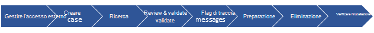
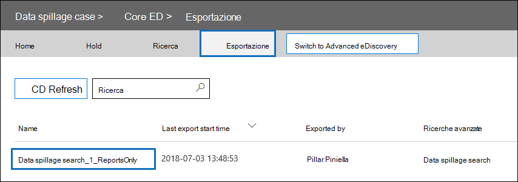

# Serie di soluzioni eDiscovery: scenario di fuoriuscita di dati - Ricerca ed eliminazioneeDiscovery solution series: Data spillage scenario - Search and purge

 **Che cos'è la fuoriuscita di dati e perché è importante?****What is data spillage and why should you care?** La perdita di dati si verifica quando un documento riservato viene rilasciato in un ambiente non attendibile.Data spillage is when a confidential document is released into an untrusted environment. Quando viene rilevato un incidente di fuoriuscita di dati, è importante valutare rapidamente le dimensioni e le posizioni della fuoriuscita, esaminare le attività degli utenti intorno a esso e quindi eliminare definitivamente i dati versati dal sistema.When a data spillage incident is detected, it's important to quickly assess the size and locations of the spillage, examine user activities around it,  and then permanently purge the spilled data from the system. 
  
## Scenario di fuoriuscita di datiData spillage scenario

Si è un responsabile della sicurezza delle informazioni presso Contoso.You're a lead information security officer at Contoso. Si è informati di una situazione di fuoriuscita di dati in cui un dipendente ha condiviso inconsapevolmente un documento estremamente riservato con più persone tramite posta elettronica.You are informed of a data spillage situation where an employee unknowingly shared a highly confidential document with multiple people through email. Si desidera valutare rapidamente chi ha ricevuto questo documento internamente ed esternamente.You want to quickly assess who received this document internally and externally. Una volta identificato, si desidera condividere i risultati del caso con altri investigatori per esaminare e quindi rimuovere definitivamente i dati da Office 365.Once identified, you would like to share case findings with other investigators to review, and then permanently remove the data from Office 365. Al termine dell'indagine, si desidera generare un report con la prova della rimozione definitiva e altri dettagli del caso per qualsiasi riferimento futuro.After the investigation is complete, you want to generate a report with the evidence of permanent removal and other case details for any future reference.
  
### Ambito di questo articoloScope of this article

In questo documento viene fornito un elenco di istruzioni su come rimuovere definitivamente un messaggio da Microsoft 365 in modo che non sia accessibile o ripristinabile.This document provides a list of instructions on how to permanently remove a message from Microsoft 365 so that it's not accessible or recoverable. Per eliminare un messaggio e renderlo ripristinabile fino alla scadenza del periodo di conservazione degli elementi eliminati, vedere [Search for and delete email messages in your organization](search-for-and-delete-messages-in-your-organization.md).To delete a message and make it recoverable until the deleted item retention period expires, see [Search for and delete email messages in your organization](search-for-and-delete-messages-in-your-organization.md).
  
## Flusso di lavoro per la gestione degli incidenti di fuoriuscita di datiWorkflow for managing data spillage incidents

Ecco come gestire un evento imprevisto di fuoriuscita di dati:Here's a how to manage a data spillage incident:

  
[(Facoltativo) Passaggio 1: gestire chi può accedere al caso e impostare i limiti di conformità(Optional) Step 1: Manage who can access the case and set compliance boundaries](#optional-step-1-manage-who-can-access-the-case-and-set-compliance-boundaries) 
[Passaggio 2: Creare un caso di eDiscoveryStep 2: Create an eDiscovery case](#step-2-create-an-ediscovery-case) 
[Passaggio 3: cercare i dati sversatiStep 3: Search for the spilled data](#step-3-search-for-the-spilled-data) 
[Passaggio 4: Esaminare e convalidare i risultati dei casiStep 4: Review and validate case findings](#step-4-review-and-validate-case-findings) 
[Passaggio 5: Utilizzare il registro di traccia dei messaggi per verificare la modalità di condivisione dei dati riversatiStep 5: Use message trace log to check how spilled data was shared](#step-5-use-message-trace-log-to-check-how-spilled-data-was-shared) 
[Passaggio 6: Preparare le cassette postaliStep 6: Prepare the mailboxes](#step-6-prepare-the-mailboxes) 
[Passaggio 7: Eliminare definitivamente i dati sversatiStep 7: Permanently delete the spilled data](#step-7-permanently-delete-the-spilled-data) 
[Passaggio 8: verificare, fornire una prova di eliminazione e controllareStep 8: Verify, provide a proof of deletion, and audit](#step-8-verify-provide-a-proof-of-deletion-and-audit) 

## Informazioni da conoscere prima di iniziareThings to know before you start

- Quando una cassetta postale è in attesa, un messaggio eliminato rimane nella cartella Elementi ripristinabili fino alla scadenza del periodo di conservazione o al rilascio del blocco.When a mailbox is on hold, a deleted message remains in the Recoverable Items folder until the retention period expires or the hold is released. [Il passaggio 6](#step-6-prepare-the-mailboxes) descrive come rimuovere il blocco dalle cassette postali.[Step 6](#step-6-prepare-the-mailboxes) describes how to remove hold from the mailboxes. Prima di rimuovere il blocco, rivolgersi alla gestione dei record o ai reparti legali.Check with your records management or legal departments before removing the hold. L'organizzazione potrebbe avere un criterio che definisce se una cassetta postale in attesa o un evento imprevisto di perdita dei dati ha la priorità.Your organization might have a policy that defines whether a mailbox on hold or a data spillage incident takes priority. 
    
- Per controllare quali cassette postali degli utenti un investigatore per la fuoriuscita di dati può cercare e gestire chi può accedere al caso, è possibile impostare i limiti di conformità e creare un gruppo di ruoli personalizzato, descritto nel [passaggio 1.](#optional-step-1-manage-who-can-access-the-case-and-set-compliance-boundaries)To control which user mailboxes an data spillage investigator can search and manage who can access the case, you can set up compliance boundaries and create a custom role group, which is described in [Step 1](#optional-step-1-manage-who-can-access-the-case-and-set-compliance-boundaries). A tale scopo, è necessario essere membri del gruppo di ruoli Gestione organizzazione o essere assegnati al ruolo di gestione dei ruoli.To do this, you have to be a member of the Organization Management role group or be assigned the role management role. Se l'utente o l'amministratore dell'organizzazione ha già impostato limiti di conformità, è possibile ignorare il passaggio 1.If you or in administrator in your organization has already set compliance boundaries, you can skip Step 1.
    
- Per creare un caso, è necessario essere membri del gruppo di ruoli Manager eDiscovery o essere membri di un gruppo di ruoli personalizzato a cui è assegnato il ruolo Gestione casi.To create a case, you must be a member of the eDiscovery Manager role group or be a member of a custom role group that's assigned the Case Management role. If you're not a member, ask a Microsoft 365 administrator to [add you to the eDiscovery manager role group](assign-ediscovery-permissions.md).If you're not a member, ask a Microsoft 365 administrator to [add you to the eDiscovery manager role group](assign-ediscovery-permissions.md).
    
- Per creare ed eseguire una ricerca di contenuto, è necessario essere un membro del gruppo di ruoli di gestione di eDiscovery o disporre del ruolo di gestione della ricerca di conformità.To create and run a Content Search, you have to be a member of the eDiscovery Manager role group or be assigned the Compliance Search management role. Per eliminare i messaggi, è necessario essere un membro del gruppo di ruoli Gestione organizzazione o disporre del ruolo di gestione di ricerca ed eliminazione.To delete messages, you have to be a member of the Organization Management role group or be assigned the Search And Purge management role. Per informazioni su come aggiungere gli utenti a un gruppo di ruoli, vedere [Assegnare autorizzazioni di eDiscovery nel Centro sicurezza e conformità](./assign-ediscovery-permissions.md).For information about adding users to a role group, see [Assign eDiscovery permissions in the Security & Compliance Center](./assign-ediscovery-permissions.md).
    
- Per eseguire ricerche nelle attività di eDiscovery del log di controllo nel passaggio 8, è necessario che il controllo sia attivato per l'organizzazione.To search the audit log eDiscovery activities in Step 8, auditing must be turned on for your organization. È possibile cercare le attività eseguite negli ultimi 90 giorni.You can search for activities that were performed within the last 90 days. Per ulteriori informazioni su come abilitare e usare il controllo, vedere la sezione Controllo [del](#auditing-the-data-spillage-investigation-process) processo di indagine sulla fuoriuscita di dati nel passaggio 8.To learn more about how to enable and use auditing, see the [Auditing the data spillage investigation process](#auditing-the-data-spillage-investigation-process) section in Step 8. 
    
## (Facoltativo) Passaggio 1: gestire chi può accedere al caso e impostare i limiti di conformità(Optional) Step 1: Manage who can access the case and set compliance boundaries

A seconda della pratica dell'organizzazione, è necessario controllare chi può accedere al caso di eDiscovery utilizzato per analizzare un evento imprevisto di sversamento dei dati e impostare i limiti di conformità.Depending on your organizational practice, you need to control who can access the eDiscovery case used to investigate a data spillage incident and set up compliance boundaries. Il modo più semplice per eseguire questa operazione è aggiungere gli investigatori come membri di un gruppo di ruoli esistente nel Centro sicurezza & Conformità e quindi aggiungere il gruppo di ruoli come membro del caso di eDiscovery.The easiest way to do this is to add investigators as members of an existing role group in the Security & Compliance Center and then add the role group as a member of the eDiscovery case. Per informazioni sui gruppi di ruoli eDiscovery incorporati e su come aggiungere membri a un caso di eDiscovery, vedere [Assign eDiscovery permissions](assign-ediscovery-permissions.md).For information about the built-in eDiscovery role groups and how to add members to an eDiscovery case, see [Assign eDiscovery permissions](assign-ediscovery-permissions.md).
  
È inoltre possibile creare un nuovo gruppo di ruoli in linea con le esigenze dell'organizzazione.You can also create a new role group that aligns with your organizational needs. Ad esempio, è possibile che un gruppo di investigatori della fuoriuscita di dati nell'organizzazione possa accedere e collaborare a tutti i casi di fuoriuscita di dati.For example, you might want a group of data spillage investigators in the organization to access and collaborate on all data spillage cases. A tale scopo, è possibile creare un gruppo di ruoli "Investigatore perdita dati", assegnare i ruoli appropriati (Export, RMS Decrypt, Review, Preview, Compliance Search e Case Management), aggiungere gli investigatori per la fuoriuscita di dati al gruppo di ruoli e quindi aggiungere il gruppo di ruoli come membro del caso di eDiscovery per la fuoriuscita di dati.You can do this by creating a "Data Spillage Investigator" role group, assigning the appropriate roles (Export, RMS Decrypt, Review, Preview, Compliance Search, and Case Management), adding the data spillage investigators to the role group, and then adding the role group as a member of the data spillage eDiscovery case. Per istruzioni dettagliate su come eseguire questa operazione, vedere Set [up compliance boundaries for eDiscovery investigations in Office 365.](tagging-and-assessment-in-advanced-ediscovery.md)See [Set up compliance boundaries for eDiscovery investigations in Office 365](tagging-and-assessment-in-advanced-ediscovery.md) for detailed instructions on how to do this. 
  
## Passaggio 2: Creare un caso di eDiscoveryStep 2: Create an eDiscovery case

Un caso di eDiscovery rappresenta un modo efficace per gestire l'indagine sulla fuoriuscita di dati.An eDiscovery case provides an effective way to manage your data spillage investigation. È possibile aggiungere membri al gruppo di ruoli creato nel passaggio 1, aggiungere il gruppo di ruoli come membro di un nuovo caso di eDiscovery, eseguire ricerche iterative per trovare i dati fuoriusciti, esportare un report da condividere, tenere traccia dello stato del caso e quindi fare riferimento ai dettagli del caso, se necessario.You can add members to the role group that you created in Step 1, add the role group as a member of new a eDiscovery case, perform iterative searches to find the spilled data, export a report to share, track the status of the case, and then refer back to the details of the case if needed. Prendere in considerazione la possibilità di stabilire una convenzione di denominazione per i casi di eDiscovery utilizzati per gli incidenti di fuoriuscita di dati e fornire il maggior numero di informazioni possibile nel nome e nella descrizione del caso in modo da poter individuare e fare riferimento in futuro, se necessario.Consider establishing a naming convention for eDiscovery cases used for data spillage incidents, and provide as much information as you can in the case name and description so you can locate and refer to in the future if necessary.
  
Per creare un nuovo caso, è possibile utilizzare eDiscovery nel Centro sicurezza e conformità.To create a new case, you can use eDiscovery in the security and compliance center. Vedere "Creare un nuovo caso" in [Introduzione a Core eDiscovery.](get-started-core-ediscovery.md#step-3-create-a-core-ediscovery-case)See "Create a new case" in [Get started with Core eDiscovery](get-started-core-ediscovery.md#step-3-create-a-core-ediscovery-case).
  
## Passaggio 3: cercare i dati sversatiStep 3: Search for the spilled data

Dopo aver creato un caso e l'accesso gestito, è possibile utilizzare il caso per cercare in modo iterativo i dati riversati e identificare le cassette postali che contengono i dati versati.Now that you've created a case and managed access, you can use the case to iteratively search to find the spilled data and identify the mailboxes that contain the spilled data. Verrà utilizzata la stessa query di ricerca utilizzata per trovare i messaggi di posta elettronica per eliminare gli stessi messaggi [nel passaggio 7.](#step-7-permanently-delete-the-spilled-data)You will use the same search query that you used to find the email messages to delete those same messages in [Step 7](#step-7-permanently-delete-the-spilled-data).
  
Per creare una ricerca di contenuto associata a un caso di eDiscovery, vedere [Search for content in a Core eDiscovery case.](search-for-content-in-core-ediscovery.md)To create a content search associated with an eDiscovery case, see [Search for content in a Core eDiscovery case](search-for-content-in-core-ediscovery.md).
  
> [!IMPORTANT]
> Le parole chiave utilizzate nella query di ricerca possono contenere i dati effettivamente fuoriusciti che si stanno cercando.The keywords that you use in the search query may contain the actual spilled data that you're searching for. Ad esempio, se si cercano documenti contenenti un numero di previdenza sociale e si utilizza la parola chiave it come parola chiave di ricerca, è necessario eliminare la query in seguito per evitare ulteriori perdite.For example, if you searching for documents containing a social security number and you use the it as search keyword, you must delete the query afterwards to avoid further spillage. Vedere [Eliminazione della query di ricerca](#deleting-the-search-query) nel passaggio 8.See [Deleting the search query](#deleting-the-search-query) in Step 8.
  
## Passaggio 4: Esaminare e convalidare i risultati dei casiStep 4: Review and validate case findings

Dopo aver creato una ricerca di contenuto, è necessario esaminare e convalidare i risultati della ricerca e verificare che siano costituiti solo dai messaggi di posta elettronica che devono essere eliminati.After you create a content search, you need to review and validate that the search results and verify that they consist only of the email messages that must be deleted. In una ricerca di contenuto è possibile visualizzare in anteprima un campionamento casuale di 1.000 messaggi di posta elettronica senza esportare i risultati della ricerca per evitare ulteriori perdite di dati.In a content search, you can preview a random sampling of 1,000 email messages without exporting the search results to avoid further data spillage. Per ulteriori informazioni sulle limitazioni dell'anteprima, vedere [Limiti per la ricerca di contenuto.](limits-for-content-search.md)You can read more about the preview limitations at [Limits for Content Search](limits-for-content-search.md).
  
Se si dispone di più di 1.000 cassette postali o più di 100 messaggi di posta elettronica per ogni cassetta postale da esaminare, è possibile dividere la ricerca iniziale in più ricerche utilizzando parole chiave o condizioni aggiuntive, ad esempio intervallo di date o mittente/destinatario, ed esaminare i risultati di ogni ricerca singolarmente.If you have more than 1,000 mailboxes or more than 100 email messages per mailbox to review, you can divide the initial search into multiple searches by using additional keywords or conditions such as date range or sender/recipient and review the results of each search individually. Annotare tutte le query di ricerca da utilizzare quando si eliminano i messaggi [nel passaggio 7.](#step-7-permanently-delete-the-spilled-data)Make sure to note down all search queries to use when you delete messages in [Step 7](#step-7-permanently-delete-the-spilled-data).

Se a un responsabile o a un utente finale viene assegnata una licenza di Office 365 E5, è possibile esaminare fino a 10.000 risultati di ricerca contemporaneamente tramite Advanced eDiscovery.If a custodian or end user is assigned an Office 365 E5 license, you can examine up to 10,000 search results at once using Advanced eDiscovery. Se sono presenti più di 10.000 messaggi di posta elettronica da esaminare, è possibile dividere la query di ricerca per intervallo di date ed esaminare ogni risultato singolarmente quando i risultati della ricerca vengono ordinati in base alla data.If there are more than 10,000 email messages to review, you can divide the search query by date range and review each result individually as search results are sorted by date. In Advanced eDiscovery, è possibile contrassegnare i risultati della ricerca utilizzando la funzionalità **Etichetta** come nel riquadro di anteprima e filtrare il risultato della ricerca in base al tag etichettato.In Advanced eDiscovery, you can tag search results using the **Label as** feature in the preview panel and filter the search result by the tag you labeled. Ciò è utile quando si collabora con un revisore secondario.This is helpful when you collaborate with a secondary reviewer. Utilizzando strumenti di analisi aggiuntivi in Advanced eDiscovery, ad esempio il riconoscimento ottico dei caratteri, il threading della posta elettronica e la codifica predittiva, è possibile elaborare e rivedere rapidamente migliaia di messaggi e contrassegnarli per un'ulteriore revisione.By using additional analytics tools in Advanced eDiscovery, such as optical character recognition, email threading, and predictive coding, you can quickly process and review thousands of messages and tag them for further review. Vedere [Configurazione rapida per Advanced eDiscovery.](./get-started-with-advanced-ediscovery.md)See [Quick setup for Advanced eDiscovery](./get-started-with-advanced-ediscovery.md).

Quando si trova un messaggio di posta elettronica contenente dati riversati, controllare i destinatari del messaggio per determinare se è stato condiviso esternamente.When you find an email message that contains spilled data, check the recipients of the message to determine if it was shared externally. Per tracciare ulteriormente un messaggio, è possibile raccogliere le informazioni sul mittente e l'intervallo di date in modo da poter utilizzare i registri di traccia dei messaggi, descritti [nel passaggio 5.](#step-5-use-message-trace-log-to-check-how-spilled-data-was-shared)To further trace an message, you can collect sender information and date range so you can use the message trace logs, which is described in [Step 5](#step-5-use-message-trace-log-to-check-how-spilled-data-was-shared).

Dopo aver verificato i risultati della ricerca, è possibile condividere i risultati con altri utenti per una revisione secondaria.After you verified the search results, you may want to share your findings with others for a secondary review. Gli utenti assegnati al caso nel passaggio 1 possono esaminare il contenuto del caso sia in eDiscovery che in Advanced eDiscovery e approvare i risultati del caso.People who you assigned to the case in Step 1 can review the case content in both eDiscovery and Advanced eDiscovery and approve case findings. È inoltre possibile generare un report senza esportare il contenuto effettivo.You can also generate a report without exporting the actual content. È inoltre possibile utilizzare questo stesso report come prova di eliminazione, descritta [nel passaggio 8.](#step-8-verify-provide-a-proof-of-deletion-and-audit)You can also use this same report as a proof of deletion, which is described in [Step 8](#step-8-verify-provide-a-proof-of-deletion-and-audit).
  
 **Per generare un report statistico:****To generate a statistical report:**
  
1. Passare alla **pagina Ricerca** nel caso di eDiscovery e fare clic sulla ricerca per cui si desidera generare un report.Go to the **Search** page in the eDiscovery case, and click the search that you want to generate a report for. 
    
2. Nella pagina a comparsa fare clic su **Altro > esporta report.**On the flyout page, click **More > Export report**.
 
      Viene visualizzata la pagina Esporta report.The Export report page is displayed.

    
    
3. Selezionare **Tutti gli elementi,** inclusi quelli con formato non riconosciuto, sono crittografati o non sono stati indicizzati per altri motivi e quindi fare clic su Genera **report.**Select **All items, including ones that have unrecognized format, are encrypted, or weren't indexed for other reasons** and then click **Generate report**.

4. Nel caso di eDiscovery, fare clic su **Esporta** per visualizzare l'elenco dei processi di esportazione.In the eDiscovery case, click **Export** to display the list of export jobs. Potrebbe essere necessario fare clic **su Aggiorna** per aggiornare l'elenco per visualizzare il processo di esportazione appena creato.You may have to click **Refresh** to update the list to display the export job you just created.

5. Fare clic sul processo di esportazione e quindi su **Scarica** report nella pagina a comparsa.Click the export job, and then click **Download** report on the flyout page.
 
    

Il **report Riepilogo** esportazione contiene il numero di posizioni trovate con i risultati e le dimensioni dei risultati della ricerca.The **Export Summary** report contains the number of locations found with results and the size of the search results. È possibile utilizzarlo per confrontare con il report generato dopo l'eliminazione e fornire come prova di eliminazione.You can use this to compare with the report generated after deletion and provide as a proof of deletion. Il report **Risultati** contiene un riepilogo più dettagliato dei risultati della ricerca, inclusi l'oggetto, il mittente, i destinatari, se il messaggio è stato letto, le date e le dimensioni di ogni messaggio.The **Results** report contains a more detailed summary of the search results, including the subject, sender, recipients, if the email was read, dates, and size of each message. Se uno dei dettagli in questo report contiene i dati effettivamente sversati, assicurarsi di eliminare definitivamente il file Results.csv al termine dell'indagine.If any of the details in this report contains that actual spilled data, be sure to permanently delete the Results.csv file when the investigation is complete.

Per ulteriori informazioni sull'esportazione di report, vedere [Export a Content Search report.](export-a-content-search-report.md)For more information about exporting reports, see [Export a Content Search report](export-a-content-search-report.md).
    
## Passaggio 5: Utilizzare il registro di traccia dei messaggi per verificare la modalità di condivisione dei dati riversatiStep 5: Use message trace log to check how spilled data was shared

Per analizzare ulteriormente se la posta elettronica con dati sversati è stata condivisa, è possibile facoltativamente eseguire una query nei registri di traccia dei messaggi con le informazioni sul mittente e sull'intervallo di date raccolte nel passaggio 4.To further investigate if email with spilled data was shared, you can optionally query the message trace logs with the sender information and the date range information that you gathered in Step 4. Si noti che il periodo di conservazione per la traccia dei messaggi è di 30 giorni per i dati in tempo reale e di 90 giorni per i dati cronologici.Note that the retention period for message trace is 30 days for real time data and 90 days for historical data.
  
È possibile utilizzare Traccia messaggi nel Centro sicurezza e conformità oppure utilizzare i cmdlet corrispondenti in PowerShell di Exchange Online.You can use Message trace in the security and compliance center or use the corresponding cmdlets in Exchange Online PowerShell. È importante notare che l'analisi dei messaggi non offre garanzie complete sulla completezza dei dati restituiti.It's important to note that message tracing doesn't offer full guarantees on the completeness of data returned. Per ulteriori informazioni sull'utilizzo di Traccia messaggi, vedere:For more information about using Message trace, see: 
  
- [Traccia dei messaggi nel Centro sicurezza e conformitàMessage trace in the Security & Compliance Center](../security/defender-365-security/message-trace-scc.md)
    
- [Nuova traccia dei messaggi nel Centro sicurezza & conformitàNew Message Trace in Security & Compliance Center](https://blogs.technet.microsoft.com/exchange/2018/05/02/new-message-trace-in-office-365-security-compliance-center/)
    
## Passaggio 6: Preparare le cassette postaliStep 6: Prepare the mailboxes

Dopo aver esaminato e verificato che i risultati della ricerca contengano solo i messaggi che devono essere eliminati, è necessario raccogliere un elenco degli indirizzi di posta elettronica delle cassette postali influenzate da utilizzare nel passaggio 7 quando si eliminano i dati sversati.After you review and validate that the search results contains only the messages that must be deleted, you need to collect a list of the email addresses of the impacted mailboxes to use in Step 7 when you delete the spilled data. Potrebbe inoltre essere necessario preparare le cassette postali prima di poter eliminare definitivamente i messaggi di posta elettronica a seconda che sia abilitato il ripristino di un singolo elemento nelle cassette postali che contengono i dati versati o se una di queste cassette postali è in attesa.You may also have to prepare the mailboxes before you can permanently delete email messages depending on whether single item recovery is enabled on the mailboxes that contain the spilled data or if any of those mailboxes are on hold.
  
### Ottenere un elenco di indirizzi di cassette postali con dati riversatiGet a list of addresses of mailboxes with spilled data

Esistono due modi per raccogliere un elenco di indirizzi di posta elettronica delle cassette postali con dati riversati.There are two ways to collect a list of email addresses of mailboxes with spilled data.

**Opzione 1: ottenere un elenco di indirizzi di cassette postali con dati riversati****Option 1: Get a list of addresses of mailboxes with spilled data**

1. Aprire il caso eDiscovery, passare alla **pagina Ricerca** e selezionare la ricerca di contenuto appropriata.Open the eDiscovery case, go to the **Search** page and select the appropriate content search. 
    
2. Nella pagina a comparsa fare clic su **Visualizza risultati.**On the flyout page, click **View results**.
    
3. Nell'elenco a discesa **Singoli risultati** fare clic su **Statistiche ricerca**.In the **Individual results** drop down list, click **Search statistics**.
    
4. **Nell'elenco a** discesa Tipo fare clic su **Posizioni principali.**In the **Type** drop down list, click **Top locations**.
    
    

    Viene visualizzato un elenco delle cassette postali che contengono i risultati della ricerca.A list of mailboxes that contain search results is displayed. Viene visualizzato anche il numero di elementi in ogni cassetta postale che corrispondono alla query di ricerca.The number of items in each mailbox that match the search query is also displayed.
    
5. Copiare le informazioni nell'elenco e salvarle in un file o fare clic su **Scarica** per scaricare le informazioni in un file CSV.Copy the information in the list and save it to a file or click **Download** to download the information to a CSV file. 
    
**Opzione 2: ottenere le posizioni delle cassette postali dal report di esportazione****Option 2: Get mailbox locations from the export report**

Aprire il report Riepilogo esportazione scaricato nel [passaggio 4.](#step-4-review-and-validate-case-findings)Open the Export Summary report that you downloaded in [Step 4](#step-4-review-and-validate-case-findings). Nella prima colonna del report, l'indirizzo di posta elettronica di ogni cassetta postale è elencato in **Posizioni**.In the first column in the report, the email address of each mailbox is listed under **Locations**.
  
### Preparare le cassette postali in modo da poter eliminare i dati sversatiPrepare the mailboxes so you can delete the spilled data

Se il ripristino di un singolo elemento è abilitato o se una cassetta postale viene messa in attesa, un messaggio eliminato definitivamente (eliminato) verrà conservato nella cartella Elementi ripristinabili.If single item recovery is enabled or if a mailbox is placed on hold, a permanently deleted (purged) message will be retained in Recoverable Items folder. Pertanto, prima di poter eliminare i dati versati, è necessario controllare le configurazioni delle cassette postali esistenti e disabilitare il ripristino di un singolo elemento e rimuovere qualsiasi blocco o criterio di conservazione.So before you can purge spilled data, you need to check the existing mailbox configurations and disable single item recovery and remove any hold or retention policy. Tenere presente che è possibile preparare una cassetta postale alla volta e quindi eseguire lo stesso comando in cassette postali diverse o creare uno script di PowerShell per preparare più cassette postali contemporaneamente.Keep in mind that you can prepare one mailbox at a time, and then run the same command on different mailboxes or create a PowerShell script to prepare multiple mailboxes at the same time.

- Vedere "Passaggio 1: raccogliere informazioni sulla cassetta postale" in Eliminare gli elementi nella cartella Elementi ripristinabili delle cassette postali basate sul cloud in attesa per istruzioni su come verificare se il ripristino di un singolo elemento è abilitato o se la cassetta postale è messa [in](delete-items-in-the-recoverable-items-folder-of-mailboxes-on-hold.md#step-1-collect-information-about-the-mailbox) attesa o è assegnata a un criterio di conservazione.See "Step 1: Collect information about the mailbox" in [Delete items in the Recoverable Items folder of cloud-based mailboxes on hold](delete-items-in-the-recoverable-items-folder-of-mailboxes-on-hold.md#step-1-collect-information-about-the-mailbox) for instructions about how to check if single item recovery is enabled or if the mailbox is placed on hold or it's assigned to a retention policy. 

- Per istruzioni sulla disabilitazione del ripristino di un singolo elemento, vedere "Passaggio 2: preparare la cassetta postale" in Eliminare elementi nella cartella Elementi ripristinabili delle cassette postali basate su [cloud.](delete-items-in-the-recoverable-items-folder-of-mailboxes-on-hold.md#step-2-prepare-the-mailbox)See "Step 2: Prepare the mailbox" in [Delete items in the Recoverable Items folder of cloud-based mailboxes on hold](delete-items-in-the-recoverable-items-folder-of-mailboxes-on-hold.md#step-2-prepare-the-mailbox) for instructions about disabling single item recovery. 

- Per istruzioni su come rimuovere un blocco o un criterio di conservazione da una cassetta postale, vedere "Passaggio 3: rimuovere tutti i blocchi dalla cassetta postale" in Eliminare gli elementi nella cartella Elementi ripristinabili delle cassette postali basate su [cloud.](delete-items-in-the-recoverable-items-folder-of-mailboxes-on-hold.md#step-3-remove-all-holds-from-the-mailbox)See "Step 3: Remove all holds from the mailbox" in [Delete items in the Recoverable Items folder of cloud-based mailboxes on hold](delete-items-in-the-recoverable-items-folder-of-mailboxes-on-hold.md#step-3-remove-all-holds-from-the-mailbox) for instructions about how to remove a hold or retention policy from a mailbox. 

- Vedere "Passaggio 4: rimuovere il blocco di ritardo dalla cassetta postale" in Eliminare gli elementi nella cartella Elementi ripristinabili delle cassette postali basate sul [cloud](delete-items-in-the-recoverable-items-folder-of-mailboxes-on-hold.md#step-4-remove-the-delay-hold-from-the-mailbox) in attesa per istruzioni sulla rimozione del blocco di ritardo che viene effettuato sulla cassetta postale dopo la rimozione di qualsiasi tipo di blocco.See "Step 4: Remove the delay hold from the mailbox" in [Delete items in the Recoverable Items folder of cloud-based mailboxes on hold](delete-items-in-the-recoverable-items-folder-of-mailboxes-on-hold.md#step-4-remove-the-delay-hold-from-the-mailbox) for instructions about removing the delay hold that is placed on the mailbox after any type of hold is removed.

> [!IMPORTANT]
> Prima di rimuovere un blocco o un criterio di conservazione, rivolgersi ai reparti legali o di gestione dei record.Check with your records management or legal departments before removing a hold or retention policy. L'organizzazione potrebbe avere un criterio che definisce se una cassetta postale in attesa o un evento imprevisto di perdita dei dati ha la priorità.Your organization may have a policy that defines whether a mailbox on hold or a data spillage incident takes priority. 
  
Assicurarsi di ripristinare le configurazioni precedenti della cassetta postale dopo aver verificato che i dati sversati siano stati eliminati definitivamente.Be sure to revert the mailbox to previous configurations after you verify that the spilled data has been permanently deleted. Vedere i dettagli nel [passaggio 7](#step-7-permanently-delete-the-spilled-data).See the details in [Step 7](#step-7-permanently-delete-the-spilled-data).

## Passaggio 7: Eliminare definitivamente i dati sversatiStep 7: Permanently delete the spilled data

Utilizzando le posizioni delle cassette postali raccolte e preparate nel passaggio 6 e la query di ricerca creata e perfezionata nel passaggio 3 per trovare i messaggi di posta elettronica che contengono i dati sversati, è ora possibile eliminare definitivamente i dati versati.Using the mailbox locations that you collected and prepared in Step 6 and the search query that was created and refined in Step 3 to find email messages that contain the spilled data, you can now permanently delete the spilled data.  Come spiegato in precedenza, per eliminare i messaggi, è necessario essere membri del gruppo di ruoli Gestione organizzazione o essere assegnati al ruolo di gestione Ricerca ed eliminazione.As previously explained, to delete messages, you have to be a member of the Organization Management role group or be assigned the Search And Purge management role. Per informazioni su come aggiungere gli utenti a un gruppo di ruoli, vedere [Assegnare autorizzazioni di eDiscovery nel Centro sicurezza e conformità](./assign-ediscovery-permissions.md).For information about adding users to a role group, see [Assign eDiscovery permissions in the Security & Compliance Center](./assign-ediscovery-permissions.md).

Per eliminare i messaggi riversati, vedere i passaggi 2 & 3 in [Cercare ed eliminare i messaggi di posta elettronica](./search-for-and-delete-messages-in-your-organization.md)To delete the spilled messages, see steps 2 & 3 in [Search for and delete email messages](./search-for-and-delete-messages-in-your-organization.md)

> [!IMPORTANT]
> Gli elementi di posta elettronica in un caso di Advanced eDiscovery non possono essere eliminati usando le procedure descritte in questo articolo.Email items in a review set in an Advanced eDiscovery case can't be deleted by using the procedures in this article. Questo perché gli elementi in un set di revisione sono copie di elementi nel servizio live copiati e archiviati in un percorso di archiviazione di Azure.That's because items in a review set are copies of items in the live service that are copied and stored in an Azure Storage location. Ciò significa che non verranno restituiti da una ricerca di contenuto creata nel passaggio 3.This means they won't be returned by a content search that you create in Step 3. Per eliminare elementi in un insieme da rivedere, è necessario eliminare il caso di Advanced eDiscovery che contiene l'insieme da rivedere.To delete items in a review set, you have to delete the Advanced eDiscovery case that contains the review set. Per altre informazioni, vedere [Chiudere o eliminare un caso di Advanced eDiscovery](close-or-delete-case.md).For more information, see [Close or delete an Advanced eDiscovery case](close-or-delete-case.md).
  
## Passaggio 8: verificare, fornire una prova di eliminazione e controllareStep 8: Verify, provide a proof of deletion, and audit

Il passaggio finale del flusso di lavoro per gestire un evento imprevisto di fuoriuscita di dati consiste nel verificare che i dati sversati siano stati rimossi definitivamente dalla cassetta postale andando al caso eDiscovery ed eseguendo di nuovo la stessa query di ricerca utilizzata per eliminare tali dati per verificare che non venga restituito alcun risultato.The final step in the workflow to manage a data spillage incident is to verify that the spilled data was permanently removed from the mailbox by going to the eDiscovery case and re-running the same search query that was used to delete that data to confirm that no results are returned. Dopo aver confermato che i dati sversati sono stati rimossi definitivamente, è possibile esportare un report e includerlo (insieme al report originale) come prova di eliminazione.After you confirm the spilled data has been permanently removed, you can export a report and include it (along with the original report) as a proof of deletion. È quindi [possibile chiudere il caso](close-reopen-delete-core-ediscovery-cases.md) che consentirà di ria aprirlo se si fa riferimento a esso in futuro.Then you can [close the case](close-reopen-delete-core-ediscovery-cases.md) which will allow you to re-open it if you have refer to it in the future. Inoltre, è anche possibile ripristinare lo stato precedente delle cassette postali, eliminare la query di ricerca utilizzata per trovare i dati versati e cercare i record di controllo delle attività eseguite durante la gestione dell'evento imprevisto di fuoriuscita di dati.Additionally, you can also revert mailboxes to their previous state, delete the search query used to find the spilled data, and search for auditing records of tasks performed when managing the data spillage incident.
  
### Ripristino dello stato precedente delle cassette postaliReverting the mailboxes to their previous state

Se è stata modificata una configurazione delle cassette postali nel passaggio 6 per preparare le cassette postali prima dell'eliminazione dei dati versati, sarà necessario ripristinarle allo stato precedente.If you changed any mailbox configuration in Step 6 to prepare the mailboxes before the spilled data was deleted, you will need to revert them to their previous state. Vedere "Passaggio 6: ripristinare lo stato precedente della cassetta postale" in Eliminare gli elementi nella cartella Elementi ripristinabili delle cassette postali [basate sul cloud in attesa.](delete-items-in-the-recoverable-items-folder-of-mailboxes-on-hold.md#step-6-revert-the-mailbox-to-its-previous-state)See "Step 6: Revert the mailbox to its previous state" in [Delete items in the Recoverable Items folder of cloud-based mailboxes on hold](delete-items-in-the-recoverable-items-folder-of-mailboxes-on-hold.md#step-6-revert-the-mailbox-to-its-previous-state).
  
### Eliminazione della query di ricercaDeleting the search query

Se le parole chiave nella query di ricerca creata e utilizzata nel passaggio 3 contengono alcuni di tutti i dati effettivamente sversati, è consigliabile eliminare la query di ricerca per evitare ulteriori perdite di dati.If the keywords in the search query that you created and used in Step 3 contains some of all of the actual spilled data, you should delete the search query to prevent further data spillage.
  
1. Nel Centro sicurezza e conformità aprire il caso eDiscovery, passare alla pagina **Ricerca** e selezionare la ricerca di contenuto appropriata.In the security and compliance center, open the eDiscovery case, go to the **Search** page, and select the appropriate content search.
    
2. Nella pagina a comparsa fare clic su **Elimina.**On the flyout page, click **Delete**.

    
    
### Controllo del processo di indagine sulla fuoriuscita di datiAuditing the data spillage investigation process

È possibile cercare nel log di controllo le attività di eDiscovery eseguite durante l'indagine.You can search the audit log for the eDiscovery activities that were performed during the investigation. È inoltre possibile eseguire una ricerca nel log di controllo per restituire i record di controllo per il comando **New-ComplianceSearchAction -Purge** eseguito nel passaggio 7 per eliminare i dati sversati.You can also search the audit log to return the audit records for the **New-ComplianceSearchAction -Purge** command that you ran in Step 7 to delete the spilled data. Per ulteriori informazioni, vedere:For more information, see:

- [Eseguire ricerche nel log di controlloSearch the audit log](search-the-audit-log-in-security-and-compliance.md)

- [Cercare le attività di eDiscovery nel log di controlloSearch for eDiscovery activities in the audit log](search-for-ediscovery-activities-in-the-audit-log.md)
