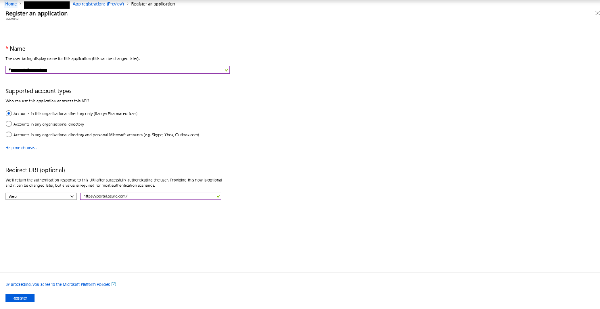
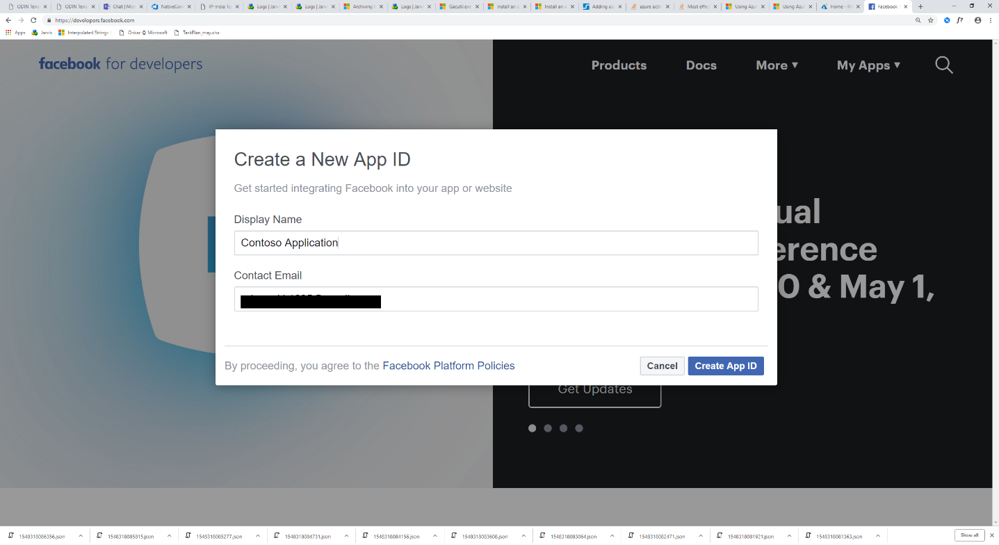
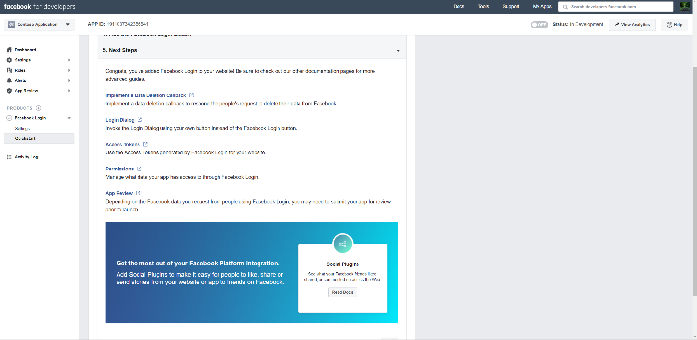
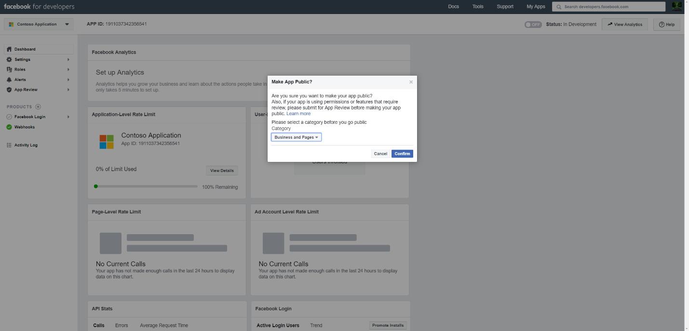

# Distribuire un connettore per archiviare i dati di pagine business di Facebook

In questo articolo è incluso il processo dettagliato per la distribuzione di un connettore che utilizza il servizio di importazione Microsoft 365 per importare i dati dalle pagine business di Facebook a Microsoft 365. Per una panoramica generale di questo processo e un elenco dei prerequisiti necessari per distribuire un connettore Facebook, vedere [configurare un connettore per archiviare i dati di Facebook](archive-facebook-data-with-sample-connector.md). 

## Passaggio 1: creare un'app in Azure Active Directory

1. Accedere a <https://portal.azure.com> e accedere con le credenziali di un account di amministratore globale di Office 365.

    

2. Nel riquadro di spostamento a sinistra, fare clic su **Azure Active Directory**.

    

3. Nel riquadro di spostamento a sinistra, fare clic su **registrazioni app (anteprima)** e quindi fare clic su **nuova registrazione**.

    

4. Registrare l'applicazione. In URI di reindirizzamento, selezionare Web nell'elenco a discesa tipo di applicazione e <https://portal.azure.com> quindi digitare nella casella per l'URI.

   

5. Copiare l'ID dell' **applicazione (client)** e la **Directory (tenant)** e salvarli in un file di testo o in un'altra posizione sicura. È possibile utilizzare questi ID nei passaggi successivi.

   

6. Accedere a **certificati & segreti per la nuova app.**

   

7. Fare clic su **nuovo client segreto**

   

8. Creare un nuovo segreto. Nella casella Descrizione digitare il segreto e quindi scegliere un periodo di scadenza. 

    

9. Copiare il valore del segreto e salvarlo in un file di testo o in un altro percorso di archiviazione. Si tratta del segreto dell'applicazione AAD utilizzato nei passaggi successivi.

   

## Passaggio 2: distribuire il servizio Web del connettore da GitHub all'account di Azure

1. Accedere a [questo sito GitHub](https://github.com/microsoft/m365-sample-connector-csharp-aspnet) e fare clic su **Distribuisci in Azure**.

    

2. Dopo aver fatto clic su **Distribuisci in Azure**, verrà reindirizzato a un portale di Azure con una pagina modello personalizzato. Compilare i dettagli delle **Impostazioni e delle** informazioni di **base** e quindi fare clic su **acquisto**.

    - **Sottoscrizione:** Selezionare l'abbonamento di Azure in cui si desidera distribuire il servizio Web del connettore di pagine business di Facebook.
    
    - **Gruppo di risorse:** Scegliere o creare un nuovo gruppo di risorse. Un gruppo di risorse è un contenitore che contiene risorse correlate per una soluzione di Azure.

    - **Posizione:** Scegliere un percorso.

    - **Nome applicazione Web:** Specificare un nome univoco per il connettore Web App. Il nome del Th deve essere compreso tra 3 e 18 caratteri. Questo nome viene utilizzato per creare l'URL del servizio app di Azure. ad esempio, se si specifica il nome dell'applicazione Web di **fbconnector** , l'URL del servizio app di Azure sarà **fbconnector.azurewebsites.NET**.
    
    - **tenantId:** L'ID tenant dell'organizzazione Microsoft 365 copiato dopo aver creato l'app connettore Facebook in Azure Active Directory nel passaggio 1.
    
   - **APISecretKey:** È possibile digitare qualsiasi valore come segreto. Viene utilizzato per accedere all'applicazione Web del connettore nel passaggio 5.
   
     

3. Dopo che la distribuzione ha avuto esito positivo, la pagina avrà un aspetto simile alla schermata seguente:

     

## Passaggio 3: registrare l'app Facebook

1. Accedere a <https://developers.facebook.com>, eseguire l'accesso usando le credenziali per l'account per le pagine business di Facebook dell'organizzazione e quindi fare clic su **Aggiungi nuova app**.

   

2. Creare un nuovo ID app.

   

3. Nel riquadro di spostamento a sinistra, fare clic su **Aggiungi prodotti** e quindi fare clic su **Configura** nella sezione **login Facebook** .

   

4. Nella pagina integrazione account di accesso di Facebook fare clic su **Web**.

   

5. Aggiungere l'URL del servizio app di Azure; ad esempio `https://fbconnector.azurewebsites.net`.

   

6. Completare la sezione Guida introduttiva della configurazione dell'account di accesso di Facebook.

   

7. Nel riquadro di spostamento a sinistra in **login Facebook**, fare clic su **Impostazioni**e aggiungere l'URI di reindirizzamento OAuth nella casella **Valid URI di reindirizzamento OAuth** . Utilizzare il formato ** \<connectorserviceuri>/views/facebookoauth**, in cui il valore di connectorserviceuri è l'URL del servizio app di Azure per l'organizzazione. ad esempio, `https://fbconnector.azurewebsites.net`.

   

8. Nel riquadro di spostamento a sinistra, fare clic su **Aggiungi prodotti** e quindi fare clic su **webhook.** Nel menu a discesa della **pagina** , fare clic su **pagina**. 

   

9. Aggiungere l'URL di callback di Webhook e aggiungere un token di verifica. Il formato dell'URL di callback, utilizzare il formato ** <connectorserviceuri>/API/FbPageWebhook**, in cui il valore di connectorserviceuri è l'URL del servizio app di Azure per l'organizzazione. ad esempio `https://fbconnector.azurewebsites.net`. 

    Il token di verifica dovrebbe essere simile a una password complessa. Copiare il token di verifica in un file di testo o in un altro percorso di archiviazione.

        

10. Testare e sottoscrivere l'endpoint per il feed.

    

11. Aggiungere un URL di privacy, un'icona dell'app e un utilizzo aziendale. Inoltre, copiare l'ID app e l'applicazione segreta in un file di testo o in un altro percorso di archiviazione.

    

12. Rendere pubblico l'applicazione.

    

13. Aggiungere un utente al ruolo di amministratore o tester.

    

14. Aggiungere l'autorizzazione di **accesso al contenuto pubblico della pagina** .

    

15. Aggiungere l'autorizzazione Manage Pages.

    

16. Ottenere l'applicazione recensita da Facebook.

    

## Passaggio 4: configurare l'applicazione Web del connettore

1. Passare a https://\<AzureAppResourceName>. azurewebsites.NET (dove AzureAppResourceName è il nome della risorsa di Azure App denominata nel passaggio 4), ad esempio, se il nome è **fbconnector**, andare a `https://fbconnector.azurewebsites.net`. La Home page dell'app avrà lo stesso aspetto della schermata seguente:

   

2. Fare clic su **Configura** per visualizzare una pagina di accesso.
 
   

3. Nella casella ID tenant digitare o incollare l'ID tenant (ottenuto nel passaggio 2). Nella casella password digitare o incollare il APISecretKey (ottenuto nel passaggio 2), quindi fare clic su **imposta impostazioni di configurazione** per visualizzare la pagina dettagli di configurazione.

    

4. Immettere le impostazioni di configurazione seguenti 

   - **ID applicazione Facebook:** ID app per l'applicazione Facebook ottenuta al passaggio 3.
   
   - **Segreto dell'applicazione Facebook:** Il segreto dell'app per l'applicazione Facebook ottenuta al passaggio 3.
   
   - I **webhook di Facebook verificano il token:** Il token di verifica creato nel passaggio 3.
   
   - **ID applicazione AAD:** ID applicazione per l'app Azure Active Directory creata al passaggio 1.
   
   - **Segreto dell'applicazione AAD:** Il valore del segreto di APISecretKey creato nel passaggio 1.

5. Fare clic su **Salva** per salvare le impostazioni del connettore.

## Passaggio 5: configurare un connettore Facebook nel centro conformità di Microsoft 365

1. Andare a [https://compliance.microsoft.com](https://compliance.microsoft.com) e quindi fare clic su **connettori dati** nel NAV sinistro.

2. Nella pagina **connettori dati (anteprima)** in **pagine business di Facebook**fare clic su **Visualizza**.

3. Nella pagina **Facebook business Pages** fare clic su **Aggiungi connettore**.

4. Nella pagina **condizioni del servizio** fare clic su **Accetto**.

5.  Nella pagina **Aggiungi credenziali per l'app del connettore** , immettere le informazioni seguenti e quindi fare clic su **convalida connessione**.

    

    - Nella casella **nome** Digitare un nome per il connettore, ad esempio pagina di **notizie di Facebook**.
    
    - Nella casella **URL di connessione** Digitare o incollare l'URL del servizio app di Azure; ad esempio `https://fbconnector.azurewebsites.net`.
    
    - Nella casella **password** Digitare o incollare il valore dell'APISecretKey aggiunto nel passaggio 2.
    
    - Nella casella **ID app di Azure** Digitare o incollare il valore dell'ID applicazione (client) denominato anche ID dell'applicazione AAD creato nel passaggio 1.
 
6. Dopo aver convalidato correttamente la connessione, fare clic su **Avanti**.

7. Nella pagina **autorizza Microsoft 365 per importare i dati** , digitare o incollare di nuovo APISecretKey e quindi fare clic su **login Web App**.

8. Nella pagina **Configura applicazione del connettore Facebook** , fare clic su **account di accesso con Facebook** e accedere usando le credenziali per l'account per le pagine business di Facebook dell'organizzazione. Assicurarsi che l'account di Facebook a cui è stato effettuato l'accesso sia assegnato il ruolo di amministratore per le pagine business di Facebook dell'organizzazione.

   

9. Viene visualizzato un elenco delle pagine business gestite dall'account di Facebook in cui è stato effettuato l'accesso. Selezionare la pagina da archiviare e quindi fare clic su **Avanti**.

    

10. Fare clic su **continua** per uscire dal programma di installazione dell'app del servizio connettore.

11. Nella pagina **Imposta filtri** è possibile applicare un filtro per importare inizialmente gli elementi di una determinata età. Selezionare un'età, quindi fare clic su **Avanti**.

12. Nella pagina **Scegli percorso di archiviazione** , digitare l'indirizzo di posta elettronica della cassetta postale di Microsoft 365 a cui verranno importati gli elementi di Facebook e quindi fare clic su **Avanti**.

13. Sul **consenso amministratore**, fare clic su **Fornisci consenso** e quindi eseguire la procedura. È necessario essere un amministratore globale per fornire il consenso per il servizio di importazione di Office 365 per accedere ai dati nell'organizzazione.

14. Fare clic su **Avanti** per esaminare le impostazioni del connettore e quindi fare clic su **fine** per completare la configurazione del connettore.

15. Nel centro conformità, andare alla pagina **connettori dati** e fare clic sulla scheda **connettori** per visualizzare lo stato di avanzamento del processo di importazione.
