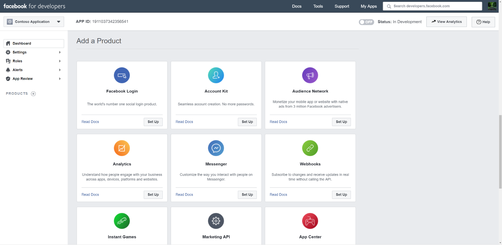

# Distribuire un connettore per archiviare i dati di pagine business di FacebookDeploy a connector to archive Facebook Business pages data

Questo articolo contiene il processo dettagliato per la distribuzione di un connettore che utilizza il servizio di importazione di Office 365 per importare i dati dalle pagine business di Facebook a Microsoft 365.This article contains the step-by-step process to deploy a connector that uses the Office 365 Import service to import data from Facebook Business pages to Microsoft 365. Per una panoramica generale di questo processo e un elenco dei prerequisiti necessari per distribuire un connettore Facebook, vedere [configurare un connettore per archiviare i dati di Facebook](archive-facebook-data-with-sample-connector.md).For a high-level overview of this process and a list of prerequisites required to deploy a Facebook connector, see [Set up a connector to archive Facebook data](archive-facebook-data-with-sample-connector.md).

## Passaggio 1: creare un'app in Azure Active DirectoryStep 1: Create an app in Azure Active Directory

1. Passare a <https://portal.azure.com> e accedere con le credenziali di un account di amministratore globale.Go to <https://portal.azure.com> and sign in using the credentials of a global admin account.

    

2. Nel riquadro di spostamento a sinistra, fare clic su **Azure Active Directory**.In the left navigation pane, click **Azure Active Directory**.

    

3. Nel riquadro di spostamento a sinistra, fare clic su **registrazioni app (anteprima)** e quindi fare clic su **nuova registrazione**.In the left navigation pane, click **App registrations (Preview)** and then click **New registration**.

    

4. Registrare l'applicazione.Register the application. In URI di reindirizzamento, selezionare Web nell'elenco a discesa tipo di applicazione e quindi digitare <https://portal.azure.com> nella casella per l'URI.Under Redirect URI, select Web in the application type dropdown list and then type <https://portal.azure.com> in the box for the URI.

   

5. Copiare l'ID dell' **applicazione (client)** e la **Directory (tenant)** e salvarli in un file di testo o in un'altra posizione sicura.Copy the **Application (client) ID** and **Directory (tenant) ID** and save them to a text file or other safe location. È possibile utilizzare questi ID nei passaggi successivi.You use these IDs in later steps.

   

6. Accedere a **certificati & segreti per la nuova app.**Go to **Certificates & secrets for the new app.**

   

7. Fare clic su **nuovo client segreto**Click **New client secret**

   

8. Creare un nuovo segreto.Create a new secret. Nella casella Descrizione digitare il segreto e quindi scegliere un periodo di scadenza.In the description box, type the secret and then choose an expiration period.

    

9. Copiare il valore del segreto e salvarlo in un file di testo o in un altro percorso di archiviazione.Copy the value of the secret and save it to a text file or other storage location. Si tratta del segreto dell'applicazione AAD utilizzato nei passaggi successivi.This is the AAD application secret that you use in later steps.

   

## Passaggio 2: distribuire il servizio Web del connettore da GitHub all'account di AzureStep 2: Deploy the connector web service from GitHub to your Azure account

1. Accedere a [questo sito GitHub](https://github.com/microsoft/m365-sample-connector-csharp-aspnet) e fare clic su **Distribuisci in Azure**.Go to [this GitHub site](https://github.com/microsoft/m365-sample-connector-csharp-aspnet) and click **Deploy to Azure**.

    

2. Dopo aver fatto clic su **Distribuisci in Azure**, verrà reindirizzato a un portale di Azure con una pagina modello personalizzato.After you click **Deploy to Azure**, you will be redirected to an Azure portal with a custom template page. Compilare i dettagli delle **Impostazioni e delle** informazioni di **base** e quindi fare clic su **acquisto**.Fill in the **Basics** and **Settings** details and then click **Purchase**.

   - **Sottoscrizione:** Selezionare l'abbonamento di Azure in cui si desidera distribuire il servizio Web del connettore di pagine business di Facebook.**Subscription:** Select your Azure subscription that you want to deploy the Facebook Business pages connector web service to.

   - **Gruppo di risorse:** Scegliere o creare un nuovo gruppo di risorse.**Resource group:** Choose or create a new resource group. Un gruppo di risorse è un contenitore che contiene risorse correlate per una soluzione di Azure.A resource group is a container that holds related resources for an Azure solution.

   - **Posizione:** Scegliere un percorso.**Location:** Choose a location.

   - **Nome applicazione Web:** Specificare un nome univoco per il connettore Web App.**Web App Name:** Provide a unique name for the connector web app. Il nome del Th deve essere compreso tra 3 e 18 caratteri.Th name must be between 3 and 18 characters in length. Questo nome viene utilizzato per creare l'URL del servizio app di Azure. ad esempio, se si specifica il nome dell'applicazione Web di **fbconnector** , l'URL del servizio app di Azure sarà **fbconnector.azurewebsites.NET**.This name is used to create the Azure app service URL; for example, if you provide the Web app name of **fbconnector** then the Azure app service URL  will be **fbconnector.azurewebsites.net**.

   - **tenantId:** L'ID tenant dell'organizzazione Microsoft 365 copiato dopo aver creato l'app connettore Facebook in Azure Active Directory nel passaggio 1.**tenantId:** The tenant ID of your Microsoft 365 organization that you copied after creating the Facebook connector app in Azure Active Directory in Step 1.

   - **APISecretKey:** È possibile digitare qualsiasi valore come segreto.**APISecretKey:** You can type any value as the secret. Viene utilizzato per accedere all'applicazione Web del connettore nel passaggio 5.This is used to access the connector web app in Step 5.

     

3. Dopo che la distribuzione ha avuto esito positivo, la pagina avrà un aspetto simile alla schermata seguente:After the deployment is successful, the page will look similar to the following screenshot:

   

## Passaggio 3: registrare l'app FacebookStep 3: Register the Facebook app

1. Accedere a <https://developers.facebook.com> , eseguire l'accesso usando le credenziali per l'account per le pagine business di Facebook dell'organizzazione e quindi fare clic su **Aggiungi nuova app**.Go to <https://developers.facebook.com>, log in using the credentials for the account for your organization's Facebook Business pages, and then click **Add New App**.

   

2. Creare un nuovo ID app.Create a new app ID.

   

3. Nel riquadro di spostamento a sinistra, fare clic su **Aggiungi prodotti** e quindi fare clic su **Configura** nella sezione **login Facebook** .In the left navigation pane, click **Add Products** and then click **Set Up** in the **Facebook Login** tile.

   

4. Nella pagina integrazione account di accesso di Facebook fare clic su **Web**.On the Integrate Facebook Login page, click **Web**.

   

5. Aggiungere l'URL del servizio app di Azure; ad esempio `https://fbconnector.azurewebsites.net` .Add the Azure app service URL; for example `https://fbconnector.azurewebsites.net`.

   

6. Completare la sezione Guida introduttiva della configurazione dell'account di accesso di Facebook.Complete the QuickStart section of the Facebook Login setup.

   

7. Nel riquadro di spostamento a sinistra in **login Facebook**, fare clic su **Impostazioni** e aggiungere l'URI di reindirizzamento OAuth nella casella **Valid URI di reindirizzamento OAuth** .In the left navigation pane under **Facebook Login**, click **Settings**, and add the OAuth redirect URI in the **Valid OAuth Redirect URIs** box. Utilizzare il formato **\<connectorserviceuri> /views/FacebookOAuth**, in cui il valore di CONNECTORSERVICEURI è l'URL del servizio app di Azure per l'organizzazione, ad esempio `https://fbconnector.azurewebsites.net` .Use the format **\<connectorserviceuri>/Views/FacebookOAuth**, where the value for connectorserviceuri is the Azure app service URL for your organization; for example, `https://fbconnector.azurewebsites.net`.

   

8. Nel riquadro di spostamento a sinistra, fare clic su **Aggiungi prodotti** e quindi fare clic su **webhook.**In the left navigation pane, click **Add Products** and then click **Webhooks.** Nel menu a discesa della **pagina** , fare clic su **pagina**.In the **Page** pull-down menu, click **Page**.

   

9. Aggiungere l'URL di callback di Webhook e aggiungere un token di verifica.Add Webhooks Callback URL and add a verify token. Il formato dell'URL di callback, utilizzare il formato **<connectorserviceuri> /API/FbPageWebhook**, in cui il valore di CONNECTORSERVICEURI è l'URL del servizio app di Azure per l'organizzazione, ad esempio `https://fbconnector.azurewebsites.net` .The format of the callback URL, use the format **<connectorserviceuri>/api/FbPageWebhook**, where the value for connectorserviceuri is the Azure app service URL for your organization; for example `https://fbconnector.azurewebsites.net`.

   Il token di verifica dovrebbe essere simile a una password complessa.The verify token should similar to a strong password. Copiare il token di verifica in un file di testo o in un altro percorso di archiviazione.Copy the verify token to a text file or other storage location.

   

10. Testare e sottoscrivere l'endpoint per il feed.Test and subscribe to the endpoint for feed.

    

11. Aggiungere un URL di privacy, un'icona dell'app e un utilizzo aziendale.Add a privacy URL, app icon, and business use. Inoltre, copiare l'ID app e l'applicazione segreta in un file di testo o in un altro percorso di archiviazione.Also, copy the app ID and app secret to a text file or other storage location.

    

12. Rendere pubblico l'applicazione.Make the app public.

    

13. Aggiungere un utente al ruolo di amministratore o tester.Add user to the admin or tester role.

    

14. Aggiungere l'autorizzazione di **accesso al contenuto pubblico della pagina** .Add the **Page Public Content Access** permission.

    

15. Aggiungere l'autorizzazione Manage Pages.Add Manage Pages permission.

    

16. Ottenere l'applicazione recensita da Facebook.Get the application reviewed by Facebook.

    

## Passaggio 4: configurare l'applicazione Web del connettoreStep 4: Configure the connector web app

1. Andare a `https://<AzureAppResourceName>.azurewebsites.net` (dove AzureAppResourceName è il nome della risorsa di Azure App denominata nel passaggio 4).Go to `https://<AzureAppResourceName>.azurewebsites.net` (where AzureAppResourceName is the name of your Azure app resource that you named in Step 4). Ad esempio, se il nome è **fbconnector**, andare a `https://fbconnector.azurewebsites.net` .For example, if the name is **fbconnector**, go to `https://fbconnector.azurewebsites.net`. La Home page dell'app avrà lo stesso aspetto della schermata seguente:The home page of the app will look like the following screenshot:

   

2. Fare clic su **Configura** per visualizzare una pagina di accesso.Click **Configure** to display a sign in page.

   

3. Nella casella ID tenant digitare o incollare l'ID tenant (ottenuto nel passaggio 2).In the Tenant Id box, type or paste your tenant Id (that you obtained in Step 2). Nella casella password digitare o incollare il APISecretKey (ottenuto nel passaggio 2), quindi fare clic su **imposta impostazioni di configurazione** per visualizzare la pagina dettagli di configurazione.In the password box, type or paste the APISecretKey (that you obtained in Step 2), and then click **Set Configuration Settings** to display the configuration details page.

    

4. Immettere le impostazioni di configurazione seguentiEnter the following configuration settings

   - **ID applicazione Facebook:** ID app per l'applicazione Facebook ottenuta al passaggio 3.**Facebook application ID:** The app ID for the Facebook application that you obtained in Step 3.

   - **Segreto dell'applicazione Facebook:** Il segreto dell'app per l'applicazione Facebook ottenuta al passaggio 3.**Facebook application secret:** The app secret for the Facebook application that you obtained in Step 3.

   - I **webhook di Facebook verificano il token:** Il token di verifica creato nel passaggio 3.**Facebook webhooks verify token:** The verify token that you created in Step 3.

   - **ID applicazione AAD:** ID applicazione per l'app Azure Active Directory creata al passaggio 1.**AAD application ID:** The application ID for the Azure Active Directory app that you created in Step 1.

   - **Segreto dell'applicazione AAD:** Il valore del segreto di APISecretKey creato nel passaggio 1.**AAD application secret:** The value for the APISecretKey secret that you created in Step 1.

5. Fare clic su **Salva** per salvare le impostazioni del connettore.Click **Save** to save the connector settings.

## Passaggio 5: configurare un connettore Facebook nel centro conformità di Microsoft 365Step 5: Set up a Facebook connector in the Microsoft 365 compliance center

1. Andare a [https://compliance.microsoft.com](https://compliance.microsoft.com) e quindi fare clic su **connettori dati** nel NAV sinistro.Go to [https://compliance.microsoft.com](https://compliance.microsoft.com) and then click **Data connectors** in the left nav.

2. Nella pagina **connettori dati** in **pagine business di Facebook** fare clic su **Visualizza**.On the **Data connectors** page under **Facebook Business pages**, click **View**.

3. Nella pagina **Facebook business Pages** fare clic su **Aggiungi connettore**.On the **Facebook business pages** page, click **Add connector**.

4. Nella pagina **condizioni del servizio** fare clic su **Accetto**.On the **Terms of service** page, click **Accept**.

5. Nella pagina **Aggiungi credenziali per l'app del connettore** , immettere le informazioni seguenti e quindi fare clic su **convalida connessione**.On the **Add credentials for your connector app** page, enter the following information and then click **Validate connection**.

   

   - Nella casella **nome** Digitare un nome per il connettore, ad esempio pagina di **notizie di Facebook**.In the **Name** box, type a name for the connector, such as **Facebook news page**.

   - Nella casella **URL di connessione** Digitare o incollare l'URL del servizio app di Azure; ad esempio `https://fbconnector.azurewebsites.net` .In the **Connection URL** box, type or paste the Azure app service URL; for example `https://fbconnector.azurewebsites.net`.

   - Nella casella **password** Digitare o incollare il valore dell'APISecretKey aggiunto nel passaggio 2.In the **Password** box, type or paste the value of the APISecretKey that you added in Step 2.

   - Nella casella **ID app di Azure** Digitare o incollare il valore dell'ID applicazione (client) denominato anche ID dell'applicazione AAD creato nel passaggio 1.In the **Azure App ID** box, type or paste the value of the Application (client) ID also called as AAD Application ID that you created in Step 1.

6. Dopo aver convalidato correttamente la connessione, fare clic su **Avanti**.After the connection is successfully validated, click **Next**.

7. Nella pagina **autorizza Microsoft 365 per importare i dati** , digitare o incollare di nuovo APISecretKey e quindi fare clic su **login Web App**.On the **Authorize Microsoft 365 to import data** page, type or paste the APISecretKey again and then click **Login web app**.

8. Nella pagina **Configura applicazione del connettore Facebook** , fare clic su **account di accesso con Facebook** e accedere usando le credenziali per l'account per le pagine business di Facebook dell'organizzazione.On the **Configure Facebook connector app** page, click **Login with Facebook** and log in using the credentials for the account for your organization's Facebook Business pages. Assicurarsi che l'account di Facebook a cui è stato effettuato l'accesso sia assegnato il ruolo di amministratore per le pagine business di Facebook dell'organizzazione.Make sure the Facebook account that you logged in to is assigned the admin role for your organization's Facebook Business pages.

   

9. Viene visualizzato un elenco delle pagine business gestite dall'account di Facebook in cui è stato effettuato l'accesso.A list of the business pages managed by the Facebook account that you logged in to is displayed. Selezionare la pagina da archiviare e quindi fare clic su **Avanti**.Select the page to archive and then click **Next**.

   

10. Fare clic su **continua** per uscire dal programma di installazione dell'app del servizio connettore.Click **Continue** to exit the setup of the connector service app.

11. Nella pagina **Imposta filtri** è possibile applicare un filtro per importare inizialmente gli elementi di una determinata età.On the **Set filters** page, you can apply a filter to initially import items that are a certain age. Selezionare un'età, quindi fare clic su **Avanti**.Select an age, and then click **Next**.

12. Nella pagina **Scegli percorso di archiviazione** , digitare l'indirizzo di posta elettronica della cassetta postale di Microsoft 365 a cui verranno importati gli elementi di Facebook e quindi fare clic su **Avanti**.On the **Choose storage location** page, type the email address of Microsoft 365 mailbox that the Facebook items will be imported to, and then click **Next**.

13. Fare clic su **Avanti** per esaminare le impostazioni del connettore e quindi fare clic su **fine** per completare la configurazione del connettore.Click **Next** to review the connector settings and then click **Finish** to complete the connector setup.

14. Nel centro conformità, andare alla pagina **connettori dati** e fare clic sulla scheda **connettori** per visualizzare lo stato di avanzamento del processo di importazione.In the compliance center, go to the **Data connectors** page, and click the **Connectors** tab to see the progress of the import process.
