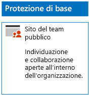
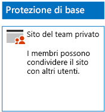
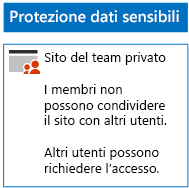
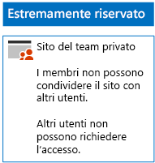

# Distribuire siti di SharePoint Online per tre livelli di protezioneDeploy SharePoint Online sites for three tiers of protection

Usare i passaggi descritti in questo articolo per progettare e distribuire siti del team di SharePoint Online di base, sensibili e con riservatezza elevata. Per altre informazioni su questi tre livelli di protezione, vedere [Proteggere siti e file di SharePoint Online](../security/office-365-security/secure-sharepoint-online-sites-and-files.md).Use the steps in this article to design and deploy baseline, sensitive, and highly confidential SharePoint Online team sites. For more information about these three tiers of protection, see [Secure SharePoint Online sites and files](../security/office-365-security/secure-sharepoint-online-sites-and-files.md).
  
## Siti del team di SharePoint Online di baseBaseline SharePoint Online team sites

La protezione di siti di base include siti del team pubblici e privati. I siti del team pubblici possono essere individuati e usati da qualsiasi persona dell'organizzazione. I siti privati possono essere individuati e usati solo dai membri del gruppo di Office 365 associato al sito del team. Entrambi questi tipi di siti del team consentono ai membri di condividere il sito con altri utenti.Baseline protection includes both public and private team sites. Public team sites can be discovered and accessed by anybody in the organization. Private sites can only be discovered and accessed by members of the Office 365 group associated with the team site. Both of these types of team sites allow members to share the site with others.
  
### PubblicoPublic

Per creare un sito del team di SharePoint Online di base con accesso pubblico e autorizzazioni, seguire [queste istruzioni](https://support.office.com/article/create-a-team-site-in-sharepoint-ef10c1e7-15f3-42a3-98aa-b5972711777d).To create a baseline SharePoint Online team site with public access and permissions, follow [these instructions](https://support.office.com/article/create-a-team-site-in-sharepoint-ef10c1e7-15f3-42a3-98aa-b5972711777d).

Questa è la configurazione risultante.Here is your resulting configuration.
  

  
### PrivatoPrivate

Per creare un sito del team di SharePoint Online di base con accesso privato e autorizzazioni, seguire [queste istruzioni](https://support.office.com/article/create-a-team-site-in-sharepoint-ef10c1e7-15f3-42a3-98aa-b5972711777d).To create a baseline SharePoint Online team site with private access and permissions, follow [these instructions](https://support.office.com/article/create-a-team-site-in-sharepoint-ef10c1e7-15f3-42a3-98aa-b5972711777d).
  
Questa è la configurazione risultante.Here is your resulting configuration.
  

  
## Siti del team di SharePoint Online sensibiliSensitive SharePoint Online team sites

Un sito del team di SharePoint Online riservato viene avviato come sito del team privato.A sensitive SharePoint Online team site starts as a private team site.
  
Creare innanzitutto il sito del team di SharePoint Online privato seguendo [queste istruzioni](https://support.office.com/article/create-a-team-site-in-sharepoint-ef10c1e7-15f3-42a3-98aa-b5972711777d).First, create the private SharePoint Online team site with [these instructions](https://support.office.com/article/create-a-team-site-in-sharepoint-ef10c1e7-15f3-42a3-98aa-b5972711777d).

Successivamente, dal nuovo sito del team di SharePoint Online configurare le altre impostazioni delle autorizzazioni seguendo questi passaggi.Next, from the new SharePoint Online team site, configure additional permission settings with these steps.

1.  Nella barra degli strumenti del sito del team di SharePoint fare clic sull'icona delle impostazioni, poi su **Autorizzazioni sito**.In the tool bar of the SharePoint team site, click the settings icon, and then click **Site permissions**.
2.  Nel riquadro **Autorizzazioni sito** fare clic su **Modifica impostazioni di condivisione** in **Impostazioni di condivisione**.In the **Site permissions** pane, under **Sharing Settings**, click **Change sharing settings**.
3.  In **Impostazioni di condivisione** scegliere **Solo i proprietari del sito possono condividere file, cartelle e il sito**, quindi fare clic su **Salva**.Under **Sharing permissions**, choose **Only site owners can share files, folders, and the site**, and then click **Save**.

I risultati di queste impostazioni delle autorizzazioni sono i seguenti:The results of these permission settings are:

- La possibilità per i membri di condividere con altri membri è disabilitata.The ability for members to share with other members is disabled.
- La possibilità per gli utenti non membri di richiedere l'accesso è abilitata.The ability for non-members to request access is enabled.

Di seguito è riportata la configurazione risultante.Here is your resulting configuration.
  

  
I membri del sito, attraverso l'appartenenza a uno dei gruppi di accesso, possono ora collaborare in modo sicuro alle risorse del sito.The members of the site, through group membership in one of the access groups, can now securely collaborate on the resources of the site.
  
## Siti del team di SharePoint Online con riservatezza elevataHighly confidential SharePoint Online team sites

Un sito del team di SharePoint Online estremamente riservato è un sito del team privato con altre impostazioni delle autorizzazioni.A highly confidential SharePoint Online team site is a private team site with additional permissions settings.

Creare innanzitutto il sito del team di SharePoint Online privato seguendo [queste istruzioni](https://support.office.com/article/create-a-team-site-in-sharepoint-ef10c1e7-15f3-42a3-98aa-b5972711777d).First, create the private SharePoint Online team site with [these instructions](https://support.office.com/article/create-a-team-site-in-sharepoint-ef10c1e7-15f3-42a3-98aa-b5972711777d).

Successivamente, dal nuovo sito del team di SharePoint Online configurare le altre impostazioni delle autorizzazioni seguendo questi passaggi.Next, from the new SharePoint Online team site, configure additional permission settings with these steps.

1.  Nella barra degli strumenti del sito del team di SharePoint fare clic sull'icona delle impostazioni, poi su **Autorizzazioni sito**.In the tool bar of the SharePoint team site, click the settings icon, and then click **Site permissions**.
2.  Nel riquadro **Autorizzazioni sito** fare clic su **Modifica impostazioni di condivisione** in **Impostazioni di condivisione**.In the **Site permissions** pane, under **Sharing Settings**, click **Change sharing settings**.
3.  In **Impostazioni di condivisione** scegliere **Solo i proprietari del sito possono condividere file, cartelle e il sito**.Under **Sharing permissions**, choose **Only site owners can share files, folders, and the site**.
4. Disattivare **Consenti richieste di accesso** e quindi fare clic su **Salva**.Turn off **Allow access requests**, and then click **Save**.

I risultati di queste impostazioni delle autorizzazioni sono i seguenti:The results of these permission settings are:

- La possibilità per i membri di condividere con altri membri è disabilitata.The ability for members to share with other members is disabled.
- La possibilità per gli utenti non membri di richiedere l'accesso è disabilitata.The ability for non-members to request access is disabled.

Di seguito è riportata la configurazione risultante.Here is your resulting configuration.
  

  
I membri del sito, attraverso l'appartenenza a uno dei gruppi di accesso, possono ora collaborare in modo sicuro alle risorse del sito.The members of the site, through group membership in one of the access groups, can now securely collaborate on the resources of the site.
  
## Passaggio successivoNext step

[Proteggere i file di SharePoint Online con le etichette di Office 365 e la prevenzione della perdita dei datiProtect SharePoint Online files with Office 365 labels and DLP](protect-sharepoint-online-files-with-office-365-labels-and-dlp.md)

## Vedere ancheSee also

[Protezione di file e siti di SharePoint OnlineSecure SharePoint Online sites and files](../security/office-365-security/secure-sharepoint-online-sites-and-files.md)
  
[Guida sulla sicurezza Microsoft per organizzazioni che si occupano della campagna politica, no profit e altre organizzazioni AgileMicrosoft Security Guidance for Political Campaigns, Nonprofits, and Other Agile Organizations](../security/office-365-security/microsoft-security-guidance-for-political-campaigns-nonprofits-and-other-agile-o.md)
  
[Adozione del cloud e soluzioni ibrideCloud adoption and hybrid solutions](https://docs.microsoft.com/office365/enterprise/cloud-adoption-and-hybrid-solutions)
