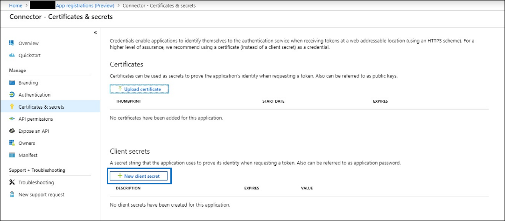
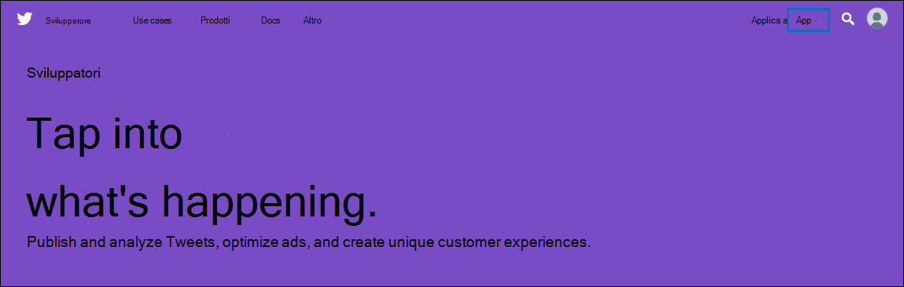
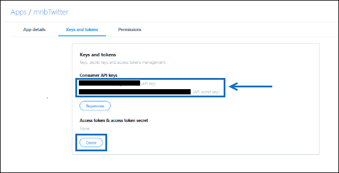
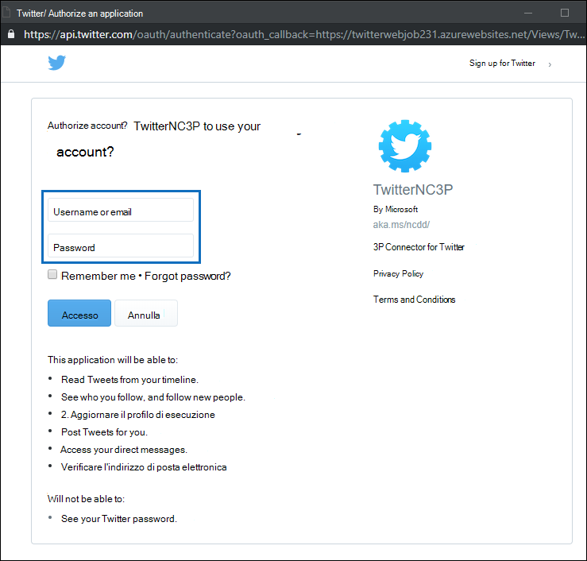

# Distribuire un connettore per archiviare i dati di TwitterDeploy a connector to archive Twitter data

In questo articolo sono contenute le procedure dettagliate per distribuire un connettore che utilizza il servizio di importazione di Office 365 per importare dati dall'account Twitter dell'organizzazione a Microsoft 365.This article contains the step-by-step process to deploy a connector that uses the Office 365 Import service to import data from your organization's Twitter account to Microsoft 365. Per una panoramica generale di questo processo e un elenco dei prerequisiti necessari per distribuire un connettore Twitter, vedere [Set up a connector to archive Twitter data ](archive-twitter-data-with-sample-connector.md).For a high-level overview of this process and a list of prerequisites required to deploy a Twitter connector, see [Set up a connector to archive Twitter data ](archive-twitter-data-with-sample-connector.md).

## Passaggio 1: Creare un'app in Azure Active DirectoryStep 1: Create an app in Azure Active Directory

1. Accedere a <https://portal.azure.com> e accedere utilizzando le credenziali di un account amministratore globale.Go to <https://portal.azure.com> and sign in using the credentials of a global admin account.

   

2. Nel riquadro di spostamento a sinistra, fare clic su **Azure Active Directory**.In the left navigation pane, click **Azure Active Directory**.

   

3. Nel riquadro di spostamento sinistro fare clic su **Registrazioni app (anteprima)** e quindi su **Nuova registrazione.**In the left navigation pane, click **App registrations (Preview)** and then click **New registration**.

   

4. Registrare l'applicazione.Register the application. In **URI di reindirizzamento (facoltativo)** seleziona **Web** nell'elenco a discesa tipo di applicazione e quindi digita nella casella `https://portal.azure.com` per l'URI.Under **Redirect URI (optional)**, select **Web** in the application type dropdown list and then type `https://portal.azure.com` in the box for the URI.

   

5. Copiare **l'ID applicazione (client)** **e l'ID directory (tenant)** e salvarli in un file di testo o in un altro percorso sicuro.Copy the **Application (client) ID** and **Directory (tenant) ID** and save them to a text file or other safe location. Questi ID vengono utilizzati nei passaggi successivi.You use these IDs in later steps.

    

6. Vai a **Certificati & segreti per la nuova app** e in Segreti client **fai** clic su Nuovo **segreto client.**Go to **Certificates & secrets for the new app** and under **Client secrets** click **New client secret**.

   

7. Creare un nuovo segreto.Create a new secret. Nella casella Descrizione digitare il segreto e quindi scegliere un periodo di scadenza.In the description box, type the secret and then choose an expiration period.

   

8. Copiare il valore del segreto e salvarlo in un file di testo o in un altro percorso di archiviazione.Copy the value of the secret and save it to a text file or other storage location. Si tratta del segreto dell'applicazione AAD utilizzato nei passaggi successivi.This is the AAD application secret that you use in later steps.

   

## Passaggio 2: Distribuire il servizio Web del connettore da GitHub all'account AzureStep 2: Deploy the connector web service from GitHub to your Azure account

1. Accedere a [questo sito GitHub e](https://github.com/microsoft/m365-sample-twitter-connector-csharp-aspnet) fare clic su **Distribuisci in Azure**.Go to [this GitHub site](https://github.com/microsoft/m365-sample-twitter-connector-csharp-aspnet) and click **Deploy to Azure**.

    

2. Dopo aver fatto **clic su Distribuisci in Azure,** si verrà reindirizzati a un portale di Azure con una pagina modello personalizzata.After you click **Deploy to Azure**, you will be redirected to an Azure portal with a custom template page. Compila i dettagli **di** base e **Impostazioni** e quindi fai clic su **Acquista.**Fill in the **Basics** and **Settings** details and then click **Purchase**.

   

    - **Sottoscrizione:** Selezionare la sottoscrizione di Azure in cui si desidera distribuire il servizio Web del connettore Di Twitter.**Subscription:** Select your Azure subscription that you want to deploy the Twitter connector web service to.

    - **Gruppo di risorse:** Scegliere o creare un nuovo gruppo di risorse.**Resource group:** Choose or create a new resource group. Un gruppo di risorse è un contenitore che contiene le risorse correlate per una soluzione di Azure.A resource group is a container that holds related resources for an Azure solution.

    - **Posizione:** Scegliere una posizione.**Location:** Choose a location.

    - **Nome app Web:** Specificare un nome univoco per l'app Web del connettore.**Web App Name:** Provide a unique name for the connector web app. Il nome deve avere una lunghezza compresa tra 3 e 18 caratteri.Th name must be between 3 and 18 characters in length. Questo nome viene usato per creare l'URL del servizio app di Azure. Ad esempio, se fornisci il nome dell'app Web **twitterconnector,** l'URL del servizio app di Azure verrà **twitterconnector.azurewebsites.net**.This name is used to create the Azure app service URL; for example, if you provide the Web app name of **twitterconnector** then the Azure app service URL  will be **twitterconnector.azurewebsites.net**.

    - **tenantId:** L'ID tenant dell'Microsoft 365 che hai copiato dopo aver creato l'app del connettore Facebook in Azure Active Directory nel passaggio 1.**tenantId:** The tenant ID of your Microsoft 365 organization that you copied after creating the Facebook connector app in Azure       Active Directory in Step 1.

   - **APISecretKey:** È possibile digitare qualsiasi valore come segreto.**APISecretKey:** You can type any value as the secret. Viene usato per accedere all'app Web del connettore nel passaggio 5.This is used to access the connector web app in Step 5.

3. Una volta completata la distribuzione, la pagina avrà un aspetto simile allo screenshot seguente:After the deployment is successful, the page will look similar to the following screenshot:

    

## Passaggio 3: Creare l'app TwitterStep 3: Create the Twitter app

1. Vai a https://developer.twitter.com , accedi usando le credenziali per l'account sviluppatore per l'organizzazione e quindi fai clic su **App.**Go to https://developer.twitter.com, log in using the credentials for the developer account for your organization, and then click **Apps**.

   
2. Fai **clic su Crea un'app.**Click **Create an app**.

   

3. In **Dettagli app** aggiungi informazioni sull'applicazione.Under **App details**, add information about the application.

   

4. Nel dashboard per sviluppatori di Twitter seleziona l'app appena creata e quindi fai clic su **Dettagli.**On the Twitter developer dashboard, select the app that you just created and then click **Details**.

   

5. Nella scheda **Chiavi e token,** in Chiavi **API** consumer copiare sia la chiave API che la chiave privata dell'API e salvarle in un file di testo o in un altro percorso di archiviazione.On the **Keys and tokens** tab, under **Consumer API keys** copy both the API Key and the API secret key and save them to a text file or other storage location. Fare quindi **clic su Crea** per generare un token di accesso e un token di accesso segreto e copiarlo in un file di testo o in un altro percorso di archiviazione.Then click **Create** to generate an access token and access token secret and copy these to a text file or other storage location.

   

   Fare quindi **clic su Crea** per generare un token di accesso e un segreto token di accesso e copiarlo in un file di testo o in un altro percorso di archiviazione.Then click **Create** to generate an access token and an access token secret, and copy these to a text file or other storage location.

6. Fare clic **sulla scheda** Autorizzazioni e configurare le autorizzazioni come illustrato nello screenshot seguente:Click the **Permissions** tab and configure the permissions as shown in the following screenshot:

   

7. Dopo aver salvato le impostazioni di autorizzazione, fare clic sulla **scheda Dettagli** app e quindi su Modifica > **Modifica dettagli**.After you save the permission settings, click the **App details** tab, and then click **Edit > Edit details**.

   

8. Eseguire le attività seguenti:Do the following tasks:

   - Seleziona la casella di controllo per consentire all'app connettore di accedere a Twitter.Select the checkbox to allow the connector app to sign in to Twitter.

   - Aggiungere l'URI di reindirizzamento OAuth nel formato **\<connectorserviceuri> seguente: /Views/TwitterOAuth**, dove il valore di *connectorserviceuri è* l'URL del servizio app azure per l'organizzazione, ad esempio https://twitterconnector.azurewebsites.net/Views/TwitterOAuth .Add the OAuth redirect Uri using the following format: **\<connectorserviceuri>/Views/TwitterOAuth**, where the value of *connectorserviceuri* is the Azure app service URL for your organization; for example, https://twitterconnector.azurewebsites.net/Views/TwitterOAuth.

    

L'app per sviluppatori Twitter è ora pronta per l'uso.The Twitter developer app is now ready to use.

## Passaggio 4: Configurare l'app Web del connettoreStep 4: Configure the connector web app

1. Vai a https:// \<AzureAppResourceName> .azurewebsites.net (dove **AzureAppResourceName** è il nome della risorsa app di Azure denominata nel passaggio 4).Go to https://\<AzureAppResourceName>.azurewebsites.net (where **AzureAppResourceName** is the name of your Azure app resource that you named in Step 4). Ad esempio, se il nome è **twitterconnector**, passare a https://twitterconnector.azurewebsites.net .For example, if the name is **twitterconnector**, go to https://twitterconnector.azurewebsites.net. La home page dell'app è simile alla schermata seguente:The home page of the app looks like the following screenshot:

   

2. Fare **clic su** Configura per visualizzare una pagina di accesso.Click **Configure** to display a sign in page.

   

3. Nella casella ID tenant digitare o incollare l'ID tenant ottenuto nel passaggio 2.In the Tenant Id box, type or paste your tenant Id (that you obtained in Step 2). Nella casella password digitare o **incollare** APISecretKey (ottenuto nel passaggio 2), quindi fare clic su Imposta configurazione Impostazioni per visualizzare la pagina dei dettagli della configurazione.In the password box, type or paste the APISecretKey (that you obtained in Step 2), and then click **Set Configuration Settings** to display the configuration details page.

   

4. Immettere le impostazioni di configurazione seguentiEnter the following configuration settings

   - **Chiave api Twitter:** La chiave API per l'applicazione Twitter creata nel passaggio 3.**Twitter Api Key:** The API key for the Twitter application that you created in Step 3.

   - **Chiave privata api Twitter:** Chiave privata API per l'applicazione Twitter creata nel passaggio 3.**Twitter Api Secret Key:** The API secret key for the Twitter application that you created in Step 3.

   - **Token di accesso Twitter:** Token di accesso creato nel passaggio 3.**Twitter Access Token:** The access token that you created in Step 3.

   - **Twitter Access Token Secret:** Il token di accesso segreto creato nel passaggio 3.**Twitter Access Token Secret:** The access token secret that you created in Step 3.

   - **ID applicazione AAD:** ID dell'applicazione Azure Active Directory'app creata nel passaggio 1**AAD Application ID:** The application ID for the Azure Active Directory app that you created in Step 1

   - **Segreto applicazione AAD:** Valore per il segreto APISecretKey creato nel passaggio 1.**AAD Application Secret:** The value for the APISecretKey secret that you created in Step 1.

5. Fare **clic su** Salva per salvare le impostazioni del connettore.Click **Save** to save the connector settings.

## Passaggio 5: Configurare un connettore Twitter nella Centro conformità Microsoft 365Step 5: Set up a Twitter connector in the Microsoft 365 compliance center

1. Vai a [https://compliance.microsoft.com](https://compliance.microsoft.com) e quindi fai clic su **Connettori dati** nel riquadro di spostamento sinistro.Go to [https://compliance.microsoft.com](https://compliance.microsoft.com) and then click **Data connectors** in the left nav.

2. Nella pagina **Connettori dati** in **Twitter** fare clic su **Visualizza.**On the **Data connectors** page under **Twitter**, click **View**.

3. Nella pagina **Twitter** fare clic su **Aggiungi connettore.**On the **Twitter** page, click **Add connector**.

4. Nella pagina **Condizioni di servizio** fare clic su **Accetta.**On the **Terms of service** page, click **Accept**.

5. Nella pagina **Aggiungi credenziali per l'app connettore** immettere le informazioni seguenti e quindi fare clic su **Convalida connessione.**On the **Add credentials for your connector app** page, enter the following information and then click **Validate connection**.

   

    - Nella casella **Nome** digitare un nome per il connettore, ad esempio Gestione della **Guida di Twitter.**In the **Name** box, type a name for the connector, such as **Twitter help handle**.

    - Nella casella **URL connettore** digitare o incollare l'URL del servizio app di Azure. ad esempio `https://twitterconnector.azurewebsites.net` .In the **Connector URL** box, type or paste the Azure app service URL; for example `https://twitterconnector.azurewebsites.net`.

    - Nella casella **Password** digitare o incollare il valore di APISecretKey creato nel passaggio 2.In the **Password** box, type or paste the value of the APISecretKey that you created in Step 2.

    - Nella casella **ID app di Azure** digitare o incollare il valore dell'ID app dell'applicazione Azure (denominato anche ID *client)* ottenuto nel passaggio 1.In the **Azure App ID** box, type or paste the value of the Azure Application App Id (also called the *client ID*) that you obtained in Step 1.

6. Dopo aver convalidato correttamente la connessione, fare clic su **Avanti.**After the connection is successfully validated, click **Next**.

7. Nella pagina **Autorizza Microsoft 365 importare** dati digitare o incollare di nuovo APISecretKey e quindi fare clic su **Accedi all'app Web.**On the **Authorize Microsoft 365 to import data** page, type or paste the APISecretKey again and then click  **Login web app**.

8. Fai **clic su Accedi con Twitter.**Click **Login with Twitter**.

9. Nella pagina di accesso a Twitter, accedere utilizzando le credenziali per l'account Twitter dell'organizzazione.On the Twitter sign in page, sign in using the credentials for your organization's Twitter account.

   

   Dopo aver eseguito l'accesso, nella pagina Twitter verrà visualizzato il messaggio seguente, "Configurazione completata del processo del connettore twitter".After you sign in, the Twitter page will display the following message, "Twitter Connector Job Successfully set up."

10. Fare **clic su** Continua per completare la configurazione del connettore Twitter.Click **Continue** to complete setting up the Twitter connector.

11. Nella pagina **Imposta filtri** è possibile applicare un filtro per importare inizialmente elementi di una determinata età.On the **Set filters** page, you can apply a filter to initially import items that are a certain age. Selezionare un'età e quindi fare clic su **Avanti.**Select an age, and then click **Next**.

12. Nella pagina **Scegli percorso di archiviazione** digitare l'indirizzo di Microsoft 365 di posta elettronica in cui verranno importati gli elementi di Twitter e quindi fare clic su **Avanti.**On the **Choose storage location** page, type the email address of Microsoft 365 mailbox that the Twitter items will be imported to, and then click **Next**.

13. Fare **clic su** Avanti per esaminare le impostazioni del connettore e quindi fare clic su **Fine** per completare la configurazione del connettore.Click **Next** to review the connector settings and then click **Finish** to complete the connector setup.

14. Nel Centro conformità passare alla pagina **Connettori** di dati e fare clic sulla scheda **Connettori** per visualizzare l'avanzamento del processo di importazione.In the compliance center, go to the **Data connectors** page, and click the **Connectors** tab to see the progress of the import process.
