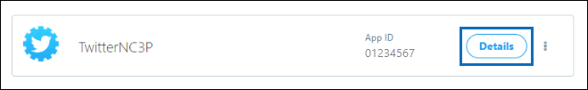

# Distribuire un connettore per archiviare i dati di Twitter

Questo articolo contiene il processo dettagliato per la distribuzione di un connettore che utilizza il servizio di importazione di Office 365 per importare i dati dall'account Twitter dell'organizzazione a Microsoft 365. Per una panoramica generale di questo processo e un elenco dei prerequisiti necessari per distribuire un connettore Twitter, vedere [configurare un connettore per archiviare i dati di Twitter ](archive-twitter-data-with-sample-connector.md). 

## Passaggio 1: creare un'app in Azure Active Directory

1. Accedere a <https://portal.azure.com> e accedere con le credenziali di un account di amministratore globale di Office 365.

   

2. Nel riquadro di spostamento a sinistra, fare clic su **Azure Active Directory**.

   

3. Nel riquadro di spostamento a sinistra, fare clic su **registrazioni app (anteprima)** e quindi fare clic su **nuova registrazione**.

   

4. Registrare l'applicazione. In **URI di reindirizzamento (facoltativo)** selezionare **Web** nell'elenco a discesa tipo di applicazione e quindi `https://portal.azure.com` digitare nella casella relativa all'URI.

   

5. Copiare l'ID dell' **applicazione (client)** e la **Directory (tenant)** e salvarli in un file di testo o in un'altra posizione sicura. È possibile utilizzare questi ID nei passaggi successivi.

    

6. Accedere a **certificati & segreti per la nuova applicazione** e in **segreti client** fare clic su **nuovo segreto client**.

   

7. Creare un nuovo segreto. Nella casella Descrizione digitare il segreto e quindi scegliere un periodo di scadenza. 

   

8. Copiare il valore del segreto e salvarlo in un file di testo o in un altro percorso di archiviazione. Si tratta del segreto dell'applicazione AAD utilizzato nei passaggi successivi.

   

9. Andare a **manifest** e copiare il identifierUris (denominato anche URI dell'applicazione AAD) come evidenziato nella schermata seguente. Copiare l'URI dell'applicazione AAD in un file di testo o in un altro percorso di archiviazione. Viene utilizzato nel passaggio 6.

    

## Passaggio 2: distribuire il servizio Web del connettore da GitHub all'account di Azure

1. Accedere a [questo sito GitHub](https://github.com/microsoft/m365-sample-twitter-connector-csharp-aspnet) e fare clic su **Distribuisci in Azure**.

    

2. Dopo aver fatto clic su **Distribuisci in Azure**, verrà reindirizzato a un portale di Azure con una pagina modello personalizzato. Compilare i dettagli delle **Impostazioni e delle** informazioni di **base** e quindi fare clic su **acquisto**.

   

    - **Sottoscrizione:** Selezionare l'abbonamento di Azure in cui si desidera distribuire il servizio Web del connettore Twitter.
    
    - **Gruppo di risorse:** Scegliere o creare un nuovo gruppo di risorse. Un gruppo di risorse è un contenitore che contiene risorse correlate per una soluzione di Azure.

    - **Posizione:** Scegliere un percorso.

    - **Nome applicazione Web:** Specificare un nome univoco per il connettore Web App. Il nome del Th deve essere compreso tra 3 e 18 caratteri. Questo nome viene utilizzato per creare l'URL del servizio app di Azure. ad esempio, se si specifica il nome dell'applicazione Web di **twitterconnector** , l'URL del servizio app di Azure sarà **twitterconnector.azurewebsites.NET**.
    
    - **tenantId:** L'ID tenant dell'organizzazione Microsoft 365 copiato dopo aver creato l'app connettore Facebook in Azure Active Directory nel passaggio 1.
    
   - **APISecretKey:** È possibile digitare qualsiasi valore come segreto. Viene utilizzato per accedere all'applicazione Web del connettore nel passaggio 5.

3. Dopo che la distribuzione ha avuto esito positivo, la pagina avrà un aspetto simile alla schermata seguente:

    

## Passaggio 3: creare l'app Twitter

1. Accedere a https://developer.twitter.com, eseguire l'accesso usando le credenziali per l'account di sviluppo per l'organizzazione, quindi fare clic su **app**.

   
2. Fare clic su **Crea un'app**.
   
   

3. In **Dettagli app**aggiungere informazioni sull'applicazione.

   

4. Nel dashboard per sviluppatori di Twitter, selezionare l'app appena creata e copiare l'ID app visualizzato e salvarlo in un file di testo o in un altro percorso di archiviazione. Quindi fare clic su **Dettagli**.
   
   

5. Nella scheda **tasti e token** , in **tasti API consumer** copiare la chiave segreta API e salvarla in un file di testo o in un altro percorso di archiviazione. Fare quindi clic su **Crea** per generare un token di accesso e un segreto del token di accesso e copiarli in un file di testo o in un altro percorso di archiviazione.
   
   

   Fare quindi clic su **Crea** per generare un token di accesso e un segreto del token di accesso e copiarli in un file di testo o in un altro percorso di archiviazione.

6. Fare clic sulla scheda **autorizzazioni** e configurare le autorizzazioni come illustrato nella schermata seguente:

   

7. Dopo aver salvato le impostazioni delle autorizzazioni, fare clic sulla scheda **Dettagli applicazione** e quindi fare clic su **modifica > modifica dettagli**.

   

8. Eseguire le attività seguenti:

   - Seleziona la casella di controllo per consentire all'app del connettore di accedere a Twitter.
   
   - Aggiungere l'URI di reindirizzamento OAuth utilizzando il formato seguente: ** \<connectorserviceuri>/views/twitteroauth**, in cui il valore di *connectorserviceuri* è l'URL del servizio app di Azure per l'organizzazione. ad esempio, https://twitterconnector.azurewebsites.net/Views/TwitterOAuth.

    

L'app per sviluppatori di Twitter è ora pronta per essere utilizzata.

## Passaggio 4: configurare l'applicazione Web del connettore 

1. Passare a https://\<AzureAppResourceName>. azurewebsites.NET (dove **AzureAppResourceName** è il nome della risorsa di Azure App denominata nel passaggio 4). Ad esempio, se il nome è **twitterconnector**, andare a https://twitterconnector.azurewebsites.net. La Home page dell'app è simile alla schermata seguente:

   

2. Fare clic su **Configura** per visualizzare una pagina di accesso.

   

3. Nella casella ID tenant digitare o incollare l'ID tenant (ottenuto nel passaggio 2). Nella casella password digitare o incollare il APISecretKey (ottenuto nel passaggio 2), quindi fare clic su **imposta impostazioni di configurazione** per visualizzare la pagina dettagli di configurazione.

   

4. Immettere le impostazioni di configurazione seguenti 

   - **Chiave API di Twitter:** ID app per l'applicazione Twitter creata al passaggio 3.
   
   - **Chiave segreta API Twitter:** La chiave segreta API per l'applicazione Twitter creata al passaggio 3.
   
   - **Token di accesso Twitter:** Il token di accesso creato nel passaggio 3.
   
   - **Segreto del token di accesso di Twitter:** Il segreto del token di accesso creato nel passaggio 3.
   
   - **ID applicazione AAD:** ID applicazione per l'app Azure Active Directory creata al passaggio 1
   
   - **Segreto dell'applicazione AAD:** Il valore del segreto di APISecretKey creato nel passaggio 1.

5. Fare clic su **Salva** per salvare le impostazioni del connettore.

## Passaggio 5: configurare un connettore Twitter nel centro conformità di Microsoft 365

1. Andare a [https://compliance.microsoft.com](https://compliance.microsoft.com) e quindi fare clic su **connettori dati** nel NAV sinistro.

2. Nella pagina **connettori dati (anteprima)** in **Twitter**, fare clic su **Visualizza**.

3. Nella pagina **Twitter** , fare clic su **Aggiungi connettore**.

4. Nella pagina **condizioni del servizio** fare clic su **Accetto**.

5. Nella pagina **Aggiungi credenziali per l'app del connettore** , immettere le informazioni seguenti e quindi fare clic su **convalida connessione**.

   

    - Nella casella **nome** Digitare un nome per il connettore, ad esempio la **maniglia della Guida di Twitter**.
    
    - Nella casella **URL connettore** Digitare o incollare l'URL del servizio app di Azure; ad esempio `https://twitterconnector.azurewebsites.net`.
    
    - Nella casella **password** Digitare o incollare il valore del APISecretKey creato nel passaggio 2.
    
    - Nella casella **ID app di Azure** Digitare o incollare il valore dell'ID applicazione app di Azure (denominato anche *ID client*) ottenuto nel passaggio 1.

6. Dopo aver convalidato correttamente la connessione, fare clic su **Avanti**.

7. Nella pagina **autorizza Microsoft 365 per importare i dati** , digitare o incollare di nuovo APISecretKey e quindi fare clic su **login Web App**.

8. Fare clic su **login con Twitter**.

9. Nella pagina di accesso di Twitter, accedere usando le credenziali per l'account Twitter dell'organizzazione.

   

   Dopo aver eseguito l'accesso, nella pagina Twitter verrà visualizzato il messaggio seguente: "il processo del connettore di Twitter è stato configurato correttamente".

10. Fare clic su **continua** per completare la configurazione del connettore Twitter.

11. Nella pagina **Imposta filtri** è possibile applicare un filtro per importare inizialmente gli elementi di una determinata età. Selezionare un'età, quindi fare clic su **Avanti**.

12. Nella pagina **Scegli percorso di archiviazione** Digitare l'indirizzo di posta elettronica della cassetta postale di Microsoft 365 in cui verranno importati gli elementi di Twitter e quindi fare clic su **Avanti**.

13. Sul **consenso amministratore**, fare clic su **Fornisci consenso** e quindi eseguire la procedura. È necessario essere un amministratore globale per fornire il consenso per il servizio di importazione di Office 365 per accedere ai dati nell'organizzazione.

14. Fare clic su **Avanti** per esaminare le impostazioni del connettore e quindi fare clic su **fine** per completare la configurazione del connettore.

15. Nel centro conformità, andare alla pagina **connettori dati** e fare clic sulla scheda **connettori** per visualizzare lo stato di avanzamento del processo di importazione.
