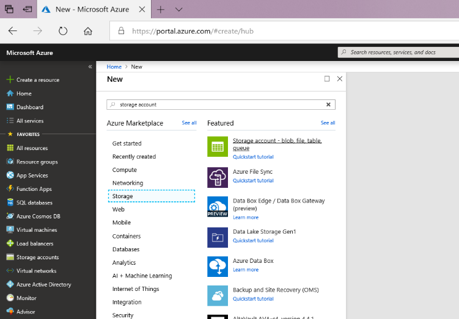
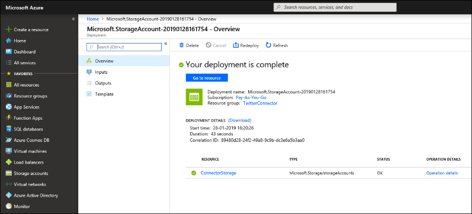
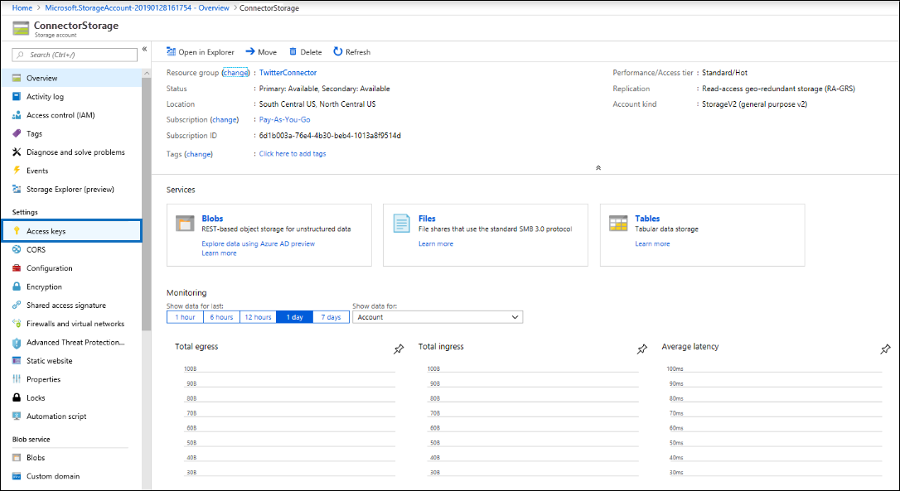

# Distribuire un connettore per archiviare i dati di TwitterDeploy a connector to archive Twitter data

Questo articolo contiene il processo dettagliato per la distribuzione di un connettore che utilizza il servizio di importazione di Office 365 per importare i dati dall'account Twitter dell'organizzazione a Office 365.This article contains the step-by-step process to deploy a connector that uses the Office 365 Import service to import data from your organization's Twitter account to Office 365. Per una panoramica generale di questo processo e un elenco dei prerequisiti necessari per distribuire un connettore Twitter, vedere [use a Connector to Archive Twitter data in Office 365 (Preview)](archive-twitter-data-with-sample-connector.md).For a high-level overview of this process and a list of prerequisites required to deploy a Twitter connector, see [Use a connector to archive Twitter data in Office 365 (Preview)](archive-twitter-data-with-sample-connector.md). 

## Passaggio 1: scaricare il pacchettoStep 1: Download the package

Scaricare il pacchetto precompilato dalla sezione Release nell'archivio GitHub all'indirizzo [https://github.com/microsoft/m365-sample-twitter-connector-csharp-aspnet/releases](https://github.com/microsoft/m365-sample-twitter-connector-csharp-aspnet/releases).Download the prebuilt package from the Release section in the GitHub repository at [https://github.com/microsoft/m365-sample-twitter-connector-csharp-aspnet/releases](https://github.com/microsoft/m365-sample-twitter-connector-csharp-aspnet/releases). Nella versione più recente, scaricare il file zip denominato **SampleConnector. zip**.Under the latest release, download the zip file named **SampleConnector.zip**. È possibile caricare il file zip in Azure nel passaggio 4.You upload this zip file to Azure in Step 4.

## Passaggio 2: creare un'app in Azure Active DirectoryStep 2: Create an app in Azure Active Directory

1. Accedere a <https://portal.azure.com> e accedere con le credenziali di un account di amministratore globale di Office 365.Go to <https://portal.azure.com> and sign in using the credentials of an Office 365 global admin account.

   

2. Nel riquadro di spostamento a sinistra, fare clic su **Azure Active Directory**.In the left navigation pane, click **Azure Active Directory**.

   

3. Nel riquadro di spostamento a sinistra, fare clic su **registrazioni app (anteprima)** e quindi fare clic su **nuova registrazione**.In the left navigation pane, click **App registrations (Preview)** and then click **New registration**.

   

4. Registrare l'applicazione.Register the application. In **URI di reindirizzamento (facoltativo)** selezionare **Web** nell'elenco a discesa tipo di applicazione e quindi `https://portal.azure.com` digitare nella casella relativa all'URI.Under **Redirect URI (optional)**, select **Web** in the application type dropdown list and then type `https://portal.azure.com` in the box for the URI.

   

5. Copiare l'ID dell' **applicazione (client)** e la **Directory (tenant)** e salvarli in un file di testo o in un'altra posizione sicura.Copy the **Application (client) ID** and **Directory (tenant) ID** and save them to a text file or other safe location. È possibile utilizzare questi ID nei passaggi successivi.You use these IDs in later steps.

    

6. Accedere a **certificati & segreti per la nuova applicazione** e in **segreti client** fare clic su **nuovo segreto client**.Go to **Certificates & secrets for the new app** and under **Client secrets** click **New client secret**.

   

7. Creare un nuovo segreto.Create a new secret. Nella casella Descrizione digitare il segreto e quindi scegliere un periodo di scadenza.In the description box, type the secret and then choose an expiration period. 

   

8. Copiare il valore del segreto e salvarlo in un file di testo o in un altro percorso di archiviazione.Copy the value of the secret and save it to a text file or other storage location. Si tratta del segreto dell'applicazione AAD utilizzato nei passaggi successivi.This is the AAD application secret that you use in later steps.

   

9. Andare a **manifest** e copiare il identifierUris (denominato anche URI dell'applicazione AAD) come evidenziato nella schermata seguente.Go to **Manifest** and copy the identifierUris (which is also called the AAD application Uri) as highlighted in the following screenshot. Copiare l'URI dell'applicazione AAD in un file di testo o in un altro percorso di archiviazione.Copy the AAD application Uri to a text file or other storage location. Viene utilizzato nel passaggio 6.You use it in Step 6.

    

## Passaggio 3: creare un account di archiviazione di AzureStep 3: Create an Azure storage account

1.  Passare alla Home page di Azure per l'organizzazione.Go to the Azure home page for your organization.

    

2. Fare clic su **Crea una risorsa** e digitare **account di archiviazione** nella casella di ricerca.Click **Create a resource** and they type **storage account** in the search box.

   

3. Fare clic su **spazio di archiviazione**e quindi su **account di archiviazione**.Click **Storage**, and then click **Storage account**.

   

4. Nella pagina **Crea account di archiviazione** , nella casella sottoscrizione, selezionare **pay-as-you-go** o **versione di valutazione gratuita** a seconda del tipo di sottoscrizione di Azure di cui si dispone.On the **Create storage account** page, in the Subscription box, select **Pay-As-You-Go** or **Free Trial** depending on which type of Azure subscription you have. 

   

5. Selezionare o creare un gruppo di risorse.Select or create a resource group.

   

6. Digitare un nome per l'account di archiviazione.Type a name for the storage account.

   

7. Esaminare e quindi fare clic su **Crea** per creare l'account di archiviazione.Review and then click **Create** to create the storage account.

   

8. Dopo alcuni istanti, fare clic su **Aggiorna** e quindi su **Vai a risorsa** per passare all'account di archiviazione.After a few moments, click **Refresh** and then click **Go to resource** to navigate to the storage account.

   

9. Fare clic su **tasti di accesso** nel riquadro di spostamento a sinistra.Click **Access keys** in the left navigation pane.

   

10. Copiare una **stringa di connessione** e salvarla in un file di testo o in un altro percorso di archiviazione.Copy a **Connection string** and save it to a text file or other storage location. Questa operazione viene utilizzata quando si crea una risorsa Web App nel passaggio 4.You use this when creating a web app resource in Step 4.

    

## Passaggio 4: creare una nuova risorsa Web App in AzureStep 4: Create a new web app resource in Azure

1. Nella **Home** page del portale di Azure, fare clic su **Crea una \> risorsa \> tutto Web App**.On the **Home** page in the Azure portal, click **Create a resource \> Everything \> Web app**. Nella pagina **Web App** fare clic su **Crea**.On the **Web app** page, click **Create**.

   

2. Inserire i dettagli (come illustrato di seguito) e quindi creare l'applicazione Web.Fill in the details (as shown below) and then create the Web app. Il nome immesso nella casella **nome app** viene utilizzato per creare l'URL del servizio app di Azure. ad esempio, twitterconnector.azurewebsites.net.The name that you enter in the **App name** box is used to create the Azure app service URL; for example, twitterconnector.azurewebsites.net.

   

3. Passare alla risorsa nuova applicazione Web creata e fare clic su **Impostazioni applicazione** nel riquadro di spostamento sinistro.Go to the newly created web app resource and click **Application Settings** in the left navigation pane. In **Impostazioni applicazione**fare clic su **Aggiungi nuova impostazione** e quindi aggiungere le tre impostazioni seguenti.Under **Application settings**, click **Add new setting** and add the following three settings. Utilizzare i valori (copiati nel file di testo dai passaggi precedenti):Use the values (that you copied to the text file from the previous steps): 

    - **APISecretKey** – è possibile digitare qualsiasi valore come segreto.**APISecretKey** – You can type any value as the secret. Viene utilizzato per accedere all'applicazione Web del connettore nel passaggio 7.This is used to access the connector web app in Step 7.

    - **StorageAccountConnectionString** : l'URI della stringa di connessione copiato dopo la creazione dell'account di archiviazione di Azure nel passaggio 3.**StorageAccountConnectionString** – The connection string Uri that you copied after creating the Azure storage account in Step 3.

    - **tenantId** -l'ID tenant dell'organizzazione di Office 365 copiato dopo aver creato l'app Twitter Connector in Azure Active Directory nel passaggio 2.**tenantId** – The tenant ID of your Office 365 organization that you copied after creating the Twitter connector app in Azure Active Directory in Step 2.

    

4. In **Impostazioni generali**, fare clic **su** avanti accanto a **sempre attiva**.Under **General settings**, click **On** next to the **Always On**. Fare clic su **Salva** nella parte superiore della pagina per salvare le impostazioni dell'applicazione.Click **Save** at the top of the page to save the application settings.

   

5. Il passaggio finale consiste nel caricare il codice sorgente dell'app del connettore in Azure scaricato nel passaggio 1.The final step is to upload the connector app source code to Azure that you downloaded in Step 1. In un Web browser, passare a https://<AzureAppResourceName>. SCM.azurewebsites.NET/ZipDeployUi.In a web browser, go to https://<AzureAppResourceName>.scm.azurewebsites.net/ZipDeployUi. Ad esempio, se il nome della risorsa dell'app di Azure (denominato nel passaggio 2 di questa sezione) è **twitterconnector**, si passa a https://twitterconnector.scm.azurewebsites.net/ZipDeployUi.For example, if the name of your Azure app resource (which you named in step 2 in this section) is **twitterconnector**, then you would go to https://twitterconnector.scm.azurewebsites.net/ZipDeployUi.

6. Trascinare e rilasciare il SampleConnector. zip (scaricato nel passaggio 1) in questa pagina.Drag and drop the SampleConnector.zip (that you downloaded in Step 1) to this page. Dopo che i file sono stati caricati e la distribuzione ha esito positivo, la pagina avrà un aspetto simile alla schermata seguente:After the files are uploaded and the deployment is successful, the page will look similar to the following screenshot:

   

## Passaggio 5: creare l'app TwitterStep 5: Create the Twitter app

1. Accedere a https://developer.twitter.com, eseguire l'accesso usando le credenziali per l'account di sviluppo per l'organizzazione, quindi fare clic su **app**.Go to https://developer.twitter.com, log in using the credentials for the developer account for your organization, and then click **Apps**.

   
2. Fare clic su **Crea un'app**.Click **Create an app**.
   
   

3. In **Dettagli app**aggiungere informazioni sull'applicazione.Under **App details**, add information about the application.

   

4. Nel dashboard per sviluppatori di Twitter, selezionare l'app appena creata e copiare l'ID app visualizzato e salvarlo in un file di testo o in un altro percorso di archiviazione.On the Twitter developer dashboard, select the app that you just created and copy the App ID that's displayed  and save it to a text file or other storage location. Quindi fare clic su **Dettagli**.Then click **Details**.
   
   

5. Nella scheda **tasti e token** , in **tasti API consumer** copiare la chiave segreta API e salvarla in un file di testo o in un altro percorso di archiviazione.On the **Keys and tokens** tab, under **Consumer API keys** copy the API secret key and save it to a text file or other storage location. Fare quindi clic su **Crea** per generare un token di accesso e un segreto del token di accesso e copiarli in un file di testo o in un altro percorso di archiviazione.Then click **Create** to generate an access token and an access token secret, and copy these to a text file or other storage location.
   
   

   Fare quindi clic su **Crea** per generare un token di accesso e un segreto del token di accesso e copiarli in un file di testo o in un altro percorso di archiviazione.Then click **Create** to generate an access token and an access token secret, and copy these to a text file or other storage location.

6. Fare clic sulla scheda **autorizzazioni** e configurare le autorizzazioni come illustrato nella schermata seguente:Click the **Permissions** tab and configure the permissions as shown in the following screenshot:

   

7. Dopo aver salvato le impostazioni delle autorizzazioni, fare clic sulla scheda **Dettagli applicazione** e quindi fare clic su **modifica > modifica dettagli**.After you save the permission settings, click the **App details** tab, and then click **Edit > Edit details**.

   

8. Eseguire le attività seguenti:Do the following tasks:

   - Seleziona la casella di controllo per consentire all'app del connettore di accedere a Twitter.Select the checkbox to allow the connector app to sign in to Twitter.
   
   - Aggiungere l'URI di reindirizzamento OAuth utilizzando il formato seguente: \*\* \<connectorserviceuri>/views/twitteroauth\*\*, in cui il valore di *connectorserviceuri* è l'URL del servizio app di Azure per l'organizzazione. ad esempio, https://twitterconnector.azurewebsites.net/Views/TwitterOAuth.Add the OAuth redirect Uri using the following format: **\<connectorserviceuri>/Views/TwitterOAuth**, where the value of *connectorserviceuri* is the Azure app service URL for your organization; for example, https://twitterconnector.azurewebsites.net/Views/TwitterOAuth.

    

L'app per sviluppatori di Twitter è ora pronta per essere utilizzata.The Twitter developer app is now ready to use.

## Passaggio 6: configurare l'applicazione Web del connettoreStep 6: Configure the connector web app 

1. Passare a https://\<AzureAppResourceName>. azurewebsites.NET (dove **AzureAppResourceName** è il nome della risorsa di Azure App denominata nel passaggio 4).Go to https://\<AzureAppResourceName>.azurewebsites.net (where **AzureAppResourceName** is the name of your Azure app resource that you named in Step 4). Ad esempio, se il nome è **twitterconnector**, andare a https://twitterconnector.azurewebsites.net.For example, if the name is **twitterconnector**, go to https://twitterconnector.azurewebsites.net. La Home page dell'app è simile alla schermata seguente:The home page of the app looks like the following screenshot:

   

2. Fare clic su **Configura** per visualizzare una pagina di accesso.Click **Configure** to display a sign in page.

   

3. Nella casella ID tenant digitare o incollare l'ID tenant (ottenuto nel passaggio 2).In the Tenant Id box, type or paste your tenant Id (that you obtained in Step 2). Nella casella password digitare o incollare il APISecretKey (ottenuto nel passaggio 2), quindi fare clic su **imposta impostazioni di configurazione** per visualizzare la pagina **Dettagli di configurazione** .In the password box, type or paste the APISecretKey (that you obtained in Step 2), and then click **Set Configuration Settings** to display the **Configuration Details** page.

   

4. In **Dettagli di configurazione**, immettere le impostazioni di configurazione seguentiUnder **Configuration Details**, enter the following configuration settings 

   - **Chiave API di Twitter** : l'ID app per l'applicazione Twitter creata al passaggio 5.**Twitter Api Key** – The app ID for the Twitter application that you created in Step 5.
   - **Chiave segreta API di Twitter** – la chiave segreta API per l'applicazione Twitter creata al passaggio 5.**Twitter Api Secret Key** – The API secret key for the Twitter application that you created in Step 5.
   - **Token di accesso Twitter** : il token di accesso creato nel passaggio 5.**Twitter Access Token** – The access token that you created in Step 5.
   - **Segreto del token di accesso di Twitter** -il segreto del token di accesso creato nel passaggio 5.**Twitter Access Token Secret** – The access token secret that you created in Step 5.
   - **ID applicazione AAD** -ID applicazione per l'app Azure Active Directory creata al passaggio 2**AAD Application ID** – The application ID for the Azure Active Directory app that you created in Step 2
   - **Segreto dell'applicazione AAD** : il valore del segreto di APISecretKey creato nel passaggio 4.**AAD Application Secret** – The value for the APISecretKey secret that you created in Step 4.
   - **URI dell'applicazione AAD** – URI dell'applicazione AAD ottenuto nel passaggio 2; ad esempio, `https://microsoft.onmicrosoft.com/2688yu6n-12q3-23we-e3ee-121111123213`.**AAD Application Uri** – The AAD application Uri obtained in Step 2; for example, `https://microsoft.onmicrosoft.com/2688yu6n-12q3-23we-e3ee-121111123213`.
   - **Chiave di strumentazione Insights app** : lasciare vuota questa casella.**App Insights Instrumentation Key** – Leave this box blank.

5. Fare clic su **Salva** per salvare le impostazioni del connettore.Click **Save** to save the connector settings.

## Passaggio 7: configurare un connettore personalizzato nel centro sicurezza e conformitàStep 7: Set up a custom connector in the security and compliance center

1.  Passare a <https://protection.office.com> e quindi fare clic su **dati di terze parti sull' \> importazione \> di governance delle informazioni**.Go to <https://protection.office.com> and then click **Information governance \> Import \> Archive third-party data**.

    

2. Fare clic su **Aggiungi connettore** e quindi su **Twitter**.Click **Add a connector** and then click **Twitter**.

   

3. Nella pagina **Aggiungi applicazione del connettore** , immettere le informazioni seguenti e quindi fare clic su **convalida connettore**.On the **Add Connector App** page, enter the following information and then click **Validate connector**.

    - Nella prima casella digitare un nome per il connettore, ad esempio **Twitter**.In the first box, type a name for the connector, such as **Twitter**.
    - Nella seconda casella digitare o incollare il valore dell'APISecretKey aggiunto nel passaggio 4.In the second box, type or paste the value of the APISecretKey that you added in Step 4.
    - Nella terza casella digitare o incollare l'URL del servizio app di Azure; ad esempio, **https://twitterconnector.azurewebsites.net**.In the third box, type or paste the Azure app service URL; for example, **https://twitterconnector.azurewebsites.net**.

   Dopo che il connettore è stato convalidato, fare clic su **Avanti**.After the connector is successfully validated, click **Next**.

   

4. Fare clic su **login con app connettore**.Click **Login with Connector App**.

   

5. Digitare o incollare di nuovo il APISecretKey e quindi fare clic su **accedi al servizio connettore**.Type or paste the APISecretKey again and then click  **Login to Connector Service**.

   

6. Fare clic su **continua con Twitter**.Click **Continue with Twitter**.

7. Nella pagina di accesso di Twitter, accedere usando le credenziali per l'account per l'account Twitter dell'organizzazione.On the Twitter sign in page, sign in using the credentials for the account for your organization’s Twitter account.

   

   Dopo aver eseguito l'accesso, nella pagina Twitter verrà visualizzato il messaggio seguente: "il processo del connettore di Twitter è stato configurato correttamente".After you sign in, the Twitter page will display the following message, "Twitter Connector Job Successfully set up."

8. Fare clic su **fine** per completare la configurazione del connettore Twitter.Click **Finish** to complete setting up the Twitter connector.

9. Nella pagina **Imposta filtri** è possibile applicare un filtro per importare e archiviare gli elementi di una determinata età.On the **Set Filters** page, you can apply a filter to import (and archive) items that are a certain age. Fare clic su **Avanti**.Click **Next**.

   

10. Nella pagina **Imposta account di archiviazione** Digitare l'indirizzo di posta elettronica di una cassetta postale di Office 365 in cui verranno importati gli elementi di Twitter.On the **Set Storage Account** page, type the email address of an Office 365 mailbox that the Twitter items will be imported to.

    

11. Esaminare le impostazioni e quindi fare clic su **fine** per completare la configurazione del connettore nel centro sicurezza & conformità.Review your settings and then click **Finish** to complete the connector setup in the Security & Compliance Center.

    

    

12. Passare alla pagina di **archiviazione dei dati di terze parti** per visualizzare lo stato di avanzamento del processo di importazione.Go to the **Archive third-party data** page to see the progress of the import process.

    
