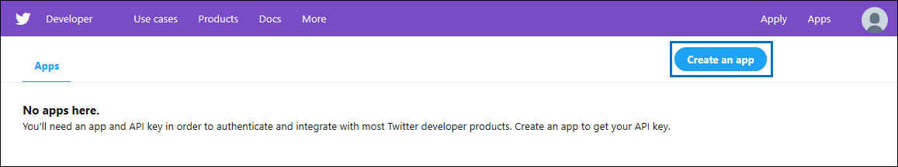

# Distribuire un connettore per archiviare i dati di Twitter

In questo articolo sono contenute le procedure dettagliate per distribuire un connettore che utilizza il servizio di importazione di Office 365 per importare dati dall'account Twitter dell'organizzazione a Microsoft 365. Per una panoramica generale di questo processo e un elenco dei prerequisiti necessari per distribuire un connettore Twitter, vedere [Set up a connector to archive Twitter data ](archive-twitter-data-with-sample-connector.md).

## Passaggio 1: Creare un'app in Azure Active Directory

1. Accedere a <https://portal.azure.com> e accedere utilizzando le credenziali di un account amministratore globale.

   

2. Nel riquadro di spostamento a sinistra, fare clic su **Azure Active Directory**.

   

3. Nel riquadro di spostamento sinistro fare clic su **Registrazioni app (anteprima)** e quindi su **Nuova registrazione.**

   

4. Registrare l'applicazione. In **URI di reindirizzamento (facoltativo)** seleziona **Web** nell'elenco a discesa tipo di applicazione e quindi digita nella casella `https://portal.azure.com` per l'URI.

   

5. Copiare **l'ID applicazione (client)** **e l'ID directory (tenant)** e salvarli in un file di testo o in un altro percorso sicuro. Questi ID vengono utilizzati nei passaggi successivi.

    

6. Vai a **Certificati & segreti per la nuova app** e in Segreti client **fai** clic su Nuovo **segreto client.**

   

7. Creare un nuovo segreto. Nella casella Descrizione digitare il segreto e quindi scegliere un periodo di scadenza.

   

8. Copiare il valore del segreto e salvarlo in un file di testo o in un altro percorso di archiviazione. Si tratta del segreto dell'applicazione AAD utilizzato nei passaggi successivi.

   

## Passaggio 2: Distribuire il servizio Web del connettore da GitHub all'account Azure

1. Accedere a [questo sito GitHub e](https://github.com/microsoft/m365-sample-twitter-connector-csharp-aspnet) fare clic su **Distribuisci in Azure**.

    

2. Dopo aver fatto **clic su Distribuisci in Azure,** si verrà reindirizzati a un portale di Azure con una pagina modello personalizzata. Compila i dettagli **di** base e **Impostazioni** e quindi fai clic su **Acquista.**

   

    - **Sottoscrizione:** Selezionare la sottoscrizione di Azure in cui si desidera distribuire il servizio Web del connettore Di Twitter.

    - **Gruppo di risorse:** Scegliere o creare un nuovo gruppo di risorse. Un gruppo di risorse è un contenitore che contiene le risorse correlate per una soluzione di Azure.

    - **Posizione:** Scegliere una posizione.

    - **Nome app Web:** Specificare un nome univoco per l'app Web del connettore. Il nome deve avere una lunghezza compresa tra 3 e 18 caratteri. Questo nome viene usato per creare l'URL del servizio app di Azure. Ad esempio, se fornisci il nome dell'app Web **twitterconnector,** l'URL del servizio app di Azure verrà **twitterconnector.azurewebsites.net**.

    - **tenantId:** L'ID tenant dell'Microsoft 365 che hai copiato dopo aver creato l'app del connettore Facebook in Azure Active Directory nel passaggio 1.

   - **APISecretKey:** È possibile digitare qualsiasi valore come segreto. Viene usato per accedere all'app Web del connettore nel passaggio 5.

3. Una volta completata la distribuzione, la pagina avrà un aspetto simile allo screenshot seguente:

    

## Passaggio 3: Creare l'app Twitter

1. Vai a https://developer.twitter.com , accedi usando le credenziali per l'account sviluppatore per l'organizzazione e quindi fai clic su **App.**

   
2. Fai **clic su Crea un'app.**

   

3. In **Dettagli app** aggiungi informazioni sull'applicazione.

   

4. Nel dashboard per sviluppatori di Twitter seleziona l'app appena creata e quindi fai clic su **Dettagli.**

   

5. Nella scheda **Chiavi e token,** in Chiavi **API** consumer copiare sia la chiave API che la chiave privata dell'API e salvarle in un file di testo o in un altro percorso di archiviazione. Fare quindi **clic su Crea** per generare un token di accesso e un token di accesso segreto e copiarlo in un file di testo o in un altro percorso di archiviazione.

   

   Fare quindi **clic su Crea** per generare un token di accesso e un segreto token di accesso e copiarlo in un file di testo o in un altro percorso di archiviazione.

6. Fare clic **sulla scheda** Autorizzazioni e configurare le autorizzazioni come illustrato nello screenshot seguente:

   

7. Dopo aver salvato le impostazioni di autorizzazione, fare clic sulla **scheda Dettagli** app e quindi su Modifica > **Modifica dettagli**.

   

8. Eseguire le attività seguenti:

   - Seleziona la casella di controllo per consentire all'app connettore di accedere a Twitter.

   - Aggiungere l'URI di reindirizzamento OAuth nel formato **\<connectorserviceuri> seguente: /Views/TwitterOAuth**, dove il valore di *connectorserviceuri è* l'URL del servizio app azure per l'organizzazione, ad esempio https://twitterconnector.azurewebsites.net/Views/TwitterOAuth .

    

L'app per sviluppatori Twitter è ora pronta per l'uso.

## Passaggio 4: Configurare l'app Web del connettore

1. Vai a https:// \<AzureAppResourceName> .azurewebsites.net (dove **AzureAppResourceName** è il nome della risorsa app di Azure denominata nel passaggio 4). Ad esempio, se il nome è **twitterconnector**, passare a https://twitterconnector.azurewebsites.net . La home page dell'app è simile alla schermata seguente:

   

2. Fare **clic su** Configura per visualizzare una pagina di accesso.

   

3. Nella casella ID tenant digitare o incollare l'ID tenant ottenuto nel passaggio 2. Nella casella password digitare o **incollare** APISecretKey (ottenuto nel passaggio 2), quindi fare clic su Imposta configurazione Impostazioni per visualizzare la pagina dei dettagli della configurazione.

   

4. Immettere le impostazioni di configurazione seguenti

   - **Chiave api Twitter:** La chiave API per l'applicazione Twitter creata nel passaggio 3.

   - **Chiave privata api Twitter:** Chiave privata API per l'applicazione Twitter creata nel passaggio 3.

   - **Token di accesso Twitter:** Token di accesso creato nel passaggio 3.

   - **Twitter Access Token Secret:** Il token di accesso segreto creato nel passaggio 3.

   - **ID applicazione AAD:** ID dell'applicazione Azure Active Directory'app creata nel passaggio 1

   - **Segreto applicazione AAD:** Valore per il segreto APISecretKey creato nel passaggio 1.

5. Fare **clic su** Salva per salvare le impostazioni del connettore.

## Passaggio 5: Configurare un connettore Twitter nella Centro conformità Microsoft 365

1. Vai a [https://compliance.microsoft.com](https://compliance.microsoft.com) e quindi fai clic su **Connettori dati** nel riquadro di spostamento sinistro.

2. Nella pagina **Connettori dati** in **Twitter** fare clic su **Visualizza.**

3. Nella pagina **Twitter** fare clic su **Aggiungi connettore.**

4. Nella pagina **Condizioni di servizio** fare clic su **Accetta.**

5. Nella pagina **Aggiungi credenziali per l'app connettore** immettere le informazioni seguenti e quindi fare clic su **Convalida connessione.**

   

    - Nella casella **Nome** digitare un nome per il connettore, ad esempio Gestione della **Guida di Twitter.**

    - Nella casella **URL connettore** digitare o incollare l'URL del servizio app di Azure. ad esempio `https://twitterconnector.azurewebsites.net` .

    - Nella casella **Password** digitare o incollare il valore di APISecretKey creato nel passaggio 2.

    - Nella casella **ID app di Azure** digitare o incollare il valore dell'ID app dell'applicazione Azure (denominato anche ID *client)* ottenuto nel passaggio 1.

6. Dopo aver convalidato correttamente la connessione, fare clic su **Avanti.**

7. Nella pagina **Autorizza Microsoft 365 importare** dati digitare o incollare di nuovo APISecretKey e quindi fare clic su **Accedi all'app Web.**

8. Fai **clic su Accedi con Twitter.**

9. Nella pagina di accesso a Twitter, accedere utilizzando le credenziali per l'account Twitter dell'organizzazione.

   

   Dopo aver eseguito l'accesso, nella pagina Twitter verrà visualizzato il messaggio seguente, "Configurazione completata del processo del connettore twitter".

10. Fare **clic su** Continua per completare la configurazione del connettore Twitter.

11. Nella pagina **Imposta filtri** è possibile applicare un filtro per importare inizialmente elementi di una determinata età. Selezionare un'età e quindi fare clic su **Avanti.**

12. Nella pagina **Scegli percorso di archiviazione** digitare l'indirizzo di Microsoft 365 di posta elettronica in cui verranno importati gli elementi di Twitter e quindi fare clic su **Avanti.**

13. Fare **clic su** Avanti per esaminare le impostazioni del connettore e quindi fare clic su **Fine** per completare la configurazione del connettore.

14. Nel Centro conformità passare alla pagina **Connettori** di dati e fare clic sulla scheda **Connettori** per visualizzare l'avanzamento del processo di importazione.
