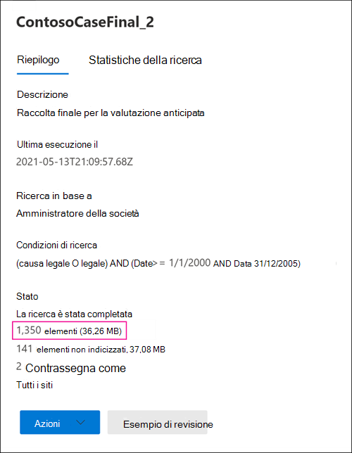

# Differenze tra i risultati della ricerca eDiscovery stimati ed effettiviDifferences between estimated and actual eDiscovery search results

Questo argomento si applica alle ricerche che è possibile eseguire utilizzando uno dei seguenti strumenti Microsoft 365 eDiscovery:This topic applies to searches that you can run using one of the following Microsoft 365 eDiscovery tools: 

- Ricerca contenutoContent search
- Core eDiscoveryCore eDiscovery

Quando si esegue una ricerca eDiscovery, lo strumento in uso restituirà una stima del numero di elementi (e delle relative dimensioni totali) che corrispondono ai criteri di ricerca.When you run an eDiscovery search, the tool you're using will return an estimate of the number of items (and their total size) that match the search criteria. Ad esempio, quando si esegue una ricerca nel Centro conformità Microsoft 365, i risultati della ricerca stimati vengono visualizzati nella pagina a comparsa per la ricerca selezionata.For example, when you run a search in the Microsoft 365 compliance center, the estimated search results are displayed on the flyout page for the selected search.
  

  
Si tratta della stessa stima delle dimensioni totali e del numero di elementi visualizzati nello strumento di esportazione di eDiscovery quando si esportano i risultati in un computer locale e nel report Riepilogo esportazione scaricato con i risultati della ricerca.This is the same estimate of total size and number of items that is displayed in the eDiscovery Export Tool when you export results to a local computer and in the Export Summary report that's downloaded with the search results.
  
**Risultati stimati nello strumento di esportazione di eDiscovery****Estimated results in the eDiscovery Export tool**

  
**Risultati stimati nel report Riepilogo esportazione****Estimated results in Export Summary report**

  
Tuttavia, come si noterà nella schermata precedente del report Riepilogo esportazione, le dimensioni e il numero dei risultati di ricerca effettivi scaricati sono diversi da quelli dei risultati di ricerca stimati.However, as you'll notice in the previous screenshot of the Export Summary report, the size and number of actual search results that are downloaded are different than the size and number of estimated search results.
  

  
Ecco alcuni motivi per queste differenze:Here are some reasons for these differences:
  
- **Modalità di stima dei risultati**.**The way results are estimated**. Una stima dei risultati della ricerca è solo una stima (e non un conteggio effettivo) degli elementi che soddisfano i criteri di query di ricerca.An estimate of the search results is just that, an estimate (and not an actual count) of the items that meet the search query criteria. Per compilare la stima degli elementi Exchange, un elenco degli ID messaggio che soddisfano i criteri di ricerca viene richiesto dal database di Exchange dallo strumento eDiscovery in uso.To compile the estimate of Exchange items, a list of the message IDs that meet the search criteria is requested from the Exchange database by the eDiscovery tool you're using. Tuttavia, quando si esportano i risultati della ricerca, la ricerca viene rieseguita e i messaggi effettivi vengono recuperati dal database Exchange ricerca.But when you export the search results, the search is rerun and the actual messages are retrieved from the Exchange database. Queste differenze potrebbero pertanto derivare dal modo in cui vengono determinati il numero stimato di elementi e il numero effettivo di elementi.So these differences might result because of how the estimated number of items and the actual number of items are determined.

- **Modifiche che si verificano tra il momento in cui si stimano ed esportano i risultati della ricerca.****Changes that happen between the time when estimating and exporting search results**. Quando si esportano i risultati della ricerca, la ricerca viene riavviata per raccogliere gli elementi più recenti nell'indice di ricerca che soddisfano i criteri di ricerca.When you export search results, the search is restarted to collect that most recent items in the search index that meet the search criteria. È possibile che siano stati creati, inviati o ricevuti elementi aggiuntivi che soddisfano i criteri di ricerca nel periodo tra la raccolta dei risultati della ricerca stimati e l'esportazione dei risultati della ricerca.It's possible there are additional items were created, sent, or received that meet the search criteria in the time between when the estimated search results were collected and when the search results were exported. È inoltre possibile che gli elementi che si trovavano nell'indice di ricerca al momento della stima dei risultati della ricerca non siano più presenti perché sono stati eliminati dal percorso del contenuto prima dell'esportazione dei risultati della ricerca.It's also possible that items that were in the search index when the search results were estimated are no longer there because they were purged from the content location before the search results are exported. Un modo per ovviare a questo problema è specificare un intervallo di date per una ricerca eDiscovery.One way to mitigate this issue is to specify a date range for an eDiscovery search. Un altro modo è quello di conservare i percorsi del contenuto in modo che gli elementi siano conservati e non possano essere eliminati.Another way is to place a hold on content locations so that items are preserved and can't be purged. 

   Anche se rara, anche nel caso in cui viene applicata un'esenzione, la manutenzione degli elementi di calendario incorporati (che non sono modificabili dall'utente, ma sono inclusi in molti risultati di ricerca) può essere rimossa di tanto in tanto.Although rare, even in the case when a hold is applied, maintenance of built-in calendar items (which aren't editable by the user, but are included in many search results) may be removed from time to time. Questa rimozione periodica degli elementi del calendario comporta un numero minore di elementi esportati.This periodic removal of calendar items will result in fewer items that are exported.

- **Elementi non indicizzati**.**Unindexed items**. Gli elementi non indicizzati per la ricerca possono causare differenze tra i risultati di ricerca stimati ed effettivi.Items that are unindexed for search can cause differences between estimated and actual search results. È possibile includere elementi non indicizzati quando si esportano i risultati della ricerca.You can include unindexed items when you export the search results. Se si includono elementi non indicizzati durante l'esportazione dei risultati della ricerca, potrebbero essere presenti più elementi esportati.If you include unindexed items when exporting search results, there might be more items that are exported. Ciò causerà una differenza tra i risultati di ricerca stimati ed esportati.This will cause a difference between the estimated and exported search results.

    Quando si utilizza lo strumento ricerca contenuto, è possibile includere elementi non indicizzati quando si esportano i risultati della ricerca.When using the Content search tool, you have the option to include unindexed items when you export search results. Il numero di elementi non indicizzati restituiti dalla ricerca è elencato nella pagina a comparsa insieme agli altri risultati di ricerca stimati.The number of unindexed items returned by the search is listed on the flyout page together with the other estimated search results. Tutti gli elementi non indicizzati verranno inclusi anche nella dimensione totale dei risultati di ricerca stimati.Any unindexed items would also be included in the total size of the estimated search results. Quando si esportano i risultati della ricerca, è possibile includere o non includere elementi non indicizzati.When you export search results, you have the option to include or not include unindexed items. La configurazione di queste opzioni potrebbe comportare differenze tra i risultati di ricerca stimati e i risultati di ricerca effettivi scaricati.How you configure these options might result in differences between estimated and the actual search results that are downloaded.

- **Esportazione dei risultati di una ricerca contenuto che include tutti i percorsi di contenuto.****Exporting the results of a Content search that includes all content locations**. Se la ricerca da cui si esportano i risultati è una ricerca di tutti i percorsi di contenuto nell'organizzazione, verranno esportati solo gli elementi non indicizzati dai percorsi di contenuto che contengono elementi che soddisfano i criteri di ricerca.If the search that you're exporting results from was a search of all content locations in your organization, then only the unindexed items from content locations that contain items that match the search criteria will be exported. In other words, if no search results are found in a mailbox or site, then any unindexed items in that mailbox or site won't be exported.In other words, if no search results are found in a mailbox or site, then any unindexed items in that mailbox or site won't be exported. Tuttavia, gli elementi non indicizzati di tutti i percorsi di contenuto (anche quelli che non contengono elementi che corrispondono alla query di ricerca) verranno inclusi nei risultati di ricerca stimati.However, unindexed items from all content locations (even those that don't contain items that match the search query) will be included in the estimated search results.

    In alternativa, se la ricerca che si sta esportando risultati da percorsi di contenuto specifici inclusi, gli elementi non indicizzati (che non sono esclusi dai criteri di ricerca) da tutti i percorsi di contenuto specificati nella ricerca verranno esportati.Alternatively, if the search that you're exporting results from included specific content locations, then unindexed items (that aren't excluded by the search criteria) from all the content locations specified in the search will be exported. In questo caso, il numero stimato di elementi non indicizzati e il numero di elementi non indicizzati esportati devono essere uguali.In this case, the estimated number of unindexed items and the number of unindexed items that are exported should be the same.

    Il motivo per cui non si esportano elementi non indicizzati da ogni posizione dell'organizzazione è perché potrebbe aumentare la probabilità di errori di esportazione e aumentare il tempo necessario per esportare e scaricare i risultati della ricerca.The reason for not exporting unindexed items from every location in the organization is because it might increase the likelihood of export errors and increase the time it takes to export and download the search results.

- **Gli elementi non indicizzati in SharePoint e OneDrive non sono inclusi nelle stime di ricerca.****Unindexed items in SharePoint and OneDrive not included in the search estimates**. Gli elementi non indicizzati SharePoint siti e OneDrive for Business non sono inclusi nei risultati di ricerca stimati.Unindexed items from SharePoint sites and OneDrive for Business accounts aren't included in the estimated search results. Questo perché l'SharePoint non contiene dati per gli elementi non indicizzati.This is because the SharePoint index doesn't contain data for unindexed items. Solo gli elementi non indicizzati dalle cassette postali sono inclusi nelle stime di ricerca.Only unindexed items from mailboxes are included in the search estimates. Tuttavia, se si includono elementi non indicizzati durante l'esportazione dei risultati della ricerca, vengono inclusi gli elementi non indicizzati in SharePoint e OneDrive, con un aumento del numero di elementi effettivamente esportati.However, if you include unindexed items when exporting search results, unindexed items in SharePoint and OneDrive are included, which will increase the number of items that are actually exported. Ciò determina differenze tra i risultati stimati (che non includono gli elementi non indicizzati nei siti SharePoint e OneDrive) e gli elementi effettivi scaricati.This will result in differences between the estimated results (which don't include unindexed items in SharePoint and OneDrive sites) and the actual items that are downloaded. La regola sull'esportazione di elementi non indicizzati solo da percorsi di contenuto che contengono elementi che soddisfano i criteri di ricerca si applica ancora in questa situazione.The rule about exporting unindexed items only from content locations that contain items that match the search criteria still applies in this situation.

- **Versioni dei documenti in SharePoint e OneDrive**.**Document versions in SharePoint and OneDrive**. Quando si SharePoint siti e OneDrive, più versioni di un documento non vengono incluse nel conteggio dei risultati di ricerca stimati.When searching SharePoint sites and OneDrive accounts, multiple versions of a document aren't included in the count of estimated search results. Tuttavia, è possibile includere tutte le versioni dei documenti quando si esportano i risultati della ricerca.But you have the option to include all document versions when you export the search results. Se si includono versioni dei documenti durante l'esportazione dei risultati della ricerca, il numero effettivo (e le dimensioni totali) degli elementi esportati verrà aumentato.If you include document versions when exporting search results, the actual number (and total size) of the exported items will be increased.

- **SharePoint cartelle .****SharePoint folders**. Se il nome delle cartelle in SharePoint corrisponde a una query di ricerca, la stima della ricerca includerà un conteggio di tali cartelle (ma non gli elementi in tali cartelle).If the name of folders in SharePoint matches a search query, the search estimate will include a count of those folders (but not the items in those folders). Quando si esportano i risultati della ricerca, gli elementi nella cartella vengono esportati, ma la cartella effettiva in non viene esportata.When you export the search results, the items in folder are exported but the actual folder in not exported. Ne risulta che il numero di elementi esportati esportati sarà superiore al numero di risultati di ricerca stimati.The result is that the number of exported items export will more than the number of estimated search results. Se una cartella è vuota, il numero di risultati di ricerca effettivi esportati verrà ridotto di un elemento, perché la cartella effettiva non viene esportata.If a folder is empty, then the number of actual search results exported will be reduced by one item, because the actual folder isn't exported.

- **SharePoint elenchi .****SharePoint lists**. Se il nome di un SharePoint corrisponde a una query di ricerca, la stima della ricerca includerà un conteggio di tutti gli elementi dell'elenco.If the name of a SharePoint list matches a search query, the search estimate will include a count of all the items in the list. Quando si esportano i risultati della ricerca, l'elenco e gli elementi dell'elenco vengono esportati come singolo file CSV.When you export the search results, the list (and the list items) is exported as a single CSV file. In questo modo si ridurrà il numero effettivo di elementi effettivamente esportati.This will reduce the actual number of items actually exported. Se l'elenco contiene allegati, gli allegati verranno esportati come documenti separati, con un aumento del numero di elementi esportati.If the list contains attachments, the attachments will be exported as separate documents, which will also increase the number of items exported.

- **Formati di file non elaborati e formati di file esportati**.**Raw file formats versus exported file formats**. Per Exchange, le dimensioni stimate dei risultati della ricerca vengono calcolate utilizzando le dimensioni Exchange messaggi non elaborati.For Exchange items, the estimated size of the search results is calculated by using the raw Exchange message sizes. Tuttavia, i messaggi di posta elettronica vengono esportati in un file PST o come singoli messaggi (formattati come file EML).However, email messages are exported in a PST file or as individual messages (which are formatted as EML files). Entrambe queste opzioni di esportazione utilizzano un formato di file diverso rispetto ai messaggi Exchange non elaborati, il che comporta che le dimensioni totali dei file esportati siano diverse rispetto alle dimensioni stimate del file.Both of these export options use a different file format than raw Exchange messages, which results in the total exported file size being different than the estimated file size.

- **Deduplicazione degli elementi Exchange durante l'esportazione.****De-duplication of Exchange items during export**. Per Exchange elementi, la deduplicazione riduce il numero di elementi esportati.For Exchange items, de-duplication reduces the number of items that are exported. È possibile de-duplicare i risultati della ricerca durante l'esportazione.You have the option to de-duplicate the search results when you export them. Per Exchange messaggi, ciò significa che viene esportata una sola istanza di un messaggio, anche se tale messaggio potrebbe essere presente in più cassette postali.For Exchange messages, this means that only a single instance of a message is exported, even though that message might be found in multiple mailboxes. I risultati della ricerca stimati includono ogni istanza di un messaggio.The estimated search results include every instance of a message. Pertanto, se si sceglie l'opzione di deduplicazione durante l'esportazione dei risultati della ricerca, il numero effettivo di elementi esportati potrebbe essere notevolmente inferiore al numero stimato di elementi.So if you choose the de-duplication option when exporting search results, the actual number of items that are exported might be considerably less than the estimated number of items.

Il report dei risultati della ricerca (Results.csv file) contiene una voce per ogni messaggio duplicato e identifica la cassetta postale di origine in cui si trova un messaggio duplicato.The search results report (Results.csv file) contains an entry for each duplicate message and identifies the source mailbox where a duplicate message is located. In questo modo è possibile identificare tutte le cassette postali che contengono un messaggio duplicato.This helps you identify all mailboxes that contain a duplicate message.

> [!NOTE]
> Se non si seleziona  l'opzione Includi elementi crittografati o con un formato non riconosciuto quando si esportano i risultati della ricerca o si scaricano semplicemente i report, le segnalazioni degli errori dell'indice vengono scaricate ma non dispongono di alcuna voce.If you don't select the **Include items that are encrypted or have an unrecognized format** option when you export search results or just download the reports, the index error reports are downloaded but they don't have any entries. Questo non significa che non siano presenti errori di indicizzazione.This doesn't mean there aren't any indexing errors. Significa solo che gli elementi non indicizzati non sono stati inclusi nell'esportazione.It just means that unindexed items weren't included in the export.
