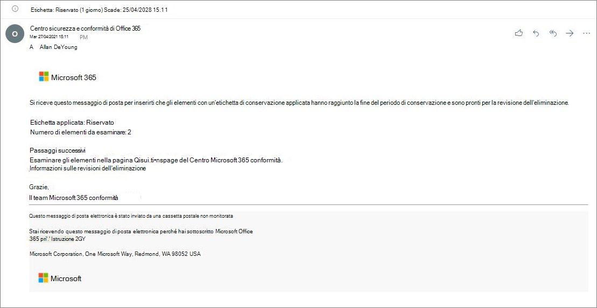

# <a name="disposition-of-content"></a><span data-ttu-id="71689-103">Eliminazione del contenuto</span><span class="sxs-lookup"><span data-stu-id="71689-103">Disposition of content</span></span>

><span data-ttu-id="71689-104">*[Indicazioni per l'assegnazione di licenze di Microsoft 365 per sicurezza e conformità](/office365/servicedescriptions/microsoft-365-service-descriptions/microsoft-365-tenantlevel-services-licensing-guidance/microsoft-365-security-compliance-licensing-guidance).*</span><span class="sxs-lookup"><span data-stu-id="71689-104">*[Microsoft 365 licensing guidance for security & compliance](/office365/servicedescriptions/microsoft-365-service-descriptions/microsoft-365-tenantlevel-services-licensing-guidance/microsoft-365-security-compliance-licensing-guidance).*</span></span>

<span data-ttu-id="71689-105">Utilizzare la pagina **Eliminazione** dalla **Gestione record** nel Centro conformità Microsoft 365 per gestire le revisioni per l'eliminazione e visualizzare i metadati dei [record](records-management.md#records) eliminati automaticamente al termine del periodo di conservazione.</span><span class="sxs-lookup"><span data-stu-id="71689-105">Use the **Disposition** page from **Records Management** in the Microsoft 365 compliance center to manage disposition reviews and view the metadata of [records](records-management.md#records) that have been automatically deleted at the end of their retention period.</span></span>

> [!NOTE]
> <span data-ttu-id="71689-106">In anteprima: **revisione eliminazione a più fasi**</span><span class="sxs-lookup"><span data-stu-id="71689-106">In preview: **multi-stage disposition review**</span></span>
> 
> <span data-ttu-id="71689-107">Un amministratore adesso può aggiungere fino a cinque fasi consecutive di revisione per l'eliminazione in un'etichetta di conservazione e i revisori possono aggiungere altri utenti alla fase di revisione per l'eliminazione.</span><span class="sxs-lookup"><span data-stu-id="71689-107">An administrator can now add up to five consecutive stages of disposition review in a retention label, and reviewers can add others users to their disposition review stage.</span></span> <span data-ttu-id="71689-108">È anche possibile personalizzare le notifiche e i promemoria tramite posta elettronica.</span><span class="sxs-lookup"><span data-stu-id="71689-108">You can also customize the email notifications and reminders.</span></span> <span data-ttu-id="71689-109">Le seguenti sezioni forniscono altre informazioni relative alle modifiche apportate in questa anteprima.</span><span class="sxs-lookup"><span data-stu-id="71689-109">The following sections have more information about the changes in this preview.</span></span>
>
> <span data-ttu-id="71689-110">Per leggere l'annuncio sulla versione, vedere il post del blog [Annuncio sull'eliminazione multi-stage nella Gestione record di Microsoft](https://techcommunity.microsoft.com/t5/security-compliance-and-identity/announcing-multi-stage-disposition-in-microsoft-records/ba-p/2361849).</span><span class="sxs-lookup"><span data-stu-id="71689-110">To read the release announcement, see the blog post [Announcing Multi-Stage Disposition in Microsoft Records Management](https://techcommunity.microsoft.com/t5/security-compliance-and-identity/announcing-multi-stage-disposition-in-microsoft-records/ba-p/2361849).</span></span>

## <a name="prerequisites-for-viewing-content-dispositions"></a><span data-ttu-id="71689-111">Prerequisiti per la visualizzazione delle eliminazioni di contenuto</span><span class="sxs-lookup"><span data-stu-id="71689-111">Prerequisites for viewing content dispositions</span></span>

<span data-ttu-id="71689-112">Per gestire le revisioni per l’eliminazione e verificare che i record siano stati eliminati, è necessario avere le autorizzazioni necessarie e che il controllo sia abilitato.</span><span class="sxs-lookup"><span data-stu-id="71689-112">To manage disposition reviews and confirm that records have been deleted, you must have sufficient permissions and auditing must be enabled.</span></span>

### <a name="permissions-for-disposition"></a><span data-ttu-id="71689-113">Autorizzazioni per l'eliminazione</span><span class="sxs-lookup"><span data-stu-id="71689-113">Permissions for disposition</span></span>

<span data-ttu-id="71689-114">Per accedere correttamente alla scheda **eliminazione** nel Centro conformità Microsoft 365, è necessario che gli utenti abbiano il ruolo di **gestione dell'eliminazione**.</span><span class="sxs-lookup"><span data-stu-id="71689-114">To successfully access the **Disposition** tab in the Microsoft 365 compliance center, users must have the **Disposition Management** role.</span></span> <span data-ttu-id="71689-115">Da dicembre 2020, questo ruolo è incluso nel gruppo dei ruoli predefiniti di **gestione dei record**.</span><span class="sxs-lookup"><span data-stu-id="71689-115">From December 2020, this role is now included in the **Records Management** default role group.</span></span>

> [!NOTE]
> <span data-ttu-id="71689-116">Per impostazione predefinita, un amministratore globale non può avere il ruolo di **gestione dell'eliminazione**.</span><span class="sxs-lookup"><span data-stu-id="71689-116">By default, a global admin isn't granted the **Disposition Management** role.</span></span> 

<span data-ttu-id="71689-117">Per concedere agli utenti solo le autorizzazioni necessarie per le revisioni per l'eliminazione senza concedere loro l'autorizzazione a visualizzare e configurare altre funzionalità per la conservazione e la gestione dei record, creare un gruppo di ruoli personalizzato (ad esempio, denominato "Revisori per l'eliminazione") e concedere a questo gruppo il ruolo di **gestione dell'eliminazione**.</span><span class="sxs-lookup"><span data-stu-id="71689-117">To grant users just the permissions they need for disposition reviews without granting them permissions to view and configure other features for retention and records management, create a custom role group (for example, named "Disposition Reviewers") and grant this group the **Disposition Management** role.</span></span>

<span data-ttu-id="71689-118">Per le istruzioni per configurare queste autorizzazioni, vedere [Fornire agli utenti l'accesso al Centro sicurezza e conformità di Office 365](../security/office-365-security/grant-access-to-the-security-and-compliance-center.md).</span><span class="sxs-lookup"><span data-stu-id="71689-118">For instructions to configure these permissions, see [Give users access to the Office 365 Security & Compliance Center](../security/office-365-security/grant-access-to-the-security-and-compliance-center.md).</span></span>

<span data-ttu-id="71689-119">Inoltre:</span><span class="sxs-lookup"><span data-stu-id="71689-119">Additionally:</span></span>

- <span data-ttu-id="71689-120">Per visualizzare il contenuto degli elementi durante il processo di eliminazione, aggiungere utenti al gruppo di ruoli **Visualizzatore contenuto di Esplora contenuto**.</span><span class="sxs-lookup"><span data-stu-id="71689-120">To view the contents of items during the disposition process, add users to the **Content Explorer Content Viewer** role group.</span></span> <span data-ttu-id="71689-121">Se gli utenti non hanno le autorizzazioni di questo gruppo di ruoli, possono comunque selezionare un'azione di revisione per l'eliminazione per completare l'operazione, ma devono farlo senza poter vedere il contenuto dell'elemento dal mini riquadro di anteprima nel centro conformità.</span><span class="sxs-lookup"><span data-stu-id="71689-121">If users don't have the permissions from this role group, they can still select a disposition review action to complete the disposition review, but must do so without being able to view the item's contents from the mini-preview pane in the compliance center.</span></span>

- <span data-ttu-id="71689-122">In anteprima: per impostazione predefinita, ogni utente che accede alla pagina **Eliminazione** vede solo i suoi elementi assegnati per la revisione.</span><span class="sxs-lookup"><span data-stu-id="71689-122">In preview: By default, each person that accesses the **Disposition** page sees only items that they are assigned to review.</span></span> <span data-ttu-id="71689-123">Per consentire a un amministratore della gestione dei record di visualizzare tutti gli elementi assegnati a tutti gli utenti e tutte le etichette di conservazione configurate per la revisione per l'eliminazione: passare a **Impostazioni di gestione dei record** > **Generale** > **Gruppo di sicurezza per la gestione record** per selezionare e abilitare un gruppo di sicurezza abilitato alla posta che contiene gli account amministratore.</span><span class="sxs-lookup"><span data-stu-id="71689-123">For a records management administrator to see all items assigned to all users, and all retention labels that are configured for disposition review: Navigate to **Records management settings** > **General** > **Security group for records manager** to select and then enable a mail-enabled security group that contains the administrator accounts.</span></span>
    
    <span data-ttu-id="71689-124">I gruppi di Microsoft 365 e i gruppi di sicurezza non abilitati alla posta elettronica non supportano questa funzionalità e non vengono visualizzati nell'elenco di selezione.</span><span class="sxs-lookup"><span data-stu-id="71689-124">Microsoft 365 groups and security groups that aren't mail-enabled doesn't support this feature and wouldn't be displayed in the list to select.</span></span> <span data-ttu-id="71689-125">Se è necessario creare un nuovo gruppo di sicurezza abilitato alla posta elettronica, utilizzare il collegamento all'interfaccia di amministrazione di Microsoft 365 per creare il nuovo gruppo.</span><span class="sxs-lookup"><span data-stu-id="71689-125">If you need to create a new mail-enabled security group, use the link to the Microsoft 365 admin center to create the new group.</span></span> 
    
    > [!IMPORTANT]
    > <span data-ttu-id="71689-126">Dopo aver abilitato il gruppo, non sarà più possibile modificarlo nel Centro conformità.</span><span class="sxs-lookup"><span data-stu-id="71689-126">After you have enabled the group, you can't change it in the compliance center.</span></span> <span data-ttu-id="71689-127">Vedere la sezione successiva per informazioni su come abilitare un gruppo diverso con PowerShell.</span><span class="sxs-lookup"><span data-stu-id="71689-127">See the next section for how to enable a different group by using PowerShell.</span></span>

- <span data-ttu-id="71689-128">Nell'anteprima: l'opzione di **Impostazioni di gestione dei record** è visibile solo agli amministratori della gestione dei record.</span><span class="sxs-lookup"><span data-stu-id="71689-128">In preview: The **Records management settings** option is visible only to record management administrators.</span></span> 

#### <a name="enabling-another-security-group-for-disposition"></a><span data-ttu-id="71689-129">Abilitazione di un altro gruppo di sicurezza per l'eliminazione</span><span class="sxs-lookup"><span data-stu-id="71689-129">Enabling another security group for disposition</span></span>

<span data-ttu-id="71689-130">Dopo aver abilitato un gruppo di sicurezza per l'eliminazione dalle **impostazioni di gestione dei record** nel Centro conformità Microsoft 365, non sarà possibile disabilitare questa autorizzazione per il gruppo o sostituire il gruppo selezionato nel Centro conformità.</span><span class="sxs-lookup"><span data-stu-id="71689-130">After you have enabled a security group for disposition from the **Records management settings** in the Microsoft 365 compliance center, you can't disable this permission for the group or replace the selected group in the compliance center.</span></span> <span data-ttu-id="71689-131">Tuttavia, è possibile abilitare un altro gruppo di sicurezza abilitato alla posta elettronica tramite il cmdlet [Enable-ComplianceTagStorage](/powershell/module/exchange/enable-compliancetagstorage).</span><span class="sxs-lookup"><span data-stu-id="71689-131">However, you can enable another mail-enabled security group by using the [Enable-ComplianceTagStorage](/powershell/module/exchange/enable-compliancetagstorage) cmdlet.</span></span>

<span data-ttu-id="71689-132">Ad esempio:</span><span class="sxs-lookup"><span data-stu-id="71689-132">For example:</span></span> 

```PowerShell
Enable-ComplianceTagStorage -RecordsManagementSecurityGroupEmail dispositionreviewers@contosoi.com
````

### <a name="enable-auditing"></a><span data-ttu-id="71689-133">Abilitazione del controllo</span><span class="sxs-lookup"><span data-stu-id="71689-133">Enable auditing</span></span>

<span data-ttu-id="71689-134">Verificare che il controllo sia abilitato almeno un giorno prima della prima azione di eliminazione.</span><span class="sxs-lookup"><span data-stu-id="71689-134">Make sure that auditing is enabled at least one day before the first disposition action.</span></span> <span data-ttu-id="71689-135">Per ulteriori informazioni, vedere [Eseguire una ricerca nel log di controllo nel &amp;Centro sicurezza e conformità di Office 365](search-the-audit-log-in-security-and-compliance.md).</span><span class="sxs-lookup"><span data-stu-id="71689-135">For more information, see [Search the audit log in the Office 365 Security &amp; Compliance Center](search-the-audit-log-in-security-and-compliance.md).</span></span> 

## <a name="disposition-reviews"></a><span data-ttu-id="71689-136">Revisioni per l'eliminazione</span><span class="sxs-lookup"><span data-stu-id="71689-136">Disposition reviews</span></span>

<span data-ttu-id="71689-p109">Quando un contenuto raggiunge la fine del periodo di conservazione, ci sono diversi motivi per cui si può scegliere di esaminare il contenuto prima di decidere se eliminarlo definitivamente ("eliminato"). Ad esempio, invece di eliminare il contenuto potrebbe essere necessario:</span><span class="sxs-lookup"><span data-stu-id="71689-p109">When content reaches the end of its retention period, there are several reasons why you might want to review that content and confirm whether it can be permanently deleted ("disposed"). For example, instead of deleting the content, you might need to:</span></span>
  
- <span data-ttu-id="71689-139">Sospendere l'eliminazione del contenuto pertinente di controversie legali o di un controllo.</span><span class="sxs-lookup"><span data-stu-id="71689-139">Suspend the deletion of relevant content for litigation or an audit.</span></span>

- <span data-ttu-id="71689-140">Assegnare un periodo di conservazione diverso al contenuto, perché ad esempio le impostazioni di conservazione originali erano una soluzione temporanea o provvisoria.</span><span class="sxs-lookup"><span data-stu-id="71689-140">Assign a different retention period to the content, perhaps because the original retention settings were a temporary or provisional solution.</span></span>

- <span data-ttu-id="71689-141">Spostare il contenuto dalla posizione esistente a una posizione di archiviazione, ad esempio se il contenuto ha un valore storico o di ricerca.</span><span class="sxs-lookup"><span data-stu-id="71689-141">Move the content from its existing location to an archive location, for example, if that content has research or historical value.</span></span>

<span data-ttu-id="71689-142">Quando viene attivata una revisione per l'eliminazione alla fine del periodo di conservazione:</span><span class="sxs-lookup"><span data-stu-id="71689-142">When a disposition review is triggered at the end of the retention period:</span></span>
  
- <span data-ttu-id="71689-143">I revisori ricevono una notifica di posta elettronica che indica che hanno dei contenuti da rivedere.</span><span class="sxs-lookup"><span data-stu-id="71689-143">The reviewers you choose receive an email notification that they have content to review.</span></span> <span data-ttu-id="71689-144">Questi revisori possono essere singoli utenti o gruppi di sicurezza abilitati alla posta elettronica.</span><span class="sxs-lookup"><span data-stu-id="71689-144">These reviewers can be individual users or mail-enabled security groups.</span></span> <span data-ttu-id="71689-145">Novità in anteprima:</span><span class="sxs-lookup"><span data-stu-id="71689-145">New in preview:</span></span>
   - <span data-ttu-id="71689-146">È possibile personalizzare il messaggio di posta elettronica che ricevono, includendo istruzioni in lingue diverse.</span><span class="sxs-lookup"><span data-stu-id="71689-146">You can customize the email that they receive, including instructions in different languages.</span></span> <span data-ttu-id="71689-147">Per il supporto di più lingue è necessario specificare manualmente le traduzioni, le quali verranno visualizzate da tutti i revisori indipendentemente dalle impostazioni locali.</span><span class="sxs-lookup"><span data-stu-id="71689-147">For multi-language support, you must specify the translations yourself and this custom text is displayed to all reviewers irrespective of their locale.</span></span>
   - <span data-ttu-id="71689-148">Gli utenti ricevono una notifica iniziale tramite posta elettronica per ogni etichetta alla fine del periodo di conservazione dell'elemento, con un promemoria per ogni etichetta una volta alla settimana per tutte le revisioni per l'eliminazione assegnate.</span><span class="sxs-lookup"><span data-stu-id="71689-148">Users receive an initial email notification per label at the end of the item's retention period, with a reminder per label once a week of all disposition reviews that they are assigned.</span></span> <span data-ttu-id="71689-149">Possono fare clic sul collegamento nei messaggi di posta elettronica di notifica e promemoria per passare alla pagina **Eliminazione** nel Centro conformità Microsoft 365 per revisionare il contenuto ed eventualmente intervenire.</span><span class="sxs-lookup"><span data-stu-id="71689-149">They can click the link in the notification and reminder emails to go to the **Disposition** page in the Microsoft 365 compliance center to review the content and take an action.</span></span> <span data-ttu-id="71689-150">In alternativa, i revisori possono andare direttamente alla pagina **Eliminazione** nel Centro conformità.</span><span class="sxs-lookup"><span data-stu-id="71689-150">Alternately, the reviewers can go directly to the **Disposition** page in the compliance center.</span></span>
   - <span data-ttu-id="71689-151">I revisori visualizzano solo le revisioni per l'eliminazione assegnate a loro, mentre gli amministratori aggiunti al Gruppo di sicurezza di gestione dei record selezionato visualizzano tutte le revisioni per l'eliminazione.</span><span class="sxs-lookup"><span data-stu-id="71689-151">Reviewers see only the disposition reviews that are assigned to them, whereas administrators who are added to the selected security group for records manager see all disposition reviews.</span></span>
   - <span data-ttu-id="71689-152">I revisori possono aggiungere nuovi utenti alla stessa revisione per l'eliminazione.</span><span class="sxs-lookup"><span data-stu-id="71689-152">Reviewers can add new users to the same disposition review.</span></span> <span data-ttu-id="71689-153">Attualmente questa azione non concede automaticamente a questi utenti aggiunti le [autorizzazioni necessarie](#permissions-for-disposition).</span><span class="sxs-lookup"><span data-stu-id="71689-153">Currently, this action doesn't automatically grant these added users the [required permissions](#permissions-for-disposition).</span></span>
   - <span data-ttu-id="71689-154">Per il processo di revisione per l'eliminazione, un mini riquadro di revisione per ogni elemento mostra un'anteprima del contenuto solo se gli utenti possiedono le autorizzazioni per vederlo.</span><span class="sxs-lookup"><span data-stu-id="71689-154">For the disposition review process, a mini-review pane for each item shows a preview of the content if they have permissions to see it.</span></span> <span data-ttu-id="71689-155">Se non hanno le autorizzazioni necessarie, possono selezionare il collegamento al contenuto e richiedere le autorizzazioni.</span><span class="sxs-lookup"><span data-stu-id="71689-155">If they don't have permissions, they can select the content link and request permissions.</span></span> <span data-ttu-id="71689-156">Questo mini riquadro di revisione contiene anche schede per informazioni aggiuntive sul contenuto:</span><span class="sxs-lookup"><span data-stu-id="71689-156">This mini-review pane also has tabs for additional information about the content:</span></span>
       - <span data-ttu-id="71689-157">**Dettagli** per visualizzare le proprietà indicizzate, la posizione, l'utente che l'ha creata e quando, chi ha apportato l'ultima modifica e quando.</span><span class="sxs-lookup"><span data-stu-id="71689-157">**Details** to display indexed properties, where it's located, who created it and when, and who last modified it and when.</span></span>
       - <span data-ttu-id="71689-158">**Cronologia** che mostra la cronologia di qualsiasi azione di revisione per l'eliminazione fino alla data corrente, con i commenti del revisore, se disponibili.</span><span class="sxs-lookup"><span data-stu-id="71689-158">**History** that shows the history of any disposition review actions to date, with reviewer comments if available.</span></span>

<span data-ttu-id="71689-159">Una revisione per l'eliminazione può includere il contenuto di cassette postali di Exchange, siti di SharePoint e account di OneDrive.</span><span class="sxs-lookup"><span data-stu-id="71689-159">A disposition review can include content in Exchange mailboxes, SharePoint sites, and OneDrive accounts.</span></span> <span data-ttu-id="71689-160">Il contenuto in sospeso di una revisione per l'eliminazione in tali posizioni viene eliminato definitivamente solo dopo che un revisore per la fase finale dell'eliminazione sceglie di eliminarlo definitivamente.</span><span class="sxs-lookup"><span data-stu-id="71689-160">Content pending a disposition review in those locations is permanently deleted only after a reviewer for the final stage of disposition chooses to permanently delete the content.</span></span>

> [!NOTE]
> <span data-ttu-id="71689-161">Una cassetta postale deve contenere almeno 10 MB di dati per supportare le revisioni per l'eliminazione.</span><span class="sxs-lookup"><span data-stu-id="71689-161">A mailbox must have at least 10 MB data to support disposition reviews.</span></span>

<span data-ttu-id="71689-162">Gli amministratori possono vedere una panoramica di tutte le eliminazioni in sospeso nella **Panoramica**. I revisori vedono solo le eliminazioni in sospeso relative ai propri elementi.</span><span class="sxs-lookup"><span data-stu-id="71689-162">Administrators can see an overview of all pending dispositions in the **Overview** tab. Reviewers see only their items pending disposition.</span></span> <span data-ttu-id="71689-163">Ad esempio:</span><span class="sxs-lookup"><span data-stu-id="71689-163">For example:</span></span>


<span data-ttu-id="71689-165">Quando si seleziona **Visualizza tutte le eliminazioni in sospeso**, viene visualizzata la pagina **eliminazione**.</span><span class="sxs-lookup"><span data-stu-id="71689-165">When you select the **View all pending dispositions**, you're taken to the **Disposition** page.</span></span> <span data-ttu-id="71689-166">Ad esempio:</span><span class="sxs-lookup"><span data-stu-id="71689-166">For example:</span></span>


### <a name="workflow-for-a-disposition-review"></a><span data-ttu-id="71689-168">Flusso di lavoro della revisione per l'eliminazione.</span><span class="sxs-lookup"><span data-stu-id="71689-168">Workflow for a disposition review</span></span>

<span data-ttu-id="71689-169">Il diagramma seguente illustra il flusso di lavoro di base di una revisione per l'eliminazione quando viene pubblicata una etichetta di conservazione e quindi applicata manualmente da un utente.</span><span class="sxs-lookup"><span data-stu-id="71689-169">The following diagram shows the basic workflow for a disposition review when a retention label is published and then manually applied by a user.</span></span> <span data-ttu-id="71689-170">In alternativa, un'etichetta di conservazione configurata per una revisione per l'eliminazione può essere applicata automaticamente al contenuto.</span><span class="sxs-lookup"><span data-stu-id="71689-170">Alternatively, a retention label configured for a disposition review can be automatically applied to content.</span></span>
  


### <a name="how-to-configure-a-retention-label-for-disposition-review"></a><span data-ttu-id="71689-172">Come configurare un'etichetta di conservazione per la revisione per l'eliminazione</span><span class="sxs-lookup"><span data-stu-id="71689-172">How to configure a retention label for disposition review</span></span>

<span data-ttu-id="71689-173">L'attivazione di una revisione per l'eliminazione alla fine del periodo di conservazione è un'opzione di configurazione disponibile solo con un'etichetta di conservazione.</span><span class="sxs-lookup"><span data-stu-id="71689-173">Triggering a disposition review at the end of the retention period is a configuration option that's available only with a retention label.</span></span> <span data-ttu-id="71689-174">La revisione per l'eliminazione non è disponibile per i criteri di conservazione.</span><span class="sxs-lookup"><span data-stu-id="71689-174">Disposition review is not available for a retention policy.</span></span> <span data-ttu-id="71689-175">Per saperne di più su queste due soluzioni di conservazione, vedere [Informazioni sui criteri e le etichette di conservazione](retention.md).</span><span class="sxs-lookup"><span data-stu-id="71689-175">For more information about these two retention solutions, see [Learn about retention policies and retention labels](retention.md).</span></span>

<span data-ttu-id="71689-176">Dalla pagina **Definisci le impostazioni di conservazione** per un'etichetta di conservazione:</span><span class="sxs-lookup"><span data-stu-id="71689-176">From the **Define retention settings** page for a retention label:</span></span>


 
<span data-ttu-id="71689-178">Dopo aver selezionato questa opzione **Attiva revisione per l'eliminazione**, nella pagina successiva della procedura guidata specificare il numero di fasi consecutive di eliminazione desiderate e i revisori per l'eliminazione per ogni fase:</span><span class="sxs-lookup"><span data-stu-id="71689-178">After you select this **Trigger a disposition review** option, on the next page of the wizard, you specify how many consecutive stages of disposition you want and the disposition reviewers for each stage:</span></span>

 

<span data-ttu-id="71689-180">Selezionare **Aggiungi una fase** e assegnare un nome alla fase a scopo di identificazione.</span><span class="sxs-lookup"><span data-stu-id="71689-180">Select **Add a stage**, and name your stage for identification purposes.</span></span> <span data-ttu-id="71689-181">Specificare quindi i revisori per quella determinata fase.</span><span class="sxs-lookup"><span data-stu-id="71689-181">Then specify the reviewers for that stage.</span></span>

<span data-ttu-id="71689-182">Per i revisori, specificare un utente o un gruppo di sicurezza abilitato alla posta elettronica.</span><span class="sxs-lookup"><span data-stu-id="71689-182">For the reviewers, specify a user or a mail-enabled security group.</span></span> <span data-ttu-id="71689-183">I gruppi di Microsoft 365 ([in precedenza gruppi di Office 365](https://techcommunity.microsoft.com/t5/microsoft-365-blog/office-365-groups-will-become-microsoft-365-groups/ba-p/1303601)) attualmente non sono supportati per questa opzione.</span><span class="sxs-lookup"><span data-stu-id="71689-183">Microsoft 365 groups ([formerly Office 365 groups](https://techcommunity.microsoft.com/t5/microsoft-365-blog/office-365-groups-will-become-microsoft-365-groups/ba-p/1303601)) are currently not supported for this option.</span></span>

<span data-ttu-id="71689-184">Se è necessario che più persone rivedano un elemento alla fine del periodo di conservazione, selezionare di nuovo **Aggiungi una fase** e ripetere il processo di configurazione per il numero di fasi necessario, con un massimo di cinque fasi.</span><span class="sxs-lookup"><span data-stu-id="71689-184">If you need more than one person to review an item at the end of its retention period, select **Add a stage** again and repeat the configuration process for the number of stages that you need, with a maximum of five stages.</span></span> 

<span data-ttu-id="71689-p122">All'interno di ogni singola fase di eliminazione, tutti gli utenti specificati per tale fase sono autorizzati a eseguire l'azione successiva per l'elemento alla fine del periodo di conservazione. Questi utenti possono anche aggiungere altri utenti alla propria fase di revisione per l'eliminazione.</span><span class="sxs-lookup"><span data-stu-id="71689-p122">Within each individual stage of disposition, any of the users you specify for that stage are authorized to take the next action for the item at the end of its retention period. These users can also add other users to their disposition review stage.</span></span>

> [!NOTE]
> <span data-ttu-id="71689-187">Le etichette di conservazione esistenti configurate per la revisione per l'eliminazione possono essere aggiornate per un utilizzo a più fasi della revisione per l'eliminazione configurando l'etichetta.</span><span class="sxs-lookup"><span data-stu-id="71689-187">Existing retention labels that are configured for disposition review can be upgraded to use multi-staged disposition review by configuring the label.</span></span> <span data-ttu-id="71689-188">Nella Creazione guidata Etichetta selezionare **Aggiungi fase** o modificare i revisori esistenti o aggiungerne di nuovi.</span><span class="sxs-lookup"><span data-stu-id="71689-188">In the label wizard, select **Add a stage**, or edit the existing reviewers or add new reviewers.</span></span>

<span data-ttu-id="71689-189">Durante la fase di configurazione, per ogni fase specificata è possibile rinominarla, riordinarla o rimuoverla selezionando l'opzione Azioni fase (**...**):</span><span class="sxs-lookup"><span data-stu-id="71689-189">During the configuration phase, for each stage specified, you can rename it, reorder it, or remove it by selecting the Stage actions option (**...**):</span></span> 


<span data-ttu-id="71689-191">Tuttavia, non è possibile riordinare o rimuovere una fase dopo aver creato l'etichetta di conservazione.</span><span class="sxs-lookup"><span data-stu-id="71689-191">However, you can't reorder or remove a stage after you have created the retention label.</span></span>

<span data-ttu-id="71689-192">Dopo aver specificato i revisori, ricordarsi di concedere l'autorizzazione ruolo di **gestione dell'eliminazione**.</span><span class="sxs-lookup"><span data-stu-id="71689-192">After you have specified your reviewers, remember to grant them the **Disposition Management** role permission.</span></span> <span data-ttu-id="71689-193">Per ulteriori informazioni, vedere la sezione [Autorizzazioni per l'eliminazione](#permissions-for-disposition) in questa pagina.</span><span class="sxs-lookup"><span data-stu-id="71689-193">For more information, see the [Permissions for disposition](#permissions-for-disposition) section on this page.</span></span>

### <a name="how-to-customize-email-messages-for-disposition-review"></a><span data-ttu-id="71689-194">Come personalizzare i messaggi di posta elettronica per la revisione per l'eliminazione</span><span class="sxs-lookup"><span data-stu-id="71689-194">How to customize email messages for disposition review</span></span>

<span data-ttu-id="71689-195">Esempio di notifica di posta elettronica predefinita inviata a un revisore:</span><span class="sxs-lookup"><span data-stu-id="71689-195">Example default email notification sent to a reviewer:</span></span>



<span data-ttu-id="71689-197">In anteprima, è possibile anche personalizzare i messaggi di posta elettronica inviati ai revisori per l'eliminazione per la notifica e i promemoria iniziali.</span><span class="sxs-lookup"><span data-stu-id="71689-197">Also in preview, you can customize the email messages that are sent to disposition reviewers for the initial notification and then reminders.</span></span>

<span data-ttu-id="71689-198">In una delle pagine Eliminazione nel Centro conformità selezionare le **impostazioni di gestione dei record**:</span><span class="sxs-lookup"><span data-stu-id="71689-198">From any of the Disposition pages in the compliance center, select **Records management settings**:</span></span>  


<span data-ttu-id="71689-200">Quindi selezionare la scheda **Notifiche di eliminazione** e specificare se si vuole usare solo il messaggio di posta elettronica predefinito oppure aggiungere un testo personalizzato a questo.</span><span class="sxs-lookup"><span data-stu-id="71689-200">Then select the **Disposition notifications** tab, and specify whether you want to use just the default email message, or add your own text to the default message.</span></span> <span data-ttu-id="71689-201">Il testo personalizzato viene aggiunto alle istruzioni di posta elettronica dopo le informazioni sull'etichetta di conservazione e prima delle istruzioni delle fasi successive.</span><span class="sxs-lookup"><span data-stu-id="71689-201">Your custom text is added to the email instructions after the information about the retention label and before the next steps instructions.</span></span>

<span data-ttu-id="71689-202">È possibile aggiungere un testo per tutte le lingue, ma la formattazione e le immagini non sono attualmente supportate.</span><span class="sxs-lookup"><span data-stu-id="71689-202">Text for all languages can be added, but formatting and images are currently unsupported.</span></span> <span data-ttu-id="71689-203">Gli URL e gli indirizzi di posta elettronica possono essere immessi come testo e, a seconda del client di posta elettronica, possono essere visualizzati come collegamenti ipertestuali o come testo non formattato nel messaggio di posta elettronica personalizzato.</span><span class="sxs-lookup"><span data-stu-id="71689-203">URLs and email addresses can be entered as text and depending on the email client, display as hyperlinks or unformatted text in the customized email.</span></span>

<span data-ttu-id="71689-204">Testo di esempio da aggiungere:</span><span class="sxs-lookup"><span data-stu-id="71689-204">Example text to add:</span></span>

```console
If you need additional information, visit the helpdesk website (https://support.contoso.com) or send them an email (helpdesk@contoso.com).
```

<span data-ttu-id="71689-205">Selezionare **Salva** per salvare eventuali modifiche.</span><span class="sxs-lookup"><span data-stu-id="71689-205">Select **Save** to save any changes.</span></span>

### <a name="viewing-and-disposing-of-content"></a><span data-ttu-id="71689-206">Visualizzazione ed eliminazione del contenuto</span><span class="sxs-lookup"><span data-stu-id="71689-206">Viewing and disposing of content</span></span>

<span data-ttu-id="71689-207">Quando un revisore viene informato tramite posta elettronica che il contenuto è pronto per essere rivisto, possono usare il collegamento nel messaggio di posta elettronica che li porta direttamente alla pagina **Eliminazione** da **Gestione record** nel Centro conformità Microsoft 365.</span><span class="sxs-lookup"><span data-stu-id="71689-207">When a reviewer is notified by email that content is ready to review, they can click a link in the email that takes them directly to the **Disposition** page from **Records management** in the Microsoft 365 compliance center.</span></span> <span data-ttu-id="71689-208">I revisori possono visualizzare quanti elementi per ogni etichetta di conservazione sono in attesa di eliminazione nella colonna **Tipo** che mostra **Eliminazione in sospeso**.</span><span class="sxs-lookup"><span data-stu-id="71689-208">There, the reviewers can see how many items for each retention label are waiting disposition with the **Type** displaying **Pending disposition**.</span></span> <span data-ttu-id="71689-209">Selezionano quindi un'etichetta di conservazione, poi **Apri in una nuova finestra** per visualizzare tutto il contenuto con quella etichetta:</span><span class="sxs-lookup"><span data-stu-id="71689-209">They then select a retention label, and **Open in new window** to see all content with that label:</span></span>


<span data-ttu-id="71689-211">Nella pagina **Eliminazioni in sospeso**, visualizzano tutte le eliminazioni in sospeso per quell'etichetta.</span><span class="sxs-lookup"><span data-stu-id="71689-211">From the **Pending dispositions** page, they see all pending dispositions for that label.</span></span> <span data-ttu-id="71689-212">Dopo aver selezionato uno o più elementi, possono usare il mini riquadro di anteprima e la scheda **Origine**, **Dettagli** e **Cronologia** per esaminare il contenuto prima di intervenire:</span><span class="sxs-lookup"><span data-stu-id="71689-212">When one or more items are selected, they can use the mini-preview pane and the **Source**, **Details**, and **History** tab to inspect the content before taking action on it:</span></span>


<span data-ttu-id="71689-214">Se si usa la barra di scorrimento orizzontale o si chiude il mini riquadro di revisione, vengono visualizzate altre etichette di colonna che includono la data di scadenza e il nome della fase di revisione per l'eliminazione.</span><span class="sxs-lookup"><span data-stu-id="71689-214">If you use the horizontal scroll bar, or close the min-review pane, you see more columns that include the expiry date and the name of the disposition review stage.</span></span>

<span data-ttu-id="71689-215">Come si può vedere dall'esempio, le azioni supportate sono:</span><span class="sxs-lookup"><span data-stu-id="71689-215">As you can see from the example shown, the actions supported are:</span></span> 
  
- <span data-ttu-id="71689-216">**Approvare la dismissione**:</span><span class="sxs-lookup"><span data-stu-id="71689-216">**Approve disposal**:</span></span>
    - <span data-ttu-id="71689-217">Quando questa azione è selezionata per una fase provvisoria di revisione per l'eliminazione (sono state configurate più fasi): l'elemento passa alla fase successiva di eliminazione.</span><span class="sxs-lookup"><span data-stu-id="71689-217">When this action is selected for an interim stage of disposition review (you have configured multiple stages): The item moves to the next disposition stage.</span></span>
    - <span data-ttu-id="71689-218">Quando questa azione viene selezionata per la fase finale della revisione per l'eliminazione o se la fase di eliminazione è una sola: l'elemento è contrassegnato come idoneo per l'eliminazione definitiva.</span><span class="sxs-lookup"><span data-stu-id="71689-218">When this action is selected for the final stage of disposition review, or there is only one stage of disposition: The item is marked as eligible for permanent deletion.</span></span> <span data-ttu-id="71689-219">L'intervallo esatto per tale eliminazione dipende dal carico di lavoro.</span><span class="sxs-lookup"><span data-stu-id="71689-219">The exact timing for that deletion depends on the workload.</span></span> <span data-ttu-id="71689-220">Per ulteriori informazioni, vedere [Funzionamento delle impostazioni di conservazione con i contenuti in locale](retention.md#how-retention-settings-work-with-content-in-place).</span><span class="sxs-lookup"><span data-stu-id="71689-220">For more information, see [How retention settings work with content in place](retention.md#how-retention-settings-work-with-content-in-place).</span></span>
- <span data-ttu-id="71689-221">**Riapplicare etichetta**:</span><span class="sxs-lookup"><span data-stu-id="71689-221">**Relabel**:</span></span>
    - <span data-ttu-id="71689-222">Quando questa azione è selezionata, l'elemento esce dal processo di revisione per l'eliminazione per l'etichetta originale.</span><span class="sxs-lookup"><span data-stu-id="71689-222">When this action is selected, the item exits the disposition review process for the original label.</span></span> <span data-ttu-id="71689-223">L'elemento è quindi soggetto alle impostazioni di conservazione dell'etichetta di conservazione appena selezionata.</span><span class="sxs-lookup"><span data-stu-id="71689-223">The item is then subject to the retention settings of the newly selected retention label.</span></span>
- <span data-ttu-id="71689-224">**Estendere**:</span><span class="sxs-lookup"><span data-stu-id="71689-224">**Extend**:</span></span>
    - <span data-ttu-id="71689-225">Quando questa azione è selezionata, la revisione per l'eliminazione viene sospesa fino alla fine del periodo esteso, quindi viene attivata di nuovo dalla prima fase.</span><span class="sxs-lookup"><span data-stu-id="71689-225">When this action is selected, disposition review is effectively suspended until the end of the extended period and then disposition review is triggered again from the first stage.</span></span>
- <span data-ttu-id="71689-226">**Aggiungere i revisori**:</span><span class="sxs-lookup"><span data-stu-id="71689-226">**Add reviewers**:</span></span>
    - <span data-ttu-id="71689-227">Quando questa azione è selezionata, all'utente viene chiesto di specificare e aggiungere altri utenti per la revisione.</span><span class="sxs-lookup"><span data-stu-id="71689-227">When this action is selected, the user is prompted to specify and add other users for review.</span></span>
    
    > [!NOTE]
    > <span data-ttu-id="71689-228">Attualmente questa azione non concede automaticamente le [autorizzazioni necessarie](#permissions-for-disposition) a questi utenti aggiunti.</span><span class="sxs-lookup"><span data-stu-id="71689-228">This action doesn't automatically grant the [required permissions](#permissions-for-disposition) to the users who are added.</span></span> <span data-ttu-id="71689-229">Se non possiedono queste autorizzazioni, non potranno partecipare alla revisione per l'eliminazione.</span><span class="sxs-lookup"><span data-stu-id="71689-229">If they don't have these permissions, they won't be able to participate in the disposition review.</span></span>

<span data-ttu-id="71689-230">Ogni azione eseguita viene salvata e archiviata, anche se non è ancora possibile cercarla nel log di audit.</span><span class="sxs-lookup"><span data-stu-id="71689-230">Each action taken is saved and stored although you can't yet search for them in the audit log.</span></span>

<span data-ttu-id="71689-231">Durante una revisione per l'eliminazione, il contenuto non si sposta mai dalla posizione originale e non viene contrassegnato per l'eliminazione definitiva finché l'azione non viene selezionata da un revisore per la fase di eliminazione o per quella finale.</span><span class="sxs-lookup"><span data-stu-id="71689-231">During a disposition review, the content never moves from its original location, and it's not marked for permanent deletion until this action is selected by a reviewer for the final or only disposition stage.</span></span>

## <a name="disposition-of-records"></a><span data-ttu-id="71689-232">Eliminazione dei record</span><span class="sxs-lookup"><span data-stu-id="71689-232">Disposition of records</span></span>

<span data-ttu-id="71689-233">Usare la scheda **Eliminazione** della pagina **Gestione record** per identificare:</span><span class="sxs-lookup"><span data-stu-id="71689-233">Use the **Disposition** tab from the **Records management** page to identify:</span></span>

- <span data-ttu-id="71689-234">Elementi eliminati in seguito a una revisione per l'eliminazione.</span><span class="sxs-lookup"><span data-stu-id="71689-234">Items deleted as a result of a disposition review.</span></span>
- <span data-ttu-id="71689-235">Elementi contrassegnati come record o record normativi che sono stati automaticamente eliminati alla fine del periodo di conservazione.</span><span class="sxs-lookup"><span data-stu-id="71689-235">Items marked as a record or regulatory record that were automatically deleted at the end of their retention period.</span></span>

<span data-ttu-id="71689-236">Questi elementi visualizzano i **record eliminati** nella colonna **Tipo**.</span><span class="sxs-lookup"><span data-stu-id="71689-236">These items display **Records Disposed** in the **Type** column.</span></span> <span data-ttu-id="71689-237">Ad esempio:</span><span class="sxs-lookup"><span data-stu-id="71689-237">For example:</span></span>


<span data-ttu-id="71689-239">Gli elementi visualizzati nella scheda **Elementi eliminati** vengono conservati per un massimo di sette anni dalla data di eliminazione dell'elemento, con un limite di 1 milione di elementi per ogni record per quel periodo.</span><span class="sxs-lookup"><span data-stu-id="71689-239">Items that are shown in the **Disposed Items** tab are kept for up to seven years after the item was disposed, with a limit of one million items per record for that period.</span></span> <span data-ttu-id="71689-240">Se la cifra di **Conteggio** visualizzata si avvicina al limite di 1 milione e occorre prova di eliminazione dei record, contattare il [supporto tecnico Microsoft](../business-video/get-help-support.md).</span><span class="sxs-lookup"><span data-stu-id="71689-240">If you see the **Count** number nearing this limit of one million, and you need proof of disposition for your records, contact [Microsoft Support](../business-video/get-help-support.md).</span></span>

> [!NOTE]
> <span data-ttu-id="71689-241">Questa funzionalità usa le informazioni provenienti dal [Log di controllo unificato](search-the-audit-log-in-security-and-compliance.md) e, di conseguenza, è necessario che il controllo sia [abilitato e con ricerca consentita](turn-audit-log-search-on-or-off.md) in modo da acquisire gli eventi corrispondenti.</span><span class="sxs-lookup"><span data-stu-id="71689-241">This functionality uses information from the [unified audit log](search-the-audit-log-in-security-and-compliance.md) and therefore requires auditing to be [enabled and searchable](turn-audit-log-search-on-or-off.md) so the corresponding events are captured.</span></span>

<span data-ttu-id="71689-242">Per il controllo degli elementi eliminati contrassegnati come record o come record normativi, cercare **File eliminato contrassegnato come record** nella categoria **Attività su file e pagine**.</span><span class="sxs-lookup"><span data-stu-id="71689-242">For auditing of deleted items that were marked as records or regulatory records, search for **Deleted file marked as a record** in the **File and page activities** category.</span></span> <span data-ttu-id="71689-243">Questo evento di controllo è applicabile ai documenti e ai messaggi di posta elettronica.</span><span class="sxs-lookup"><span data-stu-id="71689-243">This audit event is applicable to documents and emails.</span></span>

## <a name="filter-and-export-the-views"></a><span data-ttu-id="71689-244">Filtrare ed esportare le visualizzazioni</span><span class="sxs-lookup"><span data-stu-id="71689-244">Filter and export the views</span></span>

<span data-ttu-id="71689-245">Se si seleziona un'etichetta di conservazione dalla pagina **eliminazione**, la scheda **eliminazione in sospeso**(se applicabile) e la scheda **elementi eliminati** consentono di filtrare le visualizzazioni per trovare più facilmente gli elementi.</span><span class="sxs-lookup"><span data-stu-id="71689-245">When you select a retention label from the **Disposition** page, the **Pending disposition** tab (if applicable) and the **Disposed items** tab let you filter the views to help you more easily find items.</span></span>

<span data-ttu-id="71689-246">Per le eliminazioni in sospeso, l'intervallo di tempo si basa sulla data di scadenza.</span><span class="sxs-lookup"><span data-stu-id="71689-246">For pending dispositions, the time range is based on the expiration date.</span></span> <span data-ttu-id="71689-247">Per gli elementi eliminati, l'intervallo di tempo si basa sulla data di eliminazione.</span><span class="sxs-lookup"><span data-stu-id="71689-247">For disposed items, the time range is based on the deletion date.</span></span>
  
<span data-ttu-id="71689-248">Per entrambe le visualizzazioni è possibile esportare le informazioni sugli elementi come file .csv, che si può poi ordinare e gestire con Excel.</span><span class="sxs-lookup"><span data-stu-id="71689-248">You can export information about the items in either view as a .csv file that you can then sort and manage using Excel.</span></span>
