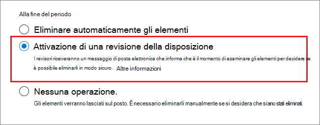
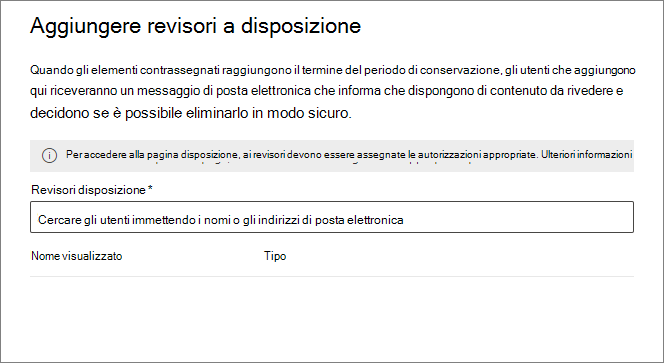
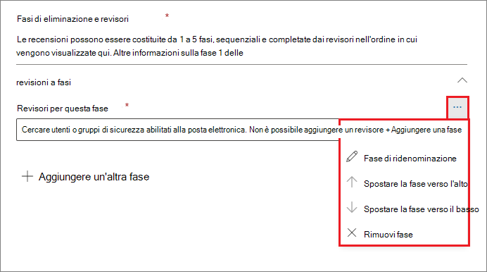
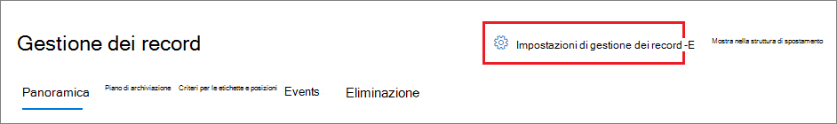
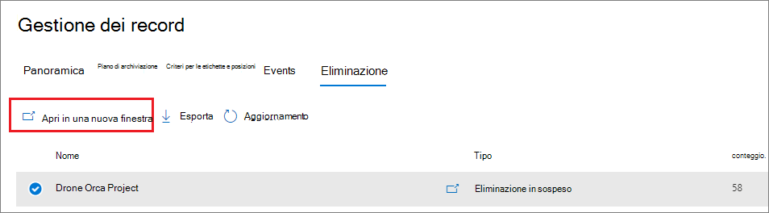

# <a name="disposition-of-content"></a>Eliminazione del contenuto

>*[Indicazioni per l'assegnazione di licenze di Microsoft 365 per sicurezza e conformità](/office365/servicedescriptions/microsoft-365-service-descriptions/microsoft-365-tenantlevel-services-licensing-guidance/microsoft-365-security-compliance-licensing-guidance).*

Utilizzare la pagina **Eliminazione** dalla **Gestione record** nel Centro conformità Microsoft 365 per gestire le revisioni per l'eliminazione e visualizzare i metadati dei [record](records-management.md#records) eliminati automaticamente al termine del periodo di conservazione.

> [!NOTE]
> Implementare in anteprima: **revisione per l'eliminazione a più fasi**
> 
> Un amministratore adesso può aggiungere fino a cinque fasi consecutive di revisione per l'eliminazione in un'etichetta di conservazione e i revisori possono aggiungere altri utenti alla fase di revisione per l'eliminazione. È anche possibile personalizzare le notifiche e i promemoria tramite posta elettronica. Le seguenti sezioni forniscono altre informazioni relative alle modifiche apportate in questa anteprima.

## <a name="prerequisites-for-viewing-content-dispositions"></a>Prerequisiti per la visualizzazione delle eliminazioni di contenuto

Per gestire le revisioni per l’eliminazione e verificare che i record siano stati eliminati, è necessario avere le autorizzazioni necessarie e che il controllo sia abilitato.

### <a name="permissions-for-disposition"></a>Autorizzazioni per l'eliminazione

Per accedere correttamente alla scheda **eliminazione** nel Centro conformità Microsoft 365, è necessario che gli utenti abbiano il ruolo di **gestione dell'eliminazione**. Da dicembre 2020, questo ruolo è incluso nel gruppo dei ruoli predefiniti di **gestione dei record**.

> [!NOTE]
> Per impostazione predefinita, un amministratore globale non può avere il ruolo di **gestione dell'eliminazione**. 

Per concedere agli utenti solo le autorizzazioni necessarie per le revisioni per l'eliminazione senza concedere loro l'autorizzazione a visualizzare e configurare altre funzionalità per la conservazione e la gestione dei record, creare un gruppo di ruoli personalizzato (ad esempio, denominato "Revisori per l'eliminazione") e concedere a questo gruppo il ruolo di **gestione dell'eliminazione**.

Per le istruzioni per configurare queste autorizzazioni, vedere [Fornire agli utenti l'accesso al Centro sicurezza e conformità di Office 365](../security/office-365-security/grant-access-to-the-security-and-compliance-center.md).

Inoltre:

- Per visualizzare il contenuto degli elementi durante il processo di eliminazione, aggiungere utenti al gruppo di ruoli **Visualizzatore contenuto di Esplora contenuto**. Se gli utenti non hanno le autorizzazioni di questo gruppo di ruoli, possono comunque selezionare un'azione di revisione per l'eliminazione per completare l'operazione, ma devono farlo senza poter vedere il contenuto dell'elemento dal mini riquadro di anteprima nel centro conformità.

- In anteprima: per impostazione predefinita, ogni utente che accede alla pagina **Eliminazione** vede solo i suoi elementi assegnati per la revisione. Per consentire a un amministratore della gestione dei record di visualizzare tutti gli elementi assegnati a tutti gli utenti e tutte le etichette di conservazione configurate per la revisione per l'eliminazione: spostarsi su **Impostazioni di gestione dei record** > **Generale** > **Gruppo di sicurezza di manager record** per selezionare e abilitare un gruppo di sicurezza abilitato alla posta elettronica contenente gli account dell'amministratore.
    
    I gruppi di Microsoft 365 e i gruppi di sicurezza non abilitati alla posta elettronica non supportano questa funzionalità e non vengono visualizzati nell'elenco di selezione. Se è necessario creare un nuovo gruppo di sicurezza abilitato alla posta elettronica, utilizzare il collegamento all'interfaccia di amministrazione di Microsoft 365 per creare il nuovo gruppo. 
    
    > [!IMPORTANT]
    > Non è possibile disabilitare questa autorizzazione o sostituire il gruppo abilitato dal Centro conformità. Tuttavia, è possibile abilitare un altro gruppo di sicurezza abilitato alla posta elettronica usando il cmdlet [Enable-ComplianceTagStorage](/powershell/module/exchange/enable-compliancetagstorage).
    > 
    > Ad esempio: `Enable-ComplianceTagStorage -RecordsManagementSecurityGroupEmail dispositionreviewers@contosoi.com`

- Nell'anteprima: l'opzione di **Impostazioni di gestione dei record** è visibile solo agli amministratori della gestione dei record. 

### <a name="enable-auditing"></a>Abilitazione del controllo

Verificare che il controllo sia abilitato almeno un giorno prima della prima azione di eliminazione. Per ulteriori informazioni, vedere [Eseguire una ricerca nel log di controllo nel &amp;Centro sicurezza e conformità di Office 365](search-the-audit-log-in-security-and-compliance.md). 

## <a name="disposition-reviews"></a>Revisioni per l'eliminazione

Quando un contenuto raggiunge la fine del periodo di conservazione, ci sono diversi motivi per cui si può scegliere di esaminare il contenuto prima di decidere se eliminarlo definitivamente ("eliminato"). Ad esempio, invece di eliminare il contenuto potrebbe essere necessario:
  
- Sospendere l'eliminazione del contenuto pertinente di controversie legali o di un controllo.

- Assegnare un periodo di conservazione diverso al contenuto, perché ad esempio le impostazioni di conservazione originali erano una soluzione temporanea o provvisoria.

- Spostare il contenuto dalla posizione esistente a una posizione di archiviazione, ad esempio se il contenuto ha un valore storico o di ricerca.

Quando viene attivata una revisione per l'eliminazione alla fine del periodo di conservazione:
  
- I revisori ricevono una notifica di posta elettronica che indica che hanno dei contenuti da rivedere. Questi revisori possono essere singoli utenti o gruppi di sicurezza abilitati alla posta elettronica. Novità in anteprima:
   - È possibile personalizzare il messaggio di posta elettronica che ricevono, includendo istruzioni in lingue diverse. Per il supporto di più lingue è necessario specificare manualmente le traduzioni, le quali verranno visualizzate da tutti i revisori indipendentemente dalle impostazioni locali.
   - Gli utenti ricevono una notifica iniziale tramite posta elettronica per ogni etichetta alla fine del periodo di conservazione dell'elemento, con un promemoria per ogni etichetta una volta alla settimana per tutte le revisioni per l'eliminazione assegnate. Possono fare clic sul collegamento nei messaggi di posta elettronica di notifica e promemoria per passare alla pagina **Eliminazione** nel Centro conformità Microsoft 365 per revisionare il contenuto ed eventualmente intervenire. In alternativa, i revisori possono andare direttamente alla pagina **Eliminazione** nel Centro conformità.
   - I revisori visualizzano solo le revisioni per l'eliminazione assegnate a loro, mentre gli amministratori aggiunti al Gruppo di sicurezza di gestione dei record selezionato visualizzano tutte le revisioni per l'eliminazione.
   - I revisori possono aggiungere nuovi utenti alla stessa revisione per l'eliminazione. Attualmente questa azione non concede automaticamente a questi utenti aggiunti le [autorizzazioni necessarie](#permissions-for-disposition).
   - Per il processo di revisione per l'eliminazione, un mini riquadro di revisione per ogni elemento mostra un'anteprima del contenuto solo se gli utenti possiedono le autorizzazioni per vederlo. Se non hanno le autorizzazioni necessarie, possono selezionare il collegamento al contenuto e richiedere le autorizzazioni. Questo mini riquadro di revisione contiene anche schede per informazioni aggiuntive sul contenuto:
       - **Dettagli** per visualizzare le proprietà indicizzate, la posizione, l'utente che l'ha creata e quando, chi ha apportato l'ultima modifica e quando.
       - **Cronologia** che mostra la cronologia di qualsiasi azione di revisione per l'eliminazione fino alla data corrente, con i commenti del revisore, se disponibili.

Una revisione per l'eliminazione può includere il contenuto di cassette postali di Exchange, siti di SharePoint e account di OneDrive. Il contenuto in sospeso di una revisione per l'eliminazione in tali posizioni viene eliminato definitivamente solo dopo che un revisore per la fase finale dell'eliminazione sceglie di eliminarlo definitivamente.

> [!NOTE]
> Una cassetta postale deve contenere almeno 10 MB di dati per supportare le revisioni per l'eliminazione.

Gli amministratori possono vedere una panoramica di tutte le eliminazioni in sospeso nella **Panoramica**. I revisori vedono solo le eliminazioni in sospeso relative ai propri elementi. Ad esempio:


Quando si seleziona **Visualizza tutte le eliminazioni in sospeso**, viene visualizzata la pagina **eliminazione**. Ad esempio:


### <a name="workflow-for-a-disposition-review"></a>Flusso di lavoro della revisione per l'eliminazione.

Il diagramma seguente illustra il flusso di lavoro di base di una revisione per l'eliminazione quando viene pubblicata una etichetta di conservazione e quindi applicata manualmente da un utente. In alternativa, un'etichetta di conservazione configurata per una revisione per l'eliminazione può essere applicata automaticamente al contenuto.
  


### <a name="how-to-configure-a-retention-label-for-disposition-review"></a>Come configurare un'etichetta di conservazione per la revisione per l'eliminazione

L'attivazione di una revisione per l'eliminazione alla fine del periodo di conservazione è un'opzione di configurazione disponibile solo con un'etichetta di conservazione. La revisione per l'eliminazione non è disponibile per i criteri di conservazione. Per saperne di più su queste due soluzioni di conservazione, vedere [Informazioni sui criteri e le etichette di conservazione](retention.md).

Dalla pagina **Definisci le impostazioni di conservazione** per un'etichetta di conservazione:


 
Dopo aver selezionato questa opzione **Attiva revisione per l'eliminazione**, nella pagina successiva della procedura guidata specificare il numero di fasi consecutive di eliminazione desiderate e i revisori per l'eliminazione per ogni fase:

 

Selezionare **Aggiungi una fase** e assegnare un nome alla fase a scopo di identificazione. Specificare quindi i revisori per quella determinata fase.

Per i revisori, specificare un utente o un gruppo di sicurezza abilitato alla posta elettronica. I gruppi di Microsoft 365 ([in precedenza gruppi di Office 365](https://techcommunity.microsoft.com/t5/microsoft-365-blog/office-365-groups-will-become-microsoft-365-groups/ba-p/1303601)) attualmente non sono supportati per questa opzione.

Se è necessario che più persone rivedano un elemento alla fine del periodo di conservazione, selezionare di nuovo **Aggiungi una fase** e ripetere il processo di configurazione per il numero di fasi necessario, con un massimo di cinque fasi. 

All'interno di ogni singola fase di eliminazione, tutti gli utenti specificati per tale fase sono autorizzati a eseguire l'azione successiva per l'elemento alla fine del periodo di conservazione. Questi utenti possono anche aggiungere altri utenti alla propria fase di revisione per l'eliminazione.

> [!NOTE]
> Le etichette di conservazione esistenti configurate per la revisione per l'eliminazione possono essere aggiornate per un utilizzo a più fasi della revisione per l'eliminazione configurando l'etichetta. Nella Creazione guidata Etichetta selezionare **Aggiungi fase** o modificare i revisori esistenti o aggiungerne di nuovi.

Durante la fase di configurazione, per ogni fase specificata è possibile rinominarla, riordinarla o rimuoverla selezionando l'opzione Azioni fase (**...**): 



Tuttavia, non è possibile riordinare o rimuovere una fase dopo aver creato l'etichetta di conservazione.

Dopo aver specificato i revisori, ricordarsi di concedere l'autorizzazione ruolo di **gestione dell'eliminazione**. Per ulteriori informazioni, vedere la sezione [Autorizzazioni per l'eliminazione](#permissions-for-disposition) in questa pagina.

### <a name="how-to-customize-email-messages-for-disposition-review"></a>Come personalizzare i messaggi di posta elettronica per la revisione per l'eliminazione

In anteprima, è possibile anche personalizzare i messaggi di posta elettronica inviati ai revisori per l'eliminazione per la notifica e i promemoria iniziali.

In una delle pagine Eliminazione nel Centro conformità selezionare le **Impostazioni di gestione dei record**:  



Quindi selezionare la scheda **Modelli di messaggi di posta** e specificare se si vogliono usare solo i modelli di posta elettronica predefiniti oppure se aggiungere un testo personalizzato al modello predefinito. Il testo personalizzato viene aggiunto alle istruzioni di posta elettronica dopo le informazioni sull'etichetta di conservazione e prima delle istruzioni delle fasi successive.

È possibile aggiungere un testo per tutte le lingue, ma la formattazione e le immagini non sono attualmente supportate. Gli URL e gli indirizzi di posta elettronica possono essere immessi come testo e, a seconda del client di posta elettronica, possono essere visualizzati come collegamenti ipertestuali o come testo non formattato nel messaggio di posta elettronica personalizzato.

Testo di esempio da accodare:

```console
If you need additional information, visit the helpdesk website (https://support.contoso.com) or send them an email (helpdesk@contoso.com).
```

Selezionare **Salva** per salvare eventuali modifiche.

### <a name="viewing-and-disposing-of-content"></a>Visualizzazione ed eliminazione del contenuto

Quando riceve una notifica tramite posta elettronica che informa che il contenuto è pronto per la revisione, il revisore può accedere alla scheda **eliminazione** dalla **gestione dei record** nel Centro conformità Microsoft 365. I revisori possono vedere quanti elementi per ogni etichetta di conservazione sono in attesa di eliminazione tramite la visualizzazione del **carattere** che indica **Eliminazione in sospeso**. Selezionano quindi un'etichetta di conservazione, poi **Apri in una nuova finestra** per visualizzare tutto il contenuto con quella etichetta:



Nella pagina **Eliminazioni in sospeso**, visualizzano tutte le eliminazioni in sospeso per quell'etichetta. Dopo aver selezionato uno o più elementi, possono usare il mini riquadro di anteprima e la scheda **Origine**, **Dettagli** e **Cronologia** per esaminare il contenuto prima di intervenire:


Se si usa la barra di scorrimento orizzontale o si chiude il mini riquadro di revisione, vengono visualizzate altre etichette di colonna che includono la data di scadenza e il nome della fase di revisione per l'eliminazione.

Come si può vedere dall'esempio, le azioni supportate sono: 
  
- **Approvare la dismissione**:
    - Quando questa azione è selezionata per una fase provvisoria di revisione per l'eliminazione (sono state configurate più fasi): l'elemento passa alla fase successiva di eliminazione.
    - Quando questa azione viene selezionata per la fase finale della revisione per l'eliminazione o se la fase di eliminazione è una sola: l'elemento è contrassegnato come idoneo per l'eliminazione definitiva. L'intervallo esatto per tale eliminazione dipende dal carico di lavoro. Per ulteriori informazioni, vedere [Funzionamento delle impostazioni di conservazione con i contenuti in locale](retention.md#how-retention-settings-work-with-content-in-place).
- **Riapplicare etichetta**:
    - Quando questa azione è selezionata, l'elemento esce dal processo di revisione per l'eliminazione per l'etichetta originale. L'elemento è quindi soggetto alle impostazioni di conservazione dell'etichetta di conservazione appena selezionata.
- **Estendere**:
    - Quando questa azione è selezionata, la revisione per l'eliminazione viene sospesa fino alla fine del periodo esteso, quindi viene attivata di nuovo dalla prima fase.
- **Aggiungere i revisori**:
    - Quando questa azione è selezionata, all'utente viene chiesto di specificare e aggiungere altri utenti per la revisione.
    
    > [!NOTE]
    > Attualmente questa azione non concede automaticamente le [autorizzazioni necessarie](#permissions-for-disposition) a questi utenti aggiunti. Se non possiedono queste autorizzazioni, non potranno partecipare alla revisione per l'eliminazione.

Ogni azione eseguita viene salvata e archiviata, anche se non è ancora possibile cercarla nel log di audit.

Durante una revisione per l'eliminazione, il contenuto non si sposta mai dalla posizione originale e non viene contrassegnato per l'eliminazione definitiva finché l'azione non viene selezionata da un revisore per la fase di eliminazione o per quella finale.

## <a name="disposition-of-records"></a>Eliminazione dei record

Usare la scheda **Eliminazione** della pagina **Gestione record** per identificare:

- Elementi eliminati in seguito a una revisione per l'eliminazione.
- Elementi contrassegnati come record o record normativi che sono stati automaticamente eliminati alla fine del periodo di conservazione.

Questi elementi visualizzano i **record eliminati** nella colonna **Tipo**. Ad esempio:


Gli elementi visualizzati nella scheda **Elementi eliminati** vengono conservati per un massimo di sette anni dalla data di eliminazione dell'elemento, con un limite di 1 milione di elementi per ogni record per quel periodo. Se la cifra di **Conteggio** visualizzata si avvicina al limite di 1 milione e occorre prova di eliminazione dei record, contattare il [supporto tecnico Microsoft](../business-video/get-help-support.md).

> [!NOTE]
> Questa funzionalità usa le informazioni provenienti dal [Log di controllo unificato](search-the-audit-log-in-security-and-compliance.md) e, di conseguenza, è necessario che il controllo sia [abilitato e con ricerca consentita](turn-audit-log-search-on-or-off.md) in modo da acquisire gli eventi corrispondenti.

Per il controllo degli elementi eliminati contrassegnati come record o come record normativi, cercare **File eliminato contrassegnato come record** nella categoria **Attività su file e pagine**. Questo evento di controllo è applicabile ai documenti e ai messaggi di posta elettronica.

## <a name="filter-and-export-the-views"></a>Filtrare ed esportare le visualizzazioni

Se si seleziona un'etichetta di conservazione dalla pagina **eliminazione**, la scheda **eliminazione in sospeso**(se applicabile) e la scheda **elementi eliminati** consentono di filtrare le visualizzazioni per trovare più facilmente gli elementi.

Per le eliminazioni in sospeso, l'intervallo di tempo si basa sulla data di scadenza. Per gli elementi eliminati, l'intervallo di tempo si basa sulla data di eliminazione.
  
Per entrambe le visualizzazioni è possibile esportare le informazioni sugli elementi come file .csv, che si può poi ordinare e gestire con Excel.
