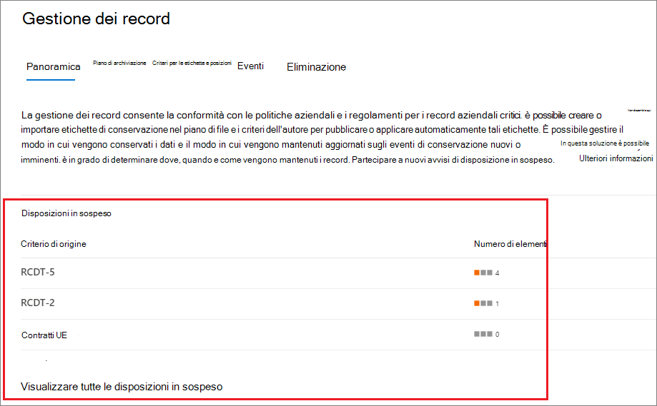
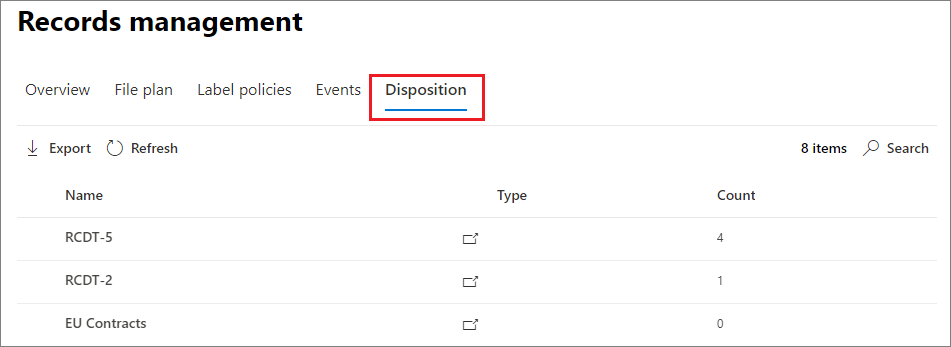
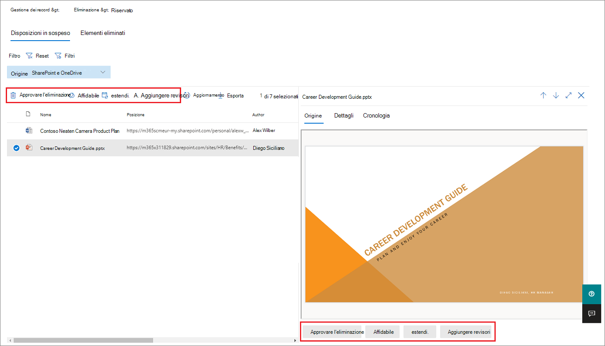
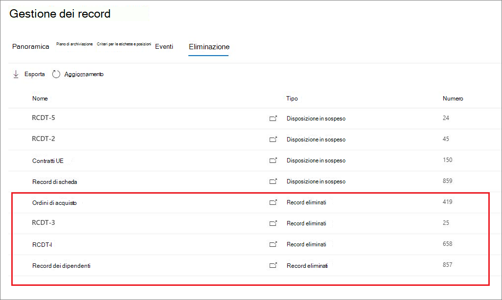
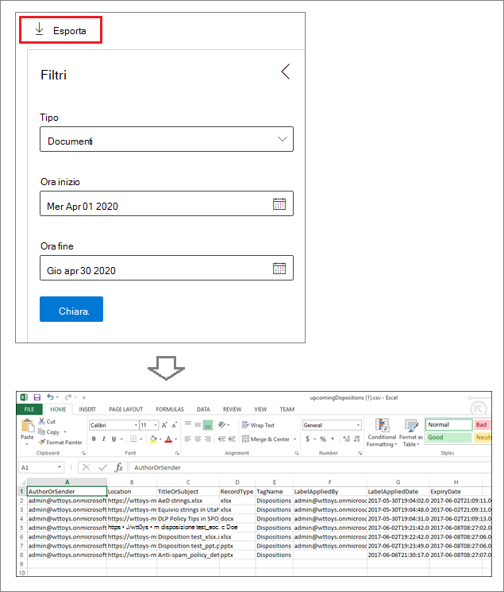

# Disposizione del contenutoDisposition of content

>*[Indicazioni per l'assegnazione di licenze di Microsoft 365 per sicurezza e conformità](https://aka.ms/ComplianceSD).**[Microsoft 365 licensing guidance for security & compliance](https://aka.ms/ComplianceSD).*

Utilizzare la scheda **disposizione** dalla **gestione dei record** nel centro conformità di Microsoft 365 per gestire le revisioni di disposizione e visualizzare i [record](records.md) eliminati automaticamente alla fine del periodo di conservazione.Use the **Disposition** tab from **Records Management** in the Microsoft 365 compliance center to manage disposition reviews and view [records](records.md) that have been automatically deleted at the end of their retention period. 

## Prerequisiti per la visualizzazione di disposizioni di contenutoPrerequisites for viewing content dispositions

Per gestire le recensioni sulla disposizione e verificare che i record siano stati eliminati, è necessario disporre di autorizzazioni e controllo sufficienti.To manage disposition reviews and confirm that records have been deleted, you must have sufficient permissions and auditing must be enabled.

### Autorizzazioni per la disposizionePermissions for disposition

Per accedere correttamente alla scheda **disposizione** nel centro conformità di Microsoft 365, è necessario essere membri del ruolo **gestione disposizione** e del ruolo di **controllo di sola visualizzazione** .To successfully access the **Disposition** tab in the Microsoft 365 compliance center, you must be members of the **Disposition Management** role and the **View-Only Audit Logs** role. È consigliabile creare un nuovo gruppo di ruoli denominato **reviewers Disposition**e aggiungere questi due ruoli a quel gruppo di ruoli.We recommend creating a new role group called **Disposition Reviewers**, and add these two roles to that role group. 

Specifica del ruolo di **controllo di sola visualizzazione** :Specific to the **View-Only Audit Logs** role:

- Poiché il cmdlet sottostante utilizzato per eseguire la ricerca nel log di controllo è un cmdlet di Exchange Online, è necessario assegnare agli utenti questo ruolo utilizzando l'interfaccia di [amministrazione di Exchange in Exchange Online](https://docs.microsoft.com/Exchange/exchange-admin-center), anziché utilizzando la pagina **autorizzazioni** nel centro sicurezza & conformità.Because the underlying cmdlet used to search the audit log is an Exchange Online cmdlet, you must assign users this role by using the [Exchange admin center in Exchange Online](https://docs.microsoft.com/Exchange/exchange-admin-center), rather than by using the **Permissions** page in the Security & Compliance Center. Per istruzioni, vedere [gestire i gruppi di ruoli in Exchange Online](https://docs.microsoft.com/Exchange/permissions-exo/role-groups).For instructions, see [Manage role groups in Exchange Online](https://docs.microsoft.com/Exchange/permissions-exo/role-groups).

- I gruppi Microsoft 365 (in[precedenza gruppi di Office 365](https://techcommunity.microsoft.com/t5/microsoft-365-blog/office-365-groups-will-become-microsoft-365-groups/ba-p/1303601)) non sono supportati per questo ruolo.Microsoft 365 Groups ([formerly Office 365 Groups](https://techcommunity.microsoft.com/t5/microsoft-365-blog/office-365-groups-will-become-microsoft-365-groups/ba-p/1303601)) aren't supported for this role. Assegnare invece le cassette postali utente, gli utenti di posta elettronica o i gruppi di sicurezza abilitati alla posta elettronica.Instead, assign user mailboxes, mail users, or mail-enabled security groups.

Per istruzioni su come concedere agli utenti il ruolo di **gestione della disposizione** e creare il nuovo ruolo **revisori disposizione** , vedere [fornire agli utenti l' &amp; accesso al centro sicurezza e conformità di Office 365](../security/office-365-security/grant-access-to-the-security-and-compliance-center.md).For instructions to grant users the **Disposition Management** role and create your new **Disposition Reviewers** role, see [Give users access to the Office 365 Security &amp; Compliance Center](../security/office-365-security/grant-access-to-the-security-and-compliance-center.md).

### Abilitazione del controlloEnable auditing

Verificare che il controllo sia abilitato almeno un giorno prima della prima azione di eliminazione.Make sure that auditing is enabled at least one day before the first disposition action. Per ulteriori informazioni, vedere [eseguire la ricerca nel log di controllo nel centro &amp; sicurezza e conformità di Office 365](search-the-audit-log-in-security-and-compliance.md).For more information, see [Search the audit log in the Office 365 Security &amp; Compliance Center](search-the-audit-log-in-security-and-compliance.md). 

## Revisioni per l'eliminazioneDisposition reviews

Quando il contenuto raggiunge la fine del periodo di conservazione, è possibile che si desideri rivedere il contenuto per decidere se può essere eliminato in modo sicuro ("Disposed").When content reaches the end of its retention period, there are several reasons why you might want to review that content to decide whether it can be safely deleted ("disposed"). Ad esempio, potrebbe essere necessario:For example, you might need to:
  
- Sospendere l'eliminazione del contenuto pertinente in caso di controversia legale o di controllo.Suspend the deletion of relevant content in the event of litigation or an audit.
    
- Rimuovere il contenuto dall'elenco di disposizione per archiviarlo in un archivio, se il contenuto ha una ricerca o un valore cronologico.Remove content from the disposition list to store in an archive, if that content has research or historical value.
    
- Assegnare un periodo di conservazione diverso al contenuto, probabilmente perché le impostazioni di conservazione originali erano una soluzione temporanea o provvisoria.Assign a different retention period to the content, perhaps because the original retention settings were a temporary or provisional solution.
    
- Restituire il contenuto ai client o trasferirlo in un'altra organizzazione.Return the content to clients or transfer it to another organization.

Quando viene attivata una revisione della disposizione alla fine del periodo di conservazione:When a disposition review is triggered at the end of the retention period:
  
- Gli utenti che scelgono ricevono una notifica tramite posta elettronica che dispongono di contenuto da esaminare.The people you choose receive an email notification that they have content to review. Questi revisori possono essere singoli utenti, gruppi di distribuzione o di sicurezza o gruppi di Office 365.These reviewers can be individual users, distribution or security groups, or Office 365 groups. Si noti che le notifiche vengono inviate su base settimanale.Note that notifications are sent on a weekly basis.
    
- I revisori passano alla scheda **disposizione** del centro conformità Microsoft 365 per esaminare il contenuto e decidere se eliminarlo definitivamente, estenderne il periodo di conservazione o applicare un'etichetta di conservazione diversa.The reviewers go to the **Disposition** tab in the Microsoft 365 compliance center to review the content and decide whether to permanently delete it, extend its retention period, or apply a different retention label.

Una recensione di disposizione può includere il contenuto nelle cassette postali di Exchange, siti di SharePoint, account di OneDrive e gruppi Microsoft 365.A disposition review can include content in Exchange mailboxes, SharePoint sites, OneDrive accounts, and Microsoft 365 groups. Il contenuto in attesa di una revisione della disposizione in tali posizioni viene eliminato solo dopo che un revisore sceglie di eliminare definitivamente il contenuto.Content awaiting a disposition review in those locations is deleted only after a reviewer chooses to permanently delete the content.

È possibile visualizzare una panoramica di tutte le disposizioni in sospeso nella scheda **Panoramica** . Per esempio:You can see an overview of all pending dispositions in the **Overview** tab. For example:

Quando si seleziona la **visualizzazione tutte le disposizioni in sospeso**, viene visualizzata la pagina **disposizione** .When you select the **View all pending dispositions**, you're taken to the **Disposition** page. Ad esempio:For example:

### Flusso di lavoro per una revisione della disposizioneWorkflow for a disposition review

Si tratta del flusso di lavoro di base per una revisione di disposizione quando viene pubblicata un'etichetta di conservazione e quindi applicata manualmente da un utente.This is the basic workflow for a disposition review when a retention label is published and then manually applied by a user. In alternativa, un'etichetta di conservazione configurata per una revisione di disposizione può essere applicata automaticamente al contenuto.Alternatively, a retention label configured for a disposition review can be auto-applied to content.
  

  
L'attivazione di una revisione della disposizione alla fine del periodo di conservazione è un'opzione di configurazione disponibile solo con un' [etichetta di conservazione](labels.md).Triggering a disposition review at the end of the retention period is a configuration option that's available only with a [retention label](labels.md). Questa opzione non è disponibile in un criterio di conservazione.This option is not available in a retention policy.
  

 
> [!NOTE]
> Quando si seleziona l'opzione **notifica a queste persone quando sono disponibili elementi pronti per la revisione**, specificare un utente o un gruppo di sicurezza abilitato alla posta elettronica.When you select the option **Notify these people when there are items ready to review**, specify a user or mail-enabled security group. I gruppi Microsoft 365 (in[precedenza gruppi di Office 365](https://techcommunity.microsoft.com/t5/microsoft-365-blog/office-365-groups-will-become-microsoft-365-groups/ba-p/1303601)) non sono supportati per questa opzione.Microsoft 365 groups ([formerly Office 365 groups](https://techcommunity.microsoft.com/t5/microsoft-365-blog/office-365-groups-will-become-microsoft-365-groups/ba-p/1303601)) are not supported for this option.

### Visualizzazione e eliminazione del contenutoViewing and disposing of content

Quando un revisore riceve una notifica tramite posta elettronica che il contenuto è pronto per la revisione, accede alla scheda **disposizione** dalla **gestione dei record** nel centro conformità di Microsoft 365.When a reviewer is notified by email that content is ready to review, they go to the **Disposition** tab from **Records Management** in the Microsoft 365 compliance center. I revisori possono vedere quanti elementi per ogni etichetta di conservazione sono in attesa di disposizione, quindi selezionare un'etichetta di conservazione per visualizzare tutto il contenuto con quell'etichetta.The reviewers can see how many items for each retention label are awaiting disposition, and then select a retention label to see all content with that label.

Dopo aver selezionato un'etichetta di conservazione, vengono visualizzate tutte le disposizioni in sospeso per tale etichetta dalla scheda **disposizione in sospeso** . Selezionare uno o più elementi in cui è possibile scegliere un'azione e immettere un commento di giustificazione:After you select a retention label, you then see all pending dispositions for that label from the **Pending disposition** tab. Select one or more items where you can then choose an action and enter a justification comment:

Come si può vedere dall'immagine, le azioni supportate sono:As you can see from the picture, the actions supported are: 
  
- Elimina definitivamente l'elementoPermanently delete the item
- Estendere il periodo di conservazioneExtend the retention period
- Applicazione di un'etichetta di conservazione diversaApply a different retention label

Se si dispone delle autorizzazioni per la posizione e il contenuto, è possibile utilizzare il collegamento nella colonna **percorso** per visualizzare i documenti nel percorso originale.Providing you have permissions to the location and the content, you can use the link in the **Location** column to view documents in their original location. Durante una revisione della disposizione, il contenuto non si sposta mai dal percorso originale e non viene mai eliminato fino a quando il revisore non lo sceglie.During a disposition review, the content never moves from its original location, and it's never deleted until the reviewer chooses to do so.
  
Le notifiche di posta elettronica vengono inviate automaticamente ai revisori su base settimanale.The email notifications are sent automatically to reviewers on a weekly basis. Questo processo pianificato indica che quando il contenuto raggiunge la fine del periodo di conservazione, potrebbero essere necessari fino a sette giorni affinché i revisori ricevano la notifica di posta elettronica che il contenuto è in attesa di disposizione.This scheduled process means that when content reaches the end of its retention period, it might take up to seven days for reviewers to receive the email notification that content is awaiting disposition.
  
È possibile controllare tutte le azioni di disposizione.All disposition actions can be audited.
  
### Durata dell'eliminazione definitiva del contenuto eliminatoHow long until disposed content is permanently deleted

Il contenuto in attesa di una revisione della disposizione viene eliminato solo dopo che un revisore sceglie di eliminare definitivamente il contenuto.Content awaiting a disposition review is deleted only after a reviewer chooses to permanently delete the content. Quando il revisore sceglie questa opzione, il contenuto del sito di SharePoint o dell'account OneDrive diventa idoneo per il processo di pulizia standard descritto in [modalità di funzionamento di un criterio di conservazione con il contenuto sul posto](retention-policies.md#how-a-retention-policy-works-with-content-in-place).When the reviewer chooses this option, the content in the SharePoint site or OneDrive account becomes eligible for the standard cleanup process described in [How a retention policy works with content in place](retention-policies.md#how-a-retention-policy-works-with-content-in-place).

## Disposizione dei recordDisposition of records

> [!NOTE]
> La possibilità di visualizzare i record che sono stati eliminati automaticamente senza una revisione della disposizione è gradualmente distribuita ai tenant nel corso di aprile e maggio 2020, quindi potrebbe non essere possibile visualizzare immediatamente questa esperienza.The ability to see records that were automatically deleted without a disposition review is gradually rolling out to tenants during April and May 2020, so you might not see this experience immediately.

Utilizzare la scheda **disposizione** della pagina **Gestione record** per identificare i record eliminati automaticamente.Use the **Disposition** tab from the **Records Management** page to identify records that are automatically deleted. Questi elementi visualizzano i **record eliminati** nella colonna **tipo** .These items display **Records Disposed** in the **Type** column. In confronto, i record eliminati che sono stati approvati da eliminare tramite una revisione di disposizione visualizzano una **disposizione in sospeso**.In comparison, disposed records that are approved to be deleted through a disposition review display **Pending Disposition**. Ad esempio:For example:

Gli elementi visualizzati nella scheda **elementi eliminati** per le etichette dei record vengono conservati per un massimo di 7 anni dopo l'eliminazione dell'elemento, con un limite di 1 milione elementi per ogni record per quel periodo.Items that are shown in the **Disposed Items** tab for record labels are kept for up to 7 years after the item was disposed, with a limit of one million items per record for that period. Se si Visualizza il numero di **conteggio** vicino a questo limite di 1 milione e si ha bisogno di una prova di disposizione per i record, contattare il [supporto tecnico Microsoft](https://docs.microsoft.com/office365/admin/contact-support-for-business-products).If you see the **Count** number nearing this limit of one million, and you need proof of disposition for your records, contact [Microsoft Support](https://docs.microsoft.com/office365/admin/contact-support-for-business-products).

> [!NOTE]
> Questa funzionalità si basa su informazioni provenienti dal [Registro di controllo unificato](search-the-audit-log-in-security-and-compliance.md) e pertanto richiede l' [Abilitazione e la ricerca](turn-audit-log-search-on-or-off.md) in modo che gli eventi corrispondenti vengano acquisiti.This functionality is based on information from the [unified audit log](search-the-audit-log-in-security-and-compliance.md) and therefore requires auditing to be [enabled and searchable](turn-audit-log-search-on-or-off.md) so the corresponding events are captured.
    
## Filtrare ed esportare le visualizzazioniFilter and export the views

Quando si seleziona un'etichetta di conservazione dalla pagina **disposizione** , la scheda **disposizione in sospeso** (se applicabile) e la scheda **elementi eliminati** consentono di filtrare le visualizzazioni per facilitare la ricerca di elementi in modo più semplice.When you select a retention label from the **Disposition** page, the **Pending disposition** tab (if applicable) and the **Disposed items** tab let you filter the views to help you more easily find items. 

Per le disposizioni in sospeso, l'intervallo di tempo si basa sulla data di scadenza.For pending dispositions, the time range is based on the expiration date. Per gli elementi eliminati, l'intervallo di tempo è basato sulla data di eliminazione.For disposed items, the time range is based on the deletion date.
  
È possibile esportare le informazioni sugli elementi in una visualizzazione come file. csv che è possibile ordinare e gestire utilizzando Excel:You can export information about the items in either view as a .csv file that you can then sort and manage using Excel:

  

