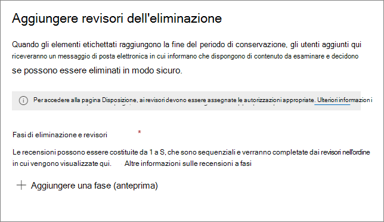

# Eliminazione del contenutoDisposition of content

>*[Indicazioni per l'assegnazione di licenze di Microsoft 365 per sicurezza e conformità](https://aka.ms/ComplianceSD).**[Microsoft 365 licensing guidance for security & compliance](https://aka.ms/ComplianceSD).*

Utilizzare la scheda **eliminazione** dalla **gestione record** nel Centro conformità Microsoft 365 per gestire le revisioni per l’eliminazione e visualizzare i [record](records-management.md#records) eliminati automaticamente al termine del periodo di conservazione.Use the **Disposition** tab from **Records Management** in the Microsoft 365 compliance center to manage disposition reviews and view [records](records-management.md#records) that have been automatically deleted at the end of their retention period. 

## Prerequisiti per la visualizzazione delle eliminazioni di contenutoPrerequisites for viewing content dispositions

Per gestire le revisioni per l’eliminazione e verificare che i record siano stati eliminati, è necessario avere le autorizzazioni necessarie e che il controllo sia abilitato.To manage disposition reviews and confirm that records have been deleted, you must have sufficient permissions and auditing must be enabled.

### Autorizzazioni per l'eliminazionePermissions for disposition

Per accedere correttamente alla scheda **eliminazione** nel Centro conformità Microsoft 365, è necessario che gli utenti abbiano il ruolo di amministratore per la **gestione dell’eliminazione**.To successfully access the **Disposition** tab in the Microsoft 365 compliance center, users must have the **Disposition Management** admin role. Questo ruolo è incluso nei gruppi di ruoli amministratore predefiniti, **amministratore di conformità** e **amministratore dati di conformità**.This role is included in the default admin role groups, **Compliance Administrator** and **Compliance Data Administrator**.

Per attribuire agli utenti il necessario ruolo di gestione dell’eliminazione, aggiungere gli utenti a uno di questi gruppi di ruoli predefiniti oppure creare un gruppo di ruoli personalizzato (denominato ad esempio "revisori per l’eliminazione") e attribuire al gruppo il ruolo di gestione dell’eliminazione.To grant users this required Disposition Management role, either add them to one of these default role groups, or create a custom role group (for example, named "Disposition Reviewers") and grant this group the Disposition Management role.  

> [!NOTE]
> Anche un amministratore globale deve avere il ruolo di **gestione dell’eliminazione**.Even a global admin needs to be granted the **Disposition Management** role. 

Per le istruzioni, vedere [Fornire agli utenti l'accesso al Centro sicurezza e conformità di Office 365](../security/office-365-security/grant-access-to-the-security-and-compliance-center.md).For instructions, see [Give users access to the Office 365 Security & Compliance Center](../security/office-365-security/grant-access-to-the-security-and-compliance-center.md).

### Abilitazione del controlloEnable auditing

Verificare che il controllo sia abilitato almeno un giorno prima della prima azione di eliminazione.Make sure that auditing is enabled at least one day before the first disposition action. Per ulteriori informazioni, vedere [Eseguire una ricerca nel log di controllo nel &amp;Centro sicurezza e conformità di Office 365](search-the-audit-log-in-security-and-compliance.md).For more information, see [Search the audit log in the Office 365 Security &amp; Compliance Center](search-the-audit-log-in-security-and-compliance.md). 

## Revisioni per l'eliminazioneDisposition reviews

Quando il contenuto raggiunge la fine del periodo di conservazione, ci possono essere diversi motivi per cui è consigliabile esaminare il contenuto prima di decidere se possa essere eliminato senza problemi ("disposto").When content reaches the end of its retention period, there are several reasons why you might want to review that content to decide whether it can be safely deleted ("disposed"). Ad esempio, potrebbe essere necessario:For example, you might need to:
  
- Sospendere l'eliminazione del contenuto pertinente in caso di controversie legali o di un controllo.Suspend the deletion of relevant content in the event of litigation or an audit.
    
- Rimuovere il contenuto dall'elenco di eliminazioni per archiviarlo, se tale contenuto ha un valore storico o di ricerca.Remove content from the disposition list to store in an archive, if that content has research or historical value.
    
- Assegnare un periodo di conservazione diverso al contenuto, perché ad esempio le impostazioni di conservazione originali erano una soluzione temporanea o provvisoria.Assign a different retention period to the content, perhaps because the original retention settings were a temporary or provisional solution.
    
- Restituire il contenuto ai clienti o trasferirlo a un'altra organizzazione.Return the content to clients or transfer it to another organization.

Quando viene attivata una revisione per l'eliminazione alla fine del periodo di conservazione:When a disposition review is triggered at the end of the retention period:
  
- Gli utenti prescelti ricevono una notifica di posta elettronica che indica che hanno dei contenuti da rivedere.The people you choose receive an email notification that they have content to review. Questi revisori possono essere singoli utenti o gruppi di sicurezza abilitati alla posta elettronica.These reviewers can be individual users or mail-enabled security groups. Si noti che le notifiche vengono inviate su base settimanale.Note that notifications are sent on a weekly basis.
    
- I revisori accedono alla scheda **eliminazione** nel Centro conformità Microsoft 365 per rivedere il contenuto e decidere se eliminarlo definitivamente, estendere il periodo di conservazione o applicare una diversa etichetta di conservazione.The reviewers go to the **Disposition** tab in the Microsoft 365 compliance center to review the content and decide whether to permanently delete it, extend its retention period, or apply a different retention label.

Una revisione per l'eliminazione può includere il contenuto di cassette postali di Exchange, siti di SharePoint, account di OneDrive e gruppi di Microsoft 365.A disposition review can include content in Exchange mailboxes, SharePoint sites, OneDrive accounts, and Microsoft 365 groups. Il contenuto in attesa di una revisione per l'eliminazione in tali posizioni viene eliminato solo dopo che un revisore sceglie di eliminarlo definitivamente.Content awaiting a disposition review in those locations is deleted only after a reviewer chooses to permanently delete the content.

> [!NOTE]
> Una cassetta postale deve contenere almeno 10 MB di dati per supportare le revisioni per l’eliminazione.A mailbox must have at least 10 MB data to support disposition reviews.

È possibile visualizzare una panoramica di tutte le eliminazioni in sospeso nella scheda **panoramica**. Per esempio:You can see an overview of all pending dispositions in the **Overview** tab. For example:

Quando si seleziona **Visualizza tutte le eliminazioni in sospeso**, viene visualizzata la pagina **eliminazione**.When you select the **View all pending dispositions**, you're taken to the **Disposition** page. Ad esempio:For example:

### Flusso di lavoro della revisione per l'eliminazione.Workflow for a disposition review

Il diagramma seguente illustra il flusso di lavoro di base di una revisione per l'eliminazione quando viene pubblicata una etichetta di conservazione e quindi applicata manualmente da un utente.The following diagram shows the basic workflow for a disposition review when a retention label is published and then manually applied by a user. In alternativa, un'etichetta di conservazione configurata per una revisione per l’eliminazione può essere applicata automaticamente al contenuto.Alternatively, a retention label configured for a disposition review can be auto-applied to content.
  

  
L'attivazione di una revisione per l'eliminazione alla fine del periodo di conservazione è un'opzione di configurazione disponibile solo con un'etichetta di conservazione.Triggering a disposition review at the end of the retention period is a configuration option that's available only with a retention label. Questa opzione non è disponibile per i criteri di conservazione.This option is not available for a retention policy. Per saperne di più su queste due soluzioni di conservazione, vedere [Informazioni sui criteri e le etichette di conservazione](retention.md).For more information about these two retention solutions, see [Learn about retention policies and retention labels](retention.md).

Dalla pagina **Definisci le impostazioni di conservazione** per un'etichetta di conservazione:From the **Define retention settings** page for a retention label:

 
Dopo aver selezionato l'opzione **Attiva una revisione per l'eliminazione**, si specificano i revisori per l’eliminazione nella pagina successiva della procedura guidata:After you select this **Trigger a disposition review** option, you specify the disposition reviewers on the next page of the wizard:

Per i revisori, specificare un utente o un gruppo di sicurezza abilitato alla posta elettronica.For the reviewers, specify a user or mail-enabled security group. I gruppi di Microsoft 365 (in precedenza[gruppi di Office 365](https://techcommunity.microsoft.com/t5/microsoft-365-blog/office-365-groups-will-become-microsoft-365-groups/ba-p/1303601)) non sono supportati per questa opzione.Microsoft 365 groups ([formerly Office 365 groups](https://techcommunity.microsoft.com/t5/microsoft-365-blog/office-365-groups-will-become-microsoft-365-groups/ba-p/1303601)) are not supported for this option.

### Visualizzazione ed eliminazione del contenutoViewing and disposing of content

Quando riceve una notifica tramite posta elettronica che informa che il contenuto è pronto per la revisione, il revisore può accedere alla scheda **eliminazione** dalla **gestione dei record** nel Centro conformità Microsoft 365.When a reviewer is notified by email that content is ready to review, they go to the **Disposition** tab from **Records Management** in the Microsoft 365 compliance center. I revisori possono visualizzare il numero di elementi per ogni etichetta di conservazione in attesa di eliminazione e quindi selezionare un'etichetta di conservazione per visualizzare tutto il contenuto sotto tale etichetta.The reviewers can see how many items for each retention label are awaiting disposition, and then select a retention label to see all content with that label.

Dopo aver selezionato un'etichetta di conservazione, sono visualizzate tutte le eliminazioni in sospeso relative a tale etichetta dalla scheda **eliminazione in sospeso**. Selezionare uno o più elementi, poi scegliere un’azione relativamente ad essi e inserire un commento di motivazione:After you select a retention label, you then see all pending dispositions for that label from the **Pending disposition** tab. Select one or more items where you can then choose an action and enter a justification comment:

Come si può vedere dall'immagine, le azioni supportate sono:As you can see from the picture, the actions supported are: 
  
- Eliminare definitivamente l'elemento.Permanently delete the item
- Estendere il periodo di conservazione.Extend the retention period
- Applicare un'etichetta di conservazione diversaApply a different retention label

Se si hanno le autorizzazioni necessarie per la posizione e il contenuto, è possibile usare il collegamento nella colonna **posizione** per visualizzare i documenti nella posizione originale.Providing you have permissions to the location and the content, you can use the link in the **Location** column to view documents in their original location. Durante una revisione per l'eliminazione, il contenuto non si sposta mai dalla posizione originale e non viene eliminato finché non lo decide il revisore.During a disposition review, the content never moves from its original location, and it's never deleted until the reviewer chooses to do so.

Le notifiche di posta elettronica vengono inviate automaticamente ai revisori con cadenza settimanale.The email notifications are sent automatically to reviewers on a weekly basis. Questa programmazione implica che, quando il contenuto raggiunge la fine del periodo di conservazione, possono trascorrere fino a sette giorni perché ai revisori venga notificato tramite posta elettronica che il contenuto è in attesa di eliminazione.This scheduled process means that when content reaches the end of its retention period, it might take up to seven days for reviewers to receive the email notification that content is awaiting disposition.
  
Tutte le azioni di eliminazione possono essere controllate e il testo della motivazione inserito dal revisore viene salvato e visualizzato nella colonna **commento** nella pagina **elementi eliminati**.All disposition actions can be audited and the justification text entered by the reviewer is saved and displayed in the **Comment** column on the **Disposed items** page.
  
### Dopo quanto tempo viene eliminato definitivamente il contenuto eliminatoHow long until disposed content is permanently deleted

Il contenuto in attesa di una revisione per l'eliminazione viene eliminato solo dopo che un revisore sceglie di eliminarlo definitivamente.Content awaiting a disposition review is deleted only after a reviewer chooses to permanently delete the content. Se il revisore sceglie questa opzione, il contenuto del sito di SharePoint o dell'account di OneDrive diventa idoneo per il processo di pulizia standard descritto in [Funzionamento delle impostazioni di conservazione con i contenuti in locale](retention.md#how-retention-settings-work-with-content-in-place).When the reviewer chooses this option, the content in the SharePoint site or OneDrive account becomes eligible for the standard cleanup process described in [How retention settings work with content in place](retention.md#how-retention-settings-work-with-content-in-place).

## Eliminazione dei recordDisposition of records

Usare la scheda **eliminazione** della pagina **gestione record** per identificare i record che vengono ora eliminati, automaticamente o dopo una revisione dell’eliminazione.Use the **Disposition** tab from the **Records Management** page to identify records that are now deleted, either automatically or after a disposition review. Questi elementi visualizzano i **record eliminati** nella colonna **Tipo**.These items display **Records Disposed** in the **Type** column. Ad esempio:For example:

Gli elementi visualizzati nella scheda **elementi eliminati** delle etichette dei record vengono conservati per un massimo di sette anni dalla data di eliminazione dell'elemento, con un limite di 1 milione di elementi per ogni record per quel periodo.Items that are shown in the **Disposed Items** tab for record labels are kept for up to seven years after the item was disposed, with a limit of one million items per record for that period. Se la cifra di **Conteggio** visualizzata si avvicina al limite di 1 milione e occorre prova di eliminazione dei record, contattare il [supporto tecnico Microsoft](https://docs.microsoft.com/office365/admin/contact-support-for-business-products).If you see the **Count** number nearing this limit of one million, and you need proof of disposition for your records, contact [Microsoft Support](https://docs.microsoft.com/office365/admin/contact-support-for-business-products).

> [!NOTE]
> Questa funzionalità si basa sulle informazioni provenienti dal [Log di controllo unificato](search-the-audit-log-in-security-and-compliance.md) e, di conseguenza, è necessario che il controllo sia [abilitato e con ricerca consentita](turn-audit-log-search-on-or-off.md) in modo da acquisire gli eventi corrispondenti.This functionality is based on information from the [unified audit log](search-the-audit-log-in-security-and-compliance.md) and therefore requires auditing to be [enabled and searchable](turn-audit-log-search-on-or-off.md) so the corresponding events are captured.
    
## Filtrare ed esportare le visualizzazioniFilter and export the views

Se si seleziona un'etichetta di conservazione dalla pagina **eliminazione**, la scheda **eliminazione in sospeso**(se applicabile) e la scheda **elementi eliminati** consentono di filtrare le visualizzazioni per trovare più facilmente gli elementi.When you select a retention label from the **Disposition** page, the **Pending disposition** tab (if applicable) and the **Disposed items** tab let you filter the views to help you more easily find items. 

Per le eliminazioni in sospeso, l'intervallo di tempo si basa sulla data di scadenza.For pending dispositions, the time range is based on the expiration date. Per gli elementi eliminati, l'intervallo di tempo si basa sulla data di eliminazione.For disposed items, the time range is based on the deletion date.
  
Per entrambe le visualizzazioni è possibile esportare le informazioni sugli elementi come file .csv, che si può poi ordinare e gestire con Excel:You can export information about the items in either view as a .csv file that you can then sort and manage using Excel:

