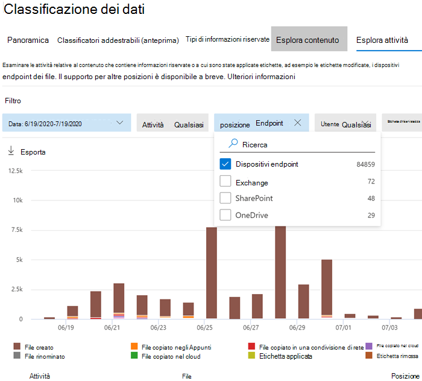

# <a name="get-started-with-microsoft-compliance-extension"></a>Introduzione all'estensione per Conformità Microsoft

Usare queste procedure per implementare l'estensione di conformità Microsoft.

## <a name="before-you-begin"></a>Prima di iniziare

Per usare l'estensione per la conformità Microsoft, occorre eseguire l'onboarding del dispositivo nella prevenzione della perdita dei dati degli endpoint. Leggere questi articoli se non si ha familiarità con la prevenzione della perdita dei dati o endpoint DLP.

- [Informazioni sull'estensione per la conformità Microsoft](dlp-chrome-learn-about.md)
- [Informazioni sulla prevenzione della perdita di dati](dlp-learn-about-dlp.md)
- [Creare, testare e ottimizzare un criterio di prevenzione della perdita dei dati](create-test-tune-dlp-policy.md)
- [Creare un criterio di prevenzione della perdita dei dati da un modello](create-a-dlp-policy-from-a-template.md)
- [Informazioni sulla prevenzione della perdita dei dati degli endpoint](endpoint-dlp-learn-about.md)
- [Introduzione alla prevenzione della perdita dei dati degli endpoint](endpoint-dlp-getting-started.md)
- [Strumenti e metodi di onboarding per i dispositivi Windows 10](dlp-configure-endpoints.md)
- [Configurazione del proxy del dispositivo e delle impostazioni di connessione a Internet per la prevenzione della perdita di dati degli endpoint](endpoint-dlp-configure-proxy.md)
- [Uso della prevenzione della perdita di dati degli endpoint](endpoint-dlp-using.md)

### <a name="skusubscriptions-licensing"></a>Licenze per SKU o sottoscrizioni

Prima di iniziare, è necessario verificare l'[abbonamento a Microsoft 365](https://www.microsoft.com/microsoft-365/compare-microsoft-365-enterprise-plans?rtc=1) e gli eventuali componenti aggiuntivi. Per accedere e usare le funzionalità di Endpoint DLP, è necessario disporre di uno di questi abbonamenti o componenti aggiuntivi.

- Microsoft 365 E5
- Microsoft 365 A5 (EDU)
- Microsoft 365 E5 Compliance
- Microsoft 365 A5 Compliance
- Microsoft 365 E5 Information Protection and Governance
- Microsoft 365 A5 Information Protection and Governance

Per indicazioni dettagliate sulle licenze, vedere [Indicazioni dettagliate sulle licenze di Microsoft 365 per la sicurezza e la conformità](/office365/servicedescriptions/microsoft-365-service-descriptions/microsoft-365-tenantlevel-services-licensing-guidance/microsoft-365-security-compliance-licensing-guidance#information-protection).

- L'organizzazione deve disporre di una licenza per la prevenzione della perdita dei dati degli endpoint
- I dispositivi devono eseguire Windows 10 x64, build 1809 o successiva.
- Il dispositivo deve disporre della versione client antimalware 4.18.2101.9 o successiva. Controllare la versione corrente aprendo l'app **Sicurezza di Windows**, selezionando l'icona **Impostazioni** poi **Informazioni su**.


### <a name="permissions"></a>Autorizzazioni

I dati provenienti dalla prevenzione della perdita dei dati degli endpoint possono essere visualizzati in [Esplora attività](data-classification-activity-explorer.md). Sono disponibili sette ruoli per l'autorizzazione per Esplora attività, l'account usato per accedere ai dati deve essere membro di uno di essi.

- Amministratore globale
- Amministratore di conformità
- Amministratore della sicurezza
- Amministratore dati di conformità
- Ruolo con autorizzazioni di lettura globali
- Amministratore che legge i dati di sicurezza
- Amministratore che legge i report

### <a name="overall-installation-workflow"></a>Flusso di lavoro complessivo per l'installazione

La distribuzione dell'estensione per la conformità Microsoft è un processo in più fasi. È possibile scegliere di eseguire l'installazione in un computer alla volta oppure usare Microsoft Endpoint Manager o Criteri di gruppo per la distribuzione a livello di organizzazione.

1. [Preparazione dei dispositivi](#prepare-your-devices).
2. [Configurazione di base SelfHost su un singolo computer](#basic-setup-single-machine-selfhost)
3. [Eseguire la distribuzione con Microsoft Endpoint Manager](#deploy-using-microsoft-endpoint-manager)
4. [Eseguire la distribuzione con Criteri di gruppo](#deploy-using-group-policy)
5. [Testare l'estensione](#test-the-extension)
6. [Usare il dashboard di gestione degli avvisi per visualizzare gli avvisi DLP di Chrome](#use-the-alerts-management-dashboard-to-viewing-chrome-dlp-alerts)
7. [Visualizzazione dei dati DLP di Chrome in Esplora attività](#viewing-chrome-dlp-data-in-activity-explorer)

### <a name="prepare-infrastructure"></a>Preparazione dell'infrastruttura

Se si sta implementando l'estensione per la conformità Microsoft in tutti i dispositivi Windows 10 monitorati, è consigliabile rimuovere Google Chrome dall'elenco delle app e dei browser non consentiti. Per altre informazioni, vedere [Browser non consentiti](endpoint-dlp-using.md#unallowed-browsers). Se si sta eseguendo l'implementazione solo in alcuni dispositivi, è possibile lasciare Chrome nell'elenco delle app o dei browser non consentiti. L'estensione per la conformità Microsoft ignorerà le restrizioni di entrambi gli elenchi per i computer in cui è installata.

### <a name="prepare-your-devices"></a>Preparazione dei dispositivi

1. Usare le procedure descritte in questi argomenti per eseguire l'onboarding dei dispositivi:
    1. [Introduzione alla prevenzione della perdita dei dati degli endpoint](endpoint-dlp-getting-started.md)
    1. [Strumenti e metodi di onboarding per i dispositivi Windows 10](dlp-configure-endpoints.md)
    1. [Configurazione del proxy del dispositivo e delle impostazioni di connessione a Internet per la prevenzione della perdita di dati degli endpoint](endpoint-dlp-configure-proxy.md)

### <a name="basic-setup-single-machine-selfhost"></a>Configurazione di base Selfhost su un singolo computer

Si tratta del metodo consigliato.

1. Accedere al computer Windows 10 in cui si desidera installare l'estensione per la conformità Microsoft ed eseguire lo script di PowerShell come amministratore.

   ```powershell
   Get-Item -path "HKLM:\SOFTWARE\Microsoft\Windows Defender\Miscellaneous Configuration" | New-ItemProperty -Name DlpDisableBrowserCache -Value 0 -Force
   ```

2. Passare all'[estensione per la conformità Microsoft - Chrome Web Store (google.com)](https://chrome.google.com/webstore/detail/microsoft-compliance-exte/echcggldkblhodogklpincgchnpgcdco).

3. Installare l'estensione usando le istruzioni contenute nella pagina del Chrome Web Store.

### <a name="deploy-using-microsoft-endpoint-manager"></a>Eseguire la distribuzione con Microsoft Endpoint Manager

Usare questo metodo di configurazione per le distribuzioni a livello di organizzazione.

##### <a name="enabling-required-registry-key-via-microsoft-endpoint-manager"></a>Abilitazione della chiave del Registro di sistema necessaria tramite Microsoft Endpoint Manager

1. Creare uno script di PowerShell con i contenuti seguenti:

    ```powershell
    Get-Item -path "HKLM:\SOFTWARE\Microsoft\Windows Defender\Miscellaneous Configuration" | New-ItemProperty -Name DlpDisableBrowserCache -Value 0 -Force
    ```

2. Accedere all'[Interfaccia di amministrazione di Microsoft Endpoint Manager](https://endpoint.microsoft.com).

3. Passare a **Dispositivi** > **Script** e selezionare **Aggiungi**.

4. Passare alla posizione dello script creato quando viene richiesto.

5. Selezionare le seguenti impostazioni:
    1. Esegui lo script con le credenziali di accesso: SÌ
    1. Applica il controllo della firma degli script: NO
    1. Esegui script nell'host PowerShell a 64 bit: SÌ

6. Selezionare i gruppi di dispositivi appropriati e applicare il criterio.

#### <a name="microsoft-endpoint-manager-force-install-steps"></a>Procedura di installazione forzata di Microsoft Endpoint Manager

Prima di aggiungere l'estensione per la conformità Microsoft all'elenco delle estensioni con installazione forzata, è importante inserire il file ADMX di Chrome. I passaggi per questo processo in Microsoft Endpoint Manager sono documentate da Google: [Gestisci browser Chrome con Microsoft Intune - Guida di Google Chrome Enterprise](https://support.google.com/chrome/a/answer/9102677?hl=en#zippy=%2Cstep-ingest-the-chrome-admx-file-into-intune).

 Dopo l'inserimento del file ADMX, è possibile seguire questa procedura per creare un profilo di configurazione per l'estensione.

1. Accedere all'interfaccia di amministrazione di Microsoft Endpoint Manager (https://endpoint.microsoft.com).

2. Passare a Profili di configurazione.

3. Selezionare **Crea profilo**.

4. Selezionare **Windows 10** come piattaforma.

5. Selezionare **Personalizza** come tipo di profilo.

6. Selezionare la scheda **Impostazioni**.

7. Selezionare **Aggiungi**.

8. Immettere le informazioni sui criteri seguenti.

    OMA-URI: `./Device/Vendor/MSFT/Policy/Config/Chrome~Policy~googlechrome~Extensions/ExtensionInstallForcelist`<br/>
    Tipo di dati:`String`<br/>
    Valore: `<enabled/><data id="ExtensionInstallForcelistDesc" value="1&#xF000; echcggldkblhodogklpincgchnpgcdco;https://clients2.google.com/service/update2/crx"/>`

9. Fare clic su Crea.

### <a name="deploy-using-group-policy"></a>Eseguire la distribuzione tramite Criteri di gruppo

Se non si desidera usare Microsoft Endpoint Manager, è possibile usare i criteri di gruppo per distribuire l'estensione per la conformità Microsoft nell'intera organizzazione

1. I dispositivi devono essere gestibili tramite Criteri di gruppo e occorre importare tutti i file ADMX di Chrome nell'archivio centrale dei Criteri di gruppo. Per altre informazioni, vedere [Come creare e gestire l'archivio centrale per i modelli amministrativi di Criteri di gruppo in Windows](/troubleshoot/windows-client/group-policy/create-and-manage-central-store).

2. Creare uno script di PowerShell con il comando PowerShell:

    ```powershell
    Get-Item -path "HKLM:\SOFTWARE\Microsoft\Windows Defender\Miscellaneous Configuration" | New-ItemProperty -Name DlpDisableBrowserCache -Value 0 -Force
    ```

3. Aprire la **console di gestione di Criteri di gruppo** e passare all'unità organizzativa (OU).

4. Fare clic con il pulsante destro del mouse e selezionare **Crea oggetto Criteri di gruppo in questo dominio e collegalo qui**. Quando viene richiesto, assegnare un nome descrittivo a questo oggetto Criteri di gruppo e completare la creazione.

5. Fare clic con il pulsante destro del mouse sull'oggetto Criteri di gruppo e selezionare **Modifica**.

6. Passare a **Configurazione computer** > **Preferenze** > **Impostazioni Pannello di controllo** > **Attività pianificate**.

7. Per creare una nuova attività immediata, selezionare tramite il pulsante destro del mouse **Nuova** > **Nuova attività immediata (in Windows 7)**.

8. Assegnare un nome e una descrizione all'attività.

9. Scegliere l'account corrispondente per eseguire l'attività immediata, ad esempio NT Authority

10. Selezionare **Esegui con i privilegi più elevati**.

11. Configurare i criteri per Windows 10.

12. Nella scheda **Azioni**, selezionare l'azione **Avvia un programma**.

13. Immettere il percorso del programma o dello script creato nel passaggio 1.

14. Selezionare **Applica**.

#### <a name="adding-the-chrome-extension-to-the-forceinstall-list"></a>Aggiunta dell'estensione di Chrome all'elenco ForceInstall

1. Nell'editor di gestione di Criteri di gruppo passare all'unità organizzativa.

2. Espandere il percorso seguente **Configurazione computer/utente** > **Criteri** > **Modelli amministrativi** > **Modelli amministrativi classici** > **Google** > **Google Chrome** > **Estensioni**. Questo percorso può variare a seconda della configurazione.

3. Selezionare **Configura l'elenco delle estensioni con installazione forzata**.

4. Fare clic con il pulsante destro del mouse e selezionare **Modifica**.

5. Selezionare **Abilitato**.

6. Selezionare **Visualizza**.

7. In **Valore**, aggiungere la voce seguente: `echcggldkblhodogklpincgchnpgcdco;https://clients2.google.com/service/update2/crx`

8. Selezionare **OK**, poi **Applica**.

### <a name="test-the-extension"></a>Testare l'estensione

#### <a name="upload-to-cloud-service-or-access-by-unallowed-browsers-cloud-egress"></a>Caricare nel servizio cloud o accedere tramite browser non consentiti a Uscita cloud

1. Creare o recuperare un elemento sensibile e provare a caricare un file in un dominio dei servizi con restrizioni dell'organizzazione. I dati riservati devono corrispondere a uno dei [tipi di informazioni sensibili](sensitive-information-type-entity-definitions.md) predefiniti o a uno dei tipi di informazioni sensibili dell'organizzazione. Si dovrebbe ricevere una notifica di tipo avviso popup di DLP dal dispositivo che si sta testando, che informa che questa azione non è consentita quando il file è aperto.

#### <a name="testing-other-dlp-scenarios-in-chrome"></a>Test di altri scenari di prevenzione della perdita dei dati in Chrome

Dopo aver rimosso Chrome dall'elenco di browser o app non autorizzati, è possibile testare gli scenari seguenti per verificare che il comportamento soddisfi i requisiti dell'organizzazione:

- Copiare dati da un elemento sensibile a un altro documento tramite gli Appunti
  - Per eseguire il test, aprire un file protetto da azioni di copia negli Appunti nel browser Chrome e provare a copiare i dati dal file.
  - Risultato previsto: notifica di avviso popup di DLP che comunica che questa azione non è consentita quando il file è aperto.
- Stampa di un documento
  - Per eseguire il test, aprire un file protetto dalle azioni di stampa nel browser Chrome e provare a stampare il file.
  - Risultato previsto: notifica di avviso popup di DLP che comunica che questa azione non è consentita quando il file è aperto.
- Copia in supporti rimovibili USB
  - Per eseguire un test, provare a salvare il file in un archivio multimediale rimovibile.
  - Risultato previsto: notifica di avviso popup di DLP che comunica che questa azione non è consentita quando il file è aperto.
- Copia in condivisione di rete
  - Per eseguire un test, provare a salvare il file in una condivisione di rete.
  - Risultato previsto: notifica di avviso popup di DLP che comunica che questa azione non è consentita quando il file è aperto.

### <a name="use-the-alerts-management-dashboard-to-viewing-chrome-dlp-alerts"></a>Usare il dashboard di gestione degli avvisi per visualizzare gli avvisi di DLP di Chrome

1. Aprire la pagina di **Prevenzione della perdita dei dati** nel **Centro conformità Microsoft 365** e scegliere [Avvisi](https://compliance.microsoft.com).

2. Fare riferimento alle procedure in [Come configurare e visualizzare gli avvisi per i criteri di prevenzione della perdita dei dati](dlp-configure-view-alerts-policies.md) per visualizzare gli avvisi per i criteri di prevenzione della perdita dei dati degli endpoint.

### <a name="viewing-chrome-dlp-data-in-activity-explorer"></a>Visualizzazione dei dati DLP di Chrome in Esplora attività

1. Aprire la [pagina Classificazione dei dati](https://compliance.microsoft.com/dataclassification?viewid=overview) per il dominio nel Centro conformità Microsoft 365 e scegliere **Esplora attività**.

2. Vedere le procedure in [Introduzione a Esplora attività](data-classification-activity-explorer.md) per accedere a tutti i dati relativi ai dispositivi endpoint e filtrarli.

   > [!div class="mx-imgBorder"]
   > 

### <a name="known-issues-and-limitations"></a>Problemi noti e limitazioni

1. L'imposizione del blocco override per l’uscita dal cloud non è supportata.
2. La modalità Incognito non è supportata e deve essere disabilitata.

## <a name="next-steps"></a>Passaggi successivi

Ora che si è eseguito l'onboarding dei dispositivi e che è possibile visualizzare i dati sulle attività in Esplora attività, è possibile procedere con il passaggio successivo, in cui si creano criteri di prevenzione della perdita dei dati per proteggere gli elementi sensibili.

- [Uso di Prevenzione della perdita di dati degli endpoint](endpoint-dlp-using.md)

## <a name="see-also"></a>Vedere anche

- [Informazioni sulla prevenzione della perdita di dati degli endpoint](endpoint-dlp-learn-about.md)
- [Uso della prevenzione della perdita di dati degli endpoint](endpoint-dlp-using.md)
- [Informazioni sulla prevenzione della perdita di dati](dlp-learn-about-dlp.md)
- [Creare, testare e ottimizzare un criterio di prevenzione della perdita dei dati](create-test-tune-dlp-policy.md)
- [Introduzione a Esplora attività](data-classification-activity-explorer.md)
- [Microsoft Defender ATP](/windows/security/threat-protection/)
- [Strumenti e metodi di onboarding per i dispositivi Windows 10](/windows/security/threat-protection/microsoft-defender-atp/configure-endpoints)
- [Abbonamento a Microsoft 365](https://www.microsoft.com/microsoft-365/compare-microsoft-365-enterprise-plans?rtc=1)
- [Dispositivi aggiunti ad Azure AD](/azure/active-directory/devices/concept-azure-ad-join)
- [Scaricare il nuovo Microsoft Edge basato su Chromium](https://support.microsoft.com/help/4501095/download-the-new-microsoft-edge-based-on-chromium)
