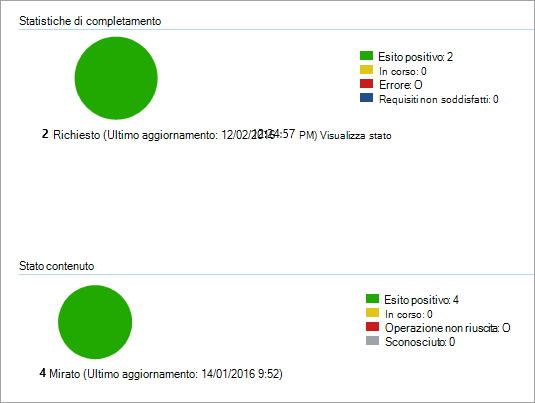

# <a name="onboard-windows-10-devices-using-configuration-manager"></a>Onboarding di dispositivi Windows 10 con Configuration Manager

**Si applica a:**

- [Prevenzione della perdita dei dati di Microsoft 365 Endpoint (DLP)](./endpoint-dlp-learn-about.md)
- System Center Configuration Manager 2012 R2

### <a name="onboard-devices-using-system-center-configuration-manager"></a>Onboardare i dispositivi con System Center Configuration Manager

1. Aprire il file ZIP del pacchetto di configurazione di Configuration Manager (*DeviceComplianceOnboardingPackage.zip*) scaricato dall'onboarding guidato del servizio. È anche possibile ottenere il pacchetto dal [Centro conformità Microsoft.](https://compliance.microsoft.com/)

2. Nel riquadro di spostamento seleziona **Impostazioni**  >  **Onboarding dispositivo Onboarding.**  >  

3. Nel campo **Metodo di** distribuzione selezionare Microsoft Endpoint Configuration **Manager 2012/2012 R2/1511/1602.**
 
4. Seleziona **Scarica pacchetto** e salva il file ZIP.

5. Estrarre il contenuto del file ZIP in un percorso condiviso di sola lettura accessibile dagli amministratori di rete che distribuiranno il pacchetto. Dovresti avere un file denominato *DeviceComplianceOnboardingScript.cmd.*

6. Distribuire il pacchetto seguendo la procedura descritta nell'articolo Pacchetti e programmi [in System Center 2012 R2 Configuration Manager.](/previous-versions/system-center/system-center-2012-R2/gg699369(v=technet.10))

7. Scegli una raccolta di dispositivi predefinita in cui distribuire il pacchetto.

> [!NOTE]
> La prevenzione della perdita dei dati degli endpoint di Microsoft 365 non supporta l'onboarding durante la fase [out-of-box experience (OOBE).](https://answers.microsoft.com/en-us/windows/wiki/windows_10/how-to-complete-the-windows-10-out-of-box/47e3f943-f000-45e3-8c5c-9d85a1a0cf87) Assicurarsi che gli utenti completino la Configurazione guidata dopo l'esecuzione dell'installazione o dell'aggiornamento di Windows.

>[!TIP]
> Dopo l'onboarding del dispositivo, puoi scegliere di eseguire un test di rilevamento per verificare che un dispositivo sia stato correttamente onboarding nel servizio. Per altre informazioni, vedi [Eseguire un test di rilevamento su un dispositivo Microsoft Defender ATP appena onboarded.](/windows/security/threat-protection/microsoft-defender-atp/run-detection-test)
>
> Tieni presente che è possibile creare una regola di rilevamento in un'applicazione di Configuration Manager per verificare continuamente se è stato eseguito l'onboarded di un dispositivo. Un'applicazione è un tipo di oggetto diverso rispetto a un pacchetto e a un programma.
> Se un dispositivo non è ancora stato onboarded (a causa del completamento della Configurazione guidata in sospeso o di qualsiasi altro motivo), Configuration Manager ritenterà di eseguire l'onboarded del dispositivo fino a quando la regola non rileva la modifica dello stato.
> 
> Questo comportamento può essere ottenuto creando una regola di rilevamento che controlla se il valore del Registro di sistema "OnboardingState" (di tipo REG_DWORD) = 1.
> Questo valore del Registro di sistema si trova in "HKLM\SOFTWARE\Microsoft\Windows Advanced Threat Protection\Status".
Per ulteriori informazioni, vedere [Configure Detection Methods in System Center 2012 R2 Configuration Manager.](/previous-versions/system-center/system-center-2012-R2/gg682159(v=technet.10)#step-4-configure-detection-methods-to-indicate-the-presence-of-the-deployment-type)

### <a name="configure-sample-collection-settings"></a>Configurare le impostazioni della raccolta di esempio

Per ogni dispositivo, puoi impostare un valore di configurazione per indicare se è possibile raccogliere campioni dal dispositivo quando viene effettuata una richiesta tramite Microsoft Defender Security Center per inviare un file per l'analisi approfondita.

>[!NOTE]
>Queste impostazioni di configurazione vengono in genere eseguite tramite Configuration Manager. 

Puoi impostare una regola di conformità per l'elemento di configurazione in Configuration Manager per modificare l'impostazione della condivisione di esempio in un dispositivo.

Questa regola deve essere un elemento *di configurazione* della regola di conformità che imposta il valore di una chiave del Registro di sistema nei dispositivi di destinazione per assicurarsi che siano reclami.

La configurazione viene impostata tramite la voce della chiave del Registro di sistema seguente:

```
Path: “HKLM\SOFTWARE\Policies\Microsoft\Windows Advanced Threat Protection”
Name: "AllowSampleCollection"
Value: 0 or 1
```
Dove:<br>
Il tipo di chiave è D-WORD. <br>
I valori possibili sono:
- 0 - Non consente la condivisione di esempi da questo dispositivo
- 1 - Consente la condivisione di tutti i tipi di file da questo dispositivo

Il valore predefinito nel caso in cui la chiave del Registro di sistema non esista è 1.

Per ulteriori informazioni sulla conformità di System Center Configuration Manager, vedere Introduzione alle impostazioni di [conformità in System Center 2012 R2 Configuration Manager.](/previous-versions/system-center/system-center-2012-R2/gg682139(v=technet.10))


## <a name="other-recommended-configuration-settings"></a>Altre impostazioni di configurazione consigliate
Dopo l'onboarding dei dispositivi al servizio, è importante sfruttare le funzionalità di protezione dalle minacce incluse abilitandoli con le impostazioni di configurazione consigliate seguenti.

### <a name="device-collection-configuration"></a>Configurazione raccolta dispositivi
Se si usa Endpoint Configuration Manager, versione 2002 o successiva, è possibile scegliere di ampliare la distribuzione per includere server o client di livello inferiore.


### <a name="next-generation-protection-configuration"></a>Configurazione di protezione di nuova generazione

Sono consigliate le impostazioni di configurazione seguenti:

**Analisi**

- Analizzare i dispositivi di archiviazione rimovibili, ad esempio le unità USB: Sì

**Protezione in tempo reale**

- Abilita monitoraggio comportamentale: Sì
- Abilitare la protezione da applicazioni potenzialmente indesiderate durante il download e prima dell'installazione: Sì

**Servizio di protezione cloud**

- Tipo di appartenenza al servizio di protezione cloud: appartenenza avanzata

**Riduzione della superficie di attacco** Configurare tutte le regole disponibili su Controllo.

>[!NOTE]
> Il blocco di queste attività può interrompere i processi aziendali legittimi. L'approccio migliore consiste nell'impostare tutti i controlli, identificare quelli sicuri da attivare e quindi abilitare tali impostazioni sugli endpoint che non dispongono di rilevamenti falsi positivi.

**Protezione di rete**

Prima di abilitare la protezione di rete in modalità di controllo o blocco, assicurati di aver installato l'aggiornamento della piattaforma antimalware, che può essere ottenuto dalla [pagina di supporto](https://support.microsoft.com/en-us/help/4560203/windows-defender-anti-malware-platform-binaries-are-missing).


**Accesso controllato alle cartelle**

Abilita la funzionalità in modalità di controllo per almeno 30 giorni. Dopo questo periodo, esaminare i rilevamenti e creare un elenco di applicazioni che possono scrivere nelle directory protette.

Per ulteriori informazioni, vedere [Evaluate controlled folder access](/windows/security/threat-protection/microsoft-defender-atp/evaluate-controlled-folder-access).


## <a name="offboard-devices-using-configuration-manager"></a>Dispositivi offboard con Configuration Manager

Per motivi di sicurezza, il pacchetto usato per i dispositivi offboard scadrà 30 giorni dopo la data di download. I pacchetti di offboarding scaduti inviati a un dispositivo verranno rifiutati. Durante il download di un pacchetto di offboarding, ti verrà notificata la data di scadenza dei pacchetti e verrà incluso anche nel nome del pacchetto.

> [!NOTE]
> I criteri di onboarding e offboarding non devono essere distribuiti nello stesso dispositivo contemporaneamente, altrimenti ciò causerà collisioni imprevedibili.

### <a name="offboard-devices-using-microsoft-endpoint-configuration-manager-current-branch"></a>Offboard devices using Microsoft Endpoint Configuration Manager current branch

Se usi il ramo corrente di Microsoft Endpoint Configuration Manager, vedi Creare un file di [configurazione di offboarding.](/configmgr/protect/deploy-use/windows-defender-advanced-threat-protection#create-an-offboarding-configuration-file)

### <a name="offboard-devices-using-system-center-2012-r2-configuration-manager"></a>Dispositivi offboard con System Center 2012 R2 Configuration Manager

1. Ottenere il pacchetto di offboarding dal [Centro conformità Microsoft:](https://compliance.microsoft.com/)

2. Nel riquadro di spostamento seleziona **Impostazioni**  >   **Onboarding del dispositivo Offboarding.** >  

3. Seleziona Windows 10 come sistema operativo.

4. Nel campo **Metodo di** distribuzione selezionare Microsoft Endpoint Configuration **Manager 2012/2012 R2/1511/1602.**
    
5. Seleziona **Scarica pacchetto** e salva il file ZIP.

6. Estrarre il contenuto del file ZIP in un percorso condiviso di sola lettura accessibile dagli amministratori di rete che distribuiranno il pacchetto. Dovresti avere un file denominato *DeviceComplianceOffboardingScript_valid_until_YYYY-MM-DD.cmd*.

7. Distribuire il pacchetto seguendo la procedura descritta nell'articolo Pacchetti e programmi [in System Center 2012 R2 Configuration Manager.](/previous-versions/system-center/system-center-2012-R2/gg699369(v=technet.10))

8. Scegli una raccolta di dispositivi predefinita in cui distribuire il pacchetto.

> [!IMPORTANT]
> L'offboarding fa sì che il dispositivo interrompi l'invio dei dati del sensore al portale, ma i dati dal dispositivo, incluso il riferimento a eventuali avvisi che ha avuto, verranno conservati per un massimo di 6 mesi.


## <a name="monitor-device-configuration"></a>Monitorare la configurazione del dispositivo

Se usi il ramo corrente di Microsoft Endpoint Configuration Manager, usa il dashboard predefinito di Microsoft Defender ATP nella console di Configuration Manager. Per ulteriori informazioni, vedere [Microsoft Defender Advanced Threat Protection - Monitor.](/configmgr/protect/deploy-use/windows-defender-advanced-threat-protection#monitor)

Se si usa System Center 2012 R2 Configuration Manager, il monitoraggio è costituito da due parti:

1. Verificare che il pacchetto di configurazione sia stato distribuito correttamente e che sia in esecuzione (o sia stato eseguito correttamente) nei dispositivi della rete.

2. Verifica che i dispositivi siano conformi al servizio di prevenzione della perdita dei dati di Microsoft 365 Endpoint (in questo modo il dispositivo può completare il processo di onboarding e può continuare a segnalare i dati al servizio).

### <a name="confirm-the-configuration-package-has-been-correctly-deployed"></a>Verificare che il pacchetto di configurazione sia stato distribuito correttamente

1. Nella console di Configuration Manager fare clic **su Monitoraggio** nella parte inferiore del riquadro di spostamento.

2. Selezionare **Panoramica** e **quindi Distribuzioni**.

3. Selezionare nella distribuzione con il nome del pacchetto.

4. Esaminare gli indicatori di stato in **Statistiche di completamento** e Stato **contenuto**.

    Se sono presenti distribuzioni non riuscite (dispositivi con stato **Errore,** Requisiti **non** soddisfatti o Non **riusciti),** potrebbe essere necessario risolvere i problemi relativi ai dispositivi. Per ulteriori informazioni, vedere Risoluzione dei problemi [di onboarding](/windows/security/threat-protection/microsoft-defender-atp/troubleshoot-onboarding)di Microsoft Defender Advanced Threat Protection.

    

### <a name="check-that-the-devices-are-compliant-with-the-microsoft-365-endpoint-data-loss-prevention-service"></a>Verificare che i dispositivi siano conformi al servizio di prevenzione della perdita dei dati di Microsoft 365 Endpoint

È possibile impostare una regola di conformità per l'elemento di configurazione in System Center 2012 R2 Configuration Manager per monitorare la distribuzione.

> [!NOTE]
> Questa procedura e voce del Registro di sistema si applica a Endpoint DLP e Advanced Threat Protection.

Questa regola deve essere un elemento di configurazione della regola di conformità *non correttiva* che monitori il valore di una chiave del Registro di sistema nei dispositivi di destinazione.

Monitorare la seguente voce della chiave del Registro di sistema:
```
Path: “HKLM\SOFTWARE\Microsoft\Windows Advanced Threat Protection\Status”
Name: “OnboardingState”
Value: “1”
```
Per ulteriori informazioni, vedere [Introduzione alle impostazioni di conformità in System Center 2012 R2 Configuration Manager.](/previous-versions/system-center/system-center-2012-R2/gg682139(v=technet.10))

## <a name="related-topics"></a>Argomenti correlati
- [Onboardare dispositivi Windows 10 con Criteri di gruppo](dlp-configure-endpoints-gp.md)
- [Onboarding di dispositivi Windows 10 con gli strumenti di Gestione dispositivi mobili](dlp-configure-endpoints-mdm.md)
- [Onboarding di dispositivi Windows 10 con uno script locale](dlp-configure-endpoints-script.md)
- [Onboarding di dispositivi VDI (Virtual Desktop Infrastructure) non persistenti](dlp-configure-endpoints-vdi.md)
- [Eseguire un test di rilevamento su un dispositivo Microsoft Defender ATP appena onboarded](/windows/security/threat-protection/microsoft-defender-atp/run-detection-test)
- [Risolvere i problemi di onboarding di Microsoft Defender Advanced Threat Protection](/windows/security/threat-protection/microsoft-defender-atp/troubleshoot-onboarding)