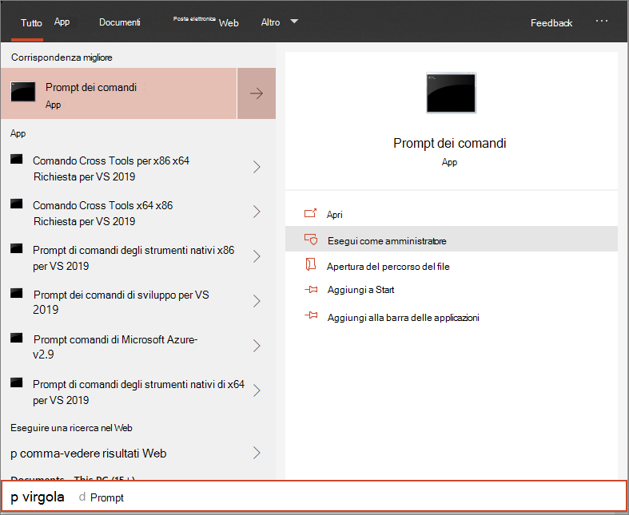

# Dispositivi di bordo di Windows 10 con uno script locale

**Si applica a:**

- [Prevenzione della perdita di dati (DLP) di Microsoft 365 endpoint](/microsoft-365/compliance/endpoint-dlp-learn-about)

È inoltre possibile eseguire manualmente l'onboarding dei singoli dispositivi per la prevenzione della perdita di dati di Microsoft 365 endpoint. Potrebbe essere necessario eseguire questa operazione prima quando si verifica il servizio prima di eseguire l'onboarding di tutti i dispositivi della rete.

> [!IMPORTANT]
> Questo script è stato ottimizzato per l'uso su un massimo di 10 dispositivi.
>
> Per eseguire la distribuzione in scala, utilizzare [altre opzioni di distribuzione](dlp-configure-endpoints.md). Ad esempio, è possibile distribuire uno script onboarding su più di 10 dispositivi in produzione con lo script disponibile nei [dispositivi di bordo di Windows 10 utilizzando criteri di gruppo](dlp-configure-endpoints-gp.md).

## Dispositivi di bordo
 
1.  Aprire il file con estensione zip del pacchetto di configurazione GP ( *DeviceComplianceOnboardingPackage.zip* ) scaricato dalla procedura guidata di onboarding dei servizi. È anche possibile ottenere il pacchetto dal [centro conformità Microsoft](https://compliance.microsoft.com)

2. Nel riquadro di spostamento, selezionare **Settings**  >  **onboarding del dispositivo** di impostazioni.

3. Nel campo **metodo di distribuzione** selezionare **script locale** .

4. Fare clic su **Download package** e salvare il file con estensione zip.
  
5. Estrarre il contenuto del pacchetto di configurazione in una posizione nel dispositivo che si desidera Onboard (ad esempio, il desktop). È necessario disporre di un file denominato *DeviceOnboardingScript. cmd* .

6.  Aprire una finestra del prompt dei comandi con privilegi elevati nel dispositivo ed eseguire lo script:

7.  Andare a **Start** e digitare **cmd** .

8.  Fare clic con il pulsante destro del mouse su **prompt dei comandi** e scegliere **Esegui come amministratore** .

9.  Digitare il percorso del file di script. Se il file è stato copiato sul desktop, digitare: *%USERPROFILE%\Desktop\WindowsDefenderATPOnboardingScript.cmd*

10.  Premere il tasto **invio** o fare clic su **OK** .

Per informazioni su come è possibile convalidare manualmente che il dispositivo è conforme e segnala correttamente i dati del sensore, vedere [risolvere i problemi di onboarding di Microsoft Defender Advanced Threat Protection](https://docs.microsoft.com/windows/security/threat-protection/microsoft-defender-atp/troubleshoot-onboarding).

## Dispositivi di trasferisce che utilizzano uno script locale
Per motivi di sicurezza, il pacchetto utilizzato per i dispositivi di trasferisce scadrà 30 giorni dopo la data in cui è stato scaricato. I pacchetti di Offboarding scaduti inviati a un dispositivo verranno rifiutati. Quando si scarica un pacchetto di Offboarding verrà inviata una notifica alla data di scadenza dei pacchetti e verrà incluso anche il nome del pacchetto.

> [!NOTE]
> I criteri di onboarding e offboarding non devono essere distribuiti contemporaneamente nello stesso dispositivo, altrimenti ciò provocherà collisioni imprevedibili.

1. Ottenere il pacchetto offboarding dal [centro conformità Microsoft](https://compliance.microsoft.com)

2. Nel riquadro di spostamento, selezionare **Impostazioni**  >  **dispositivo offboarding** .

3. Nel campo **metodo di distribuzione** selezionare **script locale** .

4. Fare clic su **Download package** e salvare il file con estensione zip.

5. Estrarre il contenuto del file con estensione zip in una posizione condivisa, di sola lettura, a cui è possibile accedere dai dispositivi. È necessario disporre di un file denominato *DeviceComplianceOffboardingScript_valid_until_YYYY-mm-dd. cmd* .

6.  Aprire una finestra del prompt dei comandi con privilegi elevati nel dispositivo ed eseguire lo script:

7.  Andare a **Start** e digitare **cmd** .

8.  Fare clic con il pulsante destro del mouse su **prompt dei comandi** e scegliere **Esegui come amministratore** .

9.  Digitare il percorso del file di script. Se il file è stato copiato sul desktop, digitare: *%userprofile%\desktop\ WindowsDefenderATPOffboardingScript_valid_until_YYYY-mm-dd. cmd*

10.  Premere il tasto **invio** o fare clic su **OK** .

> [!IMPORTANT]
> Offboarding fa in modo che il dispositivo smetta di inviare i dati del sensore al portale.

## Monitorare la configurazione del dispositivo
È possibile seguire i diversi passaggi di verifica riportati nell'argomento [risoluzione dei problemi relativi all'onboarding] ( https://docs.microsoft.com/windows/security/threat-protection/microsoft-defender-atp/troubleshoot-onboarding) per verificare che lo script sia stato completato correttamente e che l'agente sia in esecuzione.

Il monitoraggio può essere effettuato anche direttamente sul portale oppure tramite gli strumenti di distribuzione diversi.

### Monitorare i dispositivi tramite il portale
1. Accedere a [Microsoft 365 Compliance Center](https://compliance.microsoft.com).

2. Scegliere **Settings**  >  **dispositivo onboarding**  >  **Devices** .

3. Verificare che i dispositivi vengano visualizzati.

## Argomenti correlati
- [Dispositivi di bordo di Windows 10 con criteri di gruppo](dlp-configure-endpoints-gp.md)
- [Dispositivi di bordo di Windows 10 con Microsoft endpoint Configuration Manager](dlp-configure-endpoints-sccm.md)
- [Dispositivi di bordo di Windows 10 con strumenti di gestione dei dispositivi mobili](dlp-configure-endpoints-mdm.md)
- [Dispositivi VDI (Virtual Desktop Infrastructure) non permanenti di bordo](dlp-configure-endpoints-vdi.md)
- [Eseguire un test di rilevamento su un dispositivo ATP Microsoft Defender appena integrato](https://docs.microsoft.com/windows/security/threat-protection/microsoft-defender-atp/run-detection-test)
- [Risolvere i problemi di onboarding di Microsoft Defender Advanced Threat Protection](https://docs.microsoft.com/windows/security/threat-protection/microsoft-defender-atp/troubleshoot-onboarding)
