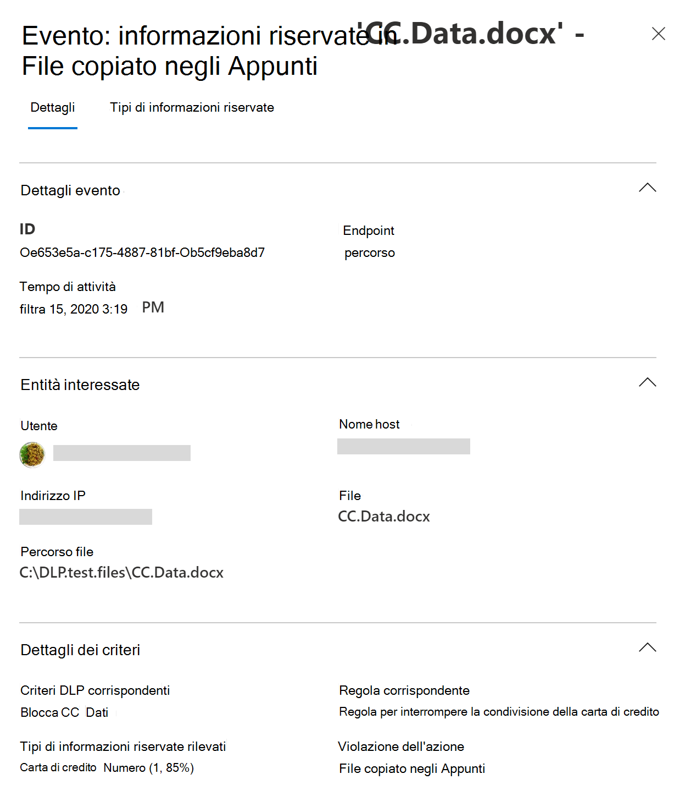

# Informazioni sulla prevenzione della perdita di datiLearn about data loss prevention

Le organizzazioni dispongono di informazioni riservate sotto il loro controllo, ad esempio dati finanziari, dati proprietari, numeri di carta di credito, registri sanitari o numeri di previdenza sociale.Organizations have sensitive information under their control such as financial data, proprietary data, credit card numbers, health records, or social security numbers. Per proteggere questi dati sensibili e ridurre i rischi, è necessario un modo per impedire agli utenti di condividerli in modo inappropriato con persone che non dovrebbero averne.To help protect this sensitive data and reduce risk, they need a way to prevent their users from inappropriately sharing it with people who shouldn't have it. Questa procedura è denominata prevenzione della perdita dei dati (DLP).This practice is called data loss prevention (DLP).

In Microsoft 365, è possibile implementare la prevenzione della perdita dei dati definendo e applicando i criteri DLP.In Microsoft 365, you implement data loss prevention by defining and applying DLP policies. Con un criterio DLP, è possibile identificare, monitorare e proteggere automaticamente gli elementi sensibili tra:With a DLP policy, you can identify, monitor, and automatically protect sensitive items across:

- Microsoft 365 servizi quali Teams, Exchange, SharePoint e OneDriveMicrosoft 365 services such as Teams, Exchange, SharePoint, and OneDrive
- Office applicazioni quali Word, Excel e PowerPointOffice applications such as Word, Excel, and PowerPoint
- Windows 10 endpointWindows 10 endpoints
- app cloud non Microsoftnon-Microsoft cloud apps
- condivisioni file locali e SharePoint.on-premises file shares and on-premises SharePoint.

Microsoft 365 rileva gli elementi sensibili utilizzando un'analisi approfondita del contenuto, non semplicemente tramite una semplice analisi del testo.Microsoft 365 detects sensitive items by using deep content analysis, not by just a simple text scan. Il contenuto viene analizzato per le corrispondenze dei dati principali alle parole chiave, tramite la valutazione delle espressioni regolari, la convalida delle funzioni interne e le corrispondenze dei dati secondari che si trovano in prossimità della corrispondenza dei dati primari.Content is analyzed for primary data matches to keywords, by the evaluation of regular expressions, by internal function validation, and by secondary data matches that are in proximity to the primary data match. Oltre a ciò, DLP usa anche algoritmi di machine learning e altri metodi per rilevare il contenuto che corrisponde ai criteri DLP.Beyond that DLP also uses machine learning algorithms and other methods to detect content that matches your DLP policies.

## DLP fa parte dell'offerta di conformità Microsoft 365 più ampiaDLP is part of the larger Microsoft 365 Compliance offering

Microsoft 365 DLP è solo uno degli Microsoft 365 di conformità che verranno utilizzati per proteggere gli elementi sensibili ovunque vivano o in viaggio.Microsoft 365 DLP is just one of the Microsoft 365 Compliance tools that you will use to help protect your sensitive items wherever they live or travel. È consigliabile comprendere gli altri strumenti del set di Microsoft 365 conformità, il modo in cui si interrelano e funzionano meglio insieme.You should understand the other tools in the Microsoft 365 Compliance tools set, how they interrelate, and work better together.  Per ulteriori [informazioni sul processo di](protect-information.md) protezione delle informazioni, vedere Microsoft 365 strumenti di conformità.See, [Microsoft 365 compliance tools](protect-information.md) to learn more about the information protection process.

## Azioni di protezione dei criteri DLPProtective actions of DLP policies

Microsoft 365 I criteri DLP consentono di monitorare le attività che gli utenti esereranno su elementi sensibili in pausa, elementi sensibili in transito o elementi sensibili in uso ed eseguire azioni di protezione.Microsoft 365 DLP policies are how you monitor the activities that users take on sensitive items at rest, sensitive items in transit, or sensitive items in use and take protective actions. Ad esempio, quando un utente tenta di eseguire un'azione non consentita, ad esempio copiando un elemento sensibile in una posizione non approvata o condividendo informazioni mediche in un messaggio di posta elettronica o in altre condizioni previste in un criterio, DLP può:For example, when a user attempts to take a prohibited action, like copying a sensitive item to an unapproved location or sharing medical information in an email or other conditions laid out in a policy, DLP can:

- mostrare un suggerimento per i criteri popup all'utente che li avvisa che potrebbe tentare di condividere un elemento sensibile in modo inappropriatoshow a pop-up policy tip to the user that warns them that they may be trying to share a sensitive item inappropriately
- bloccare la condivisione e, tramite un suggerimento per i criteri, consentire all'utente di ignorare il blocco e acquisire la giustificazione degli utentiblock the sharing and, via a policy tip, allow the user to override the block and capture the users' justification
- bloccare la condivisione senza l'opzione di sostituzioneblock the sharing without the override option
- per i dati in pausa, gli elementi sensibili possono essere bloccati e spostati in un percorso di quarantena sicurofor data at rest, sensitive items can be locked and moved to a secure quarantine location
- per Teams chat, le informazioni riservate non verranno visualizzatefor Teams chat, the sensitive information will not be displayed

Tutte le attività monitorate DLP vengono registrate nel Microsoft 365 di controllo [per](search-the-audit-log-in-security-and-compliance.md) impostazione predefinita e instradate a [Esplora attività.](data-classification-activity-explorer.md)All DLP monitored activities are recorded to the [Microsoft 365 Audit log](search-the-audit-log-in-security-and-compliance.md) by default and routed to [Activity explorer](data-classification-activity-explorer.md). Quando un utente esegue un'azione che soddisfa i criteri di un criterio DLP e sono stati configurati avvisi, DLP fornisce avvisi nel dashboard di gestione degli avvisi [DLP.](dlp-configure-view-alerts-policies.md)When a user performs an action that meets the criteria of a DLP policy, and you have alerts configured, DLP provides alerts in the [DLP alert management dashboard](dlp-configure-view-alerts-policies.md).

## Ciclo di vita DLPDLP lifecycle

Un'implementazione DLP in genere segue queste fasi principali.A DLP implementation typically follows these major phases.

- [Piano per la prevenzione della perdita dei datiPlan for DLP](#plan-for-dlp)
- [Preparare la prevenzione della perdita dei datiPrepare for DLP](#prepare-for-dlp)
- [Distribuire i criteri nell'ambiente di produzioneDeploy your policies in production](#deploy-your-policies-in-production)

<!--ADD DIAGRAM OF THE DLP LIFECYCLE WORK ON WITH MAS-->

### Piano per la prevenzione della perdita dei datiPlan for DLP

Microsoft 365 Il monitoraggio e la protezione DLP sono nativi delle applicazioni che gli utenti usano ogni giorno.Microsoft 365 DLP monitoring and protection are native to the applications that users use every day. Ciò consente di proteggere gli elementi sensibili delle organizzazioni dalle attività rischiose anche se gli utenti non sono abituati a pensare e pratiche di prevenzione della perdita di dati.This helps to protect your organizations' sensitive items from risky activities even if your users are unaccustomed to data loss prevention thinking and practices. Se l'organizzazione e gli utenti sono nuovi delle procedure di prevenzione della perdita dei dati, l'adozione della prevenzione della perdita dei dati potrebbe richiedere una modifica ai processi aziendali e vi sarà un cambiamento di cultura per gli utenti.If your organization and your users are new to data loss prevention practices, the adoption of DLP may require a change to your business processes and there will be a culture shift for your users. Tuttavia, con una pianificazione, un test e un'ottimizzazione adeguati, i criteri DLP proteggono gli elementi sensibili riducendo al minimo eventuali interruzioni del processo aziendale.But, with proper planning, testing and tuning, your DLP policies will protect your sensitive items while minimizing any potential business process disruptions.

**Pianificazione della tecnologia per DLP****Technology planning for DLP**

Tenere presente che DLP come tecnologia è in grado di monitorare e proteggere i dati in pausa, i dati in uso e i dati in movimento tra servizi Microsoft 365, dispositivi Windows 10, condivisioni file locali e SharePoint locale.Keep in mind that DLP as a technology can monitor and protect your data at rest, data in use and data in motion across Microsoft 365 services, Windows 10 devices, on-premises file shares, and on-premises SharePoint. Esistono implicazioni di pianificazione per le diverse posizioni, il tipo di dati che si desidera monitorare e proteggere e le azioni da eseguire quando si verifica una corrispondenza dei criteri.There are planning implications for the different locations, the type of data you want to monitor and protect, and the actions to be taken when a policy match occurs.

**Pianificazione dei processi aziendali per DLP****Business processes planning for DLP**

I criteri DLP possono bloccare le attività proibite, ad esempio la condivisione inappropriata di informazioni riservate tramite posta elettronica.DLP policies can block prohibited activities, like inappropriate sharing of sensitive information via email. Durante la pianificazione dei criteri DLP, è necessario identificare i processi aziendali che toccano gli elementi sensibili.As you plan your DLP policies, you must identify the business processes that touch your sensitive items. I proprietari dei processi aziendali possono aiutare a identificare i comportamenti degli utenti appropriati che devono essere consentiti e comportamenti utente inappropriati da proteggere.The business process owners can help you identify appropriate user behaviors that should be allowed and inappropriate user behaviors that should be protected against. È consigliabile pianificare i criteri e distribuirli  in modalità test e valutarne l'impatto tramite Esplora attività prima di applicarli in modalità più restrittive.You should plan your policies and deploy them in test mode, and evaluate their impact via [activity explorer](data-classification-activity-explorer.md) first, before applying them in more restrictive modes.

**Pianificazione della cultura organizzativa per DLP****Organizational culture planning for DLP**

Un'implementazione DLP corretta dipende tanto dal fatto che gli utenti vengono addestrati e acclimati alle procedure di prevenzione della perdita dei dati, quanto da criteri ben pianificati e ottimizzati.A successful DLP implementation is as much dependent on getting your users trained and acclimated to data loss prevention practices as it is on well planned and tuned policies. Poiché gli utenti sono molto coinvolti, assicurarsi di pianificare la formazione anche per loro.Since your users are heavily involved, be sure to plan for training for them too. Puoi usare strategicamente i suggerimenti per i criteri per aumentare la consapevolezza con gli utenti prima di modificare l'applicazione dei criteri dalla modalità di test a quella più restrittiva.You can strategically use policy tips to raise awareness with your users before changing the policy enforcement from test mode to more restrictive modes.

<!--For more information on planning for DLP, including suggestions for deployment based on your needs and resources, see [Planning for Microsoft 365 data loss prevention](dlp-plan-for-dlp.md).-->

### Preparare la prevenzione della perdita dei datiPrepare for DLP

È possibile applicare i criteri DLP ai dati in fase di riposo, ai dati in uso e ai dati in movimento nelle posizioni, ad esempio:You can apply DLP policies to data at rest, data in use, and data in motion in locations, such as:

- Exchange Online posta elettronicaExchange Online email
- Siti di SharePoint OnlineSharePoint Online sites
- Account di OneDriveOneDrive accounts
- Messaggi di chat e canali di TeamsTeams chat and channel messages
- Microsoft Cloud App SecurityMicrosoft Cloud App Security
- Dispositivi Windows 10Windows 10 devices
- Archivi localiOn-premises repositories

Ognuno di essi dispone di prerequisiti diversi.Each one has different pre-requisites. Gli elementi sensibili in alcune posizioni, come Exchange online, possono essere portati sotto l'ombrello DLP semplicemente configurando un criterio che si applica a loro.Sensitive items in some locations, like Exchange online, can be brought under the DLP umbrella by just configuring a policy that applies to them. Altri, ad esempio archivi di file locali, richiedono una distribuzione dello scanner Azure Information Protection (AIP).Others, such as on-premises file repositories require a deployment of Azure Information Protection (AIP) scanner. Dovrai preparare l'ambiente, codificare i criteri e testarli accuratamente prima di attivare eventuali azioni di blocco.You'll need to prepare your environment, code draft policies, and test them thoroughly before activating any blocking actions.

### Distribuire i criteri nell'ambiente di produzioneDeploy your policies in production

#### Progettare i criteriDesign your policies

Per iniziare, definire gli obiettivi di controllo e come si applicano a ogni rispettivo carico di lavoro.Start by defining your control objectives, and how they apply across each respective workload. Bozza di un criterio che rappresenta gli obiettivi.Draft a policy that embodies your objectives. È possibile iniziare con un carico di lavoro alla volta o tra tutti i carichi di lavoro: non c'è ancora alcun impatto.Feel free to start with one workload at a time, or across all workloads - there's no impact yet.

#### Implementare criteri in modalità testImplement policy in test mode

Valutare l'impatto dei controlli implementandoli con un criterio DLP in modalità test.Evaluate the impact of the controls by implementing them with a DLP policy in test mode. È possibile applicare il criterio a tutti i carichi di lavoro in modalità test, in modo da ottenere l'intera gamma di risultati, ma è possibile iniziare con un carico di lavoro, se necessario.It's ok to apply the policy to all workloads in test mode, so that you can get the full breadth of results, but you can start with one workload if you need to.

#### Monitorare i risultati e ottimizzare i criteriMonitor outcomes and fine-tune the policy

Durante la modalità di test, monitorare i risultati del criterio e ottimizzarlo in modo che soddisfi gli obiettivi di controllo, garantendo al contempo di non influire negativamente o inavvertitamente sui flussi di lavoro e sulla produttività degli utenti validi.While in test mode, monitor the outcomes of the policy and fine-tune it so that it meets your control objectives while ensuring you aren't adversely or inadvertently impacting valid user workflows and productivity. Ecco alcuni esempi di elementi da ottimizzare:Here are some examples of things to fine-tune:

- regolazione delle posizioni e delle persone/luoghi all'interno o all'esterno dell'ambitoadjusting the locations and people/places that are in or out of scope
- ottimizzare le condizioni e le eccezioni utilizzate per determinare se un elemento e l'operazione eseguita corrispondono al criteriotune the conditions and exceptions that are used to determine if an item and what is being done with it matches the policy
- definizione/e delle informazioni riservatethe sensitive information definition/s
- le azionithe actions
- livello di restrizionithe level of restrictions
- aggiungere nuovi controlliadd new controls
- aggiungere nuovi utentiadd new people
- aggiungere nuove app con restrizioniadd new restricted apps
- aggiungere nuovi siti con restrizioniadd new restricted sites

#### Abilitare il controllo e ottimizzare i criteriEnable the control and tune your policies

Una volta che il criterio soddisfa tutti gli obiettivi, attivalo.Once the policy meets all your objectives, turn it on. Continuare a monitorare i risultati dell'applicazione dei criteri e ottimizzare in base alle esigenze.Continue to monitor the outcomes of the policy application and tune as needed. In generale, i criteri hanno effetto circa un'ora dopo essere stati attivati.In general, policies take effect about an hour after being turned on.

<!--See, LINK TO topic for SLAs for location specific  details-->

## Panoramica della configurazione dei criteri DLPDLP policy configuration overview

È possibile creare e configurare i criteri DLP in modo flessibile.You have flexibility in how you create and configure your DLP policies. Puoi iniziare da un modello predefinito e creare un criterio in pochi clic oppure puoi progettarne uno personalizzato da zero.You can start from a predefined template and create a policy in just a few clicks or you can design your own from the ground up. Indipendentemente dalla scelta, tutti i criteri DLP richiedono le stesse informazioni.No matter which you choose, all DLP policies require the same information from you.

1. **Scegliere ciò che si desidera monitorare:** Microsoft 365 con molti modelli di criteri predefiniti che consentono di iniziare o è possibile creare criteri personalizzati.**Choose what you want to monitor** - Microsoft 365 comes with many predefined policy templates to help you get started or you can create a custom policy.
    - Un modello di criteri predefinito: dati finanziari, dati medici e sanitari, dati sulla privacy tutti per vari paesi e aree geografiche.A predefined policy template: Financial data, Medical and health data, Privacy data all for various countries and regions.
    - Criteri personalizzati che utilizzano i tipi di informazioni riservate, le etichette di conservazione e le etichette di riservatezza disponibili.A custom policy that uses the available sensitive information types, retention labels, and sensitivity labels.
2. **Scegliere dove si desidera monitorare:** si selezionano una o più posizioni che si desidera che DLP monitori per le informazioni riservate.**Choose where you want to monitor** - You pick one or more locations that you want DLP to monitor for sensitive information. È possibile monitorare:You can monitor:

posizionelocation | includo/escluso dainclude/exclude by|
|---------|---------|
|Posta elettronica di ExchangeExchange email| gruppi di distribuzionedistribution groups|
|Siti di SharePointSharePoint sites |sitisites |
|Account di OneDriveOneDrive accounts |account o gruppi di distribuzioneaccounts or distribution groups |
|Messaggi di chat e canali di TeamsTeams chat and channel messages |accountaccounts |
|Dispositivi Windows 10Windows 10 devices |utente o gruppouser or group |
|Microsoft Cloud App SecurityMicrosoft Cloud App Security |istanzainstance |
|Archivi localiOn-premises repositories| percorso del file repositoryrepository file path|

3. **Scegliere le condizioni che devono essere soddisfatte** per applicare un criterio a un elemento. È possibile accettare condizioni preconfigurate o definire condizioni personalizzate.**Choose the conditions that must be matched for a policy to be applied to an item** - you can accept pre-configured conditions or define custom conditions. Ecco alcuni esempi:Some examples are:

- contiene un tipo specificato di informazioni riservate utilizzate in un determinato contesto.item contains a specified kind of sensitive information that is being used in a certain context. Ad esempio, 95 numeri di previdenza sociale da inviare tramite posta elettronica al destinatario all'esterno dell'organizzazione.For example, 95 social security numbers being emailed to recipient outside your org.
- l'elemento ha un'etichetta di riservatezza specificataitem has a specified sensitivity label
- l'elemento con informazioni riservate viene condiviso internamente o esternamenteitem with sensitive information is shared either internally or externally

4. **Scegliere l'azione da eseguire quando vengono soddisfatte** le condizioni dei criteri: le azioni dipendono dalla posizione in cui si sta verificando l'attività.**Choose the action to take when the policy conditions are met** - The actions depend on the location where the activity is happening.  Ecco alcuni esempi:Some examples are:

- SharePoint/Exchange/OneDrive: bloccare gli utenti esterni all'organizzazione che accedono al contenuto.SharePoint/Exchange/OneDrive: Block people who are outside your organization form accessing the content. Mostra all'utente un suggerimento e invia loro una notifica tramite posta elettronica che sta prendendo un'azione non consentita dal criterio DLP.Show the user a tip and send them an email notification that they are taking an action that is prohibited by the DLP policy.
- Teams Chat e canale: impedire la condivisione di informazioni riservate nella chat o nel canaleTeams Chat and Channel: Block sensitive information from being shared in the chat or channel
- Windows 10 Dispositivi: controlla o limita la copia di un elemento sensibile in un dispositivo USB rimovibileWindows 10 Devices: Audit or restrict copying a sensitive item to a removeable USB device
- Office App: mostra un popup che informa l'utente che sta impegnandosi in un comportamento rischioso e blocca o blocca ma consente l'override.Office Apps: Show a popup notifying the user that they are engaging in a risky behavior and block or block but allow override.
- Condivisioni file locali: spostare il file da cui è archiviato in una cartella di quarantenaOn-premises file shares: move the file from where it is stored to a quarantine folder

> [!NOTE]
> Le condizioni e le azioni da eseguire sono definite in un oggetto denominato Rule.The conditions and the actions to take are defined in an object called a Rule.

<!--## Create a DLP policy

All DLP policies are created and maintained in the Microsoft 365 Compliance center. See, INSERT LINK TO ARTICLE THAT WILL START WALKING THEM THROUGH THE POLICY CREATION PROCEDURES for more information.-->

Dopo aver creato un criterio DLP nel Centro conformità, questo viene archiviato in un archivio dei criteri centrale e quindi sincronizzato con le varie origini di contenuto, tra cui:After you create a DLP policy in the Compliance Center, it's stored in a central policy store, and then synced to the various content sources, including:

- Exchange Online e da qui con Outlook sul Web e Outlook.Exchange Online, and from there to Outlook on the web and Outlook.
- Siti di OneDrive for Business.OneDrive for Business sites.
- Siti di SharePoint Online.SharePoint Online sites.
- Applicazioni desktop di Office (Excel, PowerPoint e Word).Office desktop programs (Excel, PowerPoint, and Word).
- Messaggi di chat e canali di Microsoft Teams.Microsoft Teams channels and chat messages.

In seguito alla sincronizzazione del criterio con il percorso corretto, viene avviata la valutazione del contenuto e l'applicazione delle azioni.After the policy's synced to the right locations, it starts to evaluate content and enforce actions.

## Visualizzazione dei risultati dell'applicazione dei criteriViewing policy application results

DLP segnala una grande quantità di informazioni in Microsoft 365 monitoraggio, corrispondenze e azioni dei criteri e attività degli utenti.DLP reports a vast amount of information into Microsoft 365 from monitoring, policy matches and actions, and user activities. Dovrai usare e agire su queste informazioni per ottimizzare i criteri e le azioni di triage eseguite su elementi sensibili.You'll need to consume and act on that information to tune your policies and triage actions taken on sensitive items. La telemetria viene prima [Microsoft 365](search-the-audit-log-in-security-and-compliance.md#search-the-audit-log-in-the-compliance-center) log di controllo del Centro conformità, viene elaborata e si trasforma in diversi strumenti di creazione di report.The telemetry goes into the [Microsoft 365 Compliance center Audit Logs](search-the-audit-log-in-security-and-compliance.md#search-the-audit-log-in-the-compliance-center) first, is processed, and makes its way to different reporting tools. Ogni strumento di creazione di report ha uno scopo diverso.Each reporting tool has a different purpose.

### Dashboard avvisi DLPDLP Alerts Dashboard

Quando DLP esegue un'azione su un elemento sensibile, è possibile ricevere una notifica di tale azione tramite un avviso configurabile.When DLP takes an action on a sensitive item, you can be notified of that action via a configurable alert. Anziché disporre di questi avvisi in pila in una cassetta postale per il set di dati, il Centro conformità li rende disponibili nel dashboard di gestione degli avvisi [DLP.](dlp-configure-view-alerts-policies.md)Rather than having these alerts pile up in a mailbox for you to sift through, the Compliance center makes them available in the [DLP Alerts Management Dashboard](dlp-configure-view-alerts-policies.md). Utilizzare il dashboard degli avvisi DLP per configurare gli avvisi, esaminarli, valutarli e tenere traccia della risoluzione degli avvisi DLP.Use the DLP Alerts dashboard to configure alerts, review them, triage them and track resolution of DLP Alerts. Ecco un esempio di avvisi generati dalle corrispondenze dei criteri e dalle attività Windows 10 dispositivi.Here's an example of alerts generated by policy matches and activities from Windows 10 devices.

> [!div class="mx-imgBorder"]
> 

È anche possibile visualizzare i dettagli dell'evento associato con metadati completi nello stesso dashboardYou can also view details of the associated event with rich metadata in the same dashboard

> [!div class="mx-imgBorder"]
> 

### ReportReports

I [report DLP mostrano](view-the-dlp-reports.md#view-the-reports-for-data-loss-prevention) tendenze generali nel tempo e forniscono informazioni specifiche su:The [DLP reports](view-the-dlp-reports.md#view-the-reports-for-data-loss-prevention) show broad trends over time and give specific insights into:

- **Criteri DLP Corrisponde nel** tempo e filtra per intervallo di date, posizione, criterio o azione**DLP Policy Matches** over time and filter by date range, location, policy, or action
- **Le corrispondenze degli eventi** imprevisti DLP mostrano anche le corrispondenze nel tempo, ma i pivot sugli elementi anziché sulle regole dei criteri.**DLP incident matches** also shows matches over time, but pivots on the items rather than the policy rules.
- **I falsi positivi e le sostituzioni DLP** mostrano il conteggio dei falsi positivi e, se configurati, le sostituzioni dell'utente insieme alla giustificazione dell'utente.**DLP false positives and overrides** shows the count of false positives and, if configured, user-overrides along with the user justification.

### Esplora attività DLPDLP Activity Explorer

Nella scheda Esplora attività della  pagina DLP il filtro Attività è stato preimpostato *su DLPRuleMatch.*The Activity explorer tab on the DLP page has the *Activity* filter preset to *DLPRuleMatch*. Usa questo strumento per esaminare le attività relative al contenuto che contiene informazioni riservate o a cui sono state applicate etichette, ad esempio quali etichette sono state modificate, i file sono stati modificati e sono state applicate corrispondenze a una regola.Use this tool to review activity related to content that contains sensitive info or has labels applied, such as what labels were changed, files were modified, and matched a rule.

Per altre informazioni, vedi [Introduzione a Esplora attività](data-classification-activity-explorer.md)For more information, see [Get started with activity explorer](data-classification-activity-explorer.md)

Per ulteriori informazioni su Microsoft 365 DLP, vedere:To learn more about Microsoft 365 DLP, see:

- [Informazioni sulla prevenzione della perdita di dati degli endpoint di Microsoft 365Learn about Microsoft 365 Endpoint data loss prevention](endpoint-dlp-learn-about.md)
- [Informazioni sul criterio predefinito per la prevenzione della perdita di dati in Microsoft Teams (anteprima)Learn about the default data loss prevention policy in Microsoft Teams (preview)](dlp-teams-default-policy.md)
- [Informazioni sullo scanner locale per la prevenzione della perdita dei dati di Microsoft 365 (anteprima)Learn about the Microsoft 365 data loss prevention on-premises scanner (preview)](dlp-on-premises-scanner-learn.md)
- [Informazioni sull'Estensione della conformità Microsoft (anteprima)Learn about the Microsoft Compliance Extension (preview)](dlp-chrome-learn-about.md)
- [Informazioni sulla dashboard degli avvisi per la prevenzione delle perdita dei datiLearn about the data loss prevention Alerts dashboard](dlp-alerts-dashboard-learn.md)

Per informazioni su come usare la prevenzione della perdita dei dati per conformarsi alle normative sulla privacy dei dati, vedere [Deploy information protection for data privacy regulations with Microsoft 365](../solutions/information-protection-deploy.md) (aka.ms/m365dataprivacy).To learn how to use data loss prevention to comply with data privacy regulations, see [Deploy information protection for data privacy regulations with Microsoft 365](../solutions/information-protection-deploy.md)  (aka.ms/m365dataprivacy).
