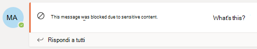
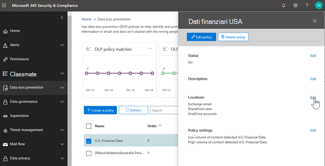
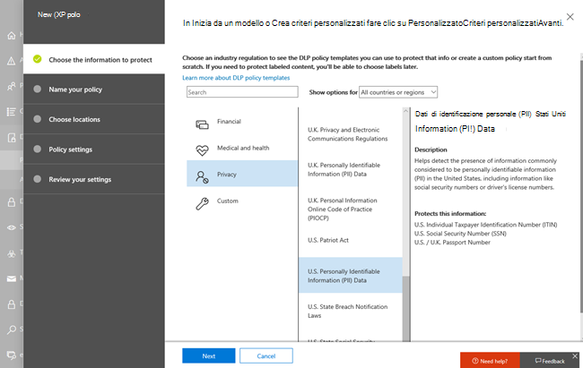
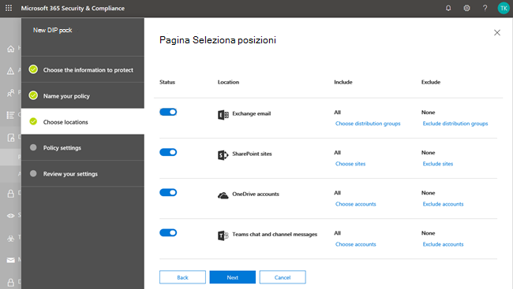

# Prevenzione della perdita di dati e Microsoft TeamsData loss prevention and Microsoft Teams

> [!NOTE]
> Le funzionalità di prevenzione della perdita dei dati sono state aggiunte di recente ai messaggi di chat e canali di Microsoft Teams per gli utenti con licenza di Office 365 Advanced Compliance, che è disponibile come opzione indipendente e incluso in Office 365 E5 e Microsoft 365 E5 Compliance.Data loss prevention capabilities were recently added to Microsoft Teams chat and channel messages for users licensed for Office 365 Advanced Compliance, which is available as a standalone option and is included in Office 365 E5 and Microsoft 365 E5 Compliance. Office 365 e Microsoft 365 E3 includono la protezione DLP per SharePoint Online, OneDrive ed Exchange Online.Office 365 and Microsoft 365 E3 include DLP protection for SharePoint Online, OneDrive, and Exchange Online. Questo include anche i file condivisi tramite team perché i team utilizzano SharePoint Online e OneDrive per condividere file.This also includes files that are shared through Teams because Teams uses SharePoint Online and OneDrive to share files.
Il supporto per la protezione DLP in teams chat richiede E5.Support for DLP protection in Teams Chat requires E5.
Per altre informazioni sui requisiti di licenza, vedere [Linee guida per le licenze dei servizi a livello di tenant di Microsoft 365](https://docs.microsoft.com/office365/servicedescriptions/microsoft-365-service-descriptions/microsoft-365-tenantlevel-services-licensing-guidance).To learn more about licensing requirements, see [Microsoft 365 Tenant-Level Services Licensing Guidance](https://docs.microsoft.com/office365/servicedescriptions/microsoft-365-service-descriptions/microsoft-365-tenantlevel-services-licensing-guidance).

## Panoramica di DLP per Microsoft TeamsOverview of DLP for Microsoft Teams

Recentemente, le funzionalità di [prevenzione della perdita di dati](data-loss-prevention-policies.md) (DLP) sono state estese per includere i messaggi di chat e di canale di Microsoft teams, **inclusi i messaggi privati**.Recently, [data loss prevention](data-loss-prevention-policies.md) (DLP) capabilities were extended to include Microsoft Teams chat and channel messages, **including private channel messages**.

Se l'organizzazione ha DLP, è ora possibile definire criteri che impediscono agli utenti di condividere le informazioni riservate in un canale di Microsoft teams o in una sessione di chat.If your organization has DLP, you can now define policies that prevent people from sharing sensitive information in a Microsoft Teams channel or chat session. Di seguito sono riportati alcuni esempi del funzionamento di questa protezione:Here are some examples of how this protection works:

- **Esempio 1: protezione delle informazioni riservate nei messaggi**.**Example 1: Protecting sensitive information in messages**. Si supponga che un utente tenti di condividere le informazioni riservate in una chat o un canale di team con gli ospiti (utenti esterni).Suppose that someone attempts to share sensitive information in a Teams chat or channel with guests (external users). Se è stato definito un criterio DLP per evitare questo, vengono eliminati i messaggi con informazioni riservate inviate a utenti esterni.If you have a DLP policy defined to prevent this, messages with sensitive information that are sent to external users are deleted. Questo accade automaticamente, e in pochi secondi, in base al modo in cui viene configurato il criterio DLP.This happens automatically, and within seconds, according to how your DLP policy is configured.

    > [!NOTE]
    > DLP per Microsoft teams blocca i contenuti sensibili quando sono condivisi con gli utenti di Microsoft teams che hanno:DLP for Microsoft Teams blocks sensitive content when shared with Microsoft Teams users who have: - [accesso Guest](https://docs.microsoft.com/MicrosoftTeams/guest-access) in team e canali; o- [guest access](https://docs.microsoft.com/MicrosoftTeams/guest-access) in teams and channels; or - [accesso esterno](https://docs.microsoft.com/MicrosoftTeams/manage-external-access) nelle riunioni e nelle sessioni di chat.- [external access](https://docs.microsoft.com/MicrosoftTeams/manage-external-access) in meetings and chat sessions. 
DLP per le sessioni di chat esterne funzionerà solo se il mittente e il destinatario sono solo in modalità teams e utilizzano [Microsoft teams native Federation](https://docs.microsoft.com/microsoftteams/manage-external-access).DLP for external chat sessions will only work if both the sender and the receiver are in Teams Only mode and using [Microsoft Teams native federation](https://docs.microsoft.com/microsoftteams/manage-external-access). DLP per i team non blocca i messaggi nell' [interoperabilità](https://docs.microsoft.com/microsoftteams/teams-and-skypeforbusiness-coexistence-and-interoperability#interoperability-of-teams-and-skype-for-business) con Skype for business o le sessioni di Chat federate non native.DLP for Teams does not block messages in [interop](https://docs.microsoft.com/microsoftteams/teams-and-skypeforbusiness-coexistence-and-interoperability#interoperability-of-teams-and-skype-for-business) with Skype for Business or non-native federated chat sessions.

- **Esempio 2: protezione delle informazioni riservate nei documenti**.**Example 2: Protecting sensitive information in documents**. Si supponga che un utente tenti di condividere un documento con gli utenti in un canale o in una chat di Microsoft teams e che il documento contenga informazioni riservate.Suppose that someone attempts to share a document with guests in a Microsoft Teams channel or chat, and the document contains sensitive information. Se si dispone di un criterio DLP definito per evitare questo, il documento non verrà aperto per tali utenti.If you have a DLP policy defined to prevent this, the document won't open for those users. Si noti che in questo caso, il criterio DLP deve includere SharePoint e OneDrive in modo che la protezione sia sul posto.Note that in this case, your DLP policy must include SharePoint and OneDrive in order for protection to be in place. (Questo è un esempio di DLP per SharePoint che viene visualizzato in Microsoft teams e quindi richiede che gli utenti siano concessi in licenza per Office 365 DLP (incluso in Office 365 E3), ma non richiede che gli utenti vengano concessi in licenza per Office 365 Advanced Compliance.(This is an example of DLP for SharePoint that shows up in Microsoft Teams, and therefore requires that users are licensed for Office 365 DLP (included in Office 365 E3), but does not require users to be licensed for Office 365 Advanced Compliance.)

## Suggerimenti per i criteri per informare gli utentiPolicy tips help educate users

Analogamente a come funziona DLP in [Exchange, Outlook, Outlook sul Web](data-loss-prevention-policies.md#policy-evaluation-in-exchange-online-outlook-and-outlook-on-the-web), [SharePoint Online, siti di OneDrive for business](data-loss-prevention-policies.md#policy-evaluation-in-onedrive-for-business-and-sharepoint-online-sites)e [client desktop di Office, i](data-loss-prevention-policies.md#policy-evaluation-in-the-office-desktop-programs)suggerimenti per i criteri vengono visualizzati quando un'azione è in conflitto con un criterio DLP.Similar to how DLP works in [Exchange, Outlook, Outlook on the web](data-loss-prevention-policies.md#policy-evaluation-in-exchange-online-outlook-and-outlook-on-the-web), [SharePoint Online, OneDrive for Business sites](data-loss-prevention-policies.md#policy-evaluation-in-onedrive-for-business-and-sharepoint-online-sites), and [Office desktop clients](data-loss-prevention-policies.md#policy-evaluation-in-the-office-desktop-programs), policy tips appear when an action conflicts with a DLP policy. Di seguito è riportato un esempio di suggerimento per i criteri:Here's an example of a policy tip:

In questo caso, il mittente ha tentato di condividere un numero di previdenza sociale in un canale Microsoft teams.In this case, the sender attempted to share a social security number in a Microsoft Teams channel. **Che cosa è possibile fare?** collegamento consente di aprire una finestra di dialogo in cui sono disponibili opzioni per il mittente per risolvere il problema.The **What can I do?** link opens a dialog box that provides options for the sender to resolve the issue. Si noti che in questo caso, il mittente può scegliere di ignorare il criterio oppure inviare una notifica a un amministratore per verificarlo e risolverlo.Notice that in this case, the sender can opt to override the policy, or notify an admin to review and resolve it.

Nell'organizzazione è possibile scegliere di consentire agli utenti di eseguire l'override di un criterio DLP.In your organization, you can choose to allow users to override a DLP policy. Quando si configurano i criteri DLP, è possibile utilizzare i suggerimenti per i criteri predefiniti oppure [personalizzare i suggerimenti](#to-customize-policy-tips) per i criteri per l'organizzazione.And, when you configure your DLP policies, you can use the default policy tips, or [customize policy tips](#to-customize-policy-tips) for your organization.

Tornando all'esempio, in cui un mittente ha condiviso un numero di previdenza sociale in un canale teams, ecco cosa ha visto il destinatario:Returning to our example, where a sender shared a social security number in a Teams channel, here's what the recipient saw:

La **che cos'è?** collegamento consente di aprire un [articolo](data-loss-prevention-policies.md) sui criteri DLP, che consente di spiegare perché il messaggio è stato bloccato.The **What's this?** link opens an [article](data-loss-prevention-policies.md) about DLP policies, which helps explain why the message was blocked.

### Per personalizzare i suggerimenti per i criteriTo customize policy tips

Per eseguire questa attività, è necessario essere assegnati a un ruolo che disponga delle autorizzazioni per la modifica dei criteri DLP.To perform this task, you must be assigned a role that has permissions to edit DLP policies. Per ulteriori informazioni, vedere [Permissions](data-loss-prevention-policies.md#permissions).To learn more, see [Permissions](data-loss-prevention-policies.md#permissions).

1. Accedere al centro sicurezza & conformità ( [https://protection.office.com](https://protection.office.com) ) ed eseguire l'accesso.Go to the Security & Compliance Center ([https://protection.office.com](https://protection.office.com)) and sign in.

2. Scegliere **i criteri di prevenzione della perdita di dati**  >  **Policy**.Choose **Data loss prevention** > **Policy**.

3. Selezionare un criterio e fare clic su **modifica**accanto a **impostazioni criterio**.Select a policy, and next to **Policy settings**, choose **Edit**.

4. Creare una nuova regola o modificare una regola esistente per il criterio.Either create a new rule, or edit an existing rule for the policy.  

5. Nella scheda **notifiche utente** selezionare **Personalizza il testo del messaggio di posta elettronica** e/o **Personalizza le opzioni di testo del suggerimento per i criteri** .On the **User notifications** tab, select **Customize the email text** and/or **Customize the policy tip text** options.    

6. Specificare il testo che si desidera utilizzare per le notifiche di posta elettronica e/o suggerimenti per i criteri e quindi scegliere **Salva**.Specify the text you want to use for email notifications and/or policy tips, and then choose **Save**.

7. Nella scheda **impostazioni dei criteri** scegliere **Salva**.On the **Policy settings** tab, choose **Save**.

Consentire circa un'ora affinché le modifiche vengano elaborate tramite il Data Center e sincronizzate con gli account utente.Allow approximately one hour for your changes to work their way through your data center and sync to user accounts.
 <!-- why are these syncing to user accounts? -->
## Aggiungere Microsoft teams come percorso ai criteri DLP esistentiAdd Microsoft Teams as a location to existing DLP policies

Per eseguire questa attività, è necessario essere assegnati a un ruolo che disponga delle autorizzazioni per la modifica dei criteri DLP.To perform this task, you must be assigned a role that has permissions to edit DLP policies. Per ulteriori informazioni, vedere [Permissions](data-loss-prevention-policies.md#permissions).To learn more, see [Permissions](data-loss-prevention-policies.md#permissions).

1. Accedere al centro sicurezza & conformità ( [https://protection.office.com](https://protection.office.com) ) ed eseguire l'accesso.Go to the Security & Compliance Center ([https://protection.office.com](https://protection.office.com)) and sign in.

2. Scegliere **i criteri di prevenzione della perdita di dati**  >  **Policy**.Choose **Data loss prevention** > **Policy**.

3. Selezionare un criterio e esaminare i valori in **percorsi**.Select a policy, and look at the values under **Locations**. Se si visualizzano **i messaggi chat e canali del team**, è tutto pronto.If you see **Teams chat and channel messages**, you're all set. In caso contrario, fare clic su **modifica**.If you don't, click **Edit**.  

4. Nella colonna **stato** , attiva il criterio per i **messaggi di chat e di canale dei team**.In the **Status** column, turn the policy on for **Teams chat and channel messages**.  

5. Mantenere le impostazioni predefinite di tutti gli account oppure specificare gli account da includere o escludere.Keep the default settings of all accounts, or specify which accounts to include or exclude.

6. Fare clic su **Salva**.Click **Save**.

Consentire circa un'ora affinché le modifiche vengano elaborate tramite il Data Center e sincronizzate con gli account utente.Allow approximately one hour for your changes to work their way through your data center and sync to user accounts.
<!-- again, why user accounts? -->
## Definire un nuovo criterio DLP per Microsoft TeamsDefine a new DLP policy for Microsoft Teams

Per eseguire questa attività, è necessario essere assegnati a un ruolo che disponga delle autorizzazioni per la modifica dei criteri DLP.To perform this task, you must be assigned a role that has permissions to edit DLP policies. Per ulteriori informazioni, vedere [Permissions](data-loss-prevention-policies.md#permissions).To learn more, see [Permissions](data-loss-prevention-policies.md#permissions).

1. Accedere al centro sicurezza & conformità ( [https://protection.office.com](https://protection.office.com) ) ed eseguire l'accesso.Go to the Security & Compliance Center ([https://protection.office.com](https://protection.office.com)) and sign in.

2. Scegliere criteri di **prevenzione della perdita**  >  **Policy**  >  **di dati + creare un criterio**.Choose **Data loss prevention** > **Policy** > **+ Create a policy**.

3. Scegliere un [modello](data-loss-prevention-policies.md#dlp-policy-templates)e quindi fare clic su **Avanti**.Choose a [template](data-loss-prevention-policies.md#dlp-policy-templates), and then choose **Next**. In questo esempio, è stato scelto il modello di dati di identificazione personale degli Stati Uniti.In our example, we chose the U.S. Personally Identifiable Information Data template.  

4. Nella scheda **denominare i criteri** specificare un nome e una descrizione per il criterio e quindi fare clic su **Avanti**.On the **Name your policy** tab, specify a name and description for the policy, and then choose **Next**.

5. Nella scheda **Scegli percorsi** mantenere l'impostazione predefinita di tutti i percorsi oppure selezionare **Consenti percorsi specifici**e quindi scegliere **Avanti**.On the **Choose locations** tab, keep the default setting of all locations, or select **Let me choose specific locations**, and then choose **Next**. Se sono stati scelti percorsi specifici, selezionarli per il criterio DLP e quindi scegliere **Avanti**.If you chose specific locations, select them for your DLP policy, and then choose **Next**.  
    > [!NOTE]
    > Se si desidera verificare che i documenti che contengono informazioni riservate non siano condivisi in modo improprio nei team, verificare che i **siti di SharePoint** e gli **account di OneDrive** siano attivati, insieme ai **messaggi di chat e di canale dei team**.If you want to make sure documents that contain sensitive information are not shared inappropriately in Teams, make sure **SharePoint sites** and **OneDrive accounts** are turned on, along with **Teams chat and channel messages**.

 

6. Nella scheda **impostazioni dei criteri** , in **Personalizza il tipo di contenuto che si desidera proteggere**, mantenere le impostazioni predefinite semplici oppure scegliere **Usa impostazioni avanzate**e quindi scegliere **Avanti**.On the **Policy settings** tab, under **Customize the type of content you want to protect**, keep the default simple settings, or choose **Use advanced settings**, and then choose **Next**. Se si scelgono le impostazioni avanzate, è possibile creare o modificare regole per i criteri.If you choose advanced settings, you can create or edit rules for your policy. Per ottenere assistenza, vedere [Simple Settings vs Advanced Settings](data-loss-prevention-policies.md#simple-settings-vs-advanced-settings).(To get help with this, see [Simple settings vs. advanced settings](data-loss-prevention-policies.md#simple-settings-vs-advanced-settings).)

7.  Nella scheda **impostazioni dei criteri** , in **che cosa si desidera eseguire se vengono rilevate informazioni riservate?**, esaminare le impostazioni.On the **Policy settings** tab, under **What do you want to do if we detect sensitive info?**, review the settings. (Ecco dove è possibile scegliere se mantenere i suggerimenti per i [criteri e le notifiche di posta elettronica](use-notifications-and-policy-tips.md)predefiniti oppure personalizzarli).(Here's where you can choose to keep default [policy tips and email notifications](use-notifications-and-policy-tips.md), or customize them.)  Dopo aver completato la revisione o la modifica delle impostazioni, scegliere **Avanti**.When you're finished reviewing or editing settings, choose **Next**.

8. Nella scheda **impostazioni dei criteri** , in **fare in modo che si desideri disattivare il criterio o eseguire prima un test?**, scegliere se abilitare il criterio, [testarlo prima](data-loss-prevention-policies.md#roll-out-dlp-policies-gradually-with-test-mode)oppure tenerlo disattivato per ora, quindi scegliere **Avanti**.On the **Policy settings** tab, under **Do you want to turn on the policy or test things out first?**, choose whether to turn the policy on, [test it first](data-loss-prevention-policies.md#roll-out-dlp-policies-gradually-with-test-mode), or keep it turned off for now, and then choose **Next**.  

9. Nella scheda **Verifica le impostazioni** , esaminare le impostazioni per il nuovo criterio.On the **Review your settings** tab, review the settings for your new policy. Scegliere **modifica** per apportare modifiche.Choose **Edit** to make changes. Al termine, scegliere **Crea**.When you're finished, choose **Create**.

Consentire a circa un'ora che il nuovo criterio funzioni correttamente attraverso il Data Center e sincronizzare gli account utente.Allow approximately one hour for your new policy to work its way through your data center and sync to user accounts.

## Articoli correlatiRelated articles

[Creare, testare e ottimizzare un criterio di prevenzione della perdita dei datiCreate, test, and tune a DLP policy](create-test-tune-dlp-policy.md)

[Inviare notifiche di posta elettronica e visualizzare i suggerimenti per i criteri di prevenzione della perdita dei datiSend email notifications and show policy tips for DLP policies](use-notifications-and-policy-tips.md)
