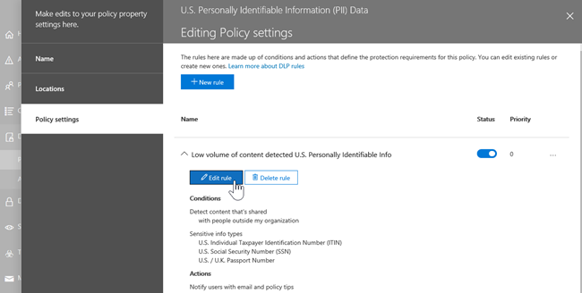

# Prevenzione della perdita dei dati e Microsoft TeamsData loss prevention and Microsoft Teams

Se l'organizzazione dispone di prevenzione della perdita dei dati (DLP), è possibile definire criteri che impediscono agli utenti di condividere informazioni riservate in un canale Microsoft Teams o una sessione di chat.If your organization has data loss prevention (DLP), you can define policies that prevent people from sharing sensitive information in a Microsoft Teams channel or chat session. Ecco alcuni esempi del funzionamento di questa protezione:Here are some examples of how this protection works:

- **Esempio 1: Protezione delle informazioni riservate nei messaggi**.**Example 1: Protecting sensitive information in messages**. Si supponga che un utente tenti di condividere informazioni riservate in Teams chat o canale con utenti guest (utenti esterni).Suppose that someone attempts to share sensitive information in a Teams chat or channel with guests (external users). Se si dispone di un criterio DLP definito per evitare questo problema, i messaggi con informazioni riservate inviate a utenti esterni vengono eliminati.If you have a DLP policy defined to prevent this, messages with sensitive information that are sent to external users are deleted. Ciò avviene automaticamente e in pochi secondi, in base alla configurazione del criterio DLP.This happens automatically, and within seconds, according to how your DLP policy is configured.

    > [!NOTE]
    > DLP per Microsoft Teams blocca il contenuto sensibile se condiviso con Microsoft Teams utenti che hanno:DLP for Microsoft Teams blocks sensitive content when shared with Microsoft Teams users who have: - [accesso guest](/MicrosoftTeams/guest-access) in team e canali; o- [guest access](/MicrosoftTeams/guest-access) in teams and channels; or - [accesso esterno](/MicrosoftTeams/manage-external-access) nelle riunioni e nelle sessioni di chat.- [external access](/MicrosoftTeams/manage-external-access) in meetings and chat sessions. 
DLP per le sessioni di chat esterne funzionerà solo se sia il mittente che il destinatario sono in modalità solo Teams e utilizzano Microsoft Teams [federazione nativa.](/microsoftteams/manage-external-access)DLP for external chat sessions will only work if both the sender and the receiver are in Teams Only mode and using [Microsoft Teams native federation](/microsoftteams/manage-external-access). DLP per Teams non blocca i messaggi in [interoperabilità](/microsoftteams/teams-and-skypeforbusiness-coexistence-and-interoperability#interoperability-of-teams-and-skype-for-business) con Skype for Business o con sessioni di chat federate non native.DLP for Teams does not block messages in [interop](/microsoftteams/teams-and-skypeforbusiness-coexistence-and-interoperability#interoperability-of-teams-and-skype-for-business) with Skype for Business or non-native federated chat sessions.

- **Esempio 2: protezione delle informazioni riservate nei documenti**.**Example 2: Protecting sensitive information in documents**. Si supponga che un utente tenti di condividere un documento con gli utenti guest in un canale Microsoft Teams o in una chat e che il documento contenga informazioni riservate.Suppose that someone attempts to share a document with guests in a Microsoft Teams channel or chat, and the document contains sensitive information. Se si dispone di un criterio DLP definito per evitare questo problema, il documento non verrà aperto per tali utenti.If you have a DLP policy defined to prevent this, the document won't open for those users. Il criterio di prevenzione della perdita dei dati deve includere SharePoint e OneDrive per far sì che la protezione sia in vigore.Your DLP policy must include SharePoint and OneDrive in order for protection to be in place. Si tratta di un esempio di DLP per SharePoint che viene visualizzato in Microsoft Teams e pertanto richiede che gli utenti siano concessi in licenza per Office 365 DLP (incluso in Office 365 E3), ma non richiedono agli utenti di essere concessi in licenza per Office 365 Advanced Compliance.This is an example of DLP for SharePoint that shows up in Microsoft Teams, and therefore requires that users are licensed for Office 365 DLP (included in Office 365 E3), but does not require users to be licensed for Office 365 Advanced Compliance.)

## Licenze DLP per Microsoft TeamsDLP Licensing for Microsoft Teams

[Le funzionalità di prevenzione della](dlp-learn-about-dlp.md) perdita dei dati sono state estese Microsoft Teams messaggi di chat e canali, inclusi i messaggi del canale **privato** per:[Data loss prevention](dlp-learn-about-dlp.md) capabilities were extended to include Microsoft Teams chat and channel messages, **including private channel messages** for:

- Office 365 E5/A5Office 365 E5/A5
- Microsoft 365 E5/A5Microsoft 365 E5/A5
- Microsoft 365 Protezione e governance delle informazioniMicrosoft 365 Information Protection and Governance
- Office 365 Advanced ComplianceOffice 365 Advanced Compliance

Office 365 e Microsoft 365 E3 includono la protezione DLP per SharePoint Online, OneDrive e Exchange Online.Office 365 and Microsoft 365 E3 include DLP protection for SharePoint Online, OneDrive, and Exchange Online. Sono inclusi anche i file condivisi tramite Teams perché Teams utilizza SharePoint Online e OneDrive per condividere i file.This also includes files that are shared through Teams because Teams uses SharePoint Online and OneDrive to share files.

Il supporto per la protezione DLP in Teams Chat richiede E5.Support for DLP protection in Teams Chat requires E5.

Per altre informazioni sui requisiti di licenza, vedere [Linee guida per le licenze dei servizi a livello di tenant di Microsoft 365](https://docs.microsoft.com/office365/servicedescriptions/microsoft-365-service-descriptions/microsoft-365-tenantlevel-services-licensing-guidance/microsoft-365-security-compliance-licensing-guidance).To learn more about licensing requirements, see [Microsoft 365 Tenant-Level Services Licensing Guidance](https://docs.microsoft.com/office365/servicedescriptions/microsoft-365-service-descriptions/microsoft-365-tenantlevel-services-licensing-guidance/microsoft-365-security-compliance-licensing-guidance).

> [!IMPORTANT]
> DLP si applica solo ai messaggi effettivi nel thread di chat o canale.DLP applies only to the actual messages in the chat or channel thread. Le notifiche di attività, che includono un'anteprima breve dei  messaggi e vengono visualizzate in base alle impostazioni di notifica di un utente, non sono incluse in Teams DLP.Activity notifications -- which include a short message preview and appear based on a user's notification settings -- are **not** included in Teams DLP. Tutte le informazioni riservate presenti nella parte del messaggio visualizzata nell'anteprima rimarranno visibili nella notifica anche dopo l'applicazione del criterio DLP e la rimozione delle informazioni riservate del messaggio stesso.Any sensitive information present in the part of the message that appears in the preview will remain visible in the notification even after the DLP policy has been applied and removed sensitive information the message itself.

## Ambito della protezione DLPScope of DLP protection

La protezione DLP viene applicata in modo diverso Teams entità.DLP protection are applied differently to Teams entities.

|Account utente/Gruppi/ElencoUser Accounts/Groups/List  |Teams EntitàTeams Entity |Protezione DLP disponibileDLP protection available|
|---------|---------|---------|
|singoli account utenteindividual user accounts     |1:1/n chat1:1/n chats         |sìyes         |
|     |chat generaligeneral chats         |nono         |
|     |canali privatiprivate channels         |sìyes         |
|gruppi di sicurezza/liste di distribuzionesecurity groups/distribution lists  | 1:1/n chat1:1/n chats         |sìyes         |
|     |chat generaligeneral chats         |nono         |
|     |canali privatiprivate channels         |sìyes        |
|Microsoft 365 gruppoMicrosoft 365 group    |1:1/n chat1:1/n chats          |nono         |
|     |chat generaligeneral chats          |sìyes        |
|     |canali privatiprivate channels|nono| 

## I suggerimenti per i criteri aiutano a formare gli utentiPolicy tips help educate users

Analogamente al funzionamento di DLP in [Exchange, Outlook, Outlook sul Web,](data-loss-prevention-policies.md#policy-evaluation-in-exchange-online-outlook-and-outlook-on-the-web) [SharePoint Online, siti OneDrive for Business](data-loss-prevention-policies.md#policy-evaluation-in-onedrive-for-business-and-sharepoint-online-sites)e client desktop [Office](data-loss-prevention-policies.md#policy-evaluation-in-the-office-desktop-programs), i suggerimenti per i criteri vengono visualizzati quando viene attivata un'azione con un criterio DLP.Similar to how DLP works in [Exchange, Outlook, Outlook on the web](data-loss-prevention-policies.md#policy-evaluation-in-exchange-online-outlook-and-outlook-on-the-web), [SharePoint Online, OneDrive for Business sites](data-loss-prevention-policies.md#policy-evaluation-in-onedrive-for-business-and-sharepoint-online-sites), and [Office desktop clients](data-loss-prevention-policies.md#policy-evaluation-in-the-office-desktop-programs), policy tips appear when an action triggers with a DLP policy. Ecco un esempio di suggerimento per i criteri:Here's an example of a policy tip:

In questo caso, il mittente ha tentato di condividere un numero di previdenza sociale in Microsoft Teams canale.Here, the sender attempted to share a social security number in a Microsoft Teams channel. Il **collegamento What can I do?** apre una finestra di dialogo che consente al mittente di risolvere il problema.The **What can I do?** link opens a dialog box that provides options for the sender to resolve the issue. Si noti che il mittente può scegliere di ignorare il criterio o inviare una notifica a un amministratore per esaminarlo e risolverlo.Notice that, the sender can opt to override the policy, or notify an admin to review and resolve it.

Nell'organizzazione, è possibile scegliere di consentire agli utenti di ignorare un criterio DLP.In your organization, you can choose to allow users to override a DLP policy. Quando si configurano i criteri DLP, è possibile utilizzare i suggerimenti per i criteri predefiniti o [personalizzare i suggerimenti per](#to-customize-policy-tips) i criteri per l'organizzazione.When you configure your DLP policies, you can use the default policy tips, or [customize policy tips](#to-customize-policy-tips) for your organization.

Tornando all'esempio, in cui un mittente ha condiviso un numero di previdenza sociale in un canale Teams, ecco cosa ha visto il destinatario:Returning to our example, where a sender shared a social security number in a Teams channel, here's what the recipient saw:

> [!div class="mx-imgBorder"]
> 

### Personalizzare suggerimenti per i criteriTo customize policy tips

Per eseguire questa attività, è necessario disporre di un ruolo con autorizzazioni per modificare i criteri di prevenzione della perdita di dati.To perform this task, you must be assigned a role that has permissions to edit DLP policies. Per ulteriori informazioni, vedere [Autorizzazioni](data-loss-prevention-policies.md#permissions).To learn more, see [Permissions](data-loss-prevention-policies.md#permissions).

1. Passare al Centro conformità ( [https://compliance.microsoft.com](https://compliance.microsoft.com) ) e accedere.Go to the Compliance Center ([https://compliance.microsoft.com](https://compliance.microsoft.com)) and sign in.

2. Scegliere **Prevenzione della perdita dei dati** > **Criteri**.Choose **Data loss prevention** > **Policy**.

3. Selezionare un criterio e accanto a **Impostazioni criteri** scegliere **Modifica.**Select a policy, and next to **Policy settings**, choose **Edit**.

4. Creare una nuova regola o modificare una regola esistente per il criterio.Either create a new rule, or edit an existing rule for the policy.

    > [!div class="mx-imgBorder"]
    > 

5. Nella scheda **Notifiche utente** seleziona Personalizza il testo del messaggio **di posta** elettronica e/o Personalizza le opzioni del testo del **suggerimento per i** criteri.On the **User notifications** tab, select **Customize the email text** and/or **Customize the policy tip text** options.

    > [!div class="mx-imgBorder"]
    >    

6. Specificare il testo che si desidera utilizzare per le notifiche di posta elettronica e/o i suggerimenti per i criteri, quindi scegliere **Salva**.Specify the text you want to use for email notifications and/or policy tips, and then choose **Save**.

7. Nella scheda **Impostazioni criteri** scegliere **Salva**.On the **Policy settings** tab, choose **Save**.

Consentire circa un'ora che le modifiche funzionino nel data center e si sincronizzano con gli account utente.Allow approximately one hour for your changes to work their way through your data center and sync to user accounts.
 <!-- why are these syncing to user accounts? -->

## Aggiungere Microsoft Teams come ubicazione per i criteri di prevenzione della perdita dei dati esistentiAdd Microsoft Teams as a location to existing DLP policies

Per eseguire questa attività, è necessario disporre di un ruolo con autorizzazioni per modificare i criteri di prevenzione della perdita di dati.To perform this task, you must be assigned a role that has permissions to edit DLP policies. Per ulteriori informazioni, vedere [Autorizzazioni](data-loss-prevention-policies.md#permissions).To learn more, see [Permissions](data-loss-prevention-policies.md#permissions).

1. Passare al Centro conformità ( [https://compliance.microsoft.com](https://compliance.microsoft.com) ) e accedere.Go to the Compliance Center ([https://compliance.microsoft.com](https://compliance.microsoft.com)) and sign in.

2. Scegliere **Prevenzione della perdita dei dati** > **Criteri**.Choose **Data loss prevention** > **Policy**.

3. Selezionare un criterio e osservare i valori in **Posizioni**.Select a policy, and look at the values under **Locations**. Se vengono visualizzati **Teams messaggi di chat e canali,** è tutto impostato.If you see **Teams chat and channel messages**, you're all set. In caso contrario, fare clic su **Modifica.**If you don't, click **Edit**.

    > [!div class="mx-imgBorder"]
    > 

4. Nella colonna **Stato** attivare il criterio per i messaggi di chat e canali **Teams messaggi di chat e canali.**In the **Status** column, turn the policy on for **Teams chat and channel messages**.

    > [!div class="mx-imgBorder"]
    > 

5. Nella scheda **Scegli posizioni** mantenere l'impostazione predefinita di tutti gli account oppure selezionare Consenti di scegliere **posizioni specifiche.**On the **Choose locations** tab, keep the default setting of all accounts, or select **Let me choose specific locations**. È possibile specificare quanto segue:You can specify:

    1. fino a 1000 singoli account da includere o escludereup to 1000 individual accounts to include or exclude
    1. liste di distribuzione e gruppi di sicurezza da includere o escludere.distribution lists and security groups to include or exclude. 
    <!-- 1. the shared mailbox of a shared channel. **This is a public preview feature.**--> 
    
6. Quindi scegliere **Avanti**.Then choose **Next**.

7. Fare clic su **Salva**.Click **Save**.

Consentire circa un'ora che le modifiche funzionino nel data center e si sincronizzano con gli account utente.Allow approximately one hour for your changes to work their way through your data center and sync to user accounts.
<!-- again, why user accounts? -->

## Definire nuovi criteri di prevenzione della perdita dei dati per Microsoft TeamsDefine a new DLP policy for Microsoft Teams

Per eseguire questa attività, è necessario disporre di un ruolo con autorizzazioni per modificare i criteri di prevenzione della perdita di dati.To perform this task, you must be assigned a role that has permissions to edit DLP policies. Per ulteriori informazioni, vedere [Autorizzazioni](data-loss-prevention-policies.md#permissions).To learn more, see [Permissions](data-loss-prevention-policies.md#permissions).

1. Passare al Centro conformità ( [https://compliance.microsoft.com](https://compliance.microsoft.com) ) e accedere.Go to the Compliance Center ([https://compliance.microsoft.com](https://compliance.microsoft.com)) and sign in.

2. Scegliere **Prevenzione della perdita dei dati** > **Criteri** > **+ Crea un criterio**.Choose **Data loss prevention** > **Policy** > **+ Create a policy**.

3. Scegliere un [modello](data-loss-prevention-policies.md#dlp-policy-templates)e quindi scegliere **Avanti**.Choose a [template](data-loss-prevention-policies.md#dlp-policy-templates), and then choose **Next**.

    In questo esempio è stato scelto il modello Dati personali degli Stati Uniti.In our example, we chose the U.S. Personally Identifiable Information Data template.

    > [!div class="mx-imgBorder"]
    >  

4. Nella scheda **Assegnare un nome al** criterio specificare un nome e una descrizione per il criterio e quindi scegliere **Avanti**.On the **Name your policy** tab, specify a name and description for the policy, and then choose **Next**.

5. Nella scheda **Scegli posizioni** mantenere l'impostazione predefinita di tutti gli account oppure selezionare Consenti di scegliere **posizioni specifiche.**On the **Choose locations** tab, keep the default setting of all accounts, or select **Let me choose specific locations**. È possibile specificare quanto segue:You can specify:

    1. fino a 1000 singoli account da includere o escludereup to 1000 individual accounts to include or exclude
    1. liste di distribuzione e gruppi di sicurezza da includere o escludere.distribution lists and security groups to include or exclude. **Si tratta di una funzionalità di anteprima pubblica.****This is a public preview feature.**
    <!-- 1. the shared mailbox of a shared channel. **This is a public preview feature.**-->  

    

    > [!NOTE]
    > Se si desidera verificare che i documenti contenenti informazioni riservate non siano condivisi in modo inappropriato in Teams, verificare che i siti e gli account **OneDrive** di **SharePoint** siano attivati, insieme ai messaggi di chat e canali di **Teams**.If you want to make sure documents that contain sensitive information are not shared inappropriately in Teams, make sure **SharePoint sites** and **OneDrive accounts** are turned on, along with **Teams chat and channel messages**.

6. Nella scheda **Impostazioni criteri,** in **Personalizza** il tipo di contenuto che si desidera proteggere, mantenere le impostazioni semplici predefinite oppure scegliere **Usa impostazioni avanzate** e quindi **avanti.**On the **Policy settings** tab, under **Customize the type of content you want to protect**, keep the default simple settings, or choose **Use advanced settings**, and then choose **Next**. Se si scelgono impostazioni avanzate, è possibile creare o modificare le regole per i criteri.If you choose advanced settings, you can create or edit rules for your policy. Per informazioni su questo argomento, vedere [Impostazioni semplici e impostazioni avanzate.](data-loss-prevention-policies.md#simple-settings-vs-advanced-settings)To get help with this, see [Simple settings vs. advanced settings](data-loss-prevention-policies.md#simple-settings-vs-advanced-settings).

7.  Nella scheda **Impostazioni dei criteri,** in Cosa vuoi fare se rileviamo **informazioni riservate?** esamina le impostazioni.On the **Policy settings** tab, under **What do you want to do if we detect sensitive info?**, review the settings. Ecco dove puoi scegliere se mantenere i suggerimenti e le notifiche di [posta](use-notifications-and-policy-tips.md)elettronica predefiniti o personalizzarli.Here's where you can choose to keep default [policy tips and email notifications](use-notifications-and-policy-tips.md), or customize them.

    > [!div class="mx-imgBorder"]
    > 

    Al termine della revisione o della modifica delle impostazioni, scegliere **Avanti.**When you're finished reviewing or editing settings, choose **Next**.

8. Nella  scheda Impostazioni criteri, in Si desidera attivare il criterio o testare prima gli **elementi?**, scegliere se attivare il [criterio,](dlp-overview-plan-for-dlp.md#policy-deployment)testarlo per primo o mantenerlo disattivato per il momento e quindi scegliere **Avanti**.On the **Policy settings** tab, under **Do you want to turn on the policy or test things out first?**, choose whether to turn the policy on, [test it first](dlp-overview-plan-for-dlp.md#policy-deployment), or keep it turned off for now, and then choose **Next**.

    > [!div class="mx-imgBorder"]
    > 

9. Nella scheda **Rivedere le impostazioni** esaminare le impostazioni per il nuovo criterio.On the **Review your settings** tab, review the settings for your new policy. Scegliere **Modifica** per apportare modifiche.Choose **Edit** to make changes. Al termine, scegliere **Crea**.When you're finished, choose **Create**.

Consentire circa un'ora per il funzionamento del nuovo criterio nel data center e la sincronizzazione con gli account utente.Allow approximately one hour for your new policy to work its way through your data center and sync to user accounts.

## Prevenire l'accesso esterno ai documenti sensibiliPrevent external access to sensitive documents

Per assicurarsi che SharePoint documenti contenenti informazioni riservate non siano accessibili da utenti guest esterni da SharePoint o Teams per impostazione predefinita, selezionare quanto segue:To ensure that SharePoint documents that contain sensitive information cannot be accessed by external guests either from SharePoint or Teams by default, select the following:

- È possibile assicurarsi che i documenti siano protetti fino all'analisi DLP e li contrassegni come sicuri da condividere contrassegnando i nuovi [file come sensibili per impostazione predefinita.](/sharepoint/sensitive-by-default)You can ensure that documents are protected until DLP scans and marks them as safe to share by [marking new files as sensitive by default](/sharepoint/sensitive-by-default).

- Struttura consigliata per il criterio DLPRecommended DLP policy structure

    - **Condizioni****Conditions**
        - Il contenuto contiene uno di questi tipi di informazioni riservate: [Selezionare tutto ciò che si applica]Content contains any of these sensitive information types: [Select all that apply]
        
        - Il contenuto viene condiviso da Microsoft 365 persone esterne all'organizzazioneContent is shared from Microsoft 365 with people outside my organization
        
          > [!div class="mx-imgBorder"]
          > 

    - **Azioni****Actions**
        - Limitare l'accesso al contenuto per gli utenti esterniRestrict access to the content for external users
        
        - Inviare una notifica agli utenti tramite messaggio di posta elettronica e suggerimenti per i criteriNotify users with email and policy tips
        
        - Inviare i report degli incidenti all'amministratoreSend incident reports to the Administrator
        
        > [!div class="mx-imgBorder"]
        > 

Criteri DLP in azione quando si tenta di condividere un documento in SharePoint contenente informazioni riservate con un guest esterno:DLP policy in action when attempting to share a document in SharePoint that contains sensitive information with an external guest:

> [!div class="mx-imgBorder"]
> 

Criteri DLP in azione quando guest tenta di aprire un documento in Teams con blocco esterno:DLP policy in action when guest attempts to open a document in Teams with block external:

> [!div class="mx-imgBorder"]
> 

## Articoli correlatiRelated articles

- [Creare, testare e ottimizzare un criterio di prevenzione della perdita dei datiCreate, test, and tune a DLP policy](create-test-tune-dlp-policy.md)
- [Inviare notifiche di posta elettronica e visualizzare i suggerimenti per i criteri di prevenzione della perdita dei datiSend email notifications and show policy tips for DLP policies](use-notifications-and-policy-tips.md)
