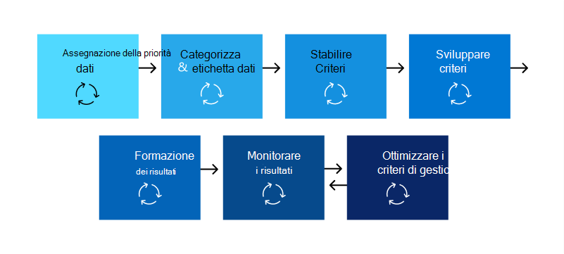

# Pianificare la prevenzione della perdita dei dati (DLP)

Ogni organizzazione pianifica e implementa la prevenzione della perdita dei dati (DLP) in modo diverso, perché le esigenze aziendali, gli obiettivi, le risorse e la situazione di ogni organizzazione sono univoci per loro. Tuttavia, esistono elementi comuni a tutte le implementazioni DLP riuscite. In questo articolo vengono presentate le procedure consigliate utilizzate dalle organizzazioni nella pianificazione dlp.

## Punti di partenza multipli

Molte organizzazioni scelgono di implementare DLP per conformarsi a varie normative governative o del settore. Ad esempio, il Regolamento generale sulla protezione dei dati (GDPR) dell'Unione europea o l'Health Insurance Portability and Accountability Act (HIPAA) o il California Consumer Privacy Act (CCPA). Implementano anche la prevenzione della perdita di dati per proteggere la loro proprietà intellettuale. Tuttavia, il luogo di partenza e la destinazione finale nel percorso DLP variano. 

Le organizzazioni possono iniziare il percorso DLP:

- da uno stato attivo della piattaforma, ad esempio se si desidera proteggere le informazioni nei messaggi Teams Chat e Canale o Windows 10 dispositivi
- sapere quali informazioni sensibili vogliono dare priorità alla protezione, ad esempio i record di assistenza sanitaria, e andare direttamente alla definizione dei criteri per proteggerli
- senza sapere quali sono le informazioni riservate, dove si trova e chi le sta facendo in modo che inizino con l'individuazione e la categorizzazione e prendano un approccio più metodico
- senza sapere quali sono le informazioni riservate, dove si trova o chi le sta facendo, ma si sposteranno direttamente alla definizione dei criteri e useranno tali risultati come punto di partenza e quindi affineranno i loro criteri da lì
- consapevoli della necessità di implementare lo stack completo Microsoft 365 Information Protection e quindi di adottare un approccio metodico a lungo termine

Questi sono solo alcuni esempi di come i clienti possono affrontare DLP e non importa da dove si inizia, Microsoft 365 DLP è abbastanza flessibile da supportare vari tipi di percorsi di protezione delle informazioni dall'inizio a una strategia di prevenzione della perdita dei dati completamente realizzata. 

## Panoramica del processo di pianificazione

Le [informazioni sulla prevenzione della perdita dei](dlp-learn-about-dlp.md#learn-about-data-loss-prevention) dati introducono i tre diversi aspetti del processo di pianificazione [dlp.](dlp-learn-about-dlp.md#plan-for-dlp) Verranno fornite informazioni più dettagliate sugli elementi comuni a tutti i piani DLP.

### Identificare le parti interessate

Una volta implementati, i criteri DLP possono essere applicati a grandi parti dell'organizzazione. L'IT non può sviluppare da solo un piano di ampio raggio senza conseguenze negative. È necessario identificare gli stakeholder che possono:

- descrivere le normative, le leggi e gli standard di settore a cui l'organizzazione è soggetta
- categorie di elementi sensibili da proteggere
- i processi aziendali in cui vengono utilizzati
- il comportamento rischioso che deve essere limitato
- definire le priorità dei dati da proteggere per primi in base alla riservatezza degli elementi e ai rischi coinvolti
- delineare il processo di revisione e correzione degli eventi di corrispondenza dei criteri DLP 
 
In generale, queste esigenze tendono a essere di protezione normativa e conformità dell'85% e del 15% di protezione della proprietà intellettuale. Ecco alcuni suggerimenti sui ruoli da includere nel processo di pianificazione:

- Responsabili normativi e di conformità
- Responsabile del rischio
- Responsabili legali
- Responsabili della sicurezza e della conformità
- Proprietari aziendali per gli elementi di dati
- Utenti aziendali
- IT

### Descrivere le categorie di informazioni riservate da proteggere

Le parti interessate descrivono quindi le categorie di informazioni riservate da proteggere e il processo aziendale in cui vengono utilizzate. Ad esempio, Microsoft 365 DLP definisce queste categorie:

- Finanza 
- Informazioni mediche e sanitarie
- Privacy
- Personalizzato

Le parti interessate potrebbero identificare le informazioni riservate come "Siamo un data processor, quindi dobbiamo implementare protezioni sulla privacy sulle informazioni dell'oggetto dei dati e sulle informazioni finanziarie".

 
  <!-- The business process is important as it informs the ‘data at rest’, ‘data in transit’, ‘data in use’ aspect of DLP planning and who should be sharing the items and who should not.-->

### Impostare obiettivi e strategia

Dopo aver identificato i cointeressati e aver individuato le informazioni riservate che hanno bisogno di protezione e dove vengono utilizzate, le parti interessate possono impostare i propri obiettivi di protezione e l'IT può sviluppare un piano di implementazione. 

 <!--
### Discovery
 for the locations (DLP workloads) of these types of items.  (mapping DLP locations and data at rest, data in transit, data in use)

### IT can start coding test policies
start small and always in test mode. Note that DLP policies can feed into insider risk.

### Business process owners help with tuning
 false positive/false negative results and fitting DLP into their business processes.

-->

### Impostare il piano di implementazione

Il piano di implementazione deve includere:

- Mappare lo stato iniziale e lo stato finale desiderato e i passaggi per andare dall'uno all'altro
- come verrà affrontata l'individuazione di elementi sensibili
- pianificazione dei criteri e l'ordine in cui verranno implementati
- come verranno soddisfatti i prerequisiti
- pianificazione del modo in cui i criteri verranno testati prima di passare all'applicazione
- come formare gli utenti finali
- come testare e ottimizzare i criteri
- come rivedere e aggiornare la strategia di prevenzione della perdita dei dati in base alle mutevoli esigenze normative, legali, standard del settore o della proprietà intellettuale e alle esigenze aziendali

#### Eseguire il mapping del percorso dall'inizio allo stato finale desiderato

Per comunicare con le parti interessate e impostare l'ambito del progetto, è essenziale documentare come l'organizzazione sta per arrivare dallo stato iniziale allo stato finale desiderato. Ecco una serie di passaggi comunemente usati per distribuire DLP. È necessario ottenere maggiori dettagli, ma è possibile utilizzarlo per inquadrare il percorso di adozione DLP.

#### Individuazione di elementi sensibili

Esistono diversi modi per individuare i singoli elementi sensibili e la posizione in cui si trovano. È possibile che le etichette di riservatezza sono già state distribuite oppure che si sia deciso di distribuire un criterio DLP generale in tutte le posizioni che individuano e controllano solo gli elementi. Per ulteriori informazioni, vedere [Know your data](information-protection.md#know-your-data).

#### Pianificazione dei criteri

All'inizio dell'adozione della prevenzione della perdita dei dati, è possibile usare queste domande per concentrare le attività di progettazione e implementazione dei criteri.

##### Quali leggi, normative e standard di settore devono essere conformi all'organizzazione?

Poiché molte organizzazioni vengono a DLP con l'obiettivo di conformità normativa, rispondere a questa domanda è un punto di partenza naturale per la pianificazione dell'implementazione DLP. Tuttavia, in quanto implementatore IT, probabilmente non sei posizionato per rispondere. Deve essere risposto dal team legale e dai dirigenti aziendali. 
 
**Esempio** L'organizzazione è soggetta al Regno Unito. normative finanziarie.

##### Quali elementi sensibili sono presenti nell'organizzazione che devono essere protetti da perdite?

Una volta che l'organizzazione sa dove si trova in termini di esigenze di conformità normativa, avrai un'idea di quali elementi sensibili devono essere protetti dalla perdita di dati e di come vuoi definire la priorità dell'implementazione dei criteri per proteggerli. In questo modo sarà possibile scegliere i modelli di criteri DLP più appropriati. Microsoft 365 viene fornito con modelli DLP preconfigurato per Financial, Medical and health, Privacy ed è possibile creare modelli personalizzati utilizzando il modello personalizzato. Durante la progettazione e la creazione dei criteri DLP effettivi, conoscere la risposta a questa domanda consente anche di scegliere il tipo di [informazioni riservate corretto.](sensitive-information-type-learn-about.md#learn-about-sensitive-information-types)

**Esempio** Per iniziare rapidamente, selezionare il modello `U.K. Financial Data` di criteri, che include `Credit Card Number` i tipi di informazioni riservate , e `EU Debit Card Number` `SWIFT Code` . 

##### Dove sono gli elementi sensibili e in quali processi aziendali sono coinvolti?

Gli elementi che contengono le informazioni riservate delle organizzazioni vengono utilizzati ogni giorno nel corso dell'attività. È necessario sapere dove possono verificarsi le istanze di tali informazioni riservate e in quali processi aziendali vengono utilizzate. Ciò consente di scegliere le posizioni giuste a cui applicare i criteri DLP. Microsoft 365 I criteri DLP vengono applicati alle posizioni:

- Posta elettronica di Exchange
- Siti di SharePoint
- Account di OneDrive
- Messaggi di chat e canali di Teams
- Windows 10 Dispositivi
- Microsoft Cloud App Security
- Archivi locali

**Esempio** I revisori interni dell'organizzazione stanno verificando un set di numeri di carta di credito. Mantengono un foglio di calcolo in un sito SharePoint sicuro. Molti dei dipendenti effettuano copie e le salvano nel sito OneDrive for Business lavoro, che viene sincronizzato con il Windows 10 dispositivo. Uno di questi incolla un elenco di 14 di essi in un messaggio di posta elettronica e tenta di inviarlo ai revisori esterni per la revisione. È necessario applicare il criterio al sito di SharePoint sicuro, a tutti i revisori interni OneDrive for Business account, ai dispositivi Windows 10 e alla posta Exchange posta elettronica.

##### Qual è la tolleranza delle organizzazioni per le perdite?

Gruppi diversi nell'organizzazione possono avere visualizzazioni diverse sul livello accettabile di perdita di elementi sensibili e cosa non lo è. Il raggiungimento della perfezione della perdita zero può avere un costo troppo elevato per l'azienda.

**Esempio** Il gruppo di sicurezza dell'organizzazione, insieme al team legale, sente che non dovrebbero essere condivisi i numeri di carta di credito con persone esterne all'organizzazione e insistono sulla perdita zero. Tuttavia, nell'ambito della revisione regolare dell'attività del numero di carta di credito, i revisori interni devono condividere alcuni numeri di carta di credito con revisori di terze parti. Se i criteri DLP proibiscono la condivisione di tutti i numeri di carta di credito all'esterno dell'organizzazione, si verifica un'interruzione significativa del processo aziendale e un costo aggiuntivo per ridurre l'interruzione per consentire ai revisori interni di completare il monitoraggio. Questo costo aggiuntivo è inaccettabile per i dirigenti. Per risolvere questo problema, è necessario che sia presente una conversazione interna per decidere un livello accettabile di perdita. Una volta deciso, il criterio può fornire eccezioni a determinati utenti per condividere le informazioni oppure può essere applicato in modalità solo controllo.

#### Pianificazione dei prerequisiti

Prima di poter monitorare alcuni percorsi DLP, è necessario che siano soddisfatti i prerequisiti. Vedi le **sezioni Prima di iniziare** di:

- [Introduzione allo scanner per la prevenzione della perdita dei dati locali (anteprima)](dlp-on-premises-scanner-get-started.md#before-you-begin)
- [Introduzione alla prevenzione della perdita di dati degli endpoint](endpoint-dlp-getting-started.md#before-you-begin)
- [Introduzione all'estensione di conformità Microsoft (anteprima)](dlp-chrome-get-started.md#before-you-begin)
- [Usare i criteri di prevenzione della perdita dei dati per le app cloud non Microsoft (anteprima)](dlp-use-policies-non-microsoft-cloud-apps.md#before-you-begin)

#### Distribuzione dei criteri

Quando si creano i criteri di prevenzione della perdita dei dati, considerare l'opportunità di implementarli gradualmente per valutarne l'impatto e testarne l'efficacia prima di applicarli. Ad esempio, non si desidera che un nuovo criterio DLP blocchi involontariamente l'accesso a migliaia di documenti o interrompa un processo aziendale esistente.
  
Se si creano criteri DLP con un forte impatto potenziale, si consiglia di attenersi alla sequenza riportata di seguito:
  
1. **Iniziare in modalità test senza suggerimenti per i criteri**, quindi utilizzare i report di prevenzione della perdita dei dati e i rapporti operazioni non consentite per valutare l'impatto. È possibile usare i report di prevenzione della perdita dei dati per visualizzare il numero, la posizione, il tipo e la gravità delle corrispondenze ai criteri. In base ai risultati, è possibile ottimizzare i criteri in base alle esigenze. In modalità test, i criteri DLP non avranno effetto sulla produttività degli utenti dell'organizzazione. Utilizzare inoltre questa fase per testare il flusso di lavoro per la revisione degli eventi DLP e la correzione dei problemi.
    
2. **Passare alla modalità test** con notifiche e criteri Suggerimenti in modo da iniziare a insegnare agli utenti i criteri di conformità e prepararli per i criteri che verranno applicati. È utile avere un collegamento a una pagina dei criteri dell'organizzazione che fornisce ulteriori dettagli sui criteri nel suggerimento per i criteri. In questa fase, è anche possibile chiedere agli utenti di segnalare falsi positivi in modo da poter perfezionare ulteriormente i criteri. Passare a questa fase dopo aver avuto la certezza che i risultati dell'applicazione dei criteri corrispondano a quanto avevano in mente gli stakeholder. 
    
3. **Avviare l'applicazione dei criteri** in modo che le azioni nelle regole siano applicate e i contenuti protetti. Continuare a eseguire il monitoraggio dei report di prevenzione della perdita dei dati e dei rapporti operazioni non consentite oppure delle notifiche per essere certi di ottenere i risultati desiderati. 

    

    È possibile disattivare un criterio di prevenzione della perdita dei dati in qualsiasi momento, disabilitando anche tutte le regole al suo interno. Tuttavia, ogni regola può essere disattivata anche singolarmente, regolandone lo stato nell'editor di regole.

    

    È anche possibile modificare la priorità di più regole in un criterio. Per farlo, aprire un criterio per modificarlo. In una riga per una regola, scegliere i puntini di sospensione (**...**), quindi scegliere un'opzione, ad esempio **Sposta giù** o **Porta su ultimo**.

    

#### Formazione per gli utenti finali

Quando viene attivato un criterio DLP, è possibile configurare i criteri in Invia notifiche di posta elettronica e visualizzare suggerimenti sui criteri per i criteri [DLP](use-notifications-and-policy-tips.md#send-email-notifications-and-show-policy-tips-for-dlp-policies) agli amministratori e agli utenti finali. Mentre i criteri sono ancora in modalità test e prima che siano impostati per applicare un'azione di blocco, i suggerimenti per i criteri sono modi utili per aumentare la consapevolezza dei comportamenti rischiosi per gli elementi sensibili e formare gli utenti a evitare tali comportamenti in futuro.  

#### Esaminare i requisiti DLP e la strategia di aggiornamento

Le normative, le leggi e gli standard di settore a cui è soggetta l'organizzazione cambieranno nel tempo e anche gli obiettivi aziendali per DLP. Assicurarsi di includere revisioni regolari di tutte queste aree in modo che l'organizzazione rimanga conforme e che l'implementazione DLP continui a soddisfare le esigenze aziendali.

## Approcci alla distribuzione

|Descrizione delle esigenze aziendali dei clienti  | approccio  |
|---------|---------|
|**Contoso Bank** è in un settore altamente regolamentato e ha molti tipi diversi di elementi sensibili in molte posizioni diverse.   - Sa quali tipi di informazioni riservate hanno la priorità principale.   - deve ridurre al minimo l'interruzione dell'attività durante l'implementazione dei criteri.   - dispone di risorse IT e può assumere esperti per pianificare, progettare la distribuzione   - ha un contratto di supporto premier con Microsoft| - Prendere il tempo necessario per comprendere quali normative devono rispettare e come devono conformarsi.   -Take the time to understand the better together value of the Microsoft 365 Information Protection stack   - Sviluppare uno schema di etichettatura di riservatezza per gli elementi con priorità e applicarlo   - Coinvolgere i proprietari dei processi aziendali  - Criteri di progettazione/codice, distribuzione in modalità test, formazione degli utenti  - ripeti|
|**TailSpin Toys** non sa cosa hanno o dove si trova e hanno poca o nessuna profondità di risorse. Usano Teams, OneDrive for Business e Exchange ampiamente.     |- Iniziare con criteri semplici per le posizioni con priorità.  - Monitorare ciò che viene identificato  - Applicare le etichette di riservatezza di conseguenza  - Affinare i criteri, formare gli utenti       |
|**Fabrikam** è una piccola startup e desidera proteggere la proprietà intellettuale e deve spostarsi rapidamente. Sono disposti a dedicare alcune risorse, ma non possono permettersi di assumere esperti esterni.  - Gli elementi sensibili sono tutti Microsoft 365 OneDrive for Business/SharePoint  - L'adozione di OneDrive for Business e SharePoint è lenta, i dipendenti/shadow IT usano DropBox e Google Drive per condividere/archiviare elementi  - I dipendenti valorizzano la velocità del lavoro rispetto alla disciplina di protezione dei dati  - Il cliente ha acquistato e acquistato tutti i 18 dipendenti nuovi Windows 10 dispositivi     |- Sfruttare i vantaggi del criterio DLP predefinito in Teams  - Utilizzare l'impostazione con restrizioni per impostazione predefinita per SharePoint elementi  - Distribuire criteri che impediscono la condivisione esterna  - Distribuire i criteri in posizioni con priorità  - Distribuire criteri in Windows 10 dispositivi  - Bloccare i caricamenti nell'OneDrive for Business cloud non OneDrive for Business      |

<!--

## Planning for workloads

### Exchange

### SharePoint

### OneDrive for Business

### Teams

### Windows 10 Devices

### Microsoft Cloud App Security (MCAS)

### On-premises Scanner
-->

## Vedere anche
- [Informazioni sulla prevenzione della perdita di dati](dlp-learn-about-dlp.md#learn-about-data-loss-prevention)
