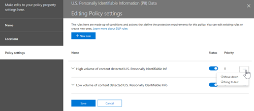

# Pianificare la prevenzione della perdita dei dati (DLP)Plan for data loss prevention (DLP)

Ogni organizzazione pianifica e implementa la prevenzione della perdita dei dati (DLP) in modo diverso, perché le esigenze aziendali, gli obiettivi, le risorse e la situazione di ogni organizzazione sono univoci per loro.Every organization will plan for and implement data loss prevention (DLP) differently, because every organization's business needs, goals, resources, and situation are unique to them. Tuttavia, esistono elementi comuni a tutte le implementazioni DLP riuscite.However, there are elements that are common to all successful DLP implementations. In questo articolo vengono presentate le procedure consigliate utilizzate dalle organizzazioni nella pianificazione dlp.This article presents the best practices that are used by organizations in their DLP planning.

## Punti di partenza multipliMultiple starting points

Molte organizzazioni scelgono di implementare DLP per conformarsi a varie normative governative o del settore.Many organizations choose to implement DLP to comply with various governmental or industry regulations. Ad esempio, il Regolamento generale sulla protezione dei dati (GDPR) dell'Unione europea o l'Health Insurance Portability and Accountability Act (HIPAA) o il California Consumer Privacy Act (CCPA).For example, the European Union's General Data Protection Regulation (GDPR), or the Health Insurance Portability and Accountability Act (HIPAA), or the California Consumer Privacy Act (CCPA). Implementano anche la prevenzione della perdita di dati per proteggere la loro proprietà intellettuale.They also implement data loss prevention to protect their intellectual property. Tuttavia, il luogo di partenza e la destinazione finale nel percorso DLP variano.But the starting place and ultimate destination in the DLP journey vary. 

Le organizzazioni possono iniziare il percorso DLP:Organizations can start their DLP journey:

- da uno stato attivo della piattaforma, ad esempio se si desidera proteggere le informazioni nei messaggi Teams Chat e Canale o Windows 10 dispositivifrom a platform focus, like wanting to protect information in Teams Chat and Channel messages or on Windows 10 devices
- sapere quali informazioni sensibili vogliono dare priorità alla protezione, ad esempio i record di assistenza sanitaria, e andare direttamente alla definizione dei criteri per proteggerliknowing what sensitive information they want to prioritize protecting, like health care records, and going straight to defining policies to protect it
- senza sapere quali sono le informazioni riservate, dove si trova e chi le sta facendo in modo che inizino con l'individuazione e la categorizzazione e prendano un approccio più metodicowithout knowing what their sensitive information is, where it is, and who is doing what with it so they start with discovery and categorization and take a more methodical approach
- senza sapere quali sono le informazioni riservate, dove si trova o chi le sta facendo, ma si sposteranno direttamente alla definizione dei criteri e useranno tali risultati come punto di partenza e quindi affineranno i loro criteri da lìwithout knowing what their sensitive information is, or where it is, or who is doing what with it, but they will move straight to defining policies and use those outcomes as a starting place and then refine their policies from there
- consapevoli della necessità di implementare lo stack completo Microsoft 365 Information Protection e quindi di adottare un approccio metodico a lungo termineknowing that they need to implement the full Microsoft 365 Information Protection stack and so intend to take a longer term, methodical approach

Questi sono solo alcuni esempi di come i clienti possono affrontare DLP e non importa da dove si inizia, Microsoft 365 DLP è abbastanza flessibile da supportare vari tipi di percorsi di protezione delle informazioni dall'inizio a una strategia di prevenzione della perdita dei dati completamente realizzata.These are just some examples of how customers can approach DLP and it doesn't matter where you start from, Microsoft 365 DLP is flexible enough to accommodate various types of information protection journeys from start to a fully realized data loss prevention strategy. 

## Panoramica del processo di pianificazioneOverview of planning process

Le [informazioni sulla prevenzione della perdita dei](dlp-learn-about-dlp.md#learn-about-data-loss-prevention) dati introducono i tre diversi aspetti del processo di pianificazione [DLP.](dlp-learn-about-dlp.md#plan-for-dlp)The [Learn about data loss prevention](dlp-learn-about-dlp.md#learn-about-data-loss-prevention) introduces the three different aspect of the [DLP planning process](dlp-learn-about-dlp.md#plan-for-dlp). Verranno fornite informazioni più dettagliate sugli elementi comuni a tutti i piani DLP.We'll go into more detail here on the elements that are common to all DLP plans.

### Identificare le parti interessateIdentify stakeholders

Una volta implementati, i criteri DLP possono essere applicati a grandi parti dell'organizzazione.When implemented, DLP policies can be applied across large portions of your organization. L'IT non può sviluppare da solo un piano di ampio raggio senza conseguenze negative.IT can't develop a broad ranging plan on their own without negative consequences. È necessario identificare gli stakeholder che possono:You need to identify the stakeholders who can:

- descrivere le normative, le leggi e gli standard di settore a cui l'organizzazione è soggettadescribe the regulations, laws and industry standards your organization is subject to
- categorie di elementi sensibili da proteggerethe categories of sensitive items to be protected
- i processi aziendali in cui vengono utilizzatithe business processes they are used in
- il comportamento rischioso che deve essere limitatothe risky behavior that should be limited
- definire le priorità dei dati da proteggere per primi in base alla riservatezza degli elementi e ai rischi coinvoltiprioritize which data should be protected first based on the sensitivity of the items and risk involved
- delineare il processo di revisione e correzione degli eventi di corrispondenza dei criteri DLPoutline the DLP policy match event review and remediation process 
 
In generale, queste esigenze tendono a essere di protezione normativa e conformità dell'85% e del 15% di protezione della proprietà intellettuale.In general these needs tend to be 85% regulatory and compliance protection, and 15% intellectual property protection. Ecco alcuni suggerimenti sui ruoli da includere nel processo di pianificazione:Here are some suggestions on roles to include in your planning process:

- Responsabili normativi e di conformitàRegulatory and compliance officers
- Responsabile del rischioChief risk officer
- Responsabili legaliLegal officers
- Responsabili della sicurezza e della conformitàSecurity and compliance officers
- Proprietari aziendali per gli elementi di datiBusiness owners for the data items
- Utenti aziendaliBusiness users
- ITIT

### Descrivere le categorie di informazioni riservate da proteggereDescribe the categories of sensitive information to protect

Le parti interessate descrivono quindi le categorie di informazioni riservate da proteggere e il processo aziendale in cui vengono utilizzate.The stakeholders then describe the categories of sensitive information to be protected and the business process that they're used in. Ad esempio, Microsoft 365 DLP definisce queste categorie:For example, Microsoft 365 DLP defines these categories:

- FinanzaFinancial 
- Informazioni mediche e sanitarieMedical and health information
- PrivacyPrivacy
- PersonalizzatoCustom

Le parti interessate potrebbero identificare le informazioni riservate come "Siamo un data processor, quindi dobbiamo implementare protezioni sulla privacy sulle informazioni dell'oggetto dei dati e sulle informazioni finanziarie".The stakeholders might identify the sensitive information as "We are a data processor, so we have to implement privacy protections on data subject information and financial information".

 
  <!-- The business process is important as it informs the ‘data at rest’, ‘data in transit’, ‘data in use’ aspect of DLP planning and who should be sharing the items and who should not.-->

### Impostare obiettivi e strategiaSet goals and strategy

Dopo aver identificato i cointeressati e aver individuato le informazioni riservate che hanno bisogno di protezione e dove vengono utilizzate, le parti interessate possono impostare i propri obiettivi di protezione e l'IT può sviluppare un piano di implementazione.Once you have identified your stakeholders and you know which sensitive information needs protection and where it's used, the stakeholders can set their protection goals and IT can develop an implementation plan. 

 <!--
### Discovery
 for the locations (DLP workloads) of these types of items.  (mapping DLP locations and data at rest, data in transit, data in use)

### IT can start coding test policies
start small and always in test mode. Note that DLP policies can feed into insider risk.

### Business process owners help with tuning
 false positive/false negative results and fitting DLP into their business processes.

-->

### Impostare il piano di implementazioneSet implementation plan

Il piano di implementazione deve includere:Your implementation plan should include:

- Mappare lo stato iniziale e lo stato finale desiderato e i passaggi per andare dall'uno all'altroMapping out your starting state and desired end state and the steps to get from one to the other
- come verrà affrontata l'individuazione di elementi sensibilihow you will address discovery of sensitive items
- pianificazione dei criteri e l'ordine in cui verranno implementatipolicy planning and the order that they will be implemented
- come verranno soddisfatti i prerequisitihow you will address any prerequisites
- pianificazione del modo in cui i criteri verranno testati prima di passare all'applicazioneplanning on how policies will first be tested before moving to enforcement
- come formare gli utenti finalihow you will train your end users
- come testare e ottimizzare i criterihow you will test and tune your policies
- come rivedere e aggiornare la strategia di prevenzione della perdita dei dati in base alle mutevoli esigenze normative, legali, standard del settore o della proprietà intellettuale e alle esigenze aziendalihow you will review and update your data loss prevention strategy based on changing regulatory, legal, industry standard or intellectual property protection and business needs

#### Eseguire il mapping del percorso dall'inizio allo stato finale desideratoMap out path from start to desired end state

Per comunicare con le parti interessate e impostare l'ambito del progetto, è essenziale documentare come l'organizzazione sta per arrivare dallo stato iniziale allo stato finale desiderato.Documenting how your organization is going to get from its starting state to the desired end state is essential to communicating with your stakeholders and setting the project scope. Ecco una serie di passaggi comunemente usati per distribuire DLP.Here are a set of steps that are commonly used to deploy DLP. È necessario ottenere maggiori dettagli, ma è possibile utilizzarlo per inquadrare il percorso di adozione DLP.You'll want more detail than this, but you can use this to frame your DLP adoption path.

#### Individuazione di elementi sensibiliSensitive item discovery

Esistono diversi modi per individuare i singoli elementi sensibili e la posizione in cui si trovano.There are multiple ways to discover what individual sensitive items are and where they are located. È possibile che le etichette di riservatezza sono già state distribuite oppure che si sia deciso di distribuire un criterio DLP molto ampio in tutte le posizioni che individuano e controllano solo gli elementi.You may have sensitivity labels already deployed or you may have decided to deploy a very broad DLP policy to all locations that only discovers and audits items. Per ulteriori informazioni, vedere [Know your data](information-protection.md#know-your-data).To learn more, see [Know your data](information-protection.md#know-your-data).

#### Pianificazione dei criteriPolicy planning

Una volta avviata l'adozione della prevenzione della perdita dei dati, è possibile utilizzare queste domande per concentrare le attività di progettazione e implementazione dei criteri.As you begin your DLP adoption you can use these questions to focus your policy design and implementation efforts.

##### Quali leggi, normative e standard di settore devono essere conformi all'organizzazione?What laws, regulations and industry standards must your organization comply with?

Poiché molte organizzazioni vengono a DLP con l'obiettivo di conformità normativa, rispondere a questa domanda è un punto di partenza naturale per la pianificazione dell'implementazione DLP.Because many organizations come to DLP with the goal of regulatory compliance, answering this question is a natural starting place for planning your DLP implementation. Tuttavia, in quanto implementatore IT, probabilmente non sei posizionato per rispondere.But, as the IT implementer, you're probably not positioned to answer it. Deve essere risposto dal team legale e dai dirigenti aziendali.It needs to be answered by your legal team and business executives. 
 
**Esempio** L'organizzazione è soggetta al Regno Unito.**Example** Your organization is subject to U.K. normative finanziarie.financial regulations.

##### Quali elementi sensibili sono presenti nell'organizzazione che devono essere protetti da perdite?What sensitive items does your organization have that must be protected from leakage?

Una volta che l'organizzazione sa dove si trova in termini di esigenze di conformità normativa, avrai un'idea di quali elementi sensibili devono essere protetti dalla perdita di dati e di come vuoi definire la priorità dell'implementazione dei criteri per proteggerli.Once your organization knows where it stands in terms of regulatory compliance needs, you'll have some idea of what sensitive items need to be protected from leakage and how you want to prioritize policy implementation to protect them. In questo modo sarà possibile scegliere i modelli di criteri DLP più appropriati.This will help you choose the most appropriate DLP policy templates. Microsoft 365 viene fornito con modelli DLP preconfigurato per Financial, Medical and health, Privacy ed è possibile creare modelli personalizzati utilizzando il modello personalizzato.Microsoft 365 comes with pre-configured DLP templates for Financial, Medical and health, Privacy, and you can build your own using the Custom template. Durante la progettazione e la creazione dei criteri DLP effettivi, conoscere la risposta a questa domanda consente anche di scegliere il tipo di [informazioni riservate corretto.](sensitive-information-type-learn-about.md#learn-about-sensitive-information-types)As you design and create your actual DLP policies, knowing the answer to this question will also help you choose the right [sensitive information type](sensitive-information-type-learn-about.md#learn-about-sensitive-information-types).

**Esempio** Per iniziare rapidamente, selezionare il modello `U.K. Financial Data` di criteri che include i tipi di informazioni riservate , e `Credit Card Number` `EU Debit Card Number` `SWIFT Code` .**Example** To get started quickly, you pick the `U.K. Financial Data` policy template which includes the `Credit Card Number`, `EU Debit Card Number`, and `SWIFT Code` sensitive information types. 

##### Dove sono gli elementi sensibili e in quali processi aziendali sono coinvolti?Where are the sensitive items and what business processes are they involved in?

Gli elementi che contengono le informazioni riservate delle organizzazioni vengono utilizzati ogni giorno nel corso dell'attività.The items that contain your organizations sensitive information are used every day in the course of doing business. È necessario sapere dove possono verificarsi le istanze di tali informazioni riservate e in quali processi aziendali vengono utilizzate.You need to know where instances of that sensitive information may occur and what business processes they are used in. Ciò consente di scegliere le posizioni giuste a cui applicare i criteri DLP.This will help you choose the right locations to apply your DLP policies to. Microsoft 365 I criteri DLP vengono applicati alle posizioni:Microsoft 365 DLP policies are applied to locations:

- Posta elettronica di ExchangeExchange email
- Siti di SharePointSharePoint sites
- Account di OneDriveOneDrive accounts
- Messaggi di chat e canali di TeamsTeams chat and channel messages
- Windows 10 DispositiviWindows 10 Devices
- Microsoft Cloud App SecurityMicrosoft Cloud App Security
- Archivi localiOn-premises repositories

**Esempio** I revisori interni dell'organizzazione stanno verificando un set di numeri di carta di credito.**Example** Your organizations' internal auditors are tracking a set of credit card numbers. Mantengono un foglio di calcolo in un sito SharePoint sicuro.They keep a spreadsheet of them in a secure SharePoint site. Molti dei dipendenti effettuano copie e le salvano nel sito OneDrive for Business lavoro sincronizzato con il Windows 10 dispositivo.Several of the employees make copies and save them to their work OneDrive for Business site which is synced to their Windows 10 device. Uno di questi incolla un elenco di 14 di essi in un messaggio di posta elettronica e tenta di inviarlo ai revisori esterni per la revisione.One of them pastes a list of 14 of them in an email and tries to send it to the outside auditors for review. Si desidera applicare il criterio al sito di SharePoint sicuro, a tutti i revisori interni OneDrive for Business account, ai dispositivi Windows 10 e Exchange posta elettronica.You'd want to apply the policy to the secure SharePoint site, all the internal auditors OneDrive for Business accounts, their Windows 10 devices and Exchange email.

##### Qual è la tolleranza delle organizzazioni per le perdite?What is your organizations tolerance for leakage?

Gruppi diversi nell'organizzazione possono avere visualizzazioni diverse sul livello accettabile di perdita di elementi sensibili e cosa non lo è.Different groups in your organization may have different views on what's an acceptable level of sensitive item leakage and what's not. Il raggiungimento della perfezione della perdita zero può avere un costo troppo elevato per l'azienda.Achieving the perfection of zero leakage may come at too high a cost to the business.

**Esempio** Il gruppo di sicurezza dell'organizzazione, insieme al team legale, sente che non dovrebbero essere condivisi i numeri di carta di credito con persone esterne all'organizzazione e insistono sulla perdita zero.**Example** Your organizations' security group, along with the legal team both feel that there should be no sharing of credit card numbers with anyone outside the org and insist on zero leakage. Tuttavia, nell'ambito della revisione regolare dell'attività del numero di carta di credito, i revisori interni devono condividere alcuni numeri di carta di credito con revisori di terze parti.But, as part of regular review of credit card number activity, the internal auditors must share some credit card numbers with third party auditors. Se i criteri DLP proibiscono la condivisione di tutti i numeri di carta di credito all'esterno dell'organizzazione, si verifica un'interruzione significativa del processo aziendale e un costo aggiuntivo per ridurre l'interruzione per consentire ai revisori interni di completare il monitoraggio.If your DLP policy prohibits all sharing of credit card numbers outside the org, there will be a significant business process disruption and added cost to mitigate the disruption in order for the internal auditors to complete their tracking. Questo costo aggiuntivo è inaccettabile per i dirigenti.This extra cost is unacceptable to the executive leadership. Per risolvere questo problema, è necessario che sia presente una conversazione interna per decidere un livello accettabile di perdita.To resolve this, there needs to be an internal conversation to decide an acceptable level of leakage. Una volta deciso, il criterio può fornire eccezioni a determinati utenti per condividere le informazioni oppure può essere applicato in modalità solo controllo.Once that is decided the policy can provide exceptions for certain individuals to share the information or it can be applied in audit only mode.

#### Pianificazione dei prerequisitiPlanning for prerequisites

Prima di poter monitorare alcuni percorsi DLP, è necessario che siano soddisfatti i prerequisiti.Before you can monitor some DLP locations, there are prerequisites that must be met. Vedi le **sezioni Prima di iniziare** di:See the **Before you begin** sections of:

- [Introduzione allo scanner per la prevenzione della perdita dei dati locali (anteprima)Get started with the data loss prevention on-premises scanner (preview)](dlp-on-premises-scanner-get-started.md#before-you-begin)
- [Introduzione alla prevenzione della perdita di dati degli endpointGet started with Endpoint data loss prevention](endpoint-dlp-getting-started.md#before-you-begin)
- [Introduzione all'estensione di conformità Microsoft (anteprima)Get started with the Microsoft compliance extension (preview)](dlp-chrome-get-started.md#before-you-begin)
- [Usare i criteri di prevenzione della perdita dei dati per le app cloud non Microsoft (anteprima)Use data loss prevention policies for non-Microsoft cloud apps (preview)](dlp-use-policies-non-microsoft-cloud-apps.md#before-you-begin)

#### Distribuzione dei criteriPolicy deployment

Quando si creano i criteri di prevenzione della perdita dei dati, considerare l'opportunità di implementarli gradualmente per valutarne l'impatto e testarne l'efficacia prima di applicarli.When you create your DLP policies, you should consider rolling them out gradually to assess their impact and test their effectiveness before fully enforcing them. Ad esempio, non si desidera che un nuovo criterio DLP blocchi involontariamente l'accesso a migliaia di documenti o interrompa un processo aziendale esistente.For example, you don't want a new DLP policy to unintentionally block access to thousands of documents or to break an existing business process.
  
Se si creano criteri DLP con un forte impatto potenziale, si consiglia di attenersi alla sequenza riportata di seguito:If you're creating DLP policies with a large potential impact, we recommend following this sequence:
  
1. **Iniziare in modalità test senza suggerimenti per i criteri**, quindi utilizzare i report di prevenzione della perdita dei dati e i rapporti operazioni non consentite per valutare l'impatto.**Start in test mode without Policy Tips** and then use the DLP reports and any incident reports to assess the impact. È possibile usare i report di prevenzione della perdita dei dati per visualizzare il numero, la posizione, il tipo e la gravità delle corrispondenze ai criteri.You can use DLP reports to view the number, location, type, and severity of policy matches. In base ai risultati, è possibile ottimizzare i criteri in base alle esigenze.Based on the results, you can fine tune the policies as needed. In modalità test, i criteri DLP non avranno effetto sulla produttività degli utenti dell'organizzazione.In test mode, DLP policies will not impact the productivity of people working in your organization. Utilizzare inoltre questa fase per testare il flusso di lavoro per la revisione degli eventi DLP e la correzione dei problemi.Also, use this stage to test out your workflow for DLP event review and issue remediation.
    
2. **Passare alla modalità test** con notifiche e criteri Suggerimenti in modo da iniziare a insegnare agli utenti i criteri di conformità e prepararli per i criteri che verranno applicati.**Move to Test mode with notifications and Policy Tips** so that you can begin to teach users about your compliance policies and prepare them for the policies that are going to be applied. È utile avere un collegamento a una pagina dei criteri dell'organizzazione che fornisce ulteriori dettagli sul criterio nel suggerimento per i criteri.Its useful to have a link to an organization policy page that provides additional details about the policy in the policy tip. In questa fase, è anche possibile chiedere agli utenti di segnalare falsi positivi in modo da poter perfezionare ulteriormente i criteri.At this stage, you can also ask users to report false positives so that you can further refine the policies. Passare a questa fase dopo aver avuto la certezza che i risultati dell'applicazione dei criteri corrispondano a quanto avevano in mente gli stakeholder.Move to this stage once you have confidence that the results of policy application match what they stakeholders had in mind. 
    
3. **Avviare l'applicazione dei criteri** in modo che le azioni nelle regole siano applicate e i contenuti protetti.**Start full enforcement on the policies** so that the actions in the rules are applied and the content's protected. Continuare a eseguire il monitoraggio dei report di prevenzione della perdita dei dati e dei rapporti operazioni non consentite oppure delle notifiche per essere certi di ottenere i risultati desiderati.Continue to monitor the DLP reports and any incident reports or notifications to make sure that the results are what you intend. 

    

    È possibile disattivare un criterio di prevenzione della perdita dei dati in qualsiasi momento, disabilitando anche tutte le regole al suo interno.You can turn off a DLP policy at any time, which affects all rules in the policy. Tuttavia, ogni regola può essere disattivata anche singolarmente, regolandone lo stato nell'editor di regole.However, each rule can also be turned off individually by toggling its status in the rule editor.

    

    È anche possibile modificare la priorità di più regole in un criterio.You can also change the priority of multiple rules in a policy. Per farlo, aprire un criterio per modificarlo.To do that, open a policy for editing. In una riga per una regola, scegliere i puntini di sospensione (**...**), quindi scegliere un'opzione, ad esempio **Sposta giù** o **Porta su ultimo**.In a row for a rule, choose the ellipses (**...**), and then choose an option, such as **Move down** or **Bring to last**.

    

#### Formazione degli utenti finaliEnd user training

Quando viene attivato un criterio DLP, è possibile configurare i criteri in Invia notifiche di posta elettronica e visualizzare suggerimenti sui criteri per i criteri [DLP](use-notifications-and-policy-tips.md#send-email-notifications-and-show-policy-tips-for-dlp-policies) agli amministratori e agli utenti finali.When a DLP policy is triggered, you can configure your policies to [Send email notifications and show policy tips for DLP policies](use-notifications-and-policy-tips.md#send-email-notifications-and-show-policy-tips-for-dlp-policies) to admins and end users. Mentre i criteri sono ancora in modalità test e prima che siano impostati per applicare un'azione di blocco, i suggerimenti per i criteri sono modi utili per aumentare la consapevolezza dei comportamenti rischiosi per gli elementi sensibili e formare gli utenti a evitare tali comportamenti in futuro.While your policies are still in test mode and before they are set to enforce a blocking action, policy tips are useful ways to raise awareness of risky behaviors on sensitive items and train users to avoid those behaviors in the future.  

#### Esaminare i requisiti DLP e la strategia di aggiornamentoReview DLP requirements and update strategy

Le normative, le leggi e gli standard di settore a cui è soggetta l'organizzazione cambieranno nel tempo e anche gli obiettivi aziendali per DLP.The regulations, laws and industry standards that your organization is subject to will change over time and your business goals for DLP will too. Assicurarsi di includere revisioni regolari di tutte queste aree in modo che l'organizzazione rimanga conforme e che l'implementazione DLP continui a soddisfare le esigenze aziendali.Be sure to include regular reviews of all these areas so that your organization stays in compliance and your DLP implementation continues to meet your business needs.

## Approcci alla distribuzioneApproaches to deployment

|Descrizione delle esigenze aziendali dei clientiCustomer business needs description  | approccioapproach  |
|---------|---------|
|**Contoso Bank** è in un settore altamente regolamentato e ha molti tipi diversi di elementi sensibili in molte posizioni diverse.**Contoso Bank** is in a highly regulated industry and has  many different types of sensitive items in many different locations.   - Sa quali tipi di informazioni riservate hanno la priorità principale.- knows which types of sensitive information are top priority.   - deve ridurre al minimo l'interruzione dell'attività durante l'implementazione dei criteri.- must minimize business disruption as policies are rolled out.   - dispone di risorse IT e può assumere esperti per pianificare, progettare la distribuzione-  has IT resources and can hire experts to help plan, design deploy   - ha un contratto di supporto premier con Microsoft- has a premier support contract with Microsoft| - Prendere il tempo necessario per comprendere quali normative devono rispettare e come devono conformarsi.- Take the time to understand what regulations they must comply with and how they are going to comply.   -Take the time to understand the better together value of the Microsoft 365 Information Protection stack-Take the time to understand the better together value of the Microsoft 365 Information Protection stack   - Sviluppare uno schema di etichettatura di riservatezza per gli elementi con priorità e applicarlo- Develop sensitivity labelling scheme for prioritized items and apply   - Coinvolgere i proprietari dei processi aziendali- Involve business process owners  - Criteri di progettazione/codice, distribuzione in modalità test, formazione degli utenti- Design/code policies, deploy in test mode, train users  - ripeti- repeat|
|**TailSpin Toys** non sa cosa hanno o dove si trova e hanno poca o nessuna profondità di risorse.**TailSpin Toys** doesn’t know what they have or where it is, and have little to no resource depth. Usano Teams, ODB e Exchange ampiamente.They use Teams, ODB and Exchange extensively.     |- Iniziare con criteri semplici per le posizioni con priorità.- Start with simple policies on the prioritized locations.  - Monitorare ciò che viene identificato- Monitor what gets identified  - Applicare le etichette di riservatezza di conseguenza- Apply sensitivity labels accordingly  - Affinare i criteri, formare gli utenti- Refine policies, train users       |
|**Fabrikam** è una piccola startup e desidera proteggere la proprietà intellettuale e deve spostarsi rapidamente.**Fabrikam** is a small startup and wants to protect its intellectual property, and must move quickly. Sono disposti a dedicare alcune risorse, ma non possono permettersi l'assunzione di esperti esterni.They are willing to dedicate some resources, but can't afford hiring outside experts.  - Gli elementi sensibili sono tutti in Microsoft 365 OneDdrive for Business/SharePoint- Sensitive items are all in Microsoft 365 OneDdrive for Business/SharePoint  - L'adozione di OneDrive for Business e SharePoint è lenta, i dipendenti/shadow IT usano DropBox e Google Drive per condividere/archiviare elementi- Adoption of OneDrive for Business and SharePoint is slow, employees/shadow IT use DropBox and Google drive to share/store items  - I dipendenti valorizzano la velocità del lavoro rispetto alla disciplina di protezione dei dati- Employees value speed of work over data protection discipline  - Il cliente ha acquistato e acquistato tutti i 18 dipendenti nuovi Windows 10 dispositivi- Customer splurged and bought all 18 employees new Windows 10 devices     |- Sfruttare i vantaggi del criterio DLP predefinito in Teams- Take advantage of the default DLP policy in Teams  - Utilizzare l'impostazione con restrizioni per impostazione predefinita per SharePoint elementi- Use restricted by default setting for SharePoint items  - Distribuire criteri che impediscono la condivisione esterna- Deploy policies that prevent external sharing  - Distribuire i criteri in posizioni con priorità- Deploy policies to prioritized locations  - Distribuire criteri in Windows 10 dispositivi- Deploy policies to Windows 10 devices  - Bloccare i caricamenti in un OneDrive for Business cloud- Block uploads to non OneDrive for Business cloud storage      |

<!--

## Planning for workloads

### Exchange

### SharePoint

### OneDrive for Business

### Teams

### Windows 10 Devices

### Microsoft Cloud App Security (MCAS)

### On-premises Scanner
-->

## Vedere ancheSee also
- [Informazioni sulla prevenzione della perdita di datiLearn about data loss prevention](dlp-learn-about-dlp.md#learn-about-data-loss-prevention)
